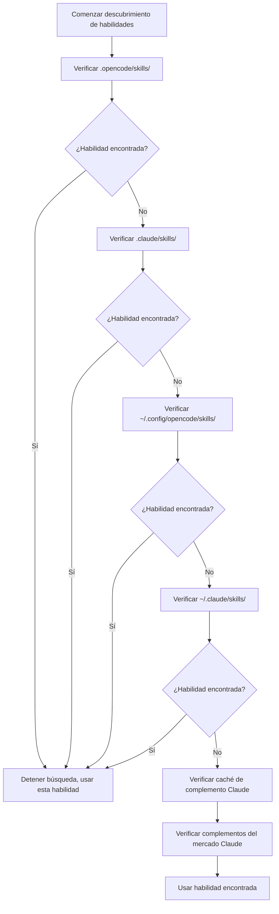

# Explicación detallada del mecanismo de descubrimiento de habilidades

## Lo que podrás hacer después de aprender

- Entender desde qué ubicaciones el complemento descubre automáticamente habilidades
- Dominar las reglas de prioridad del descubrimiento de habilidades
- Saber cómo permitir que las habilidades a nivel de proyecto sobrescriban las habilidades a nivel de usuario
- Conocer el mecanismo de compatibilidad con habilidades de Claude Code

## Tu problema actual

Has creado habilidades, pero la IA sigue diciendo que "no se encuentra la habilidad". No sabes en qué lugares el complemento buscará habilidades, ni qué sucederá con habilidades con el mismo nombre. El resultado es que las habilidades se colocaron en la ubicación incorrecta o fueron sobrescritas por habilidades de otras ubicaciones.

## Cuándo usar esta técnica

- Cuando necesitas que una habilidad específica funcione en un proyecto
- Cuando deseas sobrescribir habilidades a nivel de usuario o habilidades incluidas en el complemento
- Cuando reutilizas habilidades de Claude Code

## 🎒 Preparación antes de comenzar

::: warning Conocimientos previos
Por favor, completa primero [Instalación de OpenCode Agent Skills](../../start/installation/).
:::

## Idea central

OpenCode Agent Skills descubre automáticamente habilidades desde múltiples ubicaciones y las busca en orden de prioridad. **La primera habilidad encontrada entra en vigor y las habilidades con el mismo nombre subsiguientes se ignoran**. Esto te permite sobrescribir habilidades a nivel de usuario en proyectos para lograr personalización.

### Visión general de rutas de descubrimiento



::: info Unicidad de nombres de habilidades
Solo se conservará la primera habilidad con el mismo nombre encontrada, y las posteriores se ignorarán. Esto significa que `git-helper` a nivel de proyecto sobrescribirá `git-helper` a nivel de usuario.
:::

## Sígueme

### Paso 1: Ver la lógica de descubrimiento de habilidades

**Por qué**
Entender cómo el complemento escanea los directorios de habilidades puede ayudarte a localizar problemas.

Ver la definición de rutas de descubrimiento en el código fuente:

```typescript
// src/skills.ts:241-246
const discoveryPaths: DiscoveryPath[] = [
  { path: path.join(directory, '.opencode', 'skills'), label: 'project', maxDepth: 3 },
  { path: path.join(directory, '.claude', 'skills'), label: 'claude-project', maxDepth: 1 },
  { path: path.join(homedir(), '.config', 'opencode', 'skills'), label: 'user', maxDepth: 3 },
  { path: path.join(homedir(), '.claude', 'skills'), label: 'claude-user', maxDepth: 1 }
];
```

**Deberías ver**:
- 4 rutas de descubrimiento locales, cada una con `label` (identificador de origen) y `maxDepth` (profundidad máxima de recursión)
- Además hay 2 rutas de complementos Claude (caché y complementos del mercado), descubiertas a través de `discoverPluginCacheSkills()` y `discoverMarketplaceSkills()`
- `directory` es el directorio raíz del proyecto, `homedir()` es el directorio principal del usuario

### Paso 2: Entender el mecanismo de búsqueda recursiva

**Por qué**
Entender el límite de profundidad de recursión puede ayudarte a evitar colocar habilidades demasiado profundas para que no se encuentren.

La función de búsqueda recursiva recorrerá el árbol de directorios buscando archivos `SKILL.md`:

```typescript
// src/skills.ts:182-207
async function recurse(dir: string, depth: number, relPath: string) {
  if (depth > maxDepth) return;  // Excede el límite de profundidad, detener búsqueda

  const entries = await fs.readdir(dir, { withFileTypes: true });
  for (const entry of entries) {
    const fullPath = path.join(dir, entry.name);
    const stats = await fs.stat(fullPath);

    if (!stats.isDirectory()) continue;  // Omitir archivos

    const newRelPath = relPath ? `${relPath}/${entry.name}` : entry.name;
    const found = await findFile(fullPath, newRelPath, 'SKILL.md');

    if (found) {
      results.push({ ...found, label });  // Habilidad encontrada, agregar resultado
    } else {
      await recurse(fullPath, depth + 1, newRelPath);  // Búsqueda recursiva en subdirectorios
    }
  }
}
```

**Deberías ver**:
- La profundidad de cada directorio comienza desde 0, si excede `maxDepth` se detiene
- Si se encuentra `SKILL.md` se devuelve, de lo contrario continúa buscando subdirectorios

**Profundidad de recursión en diferentes ubicaciones**:

| Ubicación | Label | Profundidad máxima | Descripción |
|--- | --- | --- | ---|
| `.opencode/skills/` | project | 3 | Admite estructura de directorios anidados |
| `.claude/skills/` | claude-project | 1 | Solo escanea la primera capa |
| `~/.config/opencode/skills/` | user | 3 | Admite estructura de directorios anidados |
| `~/.claude/skills/` | claude-user | 1 | Solo escanea la primera capa |


### Paso 3: Entender las reglas de deduplicación

**Por qué**
Solo se conservará una habilidad con el mismo nombre, conocer esta regla puede evitar que las habilidades se sobrescriban.

La lógica de deduplicación está en la función `discoverAllSkills`:

```typescript
// src/skills.ts:255-262
const skillsByName = new Map<string, Skill>();
for (const { filePath, relativePath, label } of allResults) {
  const skill = await parseSkillFile(filePath, relativePath, label);
  if (!skill || skillsByName.has(skill.name)) continue;  // Omitir habilidades con el mismo nombre existentes
  skillsByName.set(skill.name, skill);
}
```

**Deberías ver**:
- Se utiliza `Map` para almacenar según `skill.name`, garantizando unicidad
- `skillsByName.has(skill.name)` verifica si ya existe una habilidad con el mismo nombre
- Las habilidades con el mismo nombre posteriores se ignoran (`continue`)

**Ejemplo de escenario**:

```
Estructura del proyecto:
.opencode/skills/git-helper/SKILL.md  ← Primero encontrado, entra en vigor
~/.config/opencode/skills/git-helper/SKILL.md  ← Mismo nombre, ignorado
```

### Paso 4: Analizar archivos SKILL.md

**Por qué**
Entender las reglas de análisis de SKILL.md puede ayudarte a evitar errores de formato.

El complemento analizará el YAML frontmatter de SKILL.md:

```typescript
// src/skills.ts:132-152
const frontmatterMatch = content.match(/^---\n([\s\S]*?)\n---\n([\s\S]*)$/);
if (!frontmatterMatch?.[1] || !frontmatterMatch?.[2]) {
  return null;  // Error de formato, omitir
}

const frontmatterText = frontmatterMatch[1];
const skillContent = frontmatterMatch[2].trim();

let frontmatterObj: unknown;
try {
  frontmatterObj = parseYamlFrontmatter(frontmatterText);
} catch {
  return null;  // Error de análisis de YAML, omitir
}

let frontmatter: SkillFrontmatter;
try {
  frontmatter = SkillFrontmatterSchema.parse(frontmatterObj);
} catch (error) {
  return null;  // Falló la validación, omitir
}
```

**Deberías ver**:
- Frontmatter debe estar rodeado por `---`
- El contenido de YAML debe cumplir con la validación de Zod Schema
- Las habilidades que fallen el análisis se ignoran (sin error, continuar descubriendo otras habilidades)

**Reglas de validación de Frontmatter**:

```typescript
// src/skills.ts:106-114
const SkillFrontmatterSchema = z.object({
  name: z.string()
    .regex(/^[\p{Ll}\p{N}-]+$/u, { message: "Name must be lowercase alphanumeric with hyphens" })
    .min(1, { message: "Name cannot be empty" }),
  description: z.string()
    .min(1, { message: "Description cannot be empty" }),
  license: z.string().optional(),
  "allowed-tools": z.array(z.string()).optional(),
  metadata: z.record(z.string(), z.string()).optional()
});
```

**Normas de nomenclatura**:
- Solo se permiten letras minúsculas, números y guiones (`-`)
- No se permiten espacios, letras mayúsculas ni guiones bajos

| ❌ Nombre de habilidad incorrecto | ✅ Nombre de habilidad correcto |
|--- | ---|
| `MySkill` | `my-skill` |
| `git_helper` | `git-helper` |
| `Git Helper` | `git-helper` |


### Paso 5: Descubrir scripts ejecutables

**Por qué**
Las habilidades pueden contener scripts automatizados, entender el mecanismo de descubrimiento de scripts puede ayudarte a configurar correctamente.

El complemento escaneará recursivamente el directorio de habilidades buscando archivos ejecutables:

```typescript
// src/skills.ts:61-93
const scripts: Script[] = [];
const skipDirs = new Set(['node_modules', '__pycache__', '.git', '.venv', 'venv', '.tox', '.nox']);

async function recurse(dir: string, depth: number, relPath: string) {
  if (depth > maxDepth) return;

  const entries = await fs.readdir(dir, { withFileTypes: true });
  for (const entry of entries) {
    if (entry.name.startsWith('.')) continue;  // Omitir directorios ocultos
    if (skipDirs.has(entry.name)) continue;    // Omitir directorios de dependencias

    const fullPath = path.join(dir, entry.name);
    const stats = await fs.stat(fullPath);

    if (stats.isDirectory()) {
      await recurse(fullPath, depth + 1, newRelPath);
    } else if (stats.isFile()) {
      if (stats.mode & 0o111) {  // Verificar bit ejecutable
        scripts.push({
          relativePath: newRelPath,
          absolutePath: fullPath
        });
      }
    }
  }
}
```

**Deberías ver**:
- Solo se escanean archivos con bit ejecutable (`0o111`)
- Omitir automáticamente directorios ocultos y directorios de dependencias comunes
- Profundidad máxima de recursión de 10 niveles

**Reglas de descubrimiento de scripts**:

| Regla | Descripción |
|--- | ---|
| Verificación de bit ejecutable | Los archivos deben tener permiso de ejecución (`chmod +x`) |
| Omitir directorios ocultos | No escanear directorios como `.git`, `.venv` |
| Omitir directorios de dependencias | No escanear `node_modules`, `__pycache__`, etc. |
| Profundidad máxima de 10 niveles | Anidamientos de más de 10 niveles no se escanearán |

### Paso 6: Compatibilidad con complementos de Claude Code

**Por qué**
Entender el mecanismo de compatibilidad con complementos de Claude Code puede ayudarte a reutilizar habilidades existentes.

El complemento escaneará el caché de complementos de Claude Code y el directorio de instalación del mercado:

```typescript
// src/claude.ts:115-145
async function discoverMarketplaceSkills(): Promise<LabeledDiscoveryResult[]> {
  const claudeDir = path.join(homedir(), ".claude", "plugins");
  const installedPath = path.join(claudeDir, "installed_plugins.json");

  let installed: InstalledPlugins;
  try {
    const content = await fs.readFile(installedPath, "utf-8");
    installed = JSON.parse(content);
  } catch {
    return [];
  }

  const isV2 = installed.version === 2;

  for (const pluginKey of Object.keys(installed.plugins || {})) {
    const pluginData = installed.plugins[pluginKey];
    if (!pluginData) continue;

    if (isV2 || Array.isArray(pluginData)) {
      // v2 format: use installPath directly from each installation entry
      const installPaths = getPluginInstallPaths(pluginData);
      for (const installPath of installPaths) {
        const skills = await discoverSkillsFromPluginDir(installPath);
        results.push(...skills);
      }
    } else {
      // v1 format: use marketplace manifest to find skills
      // ...
    }
  }
}
```

**Deberías ver**:
- Lee el archivo `installed_plugins.json` de Claude Code
- Soporta dos formatos de complementos: v1 y v2
- Escanea archivos `SKILL.md` desde la ruta de instalación del complemento

**Estructura de complementos de Claude Code**:

Estructura del directorio de caché (caché de complementos):

```
~/.claude/plugins/
├── cache/                    # Caché de complementos
│   ├── plugin-name/         # Estructura v1
│   │   └── skills/
│   │       └── skill-name/SKILL.md
│   └── marketplace-name/    # Estructura v2
│       └── plugin-name/
│           └── version/
│               └── skills/
│                   └── skill-name/SKILL.md
└── installed_plugins.json   # Lista de instalación de complementos
```

**Complementos del mercado (v2)**:
- La ruta real del complemento se lee del campo `installPath` de `installed_plugins.json`
- La ruta no es fija, puede ser cualquier ubicación en los ámbitos `managed`, `user`, `project` o `local`
- Bajo cada directorio de complemento hay un subdirectorio `skills/` que contiene cada habilidad


## Punto de control ✅

Verifica que has dominado el mecanismo de descubrimiento de habilidades:

- [ ] Conoces el orden de prioridad de las 6 rutas de descubrimiento de habilidades
- [ ] Entiendes que solo se conserva la primera habilidad encontrada con el mismo nombre
- [ ] Conoces los límites de profundidad de recursión en diferentes ubicaciones
- [ ] Entiendes las reglas de validación de SKILL.md
- [ ] Sabes cómo permitir que las habilidades a nivel de proyecto sobrescriban las habilidades a nivel de usuario

## Advertencias de problemas comunes

### ❌ Habilidad colocada en ubicación incorrecta

**Problema**: La habilidad se coloca en `~/.config/opencode/skills/`, pero hay una habilidad con el mismo nombre en el proyecto, lo que provoca que se sobrescriba.

**Solución**: Coloca habilidades específicas del proyecto en `.opencode/skills/` para asegurar la prioridad más alta.

### ❌ Nombre de habilidad no cumple con las normas

**Problema**: El campo `name` en SKILL.md contiene letras mayúsculas o espacios, lo que provoca un fallo de análisis.

**Solución**: Asegúrate de que el nombre de la habilidad cumpla con la norma `lowercase-alphanumeric-with-hyphens`, como `git-helper`.

### ❌ Script sin permisos de ejecución

**Problema**: El script de habilidad no puede ser ejecutado por la herramienta `run_skill_script`.

**Solución**: Agrega permisos de ejecución al script:
```bash
chmod +x tools/build.sh
```

### ❌ Habilidad colocada demasiado profunda para ser encontrada

**Problema**: La habilidad se coloca en `~/.config/opencode/skills/category/subcategory/skill/`, excediendo el límite de profundidad de recursión.

**Solución**: Asegúrate de que la profundidad del directorio de la habilidad no exceda el límite `maxDepth` de la ubicación correspondiente.


## Resumen de esta lección

OpenCode Agent Skills descubre automáticamente habilidades desde múltiples ubicaciones y las busca en orden de prioridad:

1. **Orden de prioridad** (de mayor a menor): `.opencode/skills/` → `.claude/skills/` → `~/.config/opencode/skills/` → `~/.claude/skills/` → Caché de complementos Claude (`~/.claude/plugins/cache/`) → Complementos del mercado Claude (leer ruta de instalación desde `installed_plugins.json`)

2. **Regla de deduplicación**: Solo se conserva la primera habilidad encontrada con el mismo nombre, las habilidades a nivel de proyecto sobrescribirán las habilidades a nivel de usuario.

3. **Profundidad de recursión**: La profundidad de recursión varía según la ubicación, si las habilidades se colocan demasiado profundamente pueden no encontrarse.

4. **Validación de formato**: El frontmatter de SKILL.md debe cumplir con la validación de Zod Schema, de lo contrario se ignorará.

5. **Descubrimiento de scripts**: Solo los archivos con bit ejecutable serán reconocidos como scripts.

## Vista previa de la próxima lección

> En la próxima lección aprenderemos **[Consultar y listar habilidades disponibles](../listing-available-skills/)**.
>
> Aprenderás:
> - Usar la herramienta `get_available_skills` para ver todas las habilidades disponibles
> - Entender el uso de espacios de nombres de habilidades
> - Cómo usar coincidencia aproximada para buscar habilidades

---


## Apéndice: Referencia de código fuente

<details>
<summary><strong>Haz clic para expandir y ver ubicaciones del código fuente</strong></summary>

> Fecha de actualización: 2026-01-24

| Función | Ruta de archivo | Número de línea |
|--- | --- | ---|
| Definición de rutas de descubrimiento | [`src/skills.ts`](https://github.com/joshuadavidthomas/opencode-agent-skills/blob/main/src/skills.ts#L241-L246) | 241-246 |
| Descubrir todas las habilidades | [`src/skills.ts`](https://github.com/joshuadavidthomas/opencode-agent-skills/blob/main/src/skills.ts#L240-L263) | 240-263 |
| Búsqueda recursiva de habilidades | [`src/skills.ts`](https://github.com/joshuadavidthomas/opencode-agent-skills/blob/main/src/skills.ts#L176-L218) | 176-218 |
| Enumeración SkillLabel | [`src/skills.ts`](https://github.com/joshuadavidthomas/opencode-agent-skills/blob/main/src/skills.ts#L30) | 30 |
| Lógica de deduplicación | [`src/skills.ts`](https://github.com/joshuadavidthomas/opencode-agent-skills/blob/main/src/skills.ts#L255-L262) | 255-262 |
| Análisis de Frontmatter | [`src/skills.ts`](https://github.com/joshuadavidthomas/opencode-agent-skills/blob/main/src/skills.ts#L122-L167) | 122-167 |
| Validación de Schema | [`src/skills.ts`](https://github.com/joshuadavidthomas/opencode-agent-skills/blob/main/src/skills.ts#L105-L114) | 105-114 |
| Descubrimiento de scripts | [`src/skills.ts`](https://github.com/joshuadavidthomas/opencode-agent-skills/blob/main/src/skills.ts#L59-L99) | 59-99 |
| Descubrimiento de complementos del mercado Claude | [`src/claude.ts`](https://github.com/joshuadavidthomas/opencode-agent-skills/blob/main/src/claude.ts#L115-L180) | 115-180 |
| Descubrimiento de complementos de caché Claude | [`src/claude.ts`](https://github.com/joshuadavidthomas/opencode-agent-skills/blob/main/src/claude.ts#L193-L253) | 193-253 |

**Constantes clave**:
- `maxDepth` (diferente valor según ubicación): límite de profundidad de recursión

**Funciones clave**:
- `discoverAllSkills()`: Descubre habilidades desde todas las rutas
- `findSkillsRecursive()`: Búsqueda recursiva de directorios de habilidades
- `parseSkillFile()`: Analiza archivos SKILL.md
- `discoverMarketplaceSkills()`: Descubre complementos del mercado Claude
- `discoverPluginCacheSkills()`: Descubre complementos de caché Claude

</details>
