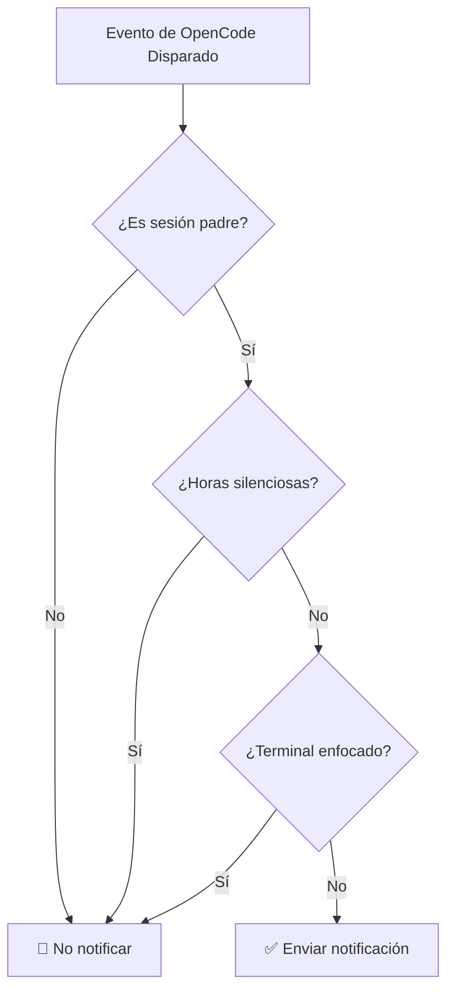

# Horas Silenciosas en Detalle: Evitar Interrupciones en Períodos Específicos

## Qué Aprenderás

- Habilitar horas silenciosas en el archivo de configuración para evitar interrupciones durante el descanso
- Comprender el principio de funcionamiento y la lógica de cálculo de tiempo de las horas silenciosas
- Configurar períodos que cruzan la medianoche (como 22:00 - 08:00)
- Entender la relación de prioridad entre las horas silenciosas y otros mecanismos de filtrado inteligente

## Tu Situación Actual

Probablemente hayas experimentado esto: a las 10 de la noche delegas una tarea a la IA y te vas a descansar. A las 2 de la madrugada la IA completa la tarea y el "ding" de la notificación te despierta. O durante la siesta le pides a la IA que procese algunos archivos, y a las 12:05 suena la notificación, interrumpiendo tu descanso.

::: info ¿Qué son las Horas Silenciosas?
Las horas silenciosas son una configuración de período de tiempo durante el cual opencode-notify deja de enviar todas las notificaciones, evitando recibir alertas en momentos en que no deseas ser interrumpido.
:::

## Cuándo Usar Esta Función

- **Descanso nocturno**: Configura 22:00 - 08:00 para evitar interrupciones mientras duermes
- **Hora de la siesta**: Configura 12:00 - 13:00 para evitar interrupciones durante el descanso del mediodía
- **Tiempo de trabajo concentrado**: Configura 09:00 - 12:00 para evitar que las notificaciones interrumpan tus reuniones
- **Fines de semana sin trabajo**: Configura todo el fin de semana como período silencioso

Las horas silenciosas son ideales para proteger tu tiempo de descanso o trabajo concentrado, permitiendo que la IA complete tareas en segundo plano mientras tú revisas los resultados cuando estés listo.

## Concepto Fundamental

El principio de funcionamiento de las horas silenciosas es simple:

1. **Verificación de hora**: Antes de cada envío de notificación, el plugin verifica si la hora actual está dentro del período silencioso configurado
2. **Soporte de períodos**: Soporta cualquier período de tiempo, incluyendo períodos que cruzan la medianoche (como 22:00 - 08:00)
3. **Prioridad media**: La verificación de horas silenciosas tiene menor prioridad que la verificación de sesión padre, pero mayor que la detección de enfoque del terminal. Si es una subsesión y `notifyChildSessions` es false, se omite directamente la verificación de horas silenciosas.

::: tip Horas Silenciosas vs Desactivación Temporal
Las horas silenciosas son una configuración de tiempo que se **repite periódicamente**, como cada noche de 10 PM a 8 AM. Si quieres **desactivar temporalmente** las notificaciones (por ejemplo, no quieres notificaciones durante la próxima hora), puedes establecer `"enabled": false` en el archivo de configuración, o eliminar el archivo de configuración para volver a los valores predeterminados.
:::

## Paso a Paso

### Paso 1: Abrir el Archivo de Configuración

El archivo de configuración se encuentra en: `~/.config/opencode/kdco-notify.json`

Si el archivo no existe, puedes crearlo primero:

::: code-group

```bash [macOS/Linux]
vim ~/.config/opencode/kdco-notify.json
```

```powershell [Windows]
notepad $env:USERPROFILE\.config\opencode\kdco-notify.json
```

:::

Deberías ver el contenido del archivo de configuración (si existe), o un archivo en blanco.

### Paso 2: Agregar la Configuración de Horas Silenciosas

Agrega o modifica la sección `quietHours` en el archivo de configuración:

```json
{
  "quietHours": {
    "enabled": true,
    "start": "22:00",
    "end": "08:00"
  }
}
```

**Descripción de opciones de configuración**:

| Opción | Tipo | Valor Predeterminado | Descripción |
| --- | --- | --- | ---|
| `enabled` | boolean | `false` | Si se habilitan las horas silenciosas |
| `start` | string | `"22:00"` | Hora de inicio del silencio, formato `"HH:MM"` |
| `end` | string | `"08:00"` | Hora de finalización del silencio, formato `"HH:MM"` |

### Paso 3: Guardar el Archivo de Configuración

Guarda el archivo y cierra el editor.

**Punto de verificación ✅**: Ejecuta el siguiente comando para verificar que el formato del archivo de configuración sea correcto:

```bash
cat ~/.config/opencode/kdco-notify.json | jq .
```

Deberías ver el contenido JSON formateado, sin mensajes de error.

::: tip ¿No tienes jq instalado?
Si el sistema no tiene el comando `jq`, puedes omitir esta verificación, o copiar el contenido JSON en un [validador JSON](https://jsonlint.com/) en el navegador para verificarlo.
:::

### Paso 4: Reiniciar OpenCode

Después de modificar el archivo de configuración, necesitas reiniciar OpenCode para que los cambios surtan efecto.

**Punto de verificación ✅**: Después de reiniciar, OpenCode recargará automáticamente la configuración.

### Paso 5: Probar las Horas Silenciosas

Para verificar que las horas silenciosas estén funcionando, puedes:

1. Establecer `start` y `end` con valores cercanos a la hora actual (por ejemplo, si son las 14:00, configura 13:55 - 14:05)
2. Delegar una tarea simple a la IA
3. Esperar a que la tarea se complete

Deberías ver: **Durante las horas silenciosas, no recibirás ninguna notificación**.

**Nota**: Si la hora actual no está dentro del período silencioso, o si `enabled` es `false`, recibirás notificaciones normalmente.

### Paso 6: Restaurar la Configuración Habitual

Después de la prueba, cambia la configuración de vuelta al período de tiempo habitual (por ejemplo, 22:00 - 08:00):

```json
{
  "quietHours": {
    "enabled": true,
    "start": "22:00",
    "end": "08:00"
  }
}
```

Guarda el archivo de configuración y reinicia OpenCode.

## Errores Comunes

### Error Común 1: Olvidar Habilitar las Horas Silenciosas

**Problema**: Configuraste `start` y `end`, pero sigues recibiendo notificaciones.

**Causa**: El campo `enabled` es `false` o no está establecido.

**Solución**: Asegúrate de que `enabled` esté establecido en `true`:

```json
{
  "quietHours": {
    "enabled": true,
    "start": "22:00",
    "end": "08:00"
  }
}
```

### Error Común 2: Formato de Hora Incorrecto

**Problema**: La configuración no funciona, o hay errores al iniciar.

**Causa**: El formato de hora no es `"HH:MM"`, o se usa el formato de 12 horas (AM/PM).

**Ejemplo incorrecto**:
```json
{
  "start": "10 PM",  // ❌ Error: AM/PM no soportado
  "end": "8:00"      // ⚠️ Funciona, pero se recomienda usar "08:00" para consistencia
}
```

**Ejemplo correcto**:
```json
{
  "start": "22:00",  // ✅ Correcto: formato 24 horas, se recomienda usar cero inicial
  "end": "08:00"     // ✅ Correcto: formato 24 horas, se recomienda usar cero inicial
}
```

### Error Común 3: Malentendido del Período que Cruza la Medianoche

**Problema**: Configuraste 22:00 - 08:00, pero descubres que algunos períodos durante el día también están silenciados.

**Causa**: Pensar erróneamente que `start` debe ser menor que `end`, causando un cálculo incorrecto del período.

**Comprensión correcta**:
- 22:00 - 08:00 significa: **desde las 10 PM hasta las 8 AM del día siguiente**
- Este es un período que cruza la medianoche, el plugin lo identifica automáticamente
- No es 08:00 - 22:00 (si lo configuras así, todo el día estará silenciado)

::: tip Verificación de Períodos que Cruzan la Medianoche
Si quieres verificar que el período que cruza la medianoche esté configurado correctamente, puedes establecer un período de prueba corto (por ejemplo, 10 minutos) en el archivo de configuración, y luego observar si no recibes notificaciones durante el período esperado.
:::

### Error Común 4: No Reiniciar OpenCode

**Problema**: Después de modificar el archivo de configuración, las horas silenciosas siguen funcionando con la configuración anterior.

**Causa**: El archivo de configuración se carga una vez al iniciar el plugin, no monitorea cambios en el archivo en tiempo real.

**Solución**: Después de cada modificación del archivo de configuración, debes reiniciar OpenCode para que los cambios surtan efecto.

## Relación entre Horas Silenciosas y Otros Mecanismos de Filtrado

Posición de las horas silenciosas en el mecanismo de filtrado inteligente:



**Puntos clave**:

1. **Prioridad media de las horas silenciosas**: La verificación de sesión padre tiene la prioridad más alta, las horas silenciosas son las siguientes. Si es una subsesión y `notifyChildSessions` es false, se omite directamente la verificación de horas silenciosas. Pero después de pasar la verificación de sesión padre, independientemente de si el terminal está enfocado, mientras esté dentro de las horas silenciosas, no se enviará notificación.
2. **Independiente de la detección de enfoque del terminal**: Incluso si el terminal no está enfocado, no se enviarán notificaciones durante las horas silenciosas
3. **Orden de ejecución**: La verificación de sesión padre se ejecuta antes que las horas silenciosas. Si la verificación de sesión padre pasa (es decir, es sesión padre o `notifyChildSessions` es true), entonces se continúa verificando las horas silenciosas.

::: warning Caso Especial: Solicitudes de Permisos y Preguntas
Las solicitudes de permisos (`permission.updated`) y las preguntas (`tool.execute.before`) en el código fuente **también están sujetas a las horas silenciosas**. Esto significa que durante las horas silenciosas, incluso si la IA está bloqueada esperando tu autorización o respuesta, no se enviará notificación.
:::

## Ejemplos de Configuración Comunes

### Ejemplo 1: Descanso Nocturno

Configura de 10 PM a 8 AM como período silencioso:

```json
{
  "quietHours": {
    "enabled": true,
    "start": "22:00",
    "end": "08:00"
  }
}
```

### Ejemplo 2: Hora de la Siesta

Configura de 12 PM a 1 PM como período silencioso:

```json
{
  "quietHours": {
    "enabled": true,
    "start": "12:00",
    "end": "13:00"
  }
}
```

### Ejemplo 3: Tiempo de Trabajo Concentrado

Configura de 9 AM a 12 PM como período silencioso (por ejemplo, para no ser interrumpido por notificaciones durante reuniones):

```json
{
  "quietHours": {
    "enabled": true,
    "start": "09:00",
    "end": "12:00"
  }
}
```

### Ejemplo 4: Configuración Completa

Usa las horas silenciosas junto con otras opciones de configuración:

```json
{
  "enabled": true,
  "notifyChildSessions": false,
  "suppressWhenFocused": true,
  "sounds": {
    "idle": "Glass",
    "error": "Basso",
    "permission": "Submarine"
  },
  "quietHours": {
    "enabled": true,
    "start": "22:00",
    "end": "08:00"
  },
  "terminal": "ghostty"
}
```

## Resumen de Esta Lección

Las horas silenciosas son una función importante de opencode-notify para evitar interrupciones durante períodos específicos:

1. **Método de configuración**: Configura la sección `quietHours` en `~/.config/opencode/kdco-notify.json`
2. **Formato de hora**: Usa el formato de 24 horas `"HH:MM"`, como `"22:00"` y `"08:00"`
3. **Soporte para cruzar medianoche**: Soporta períodos que cruzan la medianoche, como `"22:00" - "08:00"` significa de 10 PM a 8 AM del día siguiente
4. **Orden de ejecución**: Verificación de sesión padre → Horas silenciosas → Detección de enfoque del terminal. Las horas silenciosas solo surten efecto después de pasar la verificación de sesión padre
5. **Requiere reinicio**: Después de modificar el archivo de configuración, debes reiniciar OpenCode para que los cambios surtan efecto

Configurando adecuadamente las horas silenciosas, puedes dejar que la IA complete tareas silenciosamente durante tu tiempo de descanso o trabajo concentrado, y revisar los resultados cuando estés listo.

## Próxima Lección

> En la próxima lección aprenderemos **[Principio de Detección de Terminal](../terminal-detection/)**.
>
> Aprenderás:
> - Cómo opencode-notify detecta automáticamente el terminal que usas
> - Lista de más de 37 emuladores de terminal soportados
> - Método para especificar manualmente el tipo de terminal
> - Principio de implementación de la detección de enfoque en macOS

---

## Apéndice: Referencia del Código Fuente

<details>
<summary><strong>Haz clic para ver la ubicación del código fuente</strong></summary>

> Última actualización: 2026-01-27

| Función | Ruta del Archivo | Número de Línea |
| --- | --- | --- |
| Verificación de horas silenciosas | [`src/notify.ts`](https://github.com/kdcokenny/opencode-notify/blob/main/src/notify.ts#L181-L199) | 181-199 |
| Definición de interfaz de configuración | [`src/notify.ts`](https://github.com/kdcokenny/opencode-notify/blob/main/src/notify.ts#L30-L48) | 30-48 |
| Configuración predeterminada | [`src/notify.ts`](https://github.com/kdcokenny/opencode-notify/blob/main/src/notify.ts#L56-L68) | 56-68 |
| Verificación de silencio en procesamiento de tarea completada | [`src/notify.ts`](https://github.com/kdcokenny/opencode-notify/blob/main/src/notify.ts#L262) | 262 |
| Verificación de silencio en procesamiento de notificación de error | [`src/notify.ts`](https://github.com/kdcokenny/opencode-notify/blob/main/src/notify.ts#L300) | 300 |
| Verificación de silencio en procesamiento de solicitud de permisos | [`src/notify.ts`](https://github.com/kdcokenny/opencode-notify/blob/main/src/notify.ts#L323) | 323 |
| Verificación de silencio en procesamiento de preguntas | [`src/notify.ts`](https://github.com/kdcokenny/opencode-notify/blob/main/src/notify.ts#L341) | 341 |

**Constantes clave**:

- `DEFAULT_CONFIG.quietHours`: Configuración predeterminada de horas silenciosas (líneas 63-67)
  - `enabled: false`: Horas silenciosas deshabilitadas por defecto
  - `start: "22:00"`: Hora de inicio de silencio predeterminada
  - `end: "08:00"`: Hora de finalización de silencio predeterminada

**Funciones clave**:

- `isQuietHours(config: NotifyConfig): boolean`: Verifica si la hora actual está dentro del período silencioso (líneas 181-199)
  - Primero verifica si `config.quietHours.enabled` es `true`
  - Convierte la hora actual a minutos
  - Convierte las horas de inicio y fin a minutos
  - Maneja períodos que cruzan la medianoche (`startMinutes > endMinutes`)
  - Retorna `true` si está dentro del período silencioso, `false` si no

**Reglas de negocio**:

- BR-1-3: No enviar notificaciones durante horas silenciosas (`notify.ts:262`)
- BR-3-2: Las horas silenciosas soportan cruzar la medianoche (como 22:00-08:00) (`notify.ts:193-196`)
- BR-4-1: No enviar notificaciones cuando la hora actual está dentro del período silencioso (`notify.ts:182-198`)
- BR-4-2: Soporte para períodos que cruzan la medianoche (como 22:00-08:00) (`notify.ts:194-196`)

</details>
