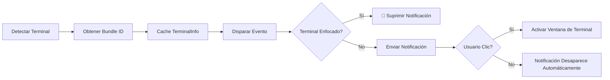
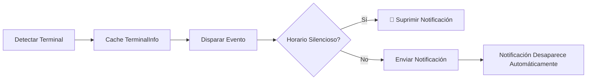

# Principios de Detección de Terminal: Mecanismos de Identificación Automática y Detección de Enfoque en macOS

## Lo Que Aprenderás

- Comprender en profundidad el mecanismo de funcionamiento e implementación de la detección automática de terminales
- Dominar los detalles técnicos de la detección de enfoque en macOS y la obtención dinámica de Bundle ID
- Aprender a anular manualmente el tipo de terminal para resolver problemas de detección fallida
- Entender las diferencias de detección entre diferentes plataformas (macOS/Windows/Linux)
- Leer e interpretar la implementación del código fuente relacionado con la detección de terminales

## Tu Situación Actual

Ya sabes que opencode-notify soporta 37+ terminales y que puedes especificar manualmente el tipo de terminal. Pero quieres entender más a fondo:

- ¿Cómo se implementa la detección de terminales en el nivel inferior?
- ¿A través de qué mecanismo se implementa la detección de enfoque en macOS?
- ¿Por qué macOS necesita obtener el Bundle ID mientras que Windows/Linux no lo necesitan?
- ¿Cómo maneja el plugin cuando la detección automática falla?
- ¿Cómo se identifican los multiplexores de terminales como tmux?

Esta lección te llevará al código fuente para responder estos detalles técnicos.

## Concepto Central

La implementación de la detección de terminales se divide en tres niveles:

```
1. Capa de Detección Automática: La biblioteca detect-terminal identifica el tipo de terminal
    ↓
2. Capa de Adaptación de Plataforma: Procesamiento específico para macOS/Windows/Linux
    ↓
3. Capa de Mejora de Funcionalidad: Detección de enfoque, clic para enfocar, obtención de Bundle ID
```

**Principios Clave de Diseño**:

- **Detección única al inicio**: El plugin detecta la terminal al iniciarse y almacena en caché el resultado para todas las notificaciones posteriores (optimización de rendimiento)
- **Prioridad a la configuración manual**: La configuración `terminal` especificada manualmente tiene prioridad sobre la detección automática
- **Manejo de degradación ante fallos**: Cuando la detección falla, no se bloquea el envío de notificaciones, solo se deshabilitan las funciones de filtrado inteligente
- **Adaptación a diferencias de plataforma**: macOS soporta funciones completas, Windows/Linux soportan notificaciones básicas

::: info ¿Por qué detectar al inicio?
La detección de terminales involucra escaneo de procesos, llamadas a osascript y otras operaciones. Si se detectara antes de cada notificación, causaría una sobrecarga significativa de rendimiento. Por eso el plugin detecta una vez al inicio, almacena en caché el objeto `TerminalInfo`, y todas las notificaciones posteriores reutilizan esta caché.
:::

## Proceso Completo de Detección de Terminales

### Análisis de Código Fuente: detectTerminalInfo()

Analicemos línea por línea la función de detección central:

```typescript
// src/notify.ts:145-164
async function detectTerminalInfo(config: NotifyConfig): Promise<TerminalInfo> {
    // Usa la anulación de configuración si se proporciona
    const terminalName = config.terminal || detectTerminal() || null

    if (!terminalName) {
        return { name: null, bundleId: null, processName: null }
    }

    // Obtiene el nombre del proceso para la detección de enfoque
    const processName = TERMINAL_PROCESS_NAMES[terminalName.toLowerCase()] || terminalName

    // Obtiene dinámicamente el Bundle ID desde macOS (¡sin codificación rígida!)
    const bundleId = await getBundleId(processName)

    return {
        name: terminalName,
        bundleId,
        processName,
    }
}
```

**Desglose de Pasos**:

| Paso | Código | Descripción |
| --- | --- | --- |
| 1 | `config.terminal \|\| detectTerminal()` | Prioriza la anulación de configuración, de lo contrario detecta automáticamente |
| 2 | `!terminalName ? return {...}` | Devuelve un objeto vacío cuando la detección falla |
| 3 | `TERMINAL_PROCESS_NAMES[...]` | Busca en la tabla de mapeo para obtener el nombre del proceso de macOS |
| 4 | `await getBundleId()` | macOS obtiene el Bundle ID dinámicamente |
| 5 | `return { name, bundleId, processName }` | Devuelve la información completa del terminal |

**Estructura `TerminalInfo` Devuelta**:

```typescript
interface TerminalInfo {
    name: string | null       // Nombre del terminal, como "ghostty"
    bundleId: string | null   // Bundle ID de macOS, como "com.mitchellh.ghostty"
    processName: string | null // Nombre del proceso de macOS, como "Ghostty"
}
```

::: details ¿Por qué macOS necesita tres campos?
- **name**: El nombre genérico del terminal (del detect-terminal)
- **processName**: El nombre del proceso en el administrador de procesos de macOS (para detección de enfoque)
- **bundleId**: El identificador único de la aplicación en macOS (para clic de enfoque)

Por ejemplo:
- `name = "ghostty"` (retornado por detect-terminal)
- `processName = "Ghostty"` (buscado en la tabla de mapeo)
- `bundleId = "com.mitchellh.ghostty"` (consultado dinámicamente por osascript)
:::

## Funcionamiento de la Biblioteca detect-terminal

### ¿Qué es detect-terminal?

`detect-terminal` es una biblioteca Node.js especializada en identificar emuladores de terminal, que escanea los procesos del sistema para identificar el terminal actualmente en ejecución.

**Métodos de Detección**:

1. **Escaneo de Procesos**: Verifica la cadena de procesos padre del proceso actual
2. **Detección de Variables de Entorno**: Verifica variables de entorno como `TERM`, `TERM_PROGRAM`
3. **Coincidencia con Nombres de Procesos Conocidos**: Compara con nombres de proceso de 37+ terminales conocidos

**Métodos de Detección Soportados**:

```typescript
// Lógica interna de detect-terminal (simplificada)
function detect() {
    // 1. Verifica variables de entorno
    if (process.env.TERM_PROGRAM) {
        return process.env.TERM_PROGRAM
    }

    // 2. Escanea la cadena de procesos padre
    const parentProcess = getParentProcess()
    if (isKnownTerminal(parentProcess.name)) {
        return parentProcess.name
    }

    // 3. Verifica variables de entorno específicas
    if (process.env.TMUX) return 'tmux'
    if (process.env.VSCODE_PID) return 'vscode'

    return null
}
```

**Número de Terminales Soportados**: 37+ (ver [lista completa](https://github.com/jonschlinkert/detect-terminal#supported-terminals))

## Procesamiento Especial para macOS

### 1. Tabla de Mapeo de Nombres de Proceso

El código fuente define un mapeo de nombres de terminal a nombres de proceso de macOS:

```typescript
// src/notify.ts:71-84
const TERMINAL_PROCESS_NAMES: Record<string, string> = {
    ghostty: "Ghostty",
    kitty: "kitty",
    iterm: "iTerm2",
    iterm2: "iTerm2",
    wezterm: "WezTerm",
    alacritty: "Alacritty",
    terminal: "Terminal",
    apple_terminal: "Terminal",
    hyper: "Hyper",
    warp: "Warp",
    vscode: "Code",
    "vscode-insiders": "Code - Insiders",
}
```

**¿Por qué se Necesita una Tabla de Mapeo?**

- El nombre de terminal retornado por detect-terminal puede estar en minúsculas o ser una abreviatura (como `"ghostty"`)
- El nombre del proceso en el administrador de procesos de macOS puede tener diferencias de mayúsculas/minúsculas (como `"Ghostty"`)
- Algunos terminales tienen múltiples formas de escritura (como `"iterm"` y `"iterm2"` que ambos corresponden a `"iTerm2"`)

**Lógica de Mapeo**:

```typescript
const processName = TERMINAL_PROCESS_NAMES[terminalName.toLowerCase()] || terminalName
```

- Primero convierte el nombre del terminal a minúsculas para buscar en la tabla de mapeo
- Si se encuentra, usa el nombre de proceso mapeado
- Si no se encuentra, usa el nombre de terminal original

### 2. Obtención Dinámica de Bundle ID

**Implementación en Código Fuente**:

```typescript
// src/notify.ts:135-137
async function getBundleId(appName: string): Promise<string | null> {
    return runOsascript(`id of application "${appName}"`)
}
```

**Comando osascript**:

```applescript
id of application "Ghostty"
-- Retorna: com.mitchellh.ghostty
```

**¿Por qué no Codificar los Bundle ID de Forma Rígida?**

Desventajas de la codificación rígida:
- ❌ Los Bundle ID pueden cambiar cuando se actualiza el terminal
- ❌ Requiere mantener manualmente una lista de Bundle ID para 37+ terminales
- ❌ Necesita actualizar el código cuando se lanza un nuevo terminal

Ventajas de la obtención dinámica:
- ✅ Se adapta automáticamente a los cambios de versión del terminal
- ✅ Reduce el costo de mantenimiento
- ✅ En teoría, soporta cualquier terminal de macOS

### 3. Implementación de Detección de Enfoque

**Implementación en Código Fuente**:

```typescript
// src/notify.ts:139-143
async function getFrontmostApp(): Promise<string | null> {
    return runOsascript(
        'tell application "System Events" to get name of first application process whose frontmost is true',
    )
}

// src/notify.ts:166-175
async function isTerminalFocused(terminalInfo: TerminalInfo): Promise<boolean> {
    if (!terminalInfo.processName) return false
    if (process.platform !== "darwin") return false

    const frontmost = await getFrontmostApp()
    if (!frontmost) return false

    // Comparación que no distingue entre mayúsculas y minúsculas
    return frontmost.toLowerCase() === terminalInfo.processName.toLowerCase()
}
```

**Comando osascript**:

```applescript
tell application "System Events" to get name of first application process whose frontmost is true
-- Retorna: Ghostty
```

**Flujo de Detección**:

```
1. Verificar plataforma: retorna false directamente si no es macOS
    ↓
2. Verificar processName: retorna false directamente si no hay nombre de proceso
    ↓
3. Obtener aplicación frontal: consultar a través de osascript
    ↓
4. Comparar nombres de proceso: no distingue entre mayúsculas y minúsculas
    ↓
5. Retornar resultado: true si es el mismo, false si es diferente
```

**Uso en el Flujo de Envío de Notificaciones**:

```typescript
// src/notify.ts:264-265
// Verificar si el terminal está enfocado (suprimir notificación si el usuario ya está mirando)
if (await isTerminalFocused(terminalInfo)) return
```

Cuando el terminal está en primer plano, el plugin suprime el envío de notificaciones para evitar recordatorios duplicados.

## Mecanismo de Anulación de Configuración

### ¿Cuándo Se Necesita la Anulación Manual?

**Escenarios Aplicables**:

1. **Fallo de detección automática**: detect-terminal no puede identificar tu terminal
2. **Escenarios de terminal anidada**: Usando Alacritty en tmux, deseas que se identifique como tmux
3. **Resultados de detección inexactos**: Identificación errónea como otro terminal

### Método de Configuración

**Archivo de Configuración**: `~/.config/opencode/kdco-notify.json`

```json
{
  "terminal": "ghostty"
}
```

**Lógica de Prioridad** (línea 147 del código fuente):

```typescript
const terminalName = config.terminal || detectTerminal() || null
```

**Orden de Prioridad**:

1. **Anulación de Configuración** (`config.terminal`): Prioridad más alta
2. **Detección Automática** (`detectTerminal()`): Segunda prioridad
3. **Manejo de Degradación** (`null`): Usa null cuando la detección falla

::: tip Escenarios Aplicables para Anulación de Configuración
Si tu terminal puede ser reconocida correctamente, **no se recomienda la anulación manual**. La anulación de configuración se usa principalmente para resolver fallos de detección o escenarios especiales.
:::

## Comparación de Diferencias entre Plataformas

### macOS

| Función | Soporte | Método de Implementación |
| --- | --- | --- |
| Notificación nativa | ✅ | node-notifier (NSUserNotificationCenter) |
| Detección de terminal | ✅ | Biblioteca detect-terminal |
| Detección de enfoque | ✅ | osascript consulta aplicación frontal |
| Clic para enfocar | ✅ | Parámetro activate de node-notifier |
| Obtención de Bundle ID | ✅ | Consulta dinámica de osascript |
| Sonido personalizado | ✅ | Parámetro sound de node-notifier |

**Flujo de Soporte Completo**:



### Windows

| Función | Soporte | Método de Implementación |
| --- | --- | --- |
| Notificación nativa | ✅ | node-notifier (SnoreToast) |
| Detección de terminal | ✅ | Biblioteca detect-terminal |
| Detección de enfoque | ❌ | Limitación del sistema |
| Clic para enfocar | ❌ | Limitación del sistema |
| Obtención de Bundle ID | ❌ | Windows no tiene este concepto |
| Sonido personalizado | ❌ | Usa sonido predeterminado del sistema |

**Flujo Simplificado**:



### Linux

| Función | Soporte | Método de Implementación |
| --- | --- | --- |
| Notificación nativa | ✅ | node-notifier (notify-send) |
| Detección de terminal | ✅ | Biblioteca detect-terminal |
| Detección de enfoque | ❌ | Limitación del sistema |
| Clic para enfocar | ❌ | Limitación del sistema |
| Obtención de Bundle ID | ❌ | Linux no tiene este concepto |
| Sonido personalizado | ❌ | Usa sonido predeterminado del entorno de escritorio |

**El flujo es el mismo que en Windows**, solo que el backend de notificaciones usa `notify-send`.

## Manejo de Fallas de Detección

### Lógica del Código Fuente

Cuando la detección falla, `detectTerminalInfo()` devuelve un objeto vacío:

```typescript
if (!terminalName) {
    return { name: null, bundleId: null, processName: null }
}
```

### Impacto en la Función de Notificación

| Función | Comportamiento Después de Falla de Detección |
| --- | --- |
| Notificación nativa | ✅ **Funciona normalmente** (no depende de la detección de terminal) |
| Detección de enfoque | ❌ **Fallida** (`isTerminalFocused()` retorna false directamente) |
| Clic para enfocar | ❌ **Fallida** (`bundleId` es null, no se establece el parámetro activate) |
| Horario silencioso | ✅ **Funciona normalmente** (independiente de la detección de terminal) |
| Verificación de sesión padre | ✅ **Funciona normalmente** (independiente de la detección de terminal) |

**Código de Ejemplo**:

```typescript
// src/notify.ts:166-175
async function isTerminalFocused(terminalInfo: TerminalInfo): Promise<boolean> {
    if (!terminalInfo.processName) return false  // ← Retorna false directamente cuando la detección falla
    if (process.platform !== "darwin") return false
    // ...
}

// src/notify.ts:238-240
if (process.platform === "darwin" && terminalInfo.bundleId) {
    notifyOptions.activate = terminalInfo.bundleId  // ← No se establece cuando bundleId es null
}
```

### ¿Cómo Verificar el Estado de Detección?

**Método de Depuración Temporal** (requiere modificar el código fuente):

```typescript
// Agregar en la exportación del plugin en notify.ts
export const NotifyPlugin: Plugin = async (ctx) => {
    const { client } = ctx
    const config = await loadConfig()
    const terminalInfo = await detectTerminalInfo(config)

    // 👇 Agregar registro de depuración
    console.log("Terminal Info:", JSON.stringify(terminalInfo, null, 2))

    return {
        // ...
    }
}
```

**Ejemplo de Salida Normal**:

```json
{
  "name": "ghostty",
  "bundleId": "com.mitchellh.ghostty",
  "processName": "Ghostty"
}
```

**Ejemplo de Falla de Detección**:

```json
{
  "name": null,
  "bundleId": null,
  "processName": null
}
```

## Escenario Especial: Terminal tmux

### Características Especiales de tmux

tmux es un multiplexor de terminal (terminal multiplexer) que permite crear múltiples sesiones y paneles en una ventana de terminal.

**Método de Detección**:

```typescript
// La biblioteca detect-terminal detecta tmux a través de variables de entorno
if (process.env.TMUX) return 'tmux'
```

**Impacto en el Flujo de Trabajo de tmux**:

Como se mencionó en `terminals/index.md`, la detección de enfoque no se realiza en flujos de trabajo de tmux. Esto se debe a que:

1. **Escenarios de múltiples ventanas**: tmux puede ejecutarse en múltiples ventanas de terminal
2. **Semántica de enfoque ambigua**: No se puede determinar en qué panel de tmux está enfocado el usuario
3. **Consideración de experiencia de usuario**: Evita suprimir notificaciones importantes

**Evidencia en Código Fuente** (función `handleQuestionAsked`):

```typescript
// src/notify.ts:340-341
// Guard: solo horario silencioso (sin verificación de enfoque para preguntas - flujo de trabajo tmux)
if (isQuietHours(config)) return
```

Nota: Para eventos de tipo `question`, el código fuente comenta explícitamente "sin verificación de enfoque para preguntas - flujo de trabajo tmux".

## Mejores Prácticas para Configuración Manual del Tipo de Terminal

### Elegir el Nombre de Terminal Apropiado

**Principio**: Usar el nombre estándar reconocido por la biblioteca detect-terminal.

**Tabla de Referencia Común**:

| Tu Terminal | Valor de Configuración | Resultado de Detección (detect-terminal) |
| --- | --- | --- |
| Ghostty | `"ghostty"` | ✅ |
| iTerm2 | `"iterm2"` o `"iterm"` | ✅ |
| Kitty | `"kitty"` | ✅ |
| WezTerm | `"wezterm"` | ✅ |
| Alacritty | `"alacritty"` | ✅ |
| macOS Terminal.app | `"terminal"` o `"apple_terminal"` | ✅ |
| Hyper | `"hyper"` | ✅ |
| Warp | `"warp"` | ✅ |
| VS Code Stable | `"vscode"` | ✅ |
| VS Code Insiders | `"vscode-insiders"` | ✅ |
| Windows Terminal | `"windows-terminal"` o `"Windows Terminal"` | ⚠️ Puede necesitar probar ambos |

### Verificar que la Configuración Esté Funcionando

**Método 1: Revisar Registros**

Si tienes habilitados los registros de depuración (ver arriba), deberías ver:

```json
{
  "name": "ghostty",  // ← Debería ser el nombre del terminal que configuraste
  "bundleId": "com.mitchellh.ghostty",
  "processName": "Ghostty"
}
```

**Método 2: Prueba de Funcionalidad**

1. Después de configurar el tipo de terminal, reinicia OpenCode
2. Inicia una tarea de IA
3. Cambia a otra ventana (deja que el terminal pierda el enfoque)
4. Espera a que la tarea se complete

Deberías ver: recibir una notificación, y al hacer clic en la notificación (macOS) se enfoca la ventana del terminal.

## Advertencias de Problemas Comunes

### Problema Común 1: La Detección Sigue Fallando Después de la Configuración

**Síntoma**: Configuraste `"terminal": "ghostty"`, pero la función de notificación es anormal.

**Pasos de Diagnóstico**:

1. **Verificar Formato JSON**:

```bash
cat ~/.config/opencode/kdco-notify.json | jq .
```

2. **Verificar Ortografía del Nombre del Terminal**:

- Asegúrate de usar minúsculas (como `"ghostty"` en lugar de `"Ghostty"`)
- Asegúrate de que sea un nombre soportado por detect-terminal

3. **Verificar si Reiniciaste OpenCode**:

Los cambios en el archivo de configuración deben reiniciar OpenCode para tener efecto.

### Problema Común 2: La Detección de Enfoque en macOS es Inexacta

**Síntoma**: La notificación aparece aunque el terminal esté en primer plano, o no aparece cuando el terminal está en segundo plano.

**Posibles Causas**:

1. **Nombre de Proceso no Coincide**:

Verifica si tu nombre de proceso de terminal está en la tabla de mapeo:

```typescript
const TERMINAL_PROCESS_NAMES: Record<string, string> = {
    // ... verifica si tu terminal está en la lista
}
```

2. **Fallo en la Ejecución de osascript**:

Prueba manualmente en el terminal:

```bash
osascript -e 'tell application "System Events" to get name of first application process whose frontmost is true'
```

Debería retornar el nombre de la aplicación actual en primer plano (como `Ghostty`).

3. **Sensibilidad a Mayúsculas/Minúsculas**:

El código fuente usa comparación que no distingue entre mayúsculas y minúsculas:

```typescript
return frontmost.toLowerCase() === terminalInfo.processName.toLowerCase()
```

Asegúrate de que el nombre del proceso en la tabla de mapeo coincida en mayúsculas/minúsculas con el nombre real del proceso.

### Problema Común 3: La Configuración Manual es Inefectiva en Windows/Linux

**Síntoma**: Configuras `"terminal": "xxx"` en Windows/Linux, pero la detección sigue fallando.

**Explicación**:

La detección de terminales en Windows/Linux depende de la biblioteca detect-terminal, y la función de anulación de configuración está implementada en el código fuente de manera multiplataforma. Si la configuración es inefectiva, las posibles causas son:

1. **Nombre de Terminal Incorrecto**: Asegúrate de usar un nombre soportado por detect-terminal
2. **Terminal no en Lista de Soporte**: Consulta la [lista completa de detect-terminal](https://github.com/jonschlinkert/detect-terminal#supported-terminals)

**Nota**: Windows/Linux no soportan detección de enfoque ni clic para enfocar, incluso si la configuración es correcta solo afecta la detección de terminal, no habilitará estas funciones.

### Problema Común 4: Detección Incorrecta en Escenarios de Terminal Anidada

**Escenario**: Usando Alacritty en tmux, deseas que se identifique como tmux.

**Síntoma**: La detección automática identifica `"alacritty"`, pero deseas que se identifique como `"tmux"`.

**Solución**:

Configura manualmente `"terminal": "tmux"`:

```json
{
  "terminal": "tmux"
}
```

**Nota**: Después de esta configuración, el plugin considerará que estás usando tmux y no realizará detección de enfoque (consistente con el flujo de trabajo de tmux).

## Resumen de Esta Lección

La detección de terminales es la base de la función de filtrado inteligente de opencode-notify:

1. **Flujo de Detección**: Detecta automáticamente la terminal al inicio a través de la biblioteca detect-terminal, almacena en caché el resultado
2. **Procesamiento Especial para macOS**:
   - Tabla de mapeo de nombres de proceso (`TERMINAL_PROCESS_NAMES`)
   - Obtención dinámica de Bundle ID (a través de osascript)
   - Detección de enfoque (consultar proceso de aplicación frontal)
3. **Anulación de Configuración**: La especificación manual del tipo de terminal tiene prioridad sobre la detección automática
4. **Diferencias entre Plataformas**:
   - macOS: Funciones completas (notificación + detección de enfoque + clic para enfocar)
   - Windows/Linux: Funciones de notificación básicas
5. **Manejo de Fallos**: Cuando la detección falla, no bloquea las notificaciones, solo deshabilita el filtrado inteligente
6. **Escenarios Especiales**: El flujo de trabajo de tmux no soporta detección de enfoque, evitando suprimir notificaciones importantes

**Ubicaciones Clave del Código Fuente**:

- `detectTerminalInfo()`: Función principal de detección de terminal (líneas 145-164)
- `TERMINAL_PROCESS_NAMES`: Tabla de mapeo de nombres de proceso de macOS (líneas 71-84)
- `getBundleId()`: Obtención dinámica de Bundle ID (líneas 135-137)
- `isTerminalFocused()`: Implementación de detección de enfoque (líneas 166-175)

## Vista Previa de la Siguiente Lección

> En la siguiente lección aprenderemos **[Uso Avanzado](../advanced-usage/)**.
>
> Aprenderás:
> - Consejos de configuración y mejores prácticas
> - Configuración de entornos de múltiples terminales
> - Recomendaciones de optimización de rendimiento
> - Uso colaborativo con otros plugins de OpenCode

---

## Apéndice: Referencia de Código Fuente

<details>
<summary><strong>Haz clic para expandir y ver ubicaciones del código fuente</strong></summary>

> Fecha de actualización: 2026-01-27

| Función | Ruta de Archivo | Líneas |
| --- | --- | --- |
| Función principal de detección de terminal | [`src/notify.ts`](https://github.com/kdcokenny/opencode-notify/blob/main/src/notify.ts#L145-L164) | 145-164 |
| Tabla de mapeo de nombres de proceso de macOS | [`src/notify.ts`](https://github.com/kdcokenny/opencode-notify/blob/main/src/notify.ts#L71-L84) | 71-84 |
| Obtención de Bundle ID de macOS | [`src/notify.ts`](https://github.com/kdcokenny/opencode-notify/blob/main/src/notify.ts#L135-L137) | 135-137 |
| Detección de aplicación frontal de macOS | [`src/notify.ts`](https://github.com/kdcokenny/opencode-notify/blob/main/src/notify.ts#L139-L143) | 139-143 |
| Detección de enfoque de macOS | [`src/notify.ts`](https://github.com/kdcokenny/opencode-notify/blob/main/src/notify.ts#L166-L175) | 166-175 |
| Envoltura de ejecución de osascript | [`src/notify.ts`](https://github.com/kdcokenny/opencode-notify/blob/main/src/notify.ts#L120-L133) | 120-133 |
| Definición de interfaz de configuración | [`src/notify.ts`](https://github.com/kdcokenny/opencode-notify/blob/main/src/notify.ts#L30-L54) | 30-54 |
| Detección de enfoque en manejo de finalización de tarea | [`src/notify.ts`](https://github.com/kdcokenny/opencode-notify/blob/main/src/notify.ts#L265) | 265 |
| Detección de enfoque en manejo de notificación de error | [`src/notify.ts`](https://github.com/kdcokenny/opencode-notify/blob/main/src/notify.ts#L303) | 303 |
| Detección de enfoque en manejo de solicitud de permiso | [`src/notify.ts`](https://github.com/kdcokenny/opencode-notify/blob/main/src/notify.ts#L326) | 326 |
| Configuración de clic para enfocar en macOS | [`src/notify.ts`](https://github.com/kdcokenny/opencode-notify/blob/main/src/notify.ts#L238-L240) | 238-240 |
| Detección de terminal al inicio del plugin | [`src/notify.ts`](https://github.com/kdcokenny/opencode-notify/blob/main/src/notify.ts#L364) | 364 |

**Constantes Clave**:

- `TERMINAL_PROCESS_NAMES`: Tabla de mapeo de nombres de terminal a nombres de proceso de macOS (líneas 71-84)
  - `ghostty: "Ghostty"`
  - `kitty: "kitty"`
  - `iterm: "iTerm2"` / `iterm2: "iTerm2"`
  - `wezterm: "WezTerm"`
  - `alacritty: "Alacritty"`
  - `terminal: "Terminal"` / `apple_terminal: "Terminal"`
  - `hyper: "Hyper"`
  - `warp: "Warp"`
  - `vscode: "Code"` / `"vscode-insiders": "Code - Insiders"`

**Funciones Clave**:

- `detectTerminalInfo(config: NotifyConfig): Promise<TerminalInfo>`: Función principal de detección de terminal (líneas 145-164)
  - Prioriza el uso de anulación de configuración (`config.terminal`)
  - Llama a la biblioteca detect-terminal para detección automática
  - Busca en la tabla de mapeo de nombres de proceso
  - Obtiene Bundle ID dinámicamente (macOS)
  - Retorna el objeto completo de información del terminal

- `isTerminalFocused(terminalInfo: TerminalInfo): Promise<boolean>`: Detecta si el terminal está enfocado (líneas 166-175)
  - Verifica la plataforma (solo macOS)
  - Verifica si existe processName
  - Obtiene la aplicación actual en primer plano (osascript)
  - Compara nombres de proceso sin distinguir mayúsculas/minúsculas
  - Retorna true cuando el terminal está en primer plano

- `getBundleId(appName: string): Promise<string | null>`: Obtención dinámica de Bundle ID de aplicación macOS (líneas 135-137)
  - Usa osascript para consultar el identificador de la aplicación
  - Retorna formato como `"com.mitchellh.ghostty"`

- `getFrontmostApp(): Promise<string | null>`: Obtener nombre de aplicación en primer plano de macOS (líneas 139-143)
  - Usa osascript para consultar System Events
  - Retorna el nombre del proceso de la aplicación en primer plano

- `runOsascript(script: string): Promise<string | null>`: Ejecución de comandos AppleScript (líneas 120-133)
  - Verificación de plataforma (solo macOS)
  - Usa Bun.spawn para ejecutar osascript
  - Captura y retorna la salida
  - Manejo de excepciones retornando null

**Reglas de Negocio**:

- BR-2-1: Usa la biblioteca detect-terminal para identificar 37+ terminales (`notify.ts:147`)
- BR-2-2: Tabla de mapeo de nombres de terminal a nombres de proceso de macOS (`notify.ts:71-84`)
- BR-2-3: Obtención dinámica de Bundle ID, sin codificación rígida (`notify.ts:135-137`)
- BR-2-4: Detección de sesión tmux a través de variable de entorno TMUX (implementación de biblioteca de detección)
- BR-1-2: Suprimir notificación cuando el terminal está enfocado (`notify.ts:265`)
- BR-1-6: macOS soporta enfocar terminal al hacer clic en notificación (`notify.ts:238-240`)

**Dependencias Externas**:

- [detect-terminal](https://github.com/jonschlinkert/detect-terminal): Biblioteca de detección de terminales, soporta 37+ emuladores de terminal
- [node-notifier](https://github.com/mikaelbr/node-notifier): Biblioteca de notificaciones nativas multiplataforma
- macOS osascript: Herramienta de línea de comandos del sistema, usada para ejecutar AppleScript

</details>
