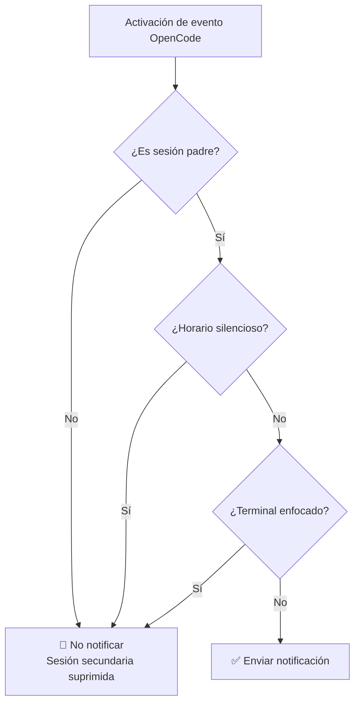
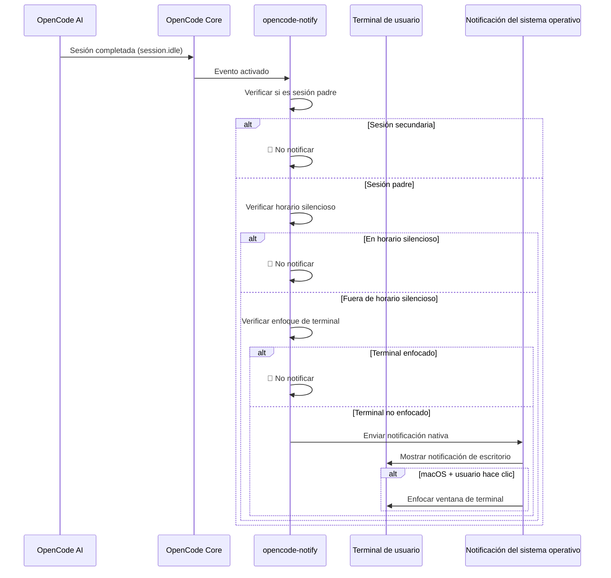

# Cómo funciona: Notificaciones, filtrado y mecanismos de activación

## Lo que podrás hacer tras completar esta lección

- Comprender los cuatro tipos de notificaciones de opencode-notify y sus momentos de activación
- Dominar el funcionamiento del mecanismo de filtrado inteligente (por qué no recibirás demasiadas notificaciones)
- Entender el flujo completo desde la activación hasta la visualización de notificaciones
- Saber cómo ajustar el comportamiento de notificaciones mediante la configuración

## Idea central

::: tip Filosofía de diseño
opencode-notify sigue un principio fundamental: **"Notifica al usuario cuando sea necesario, no por cada evento menor"**.
:::

El funcionamiento de este complemento puede descomponerse en tres eslabones clave:

1. **Escucha** - Espera eventos importantes de OpenCode
2. **Filtrado** - Determina si este evento requiere notificación
3. **Envío** - Te recuerda mediante notificaciones nativas del sistema operativo

Comprender este flujo te permitirá entender por qué el complemento puede recordarte oportunamente sin molestar constantemente como el spam.

## Cuatro tipos de notificaciones

opencode-notify escucha cuatro tipos de eventos OpenCode, cada uno con escenarios de activación claros:

### 1. Notificación de tarea completada (session.idle)

**Momento de activación**: Cuando la sesión de IA entra en estado inactivo (tarea completada)

| Elemento | Descripción |
|---|---|
| Título de notificación | Ready for review |
| Contenido de notificación | Título de la sesión (máx. 50 caracteres) |
| Sonido por defecto | Glass (macOS) |

**Por qué es importante**: Esta es la notificación más utilizada, te informa que la IA ha completado la tarea y puedes revisar los resultados.

### 2. Notificación de error (session.error)

**Momento de activación**: Cuando la ejecución de la sesión de IA produce un error

| Elemento | Descripción |
|---|---|
| Título de notificación | Something went wrong |
| Contenido de notificación | Resumen del error (máx. 100 caracteres) |
| Sonido por defecto | Basso (macOS) |

**Por qué es importante**: Los errores requieren atención inmediata; de lo contrario, las operaciones posteriores pueden no ejecutarse correctamente.

### 3. Notificación de solicitud de permiso (permission.updated)

**Momento de activación**: Cuando la IA requiere autorización del usuario para realizar una operación (como leer archivos o acceder a la red)

| Elemento | Descripción |
|---|---|
| Título de notificación | Waiting for you |
| Contenido de notificación | OpenCode needs your input |
| Sonido por defecto | Submarine (macOS) |

**Por qué es importante**: La IA está bloqueada y requiere autorización manual para continuar; si no se procesa, la tarea quedará bloqueada.

### 4. Notificación de pregunta (tool.execute.before)

**Momento de activación**: Cuando la IA utiliza la herramienta `question` para hacerte una pregunta

| Elemento | Descripción |
|---|---|
| Título de notificación | Question for you |
| Contenido de notificación | OpenCode needs your input |
| Sonido por defecto | Submarine (macOS) |

**Por qué es importante**: La IA necesita más información para continuar, como confirmar una decisión o aclarar un requisito.

::: info Prioridad de los cuatro tipos de notificaciones
Las solicitudes de permiso y las preguntas tienen la prioridad más alta, ya que la IA está completamente bloqueada en estos eventos; las notificaciones de error tienen prioridad media, ya que la tarea ha fallado; las notificaciones de tarea completada tienen prioridad relativamente baja, ya que puedes revisarlas cuando te convenga.
:::

## Mecanismo de filtrado inteligente

Este es el aspecto más destacado de opencode-notify: mediante filtrado multinivel, garantiza que solo recibas notificaciones que realmente requieren tu atención.

### Resumen de niveles de filtrado



### Nivel 1: Verificación de sesión padre

**Regla**: Por defecto, solo se notifican las sesiones padre (raíz), no las sesiones secundarias.

**Principio**: Las tareas de OpenCode pueden estar anidadas. Por ejemplo, si le pides a la IA que "optimice la base de código", puede dividirse en varias subtareas:
- Sesión padre: "Optimizar toda la base de código"
- Sesión secundaria 1: "Optimizar directorio src/components"
- Sesión secundaria 2: "Optimizar directorio src/utils"

Si todas las sesiones secundarias notificaran, recibirías un montón de notificaciones. opencode-notify solo notifica una vez cuando la sesión padre se completa.

::: tip ¿Cuándo necesitas notificaciones de sesiones secundarias?
Si estás monitoreando múltiples tareas concurrentes de una sola IA, puedes habilitar las notificaciones de sesiones secundarias configurando `notifyChildSessions: true`.
:::

**Excepciones especiales**:
- **Notificación de solicitud de permiso**: Siempre se notifica, sin verificar la sesión padre (ya que los problemas de permiso deben procesarse)
- **Notificación de pregunta**: Siempre se notifica, sin verificar la sesión padre

### Nivel 2: Verificación de horario silencioso

**Regla**: Durante el horario silencioso configurado, no se envían notificaciones.

**Principio**: Evitar molestar durante la noche o el tiempo de descanso. Ejemplo de configuración:

```json
{
  "quietHours": {
    "enabled": true,
    "start": "22:00",
    "end": "08:00"
  }
}
```

**Soporte para horarios que cruzan la medianoche**: El horario silencioso puede cruzar la medianoche; por ejemplo, `22:00 - 08:00` se identificará correctamente como de 10 PM a 8 AM del día siguiente.

::: info Prioridad de verificación de horario silencioso
La verificación de horario silencioso tiene prioridad sobre todas las demás verificaciones. Incluso si el terminal no está enfocado o es una sesión padre, no se enviará notificación durante el horario silencioso.
:::

### Nivel 3: Detección de enfoque del terminal

**Regla**: Cuando la ventana del terminal es la ventana activa actual, no se envían notificaciones.

**Principio**: Cuando estás viendo el terminal, las tareas completadas por la IA se mostrarán directamente en la pantalla, sin necesidad de notificaciones adicionales.

**Soporte de plataformas**:
- ✅ **macOS**: Soporte completo, detecta la aplicación frontal mediante `osascript`
- ❌ **Windows**: No soportado
- ❌ **Linux**: No soportado

**Mecanismo de detección** (macOS):
1. Usa la biblioteca `detect-terminal` para identificar tu terminal (soporta 37+ emuladores de terminal)
2. Consulta macOS para obtener la aplicación frontal actual
3. Compara si coincide con el nombre de proceso de tu terminal
4. Si coincide, suprime la notificación

**Excepciones especiales**:
- **Notificación de pregunta**: No realiza verificación de enfoque (soporta flujo de trabajo tmux)

::: tip Soporte para flujo de trabajo tmux
Si usas múltiples paneles en tmux, las notificaciones de pregunta no se suprimirán por detección de enfoque, asegurando que puedas recibir recordatorios mientras trabajas en otros paneles.
:::

### Función especial de macOS: Hacer clic en notificación para enfocar terminal

En macOS, las notificaciones tienen una función adicional: **después de hacer clic en una notificación, la ventana del terminal se colocará automáticamente en primer plano**.

**Principio**:
1. El complemento obtiene el Bundle ID de tu terminal mediante `osascript` (como `com.ghostty.Ghostty`)
2. Al enviar la notificación, establece la opción `activate` como ese Bundle ID
3. Al hacer clic en la notificación, el sistema enfocará automáticamente la aplicación correspondiente

**Terminales soportados**: Ghostty, Kitty, iTerm2, WezTerm, Alacritty, macOS Terminal, Hyper, Warp, VS Code Integrated Terminal, etc.

::: info Detección automática de terminal
El complemento detectará automáticamente el terminal que estás usando, sin necesidad de configuración manual. Si la detección automática falla, puedes especificar manualmente el campo `terminal` en el archivo de configuración.
:::

## Flujo de activación de notificaciones

### Diagrama de flujo completo



### Prioridad de manejo de eventos

Cuando se activan múltiples eventos simultáneamente, el complemento los procesa según la siguiente prioridad:

1. **Prioridad más alta**: Solicitud de permiso (`permission.updated`) - La IA está bloqueada, debe procesarse
2. **Prioridad alta**: Notificación de error (`session.error`) - La tarea ha fallado, requiere atención
3. **Prioridad baja**: Tarea completada (`session.idle`) - Puedes revisarlo más tarde
4. **Especial**: Pregunta (`tool.execute.before`) - La prioridad se decide según las necesidades reales

::: tip Manejo de notificaciones por lotes
Si se completan múltiples tareas simultáneamente, el complemento no enviará notificaciones individuales, sino una sola notificación (basada en la verificación de sesión padre). Esto evita la saturación de notificaciones.
:::

## Impacto de la configuración

A través del archivo de configuración, puedes ajustar cada nivel del mecanismo de filtrado:

| Configuración | Nivel afectado | Valor por defecto | Descripción |
|---|---|---|---|
| `notifyChildSessions` | Verificación de sesión padre | `false` | Establecer a `true` para habilitar notificaciones de sesiones secundarias |
| `quietHours.enabled` | Verificación de horario silencioso | `false` | Establecer a `true` para habilitar horario silencioso |
| `quietHours.start` | Verificación de horario silencioso | `"22:00"` | Hora de inicio del silencio |
| `quietHours.end` | Verificación de horario silencioso | `"08:00"` | Hora de fin del silencio |
| `terminal` | Detección de terminal | No establecido | Especificar manualmente el tipo de terminal (sobrescribe la detección automática) |

::: details Ejemplo de configuración

```json
{
  "enabled": true,
  "notifyChildSessions": false,
  "sounds": {
    "idle": "Glass",
    "error": "Basso",
    "permission": "Submarine"
  },
  "quietHours": {
    "enabled": true,
    "start": "22:00",
    "end": "08:00"
  },
  "terminal": "ghostty"
}
```

:::

## Resumen de esta lección

El funcionamiento de opencode-notify se puede resumir en:

1. **Cuatro tipos de notificaciones**: Tarea completada, error, solicitud de permiso, pregunta
2. **Filtrado inteligente de tres niveles**: Verificación de sesión padre → Verificación de horario silencioso → Verificación de enfoque de terminal
3. **Diferencias de plataforma**: macOS soporta detección de enfoque y clic para enfocar; Windows/Linux solo soporta notificaciones básicas
4. **Configuración flexible**: Ajusta los niveles de filtrado y comportamiento mediante archivos de configuración JSON

Este diseño garantiza la oportunidad y baja interferencia de las notificaciones: solo te recuerda cuando realmente te necesita, sin convertirse en otro centro de notificaciones que debas revisar frecuentemente.

## Avance de la próxima lección

> En la próxima lección aprenderemos **[Características de la plataforma macOS](../../platforms/macos/)**.
>
> Aprenderás:
> - El mecanismo de detección de enfoque exclusivo de macOS
> - Cómo configurar la función de enfoque al hacer clic en notificaciones
> - La lista completa de sonidos personalizables
> - Detalles de integración con el sistema nativo de macOS

---

## Apéndice: Referencia del código fuente

<details>
<summary><strong>Haz clic para ver la ubicación del código fuente</strong></summary>

> Última actualización: 2026-01-27

| Función | Ruta del archivo | Número de línea |
|---|---|---|
| Entrada principal del complemento | [`src/notify.ts`](https://github.com/kdcokenny/opencode-notify/blob/main/src/notify.ts#L357-L406) | 357-406 |
| Carga de configuración | [`src/notify.ts`](https://github.com/kdcokenny/opencode-notify/blob/main/src/notify.ts#L90-L114) | 90-114 |
| Configuración por defecto | [`src/notify.ts`](https://github.com/kdcokenny/opencode-notify/blob/main/src/notify.ts#L56-L68) | 56-68 |
| Detección de terminal | [`src/notify.ts`](https://github.com/kdcokenny/opencode-notify/blob/main/src/notify.ts#L145-L164) | 145-164 |
| Detección de enfoque de terminal | [`src/notify.ts`](https://github.com/kdcokenny/opencode-notify/blob/main/src/notify.ts#L166-L175) | 166-175 |
| Verificación de horario silencioso | [`src/notify.ts`](https://github.com/kdcokenny/opencode-notify/blob/main/src/notify.ts#L181-L199) | 181-199 |
| Detección de sesión padre | [`src/notify.ts`](https://github.com/kdcokenny/opencode-notify/blob/main/src/notify.ts#L205-L214) | 205-214 |
| Manejo de tarea completada | [`src/notify.ts`](https://github.com/kdcokenny/opencode-notify/blob/main/src/notify.ts#L249-L284) | 249-284 |
| Manejo de notificación de error | [`src/notify.ts`](https://github.com/kdcokenny/opencode-notify/blob/main/src/notify.ts#L286-L313) | 286-313 |
| Manejo de solicitud de permiso | [`src/notify.ts`](https://github.com/kdcokenny/opencode-notify/blob/main/src/notify.ts#L315-L334) | 315-334 |
| Manejo de pregunta | [`src/notify.ts`](https://github.com/kdcokenny/opencode-notify/blob/main/src/notify.ts#L336-L351) | 336-351 |
| Envío de notificación | [`src/notify.ts`](https://github.com/kdcokenny/opencode-notify/blob/main/src/notify.ts#L227-L243) | 227-243 |
| Detección de aplicación frontal de macOS | [`src/notify.ts`](https://github.com/kdcokenny/opencode-notify/blob/main/src/notify.ts#L139-L143) | 139-143 |
| Obtención de Bundle ID | [`src/notify.ts`](https://github.com/kdcokenny/opencode-notify/blob/main/src/notify.ts#L135-L137) | 135-137 |
| Mapeo de nombre de proceso de terminal | [`src/notify.ts`](https://github.com/kdcokenny/opencode-notify/blob/main/src/notify.ts#L71-L84) | 71-84 |

**Constantes clave**:

- `DEFAULT_CONFIG`: Configuración por defecto (líneas 56-68)
  - `notifyChildSessions: false`: Por defecto no notificar sesiones secundarias
  - `sounds.idle: "Glass"`: Sonido de tarea completada
  - `sounds.error: "Basso"`: Sonido de error
  - `sounds.permission: "Submarine"`: Sonido de solicitud de permiso
  - `quietHours.start: "22:00"`, `quietHours.end: "08:00"`: Horario silencioso por defecto

- `TERMINAL_PROCESS_NAMES`: Mapeo de nombres de terminal a nombres de proceso de macOS (líneas 71-84)

**Funciones clave**:

- `loadConfig()`: Carga y fusiona archivo de configuración con configuración por defecto
- `detectTerminalInfo()`: Detecta información del terminal (nombre, Bundle ID, nombre de proceso)
- `isTerminalFocused()`: Verifica si el terminal es la aplicación frontal actual (macOS)
- `isQuietHours()`: Verifica si la hora actual está dentro del horario silencioso
- `isParentSession()`: Verifica si la sesión es una sesión padre
- `sendNotification()`: Envía notificación nativa, soporta clic para enfocar en macOS
- `handleSessionIdle()`: Maneja evento de tarea completada
- `handleSessionError()`: Maneja evento de error
- `handlePermissionUpdated()`: Maneja evento de solicitud de permiso
- `handleQuestionAsked()`: Maneja evento de pregunta

**Reglas de negocio**:

- BR-1-1: Por defecto solo notificar sesiones padre, no sesiones secundarias (`notify.ts:256-259`)
- BR-1-2: Suprimir notificación cuando el terminal está enfocado (`notify.ts:265`)
- BR-1-3: No enviar notificación durante horario silencioso (`notify.ts:262`)
- BR-1-4: Las solicitudes de permiso siempre se notifican, sin verificar sesión padre (`notify.ts:319`)
- BR-1-5: Las preguntas no realizan verificación de enfoque, soportan flujo de trabajo tmux (`notify.ts:340`)
- BR-1-6: macOS soporta clic en notificación para enfocar terminal (`notify.ts:238-240`)

</details>
