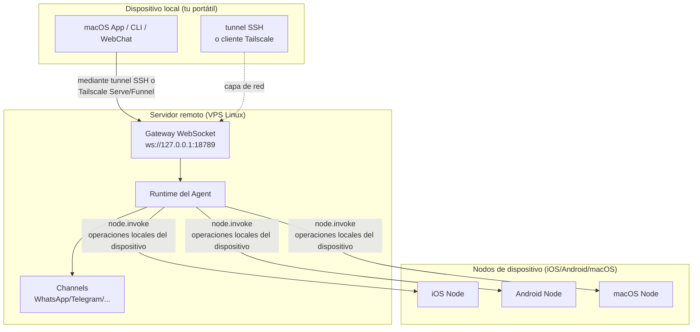

# Gateway Remoto: Acceso a Clawdbot mediante Tunnels SSH y Tailscale

## Lo que aprenderás

**Gateway Remoto** te permite superar las limitaciones del dispositivo y desplegar el asistente de IA en un servidor Linux siempre activo. Al finalizar este curso, podrás:

- ✅ Ejecutar Clawdbot Gateway en un servidor Linux o VPS
- ✅ Exponer de forma segura el Gateway a la red mediante Tailscale Serve/Funnel
- ✅ Conectar desde el cliente al Gateway remoto mediante tunnels SSH
- ✅ Comprender las diferencias arquitectónicas entre Gateway y Node (dónde se ejecuta exec, dónde se ejecutan las operaciones de dispositivo)
- ✅ Configurar políticas de acceso remoto seguras

## Tu problema actual

Es posible que tengas estos problemas:

- 🤔 "Mi portátil entra a menudo en suspensión, pero quiero que el asistente de IA esté siempre en línea"
- 🤔 "Quiero ejecutar Gateway en un VPS barato, pero no sé cómo acceder de forma segura"
- 🤔 "¿Cuál es la diferencia entre Tailscale Serve y Funnel? ¿Cuál debo usar?"
- 🤔 "Los tunnels SSH son demasiado engorrosos, ¿hay alguna solución más automatizada?"

## Cuándo usar esta técnica

**Gateway Remoto** es adecuado para estos escenarios:

| Escenario | Solución recomendada | Motivo |
|--- | --- | ---|
| Portátil que entra en suspensión con frecuencia, IA necesaria de forma permanente | **Tailscale Serve + VPS Linux** | El VPS no se suspende, acceso seguro a través de tailnet |
| Gateway ejecutándose en un equipo de escritorio doméstico, control remoto desde el portátil | **Tunnel SSH** o **Tailscale Serve** | Sesiones y configuración de Gateway unificadas |
| Necesidad de acceso desde la red pública (pruebas temporales) | **Tailscale Funnel + contraseña** | Exposición rápida, pero requiere protección con contraseña |
| Múltiples dispositivos compartiendo un único asistente de IA | **Gateway siempre activo** | Gestión centralizada de todas las sesiones, configuraciones e historiales |

::: warning Escenarios no recomendados
Si solo tienes un dispositivo y lo llevas contigo con frecuencia, **no necesitas** un Gateway remoto. Ejecuta Gateway directamente en tu máquina local.
:::

## 🎒 Preparativos

Antes de empezar, confirma lo siguiente:

- [ ] Has completado el curso **[Iniciar Gateway](/es/clawdbot/clawdbot/start/gateway-startup/)**
- [ ] Conoces los comandos básicos de SSH (opcional, si usas tunnels SSH)
- [ ] (Si usas Tailscale) Tienes instalado el CLI de Tailscale y has iniciado sesión
- [ ] Tienes preparado un servidor Linux remoto o un VPS (se recomienda Ubuntu/Debian)

---

## Idea central

### Arquitectura del Gateway Remoto

La idea central del Gateway remoto es: **El Gateway es el centro de control, el cliente es el terminal**.



### Tres conceptos clave

| Concepto | Explicación | Ejemplo |
|--- | --- | ---|
| **Host del Gateway** | Máquina que ejecuta el servicio Gateway, con sesiones, autenticación, canales y estado | VPS Linux, escritorio doméstico |
| **Cliente** | Herramienta que se conecta al Gateway (macOS App, CLI, WebChat) | Tu portátil, móvil |
| **Nodos de dispositivo** | Dispositivos externos conectados mediante el WebSocket de Gateway, que ejecutan operaciones locales del dispositivo | Dispositivo iOS, dispositivo Android, modo nodo de macOS |

### ¿Dónde se ejecutan los comandos?

Este es el punto de confusión más común:

| Tipo de operación | Dónde se ejecuta | Motivo |
|--- | --- | ---|
| Herramienta `exec` | **Host del Gateway** | Los comandos de Shell se ejecutan en la máquina del Gateway |
| Herramienta `browser` | **Host del Gateway** (o servidor de control del navegador separado) | El navegador se inicia en la máquina del Gateway |
| Operaciones de nodo (`camera.snap`, `system.run`) | **Nodos de dispositivo** | Necesitan acceder a recursos locales del dispositivo |

**Para recordar en una frase**:
- Host del Gateway → Ejecuta comandos generales y ejecuta IA
- Nodos de dispositivo → Ejecutan operaciones locales específicas del dispositivo

---

## Sígueme

### Paso 1: Instalar Clawdbot en el servidor remoto

**Por qué**
Los servidores Linux son más adecuados para ejecutar servicios de Gateway que estén en línea permanentemente.

Ejecuta en el servidor remoto:

```bash
# 1. Instalar Node.js (≥22)
curl -fsSL https://deb.nodesource.com/setup_22.x | sudo -E bash -
sudo apt-get install -y nodejs

# 2. Instalar Clawdbot
npm install -g @clawdbot/cli

# 3. Verificar la instalación
clawdbot --version
```

**Deberías ver**:
```
clawdbot CLI v<version>
```

### Paso 2: Ejecutar el asistente de integración

**Por qué**
Configurar rápidamente los ajustes básicos mediante el asistente interactivo.

```bash
clawdbot onboard
```

Sigue el asistente para completar:
- Selecciona un canal (por ejemplo, Telegram)
- Configura el modelo de IA (por ejemplo, OpenAI, Anthropic)
- Configura la autenticación del Gateway (Token o Password)

::: tip Recomendado
Configura `gateway.auth.mode: "password"` para facilitar la autenticación con contraseña al conectarte de forma remota:
```bash
export CLAWDBOT_GATEWAY_PASSWORD="your-secure-password"
```
:::

**Deberías ver**:
```
✅ Gateway configured successfully
✅ Channels configured: telegram
✅ AI model configured: openai:gpt-4o-mini
```

### Paso 3: Iniciar el demonio del Gateway

**Por qué**
El Gateway debe ejecutarse continuamente en segundo plano.

```bash
# Iniciar Gateway (por defecto se vincula a loopback: 127.0.0.1:18789)
clawdbot gateway start
```

**Deberías ver**:
```
🚀 Gateway starting...
📡 WebSocket: ws://127.0.0.1:18789
🔒 Auth mode: password
```

::: tip Inicio automático con systemd (Linux)
Crea el archivo de servicio `/etc/systemd/system/clawdbot.service`:

```ini
[Unit]
Description=Clawdbot Gateway
After=network.target

[Service]
Type=simple
User=your-user
ExecStart=/usr/bin/clawdbot gateway start
Restart=on-failure
RestartSec=5s
Environment="CLAWDBOT_GATEWAY_PASSWORD=your-secure-password"

[Install]
WantedBy=multi-user.target
```

Inicia el servicio:
```bash
sudo systemctl enable clawdbot
sudo systemctl start clawdbot
sudo systemctl status clawdbot
```
:::

---

### Opción A: Usar Tailscale Serve (recomendado)

#### Paso 4: Instalar e iniciar sesión en Tailscale

**Por qué**
Tailscale Serve proporciona acceso HTTPS seguro sin necesidad de una IP pública.

```bash
# Instalar CLI de Tailscale
curl -fsSL https://tailscale.com/install.sh | sh

# Iniciar sesión en Tailscale
sudo tailscale up
```

**Deberías ver**:
```
To authenticate, visit:

    https://login.tailscale.com/a/xxxxx

----------------------------------------------------
Copy the URL and open it in your browser.
```

#### Paso 5: Configurar Tailscale Serve

**Por qué**
Exponer el Gateway al tailnet mediante Tailscale Serve manteniendo el Gateway en loopback-only (lo más seguro).

Modifica el archivo de configuración `~/.clawdbot/clawdbot.json`:

```json5
{
  "gateway": {
    "bind": "loopback",
    "tailscale": {
      "mode": "serve",
      "resetOnExit": true
    },
    "auth": {
      "mode": "password"
    }
  }
}
```

**Explicación de la configuración**:
- `bind: "loopback"`: El Gateway solo escucha en el bucle local (lo más seguro)
- `tailscale.mode: "serve"`: Exponer al tailnet mediante Tailscale Serve
- `resetOnExit: true`: Revocar la configuración de Serve al salir

#### Paso 6: Reiniciar el Gateway

**Por qué**
Aplicar la nueva configuración de Tailscale.

```bash
# Si usas systemd
sudo systemctl restart clawdbot

# O reinicia directamente (si se está ejecutando en primer plano)
clawdbot gateway restart
```

**Deberías ver**:
```
🚀 Gateway starting...
📡 WebSocket: ws://127.0.0.1:18789
🌐 Tailscale Serve: https://your-tailnet-name.tailnet-name.ts.net/
🔒 Auth mode: password
```

#### Paso 7: Conectar desde el cliente

**Por qué**
Verificar que el Gateway remoto es accesible.

En el equipo del cliente:

1. **Asegúrate de haber unido el mismo tailnet de Tailscale**
2. **Acceder a la interfaz de control**:
    ```
    https://<magicdns>/  # o https://<tailnet-ip>:18789/
    ```
3. **Conectar WebSocket**:
    ```bash
    # Verificar la conexión
    clawdbot health --url ws://<tailnet-ip>:18789 --password your-secure-password
    ```

**Deberías ver**:
```
✅ Gateway is healthy
✅ Authenticated successfully
✅ Channels: telegram (connected)
```

---

### Opción B: Usar tunnels SSH (copia de seguridad universal)

#### Paso 4: Configurar la autenticación con claves SSH

**Por qué**
La autenticación con claves SSH es más segura que la con contraseña y permite automatizar la conexión.

Genera el par de claves en el equipo del cliente:

```bash
# Generar par de claves (si aún no lo has hecho)
ssh-keygen -t rsa -b 4096 -f ~/.ssh/clawdbot_gateway
```

**Deberías ver**:
```
Generating public/private rsa key pair.
Enter passphrase (empty for no passphrase): [pulsa Enter directamente]
Enter same passphrase again: [pulsa Enter directamente]
Your identification has been saved in ~/.ssh/clawdbot_gateway
Your public key has been saved in ~/.ssh/clawdbot_gateway.pub
```

#### Paso 5: Copiar la clave pública al servidor remoto

**Por qué**
Hacer que el servidor remoto confíe en la clave de tu cliente.

```bash
# Copiar la clave pública al servidor remoto
ssh-copy-id -i ~/.ssh/clawdbot_gateway.pub your-user@remote-server-ip
```

**Deberías ver**:
```
Number of key(s) added: 1
Now try logging into the machine with:   "ssh 'your-user@remote-server-ip'"
```

#### Paso 6: Crear la configuración de SSH

**Por qué**
Simplificar los comandos de conexión SSH para facilitar su uso posterior.

Edita `~/.ssh/config` en el equipo del cliente:

```txt
Host clawdbot-remote
    HostName <remote-server-ip>
    User your-user
    IdentityFile ~/.ssh/clawdbot_gateway
    LocalForward 18789 127.0.0.1:18789
    ServerAliveInterval 60
    ServerAliveCountMax 3
```

**Explicación de la configuración**:
- `LocalForward 18789 127.0.0.1:18789`: Reenviar el puerto local 18789 al puerto 18789 remoto
- `ServerAliveInterval 60`: Enviar un latido cada 60 segundos para mantener la conexión activa

#### Paso 7: Establecer el tunnel SSH

**Por qué**
Crear un canal seguro desde el local al Gateway remoto.

```bash
# Iniciar tunnel SSH (ejecución en segundo plano)
ssh -N -f clawdbot-remote
```

**Deberías ver**:
(Sin salida, el comando se ejecuta en segundo plano)

#### Paso 8: Verificar la conexión

**Por qué**
Confirmar que el tunnel SSH y el Gateway funcionan correctamente.

```bash
# Comprobar si el puerto local se ha reenviado correctamente
lsof -i :18789

# Probar la conexión con el Gateway
clawdbot health --url ws://127.0.0.1:18789 --password your-secure-password
```

**Deberías ver**:
```
COMMAND   PID   USER   FD   TYPE DEVICE SIZE/OFF NODE NAME
ssh      12345  user   4u  IPv4  0x1234      0t0  TCP *:18789 (LISTEN)

✅ Gateway is healthy
✅ Authenticated successfully
```

#### Paso 9: Inicio automático del tunnel SSH (macOS)

**Por qué**
Inicio automático al encender, sin necesidad de intervención manual.

Crea `~/Library/LaunchAgents/com.clawdbot.ssh-tunnel.plist`:

```xml
<?xml version="1.0" encoding="UTF-8"?>
<!DOCTYPE plist PUBLIC "-//Apple//DTD PLIST 1.0//EN" "http://www.apple.com/DTDs/PropertyList-1.0.dtd">
<plist version="1.0">
<dict>
    <key>Label</key>
    <string>com.clawdbot.ssh-tunnel</string>
    <key>ProgramArguments</key>
    <array>
        <string>/usr/bin/ssh</string>
        <string>-N</string>
        <string>-f</string>
        <string>clawdbot-remote</string>
    </array>
    <key>KeepAlive</key>
    <true/>
    <key>RunAtLoad</key>
    <true/>
</dict>
</plist>
```

Carga el Launch Agent:

```bash
launchctl bootstrap gui/$UID ~/Library/LaunchAgents/com.clawdbot.ssh-tunnel.plist
```

**Deberías ver**:
(Sin salida, el tunnel se ejecuta automáticamente en segundo plano)

::: tip Inicio automático en Linux (servicio de usuario de systemd)
Crea `~/.config/systemd/user/clawdbot-ssh-tunnel.service`:

```ini
[Unit]
Description=Clawdbot SSH Tunnel
After=network.target

[Service]
Type=simple
ExecStart=/usr/bin/ssh -N clawdbot-remote
Restart=on-failure
RestartSec=5s

[Install]
WantedBy=default.target
```

Inicia el servicio:
```bash
systemctl --user enable clawdbot-ssh-tunnel
systemctl --user start clawdbot-ssh-tunnel
```
:::

---

### Opción C: Usar Tailscale Funnel (acceso público, requiere contraseña)

::: danger Advertencia de seguridad
Tailscale Funnel expone el Gateway a la red pública.
- **Es obligatorio** usar autenticación con contraseña (`gateway.auth.mode: "password"`)
- **Solo se recomienda** para pruebas temporales, no es adecuado para entornos de producción
:::

#### Paso 4: Configurar Funnel

**Por qué**
Proporcionar acceso HTTPS público mediante Tailscale Funnel.

Modifica el archivo de configuración `~/.clawdbot/clawdbot.json`:

```json5
{
  "gateway": {
    "bind": "loopback",
    "tailscale": {
      "mode": "funnel",
      "resetOnExit": true
    },
    "auth": {
      "mode": "password",
      "password": "${CLAWDBOT_GATEWAY_PASSWORD}"
    }
  }
}
```

**Importante**:
- `tailscale.mode: "funnel"`: Usar Tailscale Funnel (acceso público)
- `auth.mode: "password"`: Funnel exige obligatoriamente una contraseña (de lo contrario, se rechaza el inicio)

#### Paso 5: Reiniciar el Gateway

```bash
sudo systemctl restart clawdbot
```

**Deberías ver**:
```
🚀 Gateway starting...
🌐 Tailscale Funnel: https://your-funnel-url.ts.net/
🔒 Auth mode: password
```

#### Paso 6: Conectar desde la red pública

```bash
clawdbot health --url wss://your-funnel-url.ts.net --password your-secure-password
```

---

## Punto de control ✅

Después de completar cualquiera de las opciones anteriores, verifica lo siguiente:

| Elemento a comprobar | Comando | Resultado esperado |
|--- | --- | ---|
| ¿El Gateway se está ejecutando? | `clawdbot gateway status` | ✅ Running |
| ¿El WebSocket es accesible? | `clawdbot health --url <url>` | ✅ Healthy |
| ¿Los canales están conectados? | `clawdbot channels status` | ✅ connected |
| ¿Se pueden emparejar los nodos? | `clawdbot nodes list` | Mostrar la lista de nodos |

---

## Advertencias sobre posibles problemas

### Trampa 1: Gateway vinculado a non-loopback

**Problema**:
```json5
{
  "gateway": {
    "bind": "lan"  // ❌ ¡Peligroso!
  }
}
```

**Consecuencia**:
- El Gateway escucha en la IP pública de la red local y cualquiera puede conectarse
- Si no hay autenticación configurada, **riesgo de seguridad grave**

**Solución correcta**:
```json5
{
  "gateway": {
    "bind": "loopback",  // ✅ Lo más seguro
    "tailscale": {
      "mode": "serve"  // ✅ Exponer mediante Tailscale Serve
    }
  }
}
```

### Trampa 2: Tailscale Funnel sin contraseña

**Problema**:
```json5
{
  "gateway": {
    "auth": {
      "mode": "token"  // ❌ ¡Funnel no lo permite!
    },
    "tailscale": {
      "mode": "funnel"
    }
  }
}
```

**Consecuencia**:
- El Gateway rechaza el inicio (Funnel exige obligatoriamente una contraseña)

**Solución correcta**:
```json5
{
  "gateway": {
    "auth": {
      "mode": "password",  // ✅ Funnel debe usar contraseña
      "password": "${CLAWDBOT_GATEWAY_PASSWORD}"
    },
    "tailscale": {
      "mode": "funnel"
    }
  }
}
```

### Trampa 3: Conflicto de puertos en el tunnel SSH

**Problema**:
```
channel_setup_fwd: listen 127.0.0.1:18789: cannot listen to port: Address already in use
```

**Causa**: El puerto local 18789 ya está en uso

**Solución**:
```bash
# Buscar el proceso que usa el puerto
lsof -i :18789

# Terminar el proceso en conflicto
kill -9 <PID>

# O usar otro puerto de reenvío (debes modificar también la URL del cliente)
ssh -N -L 18790:127.0.0.1:18789 clawdbot-remote
```

### Trampa 4: Remote de macOS App por SSH no funciona

**Problema**: macOS App muestra "Unable to connect to Gateway"

**Comprobaciones**:
1. ¿El tunnel SSH se está ejecutando?
    ```bash
    ps aux | grep "ssh -N clawdbot-remote" | grep -v grep
    ```
2. ¿El Token del Gateway está configurado?
    ```bash
    launchctl getenv CLAWDBOT_GATEWAY_TOKEN
    ```
3. ¿Los ajustes de la App son correctos?
    - Settings → General → "Clawdbot runs" → "On a remote machine over SSH"

**Solución**:
- Reiniciar el tunnel SSH
- Salir y reiniciar la App de macOS

---

## Resumen de la lección

### Puntos clave

- ✅ **Gateway Remoto** permite que el asistente de IA esté siempre en línea y que el cliente pueda conectarse en cualquier momento
- ✅ **Tailscale Serve** es la solución más segura (solo tailnet + HTTPS + loopback)
- ✅ **tunnel SSH** es la solución de copia de seguridad universal (no requiere Tailscale)
- ✅ **Tailscale Funnel** es adecuado para acceso público temporal (requiere contraseña obligatoria)
- ✅ El **Host del Gateway** ejecuta `exec` y comandos generales, los **nodos de dispositivo** ejecutan operaciones locales del dispositivo

### Comparación de configuraciones

| Solución | Seguridad | Alcance del acceso | Complejidad de configuración | Escenario recomendado |
|--- | --- | --- | --- | ---|
| Tailscale Serve | ⭐⭐⭐⭐⭐ | Tailnet | Media | **Recomendado**: Gateway siempre activo |
| Tunnel SSH | ⭐⭐⭐⭐ | Alcance de conexión SSH | Baja | Copia de seguridad universal, control remoto de escritorio doméstico |
| Tailscale Funnel | ⭐⭐ | Red pública | Baja | Pruebas temporales, Demo |

### Lista de verificación de seguridad

- [ ] Gateway vinculado a `loopback`
- [ ] Tailscale Funnel usa autenticación con contraseña
- [ ] Claves SSH configuradas (si usas tunnels SSH)
- [ ] Contraseña establecida mediante variables de entorno (no escrita en archivo de configuración)
- [ ] Ejecuta `clawdbot security audit` con regularidad

---

## Próximo anuncio

> En la próxima lección aprenderemos **[Plataforma de Habilidades y ClawdHub](../skills-platform/)**.
>
> Aprenderás:
> - Concepto del sistema de habilidades (Bundled/Managed/Workspace)
> - Cómo instalar habilidades de terceros desde ClawdHub
> - Cómo crear y gestionar habilidades personalizadas
> - Mecanismos de permisos y aislamiento de habilidades

---

## Apéndice: Referencia del código fuente

<details>
<summary><strong>Haz clic para expandir la ubicación del código fuente</strong></summary>

> Última actualización: 2026-01-27

| Función | Ruta del archivo | Líneas |
|--- | --- | ---|
| Esquema de configuración remota de Gateway | [`src/config/types.gateway.ts`](https://github.com/clawdbot/clawdbot/blob/main/src/config/types.gateway.ts) | 200-220 |
| Esquema de configuración de Tailscale de Gateway | [`src/config/types.gateway.ts`](https://github.com/clawdbot/clawdbot/blob/main/src/config/types.gateway.ts) | 150-180 |
| Integración de Tailscale | [`src/infra/tailscale.ts`](https://github.com/clawdbot/clawdbot/blob/main/src/infra/tailscale.ts) | 1-100 |
| Documentación de Gateway remoto | [`docs/gateway/remote.md`](https://github.com/clawdbot/clawdbot/blob/main/docs/gateway/remote.md) | 1-123 |
| Documentación de Tailscale | [`docs/gateway/tailscale.md`](https://github.com/clawdbot/clawdbot/blob/main/docs/gateway/tailscale.md) | 1-147 |
| Documentación de acceso remoto de macOS App | [`docs/gateway/remote-gateway-readme.md`](https://github.com/clawdbot/clawdbot/blob/main/docs/gateway/remote-gateway-readme.md) | 1-154 |
| Documentación de seguridad | [`docs/gateway/security.md`](https://github.com/clawdbot/clawdbot/blob/main/docs/gateway/security.md) | 1-100 |

**Campos de configuración clave**:

- `gateway.bind`: Dirección de vinculación del Gateway (`loopback`/`lan`/`tailnet`/`auto`)
- `gateway.tailscale.mode`: Modo de Tailscale (`off`/`serve`/`funnel`)
- `gateway.auth.mode`: Modo de autenticación (`token`/`password`)
- `gateway.auth.allowTailscale`: Permite headers de identidad de Tailscale (`true`/`false`)
- `gateway.remote.url`: URL del Gateway remoto (por defecto en CLI)
- `gateway.remote.token`: Token del Gateway remoto (autenticación en CLI)
- `gateway.tailscale.resetOnExit`: Revocar configuración de Serve/Funnel al salir (`true`/`false`)

**Reglas de negocio clave**:

- Gateway se vincula por defecto a loopback (`127.0.0.1`)【hecho】
- Tailscale Serve proporciona acceso HTTPS solo para tailnet【hecho】
- Tailscale Funnel exige obligatoriamente autenticación con contraseña (`gateway.auth.mode: "password"`)【hecho】
- `gateway.remote.token` se usa solo para llamadas remotas de CLI, no habilita la autenticación local【hecho】
- `gateway.bind: "tailnet"` se vincula directamente a la IP de Tailnet (no requiere Serve/Funnel)【hecho】

**Reglas de seguridad**:

- Loopback + SSH/Tailscale Serve es la configuración más segura por defecto【hecho】
- Las configuraciones no vinculantes (`lan`/`tailnet`/`custom`) deben usar tokens de autenticación o contraseñas【hecho】
- Tailscale Serve puede autenticarse mediante identity headers (`gateway.auth.allowTailscale: true`)【hecho】
- Funnel no inyecta identity headers de Tailscale【hecho】

</details>
