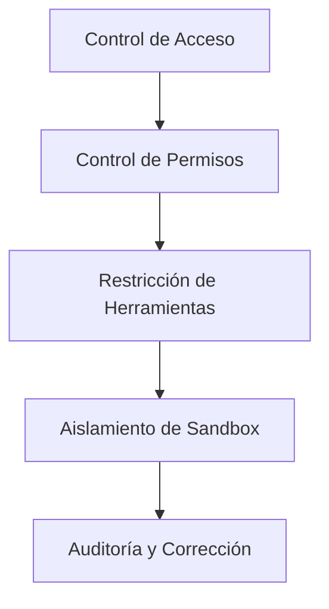

# Seguridad y Aislamiento de Sandbox: Protegiendo tu Asistente de IA

## Lo que podrás hacer después de esta lección

- Configurar políticas de seguridad multicapa, desde el control de acceso hasta los permisos de herramientas
- Usar el aislamiento de sandbox para limitar el acceso al sistema de archivos y red del asistente de IA
- Ejecutar auditorías de seguridad para detectar y corregir riesgos de seguridad comunes
- Ajustar el nivel de seguridad según diferentes escenarios (personal/familiar/público)

## Tu situación actual

Clawdbot hace que tu asistente de IA sea poderoso, pero también introduce nuevos desafíos de seguridad:

- **Acceso Shell**: La IA puede ejecutar comandos arbitrarios, leer y escribir archivos
- **Acceso de Red**: La IA puede acceder a cualquier URL y servicio
- **Envío de Mensajes**: La IA puede enviar mensajes a cualquiera (si está configurado con WhatsApp)
- **Control Remoto**: Controlar el navegador local a través de herramientas del navegador
- **Exposición de Datos**: Todo el historial de conversaciones se almacena en el disco

Sin la protección adecuada, un modelo de IA manipulado podría tener consecuencias catastróficas.

## Cuándo usar esta técnica

- ✅ Necesitas ejecutar el asistente de IA en tu propio dispositivo y te preocupan los riesgos de seguridad
- ✅ Quieres exponer tu asistente de IA para uso de múltiples personas (familiares, equipo)
- ✅ Necesitas limitar el acceso de la IA a archivos o directorios específicos
- ✅ Quieres aislar el alcance de acceso de diferentes usuarios/sesiones
- ✅ Necesitas ejecutar el asistente de IA en un entorno restringido (sandbox)

::: info
**Concepto Importante**: La seguridad es por capas, desde "quién puede acceder" hasta "qué puede hacer", y finalmente "seguridad del modelo".
:::

## 🎒 Preparativos previos

### Verificación previa

- [x] Has completado [Inicio Rápido](../../start/getting-started/), sabes cómo iniciar Gateway
- [ ] Has configurado al menos un modelo de IA (Anthropic, OpenAI u Ollama)
- [ ] Conoces tu escenario de uso (uso personal, uso familiar, servicio público)
- [ ] Conoces los conceptos de permisos de archivos de Linux (chmod)

### Herramientas recomendadas

- Herramientas de línea de comandos: Terminal o SSH
- Editor: Tu editor de código favorito
- Docker: Para ejecutar contenedores de sandbox (opcional)

---

## Concepto Central

El modelo de seguridad de Clawdbot se basa en una filosofía central: **priorizar el control de acceso, seguridad con restricciones posteriores**.

### Capas de Seguridad



1. **Control de Acceso**: Decide quién puede hablar con tu asistente de IA
2. **Control de Permisos**: Decide qué herramientas puede invocar el asistente de IA
3. **Aislamiento de Sandbox**: Decide en qué entorno se ejecutan las herramientas (host o contenedor)
4. **Auditoría y Corrección**: Verificación continua y corrección de la configuración de seguridad

Este diseño por capas asegura que incluso si el modelo es manipulado, el alcance del ataque se limite a los límites definidos.

### Tres capas de protección de acceso

Clawdbot proporciona tres capas de control de acceso:

| Capa | Contenido Protegido | Ubicación de Configuración |
|--- | --- | ---|
| **Autenticación Gateway** | Conexiones WebSocket | `gateway.auth` |
| **Política DM** | Mensajes de chat privado | `channels.*.dmPolicy` |
| **Política Group** | Mensajes de grupo | `channels.*.groupPolicy` / `channels.*.groups` |

Cada capa se puede configurar independientemente, formando una defensa en profundidad.

---

## Auditoría de Seguridad: Detectando Riesgos

Clawdbot proporciona herramientas integradas de auditoría de seguridad para detectar rápidamente riesgos de seguridad comunes.

### Ejecutar auditoría

```bash
# Auditoría básica
clawdbot security audit

# Auditoría profunda (incluye detección de Gateway)
clawdbot security audit --deep

# Reparación automática de recomendaciones de seguridad
clawdbot security audit --fix
```

### Contenido de la auditoría

La herramienta de auditoría verificará los siguientes aspectos:

| Categoría de Verificación | Elementos Específicos | Nivel de Riesgo |
|--- | --- | ---|
| **Acceso Entrante** | Autenticación Gateway, política DM, política Group | Critical / Warn |
| **Acceso a Herramientas** | Lista de permitidos de exec elevado, allow/deny de herramientas | Critical / Warn |
| **Exposición de Red** | Modo de enlace Gateway, Tailscale Serve/Funnel | Critical / Info |
| **Control de Navegador** | Autenticación de control remoto de navegador, protocolo URL | Critical / Warn |
| **Permisos de Archivos** | Permisos de archivos de configuración, directorio de estado | Critical / Warn |
| **Confianza de Plugins** | Plugins no permitidos explícitamente | Warn |

### Entendiendo la salida de auditoría

El informe de auditoría clasificará por nivel de gravedad:

- **Critical (rojo)**: Reparar inmediatamente, podría llevar a ejecución remota de código o filtración de datos
- **Warn (amarillo)**: Recomendado reparar, reduce el límite de seguridad
- **Info (azul)**: Informativo, no es un problema de seguridad

### Reparación automática

Al usar la marca `--fix`, la herramienta de auditoría aplicará de forma segura las siguientes correcciones:

- Cambiar `groupPolicy="open"` a `allowlist`
- Cambiar `logging.redactSensitive="off"` a `"tools"`
- Reparar permisos de archivos (600 para archivos de configuración, 700 para directorios)

::: tip
**Mejor Práctica**: Ejecuta auditorías regularmente, especialmente después de cambiar la configuración o actualizar Gateway.
:::

---

## Control de Acceso: Quién puede acceder a tu Asistente de IA

El control de acceso es la primera línea de defensa, decide quién puede interactuar con tu asistente de IA.

### Autenticación Gateway

De forma predeterminada, Gateway requiere autenticación para aceptar conexiones WebSocket.

#### Configurar modo de autenticación

```json5
{
  "gateway": {
    "auth": {
      "mode": "token",  // o "password"
      "token": "your-long-random-token-please-change-me"
    }
  }
}
```

**Modos de autenticación**:

| Modo | Propósito | Escenario Recomendado |
|--- | --- | ---|
| `token` | Token bearer compartido | La mayoría de casos, recomendado |
| `password` | Autenticación con contraseña | Desarrollo local, conveniente para pruebas rápidas |
| Tailscale Identity | Tailscale Serve | Acceso remoto a través de Tailscale |

::: warning
**Importante**: Si `gateway.bind` está configurado como no loopback (como `lan`, `tailnet`), debes configurar autenticación, de lo contrario se rechazarán las conexiones.
:::

### Política DM: Protección de Chat Privado

La política DM controla si los usuarios desconocidos pueden hablar directamente con tu asistente de IA.

| Política | Comportamiento | Escenario Recomendado |
|--- | --- | ---|
| `pairing` (predeterminado) | Remitentes desconocidos reciben código de emparejamiento, no se procesa antes de emparejar | Uso personal, recomendado |
| `allowlist` | Remitentes desconocidos son rechazados | Entorno confiable de múltiples personas |
| `open` | Permite a cualquiera | Servicio público (requiere `allowFrom` que contenga `"*"`) |
| `disabled` | Ignorar todos los chats privados | Solo usar funcionalidad de grupo |

#### Ejemplo de configuración

```json5
{
  "channels": {
    "whatsapp": {
      "dmPolicy": "pairing"
    },
    "telegram": {
      "dmPolicy": "allowlist",
      "allowFrom": ["user123", "user456"]
    }
  }
}
```

#### Gestionar emparejamiento

```bash
# Ver solicitudes de emparejamiento pendientes
clawdbot pairing list whatsapp

# Aprobar emparejamiento
clawdbot pairing approve whatsapp <código de emparejamiento>
```

::: tip
**Mejor Práctica**: El modo `pairing` predeterminado proporciona un buen equilibrio entre experiencia de usuario y seguridad. Solo usa `allowlist` o `open` cuando confíes explícitamente en todos los usuarios.
:::

### Política Group: Control de Mensajes de Grupo

La política Group decide cómo responde el asistente de IA a mensajes en grupos.

| Política | Comportamiento | Ubicación de Configuración |
|--- | --- | ---|
| `allowlist` | Solo aceptar grupos en la lista blanca | `channels.whatsapp.groups` |
| `disabled` | Ignorar todos los mensajes de grupo | `channels.telegram.groups` |
| `requireMention` | Solo responder cuando se mencione con @ o se active con comando | `channels.*.groups.*` |

#### Ejemplo de configuración

```json5
{
  "channels": {
    "whatsapp": {
      "groups": {
        "*": {
          "requireMention": true
        }
      }
    },
    "discord": {
      "guilds": {
        "your-guild-id": {
          "users": ["user1", "user2"]
        }
      }
    }
  }
}
```

::: tip
**Mejor Práctica**: Habilita `requireMention` en grupos públicos para evitar que usuarios maliciosos controlen el asistente de IA.
:::

### Aislamiento de Sesión: Prevenir Filtración de Contexto

De forma predeterminada, todos los mensajes de chat privado se enrutan a la misma sesión principal. Cuando múltiples usuarios pueden acceder al asistente de IA, esto podría llevar a filtración de contexto.

```json5
{
  "session": {
    "dmScope": "per-channel-peer"  // Crear sesión independiente para cada canal-remitente
  }
}
```

---

## Control de Permisos de Herramientas: Limitando qué puede hacer la IA

El control de permisos de herramientas es la segunda línea de defensa, decide qué herramientas puede invocar el asistente de IA.

### Listas de Allow/Deny de Herramientas

Puedes configurar listas blancas y negras de herramientas globalmente o para cada Agente.

```json5
{
  "agents": {
    "defaults": {
      "tools": {
        "allow": ["read", "write", "web_search"],
        "deny": ["exec", "browser", "web_fetch"]
      }
    },
    "list": [
      {
        "id": "read-only",
        "tools": {
          "allow": ["read"],
          "deny": ["write", "edit", "apply_patch", "exec", "browser"]
        }
      }
    ]
  }
}
```

### Categorías comunes de herramientas

| Categoría de Herramienta | Herramientas Específicas | Nivel de Riesgo |
|--- | --- | ---|
| **Operaciones de Archivos** | `read`, `write`, `edit`, `apply_patch` | Medio |
| **Ejecución Shell** | `exec`, `process` | Alto |
| **Control de Navegador** | `browser` | Alto |
| **Acceso de Red** | `web_search`, `web_fetch` | Medio |
| **Visualización Canvas** | `canvas` | Medio |
| **Operaciones de Nodos** | `nodes_invoke` | Alto |
| **Tareas Programadas Cron** | `cron` | Medio |
| **Envío de Mensajes** | `message`, `sessions_*` | Bajo |

### Modo Elevado: Salida de escape para ejecución en host

El exec elevado es una salida de escape especial que permite a las herramientas ejecutarse en el host, eludiendo el sandbox.

```json5
{
  "tools": {
    "elevated": {
      "enabled": true,
      "allowFrom": {
        "whatsapp": ["your-trusted-user-id"]
      },
      "security": "allowlist",
      "ask": "on"  // Preguntar confirmación antes de cada ejecución
    }
  }
}
```

::: danger
**Advertencia Importante**: El exec elevado elude las restricciones del sandbox. Solo habilítalo cuando confíes completamente en los usuarios y escenarios permitidos.
:::

::: tip
**Mejor Práctica**: Para la mayoría de escenarios, deshabilita el exec elevado, confía en el aislamiento de sandbox y listas blancas estrictas de herramientas.
:::

---

## Aislamiento de Sandbox: Ejecutando en Entorno Restringido

El aislamiento de sandbox hace que las herramientas se ejecuten en contenedores Docker, limitando el acceso al sistema de archivos y la red.

### Modos de Sandbox

| Modo | Comportamiento | Escenario Recomendado |
|--- | --- | ---|
| `off` | Todas las herramientas se ejecutan en el host | Entorno confiable personal |
| `non-main` (recomendado) | Sesión principal en host, otras sesiones en sandbox | Equilibrar rendimiento y seguridad |
| `all` | Todas las sesiones en sandbox | Entorno de múltiples personas, servicio público |

```json5
{
  "agents": {
    "defaults": {
      "sandbox": {
        "mode": "non-main"
      }
    }
  }
}
```

### Acceso al Espacio de Trabajo

El acceso al espacio de trabajo decide qué directorios del host puede ver el contenedor de sandbox.

| Nivel de Acceso | Comportamiento | Escenario Recomendado |
|--- | --- | ---|
| `none` (predeterminado) | Espacio de trabajo de sandbox `~/.clawdbot/sandboxes` | Aislamiento máximo |
| `ro` | Espacio de trabajo del agente montado solo lectura en `/agent` | Leer pero no escribir archivos |
| `rw` | Espacio de trabajo del agente montado lectura/escritura en `/workspace` | Agentes que necesitan escribir archivos |

```json5
{
  "agents": {
    "defaults": {
      "sandbox": {
        "workspaceAccess": "none"
      }
    }
  }
}
```

### Alcance del Sandbox

El alcance del sandbox decide la granularidad de aislamiento del contenedor.

| Alcance | Comportamiento | Número de Contenedores |
|--- | --- | ---|
| `session` (predeterminado) | Un contenedor por sesión | Más contenedores, mejor aislamiento |
| `agent` | Un contenedor por Agente | Equilibrar aislamiento y recursos |
| `shared` | Todas las sesiones comparten un contenedor | Ahorra recursos, menor aislamiento |

### Configuración Docker

```json5
{
  "agents": {
    "defaults": {
      "sandbox": {
        "docker": {
          "image": "clawdbot-sandbox:bookworm-slim",
          "containerPrefix": "clawdbot-sbx-"
        }
      }
    }
}
```

### Montajes Personalizados

Puedes montar directorios adicionales del host en el contenedor de sandbox.

```json5
{
  "agents": {
    "defaults": {
      "sandbox": {
        "docker": {
          "binds": [
            "/home/user/source:/source:ro",
            "/var/run/docker.sock:/var/run/docker.sock"
          ]
        }
      }
    }
  }
}
```

::: warning
**Consejo de Seguridad**: Los montajes eluden el aislamiento del sistema de archivos del sandbox. Los montajes sensibles (como docker.sock) deben usar el modo `:ro` (solo lectura).
:::

### Navegador Sandbox

El navegador sandbox ejecuta la instancia de Chrome en un contenedor, aislando las operaciones del navegador.

```json5
{
  "agents": {
    "defaults": {
      "sandbox": {
        "browser": {
          "enabled": true,
          "autoStart": true,
          "autoStartTimeoutMs": 10000
        }
      }
    }
  }
}
```

::: tip
**Mejor Práctica**: El navegador sandbox puede evitar que el asistente de IA acceda a las sesiones de inicio de sesión y datos sensibles de tu navegador de uso diario.
:::

---

## Configuración de Seguridad Multi-Agente

Diferentes Agentes pueden tener configuraciones de seguridad diferentes.

### Ejemplos de Escenarios

#### Escenario 1: Agente Personal (confianza total)

```json5
{
  "agents": {
    "list": [
      {
        "id": "personal",
        "sandbox": { "mode": "off" },
        "tools": {
          "allow": ["*"],
          "deny": []
        }
      }
    ]
  }
}
```

#### Escenario 2: Agente Familiar (solo lectura)

```json5
{
  "agents": {
    "list": [
      {
        "id": "family",
        "workspace": "~/clawd-family",
        "sandbox": {
          "mode": "all",
          "scope": "agent",
          "workspaceAccess": "ro"
        },
        "tools": {
          "allow": ["read"],
          "deny": ["write", "edit", "apply_patch", "exec", "browser"]
        }
      }
    ]
  }
}
```

#### Escenario 3: Agente Público (sandbox + restricciones estrictas)

```json5
{
  "agents": {
    "list": [
      {
        "id": "public",
        "workspace": "~/clawd-public",
        "sandbox": {
          "mode": "all",
          "scope": "agent",
          "workspaceAccess": "none"
        },
        "tools": {
          "allow": ["web_search", "sessions_list"],
          "deny": ["read", "write", "edit", "apply_patch", "exec", "browser", "web_fetch", "canvas", "nodes", "cron", "gateway", "image"]
        }
      }
    ]
  }
}
```

---

## Dockerización: Aislamiento Total de Gateway

Además del sandbox a nivel de herramientas, también puedes ejecutar todo Gateway en un contenedor Docker.

### Ventajas de la Dockerización Total

- Aislamiento total del proceso Gateway
- Evitar instalar dependencias en el host
- Facilitar el despliegue y la gestión
- Proporcionar un límite de seguridad adicional

::: tip
Cuándo usar Dockerización vs Sandbox de Herramientas:
- **Sandbox de Herramientas**: La mayoría de escenarios, equilibra rendimiento y seguridad
- **Dockerización**: Entorno de producción, despliegue multi-tenant, necesidad de aislamiento total
:::

### Referencia de Instalación Docker

Para instrucciones detalladas de instalación de Docker, consulta: [Opciones de Despliegue](../../appendix/deployment/).

---

## Advertencias de Errores Comunes

### Errores Comunes

#### ❌ Olvidar configurar autenticación Gateway

**Configuración Incorrecta**:
```json5
{
  "gateway": {
    "bind": "lan"  // ¡Peligroso!
    "auth": {}
  }
}
```

**Consecuencia**: Cualquiera que pueda conectarse a tu red local puede controlar tu asistente de IA.

**Configuración Correcta**:
```json5
{
  "gateway": {
    "bind": "loopback",  // o configurar autenticación fuerte
    "auth": {
      "mode": "token",
      "token": "your-secure-token"
    }
  }
}
```

#### ❌ Usar `dmPolicy: "open"` pero olvidar `allowFrom`

**Configuración Incorrecta**:
```json5
{
  "channels": {
    "whatsapp": {
      "dmPolicy": "open"  // ¡Peligroso!
    }
  }
}
```

**Consecuencia**: Cualquiera puede enviar mensajes a tu asistente de IA.

**Configuración Correcta**:
```json5
{
  "channels": {
    "whatsapp": {
      "dmPolicy": "open",
      "allowFrom": ["*"]  // Debe permitir explícitamente
    }
  }
}
```

#### ❌ Habilitar exec Elevado pero no configurar allowFrom

**Configuración Incorrecta**:
```json5
{
  "tools": {
    "elevated": {
      "enabled": true  // ¡Peligroso!
    }
  }
}
```

**Consecuencia**: Cualquier usuario puede ejecutar comandos de host.

**Configuración Correcta**:
```json5
{
  "tools": {
    "elevated": {
      "enabled": true,
      "allowFrom": {
        "discord": ["your-user-id"]  // Limitar usuarios permitidos
      },
      "security": "allowlist",
      "ask": "on"  // Requerir confirmación
    }
  }
}
```

#### ❌ Usar modo lectura/escritura en montajes sensibles

**Configuración Incorrecta**:
```json5
{
  "agents": {
    "defaults": {
      "sandbox": {
        "docker": {
          "binds": [
            "/var/run/docker.sock:/var/run/docker.sock"  // ¡Peligroso!
          ]
        }
      }
    }
  }
}
```

**Consecuencia**: El sandbox puede controlar el demonio Docker.

**Configuración Correcta**:
```json5
{
  "agents": {
    "defaults": {
      "sandbox": {
        "docker": {
          "binds": [
            "/var/run/docker.sock:/var/run/docker.sock:ro"  // Solo lectura
          ]
        }
      }
    }
  }
}
```

### Resumen de Mejores Prácticas

| Práctica | Razón |
|--- | ---|
| Usar modo `pairing` predeterminado | Equilibrar experiencia de usuario y seguridad |
| Usar `requireMention` en mensajes de grupo | Evitar ser manipulado |
| Usar lista blanca de herramientas en lugar de lista negra | Principio de mínimo privilegio |
| Habilitar sandbox pero establecer `workspaceAccess: "none"` | Aislar acceso al espacio de trabajo |
| Ejecutar auditorías de seguridad regularmente | Monitoreo continuo de seguridad |
| Almacenar claves sensibles en variables de entorno o archivos de configuración | Evitar filtración en código |

---

## Resumen de la Lección

Esta lección presentó el modelo de seguridad y funcionalidad de aislamiento de sandbox de Clawdbot:

**Puntos Clave**:

1. **Capas de Seguridad**: Control de Acceso → Control de Permisos → Aislamiento de Sandbox → Auditoría y Corrección
2. **Control de Acceso**: Autenticación Gateway, política DM, política Group
3. **Permisos de Herramientas**: listas allow/deny, modo Elevado
4. **Aislamiento de Sandbox**: modos, alcance, acceso al espacio de trabajo, configuración Docker
5. **Auditoría de Seguridad**: `clawdbot security audit` detecta y corrige problemas

**Principio de Seguridad Primero**:
- Empieza con mínimo privilegio, solo relájalo cuando sea necesario
- Usa aislamiento de sandbox para limitar el alcance de ataque
- Audita y actualiza la configuración regularmente
- Mantén precaución con funciones sensibles (como exec Elevado)

---

## Próxima Lección

> En la siguiente lección aprenderemos **[Gateway Remoto y Tailscale](../remote-gateway/)**.
>
> Aprenderás:
> - Exponer Gateway a tu Tailnet a través de Tailscale Serve
> - Acceso público a través de Tailscale Funnel (con precaución)
> - Configuración de túnel SSH y proxy inverso
> - Mejores prácticas de seguridad para acceso remoto

---

## Apéndice: Referencia de Código Fuente

<details>
<summary><strong>Haz clic para expandir y ver ubicación del código fuente</strong></summary>

> Última actualización: 2026-01-27

| Funcionalidad | Ruta de Archivo | Líneas |
|--- | --- | ---|
| Auditoría de Seguridad | [`src/security/audit.ts`](https://github.com/moltbot/moltbot/blob/main/src/security/audit.ts#L1-L910) | 1-910 |
| Reparación de Seguridad | [`src/security/fix.ts`](https://github.com/moltbot/moltbot/blob/main/src/security/fix.ts#L1-L385) | 1-385 |
| Verificación de Permisos de Archivos | [`src/security/audit-fs.ts`](https://github.com/moltbot/moltbot/blob/main/src/security/audit-fs.ts) | Todo el archivo |
| Schema de Configuración Gateway | [`src/config/zod-schema.core.ts`](https://github.com/moltbot/moltbot/blob/main/src/config/zod-schema.core.ts) | Todo el archivo |
| Schema de Defaults de Agente | [`src/config/zod-schema.agent-defaults.ts`](https://github.com/moltbot/moltbot/blob/main/src/config/zod-schema.agent-defaults.ts) | 1-172 |
| Schema de Sandbox | [`src/config/zod-schema.agent-runtime.ts`](https://github.com/moltbot/moltbot/blob/main/src/config/zod-schema.agent-runtime.ts) | 82-511 |
| Gestión de Sandbox | [`src/agents/sandbox.ts`](https://github.com/moltbot/moltbot/blob/main/src/agents/sandbox.ts) | Todo el archivo |
| Análisis de Configuración de Sandbox | [`src/agents/sandbox/config.js`](https://github.com/moltbot/moltbot/blob/main/src/agents/sandbox/config.js) | Todo el archivo |
| Configuración Docker | [`src/agents/sandbox/docker.js`](https://github.com/moltbot/moltbot/blob/main/src/agents/sandbox/docker.js) | Todo el archivo |
| Documentación de Seguridad | [`docs/gateway/security.md`](https://github.com/moltbot/moltbot/blob/main/docs/gateway/security.md) | Todo el archivo |
| Documentación de Sandbox | [`docs/gateway/sandboxing.md`](https://github.com/moltbot/moltbot/blob/main/docs/gateway/sandboxing.md) | Todo el archivo |
| CLI de Sandbox | [`docs/cli/sandbox.md`](https://github.com/moltbot/moltbot/blob/main/docs/cli/sandbox.md) | Todo el archivo |

**Campos de Configuración Clave**:

```typescript
// Configuración de Sandbox
sandbox: {
  mode: "off" | "non-main" | "all",  // Modo de sandbox
  workspaceAccess: "none" | "ro" | "rw",  // Acceso al espacio de trabajo
  scope: "session" | "agent" | "shared",  // Alcance de sandbox
  docker: {
    image: string,  // Imagen Docker
    binds: string[],  // Montajes del host
    network: "bridge" | "none" | "custom"  // Modo de red
  },
  browser: {
    enabled: boolean,  // Si el navegador está sandboxeado
    autoStart: boolean,  // Inicio automático
  },
  prune: {
    idleHours: number,  // Eliminar automáticamente después de estar inactivo
    maxAgeDays: number,  // Días máximos de retención
  }
}

// Permisos de Herramientas
tools: {
  allow: string[],  // Herramientas permitidas
  deny: string[],  // Herramientas denegadas
  elevated: {
    enabled: boolean,  // Si habilitar ejecución en host
    allowFrom: {  // Lista de permitidos por canal
      [provider: string]: string[] | number[]
    },
    security: "deny" | "allowlist" | "full",  // Política de seguridad
    ask: "off" | "on-miss" | "always",  // Política de confirmación
  }
}

// Política DM
dmPolicy: "pairing" | "allowlist" | "open" | "disabled"

// Política Group
groupPolicy: "allowlist" | "open" | "disabled"
```

**Constantes Clave**:

- `DEFAULT_SANDBOX_IMAGE`: `"clawdbot-sandbox:bookworm-slim"` - Imagen de sandbox predeterminada
- `DEFAULT_SANDBOX_COMMON_IMAGE`: Imagen de sandbox común predeterminada

**Funciones Clave**:

- `runSecurityAudit()`: Ejecutar auditoría de seguridad
- `fixSecurityFootguns()`: Aplicar reparaciones de seguridad
- `resolveSandboxConfigForAgent()`: Analizar configuración de sandbox del Agente
- `buildSandboxCreateArgs()`: Construir argumentos de creación de contenedor de sandbox

</details>
