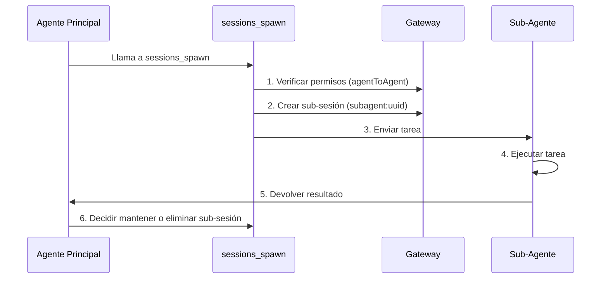

# Gestión de Sesiones y Múltiples Agentes: Aislamiento de Sesiones, Colaboración de Sub-Agentes y Compresión de Contexto

## Lo Que Podrás Hacer

- Entender el modelo de sesiones y la estructura de claves de sesión de Clawdbot
- Configurar el aislamiento de sesiones entre diferentes agentes
- Usar sub-agentes para completar tareas aisladas
- Gestionar la ventana de contexto para evitar exceder los límites del modelo
- Dominar las mejores prácticas de restablecimiento y compresión de sesiones

## Tu Situación Actual

Cuando tu asistente de IA atiende simultáneamente a múltiples usuarios y múltiples canales, puedes encontrarte con estos problemas:

- **Interferencia de sesiones**: Los mensajes de diferentes usuarios se mezclan y la IA no puede recordar sus respectivos historiales
- **Explosión de contexto**: Después de conversaciones prolongadas, el modelo empieza a "perder memoria" o las respuestas se vuelven más lentas
- **Confusión de subtareas**: Cuando el agente principal llama a subtareas, no hay límites claros de aislamiento
- **Desperdicio de recursos**: Todos los agentes comparten el mismo conjunto de sesiones, haciendo que los recursos de almacenamiento y computación no se utilicen eficazmente

El **sistema de gestión de sesiones de Clawdbot** está diseñado para resolver estos problemas.

## Concepto Central

Una **sesión** es la unidad abstracta central de Clawdbot. Cada sesión representa un historial de conversación independiente, con su propio registro de mensajes, metadatos y ciclo de vida.

Clawdbot utiliza **claves de sesión (session key)** para identificar y aislar diferentes sesiones. Las claves de sesión no solo distinguen entre diferentes interlocutores de conversación (usuarios, grupos, canales), sino también entre diferentes instancias de agentes.

::: info ¿Qué es una Clave de Sesión?

Una clave de sesión es un identificador de cadena que identifica únicamente una sesión. Ejemplos de formato:
- `agent:main:main` (sesión principal del agente principal)
- `agent:work:main` (sesión principal del agente de trabajo)
- `agent:main:whatsapp:group:123` (sesión de grupo de WhatsApp)
- `cron:job-id` (sesión de tarea programada)

Clawdbot enruta los mensajes al agente correcto basándose en la clave de sesión y mantiene historiales de conversación independientes.
:::

## Modelo de Sesión

### Composición de la Clave de Sesión

Clawdbot utiliza claves de sesión estructuradas para identificar diferentes tipos de sesiones:

| Tipo de Sesión | Formato de Clave | Ejemplo | Descripción |
|--- | --- | --- | ---|
| **Sesión Principal** | `agent:<agentId>:<mainKey>` | `agent:main:main` | Sesión principal predeterminada de cada agente |
| **Mensaje Directo** | `agent:<agentId>:dm:<peerId>` | `agent:main:dm:+15551234567` | Aislado según configuración `dmScope` |
| **Grupo/Canal** | `agent:<agentId>:<channel>:group:<id>` | `agent:main:whatsapp:group:123` | Grupos y canales aislados automáticamente |
| **Sub-Agente** | `agent:<agentId>:subagent:<uuid>` | `agent:main:subagent:a1b2c3d4` | Sesión aislada del sub-agente |
| **Tarea Programada** | `cron:<jobId>` | `cron:daily-report` | Sesión dedicada para tareas Cron |
| **Webhook** | `hook:<uuid>` | `hook:xyz789` | Sesión activada por Webhook |

### Almacenamiento de Sesiones

Los datos de sesión se almacenan en dos ubicaciones:

```bash
# Índice de sesiones (metadatos)
~/.clawdbot/agents/<agentId>/sessions/sessions.json

# Historial de mensajes (un archivo por sesión)
~/.clawdbot/agents/<agentId>/sessions/<sessionId>.jsonl
```

**sessions.json** es una tabla de mapeo que registra:
- Clave de sesión → Metadatos de sesión (sessionId, updatedAt, model, tokens, etc.)
- Eliminar estas entradas es seguro; se reconstruirán automáticamente cuando sea necesario

**Archivos JSONL** almacenan el historial de conversación completo, con un registro de mensaje por línea.

::: tip Gateway es la Única Fuente de Verdad

Todos los estados de sesión son propiedad del Gateway. Los clientes de UI (aplicación macOS, WebChat) deben consultar la lista de sesiones y el conteo de tokens desde el Gateway, en lugar de leer directamente archivos locales.

En modo remoto, las sesiones que te interesan se almacenan en el host remoto del Gateway, no en tu Mac.
:::

## Mecanismo de Aislamiento de Sesiones

### Modo de Agente Único (Predeterminado)

Si no se realiza ninguna configuración, Clawdbot ejecuta un solo agente:
- `agentId` por defecto es `main`
- Todas las sesiones DM comparten la clave de sesión principal (`agent:main:main`)
- Esto significa que **los mensajes del mismo usuario desde diferentes canales entrarán en la misma sesión**

### Modo de Múltiples Agentes

**Múltiples Agentes = Múltiples Cerebros Aislados**

Cada agente tiene su propio conjunto independiente de:
- **Workspace** (archivos de área de trabajo, AGENTS.md, SOUL.md)
- **State directory** (configuración de autenticación, registro de modelos)
- **Session store** (historial de chat y estado de enrutamiento)

#### ¿Por Qué Múltiples Agentes?

| Escenario | Solución |
|--- | ---|
| **Múltiples usuarios compartiendo servidor** | Cada usuario tiene un agente independiente, sesiones completamente aisladas |
| **Diferentes personalidades en diferentes canales** | WhatsApp usa agente de diario, Telegram usa agente de trabajo profundo |
| **Separación de permisos** | Agente familiar con herramientas limitadas, agente personal con acceso completo |
| **Diferentes entornos** | Agente de desarrollo, agente de producción completamente aislados |

#### Configuración de Múltiples Agentes

**Paso 1: Agregar Nuevo Agente**

```bash
clawdbot agents add work
```

Esto creará un nuevo directorio de agente en `~/.clawdbot/agents/work/`.

**Paso 2: Configurar Reglas de Enrutamiento**

Agrega `bindings` en `~/.clawdbot/clawdbot.json`:

```json5
{
  agents: {
    list: [
      { id: "home", workspace: "~/clawd-home", name: "Home" },
      { id: "work", workspace: "~/clawd-work", name: "Work" }
    ]
  },
  bindings: [
    { agentId: "home", match: { channel: "whatsapp", accountId: "personal" } },
    { agentId: "work", match: { channel: "whatsapp", accountId: "biz" } }
  ]
}
```

**Paso 3: Verificar Configuración**

```bash
clawdbot agents list --bindings
```

#### Reglas de Enrutamiento (Coincidencia Determinista)

Cuando llega un mensaje, Clawdbot hace coincidir las reglas en orden de **más específico primero**:

1. Coincidencia **peer** (id exacto de DM/group/channel)
2. **guildId** (Discord)
3. **teamId** (Slack)
4. Coincidencia **accountId**
5. Coincidencia a nivel de canal (`accountId: "*"`)
6. Retroceso al agente predeterminado

::: warning Presta Atención al Orden de Vinculaciones

¡El orden en la lista de vinculaciones es importante! Las reglas más específicas deben ir primero.

Por ejemplo, si quieres enrutar un DM específico al agente `work` y otros DM de WhatsApp al agente `home`, debes escribir la regla de peer primero:
```json5
{
  bindings: [
    { agentId: "work", match: { channel: "whatsapp", peer: { kind: "dm", id: "+15551234567" } } },
    { agentId: "home", match: { channel: "whatsapp" } }
  ]
}
```
:::

### Control de Alcance DM

Usa `session.dmScope` para controlar cómo se agrupan los mensajes directos:

| Opción | Comportamiento | Escenario de Uso |
|--- | --- | ---|
| `main` (predeterminado) | Todos los DM comparten la sesión principal | Usuario único, múltiples canales |
| `per-peer` | Aislado por ID de remitente | Entorno de múltiples usuarios |
| `per-channel-peer` | Aislado por canal + remitente | Bandeja de entrada compartida |

Ejemplo de configuración:

```json5
{
  session: {
    dmScope: "per-channel-peer"  // Cada usuario en cada canal tiene sesión independiente
  }
}
```

### Enlaces de Identidad (Identity Links)

Si el mismo usuario usa múltiples plataformas (como WhatsApp y Telegram), puedes hacer que compartan sesiones usando `session.identityLinks`:

```json5
{
  session: {
    identityLinks: {
      alice: ["telegram:123456789", "discord:987654321012345678"]
    }
  }
}
```

Así, los mensajes que Alice envíe desde Telegram o Discord entrarán en la sesión `agent:<agentId>:dm:alice`.

## Colaboración de Sub-Agentes

### ¿Qué es un Sub-Agente?

Un **sub-agente** es una instancia de agente que se ejecuta en una sesión aislada, utilizada para realizar tareas específicas sin afectar el contexto de la sesión principal.

Escenarios de uso típicos:
- **Revisión de código**: El sub-agente analiza el código y devuelve un resumen
- **Extracción de datos**: El sub-agente extrae información de documentos largos
- **Tareas paralelas**: Mientras el agente principal espera, el sub-agente se ejecuta en segundo plano
- **Aislamiento de sandbox**: Ejecutar tareas no confiables en un entorno restringido

### Herramienta sessions_spawn

Usa la herramienta `sessions_spawn` para crear un sub-agente:

```json
{
  "task": "Analiza este documento y extrae los puntos clave",
  "label": "Análisis de Documento",
  "model": "anthropic/claude-opus-4-5",
  "thinking": "detailed",
  "runTimeoutSeconds": 300,
  "cleanup": "keep"
}
```

Descripción de parámetros:

| Parámetro | Tipo | Requerido | Descripción |
|--- | --- | --- | ---|
| `task` | string | ✅ | Descripción de la tarea del sub-agente |
| `label` | string | ❌ | Etiqueta legible de la tarea (para seguimiento) |
| `agentId` | string | ❌ | ID del agente objetivo (predeterminado es el agente actual) |
| `model` | string | ❌ | Sobrescritura del modelo |
| `thinking` | string | ❌ | Nivel de pensamiento (`minimal`/`standard`/`detailed`) |
| `runTimeoutSeconds` | number | ❌ | Tiempo de espera (segundos) |
| `cleanup` | string | ❌ | Estrategia de limpieza después de completar la tarea (`keep`/`delete`) |

### Ciclo de Vida del Sub-Agente



**Pasos del Ciclo de Vida**:

1. **Verificación de permisos**: Si es una llamada entre agentes, verifica la configuración `tools.agentToAgent.allow`
2. **Creación de sub-sesión**: Genera una clave única `agent:<agentId>:subagent:<uuid>`
3. **Ejecución de tarea**: El sub-agente completa la tarea en la sesión aislada
4. **Devolución de resultado**: El resultado se devuelve por streaming al agente principal
5. **Estrategia de limpieza**:
   - `cleanup: "keep"`: Mantiene la sub-sesión para inspecciones posteriores
   - `cleanup: "delete"`: Elimina automáticamente la sub-sesión

### Configuración de Comunicación Entre Agentes

Por defecto, la comunicación entre agentes está deshabilitada. Debe habilitarse explícitamente:

```json5
{
  tools: {
    agentToAgent: {
      enabled: true,
      allow: ["home", "work", "family"]
    }
  }
}
```

Descripción de permisos:
- `enabled: false`: Deshabilita completamente la comunicación entre agentes
- `allow: ["*"]`: Permite cualquier agente
- `allow: ["home", "work"]`: Solo permite agentes específicos

::: danger Recordatorio de Seguridad

Los sub-agentes heredan parte del contexto del agente principal, pero **no** obtienen el historial completo de la sesión padre. Esto es tanto una característica (ahorro de tokens) como una limitación (los sub-agentes no conocen el contexto completo).

Para operaciones sensibles, considera completarlas en la sesión principal en lugar de usar sub-agentes.
:::

## Compresión de Contexto

### ¿Qué es la Ventana de Contexto?

Cada modelo de IA tiene una **ventana de contexto (context window)**: el número máximo de tokens que puede ver en una sola inferencia.

Las conversaciones prolongadas acumulan mensajes y resultados de herramientas. Una vez cerca del límite del modelo, Clawdbot **comprimirá (compact)** el historial para liberar espacio.

### Compresión Automática

Cuando una sesión se acerca o excede la ventana de contexto, Clawdbot activa automáticamente la compresión:

- **Antes de la compresión**: Primero ejecuta una **actualización silenciosa de memoria**, solicitando al modelo que escriba notas persistentes en disco (si el área de trabajo es escribible)
- **Proceso de compresión**: Resume las conversaciones antiguas en un resumen comprimido, manteniendo los mensajes recientes
- **Persistencia**: El resultado de la compresión se escribe en el archivo de historial JSONL
- **Reintento**: Reintenta la solicitud original usando el contexto comprimido

Verás:
- `🧹 Auto-compaction complete` (en modo detallado)
- `/status` muestra `🧹 Compactions: <count>`

### Compresión Manual

Usa el comando `/compact` para activar manualmente la compresión:

```
/compact
```

Puedes agregar instrucciones de compresión:

```
/compact Focus on decisions and open questions
```

Esto guiará a la IA para que se centre en contenido específico al resumir.

### Compresión vs Poda

| Operación | Propósito | Persistencia | Ubicación |
|--- | --- | --- | ---|
| **Compresión** | Resumir conversaciones antiguas | ✅ | Escritura en JSONL |
| **Poda** | Eliminar resultados de herramientas antiguas | ❌ | Solo en memoria |

::: tip Recomendaciones de Estrategia de Compresión

- **Compresión**: Guarda resúmenes de información, adecuado para revisar el historial
- **Poda**: Limpieza temporal, adecuado para reducir el uso de tokens en una sola solicitud
- **/new**: Borra completamente la sesión, para comenzar un nuevo tema

Elige la estrategia adecuada según tus hábitos de uso.
:::

### Configuración de Compresión

Configura el comportamiento de compresión en `~/.clawdbot/clawdbot.json`:

```json5
{
  agents: {
    defaults: {
      compaction: {
        enabled: true,
        threshold: 0.9,  // Activar cuando el uso de contexto sea del 90%
        trigger: "auto"  // auto/manual
      }
    }
  }
}
```

## Sígueme: Configuración de Gestión de Sesiones

Configuremos la gestión de sesiones a través de un escenario real.

### Escenario

Tienes un número de WhatsApp y deseas:
1. Contactos personales usen el agente `home` (conversación diaria)
2. Grupos de trabajo usen el agente `work` (respuesta profesional)
3. Activar sub-agentes para tareas aisladas

### Paso 1: Agregar Dos Agentes

```bash
# Agregar agente de hogar
clawdbot agents add home

# Agregar agente de trabajo
clawdbot agents add work
```

**Deberías ver**: Te solicitará que ingreses la ruta del área de trabajo y otra información.

### Paso 2: Editar Archivo de Configuración

Abre `~/.clawdbot/clawdbot.json` y agrega la lista de agentes y reglas de vinculación:

```json5
{
  agents: {
    list: [
      {
        id: "home",
        name: "Home",
        workspace: "~/clawd-home",
        model: "anthropic/claude-sonnet-4-5"
      },
      {
        id: "work",
        name: "Work",
        workspace: "~/clawd-work",
        model: "anthropic/claude-opus-4-5"
      }
    ]
  },
  bindings: [
    // Mensajes personales enrutan al agente home
    { agentId: "home", match: { channel: "whatsapp", peer: { kind: "dm", id: "+15551230001" } } },
    // Grupos de trabajo enrutan al agente work
    { agentId: "work", match: { channel: "whatsapp", peer: { kind: "group", id: "120363999999999999@g.us" } } },
    // Otros mensajes de WhatsApp enrutan al agente home (predeterminado)
    { agentId: "home", match: { channel: "whatsapp" } }
  ],
  tools: {
    agentToAgent: {
      enabled: true,
      allow: ["home", "work"]
    }
  }
}
```

### Paso 3: Reiniciar Gateway

```bash
clawdbot gateway restart
```

**Deberías ver**: Registro de inicio de Gateway, mostrando los agentes y reglas de vinculación cargadas.

### Paso 4: Probar Llamada de Sub-Agente

Envía en la sesión del agente `home`:

```
Por favor usa un sub-agente para analizar este documento PDF y extraer información clave: /path/to/file.pdf
```

El agente debería llamar automáticamente a la herramienta `sessions_spawn` y verás:
- Notificación de creación de sub-agente
- Proceso de ejecución de la tarea
- Retorno del resultado

### Paso 5: Verificar Estado de Sesión

Envía en el chat:

```
/status
```

**Deberías ver**:
- Uso de tokens de la sesión actual
- Número de compresiones
- Información del modelo

## Punto de Control ✅

Después de completar la configuración, verifica los siguientes puntos:

- [ ] `clawdbot agents list --bindings` muestra las reglas de vinculación correctas
- [ ] Los DM personales enrutan al agente `home`
- [ ] Los grupos de trabajo enrutan al agente `work`
- [ ] Las llamadas de sub-agentes funcionan correctamente
- [ ] `/status` muestra la información correcta de la sesión

## Advertencias de Problemas

### Errores Comunes

| Error | Causa | Solución |
|--- | --- | ---|
| **Llamada entre agentes prohibida** | `tools.agentToAgent.enabled` no está habilitado o la lista `allow` no incluye el agente objetivo | Verifica la configuración, asegúrate de que esté habilitado y la lista de permitidos agregada |
| **Fallo en la creación de sub-agente** | En llamadas entre agentes, el agente objetivo no está en la lista de permitidos | Verifica la configuración `tools.agentToAgent.allow` |
| **Conflicto de clave de sesión** | Orden incorrecto de reglas de vinculación, reglas más específicas sobrescritas | Coloca las reglas de peer antes de las reglas de canal |
| **Fallo de compresión** | Contexto demasiado pequeño o el modelo no soporta compresión | Verifica la ventana de contexto del modelo y la configuración de compresión |

### Recomendaciones de Configuración

- **Comienza simple**: Primero prueba con un solo agente, confirma que las funciones funcionan normalmente antes de agregar múltiples agentes
- **Usa etiquetas**: Agrega `label` claros a las tareas de sub-agentes para facilitar el seguimiento
- **Monitorea el uso de tokens**: Verifica regularmente `/status` para entender el uso del contexto
- **Copia de seguridad de configuración**: Haz una copia de seguridad antes de modificar `clawdbot.json`

## Resumen de la Lección

Esta lección presentó el sistema de gestión de sesiones de Clawdbot:

- **Modelo de sesión**: Claves de sesión, ubicaciones de almacenamiento, ciclo de vida
- **Aislamiento de sesión**: Modo de múltiples agentes, control de alcance DM, enlaces de identidad
- **Colaboración de sub-agentes**: Herramienta `sessions_spawn`, control de permisos, estrategia de limpieza
- **Compresión de contexto**: Compresión automática/manual, compresión vs poda

Con una configuración adecuada de gestión de sesiones, puedes hacer que Clawdbot atienda simultáneamente a múltiples usuarios y escenarios, cada uno con su propio contexto e historial aislados.

## Próxima Lección

> En la próxima lección aprenderemos **[Herramientas de Automatización del Navegador](../tools-browser/)**.
>
> Aprenderás:
> - Cómo configurar y usar las herramientas del navegador
> - Limitaciones de seguridad de la automatización del navegador
> - Capturas de pantalla y operaciones de formularios

---

## Apéndice: Referencia de Código Fuente

<details>
<summary><strong>Haz clic para expandir y ver ubicaciones de código fuente</strong></summary>

> Última actualización: 2026-01-27

| Funcionalidad | Ruta del Archivo | Número de Línea |
|--- | --- | ---|
| Análisis de clave de sesión | [`src/routing/session-key.ts`](https://github.com/moltbot/moltbot/blob/main/src/routing/session-key.ts) | 1-100 |
| Esquema de configuración de sesión | [`src/config/zod-schema.session.ts`](https://github.com/moltbot/moltbot/blob/main/src/config/zod-schema.session.ts) | 11-83 |
|--- | --- | ---|
| Funciones auxiliares de herramientas de sesión | [`src/agents/tools/sessions-helpers.ts`](https://github.com/moltbot/moltbot/blob/main/src/agents/tools/sessions-helpers.ts) | 1-328 |
| Documentación de gestión de sesiones | [`docs/concepts/session.md`](https://github.com/moltbot/moltbot/blob/main/docs/concepts/session.md) | 1-151 |
|--- | --- | ---|
| Documentación de compresión de contexto | [`docs/concepts/compaction.md`](https://github.com/moltbot/moltbot/blob/main/docs/concepts/compaction.md) | 1-50 |

**Constantes Clave**:
- `SESSION_ID_RE = /^[0-9a-f]{8}-[0-9a-f]{4}-[0-9a-f]{4}-[0-9a-f]{4}-[0-9a-f]{12}$/i`: Expresión regular del ID de sesión (`sessions-helpers.ts:96`)

**Tipos Clave**:
- `SessionKind = "main" | "group" | "cron" | "hook" | "node" | "other"`: Enumeración de tipos de sesión (`sessions-helpers.ts:11`)
- `SessionListRow`: Estructura de fila de lista de sesión (`sessions-helpers.ts:19-41`)

**Funciones Clave**:
- `createSessionsSpawnTool()`: Crear herramienta de generación de sub-agentes (`sessions-spawn-tool.ts:60-269`)
- `resolveSessionReference()`: Resolver referencia de sesión (`sessions-helpers.ts:215-253`)
- `classifySessionKind()`: Clasificar tipo de sesión (`sessions-helpers.ts:255-271`)
- `createAgentToAgentPolicy()`: Crear política de comunicación entre agentes (`sessions-helpers.ts:72-94`)

</details>
