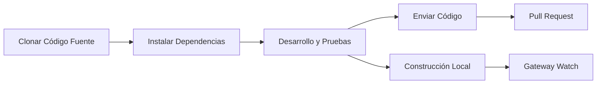

# Guía de Desarrollo: Desde la Construcción hasta la Contribución

## Lo que Aprenderás

- Construir y ejecutar Clawdbot desde el código fuente
- Desarrollar plugins personalizados (canales, herramientas, métodos RPC)
- Ejecutar pruebas unitarias y pruebas de extremo a extremo
- Enviar Pull Requests y contribuir código al proyecto
- Comprender la arquitectura del proyecto y el sistema de plugins

## Tu Situación Actual

Eres un desarrollador que desea:
- Personalizar o extender la funcionalidad de Clawdbot
- Comprender los mecanismos internos del proyecto
- Contribuir código a la comunidad de código abierto
- Pero no sabe por dónde empezar: ¿construcción, pruebas, flujo de envío?

## Cuándo Usar Esta Guía

- Cuando necesites modificar el código fuente o añadir nuevas funciones
- Cuando quieras desarrollar plugins personalizados o canales
- Cuando necesites depurar o corregir errores
- Cuando desees contribuir código al proyecto

## 🎒 Preparativos

::: warning Requisitos Previos
Este tutorial asume que ya cumples con las siguientes condiciones:
:::

- **Node.js ≥22** instalado (requisito del proyecto)
- **pnpm** gestor de paquetes instalado (recomendado para construir desde código fuente)
- Conocimientos básicos de operaciones **Git**
- Experiencia en desarrollo **TypeScript**
- Capacidad de operar en **línea de comandos**

Entorno recomendado:
- macOS / Linux (plataformas de desarrollo principales)
- Windows puede usar WSL2

## Ideas Principales

### Visión General del Flujo de Desarrollo

El flujo de desarrollo de Clawdbot se divide en cuatro fases principales:



### Conceptos Clave

- **Sistema de Construcción**: Usa compilación TypeScript, el directorio `dist/` contiene la salida
- **Arquitectura de Plugins**: Módulos TypeScript cargados en tiempo de ejecución, soportan extensión de funcionalidades
- **Daemon Gateway**: Patrón Singleton, plano de control y enrutamiento de mensajes
- **Marco de Pruebas**: Vitest para pruebas unitarias, Docker para pruebas de extremo a extremo

### Puntos Clave de la Estructura del Proyecto

| Directorio | Función |
|---|---|
| `src/` | Todo el código fuente (2475 archivos TypeScript) |
| `src/gateway/` | Servidor WebSocket Gateway |
| `src/channels/` | Sistema de plugins de canales |
| `src/agents/` | Entorno de ejecución de Agentes AI |
| `src/plugin-sdk/` | SDK para desarrollo de plugins |
| `extensions/` | Plugins integrados (como voice-call) |
| `tests/` | Archivos de prueba |

## Sígueme

### Paso 1: Clonar Código Fuente e Instalar Dependencias

**Por qué**
Obtener el código fuente más reciente e instalar todas las dependencias es el primer paso del desarrollo.

```bash
## Clonar el repositorio
git clone https://github.com/clawdbot/clawdbot.git
cd clawdbot

## Instalar dependencias (recomendado usar pnpm)
pnpm install
```

**Deberías ver**: Dependencias instaladas exitosamente, sin mensajes de error.

::: info Soporte para Bun
Si usas Bun, puedes ejecutar TypeScript directamente sin construir (usando `tsx`).
:::

### Paso 2: Construir el Proyecto

**Por qué**
Compilar TypeScript a JavaScript, generar el directorio `dist/` distribuible.

```bash
## Construcción completa
pnpm build
```

**Deberías ver**:
```
src/cli/entry.ts → dist/cli/entry.js
src/gateway/server.ts → dist/gateway/server.js
...
Build completed in X seconds
```

::: tip Construcción de UI
La primera ejecución de `pnpm ui:build` instalará automáticamente las dependencias de UI.
:::

### Paso 3: Iniciar Modo de Desarrollo

**Por qué**
El modo de desarrollo soporta recarga automática, sin necesidad de reconstrucción manual.

```bash
## Iniciar modo de desarrollo Gateway (recarga automática)
pnpm gateway:watch

## O iniciar modo de desarrollo CLI
CLAWDBOT_PROFILE=dev pnpm clawdbot --dev
```

**Deberías ver**:
- Gateway inicia y escucha en `ws://127.0.0.1:18789`
- Recompilación y reinicio automáticos cuando se modifican archivos

::: tip Omitir Carga de Canales
Durante el desarrollo puedes usar `CLAWDBOT_SKIP_CHANNELS=1` para omitir la inicialización de canales y acelerar el inicio.
:::

**Punto de Verificación ✅**
- Gateway inicia exitosamente y escucha en el puerto 18789
- Recompilación automática después de modificar archivos TypeScript

### Paso 4: Ejecutar Pruebas

**Por qué**
Asegurar que las modificaciones de código no rompan la funcionalidad existente.

#### Pruebas Unitarias

```bash
## Ejecutar todas las pruebas
pnpm test

## Ejecutar pruebas y observar cambios
pnpm test:watch

## Generar informe de cobertura
pnpm test:coverage
```

**Deberías ver**: Estadísticas de tasa de aprobación de pruebas y cobertura.

#### Pruebas de Extremo a Extremo

```bash
## Ejecutar pruebas Docker de extremo a extremo
pnpm test:docker:all

## O ejecutar suite de pruebas individual
pnpm test:docker:live-models
```

**Deberías ver**: Todos los contenedores Docker de prueba ejecutan y salen exitosamente.

::: warning Requisitos de Pruebas
Las pruebas de extremo a extremo requieren que Docker esté instalado y en ejecución.
:::

**Punto de Verificación ✅**
- Todas las pruebas unitarias pasan
- La cobertura de pruebas cumple con los requisitos (≥70%)
- Las pruebas de extremo a extremo pasan

### Paso 5: Verificación y Formateo de Código

**Por qué**
Mantener la consistencia del estilo de código y la seguridad de tipos.

```bash
## Ejecutar linter
pnpm lint

## Formatear código
pnpm format:fix

## Ejecutar Swift linter (desarrollo macOS/iOS)
pnpm lint:swift
```

**Deberías ver**: Sin errores de lint, código formateado.

::: tip Formateo Automático
El proyecto configura git hooks pre-commit que formatearán automáticamente los archivos en staging antes del commit.
:::

### Paso 6: Desarrollar Plugins (Opcional)

**Por qué**
Extender la funcionalidad de Clawdbot o integrar servicios externos.

#### Crear Plugin Rápidamente

1. Crear directorio del plugin:
```bash
mkdir extensions/my-plugin
cd extensions/my-plugin
```

2. Crear `clawdbot.plugin.json`:
```json
{
  "id": "my-plugin",
  "name": "My Plugin",
  "version": "1.0.0",
  "configSchema": {
    "type": "object",
    "properties": {
      "apiKey": { "type": "string" }
    }
  }
}
```

3. Crear entrada del plugin `index.ts`:
```typescript
export default function (api) {
  console.log("¡Mi plugin cargado!");
  
  // Registrar herramienta
  api.registerTool({
    name: "my_tool",
    description: "Mi herramienta personalizada",
    execute: async (params) => {
      return { result: "¡Hola desde mi herramienta!" };
    }
  });
  
  // Registrar método RPC
  api.registerGatewayMethod("myplugin.status", ({ respond }) => {
    respond({ ok: true, status: "running" });
  });
}
```

4. Instalar y probar:
```bash
## Modo desarrollo: enlazar plugin
clawdbot plugins install -l extensions/my-plugin

## Reiniciar Gateway
pnpm gateway:watch
```

::: details Tipos de Plugins
Clawdbot soporta los siguientes tipos de plugins:

- **Agent Tools**: Herramientas invocables por IA
- **Channel Plugins**: Nuevos canales de mensajería (WhatsApp, Telegram, etc.)
- **Gateway RPC**: Endpoints WebSocket
- **CLI Commands**: Herramientas de línea de comandos
- **Background Services**: Tareas en segundo plano
- **Auto-reply Commands**: Comandos rápidos sin IA

Ver [documentación de plugins](https://github.com/moltbot/moltbot/blob/main/docs/plugin.md) para más detalles.
:::

**Punto de Verificación ✅**
- El plugin se carga exitosamente
- Se puede invocar la funcionalidad del plugin a través de CLI o Gateway
- La configuración del plugin funciona correctamente

### Paso 7: Enviar Código y Pull Request

**Por qué**
Enviar tu contribución a la comunidad.

```bash
## Crear rama de funcionalidad
git checkout -b feature/my-feature

## Confirmar cambios
git add .
git commit -m "feat: add my new feature"

## Enviar a GitHub
git push origin feature/my-feature
```

Luego crea un Pull Request en GitHub.

::: tip Estándares de PR
En la descripción del PR indica:
- **Qué se hizo**: Descripción de la funcionalidad o corrección
- **Por qué**: Qué problema resuelve
- **Estado de pruebas**: untested / lightly tested / fully tested
- **Asistencia AI**: Si se usaron herramientas AI para asistir en el desarrollo
:::

**Punto de Verificación ✅**
- El código se ha enviado a GitHub
- El Pull Request se creó exitosamente
- Las verificaciones CI/CD pasan (si las hay)

## Advertencias de Errores Comunes

### Errores Frecuentes

| Error | Causa | Solución |
|---|---|---|
| `Cannot find module 'xxx'` | Dependencias no instaladas | Ejecutar `pnpm install` |
| `Port 18789 already in use` | Gateway ya en ejecución | Verificar y cerrar instancia anterior |
| Error de compilación TypeScript | Problema de definiciones de tipos | Ejecutar `pnpm lint` para verificar |
| Tiempo de espera en pruebas | Docker no iniciado o problemas de red | Verificar estado de Docker |

### Mejores Prácticas de Desarrollo

- **Commits pequeños**: Cada PR solo hace una cosa, facilita la revisión
- **Escribe pruebas**: Las nuevas funcionalidades deben tener cobertura de pruebas
- **Sigue el estilo**: Usa el linter y formatter configurados en el proyecto
- **Actualiza documentación**: Cuando modifiques código, actualiza la documentación relacionada
- **Etiqueta AI**: Cuando uses asistencia AI para desarrollar, indícalo en el PR

## Resumen de Esta Lección

Este tutorial cubrió el flujo de trabajo completo de desarrollo de Clawdbot:

✅ **Construcción desde código fuente**: Usar `pnpm install` y `pnpm build`
✅ **Modo de desarrollo**: Usar `pnpm gateway:watch` para recarga automática
✅ **Marco de pruebas**: Pruebas unitarias con Vitest + pruebas de extremo a extremo con Docker
✅ **Desarrollo de plugins**: Sistema de plugins extensible basado en TypeScript
✅ **Flujo de contribución**: Flujo de trabajo Git y estándares de Pull Request

Referencia rápida de comandos clave:

| Tarea | Comando |
|---|---|
| Instalar dependencias | `pnpm install` |
| Construir | `pnpm build` |
| Modo de desarrollo | `pnpm gateway:watch` |
| Pruebas unitarias | `pnpm test` |
| Verificación de código | `pnpm lint` |
| Formateo | `pnpm format:fix` |

## Avance de la Próxima Lección

¡Felicidades por completar la guía de desarrollo! Ahora tienes:

- La capacidad de construir y ejecutar Clawdbot desde el código fuente
- Las bases para desarrollar plugins personalizados
- El flujo para ejecutar pruebas y contribuir código

A continuación, es posible que desees profundizar en:

- [Referencia de Configuración](../config-reference/) - Documentación completa de opciones de configuración
- [Protocolo API Gateway](../api-protocol/) - Especificación del protocolo WebSocket
- [Opciones de Despliegue](../deployment/) - Métodos de despliegue como Docker, Nix, etc.

¡Sigue explorando y haz que Clawdbot trabaje para ti!

---

## Apéndice: Referencia de Código Fuente

<details>
<summary><strong>Haz clic para expandir y ver la ubicación del código fuente</strong></summary>

> Actualizado: 2026-01-27

| Función | Ruta del Archivo | Línea |
|---|---|---|
| Script de construcción | [`package.json`](https://github.com/moltbot/moltbot/blob/main/package.json) | 77-44 |
| Instalación desde código fuente | [`README.md`](https://github.com/moltbot/moltbot/blob/main/README.md) | 83-99 |
| Documentación de plugins | [`docs/plugin.md`](https://github.com/moltbot/moltbot/blob/main/docs/plugin.md) | 1-639 |
| Guía de contribución | [`CONTRIBUTING.md`](https://github.com/moltbot/moltbot/blob/main/CONTRIBUTING.md) | 1-53 |
| Documentación de arquitectura | [`docs/concepts/architecture.md`](https://github.com/moltbot/moltbot/blob/main/docs/concepts/architecture.md) | 1-123 |

**Comandos Clave**:
- `pnpm build` - Construcción completa (package.json:85)
- `pnpm gateway:watch` - Recarga automática en modo desarrollo (package.json:93)
- `pnpm test` - Ejecutar pruebas unitarias (package.json:118)
- `pnpm lint` - Verificación de código (package.json:110)

**Directorios Clave**:
- `src/` - Directorio raíz del código fuente (2475 archivos TypeScript)
- `src/plugin-sdk/` - SDK para desarrollo de plugins
- `extensions/` - Plugins integrados
- `tests/` - Archivos de prueba
- `dist/` - Directorio de salida de construcción

**Relacionado con Plugins**:
- Formato de manifest de plugin: `clawdbot.plugin.json` (plugin.md:8-10)
- API de plugin: `api.registerTool()`, `api.registerGatewayMethod()` (plugin.md:591-600)
- Schema de configuración de plugin: JSON Schema + `uiHints` (plugin.md:36-48)

</details>
