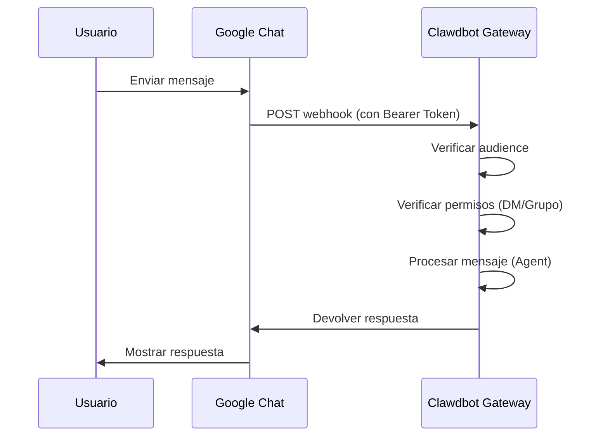

# Configuración del Canal de Google Chat

## Lo que aprenderás

- Conversar 1:1 con tu asistente de IA en Google Chat
- Usar @menciones para activar el asistente de IA en espacios de Google Chat
- Dominar los métodos de autenticación de Service Account y configuración de Webhook
- Aprender a exponer una URL pública de forma segura usando Tailscale Funnel

## Tu problema actual

Quieres usar un asistente de IA a través de Google Chat en tu empresa o equipo, pero no sabes cómo:

- Crear y configurar un proyecto de Google Cloud
- Configurar la autenticación de Service Account
- Configurar Webhook para que Google Chat pueda conectarse a tu Gateway
- Exponer el Gateway a internet de forma segura

## Cuándo usar este método

**Escenarios adecuados para el canal de Google Chat**:

- Tu equipo usa principalmente Google Chat para la comunicación
- Necesitas usar el asistente de IA en un entorno de Google Workspace
- Deseas colaborar a través de Google Chat Spaces
- Necesitas recibir mensajes de Google Chat a través de un Webhook público

**Escenarios no adecuados**:

- Uso personal (recomendamos WebChat, Telegram, WhatsApp)
- Requiere autorización de usuario OAuth (Google Chat solo admite Service Account)

## Conceptos básicos

Flujo de trabajo del canal de Google Chat:



**Conceptos clave**:

| Concepto | Descripción |
|--- | ---|
| **Service Account** | Método de autenticación de Google Cloud, usado para la identidad del bot |
| **Webhook** | Endpoint HTTP donde Google Chat POSTea mensajes al Gateway |
| **Audience** | Objetivo para verificar las solicitudes webhook (app-url o project-number) |
| **Emparejamiento DM** | Mecanismo de seguridad por defecto, remitentes desconocidos necesitan aprobación |

::: tip
El canal de Google Chat solo admite autenticación de Service Account, no admite autorización de usuario OAuth. Si necesitas permisos de nivel de usuario, considera usar otros canales.
:::

## 🎒 Preparativos

Asegúrate de haber completado:

- ✅ Completado [Inicio Rápido](../../start/getting-started/) e instalado Clawdbot
- ✅ Gateway en ejecución (`clawdbot gateway --port 18789`)
- ✅ Tener acceso a una cuenta de Google Cloud
- ✅ Entender el uso básico de comandos de terminal

::: warning
El Webhook de Google Chat requiere un endpoint HTTPS público. Este tutorial explicará cómo usar Tailscale Funnel o un proxy inverso para exponer el servicio de forma segura.
:::

## Sigue estos pasos

### Paso 1: Crear un proyecto de Google Cloud y habilitar la API de Chat

**Por qué**
Primero necesitas un proyecto de Google Cloud para alojar la aplicación de Chat y la Service Account.

1. Visita [Google Chat API Credentials](https://console.cloud.google.com/apis/api/chat.googleapis.com/credentials)
2. Si la API no está habilitada, haz clic en **Enable API**

**Deberías ver**:
- Chat API habilitada y mostrada como "API enabled"
- Entrar en la página de gestión de Credentials

### Paso 2: Crear Service Account

**Por qué**
La Service Account es la identidad del bot, usada para autenticar las solicitudes webhook.

1. En la página de Credentials, haz clic en **Create Credentials** > **Service Account**
2. Ingresa un nombre (por ejemplo `clawdbot-chat`)
3. Haz clic en **Continue** (saltar la configuración de permisos)
4. Mantén el control de acceso vacío, haz clic en **Done**

**Deberías ver**:
- La Service Account recién creada aparece en la lista

### Paso 3: Crear y descargar la clave JSON

**Por qué**
La clave JSON contiene credenciales de autenticación, Clawdbot la necesita para verificar las solicitudes de Google Chat.

1. Haz clic en la Service Account recién creada
2. Ve a la pestaña **Keys**
3. Haz clic en **Add Key** > **Create new key**
4. Selecciona formato **JSON**, haz clic en **Create**
5. El archivo JSON descargado se guardará automáticamente

**Deberías ver**:
- El navegador descarga un archivo `.json`

::: warning
⚠️ Importante: Esta clave JSON solo se descargará una vez, ¡guárdala con cuidado! Si se pierde, debes recrearla.
:::

### Paso 4: Almacenar el archivo de Service Account

**Por qué**
Clawdbot necesita leer el archivo de clave para verificar las solicitudes de Google Chat.

1. Mueve el archivo JSON descargado a una ubicación segura:
   ```bash
   mv ~/Downloads/*.json ~/.clawdbot/googlechat-service-account.json
   ```
2. Configura los permisos del archivo (opcional pero recomendado):
   ```bash
   chmod 600 ~/.clawdbot/googlechat-service-account.json
   ```

**Deberías ver**:
- Archivo almacenado en el directorio `~/.clawdbot/`
- Permisos configurados para lectura/escritura solo para el propietario

### Paso 5: Crear la aplicación de Google Chat

**Por qué**
La Chat App define la apariencia, comportamiento y URL del webhook del bot.

1. Visita [Google Cloud Console Chat Configuration](https://console.cloud.google.com/apis/api/chat.googleapis.com/hangouts-chat)
2. Completa **Application info**:
   - **App name**: `Clawdbot` (u otro nombre)
   - **Avatar URL**: `https://clawd.bot/logo.png` (opcional)
   - **Description**: `Personal AI Assistant` (opcional)
3. Habilita **Interactive features**
4. En **Functionality**, marca **Join spaces and group conversations**
5. En **Connection settings**, selecciona **HTTP endpoint URL**
6. En **Visibility**, selecciona **Make this Chat app available to specific people and groups in &lt;Your Domain&gt;**
7. Ingresa tu correo de Google Workspace (por ejemplo `user@example.com`)
8. Haz clic en **Save** en la parte inferior de la página

**Deberías ver**:
- Configuración de la aplicación guardada
- La página muestra la sección "App status"

### Paso 6: Configurar los disparadores de Webhook

**Por qué**
Los disparadores definen cuándo Google Chat envía mensajes al Gateway.

1. Actualiza la página después de guardar
2. Busca la sección **App status** (generalmente arriba o abajo)
3. Cambia el estado a **Live - available to users**
4. Haz clic en **Save** nuevamente

**Deberías ver**:
- App status mostrado como "Live - available to users"

::: info
💡 Consejo: La URL del Webhook se configurará en el paso 7. Si no estás seguro, puedes usar un marcador temporal `https://example.com/googlechat` y actualizarlo más tarde.
:::

### Paso 7: Obtener la URL pública del Gateway

**Por qué**
Google Chat necesita una URL HTTPS pública para enviar solicitudes webhook.

Ejecuta el siguiente comando para ver la URL pública del Gateway:

```bash
clawdbot status
```

**Deberías ver**:
- La salida contiene la URL pública (por ejemplo `https://your-node.tailnet.ts.net`)

::: warning
Si el Gateway no tiene configurado Tailscale o un proxy inverso, necesitas configurar el acceso público primero (ver siguiente paso).
:::

### Paso 8: Exponer el endpoint Webhook (elige uno)

::: tip
Recomendamos usar Tailscale Funnel, ya que puede exponer solo la ruta `/googlechat`, manteniendo los demás endpoints privados.
:::

#### Opción A: Tailscale Funnel (recomendado)

**Por qué Tailscale Funnel**
- Solo expone rutas específicas, mejorando la seguridad
- El Gateway de la red interna permanece privado, solo el Webhook es accesible
- Sin necesidad de comprar dominio ni configurar SSL

1. **Verificar la dirección de enlace del Gateway**:
   ```bash
   ss -tlnp | grep 18789
   ```
   Anota la dirección IP (por ejemplo `127.0.0.1`, `0.0.0.0` o IP de Tailscale como `100.x.x.x`)

2. **Exponer solo el panel de control a la tailnet** (puerto 8443):
   ```bash
   # Si está enlazado a localhost (127.0.0.1 o 0.0.0.0):
   tailscale serve --bg --https 8443 http://127.0.0.1:18789

   # Si está enlazado a IP de Tailscale (por ejemplo 100.106.161.80):
   tailscale serve --bg --https 8443 http://100.106.161.80:18789
   ```

3. **Exponer la ruta del Webhook**:
   ```bash
   # Si está enlazado a localhost (127.0.0.1 o 0.0.0.0):
   tailscale funnel --bg --set-path /googlechat http://127.0.0.1:18789/googlechat

   # Si está enlazado a IP de Tailscale (por ejemplo 100.106.161.80):
   tailscale funnel --bg --set-path /googlechat http://100.106.161.80:18789/googlechat
   ```

4. **Autorizar nodo para usar Funnel** (si se solicita):
   - Visita la URL de autorización mostrada en la salida
   - En el panel de administración de Tailscale, habilita Funnel para ese nodo

5. **Verificar la configuración**:
   ```bash
   tailscale serve status
   tailscale funnel status
   ```

**Deberías ver**:
- Serve y Funnel en ejecución
- URL pública del Webhook: `https://<node-name>.<tailnet>.ts.net/googlechat`
- Panel de control privado: `https://<node-name>.<tailnet>.ts.net:8443/`

#### Opción B: Caddy Proxy Inverso

**Por qué Caddy**
- Soporta HTTPS automático
- Configuración flexible de enrutamiento de rutas

1. Crear Caddyfile:
   ```txt
   your-domain.com {
       reverse_proxy /googlechat* localhost:18789
   }
   ```

2. Iniciar Caddy:
   ```bash
   caddy run --config Caddyfile
   ```

**Deberías ver**:
- Caddy iniciado y escuchando en el puerto 443
- Solo la ruta `your-domain.com/googlechat` se enruta al Gateway

#### Opción C: Cloudflare Tunnel

**Por qué Cloudflare Tunnel**
- CDN global gratuito
- Configuración simple de reglas de rutas

1. Configurar reglas de entrada del túnel:
   - **Path**: `/googlechat` -> `http://localhost:18789/googlechat`
   - **Default Rule**: HTTP 404 (Not Found)

### Paso 9: Actualizar la URL del Webhook de Google Chat

**Por qué**
Ahora que tienes la URL pública, actualiza la configuración de la Chat App para apuntar al endpoint correcto.

1. Regresa a la página de Google Cloud Console Chat Configuration
2. En la sección **Triggers**:
   - Selecciona **Use a common HTTP endpoint URL for all triggers**
   - Configúralo como: `<tu-url-pública>/googlechat`
   - Por ejemplo: `https://your-node.tailnet.ts.net/googlechat`
3. Haz clic en **Save**

**Deberías ver**:
- Triggers actualizados y guardados

### Paso 10: Configurar Clawdbot

**Por qué**
Indicar a Clawdbot qué Service Account y ruta de Webhook usar.

**Método A: Variables de entorno**

```bash
export GOOGLE_CHAT_SERVICE_ACCOUNT_FILE="/path/to/service-account.json"
clawdbot gateway restart
```

**Método B: Archivo de configuración**

Edita `~/.clawdbot/clawdbot.json`:

```json5
{
  channels: {
    googlechat: {
      enabled: true,
      serviceAccountFile: "/Users/yourname/.clawdbot/googlechat-service-account.json",
      audienceType: "app-url",
      audience: "https://your-node.tailnet.ts.net/googlechat",
      webhookPath: "/googlechat",
      dm: {
        policy: "pairing",
        allowFrom: ["users/1234567890", "your-email@example.com"]
      },
      groupPolicy: "allowlist",
      groups: {
        "spaces/AAAA": {
          allow: true,
          requireMention: true,
          users: ["users/1234567890"],
          systemPrompt: "Respuestas cortas únicamente."
        }
      }
    }
  }
}
```

**Reiniciar Gateway**:

```bash
clawdbot gateway restart
```

**Deberías ver**:
- Gateway iniciado y mostrando "Google Chat default: enabled, configured, ..."
- Sin errores en los logs

### Paso 11: Agregar el Bot a Google Chat

**Por qué**
El último paso, encontrar y agregar el bot en Google Chat.

1. Visita [Google Chat](https://chat.google.com/)
2. Haz clic en el icono **+** (más), junto a **Direct Messages**
3. En el cuadro de búsqueda (generalmente donde se agregan contactos), ingresa el **App name** (nombre configurado en el paso 5)
   - **Nota**: El bot no aparecerá en la lista de navegación de "Marketplace" porque es una aplicación privada. Debes buscar por nombre.
4. Selecciona tu bot de los resultados
5. Haz clic en **Add** o **Chat** para iniciar una conversación 1:1

**Deberías ver**:
- El bot aparece en la lista de contactos
- Se abre la ventana de chat

### Paso 12: Enviar un mensaje de prueba

**Por qué**
Verificar que la configuración es correcta y los mensajes se transmiten normalmente.

En la ventana de chat, ingresa:

```
Hello
```

**Deberías ver**:
- El bot responde con un saludo o mensaje de confirmación
- Los logs del Gateway muestran mensajes recibidos y procesados

## Punto de verificación ✅

Verificar que la configuración fue exitosa:

```bash
# Verificar el estado del canal
clawdbot channels status

# Debería mostrar:
# Google Chat default: enabled, configured, webhook listening
```

::: info
Si ves errores, ejecuta `clawdbot channels status --probe` para ver información de diagnóstico detallada.
:::

## Detalles de configuración

### Autenticación de Service Account

| Configuración | Tipo | Predeterminado | Descripción |
|--- | --- | --- | ---|
| `serviceAccountFile` | string | - | Ruta del archivo JSON de Service Account |
| `serviceAccount` | string\|object | - | Credenciales JSON en línea (alternativa a la ruta del archivo) |
| `audienceType` | "app-url"\|"project-number" | "app-url" | Tipo de verificación: URL o número de proyecto |
| `audience` | string | - | Valor de audience (URL o número de proyecto) |

### Política DM

Por defecto, remitentes desconocidos necesitan emparejamiento:

| Configuración | Tipo | Predeterminado | Descripción |
|--- | --- | --- | ---|
| `dm.enabled` | boolean | undefined | Si se habilita la recepción de DM |
| `dm.policy` | "pairing"|"open" | "pairing" | Política de acceso: emparejamiento o abierto |
| `dm.allowFrom` | array | [] | Lista de remitentes permitidos (IDs de usuarios o correos) |

**Emparejar nuevos remitentes**:

```bash
clawdbot pairing approve googlechat <código-emparejamiento>
```

### Política de grupo

| Configuración | Tipo | Predeterminado | Descripción |
|--- | --- | --- | ---|
| `groupPolicy` | "allowlist"|"disabled" | "allowlist" | Política de grupo: lista de permitidos o deshabilitado |
| `requireMention` | boolean | true | Si requiere @mención para activar |
| `groups` | object | {} | Configuración por ID de espacio |

**Permitir grupos específicos**:

```json5
{
  channels: {
    googlechat: {
      groups: {
        "spaces/AAAA": {
          allow: true,
          requireMention: true,
          users: ["users/1234567890"],
          systemPrompt: "Respuestas cortas únicamente."
        }
      }
    }
  }
}
```

### Otras configuraciones

| Configuración | Tipo | Predeterminado | Descripción |
|--- | --- | --- | ---|
| `webhookPath` | string | "/googlechat" | Ruta del Webhook |
| `botUser` | string | - | Nombre de recurso del usuario bot (usado para detección de menciones) |
| `typingIndicator` | "none"|"message"|"reaction" | "message" | Modo de indicador de escritura |
| `actions.reactions` | boolean | false | Si admite reacciones de emoji |
| `mediaMaxMb` | number | undefined | Tamaño máximo de archivo multimedia (MB) |

## Advertencias de problemas comunes

### 405 Method Not Allowed

**Síntoma**: Google Cloud Logs Explorer muestra `405 Method Not Allowed`

**Causa**: El manejador de Webhook no está registrado

**Solución**:

1. Confirmar que existe la sección `channels.googlechat` en la configuración:
   ```bash
   clawdbot config get channels.googlechat
   ```

2. Verificar el estado del plugin:
   ```bash
   clawdbot plugins list | grep googlechat
   ```

3. Si muestra "disabled", agregar configuración:
   ```json5
   {
     plugins: {
       entries: {
         googlechat: {
           enabled: true
         }
       }
     }
   }
   ```

4. Reiniciar Gateway:
   ```bash
   clawdbot gateway restart
   ```

### No se reciben mensajes

**Síntoma**: Sin respuesta después de enviar mensajes

**Pasos de investigación**:

1. Ejecutar `clawdbot logs --follow` y enviar un mensaje de prueba
2. Confirmar la URL del Webhook y la suscripción a eventos de la Chat App
3. Verificar que la configuración `audience` sea correcta
4. Si el gating de menciones bloquea la respuesta, configurar `botUser` y verificar `requireMention`

### Tailscale Funnel no se inicia

**Síntoma**: `tailscale funnel` reporta error

**Causa**: Autenticación por contraseña no configurada

**Solución**:

Agregar en `~/.clawdbot/clawdbot.json`:

```json5
{
  gateway: {
    auth: {
      mode: "password"
    }
  }
}
```

## Resumen de la lección

- Creaste un proyecto de Google Cloud y Service Account
- Configuraste Google Chat App y Webhook
- Exponiste endpoints públicos usando Tailscale Funnel o proxy inverso
- Configuraste Clawdbot para usar autenticación de Service Account
- Aprendiste el mecanismo de emparejamiento DM y @menciones de grupo
- Probaste mensajes 1:1 y de grupo

## Próxima lección

> En la próxima lección aprenderemos **[Canal Signal](../signal/)**.
>
> Aprenderás:
> - Cómo instalar y configurar signal-cli
> - Permisos y control de acceso del canal Signal
> - Diferencias de configuración con Google Chat

---

## Apéndice: Referencia de código fuente

<details>
<summary><strong>Haz clic para expandir y ver ubicación del código fuente</strong></summary>

> Última actualización: 2026-01-27

| Función | Ruta del archivo | Líneas |
|--- | --- | ---|
| Definición de tipos de configuración de Google Chat | [`src/config/types.googlechat.ts`](https://github.com/moltbot/moltbot/blob/main/src/config/types.googlechat.ts) | 1-109 |
| Zod Schema de Google Chat | [`src/config/zod-schema.providers-core.ts`](https://github.com/moltbot/moltbot/blob/main/src/config/zod-schema.providers-core.ts) | 273-341 |
| Registro de canales | [`src/channels/registry.ts`](https://github.com/moltbot/moltbot/blob/main/src/channels/registry.ts) | 61-67 |
| Análisis de menciones de grupo | [`src/channels/plugins/group-mentions.ts`](https://github.com/moltbot/moltbot/blob/main/src/channels/plugins/group-mentions.ts) | 158-175 |
| Documentación de Google Chat | [`docs/channels/googlechat.md`](https://github.com/moltbot/moltbot/blob/main/docs/channels/googlechat.md) | 1-221 |

**Tipos clave**:
- `GoogleChatConfig`: Interfaz completa de configuración de Google Chat
- `GoogleChatDmConfig`: Configuración de política de acceso DM
- `GoogleChatGroupConfig`: Configuración de espacio de grupo
- `GoogleChatActionConfig`: Configuración de acciones (como reacciones de emoji)

**Campos de configuración clave**:
- `audienceType`: "app-url" o "project-number", usado para verificar solicitudes webhook
- `audience`: URL de Webhook o número de proyecto, emparejado con `audienceType`
- `dm.policy`: Predeterminado "pairing", controla el acceso DM desconocido
- `groupPolicy`: Política de acceso de grupo, "allowlist" o "disabled"

**Mecanismo de autenticación**:
- Usa credenciales JSON de Service Account de Google
- Las solicitudes webhook se verifican mediante el encabezado `Authorization: Bearer <token>`
- El token se compara con el elemento de configuración `audience` para asegurar que la solicitud provenga de una fuente legítima

</details>
