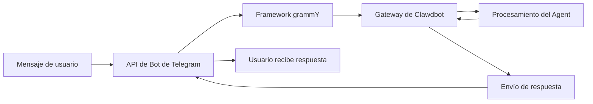

# Configuración y uso del canal de Telegram

## Lo que aprenderás

Al completar este tutorial, podrás:

- 🤖 Crear un Bot en Telegram y obtener el Bot Token
- ⚙️ Configurar el canal de Telegram para conectarlo a Clawdbot
- 🔒 Controlar los permisos de acceso para DM y grupos (mecanismo de emparejamiento y lista blanca)
- 📡 Configurar reglas de mención y estrategias de respuesta en grupos
- 🔌 Configurar el modo Webhook (opcional)
- 🎯 Usar las características de la API de Bot de Telegram (botones en línea, temas, respuestas)

## Tu situación actual

Ya estás usando Clawdbot en Telegram, pero te encuentras con estos problemas:

- ❌ No está claro cómo configurar correctamente el Bot Token
- ❌ Los desconocidos envían mensajes al Bot, pero no hay respuesta
- ❌ En grupos, el Bot no responde a mensajes que no son menciones
- ❌ Quieres controlar con precisión quién puede acceder al Bot, pero no sabes cómo configurarlo
- ❌ Has oído hablar de las diferencias entre Webhook y Long-polling, pero no sabes cuál elegir

Este tutorial te ayudará a resolver estos problemas paso a paso.

## Cuándo usar esto

Escenarios adecuados para usar el canal de Telegram:

- ✅ Ya estás usando Telegram y deseas chatear con el asistente de IA en esta plataforma
- ✅ Necesitas que el Bot responda a usuarios o comandos específicos en grupos
- ✅ Deseas usar funciones especiales de la API de Bot de Telegram (botones en línea, temas de Forum)
- ✅ El entorno de red de tu servidor es adecuado para usar Long-polling o Webhook

**Si principalmente usas WhatsApp u otros canales**: puedes omitir esta lección y enfocarte en los canales que usas.

## 🎒 Preparativos

Antes de comenzar, asegúrate de haber:

- [ ] Completado el tutorial [Inicio rápido](../../start/getting-started/), Clawdbot está instalado y puede iniciarse
- [ ] Tener una cuenta de Telegram (no es necesario ser usuario Premium)
- [ ] Comprender los conceptos básicos de los Bots de Telegram (Bot, Token, modo de privacidad)

::: info Ubicación del archivo de configuración
Por defecto, el archivo de configuración de Clawdbot se encuentra en:
- **Linux/macOS**: `~/.clawdbot/clawdbot.json`
- **Windows**: `%USERPROFILE%\.clawdbot\clawdbot.json`
:::

## Conceptos clave

### API de Bot de Telegram vs otros canales

A diferencia de otras plataformas de mensajería instantánea, Telegram utiliza la arquitectura de **API de Bot**:

| Característica | Telegram | WhatsApp | Slack |
|--- | --- | --- | ---|
| Método de conexión | API de Bot (HTTP) | Cliente Web | API de Bot + WebSocket |
| Modo de mensajes | Push (Bot envía activamente) | Pull (escucha Cliente Web) | Pull (escucha WebSocket) |
| Modo de privacidad | **Soportado** (opcional para Bot) | N/A | N/A |
| Soporte de grupos | SuperGroup + Forum | Grupos | Canales + Workspace |
| Funciones especiales | Temas de Forum, botones en línea | - | - |

### Método de integración de Clawdbot

Clawdbot utiliza el framework de API de Bot [grammY](https://grammy.dev/) para integrarse con Telegram:



**Puntos clave**:
- **Long-polling**: Modo predeterminado, Clawdbot recupera activamente actualizaciones de Telegram
- **Webhook**: Modo opcional, Telegram envía actualizaciones a tu servidor
- **Emparejamiento DM**: Habilitado por defecto, los desconocidos deben emparejarse antes de enviar mensajes
- **Menciones en grupos**: Habilitado por defecto, el Bot solo responde a `@botname` o patrones de mención configurados

### Mecanismo de control de acceso

Clawdbot proporciona tres niveles de control de acceso:

1. **Nivel DM** (`dmPolicy`)
   - `pairing`: Los usuarios desconocidos reciben un código de emparejamiento y deben ser aprobados primero
   - `allowlist`: Solo permite usuarios en la lista blanca
   - `open`: Permite todos los DM (requiere configurar `allowFrom: ["*"]`)

2. **Nivel de grupo** (`groups` + `groupPolicy`)
   - Lista qué grupos pueden acceder al Bot
   - Establece la regla `requireMention` para cada grupo

3. **Nivel de remitente** (`allowFrom` + `groupAllowFrom`)
   - En DM/grupos ya permitidos, restringe aún más quién puede enviar mensajes

::: warning Predeterminado seguro
La política DM predeterminada es `pairing`, que es el valor predeterminado más seguro. Los mensajes de desconocidos se ignorarán hasta que apruebes el código de emparejamiento.
:::

## Sigue estos pasos

### Paso 1: Crear un Bot de Telegram y obtener el Token

**Por qué**
El Bot de Telegram necesita un Bot Token para acceder y enviar mensajes a través de la API de Bot. Este Token equivale a la "credencial de identidad" del Bot.

**Operación**

1. Busca y abre **@BotFather** en Telegram
2. Envía el comando `/newbot`
3. Sigue las instrucciones:
   - Ingresa el nombre del Bot (por ejemplo: `My Clawdbot Assistant`)
   - Ingresa el nombre de usuario del Bot (debe terminar con `bot`, por ejemplo: `my_clawdbot_bot`)
4. BotFather devolverá el Bot Token, con formato como: `123456:ABC-DEF123456`

**Deberías ver**:
```
Done! Congratulations on your new bot.

You can find it at t.me/my_clawdbot_bot. You can now add a description,
about section and profile picture for it, see /help for a list of commands.

Use this token to access the HTTP API:
123456:ABC-DEF1234567890

Keep your token secure and store it safely, it can be used by anyone
to control your bot.
```

::: tip Recomendación de seguridad
- 🔐 Copia y guarda inmediatamente el Token en un lugar seguro (como un gestor de contraseñas)
- ⚠️ **Nunca** compartas el Token en repositorios públicos, redes sociales o con otras personas
- 🔄 Si el Token se filtra, usa el comando `/revoke` en @BotFather para revocarlo inmediatamente
:::

**Configuraciones opcionales de BotFather** (recomendadas)

1. Configurar permisos de grupo:
   - `/setjoingroups` → Elige si permitir que el Bot se agregue a grupos
   - `/setprivacy` → Controla si se ven todos los mensajes del grupo

2. Configurar información del Bot:
   - `/setdescription` → Agregar descripción
   - `/setabouttext` → Agregar texto sobre el Bot
   - `/setuserpic` → Subir avatar

### Paso 2: Configurar el canal de Telegram

**Por qué**
El archivo de configuración le dice a Clawdbot cómo conectarse a la API de Bot de Telegram y cómo procesar mensajes y permisos.

**Operación**

Crea o edita `~/.clawdbot/clawdbot.json`:

```json5
{
  "channels": {
    "telegram": {
      "enabled": true,
      "botToken": "123456:ABC-DEF1234567890",
      "dmPolicy": "pairing"
    }
  }
}
```

**Descripción de los campos de configuración**:

| Campo | Tipo | Predeterminado | Descripción |
|--- | --- | --- | ---|
| `enabled` | boolean | `true` | Si se habilita el canal de Telegram |
| `botToken` | string | - | Bot Token (requerido) |
| `dmPolicy` | string | `"pairing"` | Política de acceso DM |
| `allowFrom` | array | `[]` | Lista blanca de DM (ID de usuario o @nombre de usuario) |
| `groupPolicy` | string | `"allowlist"` | Política de acceso de grupos |
| `groupAllowFrom` | array | `[]` | Lista blanca de remitentes de grupo |
| `groups` | object | `{}` | Configuración detallada de grupos |

**Método de variable de entorno** (opcional)

También puedes usar variables de entorno (para la cuenta predeterminada):

```bash
export TELEGRAM_BOT_TOKEN="123456:ABC-DEF1234567890"
```

::: tip Prioridad de variables de entorno
Si se configuran tanto variables de entorno como archivo de configuración:
- **El archivo de configuración tiene prioridad** (`channels.telegram.botToken`)
- Las variables de entorno sirven como **respaldo para la cuenta predeterminada**
:::

### Paso 3: Iniciar Gateway y verificar la conexión

**Por qué**
Iniciar Gateway permite que se conecte a la API de Bot de Telegram según la configuración y comience a escuchar mensajes.

**Operación**

1. Inicia Gateway en la terminal:

```bash
# Método 1: Iniciar directamente
clawdbot gateway --verbose

# Método 2: Usar demonio
clawdbot gateway --port 18789 --verbose
```

2. Observa los registros de inicio de Gateway, busca información relacionada con Telegram

**Deberías ver**:
```
[INFO] Starting Gateway...
[INFO] Loading config from ~/.clawdbot/clawdbot.json
[INFO] Starting channels...
[INFO] Starting Telegram channel...
[INFO] Telegram bot connected: @my_clawdbot_bot
[INFO] Listening for updates (long-polling)...
```

::: tip Ver registros detallados
Usa el indicador `--verbose` para ver registros más detallados, incluyendo:
- Cada mensaje recibido
- Decisiones de enrutamiento de sesiones
- Resultados de verificación de permisos
:::

**Punto de control ✅**

- [ ] Gateway se inició correctamente sin errores
- [ ] Los registros muestran "Telegram bot connected"
- [ ] No aparecen errores "Authentication failed" o "Invalid token"

### Paso 4: Probar el Bot en Telegram

**Por qué**
Enviar el primer mensaje verifica que el Bot está conectado correctamente, la configuración está en vigor y puede recibir y responder mensajes.

**Operación**

1. Busca el nombre de usuario de tu Bot en Telegram (como `@my_clawdbot_bot`)
2. Haz clic en el botón "Start" o envía el comando `/start`
3. Si es el primer contacto por DM, deberías recibir un código de emparejamiento

**Deberías ver**:
```
👋 Hi! I'm your Clawdbot assistant.

To get started, please approve this pairing code:
CLAW-ABC123

Run this command in your terminal:
clawdbot pairing approve telegram CLAW-ABC123
```

**Si el Bot no responde**:

| Problema | Causa posible | Solución |
|--- | --- | ---|
| Bot no responde | Bot Token incorrecto | Verifica el valor de `botToken` en `clawdbot.json` |
| Bot no responde | Gateway no iniciado | Ejecuta `clawdbot gateway --verbose` para ver errores |
| Bot no responde | Problema de red | Verifica si el servidor puede acceder a `api.telegram.org` |
| Bot no responde | Bot bloqueado | Verifica el estado del Bot en @BotFather |

### Paso 5: Aprobar el emparejamiento DM (si aplica)

**Por qué**
La política DM predeterminada es `pairing`, los desconocidos necesitan tu aprobación antes de poder enviar mensajes al Bot. Esto garantiza la seguridad.

**Operación**

1. Ejecuta el comando de emparejamiento en la terminal:

```bash
# Ver emparejamientos pendientes de aprobación
clawdbot pairing list telegram

# Aprobar código de emparejamiento
clawdbot pairing approve telegram CLAW-ABC123
```

2. Después de un emparejamiento exitoso, el usuario puede enviar mensajes normalmente al Bot

**Deberías ver**:
```
✅ Pairing approved: telegram:user:123456789

User @username can now send messages to the bot.
```

::: tip Expiración del código de emparejamiento
El código de emparejamiento expira después de 1 hora. El usuario debe enviar el comando `/start` nuevamente para obtener un nuevo código.
:::

## Configuración de grupos

### Obtener el Chat ID del grupo

Para configurar el control de acceso de grupos, primero debes conocer el Chat ID del grupo.

**Método 1: Usar un Bot de terceros** (rápido pero no recomendado)

1. Agrega tu Bot al grupo
2. Reenvía cualquier mensaje del grupo a `@userinfobot`
3. El Bot devolverá la información del grupo, incluyendo el Chat ID

**Método 2: Usar registros de Gateway** (recomendado)

1. Envía cualquier mensaje al Bot en el grupo
2. Ejecuta:

```bash
clawdbot logs --follow
```

3. Busca el campo `chat.id` en los registros, el ID del grupo generalmente es un número negativo (como `-1001234567890`)

**Deberías ver**:
```
[INFO] Received message from chat: -1001234567890
```

### Configurar acceso de grupos

**Método 1: Permitir todos los grupos**

```json5
{
  "channels": {
    "telegram": {
      "groups": {
        "*": {
          "requireMention": true
        }
      }
    }
  }
}
```

**Método 2: Permitir solo grupos específicos**

```json5
{
  "channels": {
    "telegram": {
      "groups": {
        "-1001234567890": {
          "requireMention": false
        },
        "-1009876543210": {
          "requireMention": true
        }
      }
    }
  }
}
```

**Método 3: Responder siempre en grupos** (sin requerir mención)

```json5
{
  "channels": {
    "telegram": {
      "groups": {
        "-1001234567890": {
          "requireMention": false
        }
      }
    }
  }
}
```

### Configuración del modo de privacidad de Telegram

Si el Bot **no responde a mensajes que no son menciones** en grupos, puede ser una limitación del modo de privacidad.

**Pasos de verificación**:

1. Ejecuta `/setprivacy` en @BotFather
2. Elige **Disable** (desactivar modo de privacidad)
3. **Importante**: Telegram requiere que elimines y vuelvas a agregar el Bot del grupo para que la configuración surta efecto
4. Vuelve a agregar el Bot al grupo

::: warning Impacto del modo de privacidad
- ✅ **Modo de privacidad OFF**: El Bot puede ver todos los mensajes del grupo (necesita `requireMention: false` para responder a todos los mensajes)
- ⚠️ **Modo de privacidad ON**: El Bot solo ve mensajes con @mención o cuando se responde al Bot (predeterminado)
- 🛡️ **Bot es administrador**: El Bot administrador puede ver todos los mensajes, independientemente del modo de privacidad
:::

### Activación de grupos dentro de la sesión

También puedes usar comandos para cambiar dinámicamente el comportamiento de respuesta de grupos (nivel de sesión, se pierde después de reiniciar):

- `/activation always` — Responder a todos los mensajes en grupos
- `/activation mention` — Responder solo a menciones (predeterminado)

::: tip Recomendación de configuración
Para persistir el comportamiento, se recomienda configurar `groups.requireMention` en `clawdbot.json` en lugar de depender de comandos.
:::

## Configuración avanzada

### Modo Webhook** (opcional)

Por defecto se usa **Long-polling** (recuperación activa de actualizaciones). Si tienes un servidor público, puedes usar el modo Webhook.

**Configurar Webhook**:

```json5
{
  "channels": {
    "telegram": {
      "webhookUrl": "https://your-domain.com/telegram-webhook",
      "webhookSecret": "your-secret-token"
    }
  }
}
```

**Webhook vs Long-polling**:

| Característica | Long-polling | Webhook |
|--- | --- | ---|
| Requisitos de red | Necesita acceder activamente a `api.telegram.org` | Necesita un punto final HTTPS público |
| Latencia | ~1-3 segundos de intervalo de sondeo | Casi en tiempo real |
| Recursos del servidor | Más altos (sondeo continuo) | Más bajos (recepción pasiva) | 
| Escenarios adecuados | Servidor doméstico, sin IP pública | VPS, con dominio |

::: tip Prueba de Webhook local
Si deseas probar Webhook localmente:
- Usa `ngrok` o `localtunnel` para crear un túnel temporal
- Configura la URL del túnel como `webhookUrl`
- Gateway escuchará `/telegram-webhook` en `0.0.0.0:8787`
:::

### Límite de tamaño de medios

Controla el tamaño de archivos multimedia enviados y recibidos en Telegram:

```json5
{
  "channels": {
    "telegram": {
      "mediaMaxMb": 10
    }
  }
}
```

- Predeterminado: 5MB
- Los medios que excedan el límite serán rechazados

### Configuración de fragmentación de mensajes

Telegram tiene un límite en la longitud de texto de un solo mensaje (aproximadamente 4096 caracteres). Clawdbot fragmentará automáticamente los mensajes largos.

```json5
{
  "channels": {
    "telegram": {
      "textChunkLimit": 4000,
      "chunkMode": "length"
    }
  }
}
```

**Modos de fragmentación**:

- `"length"`: Fragmentar por número de caracteres (predeterminado)
- `"newline"`: Primero dividir por líneas en blanco (preservar párrafos), luego fragmentar por longitud

### Soporte de temas de Forum

Los supergrupos de Forum de Telegram admiten temas. Clawdbot creará sesiones independientes para cada tema.

```json5
{
  "channels": {
    "telegram": {
      "groups": {
        "-1001234567890": {
          "topics": {
            "12345": {
              "requireMention": false,
              "systemPrompt": "You are a specialist in this topic."
            }
          }
        }
      }
    }
  }
}
```

**Formato de clave de sesión de tema**:
```
agent:main:telegram:group:-1001234567890:topic:12345
```

### Botones en línea

Telegram admite botones interactivos (Inline Buttons).

**Habilitar botones**:

```json5
{
  "channels": {
    "telegram": {
      "capabilities": {
        "inlineButtons": "allowlist"
      }
    }
  }
}
```

**Alcance de botones**:

- `"off"`: Deshabilitar botones
- `"dm"`: Permitir solo en DM
- `"group"`: Permitir solo en grupos
- `"all"`: DM + grupos
- `"allowlist"`: DM + grupos, pero solo permitir remitentes en `allowFrom`

**Enviar botones a través del Agent**:

Usa la acción `sendMessage` de la herramienta `telegram`:

```json5
{
  "action": "send",
  "channel": "telegram",
  "to": "123456789",
  "message": "Choose an option:",
  "buttons": [
    [
      {"text": "Yes", "callback_data": "yes"},
      {"text": "No", "callback_data": "no"}
    ],
    [
      {"text": "Cancel", "callback_data": "cancel"}
    ]
  ]
}
```

**Manejo de devolución de llamada de botones**:

Cuando el usuario hace clic en un botón, el Agent recibirá un mensaje con formato `callback_data: value`.

### Notificaciones de reacciones

Controla si el Agent recibe reacciones de usuarios (emoji) a los mensajes.

```json5
{
  "channels": {
    "telegram": {
      "reactionNotifications": "all",
      "reactionLevel": "minimal"
    }
  }
}
```

**Modos de notificación de reacciones**:

- `"off"`: Ignorar todas las reacciones
- `"own"`: Solo notificar reacciones de usuarios a mensajes del Bot (predeterminado)
- `"all"`: Notificar todas las reacciones

**Nivel de reacción del Agent**:

- `"off"`: El Agent no puede enviar reacciones
- `"ack"`: Enviar reacción de confirmación al procesar 👀
- `"minimal"`: Usar reacciones con prudencia (1 vez cada 5-10 intercambios, predeterminado)
- `"extensive"`: Usar reacciones libremente

## Advertencias de problemas comunes

### Errores de configuración comunes

| Error | Síntoma | Causa | Solución |
|--- | --- | --- | ---|
| Formato de Token incorrecto | Error "Invalid token" | Se copió un Token incompleto | Verifica si el Token está completo (incluye los dos puntos) |
| Conflicto de variables de entorno | El Bot usa un Token diferente | La variable de entorno sobrescribió el archivo de configuración | Usa优先 `channels.telegram.botToken` |
| Grupo no responde | El Bot no procesa mensajes de grupos | Modo de privacidad no desactivado | Ejecuta `/setprivacy` en @BotFather |
| Webhook falló | "Webhook setup failed" | URL no accesible o HTTPS incorrecto | Verifica el servidor y el certificado |

### Problemas de red

**Problema de enrutamiento IPv6**:

Algunos servidores priorizan el uso de IPv6 para resolver `api.telegram.org`, si hay problemas con la red IPv6, las solicitudes fallarán.

**Síntomas**:
- El Bot se inicia pero deja de responder rápidamente
- Los registros muestran "HttpError: Network request failed"

**Solución**:

1. Verifica la resolución DNS:

```bash
dig +short api.telegram.org A    # IPv4
dig +short api.telegram.org AAAA # IPv6
```

2. Forzar el uso de IPv4 (agregar a `/etc/hosts` o modificar la configuración DNS)

```bash
# Ejemplo de /etc/hosts
123.45.67.89 api.telegram.org
```

3. Reiniciar Gateway

### Trampa del modo de privacidad

**Problema**:
- Después de desactivar el modo de privacidad, el Bot aún no ve mensajes del grupo

**Causa**:
- Telegram requiere que **elimines y vuelvas a agregar** el Bot del grupo

**Solución**:
1. Elimina el Bot del grupo
2. Vuelve a agregar el Bot al grupo
3. Espera 30 segundos antes de probar

## Resumen de esta lección

En esta lección aprendiste:

- ✅ Crear un Bot en Telegram y obtener el Token
- ✅ Configurar Clawdbot para conectarse a la API de Bot de Telegram
- ✅ Comprender y usar el mecanismo de emparejamiento DM
- ✅ Configurar control de acceso de grupos (lista blanca + reglas de mención)
- ✅ Comprender las diferencias entre Webhook y Long-polling
- ✅ Configurar funciones avanzadas (límite de medios, fragmentación, temas de Forum, botones en línea)
- ✅ Manejar problemas comunes de red y configuración

**Revisión de campos de configuración clave**:

| Campo | Valor recomendado | Descripción |
|--- | --- | ---|
| `dmPolicy` | `"pairing"` | Política DM predeterminada más segura |
| `groups.*.requireMention` | `true` | Requerir mención en grupos por defecto |
| `reactionNotifications` | `"own"` | Solo responder a reacciones de mensajes del Bot |
| `streamMode` | `"partial"` | Habilitar actualizaciones en flujo de borrador |

## Vista previa de la siguiente lección

> En la siguiente lección aprenderemos **[Canal de Slack](../../platforms/slack/)**.
>
> Aprenderás:
> - Cómo crear una App de Slack y obtener el Bot Token
> - Configurar el Bot Token y el App Token de Slack
> - Comprender los conceptos de Workspace y Channel de Slack
> - Configurar funciones exclusivas de Slack (hilos, accesos directos, App Home)

---

## Apéndice: Referencia del código fuente

<details>
<summary><strong>Haz clic para expandir y ver la ubicación del código fuente</strong></summary>

> Fecha de actualización: 2026-01-27

| Función | Ruta del archivo | Número de línea |
|--- | --- | ---|
| Creación de Bot de Telegram | [`src/telegram/bot.ts`](https://github.com/moltbot/moltbot/blob/main/src/telegram/bot.ts) | 106-452 |
| Definición de tipos de configuración | [`src/config/types.telegram.ts`](https://github.com/moltbot/moltbot/blob/main/src/config/types.telegram.ts) | 14-157 |
| Documentación de Telegram | [`docs/channels/telegram.md`](https://github.com/moltbot/moltbot/blob/main/docs/channels/telegram.md) | 1-547 |
| Procesador de mensajes de Bot | [`src/telegram/bot-message.ts`](https://github.com/moltbot/moltbot/blob/main/src/telegram/bot-message.ts) | Archivo completo |
| Procesador de comandos de Bot | [`src/telegram/bot-handlers.ts`](https://github.com/moltbot/moltbot/blob/main/src/telegram/bot-handlers.ts) | Archivo completo |
| Registro de comandos nativos | [`src/telegram/bot-native-commands.ts`](https://github.com/moltbot/moltbot/blob/main/src/telegram/bot-native-commands.ts) | Archivo completo |

**Campos de configuración clave**:

- `dmPolicy`: Política de acceso DM (`"pairing"` | `"allowlist"` | `"open"` | `"disabled"`)
- `groupPolicy`: Política de grupos (`"open"` | `"allowlist"` | `"disabled"`)
- `requireMention`: Si el grupo requiere mención (`boolean`)
- `reactionNotifications`: Modo de notificación de reacciones (`"off"` | `"own"` | `"all"`)
- `reactionLevel`: Nivel de reacción del Agent (`"off"` | `"ack"` | `"minimal"` | `"extensive"`)

**Funciones clave**:

- `createTelegramBot()`: Crea una instancia de Bot de Telegram y configura el framework grammY
- `createTelegramWebhookCallback()`: Crea un procesador de devolución de llamada de Webhook
- `getTelegramSequentialKey()`: Genera claves de sesión, soporta temas de Forum y grupos normales

**Bibliotecas de dependencia**:

- [grammY](https://grammy.dev/): Framework de API de Bot de Telegram
- @grammyjs/runner: Procesamiento secuencial de actualizaciones
- @grammyjs/transformer-throttler: Limitación de API

</details>
