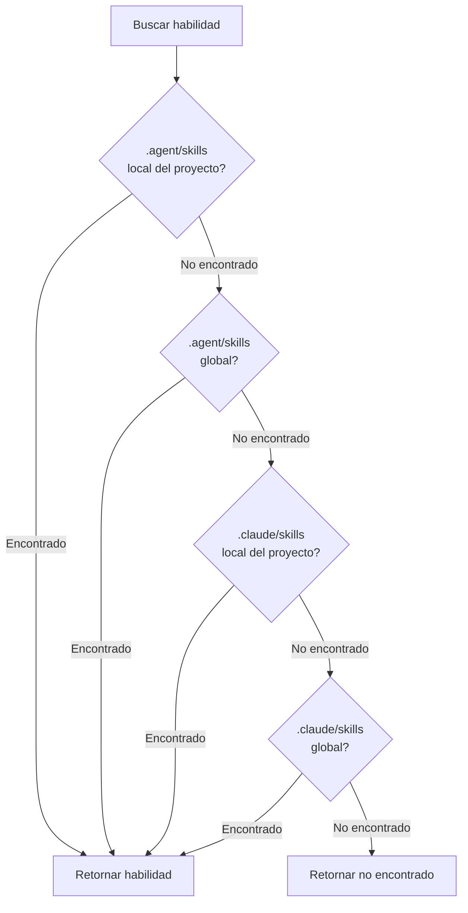

# Modo Universal: Entorno multiagente

## Qué podrás hacer después de este tutorial

- Entender el valor central y el propósito de diseño del modo Universal
- Dominar el uso del flag `--universal`
- Conocer las diferencias entre `.agent/skills` y `.claude/skills`
- Comprender las reglas de prioridad de búsqueda de 4 niveles
- Gestionar habilidades de manera unificada en entornos multiagente y evitar conflictos
- Compartir el mismo conjunto de habilidades entre múltiples agentes como Claude Code, Cursor, Windsurf, Aider, etc.

::: info Conocimientos previos

Este tutorial asume que ya conoces [Instalación global vs. local del proyecto](../../platforms/global-vs-project/) y [Sincronización de habilidades a AGENTS.md](../../start/sync-to-agents/), y que entiendes las ubicaciones de instalación básicas y el flujo de sincronización.

:::

---

## Tu dilema actual

Es posible que ya hayas aprendido a instalar y sincronizar habilidades, pero:

- **¿Cómo comparten habilidades múltiples agentes?**: Usas simultáneamente Claude Code y Cursor, pero cada uno instala habilidades por separado, lo que genera desorden
- **Conflictos con el Marketplace de Claude Code**: Después de instalar habilidades, se producen conflictos con el mercado de complementos nativo de Claude Code
- **Ubicaciones de AGENTS.md no unificadas**: Diferentes agentes requieren diferentes rutas de AGENTS.md, lo que dificulta el mantenimiento
- **Instalación repetida de habilidades**: Cada agente necesita instalar un conjunto completo de habilidades, desperdiciando espacio en disco

En realidad, OpenSkills proporciona el modo Universal, diseñado específicamente para resolver los problemas de gestión de habilidades en entornos multiagente.

---

## Cuándo usar esta técnica

**Escenarios aplicables del modo Universal**:

| Escenario | ¿Necesita el modo Universal? | Ejemplo |
|--- | --- | ---|
| **Agente único** (solo Claude Code) | ❌ No | Solo usas Claude Code, usa directamente el `.claude/skills` predeterminado |
| **Múltiples agentes** (Claude Code + otros) | ✅ Sí | Usas simultáneamente Claude Code y Cursor/Windsurf/Aider |
| **Evitar conflictos con el Marketplace** | ✅ Sí | No quieres conflictos con el mercado de complementos nativo de Claude Code |
| **Gestión unificada de AGENTS.md** | ✅ Sí | Múltiples agentes comparten el mismo archivo AGENTS.md |

::: tip Práctica recomendada

- **Modo predeterminado para agente único**: Cuando solo uses Claude Code, usa la instalación predeterminada en `.claude/skills`
- **Modo Universal para múltiples agentes**: Cuando uses múltiples agentes simultáneamente, usa `--universal` para instalar en `.agent/skills`
- **Estándares unificados para colaboración en equipo**: El equipo debe acordar claramente qué modo usar para evitar confusiones

:::

---

## Idea central: Directorio unificado, uso compartido multiagente

OpenSkills ofrece dos modos de directorio de habilidades:

**Modo predeterminado (`.claude/skills`)**:
- Diseñado específicamente para Claude Code
- Compatible con el Marketplace de Claude Code
- Ubicación de instalación: `./.claude/skills/` o `~/.claude/skills/`

**Modo Universal (`.agent/skills`)**:
- Diseñado específicamente para entornos multiagente
- Evita conflictos con el Marketplace de Claude Code
- Ubicación de instalación: `./.agent/skills/` o `~/.agent/skills/`

::: info Concepto importante

**Modo Universal**: Usa el flag `--universal` para instalar habilidades en el directorio `.agent/skills/`, permitiendo que múltiples agentes de codificación de IA (Claude Code, Cursor, Windsurf, Aider, etc.) compartan el mismo conjunto de habilidades y gestionarlas de manera unificada a través de AGENTS.md.

:::

**Prioridad de búsqueda de 4 niveles** (código fuente `dirs.ts:18-24`):

```typescript
export function getSearchDirs(): string[] {
  return [
    join(process.cwd(), '.agent/skills'),   // 1. Project universal (máxima prioridad)
    join(homedir(), '.agent/skills'),        // 2. Global universal
    join(process.cwd(), '.claude/skills'),  // 3. Project claude
    join(homedir(), '.claude/skills'),       // 4. Global claude
  ];
}
```

**Explicación de la prioridad**:
1. **Project Universal** (máxima): `.agent/skills/` tiene prioridad sobre `.claude/skills/`
2. **Global Universal**: Luego busca el `.agent/skills/` global
3. **Project Claude**: Luego el `.claude/skills/` local del proyecto
4. **Global Claude** (mínima): Finalmente el `.claude/skills/` global

---

## Sígueme paso a paso

### Paso 1: Instalar habilidades usando el modo Universal

**Por qué**
Primero aprende a usar el flag `--universal` para instalar habilidades.

Abre la terminal y ejecuta en cualquier proyecto:

```bash
# Instalar habilidades usando el modo Universal
npx openskills install anthropics/skills --universal -y

# Ver lista de habilidades
npx openskills list
```

**Deberías ver**: Cada habilidad en la lista tiene la etiqueta `(project)`

```
  codebase-reviewer         (project)
    Review code changes for issues...

Summary: 3 project, 0 global (3 total)
```

**Explicación**:
- Después de usar el flag `--universal`, las habilidades se instalan en el directorio `./.agent/skills/`
- El comando `list` aún muestra las etiquetas `(project)` o `(global)`
- `.agent/skills/` no entra en conflicto con el `.claude/skills/` predeterminado

---

### Paso 2: Ver la ubicación de instalación de habilidades

**Por qué**
Confirma la ubicación de almacenamiento real de los archivos de habilidades, entiende la estructura de directorios del modo Universal.

Ejecuta en la raíz del proyecto:

```bash
# Ver el directorio de habilidades del modo Universal
ls -la .agent/skills/

# Ver el contenido del directorio de habilidades
ls -la .agent/skills/codebase-reviewer/
```

**Deberías ver**:

```
.agent/skills/
├── codebase-reviewer/
│   ├── SKILL.md
│   └── .openskills.json    # Metadatos de instalación
├── file-writer/
│   ├── SKILL.md
│   └── .openskills.json
└── ...
```

**Explicación**:
- Las habilidades del modo Universal se instalan en el directorio `.agent/skills/`
- Cada habilidad tiene su propio directorio y metadatos
- Esta estructura es idéntica a la del `.claude/skills/` predeterminado

---

### Paso 3: Comparar las estructuras de directorios de ambos modos

**Por qué**
A través de una comparación real, entiende las diferencias entre `.claude/skills` y `.agent/skills`.

Ejecuta los siguientes comandos:

```bash
# Ver los directorios de habilidades de ambos modos
echo "=== .claude/skills (modo predeterminado) ==="
ls -la .claude/skills/ 2>/dev/null || echo "El directorio no existe"

echo "=== .agent/skills (modo Universal) ==="
ls -la .agent/skills/

# Ver los directorios de instalación global
echo "=== ~/.claude/skills (global predeterminado) ==="
ls -la ~/.claude/skills/ 2>/dev/null || echo "El directorio no existe"

echo "=== ~/.agent/skills (global Universal) ==="
ls -la ~/.agent/skills/ 2>/dev/null || echo "El directorio no existe"
```

**Deberías ver**:

```
=== .claude/skills (modo predeterminado) ===
El directorio no existe

=== .agent/skills (modo Universal) ===
codebase-reviewer
file-writer

=== ~/.claude/skills (global predeterminado) ===
git-helper
test-generator

=== ~/.agent/skills (global Universal) ===
El directorio no existe
```

**Explicación**:
- `.claude/skills/` y `.agent/skills/` son dos directorios independientes
- Pueden coexistir sin interferir entre sí
- Admiten dos métodos de instalación: local del proyecto y global

---

### Paso 4: Instalación Universal global

**Por qué**
Aprende a instalar habilidades de Universal globalmente para servir a todos los proyectos.

Ejecuta:

```bash
# Instalación Universal global de habilidades
npx openskills install anthropics/skills --universal --global -y

# Ver lista de habilidades
npx openskills list
```

**Deberías ver**:

```
  codebase-reviewer         (project)
    Review code changes for issues...
  file-writer              (global)
    Write files with format...

Summary: 1 project, 2 global (3 total)
```

**Explicación**:
- `--universal` y `--global` se pueden usar combinados
- Se instala en el directorio `~/.agent/skills/`
- Todos los proyectos pueden usar estas habilidades

---

### Paso 5: Verificar la prioridad de búsqueda de 4 niveles

**Por qué**
Entiende cómo OpenSkills busca habilidades en los 4 directorios.

Ejecuta:

```bash
# Instalar habilidades del mismo nombre en las 4 ubicaciones (diferentes versiones)
# 1. Project Universal
npx openskills install anthropics/skills --universal -y
# 2. Global Universal
npx openskills install anthropics/skills --universal --global -y
# 3. Project Claude
npx openskills install anthropics/skills -y
# 4. Global Claude
npx openskills install anthropics/skills --global -y

# Leer habilidad (priorizará la versión Project Universal)
npx openskills read codebase-reviewer | head -5
```

**Deberías ver**: La salida es el contenido de la habilidad de la versión `.agent/skills/` (Project Universal).

**Visualización de la prioridad de búsqueda**:



**Explicación**:
- La prioridad de `.agent/skills/` es mayor que `.claude/skills/`
- La prioridad local del proyecto es mayor que la global
- Cuando existen habilidades del mismo nombre simultáneamente, se prioriza la versión Project Universal
- Esto permite una configuración flexible con "prioridad Universal"

---

### Paso 6: Evitar conflictos con el Marketplace de Claude Code

**Por qué**
Entiende cómo el modo Universal resuelve los conflictos con el Marketplace de Claude Code.

Ejecuta:

```bash
# Instalar habilidades usando el modo Universal
npx openskills install anthropics/skills --universal -y

# Sincronizar a AGENTS.md
npx openskills sync

# Ver AGENTS.md
cat AGENTS.md
```

**Deberías ver**: AGENTS.md contiene la lista de habilidades, sin conflictos con el Marketplace de Claude Code.

**Explicación**:
- El modo Universal usa `.agent/skills/`, separado del `.claude/skills/` de Claude Code
- Evita conflictos entre las habilidades instaladas por OpenSkills y los complementos del Marketplace de Claude Code
- Múltiples agentes pueden compartir el mismo AGENTS.md con gestión unificada

---

## Punto de control ✅

Completa las siguientes verificaciones para confirmar que has dominado el contenido de esta lección:

- [ ] Puedes distinguir entre los dos modos `.claude/skills` y `.agent/skills`
- [ ] Conoces el propósito del flag `--universal`
- [ ] Entiendes las reglas de prioridad de búsqueda de 4 niveles
- [ ] Puedes elegir el modo de instalación adecuado según el escenario
- [ ] Sabes cómo gestionar habilidades de manera unificada en entornos multiagente
- [ ] Entiendes cómo el modo Universal evita conflictos con el Marketplace

---

## Advertencias de errores comunes

### Error común 1: Uso incorrecto del modo Universal en un entorno de agente único

**Escenario del error**: Solo usas Claude Code, pero usas el modo Universal

```bash
# ❌ Error: un solo agente no necesita el modo Universal
npx openskills install anthropics/skills --universal
```

**Problema**:
- Añade complejidad innecesaria
- No puede funcionar en conjunto con los complementos del Marketplace de Claude Code
- La ubicación de AGENTS.md puede no cumplir con las expectativas de Claude Code

**Enfoque correcto**:

```bash
# ✅ Correcto: agente único usa el modo predeterminado
npx openskills install anthropics/skills
```

---

### Error común 2: No usar el modo Universal con múltiples agentes

**Escenario del error**: Usas simultáneamente múltiples agentes, pero no usas el modo Universal

```bash
# ❌ Error: cada agente instala habilidades independientemente, gestión desordenada
npx openskills install anthropics/skills  # Para Claude Code
npx openskills install anthropics/skills --global  # Para Cursor
```

**Problema**:
- Instalación repetida de habilidades, desperdicio de espacio en disco
- Las versiones de habilidades usadas por diferentes agentes pueden ser inconsistentes
- AGENTS.md debe mantenerse por separado

**Enfoque correcto**:

```bash
# ✅ Correcto: múltiples agentes usan el modo Universal para gestión unificada
npx openskills install anthropics/skills --universal
# Todos los agentes comparten el mismo conjunto de habilidades y AGENTS.md
```

---

### Error común 3: Olvidar la prioridad de búsqueda del modo Universal

**Escenario del error**: Has instalado habilidades del mismo nombre en `.claude/skills` y `.agent/skills`, pero esperas usar la versión `.claude/skills`

```bash
# .agent/skills y .claude/skills tienen codebase-reviewer
# pero quieres usar la versión .claude/skills
npx openskills install anthropics/skills --universal  # Instalar nueva versión en .agent/skills
npx openskills install anthropics/skills  # Instalar versión antigua en .claude/skills
npx openskills read codebase-reviewer  # ❌ Aún lee la versión .agent/skills
```

**Problema**:
- La prioridad de `.agent/skills` es mayor que `.claude/skills`
- Incluso si `.claude/skills` tiene una nueva versión instalada, aún se lee la versión `.agent/skills`

**Enfoque correcto**:

```bash
# Opción 1: eliminar la versión .agent/skills
npx openskills remove codebase-reviewer  # Eliminar versión .agent/skills
npx openskills read codebase-reviewer  # ✅ Ahora lee la versión .claude/skills

# Opción 2: actualizar la versión .agent/skills
npx openskills update codebase-reviewer  # Actualizar versión .agent/skills
```

---

### Error común 4: Configuración incorrecta de la ruta de AGENTS.md

**Escenario del error**: Múltiples agentes requieren diferentes rutas de AGENTS.md

```bash
# Claude Code espera AGENTS.md en el directorio raíz
# Cursor espera AGENTS.md en el directorio .cursor/
# Windsurf espera AGENTS.md en el directorio .windsurf/
npx openskills sync  # Solo genera un AGENTS.md
```

**Problema**:
- Diferentes agentes no pueden encontrar AGENTS.md
- Error en la carga de habilidades

**Enfoque correcto**:

```bash
# Generar AGENTS.md en diferentes ubicaciones para diferentes agentes
npx openskills sync -o AGENTS.md           # Claude Code
npx openskills sync -o .cursor/AGENTS.md    # Cursor
npx openskills sync -o .windsurf/AGENTS.md  # Windsurf
```

---

## Resumen de esta lección

**Puntos clave**:

1. **El modo Universal es para entornos multiagente**: Usa `--universal` para instalar en `.agent/skills/`
2. **Prioridad de búsqueda de 4 niveles**: Project Universal > Global Universal > Project Claude > Global Claude
3. **Evitar conflictos con el Marketplace**: `.agent/skills/` está separado del `.claude/skills/` de Claude Code
4. **Gestión unificada de AGENTS.md**: Múltiples agentes comparten el mismo archivo AGENTS.md
5. **Principio recomendado**: Modo predeterminado para agente único, modo Universal para múltiples agentes

**Flujo de toma de decisiones**:

```
[Necesidad de instalar habilidades] → [¿Usas múltiples agentes?]
                       ↓ Sí
               [Usar modo Universal (--universal)]
                       ↓ No
               [¿Solo usas Claude Code?]
                       ↓ Sí
               [Usar modo predeterminado (.claude/skills)]
                       ↓ No
               [Ver documentación específica del agente, elegir modo apropiado]
```

**Fórmula mnemotécnica**:

- **Agente único**: Modo predeterminado más simple, Claude Code usa `.claude`
- **Múltiples agentes**: Modo Universal gestiona de manera unificada, `.agent/skills` evita conflictos

---

## Próxima lección

> En la próxima lección aprenderemos **[Ruta de salida personalizada](../custom-output-path/)**.
>
> Aprenderás:
> - Cómo usar el flag `--output/-o` para personalizar la ruta de salida de AGENTS.md
> - Cómo generar AGENTS.md en diferentes ubicaciones para diferentes agentes
> - Cómo usar rutas de salida personalizadas en entornos CI/CD
> - Cómo integrarlo en sistemas de documentación existentes

---

## Apéndice: Referencia del código fuente

<details>
<summary><strong>Haz clic para expandir y ver las ubicaciones del código fuente</strong></summary>

> Fecha de actualización: 2026-01-24

| Función        | Ruta del archivo                                                                                          | Línea    |
|--- | --- | ---|
| Utilidades de rutas de directorio | [`src/utils/dirs.ts`](https://github.com/numman-ali/openskills/blob/main/src/utils/dirs.ts#L7-L25)     | 7-25    |
| Determinación de ubicación de instalación | [`src/commands/install.ts`](https://github.com/numman-ali/openskills/blob/main/src/commands/install.ts#L84-L92) | 84-92   |
| Definición de argumentos de línea de comandos | [`src/cli.ts`](https://github.com/numman-ali/openskills/blob/main/src/cli.ts#L48)                    | 48      |

**Constantes clave**:
- `.claude/skills`: Directorio de habilidades predeterminado (compatible con Claude Code)
- `.agent/skills`: Directorio de habilidades universal (entorno multiagente)

**Funciones clave**:
- `getSkillsDir(projectLocal, universal)`: Devuelve la ruta del directorio de habilidades según los flags
- `getSearchDirs()`: Devuelve la lista de directorios de búsqueda de habilidades (prioridad de 4 niveles)

**Reglas de negocio**:
- El modo Universal usa el directorio `.agent/skills/`
- Prioridad de búsqueda de 4 niveles: Project Universal > Global Universal > Project Claude > Global Claude
- `--universal` y `--global` se pueden usar combinados

</details>
