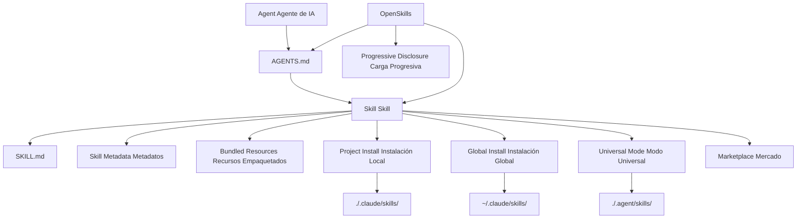

# Glosario

Este glosario explica los conceptos clave del sistema OpenSkills y AI Skills, ayudándote a comprender rápidamente la terminología profesional.

::: info Información
Este glosario está organizado alfabéticamente. Las relaciones entre términos se indican en las definiciones.
:::

---

## A

### Agent (Agente de IA)

**Definición**: Un agente de IA es una herramienta de IA capaz de ejecutar tareas de codificación, como Claude Code, Cursor, Windsurf, Aider, etc.

**Características**:
- Capaz de leer archivos de configuración `AGENTS.md`
- Compatible con la carga de skills en formato SKILL.md
- Puede invocar herramientas externas mediante línea de comandos (como `npx openskills read`)

**Rol en OpenSkills**: OpenSkills permite que cualquier agente que soporte leer AGENTS.md utilice el formato de skills de Anthropic.

**Términos relacionados**: [Skill](#skill), [AGENTS.md](#agentsmd)

---

## B

### Base Directory (Directorio Base)

**Definición**: La ruta completa del directorio del skill, utilizada para resolver referencias de rutas relativas dentro del skill.

**Función**:
- Proporciona la ruta absoluta del directorio del skill
- Se utiliza para resolver rutas relativas de recursos empaquetados como `references/`, `scripts/`, `assets/`

**Ejemplo**:
```
Base directory: /path/to/my-first-skill
```

Cuando el skill referencia `references/skill-format.md`, se resuelve como:
```
/path/to/my-first-skill/references/skill-format.md
```

**Términos relacionados**: [Skill](#skill), [Bundled Resources](#bundled-resources)

---

### Bundled Resources (Recursos Empaquetados)

**Definición**: Archivos de recursos adjuntos bajo el directorio del skill que proporcionan información detallada o herramientas necesarias para la ejecución del skill.

**Tipos**:
- **`references/`** - Documentación de referencia, documentación de API, etc.
- **`scripts/`** - Archivos de script ejecutables
- **`assets/`** - Plantillas, archivos de ejemplo, etc.

**Uso**:
- Mover documentación detallada a `references/` para mantener SKILL.md conciso
- Colocar código ejecutable en `scripts/` para facilitar la invocación
- Colocar plantillas y ejemplos en `assets/` para que los usuarios puedan consultarlos

**Ejemplo**:
```
my-skill/
├── SKILL.md
├── references/
│   └── api-docs.md
├── scripts/
│   └── helper.py
└── assets/
    └── template.json
```

**Términos relacionados**: [Skill](#skill), [SKILL.md](#skillmd)

---

## G

### Global Install (Instalación Global)

**Definición**: Instala el skill en el directorio `.claude/skills` bajo el directorio de inicio del usuario, haciendo que el skill sea accesible desde todos los proyectos.

**Ejemplo de comando**:
```bash
npx openskills install anthropics/skills --global
```

**Ruta objetivo**:
- macOS/Linux: `~/.claude/skills/`
- Windows: `%USERPROFILE%\.claude\skills\`

**Escenarios de uso**:
- Cuando deseas usar el mismo skill en múltiples proyectos
- Cuando no deseas que el skill sea versionado con el repositorio del proyecto

**Prioridad**: Al buscar skills, los instalados globalmente tienen menor prioridad que los instalados localmente en el proyecto (ver [Prioridad de Búsqueda de Skills](#skill-查找优先级)).

**Términos relacionados**: [Project Install](#project-install), [Prioridad de Búsqueda de Skills](#skill-查找优先级)

---

## M

### Marketplace (Mercado)

**Definición**: Un repositorio de GitHub donde se almacenan skills, utilizado para publicar y descubrir skills.

**Anthropic Marketplace**:
- Repositorio oficial de skills: `anthropics/skills`
- Proporciona skills mantenidos oficialmente (como pdf, git-workflow, skill-creator, etc.)

**Mercados de terceros**:
- Cualquier repositorio de GitHub puede servir como fuente de skills
- Soporta repositorios privados

**Instalación desde el mercado**:
```bash
# Instalar desde el mercado oficial de Anthropic
npx openskills install anthropics/skills

# Instalar desde un repositorio de terceros
npx openskills install your-org/your-skills

# Instalar desde un repositorio privado
npx openskills install git@github.com:your-org/private-skills.git
```

**Términos relacionados**: [Skill](#skill), [Global Install](#global-install)

---

## O

### OpenSkills

**Definición**: OpenSkills es un cargador universal del sistema de skills de Anthropic que permite a cualquier agente de codificación de IA usar skills en el formato estándar SKILL.md.

**Valor principal**:
- **Estándar unificado** - Todos los agentes usan el mismo formato de skill y descripción AGENTS.md
- **Carga progresiva** - Carga skills bajo demanda, manteniendo el contexto conciso
- **Soporte multi-agente** - Un conjunto de skills sirve a múltiples agentes
- **Amigable con código abierto** - Soporta rutas locales y repositorios git privados
- **Alta compatibilidad** - Totalmente compatible con el formato Claude Code

**Comandos principales**:
- `install` - Instalar skills
- `list` - Listar skills instalados
- `read` - Leer contenido del skill (usado por agentes de IA)
- `sync` - Sincronizar skills a AGENTS.md
- `update` - Actualizar skills instalados
- `manage` / `remove` - Eliminar skills

**Repositorio oficial**: https://github.com/numman-ali/openskills

**Términos relacionados**: [Skill](#skill), [SKILL.md](#skillmd), [AGENTS.md](#agentsmd)

---

## P

### Progressive Disclosure (Carga Progresiva)

**Definición**: Cargar skills solo cuando realmente se necesitan, evitando la expansión del contexto que resultaría de cargar todos los skills a la vez.

**Cómo funciona**:
1. La información del skill se almacena como una breve descripción en AGENTS.md
2. Cuando el usuario solicita una tarea, el agente de IA verifica si hay un skill que coincida
3. Si es así, carga el contenido completo del skill mediante `npx openskills read <skill-name>`
4. El contenido del skill solo es válido dentro del contexto de la tarea actual

**Ventajas**:
- Mantiene el contexto del agente de IA conciso
- Reduce el uso de tokens
- Mejora la velocidad de respuesta

**Ejemplo**:
```xml
<!-- AGENTS.md solo contiene descripciones breves -->
<available_skills>
  <skill>
    <name>pdf</name>
    <description>Comprehensive PDF manipulation toolkit...</description>
  </skill>
</available_skills>

<!-- El contenido completo solo se carga cuando el usuario solicita procesamiento PDF -->
npx openskills read pdf
```

**Términos relacionados**: [AGENTS.md](#agentsmd), [Skill](#skill)

---

### Project Install (Instalación Local de Proyecto)

**Definición**: Instala el skill en el directorio `.claude/skills` o `.agent/skills` bajo el directorio del proyecto, haciendo que el skill sea versionado junto con el repositorio del proyecto.

**Ejemplo de comando**:
```bash
# Instalación local de proyecto (predeterminado)
npx openskills install anthropics/skills

# Instalación local de proyecto en .agent/skills (modo universal)
npx openskills install anthropics/skills --universal
```

**Ruta objetivo**:
- Predeterminado: `./.claude/skills/`
- Modo Universal: `./.agent/skills/`

**Escenarios de uso**:
- El proyecto necesita skills específicos
- Se desea que los skills sean versionados con el repositorio del proyecto
- Cuando se trabaja en equipo para unificar la versión de los skills

**Prioridad**: Al buscar skills, los instalados localmente en el proyecto tienen mayor prioridad que los instalados globalmente (ver [Prioridad de Búsqueda de Skills](#skill-查找优先级)).

**Términos relacionados**: [Global Install](#global-install), [Universal Mode](#universal-mode), [Prioridad de Búsqueda de Skills](#skill-查找优先级)

---

## S

### Skill

**Definición**: Un documento que proporciona a los agentes de IA instrucciones específicas para ejecutar tareas, incluyendo instrucciones detalladas, pasos y recursos empaquetados.

**Características principales**:
- **Instrucciones estáticas** - Solo contiene texto y recursos, sin lógica dinámica
- **Componible** - Múltiples skills pueden combinarse
- **Versionable** - Gestionado junto con el repositorio del proyecto

**Estructura del skill**:
```
skill-name/
├── SKILL.md              # Archivo principal del skill
├── .openskills.json      # Metadatos de instalación (generado automáticamente)
├── references/           # Documentación de referencia (opcional)
├── scripts/             # Scripts ejecutables (opcional)
└── assets/              # Plantillas y ejemplos (opcional)
```

**Escenarios de uso**:
- Cuando el usuario solicita una tarea, el agente de IA verifica si hay un skill que coincida
- Si es así, carga el skill mediante `npx openskills read <name>`
- El agente de IA completa la tarea según las instrucciones del skill

**Ejemplos de skills**:
- `pdf` - Herramientas de procesamiento PDF
- `git-workflow` - Flujo de trabajo Git
- `check-branch-first` - Verificación de rama

**Términos relacionados**: [SKILL.md](#skillmd), [Bundled Resources](#bundled-resources), [Agent](#agent)

---

### Skill Metadata (Metadatos del Skill)

**Definición**: Un archivo JSON (`.openskills.json`) que registra información de la fuente de instalación del skill, utilizado para soportar actualizaciones de skills.

**Ubicación del archivo**: `.openskills.json` en el directorio del skill

**Descripción de campos**:
```json
{
  "source": "anthropics/skills",
  "sourceType": "github",
  "repoUrl": "https://github.com/anthropics/skills",
  "subpath": "skills/pdf",
  "installedAt": "2025-01-24T10:30:00.000Z"
}
```

**Función**:
- Registra la fuente del skill (GitHub, ruta local, etc.)
- Soporta el comando `openskills update` para actualizar skills desde la fuente
- Identifica skills que necesitan actualización pero no tienen fuente registrada

**Términos relacionados**: [Skill](#skill), [Global Install](#global-install), [Project Install](#project-install)

---

### Prioridad de Búsqueda de Skills

**Definición**: El orden de prioridad fijo que sigue OpenSkills al buscar skills en múltiples directorios.

**Orden de prioridad** (de mayor a menor):

| Prioridad | Directorio | Método de Instalación | Escenario de Uso |
| --- | --- | --- | ---|
| 1 | `./.agent/skills/` | `--universal` | Entornos multi-agente, evitando conflictos con Claude Code |
| 2 | `~/.agent/skills/` | `--universal --global` | Skills globales en entornos multi-agente |
| 3 | `./.claude/skills/` | Predeterminado (local de proyecto) | Skills locales de proyecto (opción predeterminada) |
| 4 | `~/.claude/skills/` | `--global` | Skills globales |

**Reglas de búsqueda**:
- Buscar en orden de prioridad
- Detenerse al encontrar el primer skill que coincida
- Los skills instalados localmente en el proyecto sobrescriben los skills globales con el mismo nombre

**Ejemplo**:
```bash
# Buscar skill llamado "pdf"
# 1. Primero verificar ./.agent/skills/pdf
# 2. Luego verificar ~/.agent/skills/pdf
# 3. Luego verificar ./.claude/skills/pdf
# 4. Finalmente verificar ~/.claude/skills/pdf
```

**Términos relacionados**: [Project Install](#project-install), [Global Install](#global-install), [Universal Mode](#universal-mode)

---

### SKILL.md

**Definición**: El archivo de formato estándar para skills, utilizando YAML frontmatter y contenido Markdown para definir los metadatos e instrucciones del skill.

**Formato de archivo**:
```markdown
---
name: my-skill
description: Cuándo usar este skill
---

# Instrucciones del Skill

Instrucciones detalladas para el agente de IA...

## Bundled Resources

Ver `references/skill-format.md` para detalles.
```

**Campos requeridos**:
- `name` - Nombre del skill (identificador único)
- `description` - Descripción del skill (se muestra en AGENTS.md)

**Campos opcionales**:
- `context` - Prompt de contexto (guía al agente de IA sobre cómo usar el skill)

**Mejores prácticas**:
- Usar oraciones imperativas/infinitivas: `"Para hacer X, ejecuta Y"`
- Evitar la segunda persona: no escribir `"Tú deberías..."`
- Mantener menos de 5,000 palabras
- Mover contenido detallado al directorio `references/`

**Términos relacionados**: [Skill](#skill), [AGENTS.md](#agentsmd), [Bundled Resources](#bundled-resources)

---

## U

### Universal Mode (Modo Universal)

**Definición**: Un modo de instalación para entornos multi-agente que instala skills en el directorio `.agent/skills/`, evitando conflictos con el Marketplace de Claude Code.

**Ejemplo de comando**:
```bash
npx openskills install anthropics/skills --universal
```

**Ruta objetivo**: `./.agent/skills/` o `~/.agent/skills/` (con `--global`)

**Escenarios de uso**:
- Usando Claude Code y otros agentes de IA simultáneamente (como Cursor, Windsurf)
- Cuando se desea que todos los agentes compartan el mismo conjunto de skills
- Para evitar conflictos de instalación de skills

**Prioridad de búsqueda**: Los skills instalados en modo Universal tienen la prioridad más alta (ver [Prioridad de Búsqueda de Skills](#skill-查找优先级)).

**Términos relacionados**: [Project Install](#project-install), [Prioridad de Búsqueda de Skills](#skill-查找优先级)

---

## A

### AGENTS.md

**Definición**: Un archivo de configuración leído por agentes de IA que contiene una lista de skills disponibles e instrucciones de uso, utilizando formato XML.

**Ubicación del archivo**: Directorio raíz del proyecto o ruta personalizada del usuario (predeterminado: directorio raíz del proyecto)

**Formato de archivo**:
```xml
<skills_system priority="1">

## Available Skills

<!-- SKILLS_TABLE_START -->
<usage>
When users ask you to perform tasks, check if any of the available skills below can help complete the task more effectively.

How to use skills:
- Invoke: `npx openskills read <skill-name>` (run in your shell)
- The skill content will load with detailed instructions
- Base directory provided in output for resolving bundled resources
</usage>

<available_skills>

<skill>
<name>pdf</name>
<description>Comprehensive PDF manipulation toolkit...</description>
<location>project</location>
</skill>

</available_skills>
<!-- SKILLS_TABLE_END -->

</skills_system>
```

**Función**:
- Declarar la lista de skills disponibles
- Proporcionar instrucciones de uso de skills
- Soportar la preservación de contenido personalizado al actualizar skills

**Forma de generación**:
```bash
npx openskills sync
```

**Forma de actualización**:
```bash
# Regenerar AGENTS.md (sobrescribirá el contenido existente)
npx openskills sync -y

# Salida a archivo personalizado
npx openskills sync -o custom-agents.md
```

**Términos relacionados**: [OpenSkills](#openskills), [Skill](#skill), [Progressive Disclosure](#progressive-disclosure)

---

## Diagrama de Relaciones de Términos

A continuación se muestran las relaciones entre los términos clave:



---

## Próxima Lección

> El glosario termina aquí. Ya has comprendido los conceptos clave de OpenSkills.
>
> A continuación puedes:
> - Volver a [Inicio Rápido](../../start/quick-start/) para practicar la instalación y uso
> - Consultar [Referencia de API CLI](../cli-api/) para conocer todos los comandos
> - Leer [Solución de Problemas](../../faq/troubleshooting/) para resolver problemas comunes

---

## Apéndice: Referencia de Código Fuente

<details>
<summary><strong>Haz clic para ver la ubicación del código fuente</strong></summary>

> Última actualización: 2026-01-24

| Término/Función | Ruta del Archivo | Número de Línea |
| --- | --- | --- |
| Skill Definición de Tipo | [`src/types.ts`](https://github.com/numman-ali/openskills/blob/main/src/types.ts#L1-L6) | 1-6 |
| SkillLocation Tipo | [`src/types.ts`](https://github.com/numman-ali/openskills/blob/main/src/types.ts#L8-L12) | 8-12 |
| InstallOptions Tipo | [`src/types.ts`](https://github.com/numman-ali/openskills/blob/main/src/types.ts#L14-L18) | 14-18 |
| SkillMetadata Tipo | [`src/types.ts`](https://github.com/numman-ali/openskills/blob/main/src/types.ts#L20-L24) | 20-24 |
| Lógica de búsqueda de skills | [`src/utils/skills.ts`](https://github.com/numman-ali/openskills/blob/main/src/utils/skills.ts) | Completo |
| Cálculo de rutas de directorio | [`src/utils/dirs.ts`](https://github.com/numman-ali/openskills/blob/main/src/utils/dirs.ts) | Completo |
| Generación de AGENTS.md | [`src/utils/agents-md.ts`](https://github.com/numman-ali/openskills/blob/main/src/utils/agents-md.ts) | Completo |
| Lectura/Escritura de Skill Metadata | [`src/utils/skill-metadata.ts`](https://github.com/numman-ali/openskills/blob/main/src/utils/skill-metadata.ts) | Completo |

**Constantes clave**:
- Ninguna (basado en cálculos de parámetros y directorios)

**Funciones clave**:
- `findAllSkills()` - Busca todos los skills instalados
- `findSkill(name)` - Busca un skill específico (por prioridad)
- `getSkillsDir(options)` - Calcula el directorio de instalación de skills
- `generateSkillsXml(skills)` - Genera contenido XML de AGENTS.md

</details>
