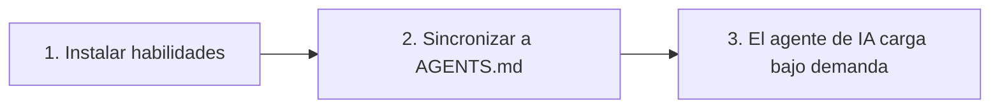

# Inicio Rápido de OpenSkills: Domina el Sistema de Habilidades de IA en 5 Minutos

## Qué Podrás Hacer al Terminar

Al completar esta lección, serás capaz de:

- Completar la instalación de OpenSkills y el despliegue de tu primera habilidad en 5 minutos
- Usar los comandos `openskills install` y `openskills sync` para gestionar habilidades
- Hacer que los agentes de IA (Claude Code, Cursor, Windsurf, etc.) reconozcan y utilicen las habilidades instaladas
- Comprender el valor principal de OpenSkills: formato de habilidades unificado, carga progresiva y soporte multi-agente

## Tu Situación Actual

Es posible que hayas enfrentado estos problemas:

- **Las habilidades no funcionan entre agentes**: Las habilidades de Claude Code no se pueden reutilizar en Cursor o Windsurf
- **Explosión de contexto**: Cargar demasiadas habilidades hace que el consumo de tokens del agente de IA sea excesivo
- **Formato de habilidades caótico**: Diferentes agentes usan diferentes formas de definir habilidades, lo que aumenta el costo de aprendizaje
- **Las habilidades privadas no se pueden compartir**: Las habilidades internas de la empresa no se pueden distribuir fácilmente entre los miembros del equipo

OpenSkills resuelve estos problemas.

## Cuándo Usar Esta Técnica

Cuando necesites:

- Instalar habilidades especializadas para agentes de codificación de IA (como procesamiento de PDF, flujos de trabajo Git, revisión de código, etc.)
- Unificar la gestión de habilidades entre múltiples agentes de IA
- Usar repositorios de habilidades privados o personalizados
- Permitir que la IA cargue habilidades bajo demanda, manteniendo el contexto simplificado

## 🎒 Preparación Antes de Comenzar

::: warning Verificación de Requisitos Previos

Antes de comenzar, por favor confirma:

1. **Node.js 20.6 o superior**
```bash
node --version
```
La salida debe mostrar `v20.6.0` o superior

2. **Git instalado** (para clonar habilidades desde repositorios de GitHub)
```bash
git --version
```

:::

## Concepto Principal

El funcionamiento de OpenSkills se puede resumir en tres pasos:



### Paso 1: Instalar Habilidades

Usa `openskills install` para instalar habilidades desde GitHub, rutas locales o repositorios privados. Las habilidades se copiarán al directorio `.claude/skills/` del proyecto.

### Paso 2: Sincronizar a AGENTS.md

Usa `openskills sync` para generar el archivo AGENTS.md, que contiene etiquetas XML con la lista de habilidades. El agente de IA leerá este archivo para conocer las habilidades disponibles.

### Paso 3: El Agente de IA Carga Bajo Demanda

Cuando el usuario solicita una tarea específica, el agente de IA cargará dinámicamente el contenido de la habilidad correspondiente mediante `npx openskills read <nombre-habilidad>`, en lugar de cargar todas las habilidades de una vez.

::: info ¿Por qué "carga progresiva"?

Método tradicional: Todas las habilidades se precargan en el contexto → alto consumo de tokens, respuesta lenta
OpenSkills: Carga bajo demanda → solo se cargan las habilidades necesarias → contexto simplificado, respuesta rápida

:::

---

## Sígueme Paso a Paso

Ahora completaremos el proceso de instalación y uso paso a paso.

### Paso 1: Entra en el Directorio de Tu Proyecto

Primero, entra en el directorio del proyecto en el que estás trabajando:

```bash
cd /ruta/a/tu/proyecto
```

**Por qué**

OpenSkills instala las habilidades por defecto en el directorio `.claude/skills/` del proyecto, de modo que las habilidades pueden versionarse con el proyecto y los miembros del equipo pueden compartirlas.

**Lo que deberías ver**:

Tu directorio de proyecto debe contener uno de los siguientes:

- `.git/` (repositorio Git)
- `package.json` (proyecto Node.js)
- Otros archivos del proyecto

::: tip Práctica Recomendada

Incluso si es un proyecto nuevo, se recomienda inicializar primero un repositorio Git para gestionar mejor los archivos de habilidades.

:::

---

### Paso 2: Instalar Tu Primera Habilidad

Usa el siguiente comando para instalar habilidades desde el repositorio oficial de Anthropic:

```bash
npx openskills install anthropics/skills
```

**Por qué**

`anthropics/skills` es el repositorio de habilidades mantenido oficialmente por Anthropic, que contiene ejemplos de habilidades de alta calidad, ideal para la primera experiencia.

**Lo que deberías ver**:

El comando iniciará una interfaz de selección interactiva:

```
? Select skills to install: (Press <space> to select, <a> to toggle all, <i> to invert selection, and <enter> to proceed)
❯ ◉ pdf Comprehensive PDF manipulation toolkit for extracting text and tables...
◯ check-branch-first Git workflow: Always check current branch before making changes...
◯ git-workflow Git workflow: Best practices for commits, branches, and PRs...
◯ skill-creator Guide for creating effective skills...
```

Usa la barra espaciadora para seleccionar las habilidades que deseas instalar, luego presiona Enter para confirmar.

::: tip Consejo Práctico

La primera vez se recomienda seleccionar solo 1-2 habilidades (como `pdf` y `git-workflow`), familiarizarse con el proceso y luego instalar más.

:::

**Lo que deberías ver** (después de la instalación exitosa):

```
✓ Installed: pdf
✓ Installed: git-workflow

Skills installed to: /ruta/a/tu/proyecto/.claude/skills/

Next steps:
Run: npx openskills sync
This will update AGENTS.md with your installed skills
```

---

### Paso 3: Sincronizar Habilidades a AGENTS.md

Ahora ejecuta el comando de sincronización:

```bash
npx openskills sync
```

**Por qué**

El comando `sync` genera el archivo AGENTS.md, que contiene etiquetas XML con la lista de habilidades. El agente de IA leerá este archivo para conocer las habilidades disponibles.

**Lo que deberías ver**:

```
? Select skills to sync: (Press <space> to select, <a> to toggle all, <i> to invert selection, and <enter> to proceed)
❯ ◉ pdf [project]
◯ git-workflow [project]
```

Usa la barra espaciadora para seleccionar las habilidades a sincronizar, luego presiona Enter para confirmar.

**Lo que deberías ver** (después de la sincronización exitosa):

```
✓ Synced: pdf
✓ Synced: git-workflow

Updated: AGENTS.md
```

---

### Paso 4: Verificar el Archivo AGENTS.md

Visualiza el archivo AGENTS.md generado:

```bash
cat AGENTS.md
```

**Lo que deberías ver**:

```xml
<skills_system priority="1">

## Available Skills

<!-- SKILLS_TABLE_START -->
<usage>
When users ask you to perform tasks, check if any of available skills below can help complete task more effectively.

How to use skills:
- Invoke: `npx openskills read <skill-name>` (run in your shell)
- The skill content will load with detailed instructions
- Base directory provided in output for resolving bundled resources

Usage notes:
- Only use skills listed in <available_skills> below
- Do not invoke a skill that is already loaded in your context
</usage>

<available_skills>

<skill>
<name>pdf</name>
<description>Comprehensive PDF manipulation toolkit for extracting text and tables...</description>
<location>project</location>
</skill>

<skill>
<name>git-workflow</name>
<description>Git workflow: Best practices for commits, branches, and PRs...</description>
<location>project</location>
</skill>

</available_skills>
<!-- SKILLS_TABLE_END -->

</skills_system>
```

---

### Paso 5: Ver las Habilidades Instaladas

Usa el comando `list` para ver las habilidades instaladas:

```bash
npx openskills list
```

**Lo que deberías ver**:

```
Installed Skills:

pdf [project]
Comprehensive PDF manipulation toolkit for extracting text and tables...

git-workflow [project]
Git workflow: Best practices for commits, branches, and PRs...

Total: 2 skills (project: 2, global: 0)
```

**Lo que deberías ver** (explicación):

- El nombre de la habilidad está a la izquierda
- La etiqueta `[project]` indica que es una habilidad instalada localmente en el proyecto
- La descripción de la habilidad se muestra debajo

---

## Punto de Control ✅

Después de completar los pasos anteriores, deberías confirmar:

- [ ] El directorio `.claude/skills/` se ha creado y contiene las habilidades que instalaste
- [ ] El archivo `AGENTS.md` se ha generado y contiene etiquetas XML con la lista de habilidades
- [ ] Al ejecutar `openskills list` puedes ver las habilidades instaladas

Si todas las verificaciones pasan, ¡felicidades! Has instalado y configurado OpenSkills exitosamente.

---

## Advertencias de Problemas Comunes

### Problema 1: Comando `npx` no encontrado

**Mensaje de error**:

```
command not found: npx
```

**Causa**: Node.js no está instalado o no está configurado en PATH

**Solución**:

1. Reinstala Node.js (se recomienda usar [nvm](https://github.com/nvm-sh/nvm) para gestionar versiones de Node.js)
2. Reinicia la terminal después de confirmar la instalación

---

### Problema 2: Tiempo de espera de red durante la instalación

**Mensaje de error**:

```
Error: git clone failed
```

**Causa**: Acceso restringido a GitHub o red inestable

**Solución**:

1. Verifica la conexión de red
2. Configura un proxy (si es necesario):
```bash
git config --global http.proxy http://proxy.example.com:8080
```
3. Usa un mirror (si está disponible)

---

### Problema 3: Error de permisos

**Mensaje de error**:

```
Error: EACCES: permission denied
```

**Causa**: El directorio de destino no tiene permisos de escritura

**Solución**:

1. Verifica los permisos del directorio:
```bash
ls -la .claude/
```
2. Si el directorio no existe, créalo primero:
```bash
mkdir -p .claude/skills
```
3. Si los permisos son insuficientes, modifícalos (úsalo con precaución):
```bash
chmod -R 755 .claude/
```

---

## Resumen de la Lección

En esta lección aprendimos:

1. **El valor principal de OpenSkills**: formato de habilidades unificado, carga progresiva, soporte multi-agente
2. **Flujo de trabajo de tres pasos**: instalar habilidades → sincronizar a AGENTS.md → el agente de IA carga bajo demanda
3. **Comandos básicos**:
   - `npx openskills install <fuente>` - instalar habilidades
   - `npx openskills sync` - sincronizar habilidades a AGENTS.md
   - `npx openskills list` - ver habilidades instaladas
4. **Solución de problemas comunes**: problemas de red, problemas de permisos, etc.

Ahora puedes hacer que los agentes de IA usen estas habilidades. Cuando el agente de IA necesite realizar operaciones de procesamiento de PDF o Git, invocará automáticamente `npx openskills read <nombre-habilidad>` para cargar el contenido de la habilidad correspondiente.

---

## Próxima Lección

> En la próxima lección aprenderemos **[¿Qué es OpenSkills?](../what-is-openskills/)**
>
> Aprenderás:
> - La relación entre OpenSkills y Claude Code
> - Conceptos principales del sistema de habilidades
> - Por qué elegir CLI en lugar de MCP

---

## Apéndice: Referencia del Código Fuente

<details>
<summary><strong>Haz clic para expandir y ver la ubicación del código fuente</strong></summary>

> Fecha de actualización: 2026-01-24

### Funcionalidades Principales

| Funcionalidad | Ruta del Archivo | Número de Línea |
| --- | --- | --- |
| Instalar habilidades | [`src/commands/install.ts`](https://github.com/numman-ali/openskills/blob/main/src/commands/install.ts) | 83-424 |
| Sincronizar a AGENTS.md | [`src/commands/sync.ts`](https://github.com/numman-ali/openskills/blob/main/src/commands/sync.ts) | 18-109 |
| Listar habilidades | [`src/commands/list.ts`](https://github.com/numman-ali/openskills/blob/main/src/commands/list.ts) | 7-43 |
| Buscar todas las habilidades | [`src/utils/skills.ts`](https://github.com/numman-ali/openskills/blob/main/src/utils/skills.ts) | 30-64 |
| Generar XML | [`src/utils/agents-md.ts`](https://github.com/numman-ali/openskills/blob/main/src/utils/agents-md.ts) | 23-93 |
| Utilidad de rutas de directorio | [`src/utils/dirs.ts`](https://github.com/numman-ali/openskills/blob/main/src/utils/dirs.ts) | 18-25 |

### Funciones Clave

**install.ts**
- `installSkill(source, options)` - Función principal de instalación, soporta GitHub, rutas locales y repositorios privados
- `isLocalPath(source)` - Determina si es una ruta local
- `isGitUrl(source)` - Determina si es una URL de Git
- `getRepoName(repoUrl)` - Extrae el nombre del repositorio desde la URL de Git
- `isPathInside(targetPath, targetDir)` - Verificación de seguridad de traversal de rutas

**sync.ts**
- `syncAgentsMd(options)` - Sincroniza habilidades a AGENTS.md, soporta selección interactiva
- Soporta ruta de salida personalizada (flag `--output`)
- Preselecciona habilidades ya habilitadas en el archivo actual

**agents-md.ts**
- `parseCurrentSkills(content)` - Analiza las habilidades actuales en AGENTS.md
- `generateSkillsXml(skills)` - Genera XML en formato Claude Code
- `replaceSkillsSection(content, xml)` - Reemplaza la sección de habilidades en el archivo

**skills.ts**
- `findAllSkills()` - Busca todas las habilidades instaladas, elimina duplicados por prioridad
- `findSkill(skillName)` - Busca una habilidad específica
- Soporta detección de enlaces simbólicos y eliminación de duplicados

**dirs.ts**
- `getSkillsDir(projectLocal, universal)` - Obtiene la ruta del directorio de habilidades
- `getSearchDirs()` - Devuelve lista de directorios de búsqueda (prioridad: .agent proyecto → .agent global → .claude proyecto → .claude global)

### Constantes Importantes

- `.claude/skills/` - Ruta de instalación local del proyecto por defecto
- `.agent/skills/` - Ruta de instalación en modo Universal
- `~/.claude/skills/` - Ruta de instalación global
- `AGENTS.md` - Archivo de salida de sincronización por defecto

</details>
