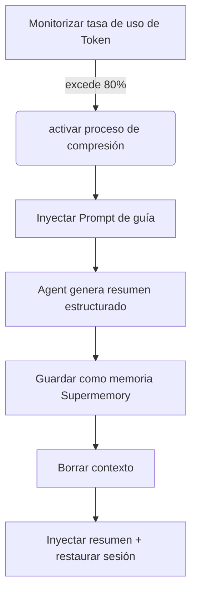

# Principio de Compresión Preventiva: Previene el Olvido del Contexto

## Lo que podrás hacer al terminar

Al terminar esta lección, podrás:
1.  **Entender** por qué el Agent se "vuelve torpe" en sesiones largas y cómo Supermemory resuelve este problema.
2.  **Dominar** las condiciones de activación y el flujo de trabajo de la compresión preventiva (Preemptive Compaction).
3.  **Configurar** umbrales de compresión adecuados para tu proyecto, equilibrando costo y calidad de memoria.
4.  **Verificar** si la compresión funciona normalmente, y ver los resúmenes de sesión generados.

## Tu situación actual

Al programar en pareja con IA, es posible que te hayas encontrado con estas situaciones:
*   **"Olvídate" mientras conversas**: En una tarea de refactorización larga, el Agent de repente olvida las reglas de nomenclatura de variables acordadas al inicio.
*   **Forzado a reiniciar sesión**: La ventana de contexto (Context Window) está llena, el IDE indica que debes borrar el historial, causando que pierdas todo el contexto del trabajo completado.
*   **Resumen de mala calidad**: La compresión automática común simplemente trunca o hace un resumen vago, perdiendo la información crítica de "qué hacer a continuación".

## Cuándo usar este método

*   Cuando realizas **refactorización grande** o **desarrollo de funcionalidades complejas**, esperando que la sesión dure mucho tiempo.
*   Cuando el modelo que usas tiene una ventana de contexto pequeña (ej: 32k/128k), fácil de alcanzar el límite.
*   Cuando deseas que el Agent recuerde con precisión "en qué paso estamos" incluso después de borrar el contexto.

---

## Idea Central: Preventiva vs Pasiva

La gestión de contexto tradicional suele ser **pasiva**: espera hasta que el contexto está completamente lleno (100%), luego se ve forzada a descartar mensajes antiguos. Es como esperar a que el disco duro esté lleno para empezar a borrar archivos, a menudo sin tiempo para organizar.

Supermemory adopta **compresión preventiva (Preemptive Compaction)**:

1.  **Intervención anticipada**: Por defecto se activa cuando la tasa de uso de Token alcanza el **80%**, dejando suficiente espacio para pensar y resumir.
2.  **Guía estructurada**: No dejar que el Agent escriba un resumen arbitrariamente, sino inyectar un Prompt específico, forzándolo a resumir en el formato "objetivo-progreso-pendiente".
3.  **Persistencia de memoria**: El resumen generado no solo se usa para restaurar la sesión actual, también se guarda como memoria de tipo `conversation`, disponible para recuperación futura.

### Diagrama de flujo de trabajo



---

## Explicación detallada del mecanismo de activación

Supermemory monitorea en tiempo real el uso de Token de cada sesión. El proceso de compresión es activado conjuntamente por las siguientes tres condiciones estrictas:

### 1. Umbral de tasa de uso de Token

Por defecto, cuando el total de Tokens (entrada + salida + caché) excede el **80%** del límite del modelo, se activa.

*   **Elemento de configuración**: `compactionThreshold`
*   **Valor predeterminado**: `0.80`
*   **Fuente del código**: [`src/services/compaction.ts`](https://github.com/supermemoryai/opencode-supermemory/blob/main/src/services/compaction.ts#L11)

### 2. Límite mínimo de Token

Para evitar activación errónea en sesiones cortas (ej: el contexto del modelo es grande, pero solo conversaste un poco), el sistema codifica un límite inferior. Solo cuando el uso excede **50,000 Tokens** se considerará la compresión.

*   **Constante**: `MIN_TOKENS_FOR_COMPACTION`
*   **Valor**: `50,000`
*   **Fuente del código**: [`src/services/compaction.ts`](https://github.com/supermemoryai/opencode-supermemory/blob/main/src/services/compaction.ts#L12)

### 3. Tiempo de enfriamiento

Para evitar activaciones consecutivas que causen bucles infinitos, entre dos compresiones debe haber al menos un intervalo de **30 segundos**.

*   **Constante**: `COMPACTION_COOLDOWN_MS`
*   **Valor**: `30,000` (ms)
*   **Fuente del código**: [`src/services/compaction.ts`](https://github.com/supermemoryai/opencode-supermemory/blob/main/src/services/compaction.ts#L13)

---

## Plantilla de resumen estructurado

Cuando la compresión se activa, Supermemory inyecta un System Prompt especial (`[COMPACTION CONTEXT INJECTION]`) al Agent, forzando que el resumen incluya las siguientes 5 partes:

| Sección | Explicación del contenido | Propósito |
| :--- | :--- | :--- |
| **1. User Requests** | Solicitudes originales del usuario (conservar tal cual) | Prevenir deriva de requisitos |
| **2. Final Goal** | Objetivo final a alcanzar | Clarificar el estado final |
| **3. Work Completed** | Trabajo completado, archivos modificados | Evitar trabajo repetitivo |
| **4. Remaining Tasks** | Pendientes restantes | Clarificar siguiente acción |
| **5. MUST NOT Do** | Cosas explícitamente prohibidas, intentos fallidos | Evitar cometer el mismo error |

::: details Clic para ver el código fuente del Prompt inyectado
```typescript
// src/services/compaction.ts

return `[COMPACTION CONTEXT INJECTION]

When summarizing this session, you MUST include the following sections in your summary:

## 1. User Requests (As-Is)
- List all original user requests exactly as they were stated
...

## 2. Final Goal
...

## 3. Work Completed
...

## 4. Remaining Tasks
...

## 5. MUST NOT Do (Critical Constraints)
...
This context is critical for maintaining continuity after compaction.
`;
```
:::

---

## Sígueme: configuración y verificación

### Paso 1: Ajustar umbral de compresión (opcional)

Si sientes que 80% es muy temprano o muy tarde, puedes ajustar en `~/.config/opencode/supermemory.jsonc`.

```jsonc
// ~/.config/opencode/supermemory.jsonc
{
  // ... otras configuraciones
  "compactionThreshold": 0.90
}
```

::: warning Advertencia de conflicto
Si instalaste `oh-my-opencode` u otros plugins de gestión de contexto, **debes desactivar** sus funciones de compresión integradas (como `context-window-limit-recovery`), de lo contrario causará doble compresión o conflicto lógico.
:::

### Paso 2: Observar activación de compresión

Cuando alcanzas el umbral en una sesión larga, presta atención al aviso Toast en la esquina inferior derecha del IDE.

**Deberías ver**:

1.  **Aviso preventivo**:
    > "Preemptive Compaction: Context at 81% - compacting with Supermemory context..."

    En este momento el sistema está generando el resumen.

2.  **Aviso de completado**:
    > "Compaction Complete: Session compacted with Supermemory context. Resuming..."

    En este momento el contexto se ha borrado, y se inyectó el nuevo resumen.

### Paso 3: Verificar guardado de memoria

Después de completar la compresión, el resumen generado se guarda automáticamente en Supermemory. Puedes verificar a través de CLI.

**Operación**:
En terminal ejecuta el siguiente comando para ver las memorias más recientes:

```bash
opencode run supermemory list --scope project --limit 1
```

**Deberías ver**:
Una memoria de tipo `conversation`, el contenido es exactamente el resumen estructurado anterior.

```json
{
  "id": "mem_123abc",
  "content": "[Session Summary]\n## 1. User Requests\n...",
  "type": "conversation",
  "scope": "opencode_project_..."
}
```

---

## Preguntas frecuentes (FAQ)

### Q: ¿Por qué mi sesión es larga y aún no se activa la compresión?
**A**: Verifica los siguientes puntos:
1.  **Total de Tokens**: ¿Excedió 50,000 Tokens? (Sesiones cortas incluso con alta proporción no se activarán).
2.  **Límite del modelo**: ¿OpenCode identificó correctamente el límite de contexto del modelo actual? Si falla la identificación, retrocederá al valor predeterminado de 200k, causando que el cálculo de proporción sea bajo.
3.  **Tiempo de enfriamiento**: ¿Ha pasado menos de 30 segundos desde la última compresión?

### Q: ¿Cuántos Tokens ocupa el resumen comprimido?
**A**: Depende del nivel de detalle del resumen, usualmente entre 500-2000 Tokens. Comparado con el contexto original de 100k+, esto es un ahorro enorme.

### Q: ¿Puedo activar manualmente la compresión?
**A**: La versión actual (v1.0) no soporta activación manual, completamente automatizada por algoritmo.

---

## Resumen de esta lección

La compresión preventiva es el "secreto de larga distancia" de Supermemory. A través de **intervención anticipada** y **resumen estructurado**, convierte el flujo lineal de diálogo en una instantánea de memoria refinada. Esto no solo resuelve el problema de desbordamiento de contexto, más importante aún, permite que el Agent incluso después de "olvidar" (borrar contexto), pueda continuar el trabajo anterior sin problemas leyendo la instantánea.

## Próxima lección

> En la siguiente lección aprenderemos **[Explicación de Configuración Profunda](../configuration/index.md)**.
>
> Aprenderás:
> - Cómo personalizar la ruta de almacenamiento de memoria
> - Configurar el límite de cantidad de resultados de búsqueda
> - Ajustar reglas de filtrado de privacidad

---

## Apéndice: Referencia del código fuente

<details>
<summary><strong>Clic para expandir y ver ubicación del código fuente</strong></summary>

> Fecha de actualización: 2026-01-23

| Función | Ruta del archivo | Número de línea |
| :--- | :--- | :--- |
| Definición de constantes de umbral | [`src/services/compaction.ts`](https://github.com/supermemoryai/opencode-supermemory/blob/main/src/services/compaction.ts#L11-L14) | 11-14 |
| Generación de Prompt de guía | [`src/services/compaction.ts`](https://github.com/supermemoryai/opencode-supermemory/blob/main/src/services/compaction.ts#L58-L98) | 58-98 |
| Lógica de detección de activación | [`src/services/compaction.ts`](https://github.com/supermemoryai/opencode-supermemory/blob/main/src/services/compaction.ts#L317-L358) | 317-358 |
| Lógica de guardado de resumen | [`src/services/compaction.ts`](https://github.com/supermemoryai/opencode-supermemory/blob/main/src/services/compaction.ts#L294-L315) | 294-315 |
| Definición de elementos de configuración | [`src/config.ts`](https://github.com/supermemoryai/opencode-supermemory/blob/main/src/config.ts#L22) | 22 |

**Constantes clave**:
- `DEFAULT_THRESHOLD = 0.80`: Umbral de activación predeterminado
- `MIN_TOKENS_FOR_COMPACTION = 50_000`: Número mínimo de Tokens para activación
- `COMPACTION_COOLDOWN_MS = 30_000`: Tiempo de enfriamiento (milisegundos)

</details>
