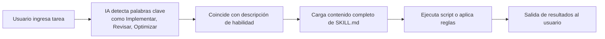

# Introducción a Agent Skills

## Lo que podrás hacer al terminar

- Entender qué es Agent Skills y cómo amplía las capacidades de los agentes de codificación con IA
- Conocer las funciones y escenarios de uso de los tres paquetes de habilidades principales
- Saber cuándo es apropiado usar Agent Skills para mejorar la eficiencia de desarrollo

## Tu situación actual

Al usar Claude, Cursor u otros agentes de codificación con IA en tu trabajo diario, puedes encontrar estos problemas:
- Deseas seguir las mejores prácticas, pero no sabes qué reglas recordar
- A menudo repites operaciones de implementación similares y deseas automatizarlas
- La calidad del código generado por la IA es inconsistente y falta un estándar unificado

## Idea central

**Agent Skills es un sistema de paquetes de habilidades** que proporciona "complementos" extensibles para los agentes de codificación con IA. Cada habilidad contiene:

- **SKILL.md**: archivo de definición de habilidad que indica al agente de IA cuándo activar la habilidad
- **scripts/**: scripts auxiliares (como scripts de implementación) que ejecutan tareas específicas
- **references/**: documentos de referencia (opcional) que proporcionan información de referencia detallada

::: tip Filosofía de diseño
Las habilidades adoptan un mecanismo de **carga bajo demanda**: solo el nombre y la descripción de la habilidad se cargan al inicio, el contenido completo se lee solo cuando la IA considera que es necesario. Esto reduce el uso del contexto y mejora la eficiencia.
:::

## Paquetes de habilidades disponibles

El proyecto proporciona tres paquetes de habilidades, cada uno dirigido a escenarios específicos:

### react-best-practices

Guía de optimización de rendimiento para React y Next.js, basada en los estándares de Vercel Engineering. Incluye más de 50 reglas, ordenadas por nivel de impacto.

**Escenarios de uso**:
- Escribir nuevos componentes de React o páginas de Next.js
- Revisar problemas de rendimiento del código
- Optimizar el tamaño del paquete o los tiempos de carga

**Categorías cubiertas**:
- Eliminar cascadas (Crítico)
- Optimización del tamaño del paquete (Crítico)
- Rendimiento del servidor (Alto)
- Obtención de datos del cliente (Medio-Alto)
- Optimización de re-render (Medio)
- Rendimiento de renderizado (Medio)
- Micro-optimizaciones de JavaScript (Bajo-Medio)
- Patrones avanzados (Bajo)

### web-design-guidelines

Auditoría de guías de diseño de interfaces web, verifica que el código cumpla con casi 100 mejores prácticas.

**Escenarios de uso**:
- Prompt: "Revisar mi interfaz de usuario"
- Verificar accesibilidad (Accesibilidad)
- Auditoría de consistencia de diseño
- Verificar rendimiento y experiencia de usuario

**Categorías cubiertas**:
- Accesibilidad (aria-labels, HTML semántico, manejo de teclado)
- Estados de foco (foco visible, modo focus-visible)
- Formularios (autocompletado, validación, manejo de errores)
- Animaciones (prefers-reduced-motion, transformaciones amigables con composición)
- Imágenes (dimensiones, carga diferida, texto alt)
- Tipografía, rendimiento, navegación, etc.

### vercel-deploy-claimable

Implementa aplicaciones y sitios web en Vercel con un clic, devuelve enlaces de vista previa y transferencia de propiedad.

**Escenarios de uso**:
- Prompt: "Implementar mi aplicación"
- Compartir rápidamente una vista previa del proyecto
- Implementación sin configuración, sin autenticación

**Características principales**:
- Detección automática de más de 40 marcos (Next.js, Vite, Astro, etc.)
- Devuelve URL de vista previa (sitio en tiempo real) y URL de reclamación (transferencia de propiedad)
- Manejo automático de proyectos HTML estáticos
- Excluye `node_modules` y `.git` durante la carga

## Cómo funcionan las habilidades

Cuando usas Claude u otro agente de IA, el flujo de activación de la habilidad es el siguiente:



**Ejemplo de flujo**:

1. **Entrada del usuario**: "Implementar mi aplicación"
2. **Detección de IA**: identifica la palabra clave "Implementar", coincide con la habilidad `vercel-deploy`
3. **Cargar habilidad**: lee el contenido completo de `SKILL.md`
4. **Ejecutar implementación**:
   - Ejecuta el script `deploy.sh`
   - Detecta el marco (lee package.json)
   - Empaqueta el proyecto como tarball
   - Sube a la API de Vercel
5. **Devolver resultado**:
    ```json
    {
      "previewUrl": "https://skill-deploy-abc123.vercel.app",
      "claimUrl": "https://vercel.com/claim-deployment?code=..."
    }
    ```

## Cuándo usar esta técnica

Mejor momento para usar Agent Skills:

| Escenario | Habilidad usada | Ejemplo de prompt de activación |
| --------- | --------------- | ------------------------------ |
| Escribir componentes de React | react-best-practices | "Revisar este componente de React para problemas de rendimiento" |
| Optimizar páginas de Next.js | react-best-practices | "Ayúdame a optimizar esta página de Next.js" |
| Verificar calidad de interfaz de usuario | web-design-guidelines | "Verificar accesibilidad de mi sitio" |
| Implementar proyecto | vercel-deploy-claimable | "Implementar mi aplicación en producción" |

## Modelo de seguridad

::: info Nota de seguridad
- **Ejecución local**: todas las habilidades se ejecutan localmente, sin carga de datos a servicios de terceros (excepto la API de implementación de Vercel)
- **Activación bajo demanda**: las habilidades solo cargan contenido detallado cuando la IA considera que es relevante, reduciendo el riesgo de filtración de privacidad
- **Código abierto transparente**: todas las habilidades y scripts son de código abierto y auditable
:::

## Advertencias sobre problemas comunes

### La habilidad no se activa

Si la habilidad no se activa, verifica:
- Si el prompt contiene suficientes palabras clave (como "Implementar", "Revisar")
- Si la habilidad está instalada correctamente en el directorio `~/.claude/skills/`
- Si usas claude.ai, confirma que la habilidad se ha agregado a la base de conocimientos del proyecto

### Permisos de red

Algunas habilidades necesitan acceso a la red:
- `vercel-deploy-claimable` necesita acceder a la API de implementación de Vercel
- `web-design-guidelines` necesita extraer las últimas reglas de GitHub

**Solución**: agrega los dominios necesarios en claude.ai/settings/capabilities.

## Resumen de esta lección

Agent Skills es un sistema de paquetes de habilidades diseñado para agentes de codificación con IA, que proporciona:
- **react-best-practices**: más de 50 reglas de optimización de rendimiento de React/Next.js
- **web-design-guidelines**: casi 100 mejores prácticas de diseño web
- **vercel-deploy-claimable**: implementación con un clic en Vercel

Las habilidades adoptan un mecanismo de carga bajo demanda para reducir el uso del contexto. Después de la instalación, los agentes de IA activarán automáticamente las habilidades correspondientes en tareas relacionadas.

## Próxima lección

> En la próxima lección aprenderemos **[Instalar Agent Skills](../installation/)**.
>
> Aprenderás:
> - Dos métodos de instalación: Claude Code y claude.ai
> - Configurar permisos de red
> - Verificar que las habilidades estén instaladas correctamente

---

## Apéndice: Referencia del código fuente

<details>
<summary><strong>Haz clic para expandir la ubicación del código fuente</strong></summary>

> Fecha de actualización: 2026-01-25

| Función        | Ruta de archivo                                                              | Número de línea    |
| ----------- | ----------------------------------------------------------------------------- | ----------------- |
| Lista de paquetes de habilidades   | [`README.md`](https://github.com/vercel-labs/agent-skills/blob/main/README.md#L7-L80) | 7-80    |
| Explicación de la estructura de habilidades | [`README.md`](https://github.com/vercel-labs/agent-skills/blob/main/README.md#L103-L110) | 103-110 |
| Especificación AGENTS.md | [`AGENTS.md`](https://github.com/vercel-labs/agent-skills/blob/main/AGENTS.md) | Texto completo    |
| Estructura del directorio de habilidades | [`AGENTS.md`](https://github.com/vercel-labs/agent-skills/blob/main/AGENTS.md#L11-L20) | 11-20   |
| Formato SKILL.md | [`AGENTS.md`](https://github.com/vercel-labs/agent-skills/blob/main/AGENTS.md#L29-L68) | 29-68   |
| Comando de empaquetado de habilidades | [`AGENTS.md`](https://github.com/vercel-labs/agent-skills/blob/main/AGENTS.md#L93-L96) | 93-96   |
| Método de instalación del usuario | [`AGENTS.md`](https://github.com/vercel-labs/agent-skills/blob/main/AGENTS.md#L98-L110) | 98-110  |
| Mecanismo de carga bajo demanda | [`AGENTS.md`](https://github.com/vercel-labs/agent-skills/blob/main/AGENTS.md#L72-L78) | 72-78   |
| Script de herramientas de compilación | [`packages/react-best-practices-build/package.json`](https://github.com/vercel-labs/agent-skills/blob/main/packages/react-best-practices-build/package.json) | Texto completo    |

**Constantes clave**:
- Sin constantes codificadas

**Funciones clave**:
- `build.ts`: compila AGENTS.md y casos de prueba
- `validate.ts`: verifica la integridad de los archivos de reglas
- `extract-tests.ts`: extrae casos de prueba de las reglas

</details>
