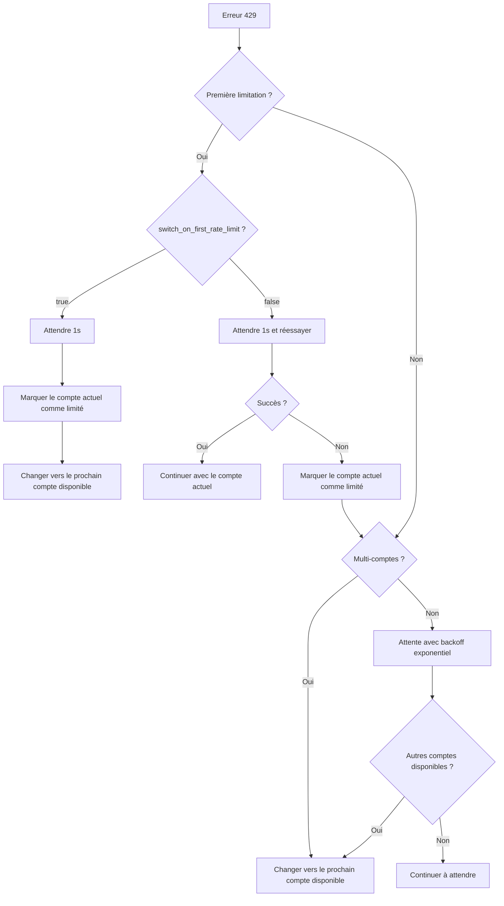

# Gestion des limitations de débit : Réessai automatique et changement de compte

## Ce que vous apprendrez

Maîtrisez le mécanisme intelligent de gestion des limitations de débit d'Antigravity Auth :
- Distinguer les 5 types d'erreurs 429 (quota épuisé, limite de débit, capacité épuisée, etc.)
- Comprendre l'algorithme de backoff exponentiel pour les réessais automatiques
- Maîtriser la logique de changement automatique en environnement multi-comptes
- Configurer le changement immédiat dès la première limitation ou après deux tentatives
- Utiliser le fallback à double quota Gemini pour améliorer la disponibilité

Fini les frustrations du type "tous les comptes sont limités, mais le quota n'est pas épuisé".

## Votre situation actuelle

Lors de l'utilisation de plusieurs comptes Google, vous rencontrez :
- Des erreurs 429 fréquentes sans savoir s'il faut réessayer ou changer de compte
- Des temps d'attente très variables selon le type de 429, sans savoir combien de temps attendre
- Tous les comptes limités alors que le quota réel n'est pas épuisé, à cause d'une détection imprécise
- Un timing de changement de quota Gemini flou, entraînant un gaspillage de quota

## Quand utiliser cette technique

Lorsque vous :
- Avez configuré plusieurs comptes mais rencontrez fréquemment des erreurs 429
- Souhaitez optimiser le taux de succès des requêtes en environnement multi-comptes
- Devez ajuster la stratégie de réessai (ex : changement immédiat dès la première limitation)
- Utilisez des modèles Gemini et voulez exploiter le double quota

## Concept clé

### Qu'est-ce que la gestion des limitations de débit

Lorsque le plugin Antigravity Auth rencontre une erreur 429, il exécute automatiquement les opérations suivantes :

1. **Détection du type de limitation** : Analyse le `reason` ou `message` de la réponse pour distinguer 5 types de limitations
2. **Calcul du temps de backoff** : Calcule intelligemment le temps d'attente selon le type de limitation et le nombre d'échecs
3. **Exécution de la stratégie** :
   - **Multi-comptes** : Priorité au changement vers un compte disponible
   - **Compte unique** : Réessai avec backoff exponentiel
4. **Enregistrement de l'état** : Met à jour l'état de limitation du compte pour les requêtes suivantes

::: info Pourquoi une gestion intelligente ?
Google impose des limites de débit par compte. Un simple "changer de compte à chaque 429" peut entraîner des changements fréquents et manquer les comptes qui récupèrent rapidement ; un simple "attendre et réessayer" peut gaspiller le quota des autres comptes disponibles. La gestion intelligente trouve l'équilibre optimal entre "changer" et "attendre".
:::

### Les 5 types de limitations de débit

Antigravity Auth distingue les 5 types de limitations suivants selon le champ `reason` ou le contenu du `message` de la réponse API :

| Type | Raison | Stratégie de backoff | Scénario typique |
| --- | --- | --- | --- |
| `QUOTA_EXHAUSTED` | Quota épuisé (quotidien ou mensuel) | Backoff progressif : 1min → 5min → 30min → 120min | Quota quotidien épuisé |
| `RATE_LIMIT_EXCEEDED` | Requêtes trop rapides (limite par minute) | Fixe 30 secondes | Grand nombre de requêtes en peu de temps |
| `MODEL_CAPACITY_EXHAUSTED` | Capacité serveur du modèle insuffisante | Fixe 15 secondes | Heures de pointe |
| `SERVER_ERROR` | Erreur interne serveur (5xx) | Fixe 20 secondes | Service instable |
| `UNKNOWN` | Raison inconnue | Fixe 60 secondes | Erreur non analysable |

**Formule de calcul du temps de backoff** (accounts.ts:51-75) :

```typescript
// QUOTA_EXHAUSTED : backoff progressif (basé sur le nombre d'échecs consécutifs)
// Échec 1 : 1min (60_000ms)
// Échec 2 : 5min (300_000ms)
// Échec 3 : 30min (1_800_000ms)
// Échec 4+ : 120min (7_200_000ms)

// Autres types : backoff fixe
// RATE_LIMIT_EXCEEDED : 30s
// MODEL_CAPACITY_EXHAUSTED : 15s
// SERVER_ERROR : 20s
// UNKNOWN : 60s
```

### Algorithme de backoff exponentiel

Antigravity Auth utilise un algorithme de **backoff exponentiel avec déduplication** :

**Logique principale** (plugin.ts:509-567) :

```typescript
// 1. Fenêtre de déduplication : les 429 concurrents dans les 2 secondes sont considérés comme un seul événement
const RATE_LIMIT_DEDUP_WINDOW_MS = 2000;

// 2. Réinitialisation d'état : le compteur est réinitialisé après 2 minutes sans 429
const RATE_LIMIT_STATE_RESET_MS = 120_000;

// 3. Backoff exponentiel : baseDelay * 2^(attempt-1), maximum 60s
const expBackoff = Math.min(baseDelay * Math.pow(2, attempt - 1), 60000);
```

**Pourquoi une fenêtre de déduplication ?**

Supposons que vous ayez 3 requêtes concurrentes qui déclenchent toutes un 429 :
- **Sans déduplication** : Chaque requête incrémente le compteur, donnant attempt=3, backoff de 4s (2^2 × 1s)
- **Avec déduplication** : Considéré comme un seul événement, attempt=1, backoff de 1s

La fenêtre de déduplication évite que les requêtes concurrentes n'amplifient excessivement le temps de backoff.

### Logique de changement multi-comptes

En environnement multi-comptes, Antigravity Auth adopte une stratégie de **priorité au changement, réessai en dernier recours** :

**Flux de décision** :



**Configuration clé** (config/schema.ts:256-259) :

| Option | Valeur par défaut | Description |
| --- | --- | --- |
| `switch_on_first_rate_limit` | `true` | Changer immédiatement de compte dès la première limitation (après 1s d'attente) |
| `max_rate_limit_wait_seconds` | `300` | Temps d'attente maximum quand tous les comptes sont limités (5 minutes) |

**Configuration recommandée** :

- **Multi-comptes (2+)** : `switch_on_first_rate_limit: true`, changement immédiat pour éviter le gaspillage de quota
- **Compte unique** : Cette option est sans effet, le backoff exponentiel est utilisé automatiquement

### Fallback à double quota Gemini

Les modèles Gemini supportent deux pools de quota indépendants :
- **Pool quota Antigravity** : Utilisé en priorité, mais capacité limitée
- **Pool quota Gemini CLI** : Utilisé en secours, capacité plus importante

**Logique de fallback** (plugin.ts:1318-1345) :

```
1. Envoyer la requête avec le pool quota Antigravity
2. Erreur 429 de limitation
3. Vérifier si un autre compte a du quota Antigravity disponible
   - Oui : Changer de compte, continuer avec Antigravity
   - Non : Si quota_fallback=true, basculer vers le pool quota Gemini CLI
```

**Option de configuration** (config/schema.ts:179) :

```json
{
  "quota_fallback": true  // false par défaut
}
```

**Exemple** :

Vous avez 2 comptes, tous deux en 429 :

| État | quota_fallback=false | quota_fallback=true |
| --- | --- | --- |
| Compte 1 (Antigravity) | Limité | Limité → Essayer Gemini CLI |
| Compte 2 (Antigravity) | Limité | Limité → Essayer Gemini CLI |
| Résultat | Attendre 5 minutes avant de réessayer | Basculer vers Gemini CLI, pas d'attente |

::: tip Avantages du double quota
Le pool quota Gemini CLI est généralement plus grand, le fallback peut significativement améliorer le taux de succès des requêtes. Attention cependant :
- Les modèles avec le suffixe explicite `:antigravity` ne basculeront pas
- Le fallback n'intervient que lorsque tous les comptes ont épuisé leur quota Antigravity
:::

### Logique de réessai pour compte unique

Si vous n'avez qu'un seul compte, Antigravity Auth utilise le **réessai avec backoff exponentiel** :

**Formule de réessai** (plugin.ts:1373-1375) :

```typescript
// 1ère fois : 1s
// 2ème fois : 2s (1s × 2^1)
// 3ème fois : 4s (1s × 2^2)
// 4ème fois : 8s (1s × 2^3)
// ...
// Maximum : 60s
const expBackoffMs = Math.min(1000 * Math.pow(2, attempt - 1), 60000);
```

**Flux de réessai** :

```
1ère tentative : Erreur 429
  ↓ Attendre 1s et réessayer (réessai rapide)
2ème tentative : Toujours 429
  ↓ Attendre 2s et réessayer
3ème tentative : Toujours 429
  ↓ Attendre 4s et réessayer
...
```

**Différence avec le multi-comptes** :

| Scénario | Stratégie | Temps d'attente |
| --- | --- | --- |
| Compte unique | Réessai avec backoff exponentiel | 1s → 2s → 4s → 8s → ... → 60s |
| Multi-comptes | Changement de compte | 1s (1ère fois) ou 5s (2ème fois) |

## 🎒 Prérequis

::: warning Vérification préalable
Assurez-vous d'avoir complété :
- [x] Configuration multi-comptes (au moins 2 comptes Google)
- [x] Compréhension des [stratégies de sélection de compte](/fr/NoeFabris/opencode-antigravity-auth/advanced/account-selection-strategies/)
- [x] Compréhension du [système à double quota](/fr/NoeFabris/opencode-antigravity-auth/platforms/dual-quota-system/)
:::

## Tutoriel pas à pas

### Étape 1 : Activer les logs de débogage pour observer les limitations

**Pourquoi**
Les logs de débogage affichent les détails des limitations de débit, vous aidant à comprendre le fonctionnement du plugin.

**Procédure**

Activer les logs de débogage :

```bash
export OPENCODE_ANTIGRAVITY_DEBUG=1
```

Envoyer des requêtes pour déclencher une limitation :

```bash
# Envoyer plusieurs requêtes concurrentes (pour déclencher un 429)
for i in {1..10}; do
  opencode run "Test $i" --model=google/antigravity-gemini-3-pro &
done
wait
```

**Résultat attendu** :

```
[RateLimit] 429 on Account 0 family=claude retryAfterMs=60000
  message: You have exceeded the quota for this request.
  quotaResetTime: 2026-01-23T12:00:00Z
  retryDelayMs: 60000
  reason: QUOTA_EXHAUSTED

Rate limited. Quick retry in 1s... (notification toast)
```

**Interprétation des logs** :

- `429 on Account 0 family=claude` : Le compte 0 est limité pour le modèle Claude
- `retryAfterMs=60000` : Le serveur recommande d'attendre 60 secondes
- `reason: QUOTA_EXHAUSTED` : Quota épuisé (temps de backoff progressif)

### Étape 2 : Configurer le changement immédiat dès la première limitation

**Pourquoi**
Si vous avez plusieurs comptes, le changement immédiat dès la première limitation maximise l'utilisation du quota et évite l'attente.

**Procédure**

Modifier le fichier de configuration :

```bash
cat > ~/.config/opencode/antigravity.json << 'EOF'
{
  "$schema": "https://raw.githubusercontent.com/NoeFabris/opencode-antigravity-auth/main/assets/antigravity.schema.json",
  "switch_on_first_rate_limit": true
}
EOF
```

**Résultat attendu** : Le fichier de configuration est mis à jour.

**Vérifier que la configuration est active** :

Envoyer plusieurs requêtes et observer le comportement après la première limitation :

```bash
export OPENCODE_ANTIGRAVITY_DEBUG=1
for i in {1..5}; do
  opencode run "Test $i" --model=google/antigravity-gemini-3-pro &
done
wait
```

**Résultat attendu** :

```
[RateLimit] 429 on Account 0 family=gemini retryAfterMs=30000
Server at capacity. Switching account in 1s... (notification toast)
[AccountContext] Selected account: user2@gmail.com (index: 1)
```

**Points clés** :
- Après le premier 429, attente de 1s
- Changement automatique vers le prochain compte disponible (index: 1)
- Pas de réessai sur le compte actuel

### Étape 3 : Désactiver le changement immédiat dès la première limitation

**Pourquoi**
Si vous préférez d'abord réessayer sur le compte actuel (pour éviter les changements fréquents), vous pouvez désactiver cette option.

**Procédure**

Modifier le fichier de configuration :

```bash
cat > ~/.config/opencode/antigravity.json << 'EOF'
{
  "$schema": "https://raw.githubusercontent.com/NoeFabris/opencode-antigravity-auth/main/assets/antigravity.schema.json",
  "switch_on_first_rate_limit": false
}
EOF
```

**Résultat attendu** : Le fichier de configuration est mis à jour.

**Vérifier que la configuration est active** :

Envoyer à nouveau plusieurs requêtes :

```bash
export OPENCODE_ANTIGRAVITY_DEBUG=1
for i in {1..5}; do
  opencode run "Test $i" --model=google/antigravity-gemini-3-pro &
done
wait
```

**Résultat attendu** :

```
[RateLimit] 429 on Account 0 family=gemini retryAfterMs=30000
Rate limited. Quick retry in 1s... (notification toast)
[RateLimit] 429 on Account 0 family=gemini retryAfterMs=30000
Rate limited again. Switching account in 5s... (notification toast)
[AccountContext] Selected account: user2@gmail.com (index: 1)
```

**Points clés** :
- Premier 429 : Attendre 1s et **réessayer sur le compte actuel**
- Deuxième 429 : Attendre 5s puis **changer de compte**
- Si le réessai réussit, continuer avec le compte actuel

### Étape 4 : Activer le fallback à double quota Gemini

**Pourquoi**
Les modèles Gemini supportent le double quota, activer le fallback peut significativement améliorer le taux de succès des requêtes.

**Procédure**

Modifier le fichier de configuration :

```bash
cat > ~/.config/opencode/antigravity.json << 'EOF'
{
  "$schema": "https://raw.githubusercontent.com/NoeFabris/opencode-antigravity-auth/main/assets/antigravity.schema.json",
  "quota_fallback": true
}
EOF
```

**Résultat attendu** : Le fichier de configuration est mis à jour.

**Vérifier que la configuration est active** :

Envoyer des requêtes Gemini (en s'assurant de déclencher la limitation du pool Antigravity) :

```bash
export OPENCODE_ANTIGRAVITY_DEBUG=1
for i in {1..5}; do
  opencode run "Test $i" --model=google/antigravity-gemini-3-pro &
done
wait
```

**Résultat attendu** :

```
[RateLimit] 429 on Account 0 family=gemini retryAfterMs=30000
Antigravity quota exhausted for gemini-3-pro. Switching to Gemini CLI quota... (notification toast)
[DEBUG] quota fallback: gemini-cli
```

**Points clés** :
- Après épuisement du quota Antigravity de tous les comptes
- Basculement automatique vers le pool quota Gemini CLI
- Pas d'attente, réessai immédiat

**Forcer l'utilisation du quota Antigravity** (sans fallback) :

```bash
# Utiliser le suffixe explicite :antigravity
opencode run "Test" --model=google/antigravity-gemini-3-pro:antigravity
```

### Étape 5 : Configurer le temps d'attente maximum

**Pourquoi**
Si tous les comptes sont limités, le plugin attend le temps de réinitialisation le plus court. Vous pouvez configurer un temps d'attente maximum pour éviter une attente infinie.

**Procédure**

Modifier le fichier de configuration :

```bash
cat > ~/.config/opencode/antigravity.json << 'EOF'
{
  "$schema": "https://raw.githubusercontent.com/NoeFabris/opencode-antigravity-auth/main/assets/antigravity.schema.json",
  "max_rate_limit_wait_seconds": 60
}
EOF
```

**Résultat attendu** : Le fichier de configuration est mis à jour.

**Vérifier que la configuration est active** :

Déclencher la limitation de tous les comptes :

```bash
export OPENCODE_ANTIGRAVITY_DEBUG=1
for i in {1..20}; do
  opencode run "Test $i" --model=google/antigravity-claude-opus-4.5 &
done
wait
```

**Résultat attendu** :

```
[RateLimit] 429 on Account 0 family=claude retryAfterMs=60000
[RateLimit] 429 on Account 1 family=claude retryAfterMs=60000
[DEBUG] All accounts rate limited. Min wait time: 60s, max wait: 60s
Rate limited. Retrying in 60s... (notification toast)
```

**Points clés** :
- Quand tous les comptes sont limités, attente du temps de réinitialisation le plus court
- Si le temps de réinitialisation le plus court > `max_rate_limit_wait_seconds`, utilisation de la valeur maximum
- Temps d'attente maximum par défaut : 300 secondes (5 minutes)

## Point de contrôle ✅

::: tip Comment vérifier que la configuration est active ?
1. Vérifier le fichier de configuration pour confirmer les options
2. Activer les logs de débogage : `OPENCODE_ANTIGRAVITY_DEBUG=1`
3. Observer les événements `[RateLimit]` dans les logs
4. Observer le comportement de changement de compte (logs `AccountContext`)
5. Vérifier que les notifications toast s'affichent comme prévu
:::

## Pièges à éviter

### ❌ Ignorer la fenêtre de déduplication et mal interpréter le temps de backoff

**Comportement erroné** :
- Envoyer 10 requêtes concurrentes, toutes en 429
- Penser que le temps de backoff est 2^10 × 1s = 1024s
- En réalité c'est 1s (grâce à la fenêtre de déduplication)

**Bonne pratique** : Comprendre la fenêtre de déduplication de 2 secondes ; les requêtes concurrentes ne sont pas comptées plusieurs fois.

### ❌ Mélanger `switch_on_first_rate_limit` avec un compte unique

**Comportement erroné** :
- N'avoir qu'un seul compte, mais configurer `switch_on_first_rate_limit: true`
- S'attendre à un changement de compte, mais il n'y a pas d'autre compte disponible

**Bonne pratique** : En mode compte unique, cette option est sans effet ; le backoff exponentiel est utilisé automatiquement.

### ❌ Le suffixe explicite Gemini empêche le fallback

**Comportement erroné** :
- Utiliser `google/antigravity-gemini-3-pro:antigravity`
- Configurer `quota_fallback: true`
- Mais pas de fallback vers Gemini CLI en cas de 429

**Bonne pratique** : Le suffixe explicite force l'utilisation du pool de quota spécifié ; si vous avez besoin du fallback, n'utilisez pas de suffixe.

### ❌ Temps d'attente trop long quand tous les comptes sont limités

**Comportement erroné** :
- Configurer `max_rate_limit_wait_seconds: 600` (10 minutes)
- Tous les comptes limités pour 60s, mais attente de 10 minutes

**Bonne pratique** : `max_rate_limit_wait_seconds` est une **valeur maximum** ; le temps d'attente réel est le temps de réinitialisation le plus court, sans dépasser le maximum.

## Résumé de la leçon

| Mécanisme | Caractéristique principale | Scénario d'utilisation |
| --- | --- | --- |
| **Détection des limitations** | Distingue 5 types (QUOTA_EXHAUSTED, RATE_LIMIT_EXCEEDED, etc.) | Tous les scénarios |
| **Backoff exponentiel** | Plus d'échecs = plus d'attente (1s → 2s → 4s → ... → 60s) | Compte unique |
| **Changement de compte** | Multi-comptes : priorité au changement ; compte unique : backoff | Multi-comptes |
| **Fenêtre de déduplication** | Les 429 concurrents dans les 2s sont considérés comme un seul événement | Scénarios concurrents |
| **Fallback double quota** | Après limitation Antigravity, essai de Gemini CLI | Modèles Gemini |

**Configuration clé** :

| Option | Valeur par défaut | Valeur recommandée | Description |
| --- | --- | --- | --- |
| `switch_on_first_rate_limit` | `true` | `true` (multi-comptes) | Changement immédiat dès la première limitation |
| `quota_fallback` | `false` | `true` (Gemini) | Activer le fallback double quota |
| `max_rate_limit_wait_seconds` | `300` | `300` | Temps d'attente maximum (secondes) |

**Méthodes de débogage** :

- Activer les logs de débogage : `OPENCODE_ANTIGRAVITY_DEBUG=1`
- Observer les événements `[RateLimit]` : comprendre le type de limitation et le temps de backoff
- Observer les logs `[AccountContext]` : suivre le comportement de changement de compte

## Aperçu de la prochaine leçon

> Dans la prochaine leçon, nous apprendrons la **[Récupération de session](/fr/NoeFabris/opencode-antigravity-auth/advanced/session-recovery/)**.
>
> Vous apprendrez :
> - Comment récupérer automatiquement les appels d'outils interrompus
> - Le mécanisme de récupération de session pour les modèles Thinking
> - Le principe d'injection de tool_result synthétique

---

## Annexe : Références du code source

<details>
<summary><strong>Cliquez pour voir les emplacements dans le code source</strong></summary>

> Dernière mise à jour : 2026-01-23

| Fonctionnalité | Chemin du fichier | Lignes |
| --- | --- | --- |
| Définition des types de limitation | [`src/plugin/accounts.ts`](https://github.com/NoeFabris/opencode-antigravity-auth/blob/main/src/plugin/accounts.ts#L10-L20) | 10-20 |
| Analyse de la raison de limitation | [`src/plugin/accounts.ts`](https://github.com/NoeFabris/opencode-antigravity-auth/blob/main/src/plugin/accounts.ts#L29-L49) | 29-49 |
| Calcul du temps de backoff | [`src/plugin/accounts.ts`](https://github.com/NoeFabris/opencode-antigravity-auth/blob/main/src/plugin/accounts.ts#L51-L75) | 51-75 |
| Algorithme de backoff exponentiel | [`src/plugin.ts`](https://github.com/NoeFabris/opencode-antigravity-auth/blob/main/src/plugin.ts#L532-L567) | 532-567 |
| Marquage de compte limité | [`src/plugin/accounts.ts`](https://github.com/NoeFabris/opencode-antigravity-auth/blob/main/src/plugin/accounts.ts#L434-L461) | 434-461 |
| Vérification si compte limité | [`src/plugin/accounts.ts`](https://github.com/NoeFabris/opencode-antigravity-auth/blob/main/src/plugin/accounts.ts#L134-L152) | 134-152 |
| Gestion des erreurs 429 | [`src/plugin.ts`](https://github.com/NoeFabris/opencode-antigravity-auth/blob/main/src/plugin.ts#L1260-L1396) | 1260-1396 |
| Fallback double quota Gemini | [`src/plugin.ts`](https://github.com/NoeFabris/opencode-antigravity-auth/blob/main/src/plugin.ts#L1318-L1345) | 1318-1345 |
| Logs de limitation de débit | [`src/plugin/debug.ts`](https://github.com/NoeFabris/opencode-antigravity-auth/blob/main/src/plugin/debug.ts#L354-L396) | 354-396 |
| Schéma de configuration | [`src/plugin/config/schema.ts`](https://github.com/NoeFabris/opencode-antigravity-auth/blob/main/src/plugin/config/schema.ts#L256-L221) | 256-221 |

**Constantes clés** :

- `QUOTA_EXHAUSTED_BACKOFFS = [60_000, 300_000, 1_800_000, 7_200_000]` : Temps de backoff progressif pour quota épuisé (accounts.ts:22)
- `RATE_LIMIT_EXCEEDED_BACKOFF = 30_000` : Backoff fixe de 30 secondes pour limite de débit (accounts.ts:23)
- `MODEL_CAPACITY_EXHAUSTED_BACKOFF = 15_000` : Backoff fixe de 15 secondes pour capacité épuisée (accounts.ts:24)
- `SERVER_ERROR_BACKOFF = 20_000` : Backoff fixe de 20 secondes pour erreur serveur (accounts.ts:25)
- `RATE_LIMIT_DEDUP_WINDOW_MS = 2000` : Fenêtre de déduplication de 2 secondes (plugin.ts:509)
- `RATE_LIMIT_STATE_RESET_MS = 120_000` : Réinitialisation d'état après 2 minutes (plugin.ts:510)
- `FIRST_RETRY_DELAY_MS = 1000` : Premier réessai rapide après 1 seconde (plugin.ts:1304)

**Fonctions clés** :

- `parseRateLimitReason(reason?, message?)` : Analyse la raison de limitation (accounts.ts:29)
- `calculateBackoffMs(reason, consecutiveFailures, retryAfterMs?)` : Calcule le temps de backoff (accounts.ts:51)
- `markRateLimitedWithReason(account, family, headerStyle, model, reason, retryAfterMs?)` : Marque un compte comme limité (accounts.ts:445)
- `isRateLimitedForHeaderStyle(account, family, headerStyle, model?)` : Vérifie si un compte est limité (accounts.ts:536)
- `getRateLimitBackoff(accountIndex, quotaKey, serverRetryAfterMs)` : Obtient le temps de backoff après déduplication (plugin.ts:532)
- `resetRateLimitState(accountIndex, quotaKey)` : Réinitialise l'état de limitation (plugin.ts:573)

</details>
