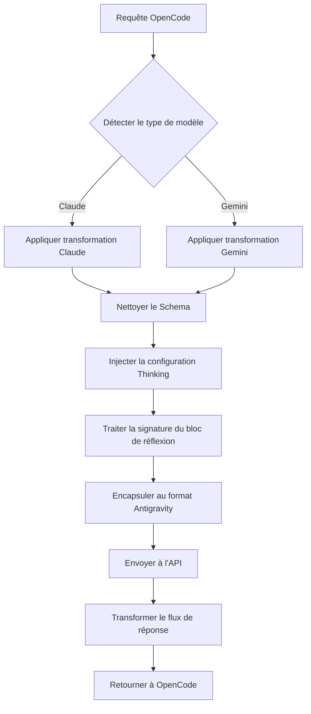

# Mécanisme de Transformation des Requêtes : Compatibilité Multi-Protocoles

## Ce que vous apprendrez

- Comprendre comment le plugin transforme les formats de requêtes entre OpenCode et l'API Antigravity
- Maîtriser les différences de protocole entre les modèles Claude et Gemini ainsi que les règles de transformation
- Diagnostiquer les erreurs 400 causées par des incompatibilités de Schema
- Optimiser la configuration Thinking pour obtenir les meilleures performances

## Votre situation actuelle

Vous rencontrez peut-être ces problèmes :

- ❌ Le serveur MCP retourne l'erreur `400 Unknown name 'parameters'`
- ❌ L'utilisation des modèles Gemini affiche `400 Unknown name 'const'`
- ❌ Les blocs de réflexion des modèles Thinking s'affichent incorrectement
- ❌ Les appels d'outils échouent avec des erreurs de validation de signature
- ❌ Vous ne comprenez pas pourquoi le plugin peut supporter à la fois Claude et Gemini

## Quand utiliser cette technique

Lorsque vous devez :

| Scénario | Pourquoi comprendre le mécanisme de transformation |
| --- | --- |
| Développer un serveur MCP personnalisé | S'assurer que le Schema des outils est compatible avec l'API Antigravity |
| Diagnostiquer les erreurs 400/500 | Déterminer s'il s'agit d'un problème de Schema ou de logique de transformation |
| Optimiser les performances Thinking | Comprendre les signatures de blocs de réflexion et le mécanisme de cache |
| Déboguer les échecs d'appels d'outils | Vérifier l'attribution des ID d'outils et les signatures de paramètres |

::: warning Vérifications préalables
Avant de commencer ce tutoriel, assurez-vous d'avoir :
- ✅ Installé le plugin opencode-antigravity-auth
- ✅ Pris connaissance des modèles disponibles et de leurs variantes
- ✅ Compris les concepts de base des modèles Thinking

[Tutoriel sur la liste des modèles](../../platforms/available-models/) | [Tutoriel sur les modèles Thinking](../../platforms/thinking-models/)
:::

## Concept clé

La transformation des requêtes est le mécanisme central du plugin, qui effectue trois opérations :

1. **Intercepter les requêtes OpenCode** — Intercepter les appels `fetch(generativeLanguage.googleapis.com)`
2. **Appliquer la transformation du modèle** — Transformer le format selon le type de modèle (Claude/Gemini)
3. **Encapsuler et envoyer** — Encapsuler au format Antigravity et appeler l'API
4. **Transformer la réponse** — Convertir la réponse dans un format reconnaissable par OpenCode

**Diagramme du flux de transformation** :



**Points de transformation clés** :

| Type de transformation | Objectif | Emplacement dans le code source |
| --- | --- | --- |
| Nettoyage du Schema | Supprimer les champs non supportés par l'API Antigravity | `src/plugin/request-helpers.ts` |
| Configuration Thinking | Injecter la configuration de réflexion correcte selon la famille de modèles | `src/plugin/transform/claude.ts`, `src/plugin/transform/gemini.ts` |
| Traitement des blocs de réflexion | Extraire les blocs de réflexion historiques et injecter les signatures | `src/plugin/request.ts` |
| Transformation du flux de réponse | Convertir les événements SSE au format OpenCode | `src/plugin/core/streaming.ts` |

## Suivez le guide

### Étape 1 : Comprendre les règles de transformation Claude

**Pourquoi**
Les modèles Claude utilisent un format de protocole différent (snake_case, mode VALIDATED), nécessitant un traitement spécial.

**Règles de transformation clés**

| Format original | Format transformé | Description |
| --- | --- | --- |
| `toolConfig.functionCallingConfig.mode` | `"VALIDATED"` | Forcer l'activation de la validation des appels d'outils |
| `thinkingConfig.includeThoughts` | `include_thoughts` | Format snake_case |
| `thinkingConfig.thinkingBudget` | `thinking_budget` | Format snake_case |
| `maxOutputTokens` | Ajusté automatiquement à 64 000 | Les modèles Thinking nécessitent plus d'espace de sortie |

**Emplacement du code** : [`src/plugin/transform/claude.ts:43-56`](https://github.com/NoeFabris/opencode-antigravity-auth/blob/main/src/plugin/transform/claude.ts#L43-L56)

**Exemple**

```typescript
// Avant transformation (format OpenCode)
{
  "toolConfig": {
    "functionCallingConfig": {
      "mode": "AUTO"
    }
  },
  "thinkingConfig": {
    "includeThoughts": true,
    "thinkingBudget": 32000
  }
}

// Après transformation (format Antigravity)
{
  "toolConfig": {
    "functionCallingConfig": {
      "mode": "VALIDATED"  // Forcé à VALIDATED
    }
  },
  "thinkingConfig": {
    "include_thoughts": true,  // snake_case
    "thinking_budget": 32000   // snake_case
  },
  "generationConfig": {
    "maxOutputTokens": 64000   // Ajusté automatiquement pour les modèles Thinking
  }
}
```

**Ce que vous devriez observer** :
- Toutes les transformations des modèles Claude suivent la convention snake_case
- `maxOutputTokens` est automatiquement ajusté à une valeur suffisamment grande (`CLAUDE_THINKING_MAX_OUTPUT_TOKENS = 64 000`)

### Étape 2 : Comprendre les règles de transformation Gemini

**Pourquoi**
Les modèles Gemini utilisent le format camelCase et ont des exigences strictes pour le JSON Schema (types en majuscules).

**Règles de transformation clés**

| Format original | Format transformé | Description |
| --- | --- | --- |
| JSON Schema `type: "object"` | `type: "OBJECT"` | Le type doit être en majuscules |
| `additionalProperties: false` | Supprimé | Non supporté par l'API Gemini |
| `$ref: "#/$defs/Foo"` | Converti en `description: "See: Foo"` | Référence convertie en description |
| `const: "foo"` | `enum: ["foo"]` | const converti en enum |
| `enum: ["a", "b"]` | Ajout d'une indication `(Allowed: a, b)` | Indication automatique pour les énumérations de 2 à 10 éléments |

**Emplacement du code** : [`src/plugin/transform/gemini.ts:52-124`](https://github.com/NoeFabris/opencode-antigravity-auth/blob/main/src/plugin/transform/gemini.ts#L52-L124)

**Exemple**

```json
// Avant transformation (format OpenCode)
{
  "parameters": {
    "type": "object",
    "properties": {
      "status": {
        "type": "string",
        "const": "active",
        "enum": ["active", "inactive"]
      }
    }
  }
}

// Après transformation (format Gemini)
{
  "parameters": {
    "type": "OBJECT",  // Majuscules
    "properties": {
      "status": {
        "type": "STRING",  // Majuscules
        "enum": ["active", "inactive"],  // const supprimé
        "description": "(Allowed: active, inactive)"  // Indication ajoutée automatiquement
      }
    }
  }
}
```

**Ce que vous devriez observer** :
- Tous les types du Schema Gemini sont convertis en majuscules (`STRING`, `OBJECT`, `ARRAY`)
- Le champ `const` est supprimé et converti en `enum`
- Les champs non supportés (`$ref`, `additionalProperties`) sont supprimés

### Étape 3 : Comprendre le processus de nettoyage du Schema

**Pourquoi**
L'API Antigravity utilise une validation stricte basée sur protobuf et ne supporte pas tous les champs du JSON Schema standard.

**Processus de nettoyage en quatre phases**

1. **Phase 1a : Convertir $ref en description**
   - `$ref: "#/$defs/Foo"` → `{ description: "See: Foo" }`

2. **Phase 1b : Convertir const en enum**
   - `const: "foo"` → `enum: ["foo"]`

3. **Phase 1c : Ajouter des indications d'énumération**
   - `enum: ["a", "b"]` → Ajout de `(Allowed: a, b)` à la description

4. **Phase 1d : Supprimer les champs non supportés**
   - Suppression : `$schema`, `$defs`, `additionalProperties`, `pattern`, `minLength`, `maxLength`, etc.

**Emplacement du code** : [`src/plugin/request-helpers.ts:20-280`](https://github.com/NoeFabris/opencode-antigravity-auth/blob/main/src/plugin/request-helpers.ts#L20-L280)

**Liste des champs non supportés** :

| Champ | Pourquoi non supporté | Alternative |
| --- | --- | --- |
| `$ref` | Références non autorisées | Convertir en indication dans la description |
| `const` | Constantes non autorisées | Utiliser `enum` |
| `additionalProperties` | Propriétés supplémentaires non validées | Mentionner dans la description |
| `$schema`, `$defs` | JSON Draft non utilisé | Supprimer |
| `pattern`, `minLength`, `maxLength` | Contraintes de chaînes gérées côté serveur | Supprimer |
| `minItems`, `maxItems` | Contraintes de tableaux gérées côté serveur | Supprimer |

**Ce que vous devriez observer** :
- Le Schema du serveur MCP est nettoyé pour être compatible avec Antigravity
- Réduction des erreurs 400, messages d'erreur plus clairs

### Étape 4 : Comprendre le mécanisme de traitement des blocs de réflexion

**Pourquoi**
Les modèles Claude et Gemini 3 nécessitent des signatures stables pour les blocs de réflexion, sinon des erreurs de validation de signature se produisent.

**Processus de traitement en trois étapes**

1. **Extraire les blocs de réflexion historiques**
   - Supprimer récursivement tous les blocs `thinking` historiques (éviter les conflits de signature)
   - Utiliser le cache pour valider la validité des signatures

2. **Injecter de nouvelles signatures de réflexion**
   - Générer des signatures stables pour les nouveaux blocs de réflexion
   - Mettre en cache les signatures pour les conversations multi-tours

3. **Assurer l'ordre des blocs de réflexion**
   - Claude : thinking doit précéder tool_use
   - Gemini : thinking peut apparaître à n'importe quelle position

**Emplacement du code** :
- [`src/plugin/request.ts:711-724`](https://github.com/NoeFabris/opencode-antigravity-auth/blob/main/src/plugin/request.ts#L711-L724)

**Exemple de signature de bloc de réflexion** :

```typescript
// Format du bloc Thinking Claude
{
  "type": "thinking",
  "text": "Besoin d'analyser les besoins de l'utilisateur...",
  "signature": "sig-abc123",  // Signature injectée par le plugin
  "cache_control": { "type": "ephemeral" }  // Contrôle du cache
}

// Bloc de réflexion historique (extrait)
{
  "type": "thinking",
  "text": "Ancienne analyse...",  // Supprimé
  "signature": "sig-old456"  // Signature expirée
}
```

**Ce que vous devriez observer** :
- Dans les conversations multi-tours, les blocs de réflexion historiques ne s'affichent pas en double
- Les nouveaux blocs de réflexion ont la signature correcte
- Le processus de réflexion complet précède les appels d'outils

### Étape 5 : Comprendre la transformation du flux de réponse

**Pourquoi**
L'API Antigravity retourne un flux SSE (Server-Sent Events) qui doit être converti dans un format reconnaissable par OpenCode.

**Règles de transformation clés**

| Format original | Format transformé | Description |
| --- | --- | --- |
| `thought: true` | `type: "reasoning"` | Conversion du format de bloc de réflexion |
| `text` | Inchangé | Contenu textuel |
| `tool_use` | Inchangé | Appel d'outil |
| `tool_result` | Inchangé | Résultat d'outil |

**Emplacement du code** : [`src/plugin/core/streaming.ts`](https://github.com/NoeFabris/opencode-antigravity-auth/blob/main/src/plugin/core/streaming.ts)

**Exemple d'événements SSE** :

```
// Retour de l'API Antigravity
data: {"type": "thinking", "text": "Analyse en cours...", "thought": true}

// Après transformation
data: {"type": "reasoning", "text": "Analyse en cours..."}

// Événement texte
data: {"type": "text", "text": "Bonjour"}

// Événement d'appel d'outil
data: {"type": "tool_use", "id": "tool-123", "name": "my_function"}
```

**Ce que vous devriez observer** :
- Les blocs de réflexion s'affichent correctement comme type `reasoning` dans l'interface
- La réponse en streaming est convertie ligne par ligne sans délai
- Les événements d'appel d'outils ont le format correct

## Point de contrôle ✅

Après avoir terminé les étapes ci-dessus, vous devriez pouvoir répondre aux questions suivantes :

- [ ] À quelle valeur sera défini `toolConfig.mode` pour les modèles Claude ?
- [ ] En quoi sera converti `type: "string"` dans le Schema Gemini ?
- [ ] Pourquoi faut-il extraire les blocs de réflexion historiques ?
- [ ] En quel format sera converti le champ `const` ?
- [ ] À quoi sert la signature des blocs de réflexion ?

## Pièges à éviter

### Piège 1 : Le Schema MCP contient $ref causant une erreur 400

**Message d'erreur** : `400 Unknown name 'parameters'`

**Cause** : Le serveur MCP utilise des références `$ref` du JSON Schema, non supportées par l'API Antigravity.

**Solution** :
- Vérifier la définition du Schema du serveur MCP
- Supprimer `$ref` et développer directement la structure de l'objet
- Ou modifier le code du serveur MCP

**Exemple** :

```json
// ❌ Incorrect : utilisation de $ref
{
  "properties": {
    "data": { "$ref": "#/$defs/DataModel" }
  },
  "$defs": {
    "DataModel": { "type": "string" }
  }
}

// ✅ Correct : développement direct
{
  "properties": {
    "data": { "type": "string" }
  }
}
```

### Piège 2 : Le champ const cause une erreur 400 avec les modèles Gemini

**Message d'erreur** : `400 Unknown name 'const'`

**Cause** : Le point de terminaison Gemini de l'API Antigravity ne supporte pas le champ `const`.

**Solution** :
- Convertir manuellement `const` en `enum`
- Ou s'appuyer sur la conversion automatique du plugin (déjà implémentée)

**Exemple** :

```json
// ❌ Incorrect : utilisation de const
{
  "properties": {
    "status": { "type": "string", "const": "active" }
  }
}

// ✅ Correct : utilisation de enum
{
  "properties": {
    "status": { "type": "string", "enum": ["active"] }
  }
}
```

### Piège 3 : Les modèles Thinking affichent des caractères illisibles

**Message d'erreur** : Les blocs de réflexion s'affichent comme `[object Object]` ou avec un format incorrect

**Cause** : Bug dans la logique de transformation de la réponse, ou cache de signature expiré.

**Solution** :
1. Vérifier les journaux de débogage : `opencode --debug`
2. Vider le cache de signatures : supprimer le champ de cache dans `~/.config/opencode/antigravity-accounts.json`
3. Redémarrer OpenCode

### Piège 4 : L'appel d'outil échoue avec une erreur de signature

**Message d'erreur** : `tool_result_missing` ou échec de validation de signature

**Cause** :
- Ordre incorrect des blocs de réflexion (thinking doit précéder tool_use)
- Incohérence du cache de signatures
- Attribution incorrecte des ID d'outils

**Solution** :
- Le plugin réessaie automatiquement (mécanisme de récupération de session)
- Activer le mode débogage pour voir les erreurs détaillées
- Vérifier que la définition de l'outil est correcte

## Résumé de la leçon

Points clés du mécanisme de transformation des requêtes :

1. **La famille de modèles détermine les règles de transformation** — Claude (snake_case, VALIDATED) vs Gemini (camelCase, Schema en majuscules)
2. **Le nettoyage du Schema est obligatoire** — Supprimer les champs non supportés comme `$ref`, `const`, `additionalProperties`
3. **La signature des blocs de réflexion est cruciale** — Des signatures stables assurent la cohérence des conversations multi-tours
4. **Transformation du flux de réponse** — Convertir les événements SSE en temps réel au format OpenCode

**Emplacements clés du code source** :
- Transformation principale des requêtes : [`src/plugin/request.ts:585`](https://github.com/NoeFabris/opencode-antigravity-auth/blob/main/src/plugin/request.ts#L585)
- Transformation Claude : [`src/plugin/transform/claude.ts`](https://github.com/NoeFabris/opencode-antigravity-auth/blob/main/src/plugin/transform/claude.ts)
- Transformation Gemini : [`src/plugin/transform/gemini.ts`](https://github.com/NoeFabris/opencode-antigravity-auth/blob/main/src/plugin/transform/gemini.ts)
- Nettoyage du Schema : [`src/plugin/request-helpers.ts`](https://github.com/NoeFabris/opencode-antigravity-auth/blob/main/src/plugin/request-helpers.ts)
- Transformation en streaming : [`src/plugin/core/streaming.ts`](https://github.com/NoeFabris/opencode-antigravity-auth/blob/main/src/plugin/core/streaming.ts)

## Aperçu de la prochaine leçon

> Dans la prochaine leçon, nous apprendrons le **[Mécanisme de Récupération de Session](../session-recovery/)**.
>
> Vous apprendrez :
> - Le fonctionnement de la récupération de session
> - Comment gérer automatiquement les échecs d'appels d'outils
> - Comment corriger l'ordre incorrect des blocs de réflexion

---

## Annexe : Référence du code source

<details>
<summary><strong>Cliquez pour voir les emplacements du code source</strong></summary>

> Dernière mise à jour : 2026-01-23

| Fonctionnalité | Chemin du fichier | Lignes |
| --- | --- | --- |
| Point d'entrée de transformation des requêtes | [`src/plugin/request.ts`](https://github.com/NoeFabris/opencode-antigravity-auth/blob/main/src/plugin/request.ts#L585) | 585-1443 |
| Point d'entrée de transformation des réponses | [`src/plugin/request.ts`](https://github.com/NoeFabris/opencode-antigravity-auth/blob/main/src/plugin/request.ts#L1445) | 1445-1663 |
| Détection des modèles Claude | [`src/plugin/transform/claude.ts`](https://github.com/NoeFabris/opencode-antigravity-auth/blob/main/src/plugin/transform/claude.ts#L27) | 27-29 |
| Configuration Thinking Claude | [`src/plugin/transform/claude.ts`](https://github.com/NoeFabris/opencode-antigravity-auth/blob/main/src/plugin/transform/claude.ts#L62) | 62-72 |
| Configuration Tool Claude | [`src/plugin/transform/claude.ts`](https://github.com/NoeFabris/opencode-antigravity-auth/blob/main/src/plugin/transform/claude.ts#L43) | 43-57 |
| Détection des modèles Gemini | [`src/plugin/transform/gemini.ts`](https://github.com/NoeFabris/opencode-antigravity-auth/blob/main/src/plugin/transform/gemini.ts#L129) | 129-132 |
| Configuration Thinking Gemini 3 | [`src/plugin/transform/gemini.ts`](https://github.com/NoeFabris/opencode-antigravity-auth/blob/main/src/plugin/transform/gemini.ts) | Rechercher `buildGemini3ThinkingConfig` |
| Transformation Schema Gemini | [`src/plugin/transform/gemini.ts`](https://github.com/NoeFabris/opencode-antigravity-auth/blob/main/src/plugin/transform/gemini.ts#L52) | 52-124 |
| --- | --- | --- |
| --- | --- | --- |
| --- | --- | --- |
| Extraction des blocs de réflexion | [`src/plugin/request-helpers.ts`](https://github.com/NoeFabris/opencode-antigravity-auth/blob/main/src/plugin/request-helpers.ts) | Rechercher `deepFilterThinkingBlocks` |
| Injection de signature de bloc de réflexion | [`src/plugin/request.ts`](https://github.com/NoeFabris/opencode-antigravity-auth/blob/main/src/plugin/request.ts#L715) | 715-720 |
| Transformation du flux de réponse | [`src/plugin/core/streaming.ts`](https://github.com/NoeFabris/opencode-antigravity-auth/blob/main/src/plugin/core/streaming.ts) | Fichier complet |

**Constantes clés** :
- `CLAUDE_THINKING_MAX_OUTPUT_TOKENS = 64_000` ([`src/plugin/transform/claude.ts:18`](https://github.com/NoeFabris/opencode-antigravity-auth/blob/main/src/plugin/transform/claude.ts#L18)) : Limite maximale de tokens de sortie pour les modèles Thinking Claude
- `UNSUPPORTED_SCHEMA_FIELDS` ([`src/plugin/transform/gemini.ts:27`](https://github.com/NoeFabris/opencode-antigravity-auth/blob/main/src/plugin/transform/gemini.ts#L27)) : Ensemble des champs Schema non supportés par l'API Gemini

**Fonctions clés** :
- `prepareAntigravityRequest()` ([`src/plugin/request.ts:585`](https://github.com/NoeFabris/opencode-antigravity-auth/blob/main/src/plugin/request.ts#L585)) : Fonction principale de préparation des requêtes API Antigravity
- `transformAntigravityResponse()` ([`src/plugin/request.ts:1445`](https://github.com/NoeFabris/opencode-antigravity-auth/blob/main/src/plugin/request.ts#L1445)) : Fonction principale de transformation des réponses API Antigravity
- `toGeminiSchema()` ([`src/plugin/transform/gemini.ts:52`](https://github.com/NoeFabris/opencode-antigravity-auth/blob/main/src/plugin/transform/gemini.ts#L52)) : Convertir le JSON Schema au format compatible Gemini
- `cleanJSONSchemaForAntigravity()` ([`src/plugin/request-helpers.ts`](https://github.com/NoeFabris/opencode-antigravity-auth/blob/main/src/plugin/request-helpers.ts)) : Nettoyage du Schema en quatre phases
- `createStreamingTransformer()` ([`src/plugin/core/streaming.ts`](https://github.com/NoeFabris/opencode-antigravity-auth/blob/main/src/plugin/core/streaming.ts)) : Créer un transformateur de flux SSE

</details>
