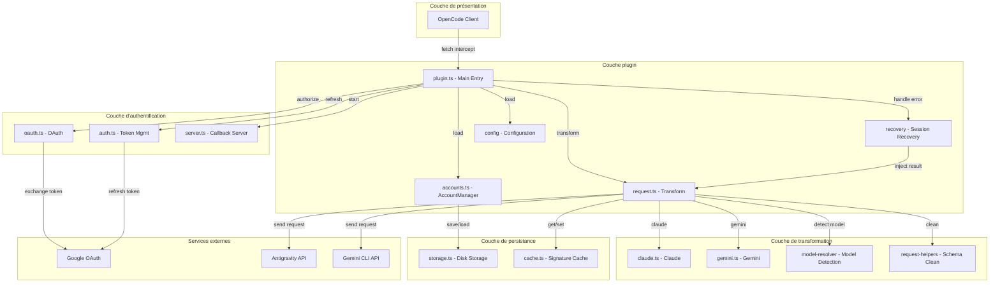
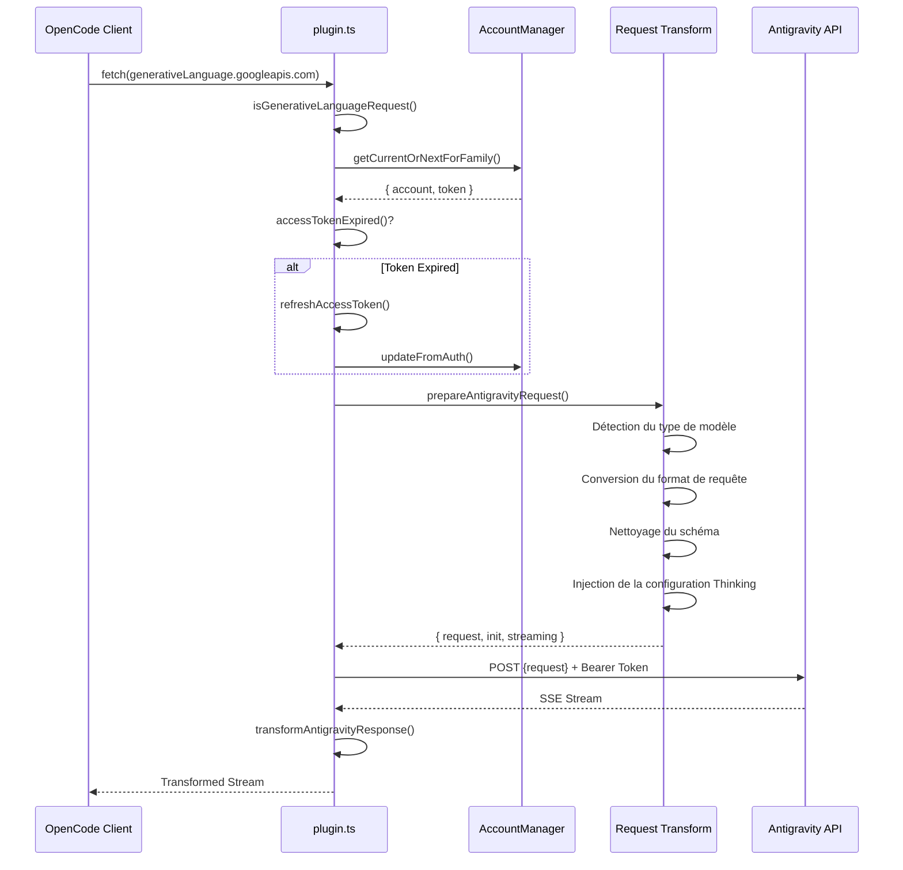
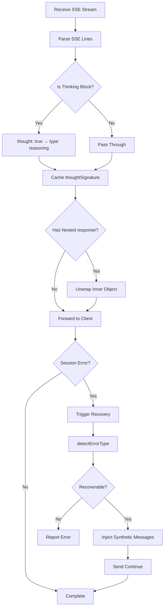

# Aperçu de l'architecture du plugin : Comprendre la conception interne d'OpenCode Antigravity Auth

## Ce que vous serez capable de faire après cette leçon

Ce cours vous permettra de comprendre en profondeur la conception architecturale et les principes de fonctionnement internes du plugin Antigravity Auth. Après avoir terminé l'apprentissage, vous serez capable de :

- Comprendre la structure modulaire du plugin et les responsabilités de chaque module
- Maîtriser le flux de traitement complet des requêtes d'OpenCode vers l'API Antigravity
- Comprendre le mécanisme d'équilibrage de charge de la gestion multi-comptes
- Comprendre le principe de fonctionnement de la récupération de session
- Maîtriser les détails techniques de la conversion de format de requête

## La valeur fondamentale du plugin

Le rôle central du plugin Antigravity Auth est de construire un « pont de traduction » entre OpenCode et l'API Antigravity :

1. **Conversion de protocole** - Convertit le format de requête d'OpenCode au format requis par l'API Antigravity
2. **Gestion de l'authentification** - Obtient et rafraîchit en toute sécurité les jetons d'accès via Google OAuth 2.0 PKCE
3. **Équilibrage de charge** - Mise en pool de plusieurs comptes, rotation automatique pour éviter les limites de taux
4. **Récupération d'erreur** - Détecte et répare automatiquement les problèmes d'interruption de session

::: info Pourquoi comprendre l'architecture ?
Comprendre l'architecture du plugin vous aide à :
- Localiser rapidement le module où se trouve le problème
- Comprendre la portée d'action des éléments de configuration
- Optimiser la stratégie d'utilisation multi-comptes
- Participer au développement et au débogage du plugin
:::

## Vue d'ensemble de la structure modulaire

Le plugin adopte une architecture en couches, avec des responsabilités claires pour chaque module :



### Responsabilités de chaque module

| Module | Fichier | Responsabilité |
| --- | --- | --- |
| **Point d'entrée principal** | `plugin.ts` | Intercepteur fetch, initialisation du plugin, gestion des événements |
| **Gestion des comptes** | `accounts.ts` | Pool de comptes multiples, stratégie d'équilibrage de charge, suivi des limites de taux |
| **Transformation de requête** | `request.ts` | Conversion de format de requête, traitement de flux de réponse |
| **Transformation de modèle** | `transform/` | Logique de transformation spécifique à Claude/Gemini |
| **Authentification OAuth** | `antigravity/oauth.ts` | Flux d'authentification PKCE, échange de jetons |
| **Récupération de session** | `recovery/` | Détection d'erreur, réparation automatique de session interrompue |
| **Gestion de configuration** | `config/` | Chargement de configuration, validation de schéma |
| **Couche de stockage** | `storage.ts` | Persistance des comptes (fichier JSON) |
| **Couche de cache** | `cache.ts` | Cache de signature, réduction des calculs répétés |
| **Journaux de débogage** | `debug.ts` | Journaux structurés, dépannage |

## Flux de traitement des requêtes

Lorsqu'une requête de modèle est émise depuis OpenCode, le plugin passe par une chaîne de traitement complète :



### Explication détaillée des étapes

**Étape 1 : Interception de requête**
- Le plugin capture toutes les requêtes vers `generativelanguage.googleapis.com` via l'intercepteur `fetch`
- Utilise `isGenerativeLanguageRequest()` pour déterminer s'il s'agit d'une requête liée à Antigravity
- Les requêtes non ciblées sont transmises directement, évitant d'affecter d'autres fonctionnalités

**Étape 2 : Sélection de compte**
- Sélectionne un compte disponible dans le pool de comptes (selon la stratégie configurée : sticky/round-robin/hybrid)
- Vérifie si le jeton est expiré, le rafraîchit automatiquement si nécessaire
- Applique le décalage PID (si activé), garantissant une distribution uniforme des comptes dans les scénarios multi-agents

**Étape 3 : Transformation de requête** (`request.ts`)
- **Détection de modèle** : Identifie s'il s'agit d'un modèle Claude ou Gemini
- **Traitement Thinking** :
  - Claude : Supprime tous les blocs de réflexion historiques, évitant les conflits de signature
  - Gemini : Ajoute la configuration `thinkingConfig`
- **Conversion Tool** : Convertit les outils OpenCode au format `functionDeclarations`
- **Nettoyage de schéma** : Supprime les champs JSON Schema non pris en charge (`const`, `$ref`, `$defs`, etc.)
- **Encapsulation de requête** : Encapsule au format `{ project, model, request: {...} }`

**Étape 4 : Envoi de requête**
- Ajoute les en-têtes spécifiques à Antigravity (User-Agent, Client-Metadata)
- Utilise l'authentification Bearer Token
- Prend en charge le fallback d'endpoint (daily → autopush → prod)

**Étape 5 : Transformation de réponse**
- Réception de flux SSE, conversion ligne par ligne
- Convertit `thought: true` en `type: "reasoning"`
- Met en cache la signature thinking pour les requêtes ultérieures
- Développe l'objet `response` interne, maintenant la cohérence du format

## Flux de traitement des réponses

Le traitement des réponses implique principalement la conversion de flux et la récupération de session :



### Mécanismes de traitement clés

**1. Conversion de bloc de réflexion**

Le format de bloc de réflexion retourné par l'API Antigravity est :
```json
{ "thought": true, "text": "Contenu de réflexion" }
```

Le plugin le convertit au format compatible OpenCode :
```json
{ "type": "reasoning", "reasoning": "Contenu de réflexion" }
```

**2. Cache de signature**

Les modèles Claude et Gemini 3 nécessitent une correspondance de signature de bloc de réflexion dans les conversations multi-tours :
- Extrait `thoughtSignature` de la réponse
- Utilise `cacheSignature()` pour stocker en mémoire et sur disque
- Lors de la prochaine requête, récupère et injecte via `getCachedSignature()`

::: tip Pourquoi le cache de signature est-il nécessaire ?
Les API Claude et Gemini 3 exigent que les blocs de réflexion avant les appels d'outils aient la signature correcte. Le cache de signature permet de :
- Éviter les échecs de requête dus à des erreurs de signature
- Réduire la génération répétée du même contenu de réflexion
- Améliorer la continuité des conversations multi-tours
:::

**3. Récupération de session**

Lorsqu'une erreur de session est détectée :
1. Capture l'erreur via l'événement `session.error`
2. Appelle `detectErrorType()` pour déterminer si elle est récupérable
3. Pour l'erreur `tool_result_missing` :
   - Extrait les IDs `tool_use` échoués
   - Injecte des messages `tool_result` synthétiques
   - Envoie automatiquement "continue" (si activé)
4. Pour les erreurs d'ordre de bloc de réflexion :
   - Analyse l'état de la conversation
   - Ferme le tour endommagé
   - Démarre un nouveau tour pour que le modèle régénère

## Explication détaillée des mécanismes fondamentaux

### Mécanisme d'authentification OAuth

Le plugin utilise le flux OAuth 2.0 with PKCE (Proof Key for Code Exchange) :

```mermaid
flowchart LR
    A[Utilisateur exécute opencode auth login] --> B[Génération de paire de clés PKCE]
    B --> C[Construction de l'URL d'autorisation]
    C --> D[Démarrage du serveur local]
    D --> E[Ouverture de la page d'autorisation du navigateur]
    E --> F[Autorisation utilisateur]
    F --> G[Réception du code de callback]
    G --> H[Échange du jeton d'accès]
    H --> I[Obtention du Project ID]
    I --> J[Stockage dans antigravity-accounts.json]
```



**Sécurité PKCE** :
- Génère un `code_verifier` et un `code_challenge` aléatoires
- L'URL d'autorisation contient `code_challenge`, empêchant les attaques de l'homme du milieu
- Lors de l'échange de jeton, vérifie `code_verifier`, garantissant que la requête provient du même client

**Gestion des jetons** :
- Access Token : Expire par défaut après 1 heure, rafraîchissement automatique 30 minutes avant l'expiration
- Refresh Token : Valide à long terme, utilisé pour obtenir de nouveaux Access Tokens
- Persisté dans `~/.config/opencode/antigravity-accounts.json`

### Mécanisme de gestion multi-comptes

La gestion multi-comptes est l'une des fonctionnalités principales du plugin, comprenant plusieurs composants clés :

**1. Structure du pool de comptes**

```typescript
interface AccountPool {
  version: 3;
  accounts: Account[];
  activeIndex: number;
  activeIndexByFamily: {
    claude: number;
    gemini: number;
  };
}
```

**2. Stratégies de sélection de compte**

| Stratégie | Description | Scénario applicable |
| --- | --- | --- |
| **sticky** | Maintient le compte actuel jusqu'à la limite de taux | Utilisation en session unique, préserve le cache de prompts |
| **round-robin** | Alterne vers le compte suivant à chaque requête | Sessions parallèles multiples, maximise le débit |
| **hybrid** | Décision combinée basée sur le score de santé + Token bucket + LRU | Stratégie par défaut, équilibre performance et fiabilité |

**3. Suivi des limites de taux**

Chaque compte suit indépendamment par famille de modèles :
- `claude` : Quota des modèles Claude
- `gemini-antigravity` : Quota Gemini Antigravity
- `gemini-cli` : Quota Gemini CLI

L'état de limite de taux comprend :
- `rateLimitResetTimes` : Temps de réinitialisation de chaque quota
- `cooldownEndAt` : Temps de fin de refroidissement du compte
- `consecutiveFailures` : Nombre d'échecs consécutifs

**4. Pool de quotas dual (spécifique à Gemini)**

Les modèles Gemini prennent en charge deux pools de quotas indépendants :
- **Quota Antigravity** : Environnement sandbox quotidien
- **Quota Gemini CLI** : Environnement de production

Via la configuration `quota_fallback` :
- Utilise en priorité le quota préféré (déterminé par le suffixe du modèle)
- Lorsque le quota préféré est épuisé, tente le quota de secours
- Lorsque les deux pools sont épuisés, passe au compte suivant

**5. Optimisation du décalage PID**

Après activation de `pid_offset_enabled` :
- Différents processus (PID) d'agents commencent à partir de comptes différents
- Évite que tous les agents ne se disputent le même compte
- Applicable aux scénarios multi-agents parallèles

### Mécanisme de transformation de requête

La transformation de requête est la partie la plus complexe du plugin, nécessitant de gérer les différences de protocole entre différents modèles :

**Points clés de transformation des modèles Claude** :

1. **Traitement des blocs de réflexion**
   ```typescript
   // Supprime tous les blocs de réflexion historiques (évite les conflits de signature)
   const filteredContents = deepFilterThinkingBlocks(contents);

   // Construit le nouveau thinkingConfig
   const thinkingConfig = {
     budgetTokens: variantThinkingConfig?.budget || DEFAULT_THINKING_BUDGET,
   };
   ```

2. **Nettoyage du schéma Tool**
   - Liste blanche conservée : `type`, `properties`, `required`, `description`, `enum`, `items`
   - Champs supprimés : `const`, `$ref`, `$defs`, `default`, `examples`, `additionalProperties`, `$schema`, `title`
   - Conversion spéciale : `const: "value"` → `enum: ["value"]`

3. **Injection de signature de paramètres d'outil**
   ```typescript
   injectParameterSignatures(tool, signature) {
     tool.description += `\n\nParameters: ${signature}`;
   }
   ```

**Points clés de transformation des modèles Gemini** :

1. **Configuration Thinking**
   ```typescript
   // Gemini 3 Pro/Flash
   if (isGemini3Model(model)) {
     request.thinkingConfig = {
       thinkingLevel: "high" | "medium" | "low" | "minimal",
     };
   }

   // Gemini 2.5
   else if (isGemini2Model(model)) {
     request.thinkingConfig = {
       thinkingLevel: "high" | "medium" | "low",
     };
   }
   ```

2. **Google Search Grounding**
   ```typescript
   if (webSearchConfig) {
     request.generationConfig = {
       ...request.generationConfig,
       dynamicRetrievalConfig: {
         mode: webSearchConfig.mode, // "auto" | "off"
         dynamicRetrievalConfig: {
           scoreThreshold: webSearchConfig.threshold, // 0.0 - 1.0
         },
       },
     };
   }
   ```

3. **Configuration de génération d'images**
   ```typescript
   if (isImageGenerationModel(model)) {
     request.generationConfig = {
       ...request.generationConfig,
       responseModalities: ["IMAGE", "TEXT"],
     };
   }
   ```

### Mécanisme de récupération de session

Le mécanisme de récupération de session garantit que la conversation peut continuer après une interruption inattendue :

**1. Détection d'erreur**

```typescript
function detectErrorType(error: unknown): RecoverableError | null {
  if (errorString.includes("tool_use ids were found without tool_result")) {
    return { type: "tool_result_missing" };
  }
  if (errorString.includes("Expected thinking but found text")) {
    return { type: "thinking_order_error" };
  }
  return null;
}
```

**2. Détection de limite de tour**

```typescript
// Limite de tour = Premier message assistant après le message utilisateur
function analyzeConversationState(messages: Message[]): ConversationState {
  const lastUserMessage = findLastMessageByRole(messages, "user");
  const firstAssistantAfterUser = messages.find(m =>
    m.role === "assistant" && m.timestamp > lastUserMessage.timestamp
  );

  return {
    isTurnStart: true,
    turnAssistantMessage: firstAssistantAfterUser,
  };
}
```

**3. Injection de messages synthétiques**

```typescript
// Injecte un tool_result synthétique
function createSyntheticErrorResponse(toolUseIds: string[]): Message[] {
  return toolUseIds.map(id => ({
    type: "tool_result",
    tool_use_id: id,
    content: "Operation cancelled",
    isSynthetic: true,
  }));
}

// Ferme le tour endommagé
function closeToolLoopForThinking(sessionId: string): Message[] {
  return [
    {
      type: "text",
      text: "[Conversation turn closed due to error]",
      isSynthetic: true,
    },
  ];
}
```

**4. Auto-Resume**

Après activation de `auto_resume`, le processus de récupération envoie automatiquement l'instruction de continuation :
```typescript
await client.session.prompt({
  path: { id: sessionID },
  body: { parts: [{ type: "text", text: config.resume_text }] },
  query: { directory },
});
```

## Résumé de la leçon

Ce cours a analysé en profondeur la conception architecturale du plugin Antigravity Auth :

**Architecture fondamentale** :
- Conception modulaire en couches, responsabilités claires
- Couche plugin, couche d'authentification, couche de transformation, couche de persistance, chacune avec ses propres responsabilités
- Coordination de tous les modules via `plugin.ts` comme point d'entrée unifié

**Flux de requête** :
- Interception → Sélection de compte → Rafraîchissement de jeton → Transformation de requête → Envoi de requête → Transformation de réponse
- Chaque étape dispose d'une gestion d'erreur détaillée et d'un mécanisme de nouvelle tentative

**Mécanismes clés** :
- **OAuth 2.0 PKCE** : Flux d'authentification sécurisé
- **Gestion multi-comptes** : Équilibrage de charge, suivi des limites de taux, pool de quotas dual
- **Transformation de requête** : Compatibilité de protocole, nettoyage de schéma, traitement Thinking
- **Récupération de session** : Détection automatique d'erreur, injection de messages synthétiques, Auto-Resume

Comprendre ces mécanismes vous aidera à mieux utiliser et optimiser la configuration du plugin, ainsi qu'à participer au développement et au débogage du plugin.

## Aperçu de la prochaine leçon

> Dans la prochaine leçon, nous apprendrons **[Spécifications internes de l'API Antigravity](../api-spec/)**.
>
> Vous apprendrez :
> - Les formats de requête et de réponse de l'API Antigravity
> - Les fonctionnalités et paramètres de chaque endpoint
> - La signification des codes d'erreur et des codes d'état
> - Les fonctionnalités avancées et les caractéristiques expérimentales

---

## Annexe : Références du code source

<details>
<summary><strong>Cliquez pour voir les emplacements du code source</strong></summary>

> Dernière mise à jour : 2026-01-23

| Fonctionnalité | Chemin du fichier | Lignes |
| --- | --- | --- |
| Point d'entrée principal du plugin, intercepteur fetch | [`src/plugin.ts`](https://github.com/NoeFabris/opencode-antigravity-auth/blob/main/src/plugin.ts) | 654-1334 |
| Gestionnaire de comptes, équilibrage de charge | [`src/plugin/accounts.ts`](https://github.com/NoeFabris/opencode-antigravity-auth/blob/main/src/plugin/accounts.ts) | 1-715 |
| Transformation de requête, flux de réponse | [`src/plugin/request.ts`](https://github.com/NoeFabris/opencode-antigravity-auth/blob/main/src/plugin/request.ts) | 1-1664 |
| Transformation de modèle Claude | [`src/plugin/transform/claude.ts`](https://github.com/NoeFabris/opencode-antigravity-auth/blob/main/src/plugin/transform/claude.ts) | Ensemble |
| Transformation de modèle Gemini | [`src/plugin/transform/gemini.ts`](https://github.com/NoeFabris/opencode-antigravity-auth/blob/main/src/plugin/transform/gemini.ts) | Ensemble |
| Récupération de session | [`src/plugin/recovery/index.ts`](https://github.com/NoeFabris/opencode-antigravity-auth/blob/main/src/plugin/recovery/index.ts) | Ensemble |
| Récupération de bloc de réflexion | [`src/plugin/recovery/thinking-recovery.ts`](https://github.com/NoeFabris/opencode-antigravity-auth/blob/main/src/plugin/recovery/thinking-recovery.ts) | Ensemble |
| Authentification OAuth | [`src/antigravity/oauth.ts`](https://github.com/NoeFabris/opencode-antigravity-auth/blob/main/src/antigravity/oauth.ts) | 1-271 |
| Gestion des jetons | [`src/plugin/token.ts`](https://github.com/NoeFabris/opencode-antigravity-auth/blob/main/src/plugin/token.ts) | Ensemble |
| Schéma de configuration | [`src/plugin/config/schema.ts`](https://github.com/NoeFabris/opencode-antigravity-auth/blob/main/src/plugin/config/schema.ts) | 1-373 |
| Stockage des comptes | [`src/plugin/storage.ts`](https://github.com/NoeFabris/opencode-antigravity-auth/blob/main/src/plugin/storage.ts) | Ensemble |
| Cache de signature | [`src/plugin/cache.ts`](https://github.com/NoeFabris/opencode-antigravity-auth/blob/main/src/plugin/cache.ts) | Ensemble |
| Journaux de débogage | [`src/plugin/debug.ts`](https://github.com/NoeFabris/opencode-antigravity-auth/blob/main/src/plugin/debug.ts) | Ensemble |

**Constantes clés** :
- `MAX_OAUTH_ACCOUNTS = 10` : Nombre maximum de comptes
- `RATE_LIMIT_DEDUP_WINDOW_MS = 2000` : Fenêtre de déduplication de limite de taux (2 secondes)
- `RATE_LIMIT_STATE_RESET_MS = 120000` : Temps de réinitialisation de l'état de limite de taux (2 minutes)
- `FAILURE_COOLDOWN_MS = 30000` : Temps de refroidissement du compte (30 secondes)

**Fonctions clés** :
- `createAntigravityPlugin()` : Fonction de point d'entrée principal du plugin
- `prepareAntigravityRequest()` : Fonction principale de transformation de requête
- `transformAntigravityResponse()` : Fonction de transformation de flux de réponse
- `AccountManager.getCurrentOrNextForFamily()` : Fonction de sélection de compte
- `handleSessionRecovery()` : Fonction de gestion de récupération de session
- `refreshAccessToken()` : Fonction de rafraîchissement de jeton

</details>
