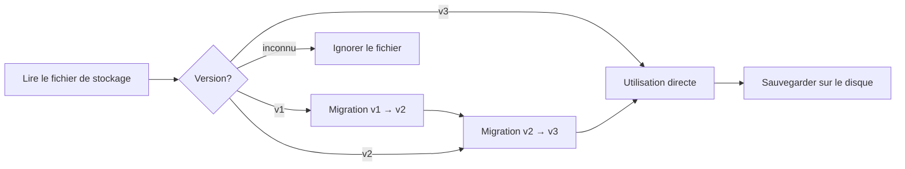

# Format de Stockage des Comptes et Gestion des Versions

## Ce que Vous Pourrez Faire Après Ce Chapitre

- Comprendre la structure du fichier de stockage des comptes et la signification de chaque champ
- Modifier manuellement le fichier de stockage (uniquement en cas de nécessité)
- Comprendre le mécanisme de migration de version et la compatibilité
- Migrer la configuration des comptes d'une machine à l'autre

## Votre Situation Actuelle

Vous pourriez rencontrer les situations suivantes :

- Vous souhaitez sauvegarder ou migrer un compte vers une autre machine
- Modifier manuellement le `projectId` ou supprimer un compte invalide
- Voir des avertissements de version ou des journaux de migration, et vouloir comprendre ce qui s'est passé
- Synchroniser l'état des comptes entre plusieurs machines

## Emplacement du Fichier

Le fichier de stockage des comptes se trouve à :

| Système d'exploitation | Chemin                                                       |
|--- | ---|
| macOS/Linux | `~/.config/opencode/antigravity-accounts.json`             |
| Windows    | `%APPDATA%\opencode\antigravity-accounts.json`                |

::: warning Avertissement de Sécurité
Ce fichier contient des **tokens de rafraîchissement OAuth**, qui équivalent à un fichier de mots de passe. Ne le partagez pas avec d'autres personnes et ne le soumettez pas à un dépôt Git.
:::

## Versions du Format de Stockage

Le format de stockage est versionné, la version actuelle est **v3**. Le plugin gère automatiquement la migration de version, sans intervention manuelle requise.

### Format v3 (Version Actuelle)

```json
{
  "version": 3,
  "accounts": [
    {
      "email": "user1@gmail.com",
      "refreshToken": "1//0abc...",
      "projectId": "my-gcp-project",
      "managedProjectId": "managed-project-123",
      "addedAt": 1737600000000,
      "lastUsed": 1737603600000,
      "lastSwitchReason": "initial",
      "rateLimitResetTimes": {
        "claude": 1737607200000,
        "gemini-antigravity": 1737607200000,
        "gemini-cli": 1737607200000
      },
      "coolingDownUntil": 1737600000000,
      "cooldownReason": "auth-failure"
    }
  ],
  "activeIndex": 0,
  "activeIndexByFamily": {
    "claude": 0,
    "gemini": 0
  }
}
```

**Description des champs** :

| Champ                  | Type    | Requis | Description |
|--- | --- | --- | ---|
| `version`             | number  | O    | Version du format de stockage (fixé à 3) |
| `accounts`            | array   | O    | Liste des comptes |
| `activeIndex`         | number  | O    | Index du compte actif (commence à 0) |
| `activeIndexByFamily` | object  | N    | Suivi des comptes actifs par famille de modèles (`claude`/`gemini`) |

**Champs de l'objet compte** :

| Champ                  | Type    | Requis | Description |
|--- | --- | --- | ---|
| `email`               | string  | N    | Adresse e-mail du compte Google |
| `refreshToken`        | string  | O    | Token de rafraîchissement OAuth (identifiant unique) |
| `projectId`           | string  | N    | ID du projet GCP (nécessaire pour les modèles Gemini CLI) |
| `managedProjectId`     | string  | N    | ID du projet géré |
| `addedAt`             | number  | O    | Horodatage d'ajout (millisecondes Unix) |
| `lastUsed`            | number  | O    | Horodatage de dernière utilisation |
| `lastSwitchReason`    | string  | N    | Raison du changement : `"rate-limit"` / `"initial"` / `"rotation"` |
| `rateLimitResetTimes` | object  | N    | Temps de réinitialisation de la limite de débit (suivi par pool de quotas) |
| `coolingDownUntil`    | number  | N    | Horodatage de fin de refroidissement du compte |
| `cooldownReason`      | string  | N    | Raison du refroidissement : `"auth-failure"` / `"network-error"` / `"project-error"` |

### Format v2 (Version Historique)

Le format v2 est similaire à v3, mais présente les différences suivantes :

- `rateLimitResetTimes` ne contient que les champs `claude` et `gemini`
- Pas de `coolingDownUntil` ni de `cooldownReason`
- Pas de `activeIndexByFamily` (tous les modèles partagent un compte actif)

Lors de la migration, le champ `gemini` est mappé vers `gemini-antigravity`, et le pool de quotas `gemini-cli` est initialisé comme vide.

### Format v1 (Version Historique)

Le format v1 utilise des indicateurs booléens et un horodatage unique :

```json
{
  "version": 1,
  "accounts": [
    {
      "email": "user1@gmail.com",
      "refreshToken": "1//0abc...",
      "isRateLimited": true,
      "rateLimitResetTime": 1737607200000
    }
  ],
  "activeIndex": 0
}
```

Lors de la migration, si `isRateLimited` est `true` et que `rateLimitResetTime` n'est pas expiré, les temps de réinitialisation de `claude` et `gemini` sont définis simultanément.

## Mécanisme de Migration de Version

Lors du chargement du fichier de stockage, le plugin détecte automatiquement la version et exécute la migration :



**Règles de migration** :

1. **Migration automatique** : Après la migration, le nouveau format est automatiquement sauvegardé sur le disque
2. **Préservation des données** : Les états de limite de débit non expirés sont préservés
3. **Dégradation en cas d'échec** : Si la sauvegarde échoue, les données migrées continuent d'être utilisées en mémoire
4. **Compatibilité avant** : Les nouvelles versions du plugin peuvent lire les fichiers au format ancien

## Détails du Mécanisme de Stockage

### Verrouillage de Fichier

Utilisation de `proper-lockfile` pour garantir un accès sécurisé multiprocessus :

- **Mécanisme de verrouillage** : Création d'un fichier de verrou lors de l'écriture (`.antigravity-accounts.json.lock`)
- **Délai d'expiration** : Le fichier de verrou expire après 10 secondes (pour éviter les blocages)
- **Stratégie de nouvelle tentative** : Maximum 5 tentatives, délai de rétractation 100ms → 1000ms
- **Écriture atomique** : Écriture d'abord dans un fichier temporaire (`.tmp`), puis renommage vers le fichier cible

### Fusion des Comptes

Lorsque plusieurs processus écrivent simultanément dans le fichier de stockage, une stratégie de fusion est exécutée :

```typescript
// Logique de fusion
function mergeAccountStorage(existing, incoming) {
  // Fusion des comptes par clé refreshToken
  // Préservation des projectId/managedProjectId configurés manuellement
  // Fusion des rateLimitResetTimes
  // Préservation du lastUsed le plus grand
}
```

### Mécanisme de Déduplication

Déduplication basée sur `email`, en conservant le compte le plus récent pour chaque adresse e-mail (par `lastUsed`, ensuite par `addedAt`) :

```typescript
// Règles de déduplication
1. Comptes sans email → Conservation (impossible à dédupliquer)
2. Comptes avec le même email → Conservation du lastUsed le plus grand
3. lastUsed identique → Conservation du addedAt le plus grand
```

## Guide de Modification Manuelle

::: danger Risques de Modification Manuelle
Lors de l'édition du fichier de stockage, le processus du plugin ne doit pas être en cours d'exécution, sinon il risque d'être écrasé. Il est recommandé d'arrêter OpenCode avant de modifier le fichier.
:::

### Ajouter un Compte

Lors de l'ajout manuel d'un compte, au moins `refreshToken` doit être fourni :

```json
{
  "accounts": [
    {
      "refreshToken": "Copier depuis une autre machine ou obtenir via le flux OAuth",
      "email": "user@example.com",
      "addedAt": Date.now(),
      "lastUsed": Date.now()
    }
  ]
}
```

### Supprimer un Compte

Supprimer l'entrée correspondante du tableau `accounts`, puis ajuster `activeIndex` :

```json
{
  "accounts": [
    { "email": "user1@gmail.com", "refreshToken": "..." },  // Garder
    // { "email": "user2@gmail.com", "refreshToken": "..." },  // Supprimer
    { "email": "user3@gmail.com", "refreshToken": "..." }   // Garder
  ],
  "activeIndex": 0  // S'assurer que l'index est dans une plage valide
}
```

### Modifier le projectId

Ajouter ou modifier `projectId` pour un compte :

```json
{
  "accounts": [
    {
      "email": "user@gmail.com",
      "refreshToken": "1//0abc...",
      "projectId": "your-gcp-project-id"  // Ajouter ou modifier
    }
  ]
}
```

### Effacer l'État de Limite de Débit

Effacer manuellement les indicateurs de limite de débit :

```json
{
  "accounts": [
    {
      "email": "user@gmail.com",
      "refreshToken": "1//0abc...",
      "rateLimitResetTimes": {}  // Effacer ou supprimer ce champ
    }
  ]
}
```

## Migration Inter-Machines

### Migration Simple

Copier directement le fichier de stockage vers le répertoire de configuration de la machine cible :

```bash
# macOS/Linux
cp ~/.config/opencode/antigravity-accounts.json /path/to/backup/

# Windows
copy %APPDATA%\opencode\antigravity-accounts.json backup\
```

### Fusion des Comptes

Si la machine cible a déjà des comptes, le plugin les fusionnera automatiquement (déduplication basée sur `refreshToken`).

**Étapes de fusion manuelle** :

1. Sauvegarder les fichiers de stockage des deux machines
2. Ouvrir les deux fichiers, copier le tableau de comptes cible vers le fichier source
3. Ajuster `activeIndex` et `activeIndexByFamily`
4. Sauvegarder et redémarrer le plugin

## Questions Fréquentes

### Que faire en cas d'échec de migration ?

Si la migration échoue, le plugin enregistrera un avertissement dans les journaux :

```
Failed to persist migrated storage: { error: "..." }
```

**Solutions** :

1. Vérifier les permissions de fichier
2. S'assurer que l'espace disque est suffisant
3. Sauvegarder manuellement l'ancien fichier, le supprimer, et ajouter à nouveau les comptes

### Erreur de Incompatibilité de Version

Si vous voyez l'erreur « Unknown storage version » :

```json
{
  "version": 99  // Version inconnue
}
```

**Solutions** :

1. Sauvegarder le fichier actuel
2. Modifier manuellement `version` en `2` ou `3`
3. Redémarrer le plugin pour déclencher la migration
4. Si la migration échoue, supprimer le fichier et ajouter à nouveau les comptes

### Perte de Déduplication de Compte

Si des comptes en double sont supprimés :

**Cause** : Le plugin effectue la déduplication basée sur `email`, en conservant le compte le plus récemment utilisé.

**Solution** : Si vous devez conserver deux comptes avec la même adresse e-mail (scénario rare), modifiez manuellement le fichier en vous assurant que le champ `email` est vide ou différent.

## Résumé du Chapitre

- Emplacement du fichier de stockage : `~/.config/opencode/antigravity-accounts.json`
- Version actuelle : v3, prend en charge les doubles pools de quotas et le mécanisme de refroidissement
- Migration automatique : v1/v2 seront automatiquement mis à niveau vers v3
- Verrouillage de fichier : Utilisation de `proper-lockfile` pour garantir la sécurité des accès simultanés
- Modification manuelle : Il est recommandé d'arrêter le plugin avant de modifier, pour éviter l'écrasement

## Aperçu du Prochain Chapitre

> Dans le prochain chapitre, nous apprendrons **[Toutes les Options de Configuration](../all-config-options/)**.
>
> Vous apprendrez :
> - La liste complète des options de configuration
> - Les valeurs par défaut et la portée de chaque option
> - Des techniques de configuration avancées

---

## Annexe : Référence du Code Source

<details>
<summary><strong>Cliquez pour voir l'emplacement du code source</strong></summary>

> Dernière mise à jour : 2026-01-23

| Fonction           | Chemin du fichier                                                                                                      | Ligne    |
|--- | --- | ---|
| Définition du format de stockage   | [`src/plugin/storage.ts`](https://github.com/NoeFabris/opencode-antigravity-auth/blob/main/src/plugin/storage.ts)      | 128-198 |
| Migration v1 → v2  | [`src/plugin/storage.ts`](https://github.com/NoeFabris/opencode-antigravity-auth/blob/main/src/plugin/storage.ts)      | 366-395 |
| Migration v2 → v3  | [`src/plugin/storage.ts`](https://github.com/NoeFabris/opencode-antigravity-auth/blob/main/src/plugin/storage.ts)      | 397-431 |
| Chargement des comptes       | [`src/plugin/storage.ts`](https://github.com/NoeFabris/opencode-antigravity-auth/blob/main/src/plugin/storage.ts)      | 433-518 |
| Sauvegarde des comptes       | [`src/plugin/storage.ts`](https://github.com/NoeFabris/opencode-antigravity-auth/blob/main/src/plugin/storage.ts)      | 520-536 |
| Mécanisme de verrouillage de fichier   | [`src/plugin/storage.ts`](https://github.com/NoeFabris/opencode-antigravity-auth/blob/main/src/plugin/storage.ts)      | 219-257 |
| Fusion des comptes       | [`src/plugin/storage.ts`](https://github.com/NoeFabris/opencode-antigravity-auth/blob/main/src/plugin/storage.ts)      | 259-299 |
| Mécanisme de déduplication       | [`src/plugin/storage.ts`](https://github.com/NoeFabris/opencode-antigravity-auth/blob/main/src/plugin/storage.ts)      | 301-364 |

**Définitions de types clés** :

- `AccountStorageV1` : Format de stockage v1
- `AccountStorageV2` : Format de stockage v2
- `AccountStorageV3` : Format de stockage v3 (actuel)
- `RateLimitStateV3` : État de limite de débit v3 (supporte plusieurs pools de quotas)

**Fonctions clés** :

- `loadAccounts()` : Charger les comptes et exécuter la migration
- `saveAccounts()` : Sauvegarder les comptes (avec verrouillage de fichier et fusion)
- `migrateV1ToV2()` : Migration v1 → v2
- `migrateV2ToV3()` : Migration v2 → v3
- `mergeAccountStorage()` : Fusionner deux objets de stockage
- `deduplicateAccountsByEmail()` : Déduplication basée sur email

</details>
