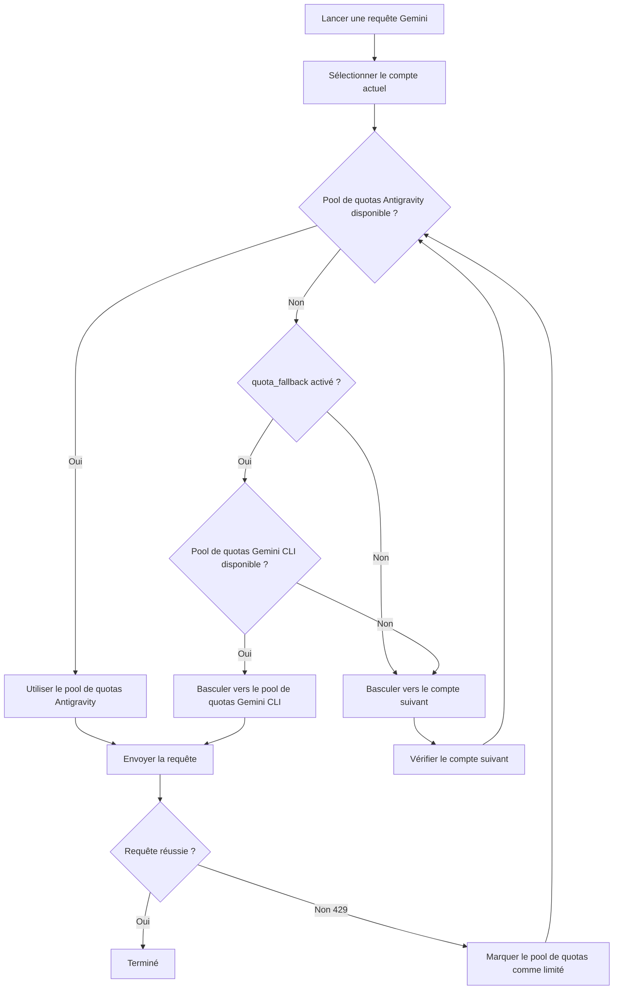

# Système à double quota : Comprendre les pools de quotas Antigravity et Gemini CLI

## Ce que vous pourrez faire après ce tutoriel

- Comprendre comment chaque compte possède deux pools de quotas Gemini indépendants
- Activer le fallback automatique entre les pools de quotas Antigravity et Gemini CLI
- Spécifier explicitement quel pool de quotas utiliser pour un modèle
- Maximiser votre utilisation des quotas grâce au système à double quota

---

## Votre situation actuelle

Vous utilisez le plugin Antigravity Auth pour appeler des modèles Gemini et rencontrez souvent des limites de quota, mais vous ne comprenez peut-être pas le **système à double quota** :

- Après qu'une requête soit limitée, vous devez attendre que le quota se réinitialise pour continuer
- Bien que vous ayez configuré plusieurs comptes, les quotas Gemini de chaque compte ne suffisent toujours pas
- Vous ne comprenez pas pourquoi certains modèles peuvent être requêtés tandis que d'autres renvoient fréquemment des erreurs 429

**Problème principal** : Vous pensez que chaque compte n'a qu'un seul pool de quotas Gemini, mais en réalité chaque compte possède **deux pools indépendants**, et si configuré correctement, cela peut doubler vos quotas Gemini.

---

## Concept fondamental

### Qu'est-ce que le système à double quota ?

Le **système à double quota** est le mécanisme par lequel le plugin Antigravity Auth maintient deux pools de quotas Gemini indépendants pour chaque compte. Les pools de quotas Antigravity et Gemini CLI suivent indépendamment l'état des limites de débit, et lorsque Antigravity est limité, il peut basculer vers le pool CLI, doublant ainsi les quotas.

Le plugin Antigravity Auth maintient **deux pools de quotas Gemini indépendants** pour chaque compte Google :

| Pool de quotas | Type | Priorité | Règle de réinitialisation |
| --- | --- | --- | --- |
| **Antigravity** | Pool principal | Utilisé en priorité | Calculé dynamiquement en fonction du temps de réinitialisation retourné par le serveur |
| **Gemini CLI** | Pool de secours | Utilisé en fallback | Calculé dynamiquement en fonction du temps de réinitialisation retourné par le serveur |

L'état de limitation de débit de chaque pool de quotas est suivi indépendamment, sans interaction. Cela signifie :

- Lorsque le pool de quotas Antigravity est limité, si le pool Gemini CLI est encore disponible, il peut basculer automatiquement
- Cela équivaut à **doubler** les quotas Gemini de chaque compte

### Spécification explicite vs fallback automatique

Il existe deux façons d'utiliser le système à double quota :

1. **Spécification explicite** : Ajoutez le suffixe `:antigravity` ou `:gemini-cli` après le nom du modèle pour forcer l'utilisation d'un pool de quotas spécifique
2. **Fallback automatique** : Activez la configuration `quota_fallback` pour permettre au plugin de basculer automatiquement entre les deux pools de quotas

**Comportement par défaut** : Sans activation du fallback automatique, seul le pool de quotas Antigravity est utilisé

---

## Guide pratique

### Étape 1 : Activer le fallback automatique

Ouvrez votre fichier de configuration `~/.config/opencode/antigravity.json` :

```bash
cat ~/.config/opencode/antigravity.json
```

Ajoutez ou modifiez la configuration `quota_fallback` :

```json
{
  "quota_fallback": true
}
```

**Pourquoi** : Par défaut, `quota_fallback` est défini sur `false`, et le plugin n'utilise que le pool de quotas Antigravity. Une fois activé, lorsque Antigravity est limité, il essaie automatiquement le pool de quotas Gemini CLI.

Vous devriez voir le fichier de configuration mis à jour.

---

### Étape 2 : Observer le comportement de fallback automatique

Lancez une requête pour un modèle Gemini (par exemple, Gemini 3 Flash) :

```bash
opencode run "Expliquez ce qu'est l'informatique quantique" --model=google/antigravity-gemini-3-flash
```

Si le pool de quotas Antigravity est limité, vous verrez le comportement de fallback automatique suivant :

```
[Notification Toast] Quota Antigravity épuisé, utilisation du quota Gemini CLI
```

Le plugin va :

1. Détecter que le pool de quotas Antigravity est limité (réponse 429)
2. Essayer de basculer vers le pool de quotas Gemini CLI (s'il n'est pas limité)
3. Renvoyer la requête en utilisant le nouveau pool de quotas
4. Afficher une notification toast pour informer du changement

**Pourquoi** : C'est la logique centrale du fallback automatique — basculer entre les deux pools de quotas du même compte, plutôt que de passer immédiatement au compte suivant.

Vous devriez voir la requête se terminer avec succès, plutôt que d'échouer en raison d'une limitation de quota.

---

### Étape 3 : Spécifier explicitement un pool de quotas

Si vous souhaitez forcer l'utilisation d'un pool de quotas spécifique, vous pouvez ajouter un suffixe après le nom du modèle :

**Utiliser le pool de quotas Antigravity** (via le préfixe `antigravity-`) :

```bash
opencode run "Expliquez ce qu'est l'informatique quantique" --model=google/antigravity-gemini-3-flash
```

**Utiliser le pool de quotas Gemini CLI** (sans le préfixe `antigravity-`) :

```bash
opencode run "Expliquez ce qu'est l'informatique quantique" --model=google/gemini-3-flash-preview
```

**Pourquoi** : Le préfixe `antigravity-` permet de spécifier explicitement l'utilisation du pool de quotas Antigravity ; sans préfixe, le pool de quotas Gemini CLI est utilisé. À ce moment, le plugin ignore la configuration `quota_fallback`, et si le pool de quotas spécifié est limité, il passe immédiatement au compte suivant, plutôt que d'essayer l'autre pool.

Vous devriez voir la requête être routée vers le pool de quotas spécifié.

---

### Étape 4 : Voir l'état des quotas (mode débogage)

Si vous souhaitez voir l'état des limites de débit de chaque pool de quotas, activez le mode débogage :

Modifiez `~/.config/opencode/antigravity.json` :

```json
{
  "quota_fallback": true,
  "debug": true
}
```

Après avoir lancé une requête, consultez le fichier journal :

```bash
tail -f ~/.config/opencode/antigravity-logs/*.log
```

Vous verrez des journaux similaires :

```
[DEBUG] headerStyle=antigravity explicit=false
[DEBUG] quota fallback: gemini-cli
[INFO] rate-limit triggered for account 0, family gemini, quota: gemini-antigravity
```

**Pourquoi** : Les journaux de débogage vous permettent de voir clairement quel pool de quotas le plugin a choisi, et quand le fallback a été déclenché. C'est très utile pour diagnostiquer les problèmes de quotas.

Vous devriez voir des journaux détaillés sur les changements de quotas.

---

## Points de contrôle ✅

### Vérifier que le fallback automatique est activé

```bash
cat ~/.config/opencode/antigravity.json | grep quota_fallback
```

Vous devriez voir :

```json
"quota_fallback": true
```

### Vérifier le suffixe de spécification explicite

Essayez d'utiliser un nom de modèle avec suffixe pour confirmer qu'il ne génère pas d'erreur :

```bash
opencode run "Test" --model=google/antigravity-gemini-3-flash:gemini-cli
```

Vous devriez voir la requête se terminer avec succès.

### Vérifier les journaux de débogage

```bash
ls -la ~/.config/opencode/antigravity-logs/
```

Vous devriez voir que les fichiers journaux existent et contiennent des informations liées aux changements de quotas.

---

## Pièges courants

### Piège 1 : Pas de fallback lors de la spécification explicite avec suffixe

**Problème** : Vous avez ajouté le suffixe `:antigravity` ou `:gemini-cli` après le nom du modèle, mais `quota_fallback` ne semble pas fonctionner.

**Raison** : Lors d'une spécification explicite avec suffixe, le plugin ignore la configuration `quota_fallback` et force l'utilisation du pool de quotas spécifié. Si ce pool de quotas est limité, il passe immédiatement au compte suivant, plutôt que d'essayer l'autre pool.

**Solutions** :
- Si vous souhaitez utiliser le fallback automatique, n'ajoutez pas de suffixe après le nom du modèle
- Si vous souhaitez forcer l'utilisation d'un pool de quotas spécifique, ajoutez le suffixe

### Piège 2 : Les modèles Claude n'ont pas de système à double quota

**Problème** : Vous avez activé `quota_fallback`, mais les modèles Claude ne semblent pas avoir de comportement de fallback.

**Raison** : Le système à double quota **s'applique uniquement aux modèles Gemini**. Les modèles Claude n'utilisent que le pool de quotas Antigravity et n'ont pas de pool Gemini CLI.

**Solutions** :
- Les modèles Claude n'ont pas besoin de configuration de système à double quota
- Seule la rotation multi-comptes peut augmenter les quotas Claude

### Piège 3 : Trop de journaux de débogage affectent les performances

**Problème** : Vous avez activé `debug: true`, mais les fichiers journaux croissent trop rapidement.

**Raison** : Le mode débogage enregistre tous les détails des requêtes, y compris les changements de quotas, la sélection des comptes, etc.

**Solutions** :
- Une fois le débogage terminé, désactivez la configuration `debug`
- Ou nettoyez régulièrement les fichiers journaux : `rm ~/.config/opencode/antigravity-logs/*.log`

---

## Diagramme du flux de travail du système à double quota

Voici le flux de travail du fallback automatique :



---

## Mécanisme de suivi indépendant des pools de quotas

### Définition des clés de quota

Le plugin utilise les clés de quota suivantes pour suivre les limites de débit (source : `accounts.ts:77`) :

| Clé de quota | Signification |
| --- | --- |
| `claude` | Quota des modèles Claude |
| `gemini-antigravity` | Pool de quotas Gemini Antigravity |
| `gemini-cli` | Pool de quotas Gemini CLI |

L'objet `rateLimitResetTimes` de chaque compte stocke les horodatages de réinitialisation de ces clés de quota :

```json
{
  "rateLimitResetTimes": {
    "claude": 1234567890,
    "gemini-antigravity": 1234567890,
    "gemini-cli": 1234567890
  }
}
```

### Vérification des pools de quotas disponibles

Lors de la sélection d'un pool de quotas, le plugin vérifie dans l'ordre suivant (source : `accounts.ts:545-557`) :

1. **Pool de quotas Antigravity** : Si non limité, utiliser directement
2. **Pool de quotas Gemini CLI** : Si Antigravity est limité et que ce pool est disponible, utiliser ce pool
3. **Retourner null** : Les deux pools sont limités, déclencher le changement de compte

---

## Conditions de déclenchement du changement de pool de quotas

Le fallback automatique se déclenche lorsque les conditions suivantes sont remplies :

| Condition | Explication | Emplacement source |
| --- | --- | --- |
| `quota_fallback = true` | La configuration du fallback automatique est activée | `config/schema.ts:234` |
| Le pool de quotas Antigravity du compte actuel est limité | Réponse 429 reçue | `plugin.ts:1149` |
| Le modèle n'a pas spécifié explicitement de pool de quotas | Le nom du modèle ne contient pas les suffixes `:antigravity` ou `:gemini-cli` | `plugin.ts:1151` |
| Le pool de quotas Gemini CLI du compte actuel est disponible | Non limité | `accounts.ts:553` |

Si l'une de ces conditions n'est pas remplie, le plugin passe directement au compte suivant au lieu d'essayer le fallback.

---

## Résumé de ce tutoriel

Dans ce tutoriel, nous avons appris le système à double quota du plugin Antigravity Auth :

- **Double pool de quotas** : Chaque compte possède deux pools de quotas Gemini indépendants : Antigravity et Gemini CLI
- **Fallback automatique** : Lorsque `quota_fallback` est activé, le plugin essaie automatiquement le pool de quotas Gemini CLI lorsque Antigravity est limité
- **Spécification explicite** : Utilisez les suffixes `:antigravity` ou `:gemini-cli` pour forcer l'utilisation d'un pool de quotas spécifique
- **Suivi indépendant** : L'état de limitation de débit de chaque pool de quotas est stocké et vérifié indépendamment
- **Uniquement pour Gemini** : Le système à double quota ne s'applique qu'aux modèles Gemini ; les modèles Claude n'ont que le pool de quotas Antigravity

En utilisant raisonnablement le système à double quota, vous pouvez doubler les quotas Gemini de chaque compte et réduire les échecs de requêtes dus aux limitations de quota.

---

## Aperçu du prochain tutoriel

> Dans le prochain tutoriel, nous apprendrons **[Configuration multi-comptes : Configurer l'équilibrage de charge pour augmenter les quotas](../../advanced/multi-account-setup/)**.
>
> Vous apprendrez :
> - Comment ajouter plusieurs comptes Google
> - Les meilleures pratiques pour configurer différentes stratégies de sélection de comptes
> - Les techniques d'utilisation des pools de quotas en scénarios multi-comptes

---

## Annexe : Références du code source

<details>
<summary><strong>Cliquez pour développer et voir les emplacements du code source</strong></summary>

> Dernière mise à jour : 2026-01-23

| Fonctionnalité | Chemin du fichier | Numéro de ligne |
| --- | --- | --- |
| Définition des clés de quota (BaseQuotaKey) | [`src/plugin/accounts.ts`](https://github.com/NoeFabris/opencode-antigravity-auth/blob/main/src/plugin/accounts.ts#L77-L78) | 77-78 |
| Obtenir la clé de quota (getQuotaKey) | [`src/plugin/accounts.ts`](https://github.com/NoeFabris/opencode-antigravity-auth/blob/main/src/plugin/accounts.ts#L107-L116) | 107-116 |
| Vérifier l'état de limitation des pools de quotas | [`src/plugin/accounts.ts`](https://github.com/NoeFabris/opencode-antigravity-auth/blob/main/src/plugin/accounts.ts#L134-L152) | 134-152 |
| Obtenir les pools de quotas disponibles | [`src/plugin/accounts.ts`](https://github.com/NoeFabris/opencode-antigravity-auth/blob/main/src/plugin/accounts.ts#L545-L557) | 545-557 |
| Définition de la configuration quota_fallback | [`src/plugin/config/schema.ts`](https://github.com/NoeFabris/opencode-antigravity-auth/blob/main/src/plugin/config/schema.ts#L224-L234) | 224-234 |
| Logique de fallback automatique | [`src/plugin/plugin.ts`](https://github.com/NoeFabris/opencode-antigravity-auth/blob/main/src/plugin/plugin.ts#L1151-L1163) | 1151-1163 |
| Documentation du système à double quota | [`docs/MULTI-ACCOUNT.md`](https://github.com/NoeFabris/opencode-antigravity-auth/blob/main/docs/MULTI-ACCOUNT.md#L21-L31) | 21-31 |

**Constantes clés** :
- `BaseQuotaKey = "claude" | "gemini-antigravity" | "gemini-cli"` : Définition du type des clés de quota

**Fonctions clés** :
- `getAvailableHeaderStyle()` : Retourne le pool de quotas disponible en fonction de l'état des pools de quotas du compte actuel
- `isRateLimitedForHeaderStyle()` : Vérifie si le pool de quotas spécifié est limité
- `getQuotaKey()` : Génère la clé de quota en fonction de la famille de modèles et du headerStyle

</details>
