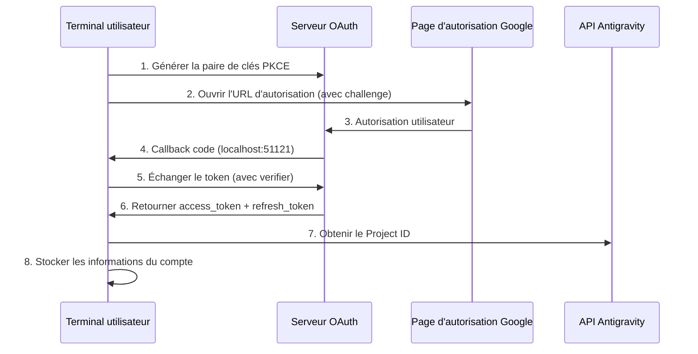

# Authentification OAuth 2.0 PKCE : Complétez votre première connexion

## Ce que vous saurez faire

- Comprendre le mécanisme de sécurité du flux d'authentification OAuth 2.0 PKCE
- Compléter la première connexion du plugin pour obtenir l'accès à l'API Antigravity
- Comprendre le mécanisme de récupération et de stockage automatique du Project ID
- Découvrir le traitement automatisé du rafraîchissement des tokens

## Votre problème actuel

Vous avez installé le plugin, configuré les définitions de modèles, mais ne l'avez jamais utilisé. Chaque exécution de `opencode run` affiche "Authentification requise", mais vous ne savez pas :

- Qu'est-ce qu'OAuth ? Pourquoi utiliser un mécanisme d'authentification aussi complexe ?
- Que se passe-t-il exactement pendant le processus d'authentification ? Est-ce sécurisé ?
- Que faut-il préparer pour la première connexion ? Quels sont les choix disponibles ?
- Que faire si le token expire ? Dois-je me reconnecter ?

## Quand utiliser cette méthode

- **Après la première installation du plugin** : L'authentification est obligatoire avant la première utilisation
- **Lors de l'ajout d'un nouveau compte** : Pour configurer la rotation multi-comptes, vous devez authentifier chaque compte individuellement
- **Après l'expiration du token** : Si le compte a été révoqué ou le mot de passe modifié, une nouvelle authentification est nécessaire
- **Lors du changement d'appareil** : Lors de la migration de compte, une reconnexion sur le nouvel appareil est nécessaire

## 🎒 Préparatifs

::: warning Vérifications préalables

Veuillez confirmer que vous avez effectué les étapes suivantes :

1. **Plugin installé** : Référez-vous à [Installation Rapide](/fr/NoeFabris/opencode-antigravity-auth/start/quick-install/)
2. **Modèles configurés** : Ajouté les définitions de modèles à `~/.config/opencode/opencode.json`
3. **Compte Google disponible** : Il est recommandé d'utiliser un compte de confiance existant, évitez d'utiliser un compte nouvellement créé

:::

## Concepts Fondamentaux

### Qu'est-ce qu'OAuth 2.0 PKCE ?

**OAuth 2.0** (Open Authorization 2.0) est un protocole d'autorisation qui permet à des applications tierces (ce plugin) d'obtenir l'accès à l'API Google sans récupérer directement le mot de passe de l'utilisateur.

**PKCE** (Proof Key for Code Exchange) est une extension de sécurité d'OAuth 2.0, conçue spécifiquement pour les clients publics (comme les outils CLI). Il empêche les attaques d'interception du code d'autorisation par le mécanisme suivant :

```
┌─────────────────────────────────────────────────────────────────┐
│  Mécanisme de protection PKCE                                 │
├─────────────────────────────────────────────────────────────────┤
│  1. Le client génère une paire de clés :                     │
│     - code_verifier (chaîne aléatoire, confidentielle)        │
│     - code_challenge (valeur de hachage du verifier, publique) │
│  2. L'URL d'autorisation contient le code_challenge          │
│  3. Le serveur de callback reçoit le code et vérifie avec    │
│     le code_verifier                                         │
│  4. Même si un attaquant intercepte le code, il ne peut pas  │
│     échanger le token sans le verifier                       │
└─────────────────────────────────────────────────────────────────┘
```

::: info

**PKCE vs OAuth traditionnel**

OAuth traditionnel utilise `client_secret` pour vérifier l'identité, mais cela exige que le client puisse stocker le secret en toute sécurité. Les outils CLI ne peuvent pas le faire, donc PKCE utilise un `verifier` généré dynamiquement au lieu d'une clé statique, tout aussi sécurisé sans dépendre de secrets pré-stockés.

:::

### Vue d'ensemble du flux d'authentification



## Suivez le guide

### Étape 1 : Démarrer la connexion OAuth

**Pourquoi**

La commande `opencode auth login` démarre le serveur OAuth local, génère l'URL d'autorisation et attend le callback de Google.

**Exécutez la commande** :

```bash
opencode auth login
```

**Ce que vous devriez voir** :

```
🔑 Initializing Antigravity OAuth...
📋 Starting local OAuth server on http://127.0.0.1:51121
🌐 Opening browser for authorization...

If the browser doesn't open, visit this URL manually:
https://accounts.google.com/o/oauth2/v2/auth?client_id=...&code_challenge=...
```

::: tip

**Détection de l'environnement**

Le plugin détecte automatiquement l'environnement d'exécution :

| Environnement | Adresse de liaison | Raison |
|--- | --- | ---|
| macOS/Linux/Windows local | `127.0.0.1` | Le plus sécurisé, n'accepte que les connexions locales |
| WSL / Docker / SSH distant | `0.0.0.0` | Permet au navigateur d'accéder depuis l'hôte |

Vous pouvez remplacer le paramètre par défaut via la variable d'environnement `OPENCODE_ANTIGRAVITY_OAUTH_BIND`.

:::

### Étape 2 : Autoriser dans le navigateur

**Pourquoi**

La page d'autorisation Google affiche les permissions (Scope) demandées par le plugin, vous devez donner votre accord explicite.

**Ce que vous verrez** :

Page d'autorisation OAuth Google, affichant :
- Demandeur : Antigravity Auth Plugin
- Permissions demandées :
  - Voir votre adresse e-mail
  - Voir vos informations de profil
  - Accéder à vos projets Cloud Platform
  - Accéder aux journaux et configurations d'expérimentation de Google Cloud

**Action à effectuer** :

1. Confirmez que les permissions demandées sont conformes aux attentes (aucune permission sensible hors scope)
2. Cliquez sur le bouton "Autoriser" ou "Allow"
3. Attendez que la page redirige vers `http://localhost:51121/oauth-callback`

**Ce que vous devriez voir** :

```html
<!DOCTYPE html>
<html>
  <!-- ... -->
  <h1>All set!</h1>
  <p>You've successfully authenticated with Antigravity.</p>
  <!-- ... -->
</html>
```

::: warning

**Problème de fermeture de la page d'autorisation**

Si le navigateur ne se ferme pas automatiquement après une autorisation réussie, fermez simplement l'onglet manuellement. C'est une limitation de sécurité du navigateur, cela n'affecte pas le résultat de l'authentification.

:::

### Étape 3 : Échanger automatiquement le token et obtenir le Project ID

**Pourquoi**

Le code d'autorisation n'est qu'une information d'identification temporaire, il doit être échangé contre un `refresh_token` à long terme, tout en obtenant le `Project ID` requis pour le projet Antigravity.

**Ce qui se passe automatiquement en arrière-plan** :

Le plugin exécute automatiquement les opérations suivantes (sans votre intervention) :

1. **Vérification PKCE** : Vérifier la validité du code d'autorisation avec `code_verifier`
2. **Échange de token** : Envoyer une requête POST à `oauth2.googleapis.com/token`

   ```typescript
   // Code source : src/antigravity/oauth.ts:209
   POST https://oauth2.googleapis.com/token
   Content-Type: application/x-www-form-urlencoded

   {
     client_id: "...",
     client_secret: "...",
     code: "code d'autorisation",
     grant_type: "authorization_code",
     redirect_uri: "http://localhost:51121/oauth-callback",
     code_verifier: "PKCE verifier"
   }
   ```

3. **Obtenir les informations utilisateur** : Vérifier l'adresse e-mail

   ```typescript
   // Code source : src/antigravity/oauth.ts:231
   GET https://www.googleapis.com/oauth2/v1/userinfo?alt=json
   Authorization: Bearer {access_token}
   ```

4. **Obtenir automatiquement le Project ID** : Tenter d'obtenir votre ID de projet depuis l'API Antigravity

   ```typescript
   // Code source : src/antigravity/oauth.ts:131
   // Essayer plusieurs points de terminaison par priorité
   - https://cloudcode-pa.googleapis.com/v1internal:loadCodeAssist (prod)
   - https://daily-cloudcode-pa.sandbox.googleapis.com/v1internal:loadCodeAssist (daily)
   - https://autopush-cloudcode-pa.sandbox.googleapis.com/v1internal:loadCodeAssist (autopush)
   ```

5. **Stocker les informations du compte** : Enregistrer dans `~/.config/opencode/antigravity-accounts.json`

   ```json
   {
     "version": 3,
     "accounts": [
       {
         "email": "your.email@gmail.com",
         "refreshToken": "1//0g...|rising-fact-p41fc",
         "projectId": "rising-fact-p41fc",
         "addedAt": 1737609600000,
         "lastUsed": 1737609600000
       }
     ]
   }
   ```

::: details

**Rôle du Project ID**

Le Project ID est l'identifiant unique d'un projet Google Cloud, utilisé pour déterminer à quel projet appartient l'appel API. Antigravity suit l'utilisation du quota en fonction du Project ID.

- **Récupération automatique réussie** : Utilise votre vrai Project ID (recommandé)
- **Échec de la récupération automatique** : Utilise le Project ID par défaut (`rising-fact-p41fc`)

:::

**Ce que vous devriez voir** :

```
✅ Authentication successful
📧 Account: your.email@gmail.com
🆔 Project ID: rising-fact-p41fc
💾 Saved to: ~/.config/opencode/antigravity-accounts.json
```

### Point de contrôle ✅

**Vérifier que le compte est correctement stocké** :

```bash
cat ~/.config/opencode/antigravity-accounts.json
```

**Sortie attendue** :

```json
{
  "version": 3,
  "accounts": [
    {
      "email": "your.email@gmail.com",
      "refreshToken": "1//0g...|rising-fact-p41fc",
      "projectId": "rising-fact-p41fc",
      "addedAt": 1737609600000,
      "lastUsed": 1737609600000
    }
  ]
}
```

::: tip

**Format de stockage du compte**

Le format du champ `refreshToken` est : `{refresh_token}|{project_id}`, cette conception permet de stocker le token et l'ID du projet dans un seul champ, simplifiant la logique de stockage.

:::

## Pièges courants

### Piège 1 : Port déjà utilisé

**Message d'erreur** :

```
❌ Port 51121 is already in use.
Another process is occupying this port.
```

**Raison** : Un autre processus OpenCode est en cours d'exécution, ou un autre programme occupe le port.

**Solution** :

1. Vérifiez et terminez le processus occupant le port :

   ```bash
   # macOS/Linux
   lsof -ti:51121 | xargs kill -9

   # Windows
   netstat -ano | findstr :51121
   taskkill /PID <PID> /F
   ```

2. Relancez `opencode auth login`

### Piège 2 : Le navigateur ne s'ouvre pas automatiquement

**Raison** : Dans les environnements WSL, Docker ou distants, `localhost` n'est pas égal à l'adresse de l'hôte.

**Solution** :

Le plugin détecte automatiquement l'environnement et affiche l'URL d'accès manuel :

```
🌐 Opening browser for authorization...

If the browser doesn't open, visit this URL manually:
https://accounts.google.com/o/oauth2/v2/auth?...
```

Copiez l'URL et visitez-la dans le navigateur de l'hôte.

### Piège 3 : Échec de la récupération du Project ID

**Message d'avertissement** :

```
⚠️ Failed to resolve Antigravity project via loadCodeAssist
Using default project ID: rising-fact-p41fc
```

**Raison** : Pour certains comptes d'entreprise ou configurations de permissions spéciales, l'API `loadCodeAssist` est inaccessible.

**Solution** :

1. Si vous utilisez uniquement des modèles Antigravity (avec le suffixe `:antigravity`), vous pouvez utiliser le Project ID par défaut
2. Si vous avez besoin d'utiliser des modèles Gemini CLI (comme `gemini-2.5-pro`), configurez manuellement le Project ID :

   ```json
   // Éditez ~/.config/opencode/antigravity-accounts.json
   {
     "accounts": [
       {
         "email": "your.email@gmail.com",
         "refreshToken": "1//0g...|your-custom-project-id",
         "projectId": "your-custom-project-id"
       }
     ]
   }
   ```

   Étapes pour obtenir le Project ID :
   - Visitez [Google Cloud Console](https://console.cloud.google.com/)
   - Créez ou sélectionnez un projet
   - Activez **Gemini for Google Cloud API**
   - Copiez l'ID du projet (format : `rising-fact-p41fc`)

### Piège 4 : Erreur invalid_grant

**Message d'erreur** :

```
❌ Token exchange failed: invalid_grant
```

**Raison** :
- Le code d'autorisation a expiré (validité généralement 10 minutes)
- L'utilisateur a révoqué l'accès de l'application après autorisation
- Le mot de passe du compte a été modifié ou un événement de sécurité a été déclenché

**Solution** : Relancez `opencode auth login`

## Mécanisme de rafraîchissement des tokens

**Rafraîchissement automatique** : Vous n'avez pas à vous soucier de l'expiration des tokens.

Le plugin rafraîchit automatiquement dans les situations suivantes :

| Condition de déclenchement | Action | Emplacement du code source |
|--- | --- | ---|
| 60 secondes avant l'expiration du token | Rafraîchissement automatique | `src/plugin/auth.ts:33` |
| Réception de 401 Unauthorized | Tentative de rafraîchissement | `src/plugin/auth.ts:33` |
| Échec du rafraîchissement | Invite l'utilisateur à se reconnecter | `src/plugin.ts:995` |

**Logique de rafraîchissement** :

```typescript
// Code source : src/plugin/auth.ts:33
export function accessTokenExpired(auth: OAuthAuthDetails): boolean {
  // Rafraîchir 60 secondes à l'avance (réserve de décalage d'horloge)
  return auth.expires <= Date.now() + 60 * 1000;
}
```

## Résumé de la leçon

Points clés du flux d'authentification OAuth 2.0 PKCE :

1. **Mécanisme de sécurité PKCE** : Utilise un `verifier` dynamique au lieu d'une clé statique pour empêcher l'interception du code d'autorisation
2. **Serveur de callback local** : Écoute sur `localhost:51121`, reçoit le callback d'autorisation Google
3. **Échange de token** : Échange le code d'autorisation contre `access_token` et `refresh_token`
4. **Project ID automatique** : Tente de récupérer depuis l'API Antigravity, utilise la valeur par défaut en cas d'échec
5. **Rafraîchissement automatique** : Rafraîchit automatiquement 60 secondes avant l'expiration du token, sans intervention manuelle
6. **Stockage du compte** : Toutes les informations sont enregistrées dans `~/.config/opencode/antigravity-accounts.json`

Vous pouvez maintenant envoyer votre première requête modèle !

## Aperçu de la prochaine leçon

> Dans la prochaine leçon, nous apprendrons **[Première Requête](/fr/NoeFabris/opencode-antigravity-auth/start/first-request/)**.
>
> Vous apprendrez :
> - Comment envoyer une requête avec `opencode run`
> - Vérifier que l'authentification a réussi
> - Comprendre la configuration des variantes de modèles

---

## Annexe : Référence du code source

<details>
<summary><strong>Cliquez pour afficher les emplacements du code source</strong></summary>

> Dernière mise à jour : 2026-01-23

| Fonctionnalité | Chemin du fichier                                                                                               | Ligne    |
|--- | --- | ---|
| Génération des clés PKCE | [`src/antigravity/oauth.ts`](https://github.com/NoeFabris/opencode-antigravity-auth/blob/main/src/antigravity/oauth.ts#L91-L113)         | 91-113  |
| Construction de l'URL d'autorisation   | [`src/antigravity/oauth.ts`](https://github.com/NoeFabris/opencode-antigravity-auth/blob/main/src/antigravity/oauth.ts#L91-L113)         | 91-113  |
| Échange de token     | [`src/antigravity/oauth.ts`](https://github.com/NoeFabris/opencode-antigravity-auth/blob/main/src/antigravity/oauth.ts#L201-L270)         | 201-270 |
| Obtenir les informations utilisateur   | [`src/antigravity/oauth.ts`](https://github.com/NoeFabris/opencode-antigravity-auth/blob/main/src/antigravity/oauth.ts#L231-L242)         | 231-242 |
| Récupération automatique du Project ID | [`src/antigravity/oauth.ts`](https://github.com/NoeFabris/opencode-antigravity-auth/blob/main/src/antigravity/oauth.ts#L131-L196)      | 131-196 |
| Détection de l'environnement       | [`src/plugin/server.ts`](https://github.com/NoeFabris/opencode-antigravity-auth/blob/main/src/plugin/server.ts#L31-L134)           | 31-134  |
| Serveur de callback OAuth | [`src/plugin/server.ts`](https://github.com/NoeFabris/opencode-antigravity-auth/blob/main/src/plugin/server.ts#L140-L366)           | 140-366 |
| Vérification de l'expiration du token   | [`src/plugin/auth.ts`](https://github.com/NoeFabris/opencode-antigravity-auth/blob/main/src/plugin/auth.ts#L33-L38)               | 33-38   |
| Calcul de l'expiration du token | [`src/plugin/auth.ts`](https://github.com/NoeFabris/opencode-antigravity-auth/blob/main/src/plugin/auth.ts#L45-L52)               | 45-52   |

**Constantes clés** :
- `ANTIGRAVITY_CLIENT_ID` : ID client OAuth (`constants.ts:4`)
- `ANTIGRAVITY_CLIENT_SECRET` : Secret client OAuth (`constants.ts:9`)
- `ANTIGRAVITY_REDIRECT_URI` : Adresse de callback OAuth `http://localhost:51121/oauth-callback` (`constants.ts:25`)
- `ANTIGRAVITY_SCOPES` : Liste des permissions demandées (`constants.ts:14-20`)
- `ANTIGRAVITY_DEFAULT_PROJECT_ID` : ID de projet par défaut `rising-fact-p41fc` (`constants.ts:71`)

**Fonctions clés** :
- `authorizeAntigravity()` : Générer la paire de clés PKCE et l'URL d'autorisation (`oauth.ts:91`)
- `exchangeAntigravity()` : Échanger le code d'autorisation contre le token d'accès (`oauth.ts:201`)
- `fetchProjectID()` : Obtenir l'ID de projet depuis l'API Antigravity (`oauth.ts:131`)
- `startOAuthListener()` : Démarrer le serveur OAuth local (`server.ts:140`)
- `accessTokenExpired()` : Vérifier si le token a expiré (`auth.ts:33`)

**Règles métier importantes** :
- PKCE utilise l'algorithme de hachage S256 (`oauth.ts:100`)
- Rafraîchissement automatique 60 secondes avant l'expiration du token (`auth.ts:3`)
- Support de l'accès hors ligne (`access_type=offline`) (`oauth.ts:105`)
- Ordre de repli des points de terminaison Project ID : prod → daily → autopush (`oauth.ts:141-143`)

</details>
