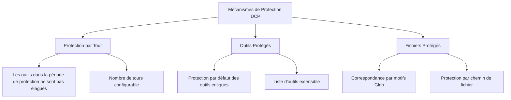

# Mécanismes de Protection : Éviter l'Élagage de Contenu Critique

## Ce Que Vous Apprendrez

- Configurer la protection par tour pour donner à l'IA le temps de référencer les sorties d'outils récentes
- Étendre la liste des outils protégés pour empêcher l'élagage d'opérations critiques
- Définir des motifs de fichiers protégés pour protéger des fichiers spécifiques contre l'élagage accidentel
- Comprendre le mécanisme de protection des sous-agents pour éviter d'affecter les comportements de synthèse

## Votre Dilemme Actuel

Le DCP élagera automatiquement les appels d'outils redondants dans l'historique de conversation, ce qui économise beaucoup de tokens, mais cela peut parfois poser problème :

- L'IA vient de lire un fichier et veut analyser son contenu, mais le DCP l'a élagué
- Vous utilisez l'outil `write` pour écrire un fichier de configuration et devez le relire plus tard, mais après l'élagage, le chemin du fichier est introuvable
- L'IA dit "basé sur le code ci-dessus", mais le code n'est plus dans le contexte

Ces situations montrent que : **certains contenus doivent être protégés et ne peuvent pas être élagués**.

## Quand Utiliser Cette Technique

- Quand l'IA doit référencer le contenu d'un fichier lu précédemment
- Quand vous devez protéger des opérations critiques (comme l'écriture de configurations, la planification de tâches)
- Quand certains chemins de fichiers (comme secrets, clés) nécessitent une protection spéciale
- Lors du développement de fonctionnalités de sous-agents (le DCP sautera automatiquement)

## Idée Principale

Le DCP fournit **trois niveaux de mécanismes de protection** pour empêcher l'élagage accidentel de contenu critique de différentes dimensions :



**Niveaux de Protection** :
1. **Protection par Tour** (dimension temporelle) : Les outils des N tours les plus récents sont automatiquement protégés
2. **Protection des Outils** (dimension outil) : Certains outils ne seront jamais élagués
3. **Protection des Fichiers** (dimension chemin) : Les outils opérant sur des fichiers spécifiques ne seront pas élagués

Ces trois niveaux peuvent être combinés pour former un réseau de protection multicouche.

---

## Protection par Tour

### Qu'est-ce que la Protection par Tour

La protection par tour (Turn Protection) est un **mécanisme de fenêtre temporelle** fourni par le DCP. Une fois activée, les appels d'outils dans la période de protection ne sont pas ajoutés au cache d'élagage et ne seront donc élagués par aucune stratégie.

**Fonction** : Donner à l'IA le temps de référencer les sorties d'outils récentes, évitant la situation embarrassante où "on vient de parler et c'est déjà supprimé".

### Configurer la Protection par Tour

Ajoutez dans le fichier de configuration :

```jsonc
{
  "turnProtection": {
    "enabled": true,
    "turns": 4
  }
}
```

**Description des paramètres** :
- `enabled` : Activer ou non la protection par tour (par défaut `false`)
- `turns` : Nombre de tours de protection (par défaut `4`), indiquant que les outils des 4 tours les plus récents ne seront pas élagués

### Comment Fonctionne la Protection par Tour

Lors de la synchronisation du cache d'outils (avant chaque envoi de message par l'IA), le DCP calcule le nombre de tours pour chaque outil :

```typescript
// Si tour actuel - tour de création de l'outil < nombre de tours de protection
// Alors cet outil ne sera pas élagué
state.currentTurn - turnCounter < turnProtectionTurns
```

**Exemple** :
- Tour actuel : 10
- Tour de création de l'outil : 8
- Nombre de tours de protection : 4
- Résultat : 10 - 8 = 2 < 4 → **Protégé, non élagué**

**Effet** :
- Pendant la période de protection, les outils n'apparaissent pas dans la liste `<prunable-tools>`
- Ils ne sont pas affectés par les stratégies automatiques (déduplication, écrasement d'écriture, suppression des erreurs)
- L'IA ne peut pas les élaguer via les outils `discard`/`extract`

### Configuration Recommandée

| Scénario | Nombre de Tours Recommandé | Description |
| --- | --- | --- |
| Conversations longues (10+ tours) | 4-6 | Donner à l'IA suffisamment de temps pour référencer le contenu historique |
| Conversations courtes (< 5 tours) | 2-3 | Pas besoin d'une période de protection trop longue |
| Tâches fortement dépendantes du contexte | 6-8 | Comme le refactoring de code, l'analyse de documents longs |
| Par défaut (pas de dépendance au contexte) | 0-2 | Désactivé ou valeur minimale |

::: tip Remarque
La protection par tour augmente la taille du contexte car plus de sorties d'outils sont conservées. Si vous constatez une augmentation significative de la consommation de tokens, vous pouvez réduire le nombre de tours de protection.
:::

---

## Outils Protégés

### Outils Protégés par Défaut

Le DCP protège par défaut les outils suivants, qui **ne seront jamais** élagués :

| Nom de l'Outil | Description |
| --- | --- |
| `task` | Outil de gestion des tâches |
| `todowrite` | Écrire des éléments de tâches |
| `todoread` | Lire des éléments de tâches |
| `discard` | Outil de rejet du DCP (opération d'élagage elle-même) |
| `extract` | Outil d'extraction du DCP (opération d'élagage elle-même) |
| `batch` | Outil d'opérations par lots |
| `write` | Outil d'écriture de fichiers |
| `edit` | Outil d'édition de fichiers |
| `plan_enter` | Marqueur d'entrée de planification |
| `plan_exit` | Marqueur de sortie de planification |

**Pourquoi ces outils sont protégés** :
- `task`, `todowrite`, `todoread` : La gestion des tâches est au cœur de l'état de la session, la suppression entraînerait une perte de contexte
- `discard`, `extract` : Ce sont les outils d'élagage du DCP eux-mêmes, ils ne peuvent pas s'élaguer eux-mêmes
- `batch`, `write`, `edit` : Les opérations de fichiers sont au cœur de l'interaction entre l'IA et le code de l'utilisateur
- `plan_enter`, `plan_exit` : Les marqueurs de planification aident à comprendre la structure de la session

### Étendre la Liste des Outils Protégés

Si vous devez protéger plus d'outils, vous pouvez les ajouter dans la configuration :

```jsonc
{
  "tools": {
    "settings": {
      "protectedTools": [
        "task",
        "todowrite",
        "todoread",
        "discard",
        "extract",
        "batch",
        "write",
        "edit",
        "plan_enter",
        "plan_exit",
        // Ajoutez les outils que vous souhaitez protéger
        "read",
        "filesearch"
      ]
    }
  }
}
```

**Protection Globale des Outils** :
- Les outils dans `tools.settings.protectedTools` sont protégés dans toutes les stratégies
- Applicable aux outils que vous ne souhaitez voir élagués par aucune stratégie

### Protection des Outils au Niveau de la Stratégie

Vous pouvez également définir des outils protégés pour des stratégies spécifiques :

```jsonc
{
  "strategies": {
    "deduplication": {
      "enabled": true,
      "protectedTools": [
        "read",  // Protéger l'outil read lors de la déduplication
        "filesearch"
      ]
    },
    "purgeErrors": {
      "enabled": true,
      "turns": 4,
      "protectedTools": [
        "write"  // Protéger l'outil write lors de la suppression des erreurs
      ]
    }
  }
}
```

**Scénarios d'Utilisation** :
- Protéger les outils uniquement dans une stratégie spécifique, les autres stratégies peuvent les élaguer
- Par exemple : Autoriser la déduplication à élaguer `read`, mais la stratégie de suppression des erreurs ne peut pas élaguer `write`

::: info Différence entre Protection des Outils et Protection par Tour
- **Protection des Outils** : Quel que soit le tour de création de l'outil, tant qu'il est dans la liste de protection, il ne sera jamais élagué
- **Protection par Tour** : Tous les outils (sauf les outils protégés) ne sont pas élagués pendant la période de protection, mais peuvent l'être après
:::

---

## Motifs de Fichiers Protégés

### Qu'est-ce que les Motifs de Fichiers Protégés

Les motifs de fichiers protégés vous permettent de **protéger les opérations sur des chemins de fichiers spécifiques contre l'élagage** via des motifs Glob.

**Scénarios Applicables** :
- Protéger les fichiers de clés (`.env`, `secrets.json`)
- Protéger les fichiers de configuration (les configurations importantes ne doivent pas être perdues)
- Protéger les fichiers centraux du projet (fichiers d'entrée, bibliothèques centrales)
- Protéger les répertoires sensibles (comme `src/api/`, `tests/fixtures/`)

### Configurer les Motifs de Fichiers Protégés

Ajoutez dans le fichier de configuration :

```jsonc
{
  "protectedFilePatterns": [
    "**/.env*",
    "**/secrets.json",
    "**/config/*.json",
    "src/core/**/*.ts",
    "tests/fixtures/**/*"
  ]
}
```

### Description des Motifs Glob

Le DCP prend en charge les motifs Glob standard :

| Motif | Description | Exemple de Chemin Correspondant |
| --- | --- | --- |
| `**` | Correspond à des répertoires de n'importe quel niveau | `src/`, `src/components/`, `a/b/c/` |
| `*` | Correspond à n'importe quel fichier dans un répertoire unique | `src/*.ts` correspond à `src/index.ts` |
| `?` | Correspond à un seul caractère | `file?.txt` correspond à `file1.txt`, `file2.txt` |
| `*.json` | Correspond à une extension spécifique | `config.json`, `data.json` |
| `**/*.json` | Correspond aux fichiers JSON de n'importe quel niveau | `a/b/c.json`, `d.json` |

**Remarques** :
- `*` et `?` ne correspondent pas à `/` (séparateur de répertoire)
- La correspondance est effectuée sur le chemin de fichier complet
- Le séparateur de chemin est uniformément `/` (même sur Windows)

### Cas Pratiques

#### Cas 1 : Protéger les Fichiers de Variables d'Environnement

```jsonc
{
  "protectedFilePatterns": [
    "**/.env",
    "**/.env.local",
    "**/.env.production"
  ]
}
```

**Effet** : Aucun outil opérant sur des fichiers `.env` ne sera élagué.

#### Cas 2 : Protéger les Fichiers Centraux du Projet

```jsonc
{
  "protectedFilePatterns": [
    "src/index.ts",
    "src/core/**/*.ts",
    "src/api/**/*.ts"
  ]
}
```

**Effet** : Les sorties d'outils opérant sur les modules centraux et les API seront conservées, assurant que l'IA peut toujours voir la structure du projet.

#### Cas 3 : Protéger les Données de Test Fixes

```jsonc
{
  "protectedFilePatterns": [
    "tests/fixtures/**/*",
    "tests/mocks/**/*.json"
  ]
}
```

**Effet** : Les données de simulation et les entrées fixes utilisées pour les tests ne seront pas élaguées, évitant les incohérences des résultats de test.

---

## Protection des Sous-Agents

### Qu'est-ce qu'un Sous-Agent

Un sous-agent (Subagent) est un mécanisme d'OpenCode où l'agent principal peut déployer des sous-agents pour traiter des tâches spécifiques (comme la recherche de fichiers, l'analyse de code). Les sous-agents résument les résultats avant de les retourner à l'agent principal.

### Protection des Sous-Agents par le DCP

Le DCP détecte automatiquement les sessions de sous-agents et **saute toutes les opérations d'élagage**.

**Principe de Réalisation** :
```typescript
// lib/state/utils.ts
export async function isSubAgentSession(client: any, sessionID: string): Promise<boolean> {
    const result = await client.session.get({ path: { id: sessionID } })
    return !!result.data?.parentID  // Si parentID existe, c'est un sous-agent
}
```

**Pourquoi une Protection est Nécessaire** :
- La sortie du sous-agent est un résumé destiné à l'agent principal
- Si les sorties d'outils du sous-agent sont élaguées, l'agent principal pourrait ne pas comprendre le contexte
- La mission du sous-agent est "exécution efficace", pas "économie de tokens"

::: info Perception de l'Utilisateur
La protection des sous-agents est automatique, vous n'avez besoin de configurer quoi que ce soit. Le DCP enregistrera les sessions de sous-agents détectées dans les logs.
:::

---

## Suivez-Moi : Configurer les Mécanismes de Protection

### Étape 1 : Éditer le Fichier de Configuration

Ouvrez le fichier de configuration global (ou le fichier de configuration du projet) :

```bash
# macOS/Linux
code ~/.config/opencode/dcp.jsonc

# Windows
code $env:APPDATA\opencode\dcp.jsonc
```

### Étape 2 : Ajouter la Configuration de Protection

```jsonc
{
  "$schema": "https://raw.githubusercontent.com/Opencode-DCP/opencode-dynamic-context-pruning/main/dcp.schema.json",
  "enabled": true,
  "debug": false,

  // Protection par tour
  "turnProtection": {
    "enabled": true,
    "turns": 4
  },

  // Motifs de fichiers protégés
  "protectedFilePatterns": [
    "**/.env*",
    "**/secrets.json"
  ],

  // Étendre les outils protégés
  "tools": {
    "settings": {
      "nudgeEnabled": true,
      "nudgeFrequency": 10,
      "protectedTools": [
        "task",
        "todowrite",
        "todoread",
        "discard",
        "extract",
        "batch",
        "write",
        "edit",
        "plan_enter",
        "plan_exit",
        "read"
      ]
    },
    "discard": {
      "enabled": true
    },
    "extract": {
      "enabled": true,
      "showDistillation": false
    }
  },

  // Protection au niveau de la stratégie
  "strategies": {
    "deduplication": {
      "enabled": true,
      "protectedTools": ["filesearch"]
    },
    "supersedeWrites": {
      "enabled": false
    },
    "purgeErrors": {
      "enabled": true,
      "turns": 4,
      "protectedTools": ["write"]
    }
  }
}
```

### Étape 3 : Redémarrer OpenCode

Après modification de la configuration, redémarrez OpenCode pour qu'elle prenne effet :

- macOS/Linux : Clic droit sur l'icône OpenCode dans le Dock → Quitter → Rouvrir
- Windows : Clic droit sur OpenCode dans la barre des tâches → Fermer la fenêtre → Rouvrir

### Étape 4 : Vérifier les Mécanismes de Protection

Dans la conversation OpenCode, tapez `/dcp context` pour voir l'analyse du contexte actuel :

```
Session Context Breakdown:
──────────────────────────────────────────────────────────

System         15.2% │████████████████▒▒▒▒▒▒▒▒▒▒▒▒▒▒▒▒▒▒▒▒▒▒▒│  25.1K tokens
User            5.1% │████▒▒▒▒▒▒▒▒▒▒▒▒▒▒▒▒▒▒▒▒▒▒▒▒▒▒▒▒▒▒▒▒▒▒▒▒▒▒│   8.4K tokens
Assistant       35.8% │██████████████████████████████████████▒▒▒▒▒▒▒│  59.2K tokens
Tools (45)      43.9% │████████████████████████████████████████████████│  72.6K tokens

──────────────────────────────────────────────────────────

Summary:
  Pruned:          12 tools (~15.2K tokens)
  Current context: ~165.3K tokens
  Without DCP:     ~180.5K tokens
```

**Ce Que Vous Devriez Voir** :
- Le nombre `Pruned` pourrait diminuer (car les outils protégés ne sont pas élagués)
- Le `Current context` pourrait augmenter (car la protection par tour conserve plus de contenu)

---

## Pièges à Éviter

### ❌ Erreur 1 : Protection Excessive Entraînant un Gaspillage de Tokens

**Problème** : Définir une période de protection trop longue ou ajouter trop d'outils protégés, entraînant un contexte toujours très volumineux.

**Solution** :
- La protection par tour est généralement réglée à 2-4 tours
- Ne protégez que les outils réellement critiques (comme `task`, `write`)
- Consultez régulièrement `/dcp context` pour surveiller la taille du contexte

### ❌ Erreur 2 : Échec de Correspondance des Motifs Glob

**Problème** : Définir `*.json`, mais certains fichiers JSON sont quand même élagués.

**Cause** : `*` ne correspond pas à `/`, donc `a/b/c.json` ne sera pas correspondu.

**Solution** : Utilisez `**/*.json` pour correspondre aux fichiers JSON de n'importe quel niveau.

### ❌ Erreur 3 : Oublier de Redémarrer OpenCode

**Problème** : Après modification de la configuration, les mécanismes de protection ne prennent pas effet.

**Cause** : Le DCP ne charge le fichier de configuration qu'au démarrage.

**Solution** : Vous devez redémarrer OpenCode après modification de la configuration.

### ❌ Erreur 4 : Outils Protégés Apparaissant dans la Liste d'Élagage

**Problème** : Les outils protégés sont définis, mais apparaissent quand même dans la liste `<prunable-tools>`.

**Cause** : Les outils protégés ne seront pas élagués, mais s'ils sont en dehors de la période de protection, ils apparaîtront toujours dans la liste `<prunable-tools>` (pour consultation par l'IA), seulement l'IA échouera lorsqu'elle essaiera de les élaguer.

**Solution** : C'est un comportement normal. Lorsque l'IA essaie d'élaguer un outil protégé, le DCP refusera l'opération et retournera une erreur.

---

## Résumé de Cette Leçon

Les mécanismes de protection du DCP comprennent trois niveaux :

1. **Protection par Tour** : Les outils dans la période de protection ne seront pas élagués, donnant à l'IA le temps de référencer le contenu historique
2. **Outils Protégés** : Certains outils (comme `task`, `write`) ne seront jamais élagués, la liste personnalisée peut être étendue
3. **Motifs de Fichiers Protégés** : Protéger les opérations sur des chemins de fichiers spécifiques via des motifs Glob
4. **Protection des Sous-Agents** : Le DCP détecte automatiquement et saute les opérations d'élagage des sessions de sous-agents

**Stratégie de Configuration Recommandée** :
- Phase de développement : Activer la protection par tour (2-4 tours), protéger les fichiers de configuration et les modules centraux
- Phase de production : Ajuster selon les besoins réels, équilibrer l'économie de tokens et l'intégrité du contexte
- Tâches critiques : Activer tous les mécanismes de protection pour assurer que le contenu critique ne soit pas perdu

---

## Aperçu de la Leçon Suivante

> Dans la leçon suivante, nous apprendrons la **[Persistance de l'État](../state-persistence/)**.
>
> Vous apprendrez :
> - Comment le DCP conserve l'état d'élagage et les statistiques entre les sessions
> - L'emplacement et le format des fichiers de persistance
> - Comment visualiser les économies de tokens cumulées
> - Les méthodes pour nettoyer les données persistantes

---

## Annexe : Référence du Code Source

<details>
<summary><strong>Cliquez pour voir l'emplacement du code source</strong></summary>

> Dernière mise à jour : 2026-01-23

| Fonctionnalité | Chemin du Fichier | Numéros de Ligne |
| --- | --- | --- |
| Logique de protection par tour | [`lib/state/tool-cache.ts`](https://github.com/Opencode-DCP/opencode-dynamic-context-pruning/blob/main/lib/state/tool-cache.ts#L39-L44) | 39-44 |
| Outils protégés par défaut | [`lib/config.ts`](https://github.com/Opencode-DCP/opencode-dynamic-context-pruning/blob/main/lib/config.ts#L68-L79) | 68-79 |
| Correspondance des fichiers protégés | [`lib/protected-file-patterns.ts`](https://github.com/Opencode-DCP/opencode-dynamic-context-pruning/blob/main/lib/protected-file-patterns.ts#L77-L82) | 77-82 |
| Détection des sous-agents | [`lib/state/utils.ts`](https://github.com/Opencode-DCP/opencode-dynamic-context-pruning/blob/main/lib/state/utils.ts#L1-L8) | 1-8 |
| Vérification de protection de la stratégie de déduplication | [`lib/strategies/deduplication.ts`](https://github.com/Opencode-DCP/opencode-dynamic-context-pruning/blob/main/lib/strategies/deduplication.ts#L49-L57) | 49-57 |
| Vérification de protection de l'outil Discard | [`lib/strategies/tools.ts`](https://github.com/Opencode-DCP/opencode-dynamic-context-pruning/blob/main/lib/strategies/tools.ts#L89-L112) | 89-112 |

**Constantes Clés** :
- `DEFAULT_PROTECTED_TOOLS = ["task", "todowrite", "todoread", "discard", "extract", "batch", "write", "edit", "plan_enter", "plan_exit"]` : Liste des outils protégés par défaut

**Fonctions Clés** :
- `isProtectedFilePath(filePath, patterns)` : Vérifier si le chemin de fichier correspond au motif de protection
- `isSubAgentSession(client, sessionID)` : Détecter si la session est un sous-agent

</details>
