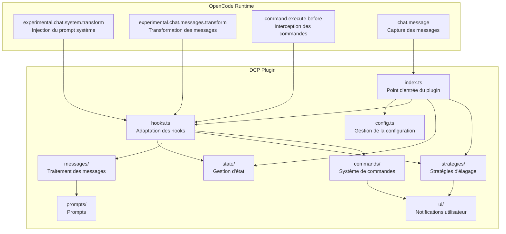
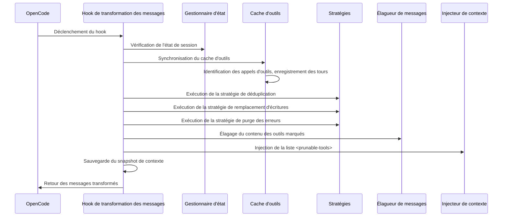
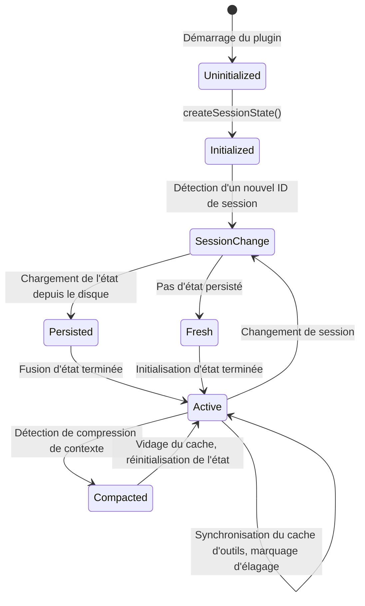
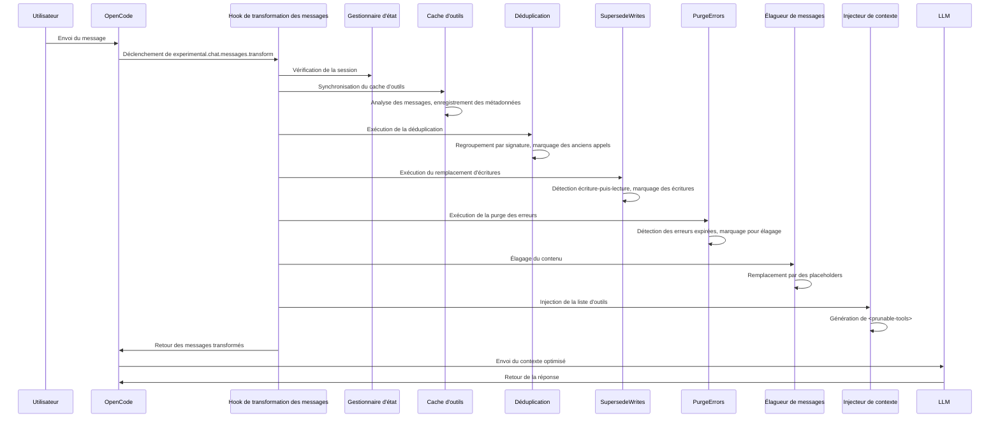
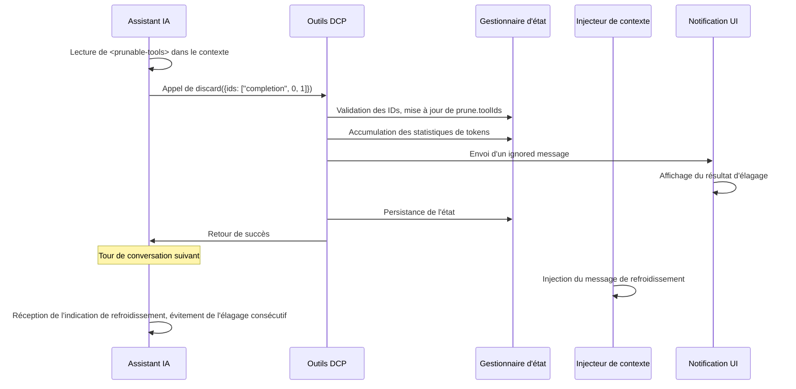

# Vue d'ensemble de l'architecture : Fonctionnement interne de DCP

## Ce que vous apprendrez

Cette section ne concerne pas les opérations pratiques, mais vous aide à comprendre en profondeur la conception interne de DCP. Après l'avoir terminée, vous serez capable de :
- Comprendre comment DCP s'intègre au flux de conversation via le système de hooks d'OpenCode
- Maîtriser les responsabilités et les interactions de chaque module
- Comprendre la chaîne d'appels complète, de la réception des messages à l'achèvement de l'élagage
- Appréhender la philosophie de conception de la gestion d'état, du traitement des messages et des stratégies d'élagage

## Concept central

DCP est un plugin basé sur le SDK de plugins OpenCode qui étend les capacités de conversation d'OpenCode en enregistrant des hooks et des outils. L'ensemble du système s'articule autour du concept central de « transformation de messages » (message transform) — avant chaque réponse de l'IA à l'utilisateur, DCP analyse, examine et élague l'historique de conversation, puis envoie le contexte optimisé au LLM.

::: info Pourquoi la « transformation de messages » ?

OpenCode fournit le hook `experimental.chat.messages.transform`, qui permet aux plugins de modifier les messages avant leur envoi au LLM. C'est exactement la capacité dont DCP a besoin — supprimer les appels d'outils redondants avant que le LLM ne voie le contexte.

:::

Le système adopte une conception modulaire, avec des responsabilités clairement définies pour chaque module :
- **config** : Gestion de la configuration, avec support de la surcharge multi-niveaux
- **state** : Gestion d'état, maintien de l'état d'exécution au niveau de la session
- **messages** : Traitement des messages, exécution des opérations d'élagage et d'injection
- **strategies** : Stratégies d'élagage, définition des règles de nettoyage automatique
- **commands** : Système de commandes, contrôle manuel et requêtes statistiques
- **hooks** : Adaptation des hooks, connexion entre OpenCode et les modules DCP
- **ui** : Notifications utilisateur, affichage des résultats d'élagage et des statistiques

## Diagramme d'architecture des modules



## Point d'entrée et initialisation du plugin

Le point d'entrée du plugin est défini dans `index.ts`, c'est le seul point de connexion entre DCP et l'API de plugins OpenCode.

### Processus d'enregistrement du plugin

```typescript
const plugin: Plugin = (async (ctx) => {
    const config = getConfig(ctx)
    if (!config.enabled) {
        return {}
    }

    const logger = new Logger(config.debug)
    const state = createSessionState()

    return {
        "experimental.chat.system.transform": createSystemPromptHandler(...),
        "experimental.chat.messages.transform": createChatMessageTransformHandler(...),
        "chat.message": async (input, _output) => { /* mise en cache du variant */ },
        "command.execute.before": createCommandExecuteHandler(...),
        tool: {
            discard: createDiscardTool(...),
            extract: createExtractTool(...),
        },
        config: async (opencodeConfig) => { /* modification de la config OpenCode */ },
    }
}) satisfies Plugin
```

**Phase d'initialisation** :
1. Chargement de la configuration (avec fusion multi-niveaux : valeurs par défaut → global → variables d'environnement → projet)
2. Si le plugin est désactivé, retour immédiat d'un objet vide
3. Création du système de journalisation et de l'objet d'état de session
4. Enregistrement de quatre hooks et deux outils

**Phase de modification de la configuration** :
- Via le hook `config`, ajout des outils `discard` et `extract` à `experimental.primary_tools`
- Enregistrement de la commande `/dcp`

## Système de hooks et transformation des messages

`hooks.ts` est responsable de la conversion des événements de hooks OpenCode en appels de modules internes DCP. C'est la couche centrale d'orchestration de DCP.

### Hook d'injection du prompt système

```typescript
createSystemPromptHandler(state, logger, config)
```

**Moment d'appel** : À chaque construction du prompt système

**Responsabilités principales** :
1. Détection des sessions de sous-agents (si c'est un sous-agent, ignorer l'injection)
2. Détection des agents internes (comme le générateur de résumés de conversation, ignorer l'injection)
3. Sélection du modèle de prompt approprié selon la configuration :
   - discard et extract activés : `system/system-prompt-both`
   - Uniquement discard activé : `system/system-prompt-discard`
   - Uniquement extract activé : `system/system-prompt-extract`
4. Injection de la description des outils dans le prompt système

**Pourquoi l'injection du prompt système est-elle nécessaire ?**

L'IA doit savoir qu'elle peut utiliser les outils `discard` et `extract` pour optimiser le contexte. En décrivant l'utilité de ces outils dans le prompt système, l'IA peut décider de manière autonome quand les appeler.

### Hook de transformation des messages

```typescript
createChatMessageTransformHandler(ctx.client, state, logger, config)
```

**Moment d'appel** : À chaque fois que l'IA prépare une réponse (avant l'envoi au LLM)

**Flux de traitement** :



**Étapes clés** :

1. **Vérification de session** (`checkSession`)
   - Détection du changement d'ID de session
   - Si nouvelle session, chargement de l'état persisté depuis le disque
   - Détection de la compression de contexte (mécanisme de résumé d'OpenCode), si compression détectée, vidage du cache d'outils

2. **Synchronisation du cache d'outils** (`syncToolCache`)
   - Analyse de tous les appels d'outils dans les messages
   - Enregistrement du `callID`, nom d'outil, paramètres, statut, numéro de tour pour chaque outil
   - Ignorer les outils protégés et ceux dans la période de protection de tour
   - Maintien du `nudgeCounter` (compteur d'outils non élagués)

3. **Exécution des stratégies automatiques**
   - `deduplicate` : Déduplication, conservation de l'appel le plus récent
   - `supersedeWrites` : Nettoyage des opérations d'écriture remplacées par des lectures
   - `purgeErrors` : Nettoyage des entrées d'outils en erreur expirés

4. **Élagage du contenu** (`prune`)
   - Remplacement de l'`output` des outils marqués par un placeholder
   - Remplacement de l'`input` des outils en erreur par un placeholder

5. **Injection de la liste d'outils** (`insertPruneToolContext`)
   - Génération de la liste `<prunable-tools>` (avec ID numérique, nom d'outil, résumé des paramètres)
   - Injection d'un message de rappel (nudge) si nécessaire
   - Si la dernière opération était un élagage, injection d'un message de refroidissement

6. **Sauvegarde du snapshot de contexte**
   - Sauvegarde des messages transformés dans le répertoire de logs pour le débogage

### Hook d'interception des commandes

```typescript
createCommandExecuteHandler(ctx.client, state, logger, config, ctx.directory)
```

**Moment d'appel** : Lors de l'exécution d'une commande par l'utilisateur

**Responsabilités principales** :
- Interception des commandes commençant par `/dcp`
- Distribution vers le gestionnaire de commande approprié :
  - `/dcp` → Affichage de l'aide
  - `/dcp context` → Affichage de l'analyse d'utilisation des tokens
  - `/dcp stats` → Affichage des statistiques d'élagage cumulées
  - `/dcp sweep [n]` → Élagage manuel des outils
- Blocage du traitement par défaut d'OpenCode via une erreur spéciale (`__DCP_*_HANDLED__`)

## Gestion d'état

Le module `state/` est responsable du maintien de l'état d'exécution au niveau de la session et de la persistance.

### Structures de données principales

**SessionState** (état en mémoire) :
```typescript
{
    sessionId: string | null,           // ID de session actuel
    isSubAgent: boolean,               // Est-ce une session de sous-agent
    prune: { toolIds: string[] },       // Liste des IDs d'outils marqués pour élagage
    stats: {
        pruneTokenCounter: number,      // Tokens élagués dans la session actuelle
        totalPruneTokens: number,       // Total historique des tokens élagués
    },
    toolParameters: Map<string, ToolParameterEntry>,  // Cache des appels d'outils
    nudgeCounter: number,               // Compteur d'outils non élagués (pour déclencher les rappels)
    lastToolPrune: boolean,             // La dernière opération était-elle un élagage d'outil
    lastCompaction: number,             // Timestamp de la dernière compression de contexte
    currentTurn: number,                // Numéro de tour actuel
    variant: string | undefined,       // Variante du modèle (ex: claude-3.5-sonnet)
}
```

**ToolParameterEntry** (métadonnées d'outil) :
```typescript
{
    tool: string,                       // Nom de l'outil
    parameters: any,                    // Paramètres de l'outil
    status: ToolStatus | undefined,     // Statut d'exécution
    error: string | undefined,          // Message d'erreur
    turn: number,                       // Numéro de tour de création de cet appel
}
```

### Cycle de vie de l'état



**Transitions d'état clés** :

1. **Initialisation de session** (`ensureSessionInitialized`)
   - Détection du changement de `sessionID`
   - Détection de sous-agent (via `session.parentID`)
   - Chargement du `PersistedSessionState` depuis le disque
   - Initialisation du compteur de tours et du timestamp de compression

2. **Traitement de la compression de contexte**
   - Détection du message `summary` d'OpenCode (`msg.info.summary === true`)
   - Vidage du cache d'outils et de la liste d'élagage
   - Enregistrement du timestamp de compression pour éviter les nettoyages répétés

3. **Persistance**
   - Sauvegarde asynchrone après l'opération d'élagage vers `~/.local/share/opencode/storage/plugin/dcp/{sessionId}.json`
   - Contient le nom de session, la liste d'élagage, les statistiques, la date de dernière mise à jour

## Module de traitement des messages

Le module `messages/` est responsable des opérations d'élagage et d'injection.

### Opération d'élagage (prune.ts)

**Fonction principale** : `prune(state, logger, config, messages)`

**Trois sous-fonctions** :

1. **`pruneToolOutputs`**
   - Remplacement de l'`output` des outils marqués par un placeholder
   - Traitement uniquement des outils avec statut `completed`
   - Ignorer l'outil `question` (traitement spécial des outils de question)

2. **`pruneToolInputs`**
   - Traitement uniquement de l'outil `question`
   - Remplacement du champ `questions` par un placeholder (conservation des réponses utilisateur)

3. **`pruneToolErrors`**
   - Nettoyage des paramètres d'entrée des outils en erreur
   - Conservation du message d'erreur, suppression uniquement des entrées de type chaîne (paramètres potentiellement volumineux)

**Conception des placeholders** :
```
[Output removed to save context - information superseded or no longer needed]
[input removed due to failed tool call]
[questions removed - see output for user's answers]
```

### Injection de contexte (inject.ts)

**Fonction principale** : `insertPruneToolContext(state, config, logger, messages)`

**Flux** :

1. **Génération de la liste d'outils** (`buildPrunableToolsList`)
   - Parcours du cache d'outils, exclusion de :
     - Outils déjà élagués
     - Outils protégés (`task`, `write`, `edit`, etc.)
     - Chemins de fichiers protégés (correspondant à `protectedFilePatterns`)
   - Génération d'une description pour chaque outil : `{numericId}: {toolName}, {paramKey}`
   - Exemple : `3: read, src/config.ts`

2. **Encapsulation dans la balise `<prunable-tools>`**
   ```html
   <prunable-tools>
   The following tools have been invoked and are available for pruning. This list does not mandate immediate action. Consider your current goals and resources you need before discarding valuable tool inputs or outputs. Consolidate your prunes for efficiency; it is rarely worth pruning a single tiny tool output. Keep your context free of noise.
   0: read, src/config.ts
   1: read, src/config.ts
   2: read, src/utils.ts
   </prunable-tools>
   ```

3. **Gestion de l'état de refroidissement**
   - Si la dernière opération était `discard` ou `extract`, injection d'un message de refroidissement :
   ```html
   <prunable-tools>
   Context management was just performed. Do not use discard or extract tools again. A fresh list will be available after your next tool use.
   </prunable-tools>
   ```

4. **Injection du message de rappel**
   - Si `nudgeCounter >= nudgeFrequency`, ajout du texte de rappel
   - Format du rappel : `"You have not used context pruning in a while. Consider using discard/extract tools to reduce token usage."`

5. **Sélection de la position d'insertion du message**
   - Si le dernier message est un message utilisateur, insertion d'un message utilisateur synthétique
   - Sinon, insertion d'un message assistant synthétique
   - Utilisation du `variant` pour assurer la compatibilité du format avec différents modèles

## Module des stratégies d'élagage

Le module `strategies/` définit les règles de nettoyage automatique.

### Stratégie de déduplication (deduplication.ts)

**Fonction principale** : `deduplicate(state, logger, config, messages)`

**Algorithme** :
1. Construction d'une liste chronologique de tous les IDs d'outils
2. Calcul d'une « signature » pour chaque outil : `tool::normalizedParameters`
   - Normalisation des paramètres : suppression des `null`/`undefined`
   - Tri des clés : garantit que `{"b":1,"a":2}` et `{"a":2,"b":1}` génèrent la même signature
3. Regroupement par signature
4. Dans chaque groupe, conservation du dernier (le plus récent), marquage des autres pour élagage

**Exemple** :
```typescript
// Appels d'outils originaux
Tool Call 1: read({filePath: "src/config.ts"})
Tool Call 2: read({filePath: "src/config.ts"})
Tool Call 3: read({filePath: "src/utils.ts"})

// Regroupement par signature
Signature 1: "read::{\"filePath\":\"src/config.ts\"}" → [Tool Call 1, Tool Call 2]
Signature 2: "read::{\"filePath\":\"src/utils.ts\"}" → [Tool Call 3]

// Résultat de l'élagage
Marqué pour élagage: [Tool Call 1]  // Conservation de Tool Call 2 (le plus récent)
Conservé: [Tool Call 2, Tool Call 3]
```

### Stratégie de remplacement d'écritures (supersede-writes.ts)

**Fonction principale** : `supersedeWrites(state, logger, config, messages)`

**Algorithme** :
1. Analyse de tous les appels d'outils par ordre chronologique
2. Maintien d'une table de suivi des fichiers :
   ```typescript
   {
       "src/config.ts": {
           lastWrite: callId,
           lastWriteTime: timestamp,
           lastRead: callId,
           lastReadTime: timestamp,
       }
   }
   ```
3. Détection du pattern :
   - Si `lastWriteTime < lastReadTime` pour un fichier, l'opération d'écriture a été remplacée par une lecture
   - Marquage de l'`input` de cette opération d'écriture pour élagage

**Scénario** :
```typescript
// Chronologie
Tour 1: write({filePath: "src/config.ts", content: "..."})  // lastWrite = call1
Tour 2: read({filePath: "src/config.ts"})                 // lastRead = call2 (remplace l'écriture)
Tour 3: read({filePath: "src/config.ts"})                 // Conservation de la lecture la plus récente

// Résultat de l'élagage
Marqué pour élagage: [appel write du Tour 1]
```

### Stratégie de purge des erreurs (purge-errors.ts)

**Fonction principale** : `purgeErrors(state, logger, config, messages)`

**Algorithme** :
1. Analyse de tous les outils avec statut `error`
2. Vérification de la différence entre le tour actuel et le tour de création de l'outil
3. Si la différence > `strategies.purgeErrors.turns` (par défaut 4), marquage pour élagage

**Mécanisme de protection** :
- Conservation du message d'erreur (`part.state.error`)
- Suppression uniquement des paramètres d'entrée (`part.state.input`), car les entrées en erreur peuvent être volumineuses

**Scénario** :
```typescript
Tour 1: read({filePath: "nonexistent.txt"}) → error
Tour 2-5: autres opérations
Tour 6: l'utilisateur continue la conversation

// Si purgeErrors.turns = 4
// Tour 6 - Tour 1 = 5 > 4
// Marquage de l'entrée en erreur du Tour 1 pour élagage
```

### Outils pilotés par le LLM (tools.ts)

**Outil Discard** :
```typescript
{
    name: "discard",
    description: "Remove completed task or noise tool outputs",
    parameters: {
        ids: ["completion", 0, 1, 2]  // Premier élément = raison : 'completion' ou 'noise'
    }
}
```

**Outil Extract** :
```typescript
{
    name: "extract",
    description: "Extract key findings then remove original tool outputs",
    parameters: {
        ids: [0, 1, 2],
        distillation: ["key finding 1", "key finding 2", "key finding 3"]
    }
}
```

**Flux de traitement** :
1. L'IA appelle l'outil en fournissant une liste d'IDs numériques
2. Mappage des IDs numériques vers les vrais `callID`
3. Vérification que l'outil n'est pas dans la liste protégée
4. Mise à jour de `prune.toolIds`
5. Affichage du résultat d'élagage via `ignored message`
6. Persistance de l'état

## Système de commandes

Le module `commands/` fournit le contrôle manuel et les requêtes statistiques.

### Commande Context

```bash
/dcp context
```

**Sortie** : Analyse de l'utilisation des tokens (graphique en barres)
```
╭───────────────────────────────────────────────────────────╮
│                  DCP Context Analysis                     │
╰───────────────────────────────────────────────────────────╯

Session Context Breakdown:
───────────────────────────────────────────────────────────

System         15.2% │████████████████▒▒▒▒▒▒▒▒▒▒▒▒▒▒▒▒▒▒▒▒▒▒▒│  25.1K tokens
User            5.1% │████▒▒▒▒▒▒▒▒▒▒▒▒▒▒▒▒▒▒▒▒▒▒▒▒▒▒▒▒▒▒▒▒▒▒▒▒▒▒│   8.4K tokens
Assistant       35.8% │██████████████████████████████████████▒▒▒▒▒▒▒│  59.2K tokens
Tools (45)      43.9% │████████████████████████████████████████████████│  72.6K tokens

───────────────────────────────────────────────────────────

Summary:
  Pruned:          12 tools (~15.2K tokens)
  Current context: ~165.3K tokens
  Without DCP:     ~180.5K tokens
```

**Logique de calcul** :
- System : `firstAssistant.input + cache.read - tokenizer(firstUserMessage)`
- User : `tokenizer(all user messages)`
- Tools : `tokenizer(toolInputs + toolOutputs) - prunedTokens`
- Assistant : calcul résiduel

### Commande Stats

```bash
/dcp stats
```

**Sortie** : Statistiques d'élagage cumulées
```
╭───────────────────────────────────────────────────────────╮
│                      DCP Statistics                      │
╰───────────────────────────────────────────────────────────╯

Session Pruning:
  Tools pruned: 12
  Tokens saved: ~15.2K
  Last prune:   discard (2 turns ago)

Lifetime Statistics:
  Total tokens saved: ~145.8K
```

### Commande Sweep

```bash
/dcp sweep [n]
```

**Deux modes** :
1. Par défaut : élagage de tous les outils après le dernier message utilisateur
2. Spécifié : `/dcp sweep 5`, élagage des 5 derniers outils

**Flux de traitement** :
1. Localisation du dernier message utilisateur
2. Extraction des appels d'outils suivants
3. Filtrage des outils protégés et des fichiers protégés
4. Marquage pour élagage
5. Affichage du résultat et des tokens économisés

## Système de configuration

`config.ts` est responsable du chargement et de la validation de la configuration.

### Priorité de configuration

```
Valeurs par défaut (1) < Global (2) < Variables d'environnement (3) < Projet (4)
```

**Chemins de configuration** :
- Global : `~/.config/opencode/dcp.jsonc`
- Variables d'environnement : `$OPENCODE_CONFIG_DIR/dcp.jsonc`
- Projet : `<project>/.opencode/dcp.jsonc`

### Flux de fusion de configuration

```typescript
const defaultConfig = { /* valeurs par défaut codées en dur */ }
const globalConfig = loadConfig(globalPath) || {}
const envConfig = loadConfig(envPath) || {}
const projectConfig = loadConfig(projectPath) || {}

const finalConfig = {
    ...defaultConfig,
    ...globalConfig,
    ...envConfig,
    ...projectConfig,
}
```

### Mécanisme de validation

- Utilisation du schéma Zod pour définir la structure de configuration
- Si la configuration est invalide, avertissement via Toast et repli sur les valeurs par défaut
- Création automatique de la configuration par défaut si le fichier n'existe pas

## Relations de dépendance entre modules

| Module | Responsabilité | Modules dépendants | Modules qui en dépendent |
| --- | --- | --- | --- |
| config | Gestion de la configuration | - | index, hooks, strategies, commands |
| hooks | Adaptation des hooks | config, state, logger, messages, strategies, commands | index |
| state | Gestion d'état | logger | index, hooks, strategies |
| messages | Traitement des messages | state, logger, prompts, ui, protected-file-patterns | hooks |
| strategies | Stratégies d'élagage | state, logger, messages, ui, protected-file-patterns | hooks |
| commands | Traitement des commandes | state, logger, messages, ui, strategies | hooks |
| ui | Notifications utilisateur | state, logger, prompts | strategies, commands |
| prompts | Gestion des prompts | - | hooks, messages, strategies |
| logger | Système de journalisation | - | index, config, hooks, strategies, state, ui, commands |

## Chaîne d'appels complète

### Flux d'élagage automatique



### Flux d'élagage piloté par le LLM



## Considérations de performance

### Limite du cache d'outils

- Capacité maximale : 1000 entrées (`MAX_TOOL_CACHE_SIZE`)
- Stratégie de nettoyage : FIFO (premier entré, premier sorti)
- Condition de déclenchement : vérification de la taille après chaque synchronisation

### Système de journalisation

- Logs de débogage : `~/.config/opencode/logs/dcp/daily/YYYY-MM-DD.log`
- Snapshots de contexte : `~/.config/opencode/logs/dcp/context/{sessionId}/`
- Niveau de log : configurable (`config.debug`)

### Détection des sous-agents

- Méthode de détection : présence de `session.parentID`
- Stratégie de traitement : ignorer toutes les opérations d'élagage (éviter l'élagage en double)

## Résumé de la leçon

L'architecture de DCP s'articule autour du concept central de « transformation de messages », s'intégrant de manière transparente au flux de conversation via le système de hooks d'OpenCode. Le système adopte une conception modulaire avec des responsabilités clairement définies pour chaque module :

- **Point d'entrée du plugin** (`index.ts`) responsable de l'enregistrement des hooks et des outils
- **Système de hooks** (`hooks.ts`) responsable de la distribution et de l'orchestration des événements
- **Gestion d'état** (`state/`) responsable de l'état au niveau de la session et de la persistance
- **Traitement des messages** (`messages/`) responsable de l'élagage et de l'injection
- **Stratégies d'élagage** (`strategies/`) définissant les règles de nettoyage automatique
- **Système de commandes** (`commands/`) fournissant le contrôle manuel
- **Système de configuration** (`config.ts`) supportant la configuration multi-niveaux

L'ensemble du flux s'exécute dans le hook `experimental.chat.messages.transform` : synchronisation du cache d'outils → exécution des stratégies automatiques → élagage du contenu → injection de la liste d'outils. Cette conception garantit que DCP optimise le contexte avant que le LLM ne le voie, tout en maintenant la maintenabilité et l'extensibilité du plugin.

---

## Annexe : Références du code source

<details>
<summary><strong>Cliquez pour voir les emplacements du code source</strong></summary>

> Date de mise à jour : 2026-01-23

| Fonctionnalité | Chemin du fichier | Lignes |
| --- | --- | --- |
| Point d'entrée et enregistrement des hooks | [`index.ts`](https://github.com/Opencode-DCP/opencode-dynamic-context-pruning/blob/main/index.ts) | 12-102 |
| Hook d'injection du prompt système | [`lib/hooks.ts`](https://github.com/Opencode-DCP/opencode-dynamic-context-pruning/blob/main/lib/hooks.ts) | 20-53 |
| Hook de transformation des messages | [`lib/hooks.ts`](https://github.com/Opencode-DCP/opencode-dynamic-context-pruning/blob/main/lib/hooks.ts) | 55-82 |
| Hook d'interception des commandes | [`lib/hooks.ts`](https://github.com/Opencode-DCP/opencode-dynamic-context-pruning/blob/main/lib/hooks.ts) | 84-156 |
| Gestion de l'état de session | [`lib/state/state.ts`](https://github.com/Opencode-DCP/opencode-dynamic-context-pruning/blob/main/lib/state/state.ts) | 7-143 |
| Synchronisation du cache d'outils | [`lib/state/tool-cache.ts`](https://github.com/Opencode-DCP/opencode-dynamic-context-pruning/blob/main/lib/state/tool-cache.ts) | 11-86 |
| Persistance de l'état | [`lib/state/persistence.ts`](https://github.com/Opencode-DCP/opencode-dynamic-context-pruning/blob/main/lib/state/persistence.ts) | - |
| Élagage des messages | [`lib/messages/prune.ts`](https://github.com/Opencode-DCP/opencode-dynamic-context-pruning/blob/main/lib/messages/prune.ts) | 11-106 |
| Injection de contexte | [`lib/messages/inject.ts`](https://github.com/Opencode-DCP/opencode-dynamic-context-pruning/blob/main/lib/messages/inject.ts) | 102-157 |
| Stratégie de déduplication | [`lib/strategies/deduplication.ts`](https://github.com/Opencode-DCP/opencode-dynamic-context-pruning/blob/main/lib/strategies/deduplication.ts) | 13-83 |
| Stratégie de remplacement d'écritures | [`lib/strategies/supersede-writes.ts`](https://github.com/Opencode-DCP/opencode-dynamic-context-pruning/blob/main/lib/strategies/supersede-writes.ts) | - |
| Stratégie de purge des erreurs | [`lib/strategies/purge-errors.ts`](https://github.com/Opencode-DCP/opencode-dynamic-context-pruning/blob/main/lib/strategies/purge-errors.ts) | - |
| Outils pilotés par le LLM | [`lib/strategies/tools.ts`](https://github.com/Opencode-DCP/opencode-dynamic-context-pruning/blob/main/lib/strategies/tools.ts) | - |
| Commande Context | [`lib/commands/context.ts`](https://github.com/Opencode-DCP/opencode-dynamic-context-pruning/blob/main/lib/commands/context.ts) | - |
| Commande Stats | [`lib/commands/stats.ts`](https://github.com/Opencode-DCP/opencode-dynamic-context-pruning/blob/main/lib/commands/stats.ts) | - |
| Commande Sweep | [`lib/commands/sweep.ts`](https://github.com/Opencode-DCP/opencode-dynamic-context-pruning/blob/main/lib/commands/sweep.ts) | - |
| Gestion de la configuration | [`lib/config.ts`](https://github.com/Opencode-DCP/opencode-dynamic-context-pruning/blob/main/lib/config.ts) | - |
| Système de journalisation | [`lib/logger.ts`](https://github.com/Opencode-DCP/opencode-dynamic-context-pruning/blob/main/lib/logger.ts) | - |

**Constantes clés** :
- `MAX_TOOL_CACHE_SIZE = 1000` : Capacité maximale du cache d'outils, empêche la croissance illimitée de la mémoire (`lib/state/tool-cache.ts:6`)

**Fonctions clés** :
- `createSystemPromptHandler()` : Crée le hook d'injection du prompt système, responsable d'expliquer à l'IA les outils d'élagage disponibles (`lib/hooks.ts:20-53`)
- `createChatMessageTransformHandler()` : Crée le hook de transformation des messages, orchestrateur central de DCP coordonnant la gestion d'état, l'exécution des stratégies, l'élagage des messages et l'injection de contexte (`lib/hooks.ts:55-82`)
- `syncToolCache()` : Synchronise le cache des paramètres d'outils, enregistre les métadonnées de chaque appel d'outil (callID, paramètres, statut, numéro de tour) pour les stratégies d'élagage ultérieures (`lib/state/tool-cache.ts:11-86`)
- `deduplicate()` : Stratégie de déduplication, identifie les appels d'outils en double par correspondance de signature, conserve le plus récent (`lib/strategies/deduplication.ts:13-83`)
- `supersedeWrites()` : Stratégie de remplacement d'écritures, nettoie les entrées des opérations d'écriture remplacées par des lectures ultérieures (`lib/strategies/supersede-writes.ts`)
- `purgeErrors()` : Stratégie de purge des erreurs, nettoie les paramètres d'entrée des outils en erreur expirés (`lib/strategies/purge-errors.ts`)
- `prune()` : Fonction principale d'élagage des messages, appelle trois sous-fonctions pour élaguer respectivement les sorties d'outils, les entrées d'outils et les entrées en erreur (`lib/messages/prune.ts:11-20`)
- `insertPruneToolContext()` : Injecte la liste `<prunable-tools>` dans le contexte, fournit à l'IA l'identification des outils élagables (`lib/messages/inject.ts:102-157`)
- `createDiscardTool()` : Crée la spécification de l'outil discard, permet à l'IA de supprimer les sorties d'outils de tâches terminées ou de bruit (`lib/strategies/tools.ts`)
- `createExtractTool()` : Crée la spécification de l'outil extract, permet à l'IA d'extraire les découvertes clés puis de supprimer les sorties d'outils originales (`lib/strategies/tools.ts`)
- `createSessionState()` : Crée un nouvel objet d'état de session, initialise tous les champs d'état (`lib/state/state.ts:42-60`)
- `ensureSessionInitialized()` : Assure l'initialisation de la session, gère le changement de session, la détection de sous-agent, le chargement d'état (`lib/state/state.ts:80-116`)

**Structures de données clés** :
- `SessionState` : État d'exécution au niveau de la session, contient sessionId, liste d'élagage, statistiques, cache d'outils, compteur de tours, etc. (`lib/state/types.ts:27-38`)
- `ToolParameterEntry` : Cache de métadonnées d'un appel d'outil individuel, contient nom d'outil, paramètres, statut, message d'erreur, numéro de tour (`lib/state/types.ts:10-16`)
- `Prune` : État d'élagage, enregistre la liste des IDs d'appels d'outils marqués pour élagage (`lib/state/types.ts:23-25`)
- `SessionStats` : Statistiques de session, contient les tokens élagués de la session actuelle et le total historique des tokens élagués (`lib/state/types.ts:18-21`)

**Définitions de types clés** :
- `ToolStatus` : Énumération du statut d'exécution d'outil, incluant pending (en attente), running (en cours), completed (terminé), error (échec) (`lib/state/types.ts:8`)

</details>

---

## Aperçu de la prochaine leçon

> Dans la prochaine leçon, nous étudierons les **[Principes de calcul des tokens](../token-calculation/)**.
>
> Vous apprendrez :
> - Comment DCP calcule précisément l'utilisation des tokens
> - Les méthodes de calcul pour différents types de messages (System, User, Assistant, Tools)
> - Le mécanisme d'accumulation des statistiques d'économie de tokens
> - Comment déboguer les problèmes de calcul de tokens
