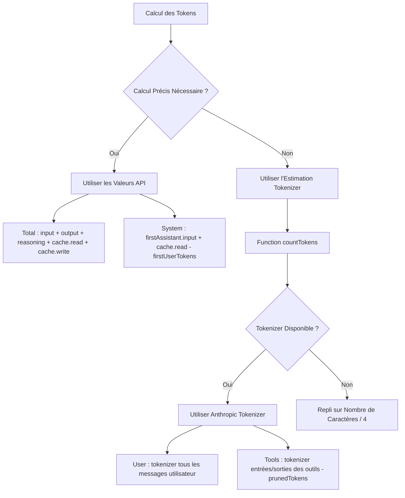

# Principes du Calcul des Tokens

## Ce Que Vous Allez Apprendre

- Comprendre la stratégie de calcul des tokens de DCP (valeurs API vs estimations)
- Lire la distribution des tokens dans la sortie `/dcp context`
- Connaître la marge d'erreur de l'estimation des tokens et les méthodes d'optimisation
- Évaluer avec précision l'efficacité d'économie de DCP

## Votre Situation Actuelle

Vous regardez la sortie de `/dcp context`, un tas de chiffres et de pourcentages, mais vous ne savez pas comment ils sont calculés :

```
Session Context Breakdown:
─────────────────────────────────────────────────────────

System         15.2% │████████████████▒▒▒▒▒▒▒▒▒▒▒▒▒▒▒▒▒▒▒▒▒│  25.1K tokens
User            5.1% │████▒▒▒▒▒▒▒▒▒▒▒▒▒▒▒▒▒▒▒▒▒▒▒▒▒▒▒▒▒▒▒▒▒▒▒▒▒▒▒▒▒│   8.4K tokens
Assistant       35.8% │██████████████████████████████████████▒▒▒▒▒▒│  59.2K tokens
Tools (45)      43.9% │████████████████████████████████████████████████│  72.6K tokens
─────────────────────────────────────────────────────────

Summary:
  Pruned:          12 tools (~15.2K tokens)
  Current context: ~165.3K tokens
  Without DCP:     ~180.5K tokens
```

D'où viennent ces chiffres ? Pourquoi Assistant utilise-t-il un "calcul résiduel" ? Comment prunedTokens est-il calculé ?

## Quand Utiliser Cette Technique

- Lorsque vous souhaitez évaluer précisément l'efficacité d'économie de DCP
- Lorsque vous avez besoin d'analyser la structure de consommation des tokens (quelle partie en utilise le plus)
- Lorsque vous soupçonnez une erreur dans le calcul des tokens et que vous voulez vérifier la précision
- Lorsque vous devez rapporter à votre équipe les résultats d'optimisation de DCP

## Idée Centrale

Le calcul des tokens de DCP adopte une **stratégie hybride** : **privilégier les valeurs précises retournées par l'API, utiliser les estimations si nécessaire**.



**Principes Clés** :
1. **Priorité aux Valeurs API** : Total et System utilisent les valeurs précises retournées par l'API
2. **Complétude par Estimation** : User et Tools utilisent l'estimation par tokenizer (car l'API ne fournit pas ces valeurs)
3. **Calcul Résiduel** : Assistant est calculé par Total - System - User - Tools

---

## Stratégie de Calcul des Tokens

### Valeurs Précises Retournées par l'API

L'API OpenCode renvoie des statistiques de tokens précises pour chaque réponse IA :

| Champ                | Description                                     | Source                  |
| --- | --- | --- |
| `tokens.input`       | Nombre de tokens d'entrée de cette requête     | Valeur précise API     |
| `tokens.output`      | Nombre de tokens de sortie générés par cette requête | Valeur précise API |
| `tokens.reasoning`   | Tokens de raisonnement (ex : chaîne de pensée Claude 3.5) | Valeur précise API (si applicable) |
| `tokens.cache.read`  | Nombre de tokens lus depuis le cache           | Valeur précise API |
| `tokens.cache.write` | Nombre de tokens écrits dans le cache          | Valeur précise API |

**Ces valeurs sont précises** car elles proviennent directement du système de facturation du fournisseur LLM.

### Méthode de Calcul des Estimations

Pour les valeurs non fournies par l'API (comme les messages utilisateur, les appels d'outils), DCP utilise le **Tokenizer Anthropic** pour les estimer.

**Code d'Implémentation** (`lib/strategies/utils.ts:36-43`) :

```typescript
export function countTokens(text: string): number {
    if (!text) return 0
    try {
        // Priorité au Tokenizer Anthropic
        return anthropicCountTokens(text)
    } catch {
        // En cas d'échec, repli sur Nombre de Caractères / 4
        return Math.round(text.length / 4)
    }
}
```

**Pourquoi utiliser Caractères / 4 comme solution de secours** :
- Le ratio moyen tokens/caractères pour le texte anglais est d'environ 4 caractères = 1 token
- C'est une estimation grossière qui peut contenir des erreurs
- Utilisé uniquement lorsque le Tokenizer n'est pas disponible (problèmes réseau, échec de chargement de la bibliothèque)

---

## Logique de Calcul par Catégorie de Tokens

### Total (Nombre Total de Tokens)

**Formule de Calcul** :

```typescript
total = input + output + reasoning + cache.read + cache.write
```

**Code d'Implémentation** (`lib/commands/context.ts:103-108`) :

```typescript
const apiInput = lastAssistant?.tokens?.input || 0
const apiOutput = lastAssistant?.tokens?.output || 0
const apiReasoning = lastAssistant?.tokens?.reasoning || 0
const apiCacheRead = lastAssistant?.tokens?.cache?.read || 0
const apiCacheWrite = lastAssistant?.tokens?.cache?.write || 0
breakdown.total = apiInput + apiOutput + apiReasoning + apiCacheRead + apiCacheWrite
```

**Explications** :
- Utilise les statistiques de tokens de la dernière réponse Assistant
- Inclut toutes les valeurs retournées par l'API
- Correspond au nombre total de tokens affiché dans l'interface OpenCode

### System (Tokens du Prompt Système)

**Formule de Calcul** :

```typescript
system = firstAssistant.input + firstAssistant.cache.read - firstUserTokens
```

**Code d'Implémentation** (`lib/commands/context.ts:161-165`) :

```typescript
if (firstAssistant) {
    const firstInput =
        (firstAssistant.tokens?.input || 0) + (firstAssistant.tokens?.cache?.read || 0)
    breakdown.system = Math.max(0, firstInput - firstUserTokens)
}
```

**Principe** :
1. **L'entrée de la première réponse Assistant** contient : prompt système + premier message utilisateur
2. **Soustraire le nombre de tokens du premier message utilisateur** (estimé par tokenizer) pour obtenir le nombre de tokens du prompt système pur
3. **Ajouter cache.read** (la lecture du cache compte aussi comme token système)

::: info Pourquoi un Calcul Résiduel ?
L'API ne fournit pas directement le nombre de tokens du "prompt système", il ne peut être calculé que par "entrée de la première réponse - premier message utilisateur". C'est la méthode d'estimation standard.
:::

### User (Tokens des Messages Utilisateur)

**Formule de Calcul** :

```typescript
user = tokenizer(all user messages)
```

**Code d'Implémentation** (`lib/commands/context.ts:110-157`) :

```typescript
const userTextParts: string[] = []

for (const msg of messages) {
    if (isMessageCompacted(state, msg)) continue
    if (msg.info.role === "user" && isIgnoredUserMessage(msg)) continue

    const parts = Array.isArray(msg.parts) ? msg.parts : []
    for (const part of parts) {
        if (part.type === "text" && msg.info.role === "user") {
            const textPart = part as TextPart
            const text = textPart.text || ""
            userTextParts.push(text)
        }
    }
}

breakdown.user = countTokens(userTextParts.join("\n"))
```

**Explications** :
- Calcule le nombre de tokens de tous les messages utilisateur à l'aide du tokenizer
- Ignore les messages déjà compressés (`isMessageCompacted`)
- Ignore les messages ignorés (messages internes du système)

### Tools (Tokens des Appels d'Outils)

**Formule de Calcul** :

```typescript
tools = tokenizer(toolInputs + toolOutputs) - prunedTokens
```

**Code d'Implémentation** (`lib/commands/context.ts:110-167`) :

```typescript
const toolInputParts: string[] = []
const toolOutputParts: string[] = []

for (const msg of messages) {
    if (isMessageCompacted(state, msg)) continue

    const parts = Array.isArray(msg.parts) ? msg.parts : []
    for (const part of parts) {
        if (part.type === "tool") {
            const toolPart = part as ToolPart
            breakdown.toolCount++

            // Extraire l'entrée de l'outil
            if (toolPart.state?.input) {
                const inputStr =
                    typeof toolPart.state.input === "string"
                        ? toolPart.state.input
                        : JSON.stringify(toolPart.state.input)
                toolInputParts.push(inputStr)
            }

            // Extraire la sortie de l'outil (uniquement pour les statuts terminés)
            if (toolPart.state?.status === "completed" && toolPart.state?.output) {
                const outputStr =
                    typeof toolPart.state.output === "string"
                        ? toolPart.state.output
                        : JSON.stringify(toolPart.state.output)
                toolOutputParts.push(outputStr)
            }
        }
    }
}

const toolInputTokens = countTokens(toolInputParts.join("\n"))
const toolOutputTokens = countTokens(toolOutputParts.join("\n"))
breakdown.tools = Math.max(0, toolInputTokens + toolOutputTokens - breakdown.prunedTokens)
```

**Explications** :
- Calcule les tokens d'entrée et de sortie de tous les outils
- Soustrait les tokens des outils élagués (`prunedTokens`)
- Ne compte que les sorties d'outils avec `status === "completed"`

### Assistant (Tokens des Messages Assistant)

**Formule de Calcul** :

```typescript
assistant = total - system - user - tools
```

**Code d'Implémentation** (`lib/commands/context.ts:168-171`) :

```typescript
breakdown.assistant = Math.max(
    0,
    breakdown.total - breakdown.system - breakdown.user - breakdown.tools,
)
```

**Principe** :
- Assistant est un **calcul résiduel** (Residual Calculation)
- À partir du Total, soustraire System, User, Tools, le reste est Assistant

::: info Pourquoi Assistant Inclut-il les Tokens de Raisonnement ?
Si le modèle persiste les tokens de raisonnement dans le contexte, ils appartiennent au "contenu généré par l'Assistant" et sont donc classés dans la catégorie Assistant. C'est logique car le raisonnement est l'Assistant qui "pense".
:::

---

## Calcul de l'Économie de Tokens

### Calcul de prunedTokens

**Signature de la Fonction** (`lib/strategies/utils.ts:49-94`) :

```typescript
export const calculateTokensSaved = (
    state: SessionState,
    messages: WithParts[],
    pruneToolIds: string[],
): number
```

**Logique de Calcul** :

1. Parcourir tous les messages
2. Trouver les outils élagués (en faisant correspondre `pruneToolIds` avec `part.callID`)
3. Extraire le contenu d'entrée et de sortie des outils
4. Utiliser `countTokens` pour calculer le nombre de tokens
5. Additionner le nombre de tokens de tous les outils élagués

**Code d'Implémentation** :

```typescript
export const calculateTokensSaved = (
    state: SessionState,
    messages: WithParts[],
    pruneToolIds: string[],
): number => {
    try {
        const contents: string[] = []
        for (const msg of messages) {
            if (isMessageCompacted(state, msg)) {
                continue
            }
            const parts = Array.isArray(msg.parts) ? msg.parts : []
            for (const part of parts) {
                if (part.type !== "tool" || !pruneToolIds.includes(part.callID)) {
                    continue
                }
                // Traiter le cas spécial de l'outil question
                if (part.tool === "question") {
                    const questions = part.state.input?.questions
                    if (questions !== undefined) {
                        const content =
                            typeof questions === "string" ? questions : JSON.stringify(questions)
                        contents.push(content)
                    }
                    continue
                }
                // Extraire la sortie des outils terminés
                if (part.state.status === "completed") {
                    const content =
                        typeof part.state.output === "string"
                            ? part.state.output
                            : JSON.stringify(part.state.output)
                    contents.push(content)
                } else if (part.state.status === "error") {
                    // Extraire le message d'erreur des outils en erreur
                    const content =
                        typeof part.state.error === "string"
                            ? part.state.error
                            : JSON.stringify(part.state.error)
                    contents.push(content)
                }
            }
        }
        const tokenCounts: number[] = estimateTokensBatch(contents)
        return tokenCounts.reduce((sum, count) => sum + count, 0)
    } catch (error: any) {
        return 0
    }
}
```

**Explications** :
- Ne calcule que les tokens des outils élagués
- Pour les outils terminés, calcule leur sortie
- Pour les outils en erreur, calcule leur message d'erreur
- En cas d'échec du calcul (exception), retourne 0

---

## Marge d'Erreur du Calcul des Tokens

### Sources d'Erreur d'Estimation

| Catégorie   | Précision | Source d'Erreur                                  | Impact       |
| --- | --- | --- | --- |
| Total       | 100%      | Valeur précise API, aucune erreur                | Aucun        |
| System      | 95-98%    | Légère erreur dans l'estimation des tokens du premier message utilisateur | Très faible  |
| User        | 90-95%    | Le tokenizer peut différer de la tokenisation réelle du modèle | Moyen        |
| Tools       | 90-95%    | Tokenizer + impact du format de sérialisation des paramètres d'outil | Moyen        |
| Assistant   | 90-95%    | Propagation des erreurs de User et Tools         | Moyen        |

### Contrôle des Erreurs

**DCP utilise plusieurs méthodes pour contrôler les erreurs** :

1. **Utilisation du Tokenizer Anthropic** :
   - Le plus proche de la logique de tokenisation réelle de Claude
   - Pour OpenAI, Gemini, il peut y avoir de légères différences

2. **Ignorer les Messages Internes du Système** :
   - `isIgnoredUserMessage` filtre les messages internes OpenCode
   - Évite de calculer des tokens non pertinents

3. **Math.max(0, ...)** :
   - Assure que le résultat n'est pas négatif
   - Prévient les cas anormaux

::: tip Observation d'Erreur Réelle
Lors des tests, la différence entre l'estimation des tokens de DCP et l'affichage de l'interface OpenCode est généralement dans une marge de ±5%. Pour estimer l'efficacité d'économie des tokens, cette précision est suffisante.
:::

---

## Interprétation de la Sortie `/dcp context`

### Graphique de Distribution des Tokens

```
System         15.2% │████████████████▒▒▒▒▒▒▒▒▒▒▒▒▒▒▒▒▒▒▒▒▒│  25.1K tokens
User            5.1% │████▒▒▒▒▒▒▒▒▒▒▒▒▒▒▒▒▒▒▒▒▒▒▒▒▒▒▒▒▒▒▒▒▒▒▒▒▒▒▒▒▒│   8.4K tokens
Assistant       35.8% │██████████████████████████████████████▒▒▒▒▒▒│  59.2K tokens
Tools (45)      43.9% │████████████████████████████████████████████████│  72.6K tokens
```

**Signification de Chaque Élément** :

| Élément     | Description                                   | Plage Normale de Proportion |
| --- | --- | --- |
| System      | Tokens du prompt système                     | 10-20%       |
| User        | Tokens de tous les messages utilisateur      | 3-8%         |
| Assistant   | Sortie texte de l'assistant + tokens de raisonnement | 30-40% |
| Tools (n)   | Tokens d'appel d'outils (n = nombre d'outils dans le contexte) | 40-50% |

### Interprétation du Summary

```
Summary:
  Pruned:          12 tools (~15.2K tokens)
  Current context: ~165.3K tokens
  Without DCP:     ~180.5K tokens
```

**Signification de Chaque Élément** :

| Élément            | Méthode de Calcul                                    | Description                               |
| --- | --- | --- |
| Pruned             | `state.prune.toolIds.length` nombre d'outils + `prunedTokens` | Nombre d'outils élagués et tokens économisés |
| Current context    | `breakdown.total` (valeur précise API)              | Nombre réel de tokens du contexte actuel    |
| Without DCP        | `total + prunedTokens`                               | Nombre théorique de tokens sans DCP       |

**Calcul du Taux d'Économie** :

```
Taux d'Économie = prunedTokens / Without DCP
                = 15.2K / 180.5K
                ≈ 8.4%
```

::: tip Référence de Taux d'Économie
- Utilisation légère : 5-10% (lectures de fichiers occasionnellement répétées)
- Utilisation modérée : 10-20% (déduplication fréquente, élagage des écrasements)
- Utilisation intensive : 20-30% (nombreux appels d'outils, élagage actif par l'IA)
:::

---

## Pratique : Analyse de la Distribution des Tokens

### Scénario 1 : Trop d'Appels d'Outils

**Problème** : La proportion de `Tools` dépasse 60%, le contexte est très grand.

```
Tools (120)     65.2% │████████████████████████████████████████████████│  120.5K tokens
```

**Causes Possibles** :
- Beaucoup d'outils ont été appelés dans la conversation (ex : lectures de fichiers multiples, recherches)
- Les sorties d'outils sont volumineuses (ex : lecture de fichiers longs)

**Recommandations d'Optimisation** :
- Activer la **stratégie de déduplication** (`strategies.deduplication.enabled: true`)
- Activer la **stratégie d'écrasement** (`strategies.supersedeWrites.enabled: true`)
- Utiliser `/dcp sweep` pour nettoyer manuellement les anciens outils

### Scénario 2 : Proportion Assistant Trop Élevée

**Problème** : La proportion de `Assistant` dépasse 50%, peut-être des tokens de raisonnement.

```
Assistant       52.3% │██████████████████████████████████████████████▒▒▒▒▒▒│  95.2K tokens
```

**Causes Possibles** :
- Utilisation d'un modèle avec raisonnement (ex : Claude 3.5)
- L'assistant a produit beaucoup de texte

**Recommandations d'Optimisation** :
- Les tokens de raisonnement ne peuvent pas être élagués (ils appartiennent au contenu généré par l'Assistant)
- Peuvent être réduits en raccourcissant la sortie de l'assistant (demander à l'IA d'être plus concise)
- Vérifier s'il y a des appels d'outils redondants (élagage par déduplication)

### Scénario 3 : Taux d'Économie Faible

**Problème** : `Pruned` est très petit, taux d'économie < 5%.

```
Summary:
  Pruned:          2 tools (~1.2K tokens)
  Current context: ~165.3K tokens
  Without DCP:     ~166.5K tokens
```

**Causes Possibles** :
- Peu d'appels d'outils répétés dans la conversation
- Les stratégies automatiques ne sont pas activées (déduplication, écrasement, suppression des erreurs)
- L'IA n'a pas appelé activement les outils `discard`/`extract`

**Recommandations d'Optimisation** :
- Activer toutes les stratégies automatiques :
  ```jsonc
  {
    "strategies": {
      "deduplication": { "enabled": true },
      "supersedeWrites": { "enabled": true },
      "purgeErrors": { "enabled": true }
    }
  }
  ```
- Activer la **fonction de rappel** (`tools.settings.nudgeEnabled: true`) pour permettre à l'IA d'élaguer activement

---

## Pièges à Éviter

### ❌ Idée Fausse 1 : Attendre une Précision de 100%

**Problème** : Attendre que le calcul des tokens corresponde exactement à la facturation API.

**Réalité** : Le calcul de DCP est une **estimation**, avec une marge d'erreur de ±5%.

**Solution** :
- Utiliser les statistiques de DCP comme **référence relative** (ex : taux d'économie)
- Ne pas l'utiliser pour un audit de facturation précis
- La facturation API est le seul enregistrement de consommation exact

### ❌ Idée Fausse 2 : Ignorer les Tokens de Raisonnement

**Problème** : Les tokens de raisonnement sont classés dans Assistant, mais l'utilisateur pense qu'ils ont été omis.

**Réalité** : Les tokens de raisonnement font partie de la génération de l'Assistant, ce classement est logique.

**Solution** :
- Les tokens de raisonnement ne peuvent pas être élagués (ils n'appartiennent à aucun outil)
- Si la proportion de tokens de raisonnement est trop élevée (> 30%), vous pouvez essayer :
  - Utiliser un modèle sans raisonnement
  - Simplifier la tâche pour réduire les besoins de raisonnement

### ❌ Idée Fausse 3 : Les Tokens de Cache ne Comptent pas dans le Total

**Problème** : Penser que `cache.read` ne compte pas dans `Total`, ce qui conduit à des malentendus.

**Réalité** : `cache.read` compte dans `Total`, mais ne génère pas de frais réels (car déjà en cache).

**Solution** :
- `Total` est la **taille du contexte**, pas les **frais réels**
- Les tokens en cache comptent toujours dans l'espace contextuel
- Si vous devez optimiser les coûts, consultez les économies cumulées dans `/dcp stats`

### ❌ Idée Fausse 4 : Après l'Élagage de l'Entrée d'Outil, les Tokens ne Diminuent Pas

**Problème** : DCP a élagué l'entrée de l'outil, mais `Current context` dans `/dcp context` n'a pas changé.

**Réalité** : `Current context` affiche les **tokens envoyés au LLM**, le contenu élagué n'est pas inclus.

**Solution** :
- `Current context` = `Without DCP` - `prunedTokens`
- Si `prunedTokens` augmente, cela signifie que l'élagage est effectif
- Si `Current context` n'a pas diminué, c'est peut-être que `prunedTokens` est trop petit, ou que de nouveaux messages ont augmenté les tokens

---

## Résumé de Cette Leçon

Le calcul des tokens de DCP adopte une stratégie hybride :

1. **Valeurs Précises API** : Total, System utilisent les valeurs précises retournées par l'API
2. **Estimation par Tokenizer** : User, Tools utilisent l'estimation par Anthropic Tokenizer
3. **Calcul Résiduel** : Assistant est calculé par Total - System - User - Tools

**Fonctions Clés** :
- `countTokens()` : Calcule le nombre de tokens d'un texte (priorité au Anthropic Tokenizer)
- `calculateTokensSaved()` : Calcule le nombre de tokens économisés par les outils élagués
- `analyzeTokens()` : Analyse la distribution des tokens du contexte

**Marge d'Erreur** :
- Total : 100% précis (valeur API)
- Autres catégories : 90-98% (valeurs estimées)
- Erreur globale : ±5%

**Scénarios d'Utilisation** :
- Utiliser `/dcp context` pour voir la distribution des tokens
- Optimiser la configuration des stratégies selon la distribution
- Utiliser `/dcp stats` pour voir l'efficacité d'économie cumulée

---

## Aperçu de la Prochaine Leçon

> Dans la prochaine leçon, nous apprendrons la **[Référence API](../api-reference/)**.
>
> Vous apprendrez :
> - La documentation des interfaces API du plugin DCP
> - L'explication complète des options de configuration
> - Les interfaces de gestion d'état
> - Les points d'extension pour les développeurs de plugins

---

## Annexe : Références du Code Source

<details>
<summary><strong>Cliquez pour Développer et Voir les Emplacements du Code Source</strong></summary>

> Dernière mise à jour : 2026-01-23

| Fonctionnalité              | Chemin du Fichier                                                                                                        | Lignes     |
| --- | --- | --- |
| Fonction countTokens        | [`lib/strategies/utils.ts`](https://github.com/Opencode-DCP/opencode-dynamic-context-pruning/blob/main/lib/strategies/utils.ts#L36-L43)       | 36-43    |
| calculateTokensSaved        | [`lib/strategies/utils.ts`](https://github.com/Opencode-DCP/opencode-dynamic-context-pruning/blob/main/lib/strategies/utils.ts#L49-L94) | 49-94    |
| Fonction analyzeTokens      | [`lib/commands/context.ts`](https://github.com/Opencode-DCP/opencode-dynamic-context-pruning/blob/main/lib/commands/context.ts#L68-L174)   | 68-174   |
| Commentaires Stratégie Calcul Tokens | [`lib/commands/context.ts`](https://github.com/Opencode-DCP/opencode-dynamic-context-pruning/blob/main/lib/commands/context.ts#L5-L38)    | 5-38     |
| handleContextCommand        | [`lib/commands/context.ts`](https://github.com/Opencode-DCP/opencode-dynamic-context-pruning/blob/main/lib/commands/context.ts#L238-L247) | 238-247  |

**Fonctions Clés** :
- `countTokens(text: string): number` : Calcule le nombre de tokens d'un texte, utilise Anthropic Tokenizer ou repli sur Nombre de Caractères / 4
- `calculateTokensSaved(state, messages, pruneToolIds): number` : Calcule le nombre de tokens économisés par les outils élagués
- `analyzeTokens(state, messages): TokenBreakdown` : Analyse la distribution des tokens du contexte

**Interfaces Clés** :
- `TokenBreakdown` : Résultat de l'analyse de distribution des tokens
  ```typescript
  interface TokenBreakdown {
      system: number
      user: number
      assistant: number
      tools: number
      toolCount: number
      prunedTokens: number
      prunedCount: number
      total: number
  }
  ```

</details>
