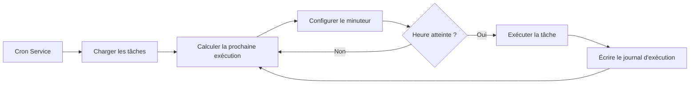

# Tâches planifiées Cron et Webhook

## Ce que vous pourrez faire après cette leçon

Après avoir terminé cette leçon, vous serez capable de :

- Créer des tâches planifiées Cron qui exécutent automatiquement des tâches d'IA à une heure spécifique ou périodicité
- Comprendre les scénarios d'utilisation des trois méthodes de planification (at, every, cron)
- Configurer des Webhooks pour recevoir des déclenchements d'événements externes
- Configurer l'intégration Gmail Pub/Sub pour implémenter des réponses IA déclenchées par e-mail
- Gérer l'historique et les journaux d'exécution des tâches

## Votre problème actuel

Vous pourriez être confronté à ces situations :

- Besoin de vous rappeler de faire quelque chose à une heure fixe
- Vouloir résumer périodiquement l'avancement du travail ou générer des rapports
- Besoin de déclencher automatiquement l'analyse IA lors de la réception de certains e-mails
- Ne pas vouloir envoyer manuellement des messages à l'IA à chaque fois

## Quand utiliser cette technique

**Tâches planifiées Cron** conviennent à ces scénarios :

| Scénario | Exemple | Méthode de planification |
|----------|---------|---------------------------|
| Rappel unique | "Rappelez-moi la réunion demain à 9h du matin" | at |
| Vérification périodique | "Vérifier l'état du système toutes les 30 minutes" | every |
| Exécution planifiée | "Générer un rapport quotidien tous les soirs à 17h" | cron |
| Cycle complexe | "Lundi à vendredi à 9h du matin" | cron |

**Webhooks** conviennent à ces scénarios :

- Recevoir les notifications push de GitHub, GitLab
- Recevoir les notifications de paiement réussi de Stripe
- Recevoir les notifications d'appel entrant de Twilio
- Tout service pouvant envoyer HTTP POST

**Gmail Pub/Sub** convient à ces scénarios :

- Analyser automatiquement lors de la réception d'e-mails importants
- Classification et réponse automatique des e-mails
- Extraction et archivage du contenu des e-mails

---

## Concepts clés

### Flux de travail des tâches Cron



### Comparaison des trois méthodes de planification

| Méthode | Scénario d'utilisation | Exemple | Précision |
|---------|----------------------|---------|-----------|
| `at` | Tâche unique | 2026-01-27 09:00:00 | Niveau milliseconde |
| `every` | Intervalle fixe | Toutes les 30 minutes | Niveau milliseconde |
| `cron` | Cycle complexe | Tous les matins à 9h | Niveau minute |

### Deux objectifs de session

| Objectif de session | Type de Payload | Description |
|---------------------|-----------------|-------------|
| `main` | `systemEvent` | Injecter des événements système dans la session principale |
| `isolated` | `agentTurn` | Exécuter Agent dans une session isolée |

**Contrainte clé** :
- `sessionTarget="main"` doit utiliser `payload.kind="systemEvent"`
- `sessionTarget="isolated"` doit utiliser `payload.kind="agentTurn"`

---

## 🎒 Préparatifs avant de commencer

Avant de commencer, assurez-vous de :

::: warning Vérification préalable
- [ ] Gateway est en cours d'exécution（[Démarrer Gateway](../../start/gateway-startup/)）
- [ ] Le modèle IA est configuré（[Configuration du modèle IA](../models-auth/)）
- [ ] Comprendre la syntaxe de base des expressions Cron（si vous utilisez la planification cron）
:::

---

## Suivez-moi

### Étape 1 : Vérifier l'état du service Cron

**Pourquoi** : Confirmer que le service Cron est activé et en cours d'exécution

```bash
## Vérifier l'état de Cron en utilisant CLI
clawdbot cron status
```

**Vous devriez voir** :

```
✓ Cron enabled
  Store: ~/.clawdbot/cron.json
  Jobs: 0
  Next wake: null
```

S'il affiche `disabled`, vous devez l'activer dans le fichier de configuration :

```json
{
  "cron": {
    "enabled": true,
    "store": "~/.clawdbot/cron.json",
    "maxConcurrentRuns": 5
  }
}
```

---

### Étape 2 : Créer une tâche planifiée unique

**Pourquoi** : Apprendre la méthode de planification `at` la plus basique

Utilisez l'outil cron pour ajouter une tâche qui s'exécutera dans 1 minute :

```json
{
  "action": "add",
  "job": {
    "name": "Rappel de test",
    "enabled": true,
    "schedule": {
      "kind": "at",
      "atMs": 1738000000000
    },
    "sessionTarget": "main",
    "wakeMode": "next-heartbeat",
    "payload": {
      "kind": "systemEvent",
      "text": "Ceci est un rappel de test : vérifier l'avancement du travail"
    }
  }
}
```

**Vous devriez voir** :

```
✓ Job added: job_xxx
  Name: Rappel de test
  Next run: 2026-01-27 10:00:00
```

**Conseil** : `atMs` est l'horodatage Unix (en millisecondes). Vous pouvez le calculer en utilisant JavaScript :

```javascript
Date.now() + 60 * 1000  // 1 minute plus tard
```

---

### Étape 3 : Créer une tâche d'intervalle répétée

**Pourquoi** : Apprendre la méthode de planification `every`, adaptée aux vérifications périodiques

Créer une tâche qui s'exécute toutes les 30 minutes :

```json
{
  "action": "add",
  "job": {
    "name": "Vérifier le système toutes les 30 minutes",
    "enabled": true,
    "schedule": {
      "kind": "every",
      "everyMs": 1800000
    },
    "sessionTarget": "main",
    "wakeMode": "next-heartbeat",
    "payload": {
      "kind": "systemEvent",
      "text": "Vérifier l'état du système : CPU, mémoire, disque"
    }
  }
}
```

**Vous devriez voir** :

```
✓ Job added: job_xxx
  Name: Vérifier le système toutes les 30 minutes
  Interval: 30 minutes
  Next run: 2026-01-27 10:00:00
```

**Description des paramètres** :
- `everyMs` : Temps d'intervalle (en millisecondes)
  - 1 minute = 60,000 ms
  - 5 minutes = 300,000 ms
  - 30 minutes = 1,800,000 ms
  - 1 heure = 3,600,000 ms
- `anchorMs` (optionnel) : Temps de début pour la première exécution

---

### Étape 4 : Créer une tâche avec expression Cron

**Pourquoi** : Apprendre la méthode de planification `cron`, adaptée aux cycles complexes

Créer une tâche qui s'exécute tous les jours à 9h du matin :

```json
{
  "action": "add",
  "job": {
    "name": "Rapport quotidien chaque matin à 9h",
    "enabled": true,
    "schedule": {
      "kind": "cron",
      "expr": "0 9 * * *",
      "tz": "Asia/Shanghai"
    },
    "sessionTarget": "main",
    "wakeMode": "next-heartbeat",
    "payload": {
      "kind": "systemEvent",
      "text": "Générer le rapport quotidien de travail d'aujourd'hui"
    }
  }
}
```

**Vous devriez voir** :

```
✓ Job added: job_xxx
  Name: Rapport quotidien chaque matin à 9h
  Schedule: 0 9 * * * (Asia/Shanghai)
  Next run: 2026-01-27 09:00:00
```

**Format de l'expression Cron** :

```
┌───────────── Minute (0 - 59)
│ ┌─────────── Heure (0 - 23)
│ │ ┌───────── Jour (1 - 31)
│ │ │ ┌─────── Mois (1 - 12)
│ │ │ │ ┌───── Jour de la semaine (0 - 7, 0 et 7 représentent dimanche)
│ │ │ │ │
* * * * *
```

**Expressions courantes** :

| Expression | Description |
|------------|-------------|
| `0 9 * * *` | Tous les jours à 9h du matin |
| `0 9 * * 1-5` | Lundi à vendredi à 9h du matin |
| `0 */6 * * *` | Toutes les 6 heures |
| `0 0 * * 0` | Tous les dimanches à minuit |
| `0 9,17 * * *` | Tous les jours à 9h et 17h |

::: info Configuration du fuseau horaire
Les expressions Cron utilisent par défaut le fuseau horaire UTC. Utilisez le champ `tz` pour spécifier le fuseau horaire (ex. `"Asia/Shanghai"`), assurant que les tâches s'exécutent à l'heure que vous attendez.
:::

---

### Étape 5 : Exécuter la tâche en session isolée

**Pourquoi** : Exécuter des tâches IA dans un environnement isolé pour éviter d'interférer avec la session principale

Créer une tâche qui s'exécute dans une session isolée :

```json
{
  "action": "add",
  "job": {
    "name": "Résumé quotidien",
    "enabled": true,
    "schedule": {
      "kind": "cron",
      "expr": "0 18 * * *",
      "tz": "Asia/Shanghai"
    },
    "sessionTarget": "isolated",
    "wakeMode": "next-heartbeat",
    "payload": {
      "kind": "agentTurn",
      "message": "Résumer le travail d'aujourd'hui : 1. Tâches accomplies 2. Problèmes rencontrés 3. Plan de demain",
      "model": "anthropic/claude-sonnet-4-20250514",
      "thinking": "low"
    }
  }
}
```

**Vous devriez voir** :

```
✓ Job added: job_xxx
  Name: Résumé quotidien
  Session: isolated
  Next run: 2026-01-27 18:00:00
```

**Paramètres du Payload `agentTurn`** :

| Paramètre | Type | Description |
|-----------|------|-------------|
| `message` | string | Prompt envoyé à l'Agent |
| `model` | string | Remplacer le modèle à utiliser (optionnel) |
| `thinking` | string | Niveau de réflexion : "off" \| "minimal" \| "low" \| "medium" \| "high" |
| `timeoutSeconds` | number | Délai d'expiration (secondes) |
| `deliver` | boolean | Si envoyer le résultat au canal |
| `channel` | string | Canal de destination (ex. `"whatsapp"`, `"telegram"`) |
| `to` | string | Identifiant du destinataire |
| `bestEffortDeliver` | boolean | Si essayer d'autres canaux quand impossible d'envoyer au canal spécifié |

**Configuration de session isolée** (optionnel) :

```json
{
  "isolation": {
    "postToMainPrefix": "📊 Résumé quotidien :",
    "postToMainMode": "summary",
    "postToMainMaxChars": 8000
  }
}
```

| Paramètre | Description |
|-----------|-------------|
| `postToMainPrefix` | Préfixe lors du renvoi des résultats à la session principale |
| `postToMainMode` | "summary" (résumé) ou "full" (texte complet) |
| `postToMainMaxChars` | Maximum de caractères quand `postToMainMode="full"` |

---

### Étape 6 : Lister et gérer les tâches

**Pourquoi** : Voir toutes les tâches et gérer leur état

**Lister toutes les tâches** :

```bash
clawdbot cron list
```

**Vous devriez voir** :

```
Jobs: 3
  ✓ job_xxx: Rappel de test (enabled, next: 2026-01-27 10:00:00)
  ✓ job_yyy: Vérifier le système toutes les 30 minutes (enabled, next: 2026-01-27 10:00:00)
  ✓ job_zzz: Rapport quotidien chaque matin à 9h (enabled, next: 2026-01-27 09:00:00)
```

**Inclure les tâches désactivées** :

```bash
clawdbot cron list --include-disabled
```

**Désactiver la tâche** :

```json
{
  "action": "update",
  "jobId": "job_xxx",
  "patch": {
    "enabled": false
  }
}
```

**Activer la tâche** :

```json
{
  "action": "update",
  "jobId": "job_xxx",
  "patch": {
    "enabled": true
  }
}
```

**Supprimer la tâche** :

```json
{
  "action": "remove",
  "jobId": "job_xxx"
}
```

---

### Étape 7 : Exécuter la tâche immédiatement

**Pourquoi** : Tester si la tâche fonctionne normalement sans attendre la planification

```json
{
  "action": "run",
  "jobId": "job_xxx"
}
```

**Vous devriez voir** :

```
✓ Job ran: job_xxx
  Status: ok
  Duration: 1234ms
```

**Voir l'historique d'exécution** :

```json
{
  "action": "runs",
  "jobId": "job_xxx",
  "limit": 10
}
```

**Vous devriez voir** :

```
Runs for job_xxx (10 most recent):
  2026-01-27 10:00:00 - ok - 1234ms
  2026-01-26 10:00:00 - ok - 1189ms
  2026-01-25 10:00:00 - ok - 1245ms
```

---

### Étape 8 : Ajouter du contexte à la tâche de rappel

**Pourquoi** : Permettre à l'IA de comprendre le contexte récent de la conversation et de fournir des rappels plus pertinents

Utiliser le paramètre `contextMessages` pour ajouter l'historique des messages récents :

```json
{
  "action": "add",
  "job": {
    "name": "Rappel de suivi des tâches",
    "enabled": true,
    "schedule": {
      "kind": "cron",
      "expr": "0 10,16 * * *",
      "tz": "Asia/Shanghai"
    },
    "sessionTarget": "main",
    "wakeMode": "next-heartbeat",
    "payload": {
      "kind": "systemEvent",
      "text": "Suivre l'avancement de vos tâches : 1. Vérifier les tâches en attente 2. Mettre à jour l'état du projet"
    },
    "contextMessages": 5
  }
}
```

**Limites des messages de contexte** :
- Maximum de messages : 10
- Maximum de caractères par message : 220
- Limite totale de caractères : 700
- Format : `- User: ...\n- Assistant: ...`

**Contexte ajouté automatiquement** :

```
Suivre l'avancement de vos tâches : 1. Vérifier les tâches en attente 2. Mettre à jour l'état du projet

Recent context:
- User: Je dois finir le rapport aujourd'hui
- Assistant: Compris, quel type de rapport avez-vous besoin ?
- User: C'est un rapport hebdomadaire, inclut le résumé du travail de cette semaine
```

---

## Configuration de Webhook

### Vue d'ensemble de Webhook

Les Webhooks permettent à des services externes de déclencher des événements internes de Clawdbot via des requêtes HTTP POST. Utilisations courantes :

- **GitHub/GitLab** : Notifications push déclenchent les processus CI/CD
- **Stripe** : Notifications de paiement réussi déclenchent le traitement des commandes
- **Twilio** : Notifications d'appel entrant déclenchent les réponses vocales IA
- **Jira** : Notifications de création de ticket déclenchent les réponses automatiques

### Configurer Webhook

**Activer le système de Hooks** :

```json
{
  "hooks": {
    "enabled": true,
    "path": "/hooks",
    "token": "your-secret-token-here"
  }
}
```

**Configurer les règles de mappage** :

```json
{
  "hooks": {
    "enabled": true,
    "token": "your-secret-token-here",
    "mappings": [
      {
        "id": "github-push",
        "match": {
          "path": "/hooks/github"
        },
        "action": "wake",
        "wakeMode": "now",
        "sessionKey": "main",
        "messageTemplate": "Notification push GitHub : {{ repository }} - {{ ref }}"
      }
    ]
  }
}
```

**Paramètres de configuration de mappage** :

| Paramètre | Description |
|-----------|-------------|
| `match.path` | Chemin URL à faire correspondre |
| `match.source` | En-tête de source de requête à faire correspondre |
| `action` | `"wake"` ou `"agent"` |
| `wakeMode` | `"now"` ou `"next-heartbeat"` |
| `sessionKey` | Clé de session de destination (ex. `"main"`) |
| `messageTemplate` | Modèle de message utilisant la syntaxe Mustache |
| `deliver` | Si envoyer au canal |
| `channel` | Canal de destination (ex. `"whatsapp"`) |
| `to` | Identifiant du destinataire |
| `transform` | Module de transformation (traite le corps de la requête) |

---

## Intégration Gmail Pub/Sub

### Vue d'ensemble de Gmail Pub/Sub

Gmail Pub/Sub vous permet de déclencher Clawdbot en temps réel lors de la réception de nouveaux e-mails, implémentant des réponses IA pilotées par e-mail.

### Configurer Gmail Pub/Sub

**Configuration de base** :

```json
{
  "hooks": {
    "enabled": true,
    "token": "your-hook-token",
    "gmail": {
      "account": "your-email@gmail.com",
      "label": "INBOX",
      "topic": "projects/your-project-id/topics/gmail-topic",
      "subscription": "gmail-subscription",
      "pushToken": "your-push-token",
      "hookUrl": "http://127.0.0.1:18789/hooks/gmail",
      "includeBody": true,
      "maxBytes": 20000,
      "renewEveryMinutes": 720
    }
  }
}
```

**Description des paramètres de configuration** :

| Paramètre | Description | Valeur par défaut |
|-----------|-------------|-------------------|
| `account` | Adresse de compte Gmail | - |
| `label` | Étiquette Gmail à surveiller | `INBOX` |
| `topic` | Chemin du sujet Pub/Sub Google Cloud | - |
| `subscription` | Nom de l'abonnement Pub/Sub | `gmail-subscription` |
| `pushToken` | Jeton de push Gmail | - |
| `hookUrl` | URL de réception Webhook | Généré automatiquement |
| `includeBody` | Si inclure le corps de l'e-mail | `true` |
| `maxBytes` | Maximum d'octets de l'e-mail | `20000` |
| `renewEveryMinutes` | Intervalle de renouvellement d'abonnement (minutes) | `720` (12 heures) |

### Intégration Tailscale (optionnel)

**Exposer Webhook en utilisant Tailscale Serve** :

```json
{
  "hooks": {
    "gmail": {
      "tailscale": {
        "mode": "serve",
        "path": "/gmail-pubsub",
        "target": "10000"
      }
    }
  }
}
```

**Utiliser Tailscale Funnel** :

```json
{
  "hooks": {
    "gmail": {
      "tailscale": {
        "mode": "funnel",
        "path": "/gmail-pubsub"
      }
    }
  }
}
```

| Mode | Description |
|------|-------------|
| `off` | Ne pas utiliser Tailscale |
| `serve` | Exposer le service local via Tailscale Serve |
| `funnel` | Accès depuis Internet via Tailscale Funnel |

### Démarrer Gmail Watcher

**Démarrer le service Gmail Watcher** :

```bash
clawdbot hooks gmail-watch
```

**Vous devriez voir** :

```
✓ Gmail watcher started
  Account: your-email@gmail.com
  Label: INBOX
  Watching...
```

**Gmail Watcher fera** :
1. S'abonner aux changements d'étiquette Gmail
2. Recevoir les nouveaux push d'e-mails
3. Envoyer les informations de l'e-mail au Webhook
4. Déclencher les événements internes de Clawdbot

---

## Point de contrôle ✅

**Confirmez que vous avez maîtrisé** :

- [ ] Vous pouvez créer trois types de tâches Cron (at, every, cron)
- [ ] Vous comprenez la différence entre les objectifs de session `main` et `isolated`
- [ ] Vous pouvez lister, activer, désactiver et supprimer des tâches
- [ ] Vous pouvez voir l'historique d'exécution des tâches
- [ ] Vous comprenez la configuration et le principe de fonctionnement de Webhook
- [ ] Vous pouvez configurer l'intégration Gmail Pub/Sub

---

## Dépannage

### La tâche ne s'exécute pas

**Problème** : La tâche a été ajoutée mais ne s'exécute jamais

**Causes possibles** :

| Cause | Solution |
|-------|----------|
| Service Cron non activé | Vérifier la configuration `cron.enabled` |
| Heure non atteinte | Vérifier la prochaine exécution avec `clawdbot cron list` |
| Fuseau horaire incorrect | Vérifier que le champ `tz` est correct |
| Tâche désactivée | Vérifier l'état de la tâche avec `--include-disabled` |

### Erreur dans l'expression Cron

**Problème** : La tâche s'exécute au mauvais moment

**Erreurs courantes** :

| Erreur | Correct | Description |
|--------|---------|-------------|
| `9 * * *` | `0 9 * * *` | Champ minute manquant |
| `0 9 * * * *` | `0 9 * * *` | Un champ en trop |
| `0 9 1-5 * *` | `0 9 * * 1-5` | Position du champ jour de la semaine incorrecte |

**Outil de validation** : Utilisez [crontab.guru](https://crontab.guru/) pour valider les expressions Cron.

### Gmail Pub/Sub ne fonctionne pas

**Problème** : L'e-mail est reçu mais ne déclenche pas

**Liste de vérification** :

- [ ] Le service Gmail Watcher est-il en cours d'exécution ?
- [ ] L'`hookUrl` est-elle accessible ? (tester avec curl)
- [ ] Le `token` est-il configuré correctement ?
- [ ] Le sujet et l'abonnement Pub/Sub sont-ils correctement créés ?
- [ ] La connexion réseau est-elle normale ? (lors de l'utilisation de Tailscale)

### Session isolée sans réponse

**Problème** : Les tâches avec `sessionTarget="isolated"` n'ont pas de sortie

**Causes possibles** :

- Champ `model` manquant, utilisant le modèle par défaut mais non configuré
- Le prompt `message` n'est pas assez clair
- `timeoutSeconds` trop court, tâche expire
- `deliver=false` mais `postToMainMode` non configuré

**Solution** :

1. Augmenter le niveau de détail des journaux
2. Vérifier les journaux de Gateway
3. Utiliser `bestEffortDeliver=true` pour assurer que le résultat est au moins renvoyé à la session principale

---

## Résumé de la leçon

Cron et Webhook sont des outils d'automatisation puissants de Clawdbot :

**Système Cron** :
- Trois méthodes de planification : `at` (unique), `every` (intervalle), `cron` (cycle complexe)
- Deux objectifs de session : `main` (injecter événement système), `isolated` (exécuter Agent)
- Prend en charge l'historique des tâches et les journaux d'exécution
- Peut ajouter des messages de contexte pour fournir des rappels plus pertinents

**Système Webhook** :
- Recevoir des requêtes HTTP POST externes
- Prend en charge les règles de mappage et les modèles de message
- Peut configurer Tailscale pour l'exposition publique sur Internet

**Gmail Pub/Sub** :
- Surveiller les nouveaux e-mails en temps réel
- Prend en charge le filtrage par étiquette
- Intégration avec Tailscale Serve/Funnel

En configurant correctement ces fonctionnalités, vous pouvez construire un assistant IA entièrement automatisé qui répond au bon moment.

---

## Aperçu de la prochaine leçon

> Dans la prochaine leçon, nous apprendrons **[Système de mémoire et recherche vectorielle](../memory-system/)**.
>
> Vous pourrez :
> - Structure de fichiers et mécanisme d'indexation du système de mémoire
> - Configurer des fournisseurs de recherche vectorielle (OpenAI, Gemini, local)
> - Utiliser la recherche hybride (BM25 + vectorielle) pour améliorer la précision de récupération
> - Gérer les index de mémoire et la recherche via CLI

---

## Annexe : Référence du code source

<details>
<summary><strong>Cliquez pour voir les emplacements du code source</strong></summary>

> Date de mise à jour : 2026-01-27

| Fonctionnalité | Chemin du fichier | Numéros de ligne |
|---------------|------------------|------------------|
| Définition des types de configuration Cron | [`src/config/types.cron.ts`](https://github.com/clawdbot/clawdbot/blob/main/src/config/types.cron.ts#L1-L6) | 1-6 |
| Définition des types centraux Cron | [`src/cron/types.ts`](https://github.com/clawdbot/clawdbot/blob/main/src/cron/types.ts#L1-L95) | 1-95 |
| Cron Service | [`src/cron/service.ts`](https://github.com/clawdbot/clawdbot/blob/main/src/cron/service.ts#L1-L49) | 1-49 |
| Implémentation des opérations Cron | [`src/cron/service/ops.ts`](https://github.com/clawdbot/clawdbot/blob/main/src/cron/service/ops.ts#L1-L141) | 1-141 |
| Implémentation de l'outil Cron | [`src/agents/tools/cron-tool.ts`](https://github.com/clawdbot/clawdbot/blob/main/src/agents/tools/cron-tool.ts#L1-L291) | 1-291 |
| Méthodes Cron de Gateway | [`src/gateway/server-methods/cron.ts`](https://github.com/clawdbot/clawdbot/blob/main/src/gateway/server-methods/cron.ts#L1-L205) | 1-205 |
| Définition des types de configuration Hooks | [`src/config/types.hooks.ts`](https://github.com/clawdbot/clawdbot/blob/main/src/config/types.hooks.ts#L1-L125) | 1-125 |
| Outil Gmail de Hooks | [`src/hooks/gmail.ts`](https://github.com/clawdbot/clawdbot/blob/main/src/hooks/gmail.ts#L1-L267) | 1-267 |
| Événements internes de Hooks | [`src/hooks/hooks.ts`](https://github.com/clawdbot/clawdbot/blob/main/src/hooks/hooks.ts#L1-L15) | 1-15 |
| Commandes CLI de Hooks | [`src/cli/hooks-cli.ts`](https://github.com/clawdbot/clawdbot/blob/main/src/cli/hooks-cli.ts#L1-L839) | 1-839 |

**Constantes clés** :
- `DEFAULT_GMAIL_LABEL = "INBOX"` : Étiquette par défaut de Gmail
- `DEFAULT_GMAIL_TOPIC = "gog-gmail-watch"` : Nom par défaut du sujet Gmail
- `DEFAULT_GMAIL_SUBSCRIPTION = "gog-gmail-watch-push"` : Nom par défaut de l'abonnement Gmail
- `DEFAULT_GMAIL_MAX_BYTES = 20000` : Maximum par défaut d'octets de l'e-mail
- `DEFAULT_GMAIL_RENEW_MINUTES = 720` : Intervalle par défaut de renouvellement (12 heures)

**Fonctions clés** :
- `CronService.start()` : Démarrer le service Cron
- `CronService.add()` : Ajouter une tâche planifiée
- `CronService.update()` : Mettre à jour la tâche
- `CronService.remove()` : Supprimer la tâche
- `CronService.run()` : Exécuter la tâche immédiatement
- `createCronTool()` : Créer l'outil Cron
- `resolveGmailHookRuntimeConfig()` : Analyser la configuration de Gmail Hook
- `buildGogWatchStartArgs()` : Construire les arguments de démarrage de Gmail Watch
- `buildGogWatchServeArgs()` : Construire les arguments de service de Gmail Watch

</details>
