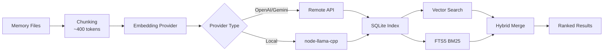

# Guide Complet du Système de Mémoire et de Recherche Vectorielle

## Ce que vous pourrez faire

Après cette leçon, vous serez capable de :

- Comprendre la structure de fichiers et le mécanisme d'indexation du système de mémoire de Clawdbot
- Configurer les fournisseurs de recherche vectorielle (OpenAI, Gemini, local)
- Utiliser la recherche hybride (BM25 + vectorielle) pour améliorer la précision de récupération
- Gérer les index de mémoire et la recherche via CLI
- Ajuster le cache d'Embedding et les performances d'indexation

## Votre dilemme actuel

Vous pourriez rencontrer ces situations :

- L'IA "oublie" le contenu des conversations précédentes dans les nouvelles sessions
- Vous souhaitez que l'IA se souvienne de connaissances persistantes et de préférences
- Vous ne savez pas comment faire en sorte que l'IA "apprenne" et se souvienne d'informations importantes
- Vous ne trouvez pas le contexte pertinent lors de la recherche de conversations historiques

## Quand utiliser cette technique

Le **système de mémoire** convient à ces scénarios :

| Scénario | Exemple | Emplacement de stockage |
|------|--------|----------|
| Connaissances persistantes | "Je suis végétarien, souviens-toi de ça" | MEMORY.md |
| Notes quotidiennes | "Progression du travail et tâches à faire aujourd'hui" | memory/YYYY-MM-DD.md |
| Récupération de sessions | "Quel était l'endpoint API discuté la dernière fois ?" | Index vectoriel |
| Informations de configuration | "Gateway fonctionne sur le port 18789" | MEMORY.md |

---

## Concepts Fondamentaux

### Structure à deux couches du système de mémoire

Clawdbot utilise **deux couches de données** pour gérer la mémoire à long terme :

| Couche | Chemin du fichier | Objectif | Moment du chargement |
|------|----------|------|----------|
| **Mémoire à long terme** | `MEMORY.md` | Connaissances sélectionnées, préférences, faits importants | Chargé au démarrage de la session principale |
| **Journal quotidien** | `memory/YYYY-MM-DD.md` | Notes quotidiennes, contexte d'exécution | Chargé pour aujourd'hui + hier |

::: info Pourquoi deux couches ?
`MEMORY.md` est similaire à une "base de connaissances" et n'est chargé que dans la session principale, assurant que les informations sensibles ne fuient pas vers les conversations de groupe. `memory/*.md` est un "journal" qui enregistre le flux quotidien pour faciliter la rétrospection.
:::

### Flux de travail de l'indexation vectorielle



### Recherche hybride : BM25 + Vectorielle

La recherche vectorielle excelle dans la "correspondance sémantique", mais est faible dans la "correspondance exacte" :

| Type de requête | Recherche vectorielle | BM25 texte intégral | Recherche hybride |
|----------|----------|-----------|----------|
| "Adresse IP du serveur" | ❌ Faible | ✅ Forte | ✅ Optimale |
| "Comment déployer Gateway" | ✅ Forte | ⚠️ Moyenne | ✅ Optimale |
| "Endpoint API a828e60" | ❌ Faible | ✅ Forte | ✅ Optimale |

**Formule de fusion** :
```javascript
finalScore = vectorWeight × vectorScore + textWeight × textScore
```

- `vectorWeight + textWeight` est automatiquement normalisé à 1.0
- Par défaut : 70% vectorielle + 30% mots-clés
- Ajustable via `agents.defaults.memorySearch.query.hybrid.*`

---

## 🎒 Préparatifs Avant de Commencer

Avant de commencer, assurez-vous de :

::: warning Vérification préalable
- [ ] Gateway est en cours d'exécution ( [Démarrer Gateway](../../start/gateway-startup/) )
- [ ] Le modèle d'IA est configuré ( [Configuration du modèle d'IA](../models-auth/) )
- [ ] Vous savez éditer des fichiers Markdown de base
:::

::: tip Configuration recommandée
- Utilisez de préférence les embeddings OpenAI ou Gemini (rapides et de haute qualité)
- Les embeddings locaux nécessitent `pnpm rebuild node-llama-cpp`
- La première indexation peut prendre quelques minutes, mais les mises à jour incrémentielles sont rapides ensuite
:::

---

## Suivez les Étapes

### Étape 1 : Créer les fichiers de mémoire

**Pourquoi** : L'IA n'indexe que les fichiers existants, crée d'abord le contenu de mémoire

Créez des fichiers dans le répertoire de travail de l'agent (par défaut `~/clawd`) :

```bash
# Créer un fichier de mémoire à long terme
cat > ~/clawd/MEMORY.md << 'EOF'
# Préférences personnelles

- Préférences alimentaires : végétarien, pas de nourriture épicée
- Heures de travail : 9h à 18h
- Commandes fréquentes : `clawdbot gateway status`

# Configuration importante

- Port Gateway : 18789
- Base de données : PostgreSQL 15
EOF

# Créer le journal d'aujourd'hui
cat > ~/clawd/memory/$(date +%Y-%m-%d).md << 'EOF'
# Progression du travail d'aujourd'hui

- Configuration de Gateway terminée
- Apprentissage du système de mémoire
- À faire : lire la documentation d'authentification des modèles
EOF
```

**Ce que vous devriez voir** :

```bash
# Voir la structure des fichiers
tree ~/clawd/
# ou
ls -la ~/clawd/
ls -la ~/clawd/memory/

# Exemple de sortie
~/clawd/
├── MEMORY.md
└── memory/
    └── 2026-01-27.md
```

### Étape 2 : Vérifier l'état du système de mémoire

**Pourquoi** : Confirmer le fournisseur d'Embedding et l'état de l'index

```bash
# Vérification de base de l'état
clawdbot memory status

# Vérification approfondie (détecter la disponibilité du fournisseur)
clawdbot memory status --deep

# Vérification approfondie + réindexation forcée
clawdbot memory status --deep --index
```

**Ce que vous devriez voir** :

```bash
✓ Memory Search enabled
  Store: ~/.clawdbot/memory/main.sqlite
  Provider: openai
  Model: text-embedding-3-small
  Fallback: openai
  Hybrid: enabled (vectorWeight: 0.7, textWeight: 0.3)
  Cache: enabled (maxEntries: 50000)
  Sources: memory
  Indexed: 2 files, 5 chunks
```

::: tip Vérification approfondie
- `--deep` détecte si les embeddings OpenAI/Gemini/Local sont disponibles
- `--index` réindexe automatiquement lorsqu'il détecte un index "sale"
- Lors de la première exécution, l'indexation peut prendre quelques minutes
:::

### Étape 3 : Déclencher manuellement l'indexation

**Pourquoi** : S'assurer que les fichiers de mémoire nouvellement créés sont indexés

```bash
# Déclencher manuellement l'indexation
clawdbot memory index

# Avec journal détaillé
clawdbot memory index --verbose

# Seulement pour un agent spécifique
clawdbot memory index --agent main
```

**Ce que vous devriez voir** :

```bash
Indexing memory for agent: main
  Provider: openai (text-embedding-3-small)
  Sources: memory
  - MEMORY.md (2 chunks)
  - memory/2026-01-27.md (3 chunks)
✓ Indexed 2 files, 5 chunks
```

### Étape 4 : Tester la recherche sémantique

**Pourquoi** : Vérifier que la recherche vectorielle et la recherche hybride fonctionnent correctement

```bash
# Recherche de base
clawdbot memory search "végétarien"

# Recherche de correspondance exacte (tester BM25)
clawdbot memory search "port Gateway"

# Recherche sémantique floue (tester vectorielle)
clawdbot memory search "ce que j'aime manger"

# Voir les résultats détaillés
clawdbot memory search "Gateway" --verbose
```

**Ce que vous devriez voir** :

```bash
Searching memory for: "végétarien"

Results (2):

[1] MEMORY.md:3-5 (score: 0.842)
  - Préférences alimentaires : végétarien, pas de nourriture épicée

[2] memory/2026-01-27.md:1-3 (score: 0.615)
  - Configuration de Gateway terminée
  - Apprentissage du système de mémoire
```

### Étape 5 : Configurer le fournisseur d'Embedding

**Pourquoi** : Choisir le fournisseur le plus adapté selon les besoins (distant vs local)

#### Option A : OpenAI embeddings (recommandé)

Éditez le fichier de configuration `~/.clawdbot/clawdbot.json` :

```json
{
  "agents": {
    "defaults": {
      "memorySearch": {
        "enabled": true,
        "provider": "openai",
        "model": "text-embedding-3-small",
        "fallback": "openai",
        "remote": {
          "apiKey": "YOUR_OPENAI_API_KEY",
          "batch": {
            "enabled": true,
            "concurrency": 2
          }
        }
      }
    }
  }
}
```

**Avantages** :
- Rapide et de haute qualité
- Supporte l'indexation par lots (économique)
- Adapté pour le remplissage massif

#### Option B : Gemini embeddings

```json
{
  "agents": {
    "defaults": {
      "memorySearch": {
        "provider": "gemini",
        "model": "gemini-embedding-001",
        "remote": {
          "apiKey": "YOUR_GEMINI_API_KEY"
        },
        "fallback": "openai"
      }
    }
  }
}
```

#### Option C : Embeddings locaux (priorité de confidentialité)

```json
{
  "agents": {
    "defaults": {
      "memorySearch": {
        "provider": "local",
        "local": {
          "modelPath": "hf:ggml-org/embeddinggemma-300M-GGUF/embeddinggemma-300M-Q8_0.gguf",
          "modelCacheDir": "~/.cache/embeddings"
        },
        "fallback": "none"
      }
    }
  }
}
```

**Précautions** :

```bash
# Première utilisation des embeddings locaux nécessite une construction
pnpm approve-builds
# Sélectionner node-llama-cpp
pnpm rebuild node-llama-cpp
```

**Ce que vous devriez voir** :

```bash
✓ node-llama-cpp installed
✓ Local embedding model ready
```

::: warning Embeddings locaux
- La première fois, le modèle sera téléchargé automatiquement (~600MB)
- Nécessite de compiler node-llama-cpp (dépend de l'environnement système)
- Plus lent que le distant, mais entièrement hors ligne et priorité de confidentialité
:::

### Étape 6 : Configurer les poids de recherche hybride

**Pourquoi** : Ajuster le ratio de poids sémantiques et mots-clés selon le cas d'utilisation

Éditez la configuration :

```json
{
  "agents": {
    "defaults": {
      "memorySearch": {
        "query": {
          "hybrid": {
            "enabled": true,
            "vectorWeight": 0.7,
            "textWeight": 0.3,
            "candidateMultiplier": 4
          }
        }
      }
    }
  }
}
```

**Description des paramètres** :

| Paramètre | Valeur par défaut | Description | Suggestion d'ajustement |
|------|---------|------|----------|
| `vectorWeight` | 0.7 | Poids de recherche sémantique | Augmenter à 0.8 pour les requêtes en "langage naturel" |
| `textWeight` | 0.3 | Poids de recherche de mots-clés | Augmenter à 0.5 pour les requêtes de "code/ID" |
| `candidateMultiplier` | 4 | Multiplicateur de candidats | Augmenter à 6 pour améliorer le rappel |

**Comparaison des effets** :

```bash
# Tester une requête sémantique
clawdbot memory search "méthode pour déployer Gateway"
# vectorWeight: 0.7 → trouve des résultats sémantiquement pertinents
# textWeight: 0.5 → trouve les mots-clés "déployer", "Gateway"

# Tester une requête exacte
clawdbot memory search "endpoint API a828e60"
# vectorWeight: 0.3 → ignore la sémantique, priorité à la correspondance
# textWeight: 0.7 → correspondance exacte de "a828e60"
```

### Étape 7 : Activer l'accélération SQLite-vec

**Pourquoi** : Faire un pushdown des requêtes vectorielles vers SQLite, évitant de charger tous les embeddings

Éditez la configuration :

```json
{
  "agents": {
    "defaults": {
      "memorySearch": {
        "store": {
          "vector": {
            "enabled": true,
            "extensionPath": "/path/to/sqlite-vec"
          }
        }
      }
    }
  }
}
```

**Vérifier si sqlite-vec est disponible** :

```bash
# Voir l'état de l'index
clawdbot memory status --deep

# Si disponible, vous verrez
✓ SQLite-vec extension loaded
  Vector table: chunks_vec
```

::: info SQLite-vec
- Par défaut, essaie de charger automatiquement
- Si le chargement échoue, revient automatiquement au calcul JS (n'affecte pas la fonctionnalité)
- Le chemin personnalisé n'est utilisé que pour les constructions spéciales ou les installations non standard
:::

---

## Point de Vérification ✅

Après avoir terminé les étapes ci-dessus, vérifiez ce qui suit :

| Élément à vérifier | Méthode de vérification | Résultat attendu |
|---------|----------|----------|
| Fichiers de mémoire existent | `ls ~/clawd/` | MEMORY.md et le répertoire memory/ existent |
| Index créé | `clawdbot memory status` | Affiche Indexed > 0 chunks |
| Recherche fonctionne | `clawdbot memory search "..."` | Renvoie des résultats pertinents |
| Provider fonctionne | `clawdbot memory status --deep` | Affiche le type de Provider |

---

## Pièges Courants

### Piège 1 : Échec du fournisseur d'Embedding

**Symptôme** :

```bash
✗ Memory Search disabled
  Error: No API key found for provider
```

**Solution** :

```bash
# Vérifier la configuration
cat ~/.clawdbot/clawdbot.json | grep -A 5 "memorySearch"

# Confirmer que apiKey existe
# Ou définir des variables d'environnement
export OPENAI_API_KEY="sk-..."
export GEMINI_API_KEY="..."
```

### Piège 2 : Impossible de charger les embeddings locaux

**Symptôme** :

```bash
✗ Local embedding provider failed
  Error: Cannot find module 'node-llama-cpp'
```

**Solution** :

```bash
# Approuver la construction
pnpm approve-builds

# Reconstruire
pnpm rebuild node-llama-cpp
```

### Piège 3 : L'index ne se met pas à jour

**Symptôme** :

```bash
# MEMORY.md a été modifié
# Mais les résultats de recherche sont toujours anciens
```

**Solution** :

```bash
# Méthode 1 : Déclencher manuellement l'indexation
clawdbot memory index

# Méthode 2 : Redémarrer Gateway (déclenche l'indexation onSessionStart)
clawdbot gateway restart

# Méthode 3 : Vérifier la surveillance de fichiers
clawdbot memory status --verbose
# Vérifier "Watch: true"
```

### Piège 4 : Résultats de recherche non pertinents

**Symptôme** : Rechercher "Gateway" mais renvoie "progression du travail"

**Causes possibles** :

1. **Poids hybrides inappropriés** :
   - Requête sémantique ("comment déployer") → augmenter `vectorWeight`
   - Requête de mots-clés ("endpoint API") → augmenter `textWeight`

2. **Index pas complètement à jour** :
   ```bash
   # Réindexation forcée
   rm ~/.clawdbot/memory/main.sqlite
   clawdbot memory index
   ```

3. **Problème de granularité de chunk** :
   - Par défaut 400 tokens, peut couper le contexte
   - Ajuster `agents.defaults.memorySearch.chunking.tokens`

---

## Résumé de la Leçon

Dans cette leçon, nous avons appris :

1. **Architecture du système de mémoire**
   - Structure de données à deux couches (MEMORY.md + memory/*.md)
   - Index vectoriel + recherche texte intégral FTS5
   - Récupération hybride (BM25 + vectorielle)

2. **Configuration du fournisseur d'Embedding**
   - Trois options : OpenAI/Gemini/local
   - Accélération de l'indexation par lots
   - Mécanisme de fallback

3. **Utilisation des outils CLI**
   - `clawdbot memory status` vérifier l'état
   - `clawdbot memory index` déclencher l'indexation
   - `clawdbot memory search` tester la recherche

4. **Optimisation des performances**
   - Accélération vectorielle SQLite-vec
   - Cache d'Embedding
   - Ajustement des poids hybrides

---

## Prochaine Leçon

> Dans la prochaine leçon, nous apprendrons sur **[Sécurité et Isolement de Sandbox](../security-sandbox/)**.
>
> Vous apprendrez :
> - Contrôle des permissions des outils et allowlist
> - Isolement de sessions Sandbox
> - Mécanisme d'approbation Exec
> - Déploiement Dockerisé
> - Authentification Tailscale

---

## Annexe : Référence du Code Source

<details>
<summary><strong>Cliquez pour développer et voir l'emplacement du code source</strong></summary>

> Mis à jour : 2026-01-27

| Fonctionnalité | Chemin du fichier | Numéro de ligne |
|------|----------|------|
| Gestionnaire de mémoire | [`src/memory/manager.ts`](https://github.com/clawdbot/clawdbot/blob/main/src/memory/manager.ts) | 1-200 |
| Recherche hybride | [`src/memory/hybrid.ts`](https://github.com/clawdbot/clawdbot/blob/main/src/memory/hybrid.ts) | 1-112 |
| Fournisseur d'Embedding | [`src/memory/embeddings.ts`](https://github.com/clawdbot/clawdbot/blob/main/src/memory/embeddings.ts) | 1-80 |
| OpenAI embeddings | [`src/memory/embeddings-openai.ts`](https://github.com/clawdbot/clawdbot/blob/main/src/memory/embeddings-openai.ts) | Tout le fichier |
| Gemini embeddings | [`src/memory/embeddings-gemini.ts`](https://github.com/clawdbot/clawdbot/blob/main/src/memory/embeddings-gemini.ts) | Tout le fichier |
| Embeddings locaux | [`src/memory/node-llama.ts`](https://github.com/clawdbot/clawdbot/blob/main/src/memory/node-llama.ts) | Tout le fichier |
| SQLite-vec | [`src/memory/sqlite-vec.ts`](https://github.com/clawdbot/clawdbot/blob/main/src/memory/sqlite-vec.ts) | Tout le fichier |
| Indexation par lots (OpenAI) | [`src/memory/batch-openai.ts`](https://github.com/clawdbot/clawdbot/blob/main/src/memory/batch-openai.ts) | Tout le fichier |
| Indexation par lots (Gemini) | [`src/memory/batch-gemini.ts`](https://github.com/clawdbot/clawdbot/blob/main/src/memory/batch-gemini.ts) | Tout le fichier |
| Gestionnaire de recherche | [`src/memory/manager-search.ts`](https://github.com/clawdbot/clawdbot/blob/main/src/memory/manager-search.ts) | Tout le fichier |
| Memory Schema | [`src/memory/memory-schema.ts`](https://github.com/clawdbot/clawdbot/blob/main/src/memory/memory-schema.ts) | Tout le fichier |

**Configurations clés** :
- `agents.defaults.memorySearch.enabled` : activer/désactiver la recherche de mémoire
- `agents.defaults.memorySearch.provider` : fournisseur d'Embedding ("openai", "gemini", "local")
- `agents.defaults.memorySearch.query.hybrid.vectorWeight` : poids de recherche vectorielle (par défaut 0.7)
- `agents.defaults.memorySearch.query.hybrid.textWeight` : poids de recherche BM25 (par défaut 0.3)
- `agents.defaults.memorySearch.cache.enabled` : cache d'Embedding (par défaut true)
- `agents.defaults.memorySearch.store.vector.enabled` : accélération SQLite-vec (par défaut true)

**Fonctions clés** :
- `mergeHybridResults()` : fusionner résultats vectoriels + BM25 (`src/memory/hybrid.ts:39-111`)
- `bm25RankToScore()` : convertir classement BM25 en score (`src/memory/hybrid.ts:34-37`)
- `createEmbeddingProvider()` : créer fournisseur d'Embedding (`src/memory/embeddings.ts`)
- `getMemorySearchManager()` : obtenir gestionnaire de recherche de mémoire (`src/memory/search-manager.ts`)

**Commandes CLI** :
- `clawdbot memory status` : vérifier l'état (`src/cli/commands/memory-cli.ts`)
- `clawdbot memory index` : déclencher l'indexation (`src/cli/commands/memory-cli.ts`)
- `clawdbot memory search` : rechercher mémoire (`src/cli/commands/memory-cli.ts`)

</details>
