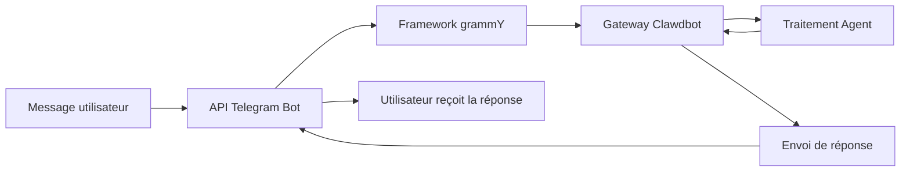

# Configuration et utilisation du canal Telegram

## Ce que vous saurez faire à la fin

- 🤖 Créer un Bot Telegram et obtenir son Bot Token
- ⚙️ Configurer le canal Telegram pour se connecter à Clawdbot
- 🔒 Contrôler les autorisations d'accès pour les DM et les groupes (mécanisme de jumelage et liste blanche)
- 📡 Configurer les règles de mention dans les groupes et les stratégies de réponse
- 🔌 Configurer le mode Webhook (optionnel)
- 🎯 Utiliser les fonctionnalités de l'API Telegram Bot (boutons en ligne, sujets, réponses)

## Votre problème actuel

Vous utilisez déjà Clawdbot sur Telegram, mais vous rencontrez ces problèmes :

- ❌ Vous ne savez pas comment configurer correctement le Bot Token
- ❌ Après qu'un inconnu a envoyé un message au Bot, celui-ci ne répond pas
- ❌ Dans les groupes, le Bot ne répond pas aux messages sans mention
- ❌ Vous souhaitez contrôler précisément qui peut accéder au Bot, mais vous ne savez pas comment le configurer
- ❌ Vous avez entendu parler de la différence entre Webhook et Long-polling, mais vous ne savez pas lequel choisir

Ce tutoriel vous aidera à résoudre ces problèmes étape par étape.

## Quand utiliser cette méthode

Scénarios appropriés pour l'utilisation du canal Telegram :

- ✅ Vous utilisez déjà Telegram et souhaitez interagir avec votre assistant IA sur cette plateforme
- ✅ Vous avez besoin que le Bot réponde à des utilisateurs ou commandes spécifiques dans les groupes
- ✅ Vous souhaitez utiliser les fonctionnalités spéciales de l'API Telegram Bot (boutons en ligne, sujets Forum)
- ✅ L'environnement réseau de votre serveur convient à l'utilisation de Long-polling ou Webhook

**Si vous utilisez principalement WhatsApp ou d'autres canaux** : vous pouvez sauter cette leçon et vous concentrer sur les canaux que vous utilisez.

## 🎒 Prérequis

Avant de commencer, assurez-vous d'avoir :

- [ ] Complété le tutoriel [Démarrage rapide](../../start/getting-started/), Clawdbot est installé et peut démarrer
- [ ] Un compte Telegram (pas nécessairement un compte Premium)
- [] Une compréhension de base des concepts des Bots Telegram (Bot, Token, mode de confidentialité)

::: info Emplacement du fichier de configuration
Par défaut, le fichier de configuration de Clawdbot se trouve à :
- **Linux/macOS** : `~/.clawdbot/clawdbot.json`
- **Windows** : `%USERPROFILE%\.clawdbot\clawdbot.json`
:::

## Concepts fondamentaux

### API Telegram Bot vs autres canaux

Contrairement aux autres plateformes de messagerie instantanée, Telegram utilise une architecture **API Bot** :

| Fonctionnalité | Telegram | WhatsApp | Slack |
|--- | --- | --- | ---|
| Mode de connexion | API Bot (HTTP) | Web Client | API Bot + WebSocket |
| Mode de messagerie | Push (Bot envoie activement) | Pull (écoute du Web Client) | Pull (écoute du WebSocket) |
| Mode de confidentialité | **Supporté** (optionnel pour Bot) | N/A | N/A |
| Support des groupes | SuperGroup + Forum | Groups | Channels + Workspace |
| Fonctionnalités spéciales | Sujets Forum, boutons en ligne | - | - |

### Méthode d'intégration de Clawdbot

Clawdbot utilise le framework d'API Bot [grammY](https://grammy.dev/) pour s'intégrer à Telegram :



**Points clés** :
- **Long-polling** : Mode par défaut, Clawdbot extrait activement les mises à jour de Telegram
- **Webhook** : Mode optionnel, Telegram pousse les mises à jour vers votre serveur
- **Jumelage DM** : Activé par défaut, les inconnus doivent d'abord être approuvés pour envoyer des messages
- **Mention de groupe** : Activé par défaut, le Bot ne répond qu'à `@botname` ou aux modèles de mention configurés

### Mécanisme de contrôle d'accès

Clawdbot offre trois niveaux de contrôle d'accès :

1. **Niveau DM** (`dmPolicy`)
   - `pairing` : Les utilisateurs inconnus reçoivent un code de jumelage et doivent être approuvés
   - `allowlist` : Seuls les utilisateurs de la liste blanche sont autorisés
   - `open` : Autorise tous les DM (nécessite `allowFrom: ["*"]`)

2. **Niveau groupe** (`groups` + `groupPolicy`)
   - Liste quels groupes peuvent accéder au Bot
   - Définit la règle `requireMention` pour chaque groupe

3. **Niveau expéditeur** (`allowFrom` + `groupAllowFrom`)
   - Limite davantage qui peut envoyer des messages dans les DM/groupes autorisés

::: warning Sécurité par défaut
La stratégie DM par défaut est `pairing`, qui est la valeur par défaut la plus sécurisée. Les messages envoyés par des inconnus sont ignorés jusqu'à ce que vous approuviez le code de jumelage.
:::

## Suivez le guide

### Étape 1 : Créer un Bot Telegram et obtenir le Token

**Pourquoi**
Le Bot Telegram a besoin d'un Bot Token pour accéder et envoyer des messages via l'API Bot. Ce Token équivaut aux "informations d'identification" du Bot.

**Opérations**

1. Recherchez et ouvrez **@BotFather** dans Telegram
2. Envoyez la commande `/newbot`
3. Suivez les instructions :
   - Entrez le nom du Bot (par exemple : `My Clawdbot Assistant`)
   - Entrez le nom d'utilisateur du Bot (doit se terminer par `bot`, par exemple : `my_clawdbot_bot`)
4. BotFather renverra le Bot Token, au format : `123456:ABC-DEF123456`

**Ce que vous devriez voir** :
```
Done! Congratulations on your new bot.

You can find it at t.me/my_clawdbot_bot. You can now add a description,
about section and profile picture for it, see /help for a list of commands.

Use this token to access the HTTP API:
123456:ABC-DEF1234567890

Keep your token secure and store it safely, it can be used by anyone
to control your bot.
```

::: tip Conseil de sécurité
- 🔐 Copiez immédiatement le Token et enregistrez-le dans un endroit sûr (comme un gestionnaire de mots de passe)
- ⚠️ **Ne partagez jamais** le Token dans des dépôts publics, sur les réseaux sociaux ou avec d'autres personnes
- 🔄 Si le Token est divulgué, utilisez immédiatement la commande `/revoke` dans @BotFather pour le révoquer
:::

**Configuration optionnelle de BotFather** (recommandée)

1. Définir les autorisations de groupe :
   - `/setjoingroups` → Choisissez si le Bot peut être ajouté aux groupes
   - `/setprivacy` → Contrôlez si vous voyez tous les messages du groupe

2. Définir les informations du Bot :
   - `/setdescription` → Ajouter une description
   - `/setabouttext` → Ajouter un texte "à propos"
   - `/setuserpic` → Télécharger une photo de profil

### Étape 2 : Configurer le canal Telegram

**Pourquoi**
Le fichier de configuration indique à Clawdbot comment se connecter à l'API Telegram Bot et comment traiter les messages et les autorisations.

**Opérations**

Créez ou modifiez `~/.clawdbot/clawdbot.json` :

```json5
{
  "channels": {
    "telegram": {
      "enabled": true,
      "botToken": "123456:ABC-DEF1234567890",
      "dmPolicy": "pairing"
    }
  }
}
```

**Description des champs de configuration** :

| Champ | Type | Par défaut | Description |
|--- | --- | --- | ---|
| `enabled` | boolean | `true` | Activer le canal Telegram |
| `botToken` | string | - | Bot Token (obligatoire) |
| `dmPolicy` | string | `"pairing"` | Stratégie d'accès DM |
| `allowFrom` | array | `[]` | Liste blanche DM (ID utilisateur ou @nom d'utilisateur) |
| `groupPolicy` | string | `"allowlist"` | Stratégie d'accès de groupe |
| `groupAllowFrom` | array | `[]` | Liste blanche des expéditeurs de groupe |
| `groups` | object | `{}` | Configuration détaillée des groupes |

**Méthode par variable d'environnement** (optionnelle)

Vous pouvez également utiliser des variables d'environnement (pour le compte par défaut) :

```bash
export TELEGRAM_BOT_TOKEN="123456:ABC-DEF1234567890"
```

::: tip Priorité des variables d'environnement
Si vous configurez à la fois des variables d'environnement et un fichier de configuration :
- **Le fichier de configuration est prioritaire** (`channels.telegram.botToken`)
- Les variables d'environnement servent de **secours pour le compte par défaut**
:::

### Étape 3 : Démarrer le Gateway et vérifier la connexion

**Pourquoi**
Le démarrage du Gateway lui permet de se connecter à l'API Telegram Bot selon la configuration et de commencer à écouter les messages.

**Opérations**

1. Démarrez le Gateway dans le terminal :

```bash
# Méthode 1 : Démarrage direct
clawdbot gateway --verbose

# Méthode 2 : Utilisation d'un processus démon
clawdbot gateway --port 18789 --verbose
```

2. Observez les journaux de démarrage du Gateway et recherchez les informations liées à Telegram

**Ce que vous devriez voir** :
```
[INFO] Starting Gateway...
[INFO] Loading config from ~/.clawdbot/clawdbot.json
[INFO] Starting channels...
[INFO] Starting Telegram channel...
[INFO] Telegram bot connected: @my_clawdbot_bot
[INFO] Listening for updates (long-polling)...
```

::: tip Afficher les journaux détaillés
Utilisez l'indicateur `--verbose` pour voir des journaux plus détaillés, y compris :
- Chaque message reçu
- Décisions de routage de session
- Résultats des vérifications d'autorisation
:::

**Point de contrôle ✅**

- [ ] Le Gateway démarre avec succès sans erreur
- [ ] Les journaux affichent "Telegram bot connected"
- [ ] Aucune erreur "Authentication failed" ou "Invalid token" n'apparaît

### Étape 4 : Tester le Bot dans Telegram

**Pourquoi**
Envoyer le premier message vérifie que le Bot est correctement connecté, que la configuration est effective et qu'il peut recevoir et répondre aux messages.

**Opérations**

1. Recherchez le nom d'utilisateur de votre Bot dans Telegram (comme `@my_clawdbot_bot`)
2. Cliquez sur le bouton "Start" ou envoyez la commande `/start`
3. Si c'est le premier contact DM, vous devriez recevoir un code de jumelage

**Ce que vous devriez voir** :
```
👋 Hi! I'm your Clawdbot assistant.

To get started, please approve this pairing code:
CLAW-ABC123

Run this command in your terminal:
clawdbot pairing approve telegram CLAW-ABC123
```

**Si le Bot ne répond pas** :

| Problème | Cause possible | Solution |
|--- | --- | ---|
| Bot sans réponse | Bot Token incorrect | Vérifiez la valeur de `botToken` dans `clawdbot.json` |
| Bot sans réponse | Gateway non démarré | Exécutez `clawdbot gateway --verbose` pour voir l'erreur |
| Bot sans réponse | Problème réseau | Vérifiez si le serveur peut accéder à `api.telegram.org` |
| Bot sans réponse | Bot bloqué | Vérifiez l'état du Bot dans @BotFather |

### Étape 5 : Approuver le jumelage DM (si applicable)

**Pourquoi**
La stratégie DM par défaut est `pairing`, ce qui signifie que les inconnus doivent être approuvés par vous avant de pouvoir envoyer des messages au Bot. Cela garantit la sécurité.

**Opérations**

1. Exécutez la commande de jumelage dans le terminal :

```bash
# Voir les jumelages en attente d'approbation
clawdbot pairing list telegram

# Approuver le code de jumelage
clawdbot pairing approve telegram CLAW-ABC123
```

2. Après un jumelage réussi, l'utilisateur peut envoyer normalement des messages au Bot

**Ce que vous devriez voir** :
```
✅ Pairing approved: telegram:user:123456789

User @username can now send messages to the bot.
```

::: tip Expiration du code de jumelage
Le code de jumelage expire après 1 heure. L'utilisateur doit renvoyer la commande `/start` pour obtenir un nouveau code.
:::

## Configuration des groupes

### Obtenir l'ID de chat du groupe

Pour configurer le contrôle d'accès de groupe, vous devez d'abord connaître l'ID de chat du groupe.

**Méthode 1 : Utiliser un Bot tiers (rapide mais non recommandé)**

1. Ajoutez votre Bot au groupe
2. Transférez n'importe quel message du groupe à `@userinfobot`
3. Le Bot renverra les informations du groupe, y compris l'ID de chat

**Méthode 2 : Utiliser les journaux du Gateway (recommandé)**

1. Envoyez n'importe quel message au Bot dans le groupe
2. Exécutez :

```bash
clawdbot logs --follow
```

3. Recherchez le champ `chat.id` dans les journaux, l'ID de groupe est généralement un nombre négatif (comme `-1001234567890`)

**Ce que vous devriez voir** :
```
[INFO] Received message from chat: -1001234567890
```

### Configurer l'accès aux groupes

**Méthode 1 : Autoriser tous les groupes**

```json5
{
  "channels": {
    "telegram": {
      "groups": {
        "*": {
          "requireMention": true
        }
      }
    }
  }
}
```

**Méthode 2 : Autoriser uniquement des groupes spécifiques**

```json5
{
  "channels": {
    "telegram": {
      "groups": {
        "-1001234567890": {
          "requireMention": false
        },
        "-1009876543210": {
          "requireMention": true
        }
      }
    }
  }
}
```

**Méthode 3 : Répondre toujours dans les groupes (sans exiger de mention)**

```json5
{
  "channels": {
    "telegram": {
      "groups": {
        "-1001234567890": {
          "requireMention": false
        }
      }
    }
  }
}
```

### Paramétrage du mode de confidentialité Telegram

Si le Bot **ne répond pas aux messages sans mention** dans les groupes, cela peut être dû à une restriction du mode de confidentialité.

**Étapes de vérification** :

1. Exécutez `/setprivacy` dans @BotFather
2. Sélectionnez **Disable** (désactiver le mode de confidentialité)
3. **Important** : Telegram exige que vous supprimiez le Bot du groupe et l'ajoutiez à nouveau pour que le paramètre prenne effet
4. Ajoutez à nouveau le Bot au groupe

::: warning Impact du mode de confidentialité
- ✅ **Mode de confidentialité OFF** : Le Bot peut voir tous les messages du groupe (nécessite `requireMention: false` pour répondre à tous les messages)
- ⚠️ **Mode de confidentialité ON** : Le Bot ne voit que les mentions @ ou les messages auxquels le Bot répond (par défaut)
- 🛡️ **Bot est administrateur** : Les Bots administrateurs peuvent voir tous les messages, quel que soit le mode de confidentialité
:::

### Activation de groupe dans la session

Vous pouvez également utiliser des commandes pour basculer dynamiquement le comportement de réponse de groupe (niveau session, perdu après redémarrage) :

- `/activation always` — Répondre à tous les messages dans le groupe
- `/activation mention` — Répondre uniquement aux mentions (par défaut)

::: tip Configuration recommandée
Pour un comportement persistant, il est recommandé de configurer `groups.requireMention` dans `clawdbot.json` plutôt que de dépendre des commandes.
:::

## Configuration avancée

### Mode Webhook (optionnel)

Par défaut, **Long-polling** (extraction active des mises à jour) est utilisé. Si vous avez un serveur public, vous pouvez utiliser le mode Webhook.

**Configurer le Webhook** :

```json5
{
  "channels": {
    "telegram": {
      "webhookUrl": "https://your-domain.com/telegram-webhook",
      "webhookSecret": "your-secret-token"
    }
  }
}
```

**Webhook vs Long-polling** :

| Fonctionnalité | Long-polling | Webhook |
|--- | --- | ---|
| Exigences réseau | Nécessite d'accéder activement à `api.telegram.org` | Nécessite un point de terminaison HTTPS public |
| Latence | Intervalle de polling ~1-3 secondes | Push quasi temps réel |
| Ressources serveur | Plus élevées (polling continu) | Plus faibles (réception passive) |
| Scénarios appropriés | Serveur domestique, sans IP publique | VPS, avec nom de domaine |

::: tip Test local de Webhook
Si vous souhaitez tester le Webhook localement :
- Utilisez `ngrok` ou `localtunnel` pour créer un tunnel temporaire
- Configurez l'URL du tunnel comme `webhookUrl`
- Le Gateway écoutera `/telegram-webhook` sur `0.0.0.0:8787`
:::

### Limite de taille des médias

Contrôlez la taille des fichiers médias envoyés et reçus dans Telegram :

```json5
{
  "channels": {
    "telegram": {
      "mediaMaxMb": 10
    }
  }
}
```

- Par défaut : 5MB
- Les médias dépassant la limite seront rejetés

### Configuration de la segmentation des messages

Telegram limite la longueur du texte d'un seul message (environ 4096 caractères). Clawdbot découpera automatiquement les messages longs.

```json5
{
  "channels": {
    "telegram": {
      "textChunkLimit": 4000,
      "chunkMode": "length"
    }
  }
}
```

**Modes de segmentation** :

- `"length"` : Découpage par nombre de caractères (par défaut)
- `"newline"` : Découpage d'abord par lignes vides (préservation des paragraphes), puis par longueur

### Support des sujets Forum

Les super groupes Forum de Telegram prennent en charge les sujets. Clawdbot créera une session distincte pour chaque sujet.

```json5
{
  "channels": {
    "telegram": {
      "groups": {
        "-1001234567890": {
          "topics": {
            "12345": {
              "requireMention": false,
              "systemPrompt": "You are a specialist in this topic."
            }
          }
        }
      }
    }
  }
}
```

**Format de la clé de session de sujet** :
```
agent:main:telegram:group:-1001234567890:topic:12345
```

### Boutons en ligne

Telegram prend en charge les boutons interactifs (Inline Buttons).

**Activer les boutons** :

```json5
{
  "channels": {
    "telegram": {
      "capabilities": {
        "inlineButtons": "allowlist"
      }
    }
  }
}
```

**Portée des boutons** :

- `"off"` : Désactiver les boutons
- `"dm"` : Autoriser uniquement dans les DM
- `"group"` : Autoriser uniquement dans les groupes
- `"all"` : DM + Groupes
- `"allowlist"` : DM + Groupes, mais uniquement pour les expéditeurs dans `allowFrom`

**Envoyer des boutons via l'Agent** :

Utilisez l'action `sendMessage` de l'outil `telegram` :

```json5
{
  "action": "send",
  "channel": "telegram",
  "to": "123456789",
  "message": "Choose an option:",
  "buttons": [
    [
      {"text": "Yes", "callback_data": "yes"},
      {"text": "No", "callback_data": "no"}
    ],
    [
      {"text": "Cancel", "callback_data": "cancel"}
    ]
  ]
}
```

**Traitement des rappels de boutons** :

Lorsqu'un utilisateur clique sur un bouton, l'Agent reçoit un message au format `callback_data: value`.

### Notifications de réaction

Contrôlez si l'Agent reçoit les réactions des utilisateurs aux messages (emoji).

```json5
{
  "channels": {
    "telegram": {
      "reactionNotifications": "all",
      "reactionLevel": "minimal"
    }
  }
}
```

**Modes de notification de réaction** :

- `"off"` : Ignorer toutes les réactions
- `"own"` : Notifier uniquement les réactions aux messages du Bot (par défaut)
- `"all"` : Notifier toutes les réactions

**Niveaux de réaction de l'Agent** :

- `"off"` : L'Agent ne peut pas envoyer de réactions
- `"ack"` : Envoyer une réaction de confirmation lors du traitement 👀
- `"minimal"` : Utiliser les réactions avec parcimonie (1 fois tous les 5-10 échanges, par défaut)
- `"extensive"` : Utiliser librement les réactions

## Pièges à éviter

### Erreurs de configuration courantes

| Erreur | Symptôme | Cause | Solution |
|--- | --- | --- | ---|
| Format de Token incorrect | Erreur "Invalid token" | Token incomplet copié | Vérifiez si le Token est complet (y compris les deux-points) |
| Conflit de variable d'environnement | Bot utilise un Token différent | La variable d'environnement remplace le fichier de configuration | Utilisez prioritairement `channels.telegram.botToken` |
| Groupe sans réponse | Le Bot ne traite pas les messages de groupe | Mode de confidentialité non désactivé | Exécutez `/setprivacy` dans @BotFather |
| Échec du Webhook | "Webhook setup failed" | URL inaccessible ou HTTPS incorrect | Vérifiez le serveur et le certificat |

### Problèmes réseau

**Problème de routage IPv6** :

Certains serveurs utilisent prioritairement IPv6 pour résoudre `api.telegram.org`, ce qui entraîne l'échec des demandes si le réseau IPv6 a des problèmes.

**Symptômes** :
- Le Bot démarre mais cesse bientôt de répondre
- Les journaux affichent "HttpError: Network request failed"

**Solutions** :

1. Vérifiez la résolution DNS :

```bash
dig +short api.telegram.org A    # IPv4
dig +short api.telegram.org AAAA # IPv6
```

2. Forcez l'utilisation d'IPv4 (ajoutez à `/etc/hosts` ou modifiez la configuration DNS)

```bash
# Exemple /etc/hosts
123.45.67.89 api.telegram.org
```

3. Redémarrez le Gateway

### Piège du mode de confidentialité

**Problème** :
- Après avoir désactivé le mode de confidentialité, le Bot ne voit toujours pas les messages du groupe

**Cause** :
- Telegram exige que vous **supprimiez et ajoutiez à nouveau** le Bot du groupe

**Solution** :
1. Supprimez le Bot du groupe
2. Ajoutez à nouveau le Bot au groupe
3. Attendez 30 secondes avant de tester

## Résumé de la leçon

Dans cette leçon, vous avez appris :

- ✅ Créer un Bot Telegram et obtenir un Token
- ✅ Configurer Clawdbot pour se connecter à l'API Telegram Bot
- ✅ Comprendre et utiliser le mécanisme de jumelage DM
- ✅ Configurer le contrôle d'accès de groupe (liste blanche + règles de mention)
- ✅ Comprendre la différence entre Webhook et Long-polling
- ✅ Configurer des fonctionnalités avancées (limites de médias, segmentation, sujets Forum, boutons en ligne)
- ✅ Résoudre les problèmes de réseau et de configuration courants

**Récapitulatif des champs de configuration clés** :

| Champ | Valeur recommandée | Description |
|--- | --- | ---|
| `dmPolicy` | `"pairing"` | Stratégie DM par défaut la plus sécurisée |
| `groups.*.requireMention` | `true` | Exiger des mentions dans les groupes par défaut |
| `reactionNotifications` | `"own"` | Répondre uniquement aux réactions aux messages du Bot |
| `streamMode` | `"partial"` | Activer les mises à jour de flux brouillon |

## Aperçu de la prochaine leçon

> Dans la prochaine leçon, nous apprendrons **[Canal Slack](../../platforms/slack/)**.
>
> Vous apprendrez :
> - Comment créer une Slack App et obtenir un Bot Token
> - Configurer le Bot Token et le App Token de Slack
> - Comprendre les concepts de Workspace et de Channel de Slack
> - Configurer les fonctionnalités spécifiques à Slack (threads, raccourcis, App Home)

---

## Annexe : Référence du code source

<details>
<summary><strong>Cliquez pour développer et voir l'emplacement du code source</strong></summary>

> Dernière mise à jour : 2026-01-27

| Fonctionnalité | Chemin du fichier | Ligne |
|--- | --- | ---|
| Création du Bot Telegram | [`src/telegram/bot.ts`](https://github.com/clawdbot/clawdbot/blob/main/src/telegram/bot.ts) | 106-452 |
| Définition des types de configuration | [`src/config/types.telegram.ts`](https://github.com/clawdbot/clawdbot/blob/main/src/config/types.telegram.ts) | 14-157 |
| Documentation Telegram | [`docs/channels/telegram.md`](https://github.com/clawdbot/clawdbot/blob/main/docs/channels/telegram.md) | 1-547 |
| Gestionnaire de messages Bot | [`src/telegram/bot-message.ts`](https://github.com/clawdbot/clawdbot/blob/main/src/telegram/bot-message.ts) | Fichier entier |
| Gestionnaire de commandes Bot | [`src/telegram/bot-handlers.ts`](https://github.com/clawdbot/clawdbot/blob/main/src/telegram/bot-handlers.ts) | Fichier entier |
| Enregistrement des commandes natives | [`src/telegram/bot-native-commands.ts`](https://github.com/clawdbot/clawdbot/blob/main/src/telegram/bot-native-commands.ts) | Fichier entier |

**Champs de configuration clés** :

- `dmPolicy` : Stratégie d'accès DM (`"pairing"` | `"allowlist"` | `"open"` | `"disabled"`)
- `groupPolicy` : Stratégie de groupe (`"open"` | `"allowlist"` | `"disabled"`)
- `requireMention` : Si le groupe exige une mention (`boolean`)
- `reactionNotifications` : Mode de notification de réaction (`"off"` | `"own"` | `"all"`)
- `reactionLevel` : Niveau de réaction de l'Agent (`"off"` | `"ack"` | `"minimal"` | `"extensive"`)

**Fonctions clés** :

- `createTelegramBot()` : Créer une instance de Bot Telegram et configurer le framework grammY
- `createTelegramWebhookCallback()` : Créer un gestionnaire de rappel Webhook
- `getTelegramSequentialKey()` : Générer la clé de session, prenant en charge les sujets Forum et les groupes ordinaires

**Bibliothèques dépendantes** :

- [grammY](https://grammy.dev/) : Framework d'API Telegram Bot
- @grammyjs/runner : Séquençage du traitement des mises à jour
- @grammyjs/transformer-throttler : Limitation de l'API

</details>
