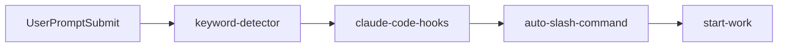
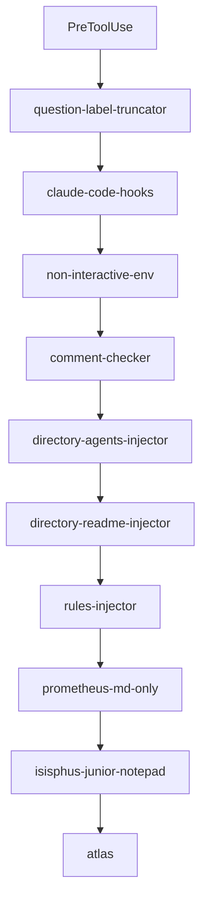
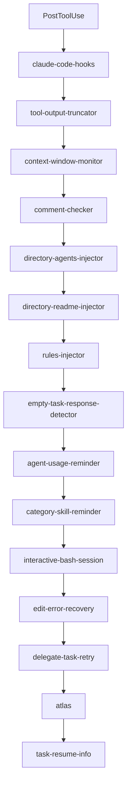
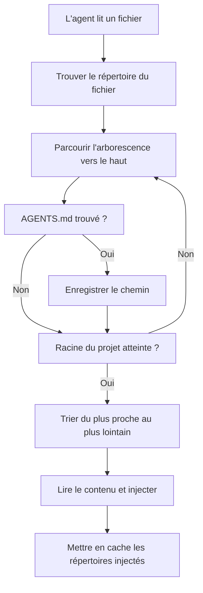
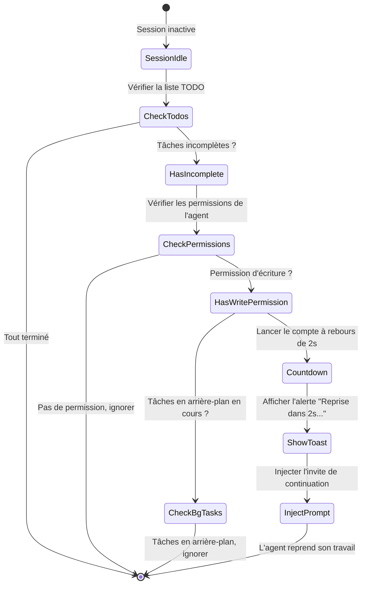
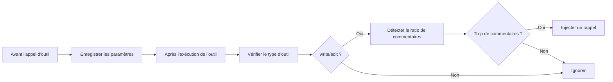

# Hooks de cycle de vie : Contexte automatisé et contrôle qualité

## Ce que vous pourrez faire après ce cours

- Injecter automatiquement le contexte projet aux agents IA (AGENTS.md, README.md)
- Empêcher les agents d'abandonner en plein travail et forcer la complétion des listes TODO
- Tronquer automatiquement les sorties d'outils trop volumineuses pour éviter le dépassement de la fenêtre de contexte
- Activer le mode Ultrawork pour activer tous les agents spécialisés en un clic
- Personnaliser la configuration des hooks et désactiver les fonctionnalités inutiles

## Vos frustrations actuelles

Vous avez déjà rencontré ces problèmes :

- Les agents IA oublient constamment les spécifications du projet et répètent les mêmes erreurs ?
- L'agent s'arrête en plein milieu, sans terminer sa liste de TODO ?
- Les résultats de recherche dans la base de code sont si volumineux qu'ils explosent la fenêtre de contexte ?
- Vous devez manuellement dire à l'agent quel mode utiliser à chaque fois ?

## Quand utiliser cette technique

Les hooks de cycle de vie conviennent aux scénarios suivants :

::: tip Scénarios typiques
- **Gestion du contexte projet** : Injection automatique d'AGENTS.md et README.md
- **Contrôle qualité** : Vérification des commentaires de code, validation des blocs de réflexion
- **Continuité des tâches** : Forcer l'agent à compléter toutes les tâches TODO
- **Optimisation des performances** : Troncature dynamique des sorties, gestion de la fenêtre de contexte
- **Automatisation des workflows** : Déclenchement de modes par mots-clés, exécution automatique de commandes
:::

## Concept clé

### Qu'est-ce qu'un hook de cycle de vie ?

Un **hook de cycle de vie** est un mécanisme piloté par les événements qui vous permet d'insérer une logique personnalisée aux moments clés du travail de l'agent. Par exemple : injecter automatiquement la documentation du projet, forcer la complétion des tâches TODO, tronquer les sorties trop volumineuses, etc. Ces hooks écoutent 4 types d'événements : avant l'exécution d'un outil, après l'exécution d'un outil, lors de la soumission d'une invite utilisateur, et lorsque la session est inactive. En configurant judicieusement les hooks, vous pouvez rendre les agents IA plus intelligents et mieux adaptés à vos habitudes de travail.

::: info Hooks vs Middleware
Les hooks ressemblent au middleware des frameworks Web : tous deux sont des mécanismes "faire quelque chose à un moment précis". La différence est :
- **Middleware** : exécution linéaire, peut interrompre la requête
- **Hooks** : piloté par les événements, ne peut pas interrompre, seulement modifier les données
:::

### 32 hooks, 7 catégories

oh-my-opencode fournit 32 hooks intégrés, répartis en 7 catégories :

| Catégorie | Nombre de hooks | Fonction principale |
|--- | --- | ---|
| **Injection de contexte** | 4 | Injection automatique de documents et règles de projet |
| **Productivité et contrôle** | 6 | Détection de mots-clés, changement de mode, gestion des boucles |
| **Qualité et sécurité** | 4 | Vérification des commentaires de code, validation des blocs de réflexion |
| **Récupération et stabilité** | 3 | Récupération de session, gestion des erreurs |
| **Troncature et gestion du contexte** | 2 | Troncature des sorties, surveillance de la fenêtre |
| **Notifications et UX** | 3 | Mises à jour de version, notifications de tâches en arrière-plan, rappels d'inactivité |
| **Gestion des tâches** | 2 | Reprise de tâche, nouvelle tentative de délégation |

## Types d'événements des hooks

Les hooks écoutent les 4 types d'événements suivants :

### 1. PreToolUse (avant l'exécution d'un outil)

**Moment de déclenchement** : Avant que l'agent n'appelle un outil

**Ce que vous pouvez faire** :
- Empêcher l'exécution de l'outil
- Modifier les paramètres de l'outil
- Injecter du contexte

**Exemples de hooks** : `comment-checker`, `directory-agents-injector`

### 2. PostToolUse (après l'exécution d'un outil)

**Moment de déclenchement** : Après la complétion de l'exécution de l'outil

**Ce que vous pouvez faire** :
- Modifier la sortie de l'outil
- Ajouter des messages d'avertissement
- Injecter des instructions suivantes

**Exemples de hooks** : `tool-output-truncator`, `directory-readme-injector`

### 3. UserPromptSubmit (lors de la soumission d'une invite utilisateur)

**Moment de déclenchement** : Lorsque l'utilisateur envoie un message à la session

**Ce que vous pouvez faire** :
- Empêcher la soumission (rare)
- Modifier le contenu de l'invite
- Injecter des messages système
- Activer des modes de travail

**Exemples de hooks** : `keyword-detector`, `auto-slash-command`

### 4. Stop (lorsque la session est inactive)

**Moment de déclenchement** : Lorsque l'agent arrête de travailler et que la session devient inactive

**Ce que vous pouvez faire** :
- Injecter des invites suivantes
- Envoyer des notifications
- Vérifier l'état des tâches

**Exemples de hooks** : `todo-continuation-enforcer`, `session-notification`

## Ordre d'exécution des hooks

Les hooks s'exécutent dans un ordre fixe pour assurer la justesse logique :

### Événement UserPromptSubmit



**Explication de l'ordre** :
1. `keyword-detector` : Détecte les mots-clés (ultrawork, search, analyze)
2. `claude-code-hooks` : Exécute les hooks de couche de compatibilité Claude Code
3. `auto-slash-command` : Exécute automatiquement les commandes slash
4. `start-work` : Traite la commande `/start-work`

### Événement PreToolUse



**Explication de l'ordre** :
1. `question-label-truncator` : Tronque les labels d'outils
2. `claude-code-hooks` : Couche de compatibilité Claude Code
3. `non-interactive-env` : Gère les environnements non interactifs
4. `comment-checker` : Vérifie les commentaires de code
5. `directory-agents-injector` : Injecte AGENTS.md
6. `directory-readme-injector` : Injecte README.md
7. `rules-injector` : Injecte les règles de projet
8. `prometheus-md-only` : Force Prometheus à n'output que du Markdown
9. `sisyphus-junior-notepad` : Injecte des prompts pour Sisyphus Junior
10. `atlas` : Logique d'orchestration principale d'Atlas

### Événement PostToolUse



**Explication de l'ordre** :
1. `claude-code-hooks` : Couche de compatibilité Claude Code
2. `tool-output-truncator` : Tronque les sorties d'outils
3. `context-window-monitor` : Surveille la fenêtre de contexte
4. `comment-checker` : Vérifie les commentaires de code
5. `directory-agents-injector` : Injecte AGENTS.md
6. `directory-readme-injector` : Injecte README.md
7. `rules-injector` : Injecte les règles de projet
8. `empty-task-response-detector` : Détecte les réponses vides
9. `agent-usage-reminder` : Rappelle d'utiliser des agents spécialisés
10. `category-skill-reminder` : Rappelle d'utiliser Category/Skill
11. `interactive-bash-session` : Gère les sessions Bash interactives
12. `edit-error-recovery` : Récupère les erreurs d'édition
13. `delegate-task-retry` : Retente les tâches déléguées échouées
14. `atlas` : Logique d'orchestration principale d'Atlas
15. `task-resume-info` : Fournit les informations de reprise de tâche

## Hooks clés en détail

### 1. directory-agents-injector (Injection AGENTS.md)

**Événement déclencheur** : PostToolUse

**Fonctionnalité** : Lorsqu'un agent lit un fichier, il parcourt automatiquement le répertoire du fichier vers la racine du projet, collecte tous les fichiers `AGENTS.md` trouvés sur le chemin, et les injecte dans le contexte de l'agent.

**Flux de travail** :



**Exemple** :

Structure du projet :
```
project/
├── AGENTS.md              # Contexte niveau projet
├── src/
│   ├── AGENTS.md          # Contexte niveau src
│   └── components/
│       ├── AGENTS.md      # Contexte niveau components
│       └── Button.tsx
```

Lorsque l'agent lit `Button.tsx`, il injecte automatiquement :
1. `components/AGENTS.md` (injecté en premier)
2. `src/AGENTS.md`
3. `AGENTS.md` (racine du projet)

::: tip Meilleures pratiques
- Créez un `AGENTS.md` dans chaque répertoire principal, expliquant les responsabilités et conventions de ce répertoire
- Les AGENTS.md suivent le principe "du plus proche au plus lointain", le plus proche étant prioritaire
- Les répertoires déjà injectés sont mis en cache pour éviter les injections répétées
:::

**Emplacement du code source** : `src/hooks/directory-agents-injector/index.ts` (183 lignes)

### 2. todo-continuation-enforcer (Continuation forcée des TODO)

**Événement déclencheur** : Stop

**Fonctionnalité** : Détecte la liste TODO de l'agent. S'il reste des TODO non terminés, force l'agent à continuer son travail pour éviter d'abandonner en cours de route.

**Flux de travail** :



**Mécanisme de compte à rebours** :
- Compte à rebours par défaut de 2 secondes
- Affichage de l'alerte Toast : "Reprise dans 2s... (X tâches restantes)"
- L'utilisateur peut annuler manuellement pendant le compte à rebours

**Conditions d'ignorance** :
1. L'agent n'a pas de permission d'écriture (agent en lecture seule)
2. L'agent est dans la liste d'ignorance (prometheus, compaction)
3. Des tâches en arrière-plan sont en cours d'exécution
4. La session est en cours de récupération

**Emplacement du code source** : `src/hooks/todo-continuation-enforcer.ts` (490 lignes)

### 3. keyword-detector (Détection de mots-clés)

**Événement déclencheur** : UserPromptSubmit

**Fonctionnalité** : Détecte les mots-clés dans l'invite utilisateur et active automatiquement le mode correspondant :

| Mot-clé | Mode activé | Description |
|---|---|---|
| `ultrawork` / `ulw` | **Mode performance maximale** | Active tous les agents spécialisés et les tâches parallèles |
| `search` / `find` | **Mode exploration parallèle** | Démarre explore/librarian en parallèle |
| `analyze` / `investigate` | **Mode analyse approfondie** | Active l'exploration approfondie et l'analyse |

**Exemple d'utilisation** :

```
Entrée utilisateur :
ultrawork Développer une API REST avec authentification et autorisation

Réponse système :
[✅ Mode Ultrawork Activé]
Précision maximale engagée. Tous les agents à votre disposition.
```

**Détails d'implémentation** :
- La détection de mots-clés supporte les variantes (ultrawork = ulw)
- Le traitement diffère entre les sessions principales et non principales
- Le réglage du mode est transmis à l'agent via `message.variant`
- Les sessions de tâches en arrière-plan ne font pas de détection de mots-clés

**Emplacement du code source** : `src/hooks/keyword-detector/index.ts` (101 lignes)

### 4. tool-output-truncator (Troncature des sorties d'outils)

**Événement déclencheur** : PostToolUse

**Fonctionnalité** : Tronque dynamiquement les sorties d'outils trop volumineuses, conservant 50% de marge dans la fenêtre de contexte, avec une troncature maximale de 50k tokens.

**Outils supportés** :

```typescript
const TRUNCATABLE_TOOLS = [
  "grep", "Grep", "safe_grep",
  "glob", "Glob", "safe_glob",
  "lsp_diagnostics",
  "ast_grep_search",
  "interactive_bash", "Interactive_bash",
  "skill_mcp",
  "webfetch", "WebFetch",
]
```

**Restrictions spéciales** :
- `webfetch` : maximum 10k tokens (le contenu web nécessite une troncature plus agressive)
- Autres outils : maximum 50k tokens

**Stratégie de troncature** :
1. Calcul dynamique du point de troncature en fonction de la fenêtre de contexte restante
2. Conservation de l'en-tête et de la fin de la sortie, le milieu étant remplacé par des points de suspension
3. Ajout d'un message de troncature : `[Note : Le contenu a été tronqué pour économiser de l'espace dans la fenêtre de contexte. Pour le contexte complet, veuillez lire directement le fichier : {path}]`

::: warning Activer une troncature plus agressive
Dans `oh-my-opencode.json`, configurez :
```json
{
  "experimental": {
    "truncate_all_tool_outputs": true
  }
}
```
Cela tronquera toutes les sorties d'outils, pas seulement ceux de la liste TRUNCATABLE_TOOLS.
:::

**Emplacement du code source** : `src/hooks/tool-output-truncator.ts` (62 lignes)

### 5. comment-checker (Vérification des commentaires de code)

**Événement déclencheur** : PreToolUse / PostToolUse

**Fonctionnalité** : Vérifie si l'agent écrit trop de commentaires, en ignorant intelligemment les tests BDD, les directives et les docstrings.

**Flux de travail** :



**Règles d'ignorance intelligente** :
- Commentaires BDD (Behavior Driven Development)
- Commentaires directives (ex : `// TODO`, `// FIXME`)
- Docstrings

**Méthode de configuration** :

```json
{
  "comment_checker": {
    "custom_prompt": "Votre prompt personnalisé"
  }
}
```

**Emplacement du code source** : `src/hooks/comment-checker/index.ts` (172 lignes)

## Configuration des hooks

### Activer/désactiver les hooks

Dans `oh-my-opencode.json`, configurez :

```json
{
  "disabled_hooks": [
    "comment-checker",
    "auto-update-checker",
    "keyword-detector"
  ]
}
```

### Scénarios de configuration courants

#### Scénario 1 : Désactiver la vérification des commentaires

```json
{
  "disabled_hooks": ["comment-checker"]
}
```

#### Scénario 2 : Désactiver la détection de mots-clés

```json
{
  "disabled_hooks": ["keyword-detector"]
}
```

#### Scénario 3 : Désactiver la continuation forcée des TODO

```json
{
  "disabled_hooks": ["todo-continuation-enforcer"]
}
```

#### Scénario 4 : Activer la troncature agressive des sorties

```json
{
  "experimental": {
    "truncate_all_tool_outputs": true
  }
}
```

## Résumé de ce cours

Ce cours a présenté les 32 hooks de cycle de vie d'oh-my-opencode :

**Concepts clés** :
- Les hooks sont des mécanismes d'interception pilotés par les événements
- 4 types d'événements : PreToolUse, PostToolUse, UserPromptSubmit, Stop
- Exécution dans un ordre fixe pour assurer la justesse logique

**Hooks couramment utilisés** :
- `directory-agents-injector` : Injection automatique d'AGENTS.md
- `todo-continuation-enforcer` : Forcer la complétion de la liste TODO
- `keyword-detector` : Détection de mots-clés pour activer les modes
- `tool-output-truncator` : Troncature dynamique des sorties
- `comment-checker` : Vérification des commentaires de code

**Méthodes de configuration** :
- Désactiver les hooks via le tableau `disabled_hooks`
- Activer les fonctionnalités expérimentales via la configuration `experimental`

## Aperçu du prochain cours

> Dans le prochain cours, nous apprendrons **[les commandes slash : Workflows prédéfinis](../slash-commands/)**.
>
> Vous apprendrez :
> - L'utilisation de 6 commandes slash intégrées
> - `/ralph-loop` pour compléter automatiquement le travail
> - `/refactor` pour une refactorisation intelligente
> - `/start-work` pour exécuter le plan Prometheus
> - Comment créer des commandes slash personnalisées

---

## Annexe : Références du code source

<details>
<summary><strong>Cliquez pour développer et voir les emplacements du code source</strong></summary>

> Dernière mise à jour : 2026-01-26

| Fonctionnalité | Chemin du fichier | Nombre de lignes |
|---|---|---|
|---|---|---|
|---|---|---|
|---|---|---|
|---|---|---|
|---|---|---|
|---|---|---|
|---|---|---|
|---|---|---|
|---|---|---|
|---|---|---|

**Constantes clés** :
- `AGENTS_FILENAME = "AGENTS.md"` : Nom du fichier de contexte de l'agent (`src/hooks/directory-agents-injector/constants.ts`)
- `DEFAULT_MAX_TOKENS = 50_000` : Tokens maximum par défaut pour la troncature (`src/hooks/tool-output-truncator.ts`)
- `WEBFETCH_MAX_TOKENS = 10_000` : Tokens maximum pour webfetch (`src/hooks/tool-output-truncator.ts`)
- `COUNTDOWN_SECONDS = 2` : Secondes du compte à rebours de continuation des TODO (`src/hooks/todo-continuation-enforcer.ts`)

**Fonctions clés** :
- `createDirectoryAgentsInjectorHook(ctx)` : Crée le hook d'injection AGENTS.md
- `createTodoContinuationEnforcer(ctx, options)` : Crée le hook de continuation forcée des TODO
- `createKeywordDetectorHook(ctx, collector)` : Crée le hook de détection de mots-clés
- `createToolOutputTruncatorHook(ctx, options)` : Crée le hook de troncature des sorties d'outils
- `createCommentCheckerHooks(config)` : Crée les hooks de vérification des commentaires de code

</details>
