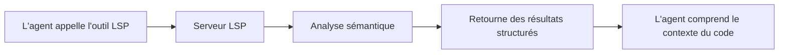
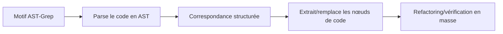

# LSP et AST-Grep : Capacités d'analyse et de manipulation de code niveau IDE

## Objectifs d'apprentissage

- Utiliser les outils LSP pour naviguer dans le code, rechercher des symboles et obtenir des diagnostics
- Utiliser AST-Grep pour des recherches et remplacements précis de motifs de code
- Comprendre les différences entre LSP et AST-Grep et leurs cas d'utilisation
- Donner à l'agent des capacités de compréhension et de manipulation de code niveau IDE

## Le problème

Les outils traditionnels de recherche et de refactoring de code ont des limitations évidentes :

| Problème | Solution traditionnelle | Besoin réel |
| --- | --- | --- |
| **Navigation de symboles imprécise** | Simple correspondance de chaînes | Comprendre la sémantique du code, naviguer vers la vraie définition |
| **Recherche de références incomplète** | Recherche par expressions régulières | Suivi précis des références inter-fichiers et inter-portées |
| **Refactoring risqué** | Remplacement manuel + grep | Comprendre la structure du code, éviter les modifications destructives |
| **Correspondance de motifs maladroite** | Expressions régulières | Correspondance de motifs structurée basée sur l'AST |

::: info Concepts clés
**LSP (Language Server Protocol)** est un protocole standard entre les IDE et les serveurs de langage. Via une interface unifiée, il fournit la complétion de code, la navigation vers les définitions, la recherche de références, le renommage de symboles, les diagnostics, les aperçus de symboles et plus encore, donnant aux éditeurs de puissantes capacités de compréhension du code, avec support des informations de type et des relations d'héritage. **AST-Grep** est un outil de correspondance de motifs de code basé sur l'arbre syntaxique abstrait. Il comprend la structure du code plutôt que le simple texte, supporte les méta-variables (`$VAR` pour un seul nœud, `$$$` pour plusieurs nœuds) pour une correspondance de motifs flexible et le refactoring en masse, couvrant 25 langages de programmation (dont TypeScript, Python, Go, Rust). C'est un outil puissant pour le refactoring, la vérification de conventions et la recherche structurée.
:::

## Quand utiliser cette technique

| Outil | Cas d'utilisation | Exemple |
| --- | --- | --- |
| **Outils LSP** | Quand vous avez besoin de fonctionnalités IDE | Aller à la définition, trouver toutes les références, obtenir la liste des erreurs, renommer un symbole |
| **AST-Grep** | Quand vous avez besoin de correspondance de motifs | Rechercher des structures de code spécifiques, refactoring en masse, vérifier les conventions |
| **Grep/Glob** | Recherche de texte simple | Trouver un nom de fonction, correspondance de noms de fichiers |

## 🎒 Avant de commencer

Avant d'utiliser les outils LSP et AST-Grep, assurez-vous que :

1. **Le Language Server est installé**
   - TypeScript/JavaScript : `npm install -g typescript-language-server`
   - Python : `pip install basedpyright` ou `pip install ruff`
   - Go : `go install golang.org/x/tools/gopls@latest`
   - Rust : `rustup component add rust-analyzer`

2. **AST-Grep CLI est installé**
   ```bash
   bun add -D @ast-grep/cli
   ```

3. **Le serveur LSP est configuré**
   - La configuration du serveur LSP se trouve dans `opencode.json` d'OpenCode
   - oh-my-opencode lit et utilise automatiquement ces configurations

::: tip Vérifier l'environnement
Utilisez les commandes suivantes pour vérifier l'environnement :
```bash
# Vérifier le serveur LSP
oh-my-opencode doctor

# Vérifier AST-Grep
which sg
```
:::

## Concept central

### Outils LSP : Compréhension du code niveau IDE

Les outils LSP donnent à l'agent IA les mêmes capacités de compréhension du code qu'un IDE :



**Avantages clés** :
- ✅ Compréhension sémantique, pas simple correspondance de chaînes
- ✅ Suivi précis inter-fichiers et inter-portées
- ✅ Support des informations de type, relations d'héritage et autres fonctionnalités avancées
- ✅ Cohérence totale avec la configuration du projet (même serveur LSP)

### AST-Grep : Correspondance de motifs de code structurée

AST-Grep permet à l'agent IA d'effectuer une correspondance précise de structures de code :



**Avantages clés** :
- ✅ Basé sur la structure du code, pas le texte
- ✅ Support des méta-variables (`$VAR`, `$$$`) pour la correspondance de motifs
- ✅ Support de plusieurs langages (25)
- ✅ Utilisable pour le refactoring, la vérification et la validation des conventions

## Suivez le guide

### Étape 1 : Utiliser LSP pour aller à la définition

**Pourquoi**
Quand vous devez voir où un symbole est défini, l'outil `goto_definition` de LSP fournit une navigation précise, plus fiable que la recherche de chaînes.

Dans OpenCode, l'agent peut appeler automatiquement :

```typescript
// L'agent appelle automatiquement
lsp_goto_definition({
  filePath: "src/utils.ts",
  line: 15,
  character: 10
})
```

**Vous devriez voir** :
```
→ Definition found:
  File: src/types.ts
  Line: 45
  Text: export interface UserConfig {
```

::: tip Utilisation pratique
Vous n'avez pas besoin d'appeler ces outils manuellement, l'agent IA les utilise automatiquement pour comprendre le code. Vous pouvez simplement demander : "Va à la définition de cette fonction" ou "Où cette variable est-elle définie ?"
:::

### Étape 2 : Trouver toutes les références

**Pourquoi**
Quand vous devez modifier un symbole, trouver d'abord toutes les références garantit que la modification ne cassera pas d'autres utilisations.

L'agent peut appeler :

```typescript
lsp_find_references({
  filePath: "src/api.ts",
  line: 10,
  character: 5,
  includeDeclaration: true  // Inclure la définition elle-même
})
```

**Vous devriez voir** :
```
Found 15 references (showing first 200):
  src/api.ts:10:5  - [definition] fetchData
  src/components/List.tsx:23:12 - [usage] fetchData()
  src/pages/Home.tsx:45:8 - [usage] fetchData()
  ...
```

### Étape 3 : Obtenir les symboles du fichier et de l'espace de travail

**Pourquoi**
Pour comprendre la structure d'un fichier ou rechercher des types de symboles spécifiques dans tout le projet, l'outil `lsp_symbols` est très utile.

**Aperçu du fichier** (scope="document") :

```typescript
lsp_symbols({
  filePath: "src/app.tsx",
  scope: "document"
})
```

**Vous devriez voir** :
```
Found 12 symbols:
  [Component] App (line: 10-150)
    [Function] useEffect (line: 25-35)
    [Function] handleClick (line: 40-55)
    [Variable] count (line: 15)
  ...
```

**Recherche dans l'espace de travail** (scope="workspace") :

```typescript
lsp_symbols({
  filePath: "src/app.tsx",
  scope: "workspace",
  query: "fetchData"
})
```

### Étape 4 : Obtenir les diagnostics

**Pourquoi**
Avant d'exécuter le code, l'outil de diagnostic LSP peut détecter les erreurs, avertissements et suggestions à l'avance.

```typescript
lsp_diagnostics({
  filePath: "src/utils.ts",
  severity: "error"  // Optionnel : "error", "warning", "information", "hint", "all"
})
```

**Vous devriez voir** :
```
Found 3 diagnostics:
  [Error] src/utils.ts:23:5 - 'result' is used before being assigned
  [Warning] src/utils.ts:45:12 - Unused variable 'temp'
  [Hint] src/utils.ts:67:8 - This can be simplified to const x = value
```

::: tip Pré-vérification
Faire utiliser `lsp_diagnostics` par l'agent IA avant d'écrire du code pour vérifier les problèmes potentiels peut éviter des modifications répétées.
:::

### Étape 5 : Renommer un symbole en toute sécurité

**Pourquoi**
Renommer un symbole est une opération de refactoring courante, mais le remplacement manuel est sujet aux erreurs. L'outil `lsp_rename` de LSP peut renommer un symbole en toute sécurité dans tout l'espace de travail.

**Étape 1 : Valider le renommage**

```typescript
lsp_prepare_rename({
  filePath: "src/api.ts",
  line: 10,
  character: 5
})
```

**Vous devriez voir** :
```
Rename validation:
  Current name: fetchData
  Placeholder range: line 10, column 5-14
  Status: ✅ Valid
```

**Étape 2 : Exécuter le renommage**

```typescript
lsp_rename({
  filePath: "src/api.ts",
  line: 10,
  character: 5,
  newName: "fetchUserData"
})
```

**Vous devriez voir** :
```
Applied rename to 15 files:
  src/api.ts:10:5 - fetchData → fetchUserData
  src/components/List.tsx:23:12 - fetchData() → fetchUserData()
  src/pages/Home.tsx:45:8 - fetchData → fetchUserData()
  ...
```

### Étape 6 : Utiliser AST-Grep pour rechercher des motifs de code

**Pourquoi**
Quand vous devez trouver des structures de code spécifiques (comme tous les endroits utilisant `console.log`), AST-Grep est plus précis que grep.

**Recherche de motif basique** :

```typescript
ast_grep_search({
  pattern: "console.log($MSG)",
  lang: "typescript",
  paths: ["src"],
  context: 2  // Nombre de lignes de contexte avant/après la correspondance
})
```

**Vous devriez voir** :
```
src/utils.ts:15:
  13 | function debug(message) {
  14 |   console.log(message)
  15 |   console.log("Debug mode")
  16 | }
  17 | }

src/components/App.tsx:23:
  21 | useEffect(() => {
  22 |   console.log("Component mounted")
  23 | }, [])
```

**Utilisation des méta-variables** :

```typescript
// Correspondre tous les appels de fonction
ast_grep_search({
  pattern: "$FUNC($$$)",
  lang: "typescript",
  paths: ["src"]
})
```

```typescript
// Correspondre toutes les fonctions asynchrones
ast_grep_search({
  pattern: "async function $NAME($$$) { $$$ }",
  lang: "typescript",
  paths: ["src"]
})
```

::: warning Important : Le motif doit être un nœud AST complet
❌ Incorrect : `export async function $NAME`
✅ Correct : `export async function $NAME($$$) { $$$ }`

Le motif doit être un fragment de code valide, incluant la signature complète de la fonction et son corps.
:::

### Étape 7 : Utiliser AST-Grep pour le remplacement en masse

**Pourquoi**
Quand vous devez refactorer du code en masse (comme remplacer tous les `console.log` par `logger.info`), la fonction de remplacement d'AST-Grep est très puissante.

**Prévisualiser le remplacement** (dry-run) :

```typescript
ast_grep_replace({
  pattern: "console.log($MSG)",
  rewrite: "logger.info($MSG)",
  lang: "typescript",
  paths: ["src"],
  dryRun: true  // Par défaut true, prévisualise seulement sans modifier
})
```

**Vous devriez voir** :
```
Preview changes (dry-run):
  src/utils.ts:15:2 - console.log("Debug mode")
                 → logger.info("Debug mode")
  src/components/App.tsx:23:4 - console.log("Component mounted")
                              → logger.info("Component mounted")

Total: 2 changes
```

**Appliquer le remplacement** :

```typescript
ast_grep_replace({
  pattern: "console.log($MSG)",
  rewrite: "logger.info($MSG)",
  lang: "typescript",
  paths: ["src"],
  dryRun: false  // Mettre à false pour appliquer les changements
})
```

**Vous devriez voir** :
```
Applied 2 changes:
  src/utils.ts:15:2 - console.log("Debug mode")
                 → logger.info("Debug mode")
  src/components/App.tsx:23:4 - console.log("Component mounted")
                              → logger.info("Component mounted")
```

::: danger Opération destructive
`ast_grep_replace` avec `dryRun: false` modifie directement les fichiers. Recommandations :
1. Prévisualisez d'abord avec `dryRun: true`
2. Confirmez que tout est correct avant d'appliquer
3. Si le projet utilise Git, commitez d'abord l'état actuel
:::

## Point de contrôle ✅

**Vérifier les outils LSP** :
- [ ] Pouvez-vous naviguer vers la définition d'un symbole ?
- [ ] Pouvez-vous trouver toutes les références ?
- [ ] Pouvez-vous obtenir les diagnostics ?
- [ ] Pouvez-vous renommer un symbole en toute sécurité ?

**Vérifier les outils AST-Grep** :
- [ ] Pouvez-vous rechercher des motifs de code ?
- [ ] Pouvez-vous utiliser les méta-variables pour la correspondance ?
- [ ] Pouvez-vous prévisualiser et exécuter des remplacements ?

## Pièges courants

### Problèmes courants avec les outils LSP

| Problème | Cause | Solution |
| --- | --- | --- |
| **Définition introuvable** | Serveur LSP non démarré ou mal configuré | Vérifiez la configuration LSP dans `opencode.json` |
| **Liste de références incomplète** | Erreurs dans le code, le serveur LSP n'a pas entièrement analysé | Corrigez d'abord les erreurs dans le code |
| **Échec du renommage** | Le nouveau nom entre en conflit avec un symbole existant | Utilisez un nom plus spécifique |

### Problèmes courants avec AST-Grep

| Problème | Cause | Solution |
| --- | --- | --- |
| **Le motif ne correspond pas** | Motif incomplet ou erreur de syntaxe | Assurez-vous que le motif est un nœud AST complet |
| **Deux-points en fin de motif Python** | Les `def` et `class` Python n'ont pas besoin de deux-points | ❌ `def func():` → ✅ `def func($$$):` |
| **Trop de correspondances** | Motif trop large | Utilisez un contexte plus spécifique ou limitez les chemins |

### Conseils d'optimisation des performances

```typescript
// ✅ Bien : Limiter la portée de recherche
ast_grep_search({
  pattern: "$FUNC($$$)",
  lang: "typescript",
  paths: ["src/api"],  // Rechercher uniquement dans un répertoire spécifique
  globs: ["*.ts"]      // Correspondre uniquement des fichiers spécifiques
})

// ❌ Mauvais : Rechercher dans tout le projet
ast_grep_search({
  pattern: "$FUNC($$$)",
  lang: "typescript",
  paths: ["./"]  // Rechercher tous les fichiers
})
```

## Liste complète des outils LSP

| Outil | Fonction | Paramètres |
| --- | --- | --- |
| `lsp_goto_definition` | Aller à la définition du symbole | `filePath`, `line`, `character` |
| `lsp_find_references` | Trouver toutes les références | `filePath`, `line`, `character`, `includeDeclaration?` |
| `lsp_symbols` | Obtenir l'aperçu du fichier ou les symboles de l'espace de travail | `filePath`, `scope`, `query?`, `limit?` |
| `lsp_diagnostics` | Obtenir les erreurs et avertissements | `filePath`, `severity?` |
| `lsp_prepare_rename` | Valider l'opération de renommage | `filePath`, `line`, `character` |
| `lsp_rename` | Exécuter l'opération de renommage | `filePath`, `line`, `character`, `newName` |

**Limitations** :
- Maximum 200 symboles, références ou diagnostics retournés (configurable)
- Le serveur LSP doit être configuré et en cours d'exécution

## Liste complète des outils AST-Grep

| Outil | Fonction | Paramètres |
| --- | --- | --- |
| `ast_grep_search` | Recherche de motifs AST | `pattern`, `lang`, `paths?`, `globs?`, `context?` |
| `ast_grep_replace` | Remplacement de motifs AST | `pattern`, `rewrite`, `lang`, `paths?`, `globs?`, `dryRun?` |

**Langages supportés** (25) :
`bash`, `c`, `cpp`, `csharp`, `css`, `elixir`, `go`, `haskell`, `html`, `java`, `javascript`, `json`, `kotlin`, `lua`, `nix`, `php`, `python`, `ruby`, `rust`, `scala`, `solidity`, `swift`, `typescript`, `tsx`, `yaml`

**Méta-variables** :
- `$VAR` - Correspond à un seul nœud
- `$$$` - Correspond à plusieurs nœuds

## Cas pratiques

### Cas 1 : Refactorer les appels API

**Scénario** : Ajouter la gestion des erreurs à tous les appels `fetch`

**Utiliser AST-Grep pour trouver le motif** :

```typescript
ast_grep_search({
  pattern: "fetch($URL).then($RES => $BODY)",
  lang: "typescript",
  paths: ["src/api"]
})
```

**Utiliser AST-Grep pour remplacer** :

```typescript
ast_grep_replace({
  pattern: "fetch($URL).then($RES => $BODY)",
  rewrite: "fetch($URL).then($RES => $BODY).catch(err => handleError(err))",
  lang: "typescript",
  paths: ["src/api"],
  dryRun: true  // Prévisualiser d'abord
})
```

### Cas 2 : Trouver les imports inutilisés

**Utiliser LSP pour trouver les références** :

```typescript
// Pour chaque import
lsp_find_references({
  filePath: "src/utils.ts",
  line: 1,  // Ligne de l'import
  character: 10
})

// Si seulement 1 référence est retournée (l'import lui-même), il est inutilisé
```

### Cas 3 : Renommer une variable de configuration

**Étape 1 : Valider le renommage**

```typescript
lsp_prepare_rename({
  filePath: "src/config.ts",
  line: 10,
  character: 4
})
```

**Étape 2 : Exécuter le renommage**

```typescript
lsp_rename({
  filePath: "src/config.ts",
  line: 10,
  character: 4,
  newName: "API_BASE_URL"
})
```

## Résumé de la leçon

Cette leçon a présenté les outils LSP et AST-Grep d'oh-my-opencode :

**Outils LSP** :
- Fournissent des capacités de compréhension et de manipulation de code niveau IDE
- Supportent la navigation vers les définitions, la recherche de références, les diagnostics, le renommage de symboles
- Utilisent le serveur LSP configuré du projet, comportement cohérent avec l'IDE

**Outils AST-Grep** :
- Correspondance de motifs de code structurée basée sur l'AST
- Support des méta-variables pour une correspondance flexible
- Support du remplacement et du refactoring en masse

**Bonnes pratiques** :
- LSP pour les scénarios nécessitant une compréhension sémantique
- AST-Grep pour le refactoring de code structuré
- Toujours prévisualiser avec dryRun avant de remplacer

## Aperçu de la prochaine leçon

> Dans la prochaine leçon, nous apprendrons **[Categories et Skills : Composition dynamique d'agents](../categories-skills/)**.
>
> Vous apprendrez :
> - Comment utiliser Categories pour sélectionner automatiquement le modèle optimal
> - Comment combiner différents Skills pour créer des agents spécialisés
> - Les cas d'utilisation pratiques des nouvelles fonctionnalités v3.0

---

## Annexe : Référence du code source

<details>
<summary><strong>Cliquez pour voir l'emplacement du code source</strong></summary>

> Dernière mise à jour : 2026-01-26

### Outils LSP

| Fonction | Chemin du fichier | Lignes |
| --- | --- | --- |
| Définition des outils LSP | [`src/tools/lsp/tools.ts`](https://github.com/code-yeongyu/oh-my-opencode/blob/main/src/tools/lsp/tools.ts) | 29-261 |
| Implémentation du client LSP | [`src/tools/lsp/client.ts`](https://github.com/code-yeongyu/oh-my-opencode/blob/main/src/tools/lsp/client.ts) | 1-596 |
| Définition des constantes LSP | [`src/tools/lsp/constants.ts`](https://github.com/code-yeongyu/oh-my-opencode/blob/main/src/tools/lsp/constants.ts) | 1-391 |
| Définition des types LSP | [`src/tools/lsp/types.ts`](https://github.com/code-yeongyu/oh-my-opencode/blob/main/src/tools/lsp/types.ts) | 1-246 |

### Outils AST-Grep

| Fonction | Chemin du fichier | Lignes |
| --- | --- | --- |
| --- | --- | --- |
| --- | --- | --- |
| --- | --- | --- |
| --- | --- | --- |

**Constantes clés** :
- `DEFAULT_MAX_REFERENCES = 200` - Nombre maximum de références retournées
- `DEFAULT_MAX_SYMBOLS = 200` - Nombre maximum de symboles retournés
- `DEFAULT_MAX_DIAGNOSTICS = 200` - Nombre maximum de diagnostics retournés
- `CLI_LANGUAGES` - Liste des 25 langages supportés
- `DEFAULT_MAX_MATCHES = 500` - Nombre maximum de correspondances AST-Grep

**Fonctions utilitaires clés** :
- `withLspClient()` - Obtenir le client LSP et exécuter des opérations
- `runSg()` - Exécuter des commandes CLI AST-Grep
- `formatLocation()` - Formater les informations de localisation
- `formatDiagnostic()` - Formater les informations de diagnostic

**Serveurs LSP supportés** (partiel) :
- TypeScript : `typescript-language-server`
- Python : `basedpyright`, `pyright`, `ty`, `ruff`
- Go : `gopls`
- Rust : `rust-analyzer`
- C/C++ : `clangd`

</details>
