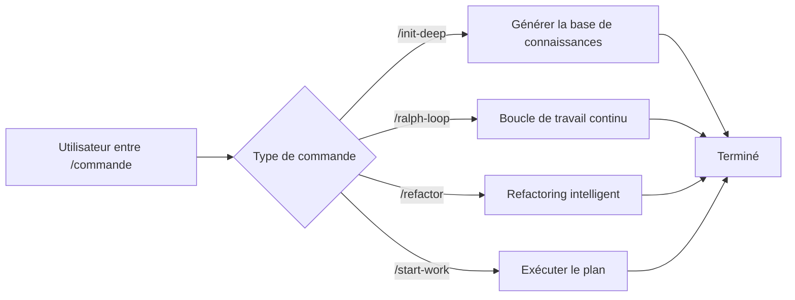

# Commandes Slash : Workflows Prédéfinis pour Exécution en Un Clic

## Ce que vous allez apprendre

- Utiliser `/init-deep` pour générer la base de connaissances du projet en un clic
- Utiliser `/ralph-loop` pour faire travailler les agents en continu jusqu'à l'achèvement des tâches
- Exécuter un refactoring intelligent avec `/refactor`, en validant automatiquement chaque étape
- Utiliser `/start-work` pour démarrer le développement systématique à partir des plans Prometheus

## Votre défi actuel

Lorsque vous exécutez répétitivement les mêmes tâches complexes, vous devez taper de longues instructions à chaque fois :

```
"S'il vous plaît, aidez-moi à analyser la structure de ce projet, trouver tous les modules clés, générer AGENTS.md pour chaque répertoire, puis explorer en parallèle les patterns du codebase..."
```

De telles longues instructions gaspillent du temps et sont sujettes à l'oubli d'étapes.

## Quand utiliser cette approche

Les **commandes slash** sont des modèles de workflow prédéfinis qui déclenchent des tâches complexes en un clic. Ces commandes couvrent des scénarios de développement courants :

| Scénario | Commande à utiliser |
|----------|---------------------|
| Initialiser la base de connaissances du projet | `/init-deep` |
| Faire travailler l'IA en continu | `/ralph-loop` |
| Refactoriser intelligemment le code | `/refactor` |
| Commencer à travailler à partir d'un plan | `/start-work` |

## Concepts fondamentaux

Les **commandes slash** sont des modèles de workflow prédéfinis qui exécutent rapidement des tâches complexes via des mots de déclenchement commençant par `/`.

**Comment cela fonctionne** :



oh-my-opencode inclut 6 commandes slash intégrées :

| Commande | Fonction | Complexité |
|---------|----------|------------|
| `/init-deep` | Générer des fichiers AGENTS.md hiérarchiques | Moyenne |
| `/ralph-loop` | Boucle de développement auto-référentielle | Élevée |
| `/ulw-loop` | Version Ultrawork de ralph-loop | Élevée |
| `/cancel-ralph` | Annuler la boucle Ralph active | Faible |
| `/refactor` | Refactoring intelligent avec chaîne d'outils complète | Élevée |
| `/start-work` | Commencer à travailler à partir du plan Prometheus | Medium |

::: info Commandes personnalisées
En plus des commandes intégrées, vous pouvez créer des commandes personnalisées (fichiers Markdown) dans les répertoires `.opencode/command/` ou `.claude/commands/`.
:::

## 🎒 Prérequis

- ✅ oh-my-opencode installé
- ✅ Au moins un fournisseur IA configuré
- ✅ Compréhension de base de l'utilisation des agents (recommandé d'apprendre d'abord [Démarrage avec Sisyphus : L'Orchestrateur Principal](../sisyphus-orchestrator/))

## Suivez le guide

### Étape 1 : Générer la base de connaissances du projet

**Pourquoi**
Les agents IA ont besoin de comprendre la structure et les conventions du projet pour travailler efficacement. La commande `/init-deep` analyse automatiquement le projet et génère des fichiers AGENTS.md hiérarchiques.

**Entrez dans OpenCode** :

```
/init-deep
```

**Vous devriez voir** : L'agent commence l'analyse parallèle de la structure du projet, explore les patterns de code et génère les fichiers AGENTS.md.

**Utilisation avancée** :

```bash
# Régénérer tous les fichiers (supprimer les existants)
/init-deep --create-new

# Limiter la profondeur de génération
/init-deep --max-depth=2
```

**Exemple de sortie** :

```
=== init-deep Terminé ===

Mode : update

Fichiers :
  [OK] ./AGENTS.md (racine, 120 lignes)
  [OK] ./src/hooks/AGENTS.md (45 lignes)
  [OK] ./src/agents/AGENTS.md (38 lignes)

Répertoires analysés : 12
AGENTS.md créés : 3
```

### Étape 2 : Faire travailler l'IA en continu

**Pourquoi**
Certaines tâches nécessitent plusieurs itérations pour être complétées (comme la correction de bugs complexes). La commande `/ralph-loop` fait travailler l'agent en continu jusqu'à ce que la tâche soit terminée, plutôt que de s'arrêter à mi-chemin.

**Entrez dans OpenCode** :

```
/ralph-loop "Corrigez le problème d'authentification sur la page de connexion, assurez-vous que tous les cas d'erreur sont gérés"
```

**Vous devriez voir** : L'agent commence à travailler et continue automatiquement après l'achèvement jusqu'à ce que le marqueur de complétion soit affiché.

**Utilisation avancée** :

```bash
# Marqueur de complétion personnalisé
/ralph-loop "Écrivez des tests unitaires" --completion-promise="TESTS_DONE"

# Limiter le nombre maximum d'itérations
/ralph-loop "Optimisez les performances" --max-iterations=50
```

**Version Ultrawork** (active tous les agents professionnels) :

```bash
/ulw-loop "Développez une API REST avec authentification, autorisation et limitation de débit"
```

**Point de contrôle** ✅

- L'agent continue-t-il automatiquement après chaque itération ?
- Voyez-vous l'invite "Ralph Loop Complete !" une fois terminé ?

### Étape 3 : Annuler la boucle

**Pourquoi**
Si la direction de la tâche est incorrecte ou si vous souhaitez une intervention manuelle, vous devez annuler la boucle.

**Entrez dans OpenCode** :

```
/cancel-ralph
```

**Vous devriez voir** : La boucle s'arrête et les fichiers d'état sont nettoyés.

### Étape 4 : Refactoring intelligent

**Pourquoi**
Lors du refactoring du code, les modifications aveugles peuvent introduire des bugs. La commande `/refactor` utilise une chaîne d'outils complète (LSP, AST-Grep, validation de tests) pour assurer un refactoring sûr.

**Entrez dans OpenCode** :

```bash
# Renommer un symbole
/refactor "Refactorisez la classe AuthService en UserService"

# Refactoriser un module
/refactor src/auth --scope=module --strategy=safe

# Refactoring par correspondance de patterns
/refactor "Migrez tous les endroits utilisant l'API dépréciée vers la nouvelle API"
```

**Vous devriez voir** : L'agent exécute un processus de refactoring en 6 phases :

1. **Portail d'intention** - Confirmer les objectifs de refactoring
2. **Analyse du codebase** - Exploration parallèle des dépendances
3. **Construction de la carte de code** - Cartographier la portée de l'impact
4. **Évaluation des tests** - Vérifier la couverture des tests
5. **Génération du plan** - Créer un plan de refactoring détaillé
6. **Exécution du refactoring** - Exécution étape par étape avec validation

**Utilisation avancée** :

```bash
# Stratégie agressive (autorise des modifications plus importantes)
/refactor "Refactoring d'architecture" --strategy=aggressive

# Portée fichier
/refactor "Optimisez les fonctions dans utils.ts" --scope=file
```

::: warning Exigence de couverture de tests
Si la couverture de tests du code cible est inférieure à 50%, `/refactor` refusera d'exécuter la stratégie agressive. Il est recommandé d'ajouter des tests d'abord.
:::

### Étape 5 : Commencer à travailler à partir d'un plan

**Pourquoi**
Après la planification avec Prometheus, vous devez exécuter systématiquement les tâches du plan. La commande `/start-work` charge automatiquement le plan et utilise l'agent Atlas pour l'exécuter.

**Entrez dans OpenCode** :

```bash
# Sélection automatique d'un seul plan
/start-work

# Sélectionner un plan spécifique
/start-work "auth-api-plan"
```

**Vous devriez voir** :

- S'il n'y a qu'un seul plan : Sélection automatique et début de l'exécution
- S'il y a plusieurs plans : Liste de tous les plans pour sélection

**Exemple de sortie** :

```
Plans de travail disponibles

Heure actuelle : 2026-01-26T10:30:00Z
ID de session : abc123

1. [auth-api-plan.md] - Modifié : 2026-01-25 - Progression : 3/10 tâches
2. [migration-plan.md] - Modifié : 2026-01-26 - Progression : 0/5 tâches

Sur quel plan souhaitez-vous travailler ? (Entrez le numéro ou le nom du plan)
```

**Point de contrôle** ✅

- Le plan est-il correctement chargé ?
- Les tâches sont-elles exécutées dans l'ordre ?
- Les tâches terminées sont-elles marquées ?

## Pièges courants

### Piège 1 : `/init-deep` ignore les fichiers existants

**Problème** : En mode par défaut, `/init-deep` préserve les fichiers AGENTS.md existants, en ne mettant à jour ou en ne créant que les parties manquantes.

**Solution** : Utilisez le paramètre `--create-new` pour régénérer tous les fichiers.

### Piège 2 : Boucle infinie `/ralph-loop`

**Problème** : Si l'agent ne peut pas terminer la tâche, la boucle continue jusqu'au nombre maximum d'itérations (100 par défaut).

**Solution** :
- Définissez un `--max-iterations` raisonnable (par exemple, 20-30)
- Utilisez `/cancel-ralph` pour annuler manuellement
- Fournissez une description de tâche plus claire

### Piège 3 : Faible couverture de tests `/refactor`

**Problème** : Le code cible n'a pas de tests, le refactoring échouera.

**Solution** :
```bash
# Laissez l'agent ajouter des tests d'abord
"S'il vous plaît, ajoutez des tests unitaires complets pour AuthService, couvrant tous les cas limites"

# Puis refactorisez
/refactor "Refactorisez la classe AuthService"
```

### Piège 4 : `/start-work` ne peut pas trouver le plan

**Problème** : Les plans générés par Prometheus ne sont pas enregistrés dans le répertoire `.sisyphus/plans/`.

**Solution** :
- Vérifiez si la sortie de Prometheus inclut le chemin du fichier du plan
- Confirmez que l'extension du fichier du plan est `.md`

### Piège 5 : Format incorrect des paramètres de commande

**Problème** : La position ou le format des paramètres est incorrect.

**Solution** :
```bash
# ✅ Correct
/ralph-loop "Description de la tâche" --completion-promise=DONE

# ❌ Incorrect
/ralph-loop --completion-promise=DONE "Description de la tâche"
```

## Résumé

| Commande | Fonction principale | Fréquence d'utilisation |
|---------|-------------------|------------------------|
| `/init-deep` | Générer automatiquement la base de connaissances du projet | Configuration initiale |
| `/ralph-loop` | Boucle de travail continu | Élevée |
| `/ulw-loop` | Version Ultrawork de la boucle | Moyenne |
| `/cancel-ralph` | Annuler la boucle | Faible |
| `/refactor` | Refactoring intelligent sûr | Élevée |
| `/start-work` | Exécuter les plans Prometheus | Moyenne |

**Meilleures pratiques** :
- Utilisez `/init-deep` sur les nouveaux projets pour établir la base de connaissances
- Utilisez `/ralph-loop` pour les tâches complexes afin de laisser l'IA travailler en continu
- Préférez `/refactor` lors du refactoring de code pour assurer la sécurité
- Utilisez `/start-work` avec Prometheus pour un développement systématique

## À venir

> Dans la prochaine leçon, nous apprendrons **[Configuration avancée](../advanced-configuration/)**.
>
> Vous apprendrez :
> - Comment remplacer les modèles et les invites par défaut des agents
> - Comment configurer les permissions et les restrictions de sécurité
> - Comment personnaliser les Catégories et les Skills
> - Comment ajuster le contrôle de concurrence des tâches en arrière-plan

---

## Annexe : Référence du code source

<details>
<summary><strong>Cliquez pour développer les emplacements du code source</strong></summary>

> Mis à jour : 2026-01-26

| Fonctionnalité | Chemin du fichier | Numéros de ligne |
|---------|-----------|--------------|
| Définitions des commandes | [`src/features/builtin-commands/commands.ts`](https://github.com/code-yeongyu/oh-my-opencode/blob/main/src/features/builtin-commands/commands.ts) | 8-73 |
| Chargeur de commandes | [`src/features/builtin-commands/index.ts`](https://github.com/code-yeongyu/oh-my-opencode/blob/main/src/features/builtin-commands/index.ts) | 75-89 |
| Modèle init-deep | [`src/features/builtin-commands/templates/init-deep.ts`](https://github.com/code-yeongyu/oh-my-opencode/blob/main/src/features/builtin-commands/templates/init-deep.ts) | Texte complet |
| Modèle ralph-loop | [`src/features/builtin-commands/templates/ralph-loop.ts`](https://github.com/code-yeongyu/oh-my-opencode/blob/main/src/features/builtin-commands/templates/ralph-loop.ts) | Texte complet |
| Modèle refactor | [`src/features/builtin-commands/templates/refactor.ts`](https://github.com/code-yeongyu/oh-my-opencode/blob/main/src/features/builtin-commands/templates/refactor.ts) | Texte complet |
| Modèle start-work | [`src/features/builtin-commands/templates/start-work.ts`](https://github.com/code-yeongyu/oh-my-opencode/blob/main/src/features/builtin-commands/templates/start-work.ts) | Texte complet |
| Implémentation du Hook Ralph Loop | [`src/hooks/ralph-loop/index.ts`](https://github.com/code-yeongyu/oh-my-opencode/blob/main/src/hooks/ralph-loop/index.ts) | Texte complet |
| Définitions des types de commandes | [`src/features/builtin-commands/types.ts`](https://github.com/code-yeongyu/oh-my-opencode/blob/main/src/features/builtin-commands/types.ts) | Texte complet |

**Fonctions clés** :
- `loadBuiltinCommands()` : Charger les définitions de commandes intégrées, prend en charge la désactivation de commandes spécifiques
- `createRalphLoopHook()` : Créer les hooks de cycle de vie de Ralph Loop
- `startLoop()` : Démarrer la boucle, définir l'état et les paramètres
- `cancelLoop()` : Annuler la boucle active, nettoyer les fichiers d'état

**Constantes clés** :
- `DEFAULT_MAX_ITERATIONS = 100` : Nombre maximum d'itérations par défaut
- `DEFAULT_COMPLETION_PROMISE = "DONE"` : Marqueur de complétion par défaut

**Emplacement de la configuration** :
- Désactiver les commandes : champ `disabled_commands` dans `oh-my-opencode.json`
- Configuration de la boucle : objet `ralph_loop` dans `oh-my-opencode.json`

</details>
