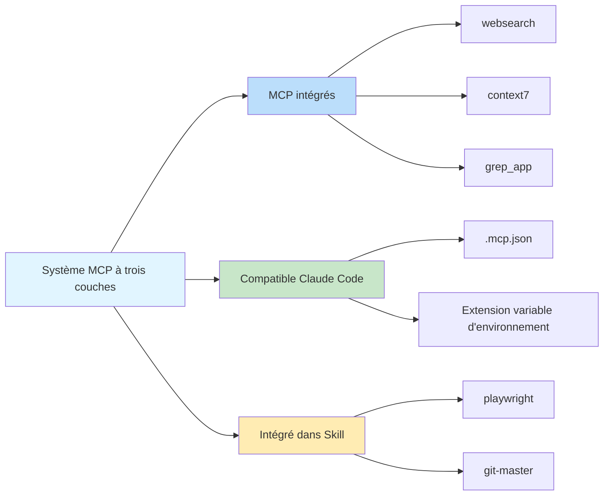

# Serveurs MCP intégrés : Recherche Web, Requête de Documentation et Recherche de Code

## Ce que vous allez apprendre

- ✅ Comprendre les 3 serveurs MCP intégrés et leurs cas d'utilisation
- ✅ Savoir comment configurer la clé API Exa Websearch
- ✅ Apprendre à désactiver les services MCP inutiles
- ✅ Comprendre l'architecture et les principes de fonctionnement du système MCP à trois couches

## Votre défi actuel

Les agents IA ne peuvent accéder qu'aux fichiers locaux et effectuer des requêtes réseau, mais ils manquent de capacités de recherche professionnelle et de requête de documentation. Vous souhaitez que les agents puissent :
- Rechercher sur le web en temps réel pour obtenir les dernières informations
- Consulter la documentation officielle pour des descriptions d'API précises
- Rechercher dans les dépôts GitHub pour des exemples d'implémentation

Mais implémenter ces fonctionnalités manuellement ajoute une complexité de développement.

## Quand utiliser cette approche

Lorsque vous devez étendre les capacités des agents IA :

| Scénario | MCP recommandé |
|--- | ---|
| Besoin d'obtenir les dernières informations techniques, actualités ou tendances de l'industrie | **websearch** (Exa) |
| Interroger la documentation API officielle pour des bibliothèques ou frameworks | **context7** |
| Trouver des exemples d'implémentation dans les dépôts GitHub | **grep_app** (Grep.app) |

## Concepts de base : Qu'est-ce que MCP ?

**MCP (Model Context Protocol)** est un protocole standard qui permet aux agents IA d'accéder à des outils externes et des sources de données. En termes simples :

::: info Qu'est-ce que MCP ?
MCP est comme équiper un agent IA d'une "boîte à outils" contenant divers outils professionnels (recherche, bases de données, API, etc.). Les agents peuvent appeler ces outils à la demande pour accéder à des capacités non disponibles localement.
:::

Oh-My-OpenCode fournit un **système MCP à trois couches** :



**Cette leçon se concentre sur la première couche : les serveurs MCP intégrés.**

---

## Trois serveurs MCP intégrés

Oh-My-OpenCode inclut 3 serveurs MCP distants qui fonctionnent immédiatement (certains nécessitent une configuration de clé API).

### 1. websearch (Exa AI)

**Fonction** : Recherche web en temps réel propulsée par [Exa AI](https://exa.ai).

**Cas d'utilisation** :
- Rechercher les derniers articles techniques et actualités
- Trouver des solutions à des problèmes spécifiques
- Obtenir les tendances de l'industrie et les meilleures pratiques

**Configuration requise** :

Vous devez définir la variable d'environnement `EXA_API_KEY` :

::: code-group

```bash [macOS/Linux]
export EXA_API_KEY="your-api-key-here"
```

```powershell [Windows]
setx EXA_API_KEY "your-api-key-here"
```

:::

::: tip Obtenir la clé API Exa
1. Visitez [Exa AI](https://exa.ai)
2. Créez un compte
3. Créez une clé API dans le Dashboard
4. Ajoutez la clé aux variables d'environnement
:::

**Emplacement source** : `src/mcp/websearch.ts` (lignes 1-11)

---

### 2. context7

**Fonction** : Requête de documentation officielle, supportant n'importe quelle bibliothèque ou framework de programmation.

**Cas d'utilisation** :
- Interroger la documentation API pour React, Vue, Next.js, etc.
- Obtenir la documentation officielle pour les runtimes comme Node.js, Python
- Consulter les guides d'utilisation des projets open source

**Configuration requise** : Aucune configuration requise, fonctionne immédiatement.

**Emplacement source** : `src/mcp/context7.ts` (lignes 1-7)

---

### 3. grep_app (Grep.app)

**Fonction** : Recherche de code GitHub ultra-rapide pour trouver des exemples d'implémentation.

**Cas d'utilisation** :
- Trouver des implémentations de motifs spécifiques dans des projets open source
- Apprendre comment d'autres écrivent du code
- Trouver des extraits de code pour résoudre des problèmes spécifiques

**Configuration requise** : Aucune configuration requise, fonctionne immédiatement.

**Emplacement source** : `src/mcp/grep-app.ts` (lignes 1-7)

---

## Configuration et désactivation des MCP

### Comportement par défaut

Tous les serveurs MCP intégrés sont **activés par défaut**. Oh-My-OpenCode enregistre automatiquement ces services au démarrage.

### Désactivation des MCP inutiles

Si certains services MCP ne sont pas nécessaires, vous pouvez les désactiver dans le fichier de configuration :

```jsonc

// ~/.config/opencode/oh-my-opencode.json ou .opencode/oh-my-opencode.json
{
  "$schema": "./assets/oh-my-opencode.schema.json",

  // Désactiver les serveurs MCP inutiles
  "disabled_mcps": [
    "websearch",    // Désactiver la recherche web (si vous n'avez pas de clé API Exa)
    "grep_app"      // Désactiver la recherche de code GitHub
  ]
}
```

::: warning Pourquoi désactiver les MCP ?
Désactiver les MCP inutiles peut :
1. **Économiser des ressources** : Réduire les connexions et requêtes inutiles
2. **Simplifier la configuration** : Éviter les invites pour les clés API non définies
3. **Améliorer la stabilité** : Réduire les points potentiels de défaillance réseau
:::

### Priorité de configuration

La priorité de configuration de désactivation pour les MCP intégrés :

| Emplacement de configuration | Priorité |
|--- | ---|
| Config utilisateur `~/.config/opencode/oh-my-opencode.json` | Élevée (remplace la config projet) |
| Config projet `.opencode/oh-my-opencode.json` | Moyenne |
| Valeur par défaut du code | Faible (tous activés) |

---

## Comment cela fonctionne : Configuration MCP distant

Tous les serveurs MCP intégrés utilisent le **mode distant (distant)**, se connectant aux services externes via le protocole HTTP/SSE.

**Mode de configuration** (définition du code source) :

```typescript
// src/mcp/websearch.ts
export const websearch = {
  type: "remote" as const,        // Fixé à "remote"
  url: "https://mcp.exa.ai/mcp?tools=web_search_exa",  // Adresse du serveur MCP
  enabled: true,                   // Statut activé (remplacé par disabled_mcps)
  headers: process.env.EXA_API_KEY  // En-têtes de requête HTTP optionnels (clé API)
    ? { "x-api-key": process.env.EXA_API_KEY }
    : undefined,
  oauth: false as const,            // Désactiver la détection automatique OAuth
}
```

**Descriptions des champs de configuration** :

| Champ | Type | Description |
|--- | --- | ---|
| `type` | `"remote"` | Valeur fixe, indiquant un MCP distant |
| `url` | `string` | Adresse HTTP du serveur MCP |
| `enabled` | `boolean` | Si activé (fixé à `true` dans le code, contrôlé par `disabled_mcps`) |
| `headers` | `object` | En-têtes de requête HTTP optionnels (pour l'authentification) |
| `oauth` | `false` | Désactiver la détection automatique OAuth (Exa utilise une clé API) |

---

## Pièges courants

### Piège 1 : websearch nécessite une clé API

**Symptôme** : L'agent échoue lors de la tentative d'utilisation de websearch, demandant une clé API manquante.

**Solution** :

```bash
# Vérifier si la variable d'environnement est définie
echo $EXA_API_KEY

# Si vide, définir la clé API
export EXA_API_KEY="your-actual-api-key"

# Ou ajouter de manière permanente à la config shell (~/.bashrc, ~/.zshrc, etc.)
echo 'export EXA_API_KEY="your-actual-api-key"' >> ~/.zshrc
```

::: tip Vérifier la clé API
Après configuration, vous pouvez redémarrer OpenCode ou exécuter la commande de diagnostic pour vérifier :
```bash
oh-my-opencode doctor --verbose
```
:::

### Piège 2 : MCP toujours demandé après désactivation

**Symptôme** : Même après avoir désactivé un MCP, l'agent essaie toujours de l'utiliser.

**Solution** :

1. Vérifier si le chemin du fichier de configuration est correct :
   - Config utilisateur : `~/.config/opencode/oh-my-opencode.json`
   - Config projet : `.opencode/oh-my-opencode.json`

2. Confirmer que le format JSON est correct (attention aux virgules et guillemets) :

```jsonc
{
  "disabled_mcps": ["websearch"]  // ✅ Correct
  // "disabled_mcps": ["websearch"],  // ❌ Erreur : virgule finale non autorisée
}
```

3. Redémarrer OpenCode pour que la configuration prenne effet.

### Piège 3 : Résultats Grep.app inexacts

**Symptôme** : grep_app renvoie des résultats qui ne correspondent pas aux attentes.

**Causes possibles** :
- Mots-clés de recherche trop génériques
- Dépôt cible inactif ou supprimé
- Syntaxe de recherche incorrecte

**Solution** :
- Utiliser des termes de recherche plus spécifiques
- Spécifier le type de fichier ou le langage lors de la recherche
- Visiter [Grep.app](https://grep.app) directement pour vérifier manuellement

---

## Résumé

Cette leçon a présenté les 3 serveurs MCP intégrés d'Oh-My-OpenCode :

| MCP | Fonction | Configuration requise | Utilisation principale |
|--- | --- | --- | ---|
| **websearch** | Recherche web en temps réel | EXA_API_KEY | Obtenir les dernières informations |
| **context7** | Requête de documentation officielle | Aucune | Consulter la documentation API |
| **grep_app** | Recherche de code GitHub | Aucune | Trouver des exemples d'implémentation |

**Points clés à retenir** :

1. **Système MCP à trois couches** : Intégré → Compatible Claude Code → Intégré dans Skill
2. **Activé par défaut** : Tous les MCP intégrés sont activés par défaut et peuvent être désactivés via `disabled_mcps`
3. **Mode distant** : Tous les MCP intégrés utilisent le protocole HTTP/SSE pour se connecter aux services externes
4. **Exa nécessite une clé** : websearch nécessite la variable d'environnement `EXA_API_KEY`

Ces serveurs MCP étendent considérablement les capacités des agents IA, leur permettant d'accéder à des informations en temps réel et à des bases de connaissances professionnelles.

---

## Annexe : Référence du code source

<details>
<summary><strong>Cliquer pour développer les emplacements du code source</strong></summary>

> Mis à jour : 2026-01-26

| Fonction | Chemin du fichier | Numéros de ligne |
|--- | --- | ---|
| Fonction de fabrique MCP | [`src/mcp/index.ts`](https://github.com/code-yeongyu/oh-my-opencode/blob/main/src/mcp/index.ts) | 22-32 |
| Configuration websearch | [`src/mcp/websearch.ts`](https://github.com/code-yeongyu/oh-my-opencode/blob/main/src/mcp/websearch.ts) | 1-11 |
| Configuration context7 | [`src/mcp/context7.ts`](https://github.com/code-yeongyu/oh-my-opencode/blob/main/src/mcp/context7.ts) | 1-7 |
| Configuration grep_app | [`src/mcp/grep-app.ts`](https://github.com/code-yeongyu/oh-my-opencode/blob/main/src/mcp/grep-app.ts) | 1-7 |
| McpNameSchema | [`src/mcp/types.ts`](https://github.com/code-yeongyu/oh-my-opencode/blob/main/src/mcp/types.ts) | 1-10 |
| Champ disabled_mcps | [`src/config/schema.ts`](https://github.com/code-yeongyu/oh-my-opencode/blob/main/src/config/schema.ts) | 331 |

**Constantes clés** :
- `allBuiltinMcps` : Objet de configuration MCP intégré, incluant websearch, context7, grep_app (`src/mcp/index.ts:16-20`)

**Fonctions clés** :
- `createBuiltinMcps(disabledMcps)` : Créer la liste des MCP activés, filtrant les MCP désactivés (`src/mcp/index.ts:22-32`)

</details>
