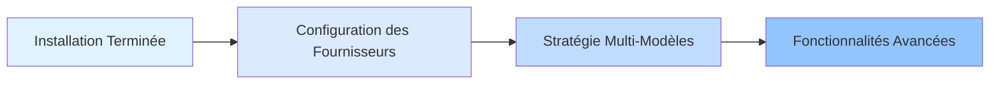

# Plateformes et Intégrations

Ce chapitre présente comment configurer et gérer plusieurs fournisseurs IA (Anthropic, OpenAI, Google, GitHub Copilot, etc.), ainsi que le mécanisme de basculement automatique multi-modèles d'oh-my-opencode.

En complétant ce chapitre, vous maîtriserez comment permettre au système de sélectionner intelligemment le modèle IA le plus approprié en fonction du type de tâche et des modèles disponibles, créant ainsi des flux de travail d'orchestration multi-modèles efficaces et fiables.

## Ce Que Couvre Ce Chapitre

Ce chapitre est divisé en deux parties :

### 1. [Configuration des Fournisseurs](provider-setup/)

Apprenez à configurer divers fournisseurs IA, notamment :
- Anthropic Claude (premier choix de l'orchestrateur principal)
- OpenAI ChatGPT (spécialisé dans la revue d'architecture)
- Google Gemini (analyse frontend et multimédia)
- GitHub Copilot (fournisseur de secours)
- Z.ai Coding Plan et OpenCode Zen (services optionnels)

**Ce Que Vous Apprendrez** :
- ✅ Configurer 6 fournisseursurs IA principaux
- ✅ Utiliser l'installateur interactif pour une configuration rapide
- ✅ Spécifier les modèles les plus appropriés pour différents agents
- ✅ Utiliser la commande `doctor` pour diagnostiquer les problèmes de configuration

**Temps Estimé** : 25-30 minutes

### 2. [Stratégie Multi-Modèles](model-resolution/)

Plongez en profondeur dans le mécanisme de priorité en trois étapes du système de résolution de modèles :
- Remplacement par l'utilisateur (contrôle précis)
- Basculement de fournisseur (tolérance aux pannes automatique)
- Valeur par défaut du système (solution de repli)

**Ce Que Vous Apprendrez** :
- ✅ Comprendre le flux de travail complet de la résolution de modèles
- ✅ Spécifier manuellement des modèles en fonction des exigences de la tâche
- ✅ Tirer parti du basculement de fournisseur pour améliorer la robustesse du système
- ✅ Diagnostiquer et résoudre les problèmes de résolution de modèles

**Temps Estimé** : 30-35 minutes

## Parcours d'Apprentissage Recommandé

Nous recommandons de suivre cet ordre lors de l'apprentissage de ce chapitre :

**Pourquoi cet ordre ?**

1. **Configurer d'abord, comprendre ensuite** : Apprenez d'abord comment configurer chaque fournisseur, puis comprenez le mécanisme de résolution sous-jacent
2. **Du simple au complexe** : La configuration des fournisseurs est une opération de base, la stratégie multi-modèles est un concept avancé
3. **La pratique valide la théorie** : Après avoir configuré les fournisseurs, vous pouvez utiliser la commande `doctor` pour vérifier l'efficacité de la stratégie multi-modèles

::: tip Parcours Rapide
Si vous souhaitez simplement démarrer rapidement, vous pouvez compléter les étapes 1-4 de la [Configuration des Fournisseurs](provider-setup/) (configurer les fournisseurs de base), et apprendre le reste du contenu ultérieurement selon vos besoins.
:::

## Prérequis

Avant d'apprendre ce chapitre, veuillez vous assurer que :

- ✅ Avez terminé [l'Installation et la Configuration Initiale](../installation/)
- ✅ Avez installé OpenCode (version >= 1.0.150)
- ✅ Comprenez les formats de fichiers de configuration JSON/JSONC de base
- ✅ Possédez au moins un abonnement à un compte de fournisseur IA (Anthropic Claude recommandé)

::: warning Que faire si je n'ai pas de compte fournisseur ?
Vous pouvez apprendre les étapes de configuration sans vous connecter réellement à un fournisseur. Le système utilisera le modèle par défaut d'OpenCode comme solution de repli.
:::

## Questions Fréquentes

<strong>Dois-je configurer tous les fournisseurs ?</strong>

Non. Vous pouvez configurer uniquement les fournisseurs que vous utilisez le plus (par exemple, uniquement Anthropic Claude). Le mécanisme de basculement de fournisseur d'oh-my-opencode utilisera automatiquement les fournisseurs disponibles.

Cependant, si vous souhaitez tirer pleinement parti des avantages de l'orchestration multi-modèles, nous recommandons de configurer au moins 2-3 fournisseurs, afin que le système puisse sélectionner automatiquement le modèle le plus approprié en fonction du type de tâche.

<strong>Quelle est la différence entre la configuration des fournisseurs et la résolution des modèles ?</strong>

- **Configuration des Fournisseurs** : L'"étape d'installation", indiquant au système quels services IA vous avez disponibles
- **Résolution des Modèles** : La "logique de décision", comment le système sélectionne quel fournisseur utiliser pour chaque agent

Analogie : La configuration des fournisseurs est "recruter des membres de l'équipe", la résolution des modèles est "attribuer des tâches".

<strong>Puis-je modifier la configuration à tout moment ?</strong>

Vous pouvez modifier le fichier de configuration à tout moment :
- Configuration utilisateur : `~/.config/opencode/oh-my-opencode.json`
- Configuration projet : `.opencode/oh-my-opencode.json`

Les modifications prennent effet automatiquement la prochaine fois que vous utilisez un agent. Si vous avez modifié l'authentification d'un fournisseur, vous devez exécuter `opencode auth login` pour vous réauthentifier.

## Étapes Suivantes

Après avoir terminé ce chapitre, vous pouvez :

### Parcours Recommandé : Apprendre l'Équipe d'Agents IA

Continuer à apprendre [l'Équipe d'Agents IA : Vue d'Ensemble des 10 Experts](../../advanced/ai-agents-overview/) pour comprendre comment utiliser différents agents pour des tâches spécialisées.

### Parcours Avancé : Personnalisation Approfondie

Si vous êtes déjà familiarisé avec la configuration de base, vous pouvez passer directement à [Configuration Approfondie : Gestion des Agents et des Permissions](../../advanced/advanced-configuration/) pour apprendre :
- Comment personnaliser les invites d'agents
- Comment définir les permissions et les portées d'accès des agents
- Comment créer des agents et des catégories personnalisés

### Parcours Pratique : Utiliser la Planification Prometheus

Commencer à utiliser [la Planification Prometheus : Collecte des Exigences par Entretien](../../advanced/prometheus-planning/) pour expérimenter la puissance de l'orchestration multi-modèles grâce à la collaboration réelle des agents.

---

**Pour Commencer** : Commencez votre voyage d'orchestration multi-modèles avec la [Configuration des Fournisseurs](provider-setup/) !
