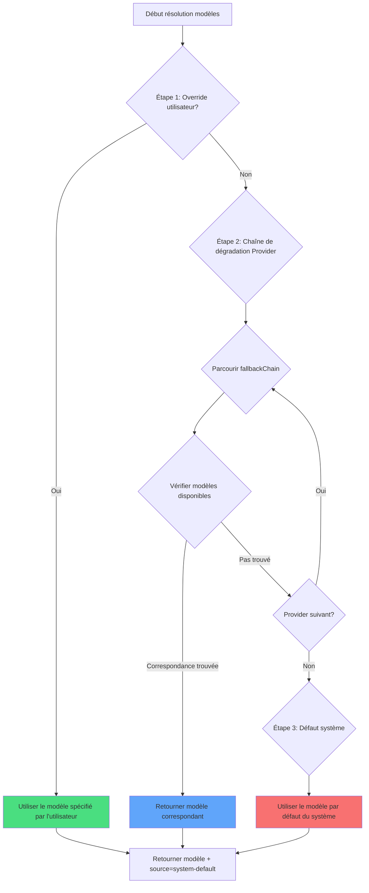

# Stratégie multi-modèles : Dégradation automatique et priorité

## Ce que vous apprendrez à faire

- Comprendre comment oh-my-opencode sélectionne automatiquement le modèle AI le plus adapté pour chaque agent
- Maîtriser le mécanisme de résolution de modèles en trois étapes (override utilisateur → dégradation Provider → défaut système)
- Apprendre à configurer les overrides de modèles pour les agents et les Categories
- Utiliser la commande `doctor` pour vérifier les résultats de résolution de modèles
- Spécifier manuellement des modèles selon les besoins de la tâche, optimiser les coûts et les performances

## Votre situation actuelle

Après avoir configuré plusieurs AI Provider (Anthropic, OpenAI, Google, etc.), vous pourriez rencontrer ces difficultés :

- **Sélection de modèle non claire** : Quels modèles utilisent vraiment les agents comme Sisyphus, Oracle ou Librarian ?
- **Configuration manuelle fastidieuse** : Chaque agent nécessite une spécification de modèle individuelle, et les changements de Provider doivent être répercutés partout
- **Coûts incontrôlables** : Impossible de savoir quelles tâches utilisent des modèles coûteux (comme Claude Opus)
- **Pannes Provider impactant l'expérience** : Quand l'API d'un Provider est down, tout le système devient inutilisable
- **Collaboration multi-modèles opaque** : Dans les tâches parallèles, on ne sait pas quels modèles utilisent les différents agents

Ces obstacles vous empêchent d'exploiter la véritable puissance de l'orchestration multi-modèles.

## Idée maîtresse

Le **système de résolution de modèles** est le "sélecteur intelligent de modèles" d'oh-my-opencode. Il détermine dynamiquement quel modèle utiliser pour chaque agent et Category selon votre configuration et les modèles disponibles.

::: info Qu'est-ce que la résolution de modèles ?
La résolution de modèles (Model Resolution) est le processus de sélection du modèle AI concret pour chaque agent ou Category au moment de l'exécution. Ce n'est pas codé en dur, mais calculé dynamiquement selon votre configuration, les Providers disponibles, les noms de modèles, etc.
:::

### Le processus de résolution en trois étapes

La résolution de modèles s'effectue via trois étapes de priorité :



**Étape 1 : User Override (Override utilisateur)**
- Si vous spécifiez explicitement le `model` d'un agent ou d'une Category dans `oh-my-opencode.json`, le système utilise directement ce modèle
- Saute la chaîne de dégradation Provider
- C'est la priorité la plus élevée

**Étape 2 : Provider Fallback (Dégradation Provider)**
- Sans override utilisateur, le système essaie selon la chaîne de priorité Provider prédéfinie
- Chaque agent ou Category possède une `fallbackChain` définissant l'ordre de ses Providers préférés
- Le système essaie chaque Provider séquentiellement jusqu'à trouver un modèle disponible

**Étape 3 : System Default (Défaut système)**
- Si aucun Provider n'a de modèle disponible, utiliser le modèle par défaut d'OpenCode
- C'est la solution de dernier recours

### Chaîne de priorité Provider des agents

Chaque agent possède son propre ordre de Providers préféré, selon son type de tâche et ses capacités requises :

| Agent | Modèle recommandé (sans préfixe) | Chaîne de priorité Provider | Variante |
|--- | --- | --- | ---|
| **Sisyphus** | `claude-opus-4-5` | anthropic → github-copilot → opencode → zai-coding-plan | max |
| **Oracle** | `gpt-5.2` | openai → anthropic → google | high |
| **Librarian** | `big-pickle` | zai-coding-plan → opencode → anthropic | - |
| **Explore** | `claude-haiku-4-5` | anthropic → opencode → github-copilot | - |
| **Multimodal Looker** | `gemini-3-flash` | google → openai → zai-coding-plan → anthropic → opencode | - |
| **Prometheus** | `claude-opus-4-5` | anthropic → github-copilot → opencode → google | max |
| **Metis** | `claude-opus-4-5` | anthropic → github-copilot → opencode → google | max |
| **Momus** | `gpt-5.2` | openai → anthropic → google | medium |
| **Atlas** | `claude-sonnet-4-5` | anthropic → github-copilot → opencode → google | - |

::: tip Pourquoi Sisyphus préfère-t-il Anthropic ?
Sisyphus est l'orchestrateur principal et nécessite de puissantes capacités de raisonnement. Claude Opus est le modèle le plus adapté aux tâches d'orchestration complexes, c'est pourquoi Anthropic est en tête de sa chaîne de priorité. Si votre quota Anthropic est insuffisant, le système dégradera automatiquement vers d'autres Providers.
:::

### Chaîne de priorité Provider des Categories

Les Categories suivent la même logique de résolution :

| Category | Modèle recommandé (sans préfixe) | Chaîne de priorité Provider | Variante |
|--- | --- | --- | ---|
| **visual-engineering** | `gemini-3-pro` | google → anthropic → openai | - |
| **ultrabrain** | `gpt-5.2-codex` | openai → anthropic → google | xhigh |
| **artistry** | `gemini-3-pro` | google → anthropic → openai | max |
| **quick** | `claude-haiku-4-5` | anthropic → google → opencode | - |
| **unspecified-low** | `claude-sonnet-4-5` | anthropic → openai → google | - |
| **unspecified-high** | `claude-opus-4-5` | anthropic → openai → google | max |
| **writing** | `gemini-3-flash` | google → anthropic → zai-coding-plan → openai | - |

::: tip L'avantage des Categories
Lorsque vous déléguez une tâche via `delegate_task(category="quick", ...)`, le système utilise automatiquement la chaîne de priorité Provider de la Category quick. Cela signifie que vous n'avez pas besoin de mémoriser la configuration de chaque agent, il suffit de choisir la Category adaptée au type de tâche.
:::

## Suivez le guide

### Étape 1 : Vérifier l'état actuel de résolution de modèles

Utilisez la commande `doctor` pour voir les résultats de résolution de modèles de chaque agent et Category :

```bash
bunx oh-my-opencode doctor --verbose
```

**Vous devriez voir** une sortie similaire à :

```
✅ Model Resolution Check
━━━━━━━━━━━━━━━━━━━━━━━━━━━━━━━━━━━━━━━━━━━━━━━━━━

Agent: sisyphus
  Requirement: claude-opus-4-5 (variant: max)
  Fallback Chain: anthropic → github-copilot → opencode → zai-coding-plan → openai → google
  User Override: (none)
  Resolved Model: anthropic/claude-opus-4-5
  Source: provider-fallback
  Variant: max

Agent: oracle
  Requirement: gpt-5.2 (variant: high)
  Fallback Chain: openai → anthropic → google
  User Override: (none)
  Resolved Model: openai/gpt-5.2
  Source: provider-fallback
  Variant: high

Category: quick
  Requirement: claude-haiku-4-5
  Fallback Chain: anthropic → google → opencode
  User Override: (none)
  Resolved Model: anthropic/claude-haiku-4-5
  Source: provider-fallback
```

Cette sortie montre :
- Les exigences de modèle de chaque agent/Category
- L'ordre de la chaîne de priorité Provider
- S'il y a une configuration d'override utilisateur
- Le modèle final résolu et sa source (override/provider-fallback/system-default)

### Étape 2 : Override manuel du modèle d'agent

Supposons que vous vouliez qu'Oracle utilise le dernier modèle d'OpenAI plutôt que le GPT-5.2 par défaut :

Éditez `~/.config/opencode/oh-my-opencode.json` ou `.opencode/oh-my-opencode.json` :

```jsonc
{
  "$schema": "https://raw.githubusercontent.com/code-yeongyu/oh-my-opencode/master/assets/oh-my-opencode.schema.json",

  "agents": {
    "oracle": {
      "model": "openai/o3"  // Override vers le modèle o3
    },
    "explore": {
      "model": "opencode/gpt-5-nano"  // Utiliser un modèle gratuit
    }
  }
}
```

::: info Priorité de l'Étape 1
Quand vous définissez `agents.oracle.model`, le système utilise directement ce modèle à l'Étape 1, sautant la chaîne de dégradation Provider. Même si le Claude Opus d'Anthropic est disponible, Oracle utilisera l'OpenAI o3 que vous avez spécifié.
:::

**Vous devriez voir** : En relançant la commande `doctor`, le résultat d'Oracle devient :

```
Agent: oracle
  Requirement: gpt-5.2 (variant: high)
  Fallback Chain: openai → anthropic → google
  User Override: openai/o3  // ← L'override utilisateur est actif
  Resolved Model: openai/o3
  Source: override  // ← La source devient override
  Variant: high
```

### Étape 3 : Override manuel du modèle de Category

Supposons que vous vouliez que la Category `quick` utilise le gratuit GPT-5 Nano :

```jsonc
{
  "$schema": "https://raw.githubusercontent.com/code-yeongyu/oh-my-opencode/master/assets/oh-my-opencode.schema.json",

  "categories": {
    "quick": {
      "model": "opencode/gpt-5-nano"  // Override vers un modèle gratuit
    },
    "visual-engineering": {
      "model": "anthropic/claude-opus-4-5"  // Forcer l'utilisation d'Opus
    }
  }
}
```

**Vous devriez voir** : Quand vous utilisez `delegate_task(category="quick", ...)`, le système utilise `opencode/gpt-5-nano` même si le Haiku d'Anthropic est disponible.

### Étape 4 : Simuler une panne Provider

Le meilleur moyen de comprendre le mécanisme de dégradation Provider est de simuler des scénarios de panne.

Supposons que vous n'ayez configuré qu'OpenAI, mais que vous vouliez voir quel modèle utilisera Sisyphus (qui préfère Anthropic) :

**Configuration actuelle** :
```jsonc
{
  // oh-my-opencode.json
  // Seul le provider openai est configuré
}
```

**Exécuter doctor** :

```
Agent: sisyphus
  Requirement: claude-opus-4-5 (variant: max)
  Fallback Chain: anthropic → github-copilot → opencode → zai-coding-plan → openai → google
  User Override: (none)
  
  // Tentative 1 : anthropic/claude-opus-4-5
  // Résultat : Non disponible (non configuré)
  
  // Tentative 2 : github-copilot/claude-opus-4-5
  // Résultat : Non disponible (non configuré)
  
  // Tentative 3 : opencode/claude-opus-4-5
  // Résultat : Non disponible (non configuré)
  
  // Tentative 4 : zai-coding-plan/glm-4.7
  // Résultat : Non disponible (non configuré)
  
  // Tentative 5 : openai/gpt-5.2-codex (depuis l'entrée 5 de fallbackChain)
  // Résultat : Trouvé !
  
  Resolved Model: openai/gpt-5.2-codex
  Source: provider-fallback
  Variant: medium
```

**Vous devriez voir** : Bien que Sisyphus préfère Claude Opus, comme Anthropic n'est pas disponible, le système a dégradé vers l'OpenAI GPT-5.2 Codex.

::: tip L'avantage de la dégradation automatique
Le mécanisme de dégradation Provider garantit la robustesse du système. Même si un Provider est en panne ou que son quota est épuisé, le système peut automatiquement basculer vers un Provider de backup, sans intervention manuelle de votre part.
:::

### Étape 5 : Vérifier le filet de sécurité du défaut système

Supposons que vous n'ayez configuré aucun Provider, ou que tous les Providers soient en panne :

**Exécuter doctor** :

```
Agent: sisyphus
  Requirement: claude-opus-4-5
  Fallback Chain: anthropic → github-copilot → ...
  
  // Toutes les tentatives de Provider ont échoué
  
  Resolved Model: anthropic/claude-opus-4-5  // Utilise le défaut système
  Source: system-default  // ← La source est system-default
  Variant: max
```

**Vous devrait voir** : Le système utilise le modèle par défaut configuré par OpenCode. C'est le dernier filet de sécurité.

## Points de contrôle ✅

Après avoir completed les étapes ci-dessus, vérifiez :

- [ ] L'exécution de `doctor --verbose` montre les résultats de résolution de modèles de tous les agents et Categories
- [ ] Après un override manuel de modèle d'agent, `Source` devient `override`
- [ ] Après un override manuel de modèle de Category, `delegate_task` utilise le modèle spécifié
- [ ] En simulant une panne Provider, le système dégrade correctement vers le Provider disponible suivant
- [ ] Quand tous les Providers sont indisponibles, le système utilise `system-default`

Si l'un de ces points n'est pas validé, vérifiez :
- Le chemin du fichier de configuration est correct (`~/.config/opencode/oh-my-opencode.json` ou `.opencode/oh-my-opencode.json`)
- Le Provider est correctement configuré (clé API, variables d'environnement, etc.)
- Le nom du modèle est correct (incluant le préfixe Provider, comme `anthropic/claude-opus-4-5`)

## Quand utiliser cette approche

| Scénario | Override manuel de modèle | Utiliser la dégradation Provider |
|--- | --- | ---|
| **Tâches sensibles aux coûts** | ✅ Spécifier un modèle économique | ❌ Peut sélectionner des modèles coûteux |
| **Tâches sensibles aux performances** | ✅ Spécifier le modèle le plus puissant | ❌ Peut dégrader vers un modèle plus faible |
| **Tester un nouveau modèle** | ✅ Spécifier un modèle expérimental | ❌ Ne sélectionne pas automatiquement |
| **Développement quotidien** | ❌ Surconfiguration | ✅ Sélection automatique optimale |
| **Panne Provider** | ❌ Nécessite une modification manuelle | ✅ Dégradation automatique |
| **Environnement multi-Provider** | ❌ Surconfiguration | ✅ Load balancing automatique |

**Règle d'or** :
- N'utilisez l'override manuel que lorsque vous avez besoin d'un contrôle précis du modèle
- Laissez le système choisir automatiquement dans les autres cas, profitant de la robustesse de la dégradation Provider
- Pour les tâches sensibles aux coûts, vous pouvez override vers la Category `quick` ou spécifier un modèle économique
- Pour les tâches nécessitant des performances maximales, vous pouvez override vers `claude-opus-4-5` ou `gpt-5.2`

## Pièges à éviter

::: warning Erreurs courantes

**1. Nom de modèle sans préfixe Provider**

```jsonc
// ❌ Erreur : Préfixe Provider manquant
{
  "agents": {
    "oracle": {
      "model": "gpt-5.2"  // Manque le préfixe openai/
    }
  }
}

// ✅ Correct : Chemin complet inclus
{
  "agents": {
    "oracle": {
      "model": "openai/gpt-5.2"  // Chemin complet du modèle
    }
  }
}
```

**2. Override d'un modèle inexistant**

```jsonc
// ❌ Erreur : Nom de modèle mal orthographié
{
  "agents": {
    "oracle": {
      "model": "openai/gpt-6"  // GPT-6 n'existe pas
    }
  }
}

// ✅ Correct : Utiliser un modèle réel
{
  "agents": {
    "oracle": {
      "model": "openai/gpt-5.2"  // Modèle réel
    }
  }
}
```

**3. Ignorer la configuration Variant**

Certains agents et Categories ont des Variant recommandés (comme `max`, `high`, `medium`), qui affectent les capacités de raisonnement du modèle. Soyez attentif aux overrides manuels :

```jsonc
// ✅ Recommandé : Conserver le Variant par défaut
{
  "agents": {
    "oracle": {
      "model": "openai/gpt-5.2"
      // Variant sera hérité de fallbackChain : high
    }
  }
}

// ✅ Optionnel : Spécifier Variant manuellement
{
  "agents": {
    "oracle": {
      "model": "openai/gpt-5.2",
      "variant": "max"  // Override de la valeur par défaut
    }
  }
}
```

**4. Dépendre sur le défaut système sans configurer de Provider**

Le modèle par défaut du système provient de la configuration d'OpenCode. Si vous n'avez configuré aucun Provider, OpenCode peut aussi utiliser un modèle par défaut, mais ce modèle peut ne pas être celui que vous voulez.

**Recommandations** :
- Configurez au moins un Provider (Anthropic, OpenAI, Google, etc.)
- Utilisez régulièrement la commande `doctor` pour vérifier les résultats de résolution de modèles
:::

## Résumé de la leçon

Le système de résolution de modèles实现了 une sélection intelligente via le mécanisme de priorité en trois étapes :

- **Étape 1 : User Override** : Votre modèle spécifié a la priorité la plus élevée, totalement sous contrôle
- **Étape 2 : Provider Fallback** : Dégradation automatique selon la chaîne de priorité prédéfinie, garantissant la robustesse
- **Étape 3 : System Default** : Solution de dernier recours, assurant qu'un modèle est toujours disponible

Chaque agent et Category possède sa propre chaîne de priorité Provider, conçue selon le type de tâche et les capacités requises de l'agent. Sisyphus préfère Anthropic (raisonnement complexe), Oracle préfère OpenAI (conseil stratégique), Librarian préfère zai-coding-plan (recherche multi-dépôts).

Rappelez-vous :
- **Développement quotidien** : Laissez le système choisir automatiquement, profitant de la dégradation Provider
- **Contrôle précis** : Override manuel de modèle, optimisation des coûts et performances
- **Récupération après panne** : La dégradation Provider gère automatiquement, sans intervention humaine
- **Outil de vérification** : Utilisez la commande `doctor` pour vérifier les résultats de résolution de modèles

## Aperçu du prochain cours

> Dans le prochain cours, nous apprendrons **[Équipe d'agents AI : Présentation des 10 experts](../../advanced/ai-agents-overview/)**.
>
> Vous apprendrez :
> - Les fonctionnalités, cas d'utilisation et configurations de permissions des 10 agents intégrés
> - Comment choisir l'agent adapté selon le type de tâche
> - Les modes de collaboration et bonnes pratiques entre agents

---

## Annexe : Référence du code source

<details>
<summary><strong>Cliquez pour voir l'emplacement du code source</strong></summary>

> Date de mise à jour : 2026-01-26

| Fonction | Chemin du fichier | Ligne |
|--- | --- | ---|
| Fonction cœur de résolution de modèles | [`src/shared/model-resolver.ts`](https://github.com/code-yeongyu/oh-my-opencode/blob/main/src/shared/model-resolver.ts) | 43-98 |
| Définition des exigences de modèle des agents | [`src/shared/model-requirements.ts`](https://github.com/code-yeongyu/oh-my-opencode/blob/main/src/shared/model-requirements.ts) | 12-79 |
| Définition des exigences de modèle des Categories | [`src/shared/model-requirements.ts`](https://github.com/code-yeongyu/oh-my-opencode/blob/main/src/shared/model-requirements.ts) | 81-133 |
| Résolution de modèles à la création des agents | [`src/agents/utils.ts`](https://github.com/code-yeongyu/oh-my-opencode/blob/main/src/agents/utils.ts) | 203-208, 245-250, 284-289 |
| Résolution de modèles lors de la délégation de Category | [`src/tools/delegate-task/tools.ts`](https://github.com/code-yeongyu/oh-my-opencode/blob/main/src/tools/delegate-task/tools.ts) | 532-540 |
| Vérification de résolution de modèles de la commande doctor | [`src/cli/doctor/checks/model-resolution.ts`](https://github.com/code-yeongyu/oh-my-opencode/blob/main/src/cli/doctor/checks/model-resolution.ts) | 130-160 |

**Définitions de types clés** :
- `ModelResolutionInput` : Paramètres d'entrée de résolution de modèles (`src/shared/model-resolver.ts:6-10`)
- `ExtendedModelResolutionInput` : Entrée de résolution de modèles étendue, contenant fallbackChain et availableModels (`src/shared/model-resolver.ts:23-28`)
- `ModelResolutionResult` : Résultat de résolution de modèles, contenant model, source, variant (`src/shared/model-resolver.ts:17-21`)
- `ModelSource` : Énumération de source de modèle (override/provider-fallback/system-default) (`src/shared/model-resolver.ts:12-16`)
- `FallbackEntry` : Entrée de chaîne de dégradation Provider, contenant providers, model, variant (`src/shared/model-requirements.ts:1-5`)
- `ModelRequirement` : Définition d'exigence de modèle, contenant fallbackChain et variant par défaut (`src/shared/model-requirements.ts:7-10`)

**Constantes clés** :
- `AGENT_MODEL_REQUIREMENTS` : Définitions d'exigences de modèles de tous les agents, contenant fallbackChain (`src/shared/model-requirements.ts:12-79`)
- `CATEGORY_MODEL_REQUIREMENTS` : Définitions d'exigences de modèles de toutes les Categories (`src/shared/model-requirements.ts:81-133`)

**Fonctions clés** :
- `resolveModelWithFallback()` : Fonction cœur de résolution de modèles, implémentant le mécanisme de priorité en trois étapes (`src/shared/model-resolver.ts:43-98`)
- `resolveModel()` : Résolution de modèles simple, pour les situations sans fallbackChain (`src/shared/model-resolver.ts:35-41`)
- `normalizeModel()` : Normalisation du nom de modèle, suppression des espaces (`src/shared/model-resolver.ts:30-33`)
- `createBuiltinAgents()` : À la création de tous les agents intégrés, appelle le résolveur de modèles pour déterminer le modèle (`src/agents/utils.ts:143-313`)

**Règles métier** :
| ID règle | Description de la règle | Marqueur |
|--- | --- | ---|
| BR-4.1-7 | Priorité de résolution de modèles : override utilisateur > dégradation Provider > défaut système | 【Fait】 |
| BR-4.1-7-1 | En cas d'override utilisateur, retour direct, saut de la chaîne de dégradation Provider | 【Fait】 |
| BR-4.1-7-2 | En dégradation Provider, essayer chaque Provider selon l'ordre de fallbackChain | 【Fait】 |
| BR-4.1-7-3 | En dégradation Provider, vérifier le cache availableModels, si vide vérifier connectedProviders | 【Fait】 |
| BR-4.1-7-4 | Quand tous les Providers sont indisponibles, utiliser systemDefaultModel | 【Fait】 |
| BR-4.1-7-5 | fallbackChain de Sisyphus : anthropic → github-copilot → opencode → zai-coding-plan → openai → google | 【Fait】 |
| BR-4.1-7-6 | fallbackChain d'Oracle : openai → anthropic → google | 【Fait】 |
| BR-4.1-7-7 | fallbackChain de Librarian : zai-coding-plan → opencode → anthropic | 【Fait】 |
| BR-4.1-7-8 | fallbackChain d'Explore : anthropic → opencode → github-copilot | 【Fait】 |
| BR-4.1-7-9 | fallbackChain de Multimodal Looker : google → openai → zai-coding-plan → anthropic → opencode | 【Fait】 |

</details>
