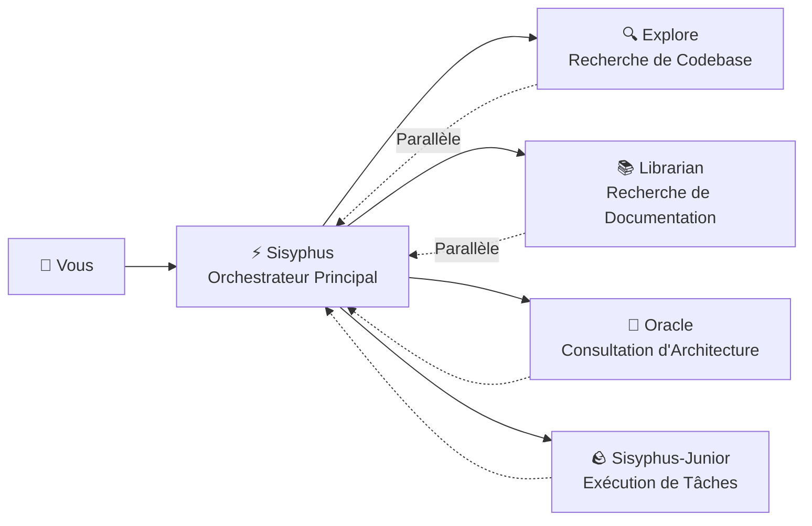

# Orchestrateur Principal : Penser et Exécuter comme un Ingénieur Senior

## Ce que vous allez apprendre

- Comprendre comment Sisyphus coordonne le travail comme une vraie équipe de développement
- Maîtriser les meilleures pratiques de délégation de tâches, permettant à différents agents experts de collaborer pour accomplir des tâches complexes
- Apprendre à améliorer considérablement l'efficacité du développement grâce aux tâches parallèles en arrière-plan
- Savoir quand laisser les agents gérer eux-mêmes les tâches et quand déléguer aux experts

## Vos difficultés actuelles

Vous avez peut-être rencontré ces problèmes :

- Les agents IA "abandonnent en cours de route" et oublient leurs objectifs pendant l'écriture
- Le même fichier est modifié à plusieurs reprises, nécessitant une relecture du contexte à chaque fois
- Vous voulez que l'IA gère de nombreuses tâches mais ne pouvez les mettre en file qu'une par une
- Les agents écrivent du code, mais vous devez toujours vérifier s'il est correct et s'il ne casse pas d'autres fonctionnalités

**Cause racine** : Vous demandez à un "touche-à-tout" de faire tout le travail, mais seuls les experts comprennent vraiment les tâches spécialisées.

## Quand utiliser ceci

Sisyphus est votre orchestrateur principal, adapté à ces scénarios :

| Scénario | Adapté | Alternative |
|----------|----------|-------------|
| Développement de fonctionnalités complexes (3+ étapes) | ✅ Fortement recommandé | Prometheus + Atlas (nécessite une planification détaillée) |
| Correction rapide de bugs connus | ✅ Approprié | Laissez Sisyphus le gérer directement |
| Besoin de rechercher plusieurs dépôts/docs | ✅ Fortement recommandé | Utilisez la délégation parallèle de Sisyphus |
| Modifications simples de fichiers uniques | ✅ Acceptable | Édition directe (plus simple) |
| Besoin d'une planification détaillée du projet | ⚠️ Non recommandé | Utilisez Prometheus pour générer le plan d'abord |

## Concepts fondamentaux

**Sisyphus** est l'agent orchestrateur principal qui coordonne plusieurs experts IA comme une vraie équipe de développement. Grâce aux mécanismes de séparation des responsabilités et de délégation parallèle, il permet aux sous-agents professionnels de tirer parti de leurs forces respectives, réalisant une collaboration efficace.

Sisyphus n'est pas une "IA plus intelligente" — c'est un **système d'orchestration**.

### Séparation des responsabilités



**Sisyphus n'écrit pas de code**. Il est responsable de :

1. **Comprendre vos vrais besoins** (pas seulement les demandes superficielles)
2. **Déterminer qui est le mieux placé pour la tâche** (pas tout faire lui-même)
3. **Déléguer les tâches en parallèle** (laisser plusieurs experts travailler simultanément)
4. **Vérifier les résultats** (ne jamais faire aveuglément confiance à "c'est fini")

### Pourquoi le nom Sisyphus ?

Dans la mythologie grecque, Sisyphe a été puni à pousser éternellement un rocher jusqu'en haut d'une montagne.

La philosophie de conception de ce système : **Les agents doivent compléter tous les TODOs (finir de pousser le rocher) avant de pouvoir s'arrêter**.

::: info
Ce n'est pas une punition — c'est un mécanisme d'assurance qualité. Vous ne voulez pas que l'IA abandonne en cours de route et laisse un désordre derrière elle.
:::

### Budget de réflexion de 32k

Sisyphus utilise **Claude Opus 4.5 + budget de réflexion de 32k**.

Quel est l'avantage ?

| Budget faible (Pas de réflexion) | Budget de réflexion de 32k |
|--------------------------|---------------------|
| Commence à écrire du code directement | Analyse d'abord profondément les exigences, évalue la complexité, décompose les tâches |
| Susceptible de manquer les cas limites | Identifie de manière proactive les problèmes et risques potentiels |
| Réalise qu'il est sur la mauvaise piste à mi-chemin | Choisit l'approche optimale dès le départ |

::: tip
Fortement recommandé de configurer le modèle **Opus 4.5** pour Sisyphus. L'expérience sera considérablement pire avec d'autres modèles.
:::

## Suivez le guide

### Étape 1 : Créer un projet de test

**Pourquoi**
Vous avez besoin d'un projet exécutable pour observer le comportement de Sisyphus.

```bash
mkdir my-app && cd my-app
npm create next-app@latest . -- --typescript --tailwind --eslint --no-src-dir
npm install
```

**Vous devriez voir** : Initialisation du projet terminée, vous pouvez exécuter `npm run dev` pour démarrer.

### Étape 2 : Donner à Sisyphus une tâche complexe

Ouvrez le projet dans OpenCode et entrez :

```
Ajoutez la fonctionnalité de connexion utilisateur, incluant :
- Connexion par email/mot de passe
- Stockage de jeton JWT
- Routes protégées
- Vérification du statut de connexion
```

Observez la réponse de Sisyphus.

**Vous devriez voir** :

1. Sisyphus ne commence pas immédiatement à écrire du code
2. Il crée d'abord une liste de TODO (décomposition détaillée des tâches)
3. Évalue les modèles de codebase (vérifie la configuration, la structure des fichiers)
4. Peut vous poser quelques questions de clarification

**Point de contrôle ✅** : Vérifiez le panneau TODO d'OpenCode, vous devriez voir quelque chose comme :

```
□ Installer les dépendances nécessaires (bcrypt, jsonwebtoken)
□ Créer le modèle utilisateur et les définitions de types
□ Implémenter le point de terminaison API de connexion
□ Créer les utilitaires de signature et vérification JWT
□ Ajouter le middleware de route protégée
□ Implémenter le formulaire de connexion frontend
□ Ajouter la gestion de l'état de connexion
```

### Étape 3 : Observer la délégation parallèle (Moment critique)

Pendant l'implémentation, Sisyphus peut :

```
[Tâche en arrière-plan démarrée]
- ID de tâche : bg_abc123
- Agent : explore
- Prompt : "Trouver les modèles d'authentification existants dans cette codebase..."

[Tâche en arrière-plan démarrée]
- ID de tâche : bg_def456
- Agent : librarian
- Prompt : "Rechercher les meilleures pratiques JWT pour Next.js..."
```

**C'est la clé** : Sisyphus **n'attend pas** que ces tâches se terminent — il continue à travailler.

Lorsqu'il a besoin des résultats, il appelle `background_output(task_id="...")` pour les récupérer.

**Pourquoi est-ce plus rapide ?**

| Approche séquentielle (Traditionnelle) | Approche parallèle (Sisyphus) |
|-------------------------------|------------------------------|
| Recherche de codebase (2 min) | ⏳ Recherche de codebase (2 min) |
| En attente... | ⏳ Recherche de documentation (2 min, simultanée) |
| Recherche de documentation (2 min) | Commencer l'implémentation (total 2 min) |
| Commencer l'implémentation (2 min) |  |
| **Total : 6 min** | **Total : 4 min (33% d'économie)** |

### Étape 4 : Mécanisme de vérification

Lorsque Sisyphus déclare "tâche terminée", il va :

1. Exécuter `lsp_diagnostics` pour vérifier les erreurs
2. Exécuter `npm run build` pour s'assurer que le build passe
3. Exécuter la suite de tests si des tests existent
4. Marquer le TODO comme `completed`

**Point de contrôle ✅** : Vérifiez la sortie du terminal, vous devriez voir quelque chose comme :

```
✓ Exécution des diagnostics sur les fichiers modifiés...
✓ Aucune erreur trouvée
✓ Build réussi (code de sortie 0)
✓ Tous les tests passés
```

Si une vérification échoue, Sisyphus corrigera immédiatement — ne laissant jamais un désordre derrière lui.

### Étape 5 : Pièges courants

#### ❌ Mauvaise pratique : Interrompre le suivi TODO de Sisyphus

Vous voyez Sisyphus travailler sur les tâches et vous êtes impatient :

```
Dépêche-toi d'écrire du code ! Arrête de planifier !
```

**Problème** : Sisyphus va sauter les TODOs et écrire du code directement, risquant de manquer les cas limites.

**Bonne pratique** :

```
Attendez que Sisyphus termine la planification. Si vous pensez que le plan est incorrect, donnez des suggestions d'amélioration spécifiques :
"L'étape 3 du TODO devrait d'abord considérer le plan de migration de base de données."
```

#### ❌ Mauvaise pratique : Ne pas laisser Sisyphus déléguer

Vous désactivez tous les agents experts dans la configuration, ne laissant que Sisyphus.

**Problème** : Sisyphus essaiera de tout faire lui-même, mais peut ne pas être assez professionnel.

**Bonne pratique** :

Gardez la configuration par défaut et laissez Sisyphus déléguer automatiquement aux experts :

| Tâche | Sisyphus lui-même | Déléguer à l'expert |
|------|-----------------|-------------------|
| Modification simple de fichier unique | ✅ OK | Pas nécessaire |
| Recherche de codebase | ⚠️ Lent | ✅ Explore (plus rapide) |
| Recherche de documentation | ⚠️ Peut être inexact | ✅ Librarian (plus professionnel) |
| Décisions d'architecture | ❌ Non recommandé | ✅ Oracle (plus autoritaire) |

## Résumé de la leçon

La puissance de Sisyphus ne vient pas d'être "plus intelligent", mais de :

1. **Séparation des responsabilités** : Orchestrateur principal + équipe professionnelle, pas travailler seul
2. **Réflexion approfondie** : Budget de réflexion de 32k assure qu'aucun détail n'est manqué
3. **Exécution parallèle** : Tâches en arrière-plan laissent plusieurs experts travailler simultanément
4. **Vérification obligatoire** : Pas de preuve = tâche non terminée
5. **Suivi TODO** : Abandonner en cours de route n'est pas autorisé

**Principes fondamentaux** :

::: tip
**Déléguer par défaut** : Sauf si la tâche est extrêmement simple (fichier unique, emplacement connu), priorisez la délégation aux experts ou l'utilisation de Category+Skill.
:::

## Aperçu de la leçon suivante

> Dans la leçon suivante, nous apprendrons le **[Mode Ultrawork](../ultrawork-mode/)** pour activer toutes les fonctionnalités en un clic, laissant Sisyphus donner tout son potentiel pour accomplir des tâches complexes.
>
> Vous apprendrez :
> - Comment démarrer rapidement les tâches en utilisant le mot-clé `ultrawork`
> - Quelles capacités supplémentaires le mode Ultrawork active
> - Quand utiliser Ultrawork vs quand utiliser Prometheus

---

## Annexe : Référence du code source

<details>
<summary><strong>Cliquez pour développer les emplacements du code source</strong></summary>

> Dernière mise à jour : 2026-01-26

| Fonctionnalité | Chemin du fichier | Lignes |
|---------|-----------|-------|
| Fabrique d'agent Sisyphus | [`src/agents/sisyphus.ts`](https://github.com/code-yeongyu/oh-my-opencode/blob/main/src/agents/sisyphus.ts) | 419-450 |
| Prompt principal de Sisyphus | [`src/agents/sisyphus.ts`](https://github.com/code-yeongyu/oh-my-opencode/blob/main/src/agents/sisyphus.ts) | 17-416 |
| Métadonnées d'agent et configuration de modèle | [`src/agents/AGENTS.md`](https://github.com/code-yeongyu/oh-my-opencode/blob/main/src/agents/AGENTS.md) | 24-36 |
| Restrictions de permissions d'outils | [`src/agents/AGENTS.md`](https://github.com/code-yeongyu/oh-my-opencode/blob/main/src/agents/AGENTS.md) | 44-51 |

**Configuration clé** :
- **Budget de réflexion** : 32k tokens (modèles Anthropic uniquement)
- **Température** : 0.1 (agents de code à température basse fixe)
- **Max Tokens** : 64000
- **Modèle recommandé** : anthropic/claude-opus-4-5

**Flux de travail principal** (à partir du code source) :
- **Phase 0** : Porte d'intention (classification d'intention, lignes 53-103)
- **Phase 1** : Évaluation de la codebase (évaluation de la codebase, lignes 107-130)
- **Phase 2A** : Exploration et recherche (lignes 132-172)
- **Phase 2B** : Implémentation (lignes 176-263)
- **Phase 2C** : Récupération d'échec (lignes 266-283)
- **Phase 3** : Achèvement (lignes 286-302)

**Contraintes clés** :
- **Les tâches non triviales doivent créer un TODO** (ligne 311)
- **Les tâches en arrière-plan doivent être parallèles** (lignes 144-162)
- **Doit vérifier les résultats** (lignes 254-262)

</details>
