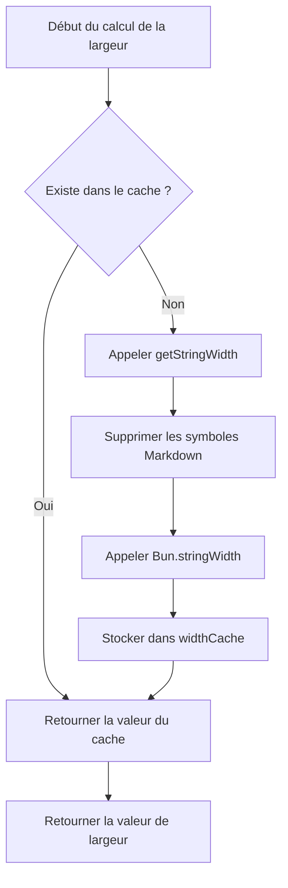

# Détails techniques : Mécanisme de cache et optimisation des performances

## Ce que vous apprendrez

- Comprendre comment le mécanisme de cache du plugin améliore les performances
- Maîtriser la structure de données et l'utilisation de widthCache
- Comprendre les conditions de déclenchement du nettoyage automatique du cache
- Savoir comment analyser l'effet de l'optimisation des performances

## Votre problème actuel

Vous vous demandez peut-être :

> Comment le plugin calcule-t-il rapidement la largeur des tableaux ? Pourquoi le traitement de grands tableaux reste-t-il fluide ? Comment le mécanisme de cache est-il conçu ?

Cette leçon analyse en profondeur l'implémentation interne du plugin, vous emmenant à comprendre la conception du mécanisme de cache et les stratégies d'optimisation des performances.

## Idée principale

### Pourquoi utiliser un cache ?

Lors du formatage de tableaux Markdown, le plugin doit calculer la **largeur d'affichage** (display width) de chaque cellule. Ce calcul implique :

1. **Suppression des symboles Markdown** : comme `**gras**`, `*italique*`, `~~barré~~`
2. **Protection du code en ligne** : les symboles Markdown dans `` `code` `` restent inchangés
3. **Appel de `Bun.stringWidth()`** : calcule la largeur d'affichage des caractères Unicode (y compris les emoji, les caractères chinois)

**Le problème** : le même contenu de cellule peut apparaître plusieurs fois (comme les noms de colonnes d'en-tête), et recalculer ces logiques à chaque fois serait lent.

**La solution** : utiliser un cache (Map) pour stocker le mappage "contenu du texte → largeur d'affichage", évitant ainsi les calculs répétés.

## Structure de données du cache

Le plugin utilise deux variables globales pour gérer le cache :

### widthCache

```typescript
const widthCache = new Map<string, number>()
```

**Utilisation** : mettre en cache les résultats de calcul de la largeur d'affichage des chaînes

**Structure** :
- **Clé** : contenu de texte original de la cellule (contenant toute la syntaxe Markdown)
- **Valeur** : largeur d'affichage calculée (nombre de caractères)

**Exemple** :

| Texte original (Clé) | Largeur d'affichage (Valeur) | Explication |
|--- | --- | ---|
| `**姓名**` | 4 | Largeur de 4 après suppression de `**` |
| `*年龄*` | 4 | Largeur de 4 après suppression de `*` |
| `` `status` `` | 8 | Les symboles de bloc de code sont également comptés dans la largeur |
| `张三` | 4 | La largeur des caractères chinois est de 1 |

### cacheOperationCount

```typescript
let cacheOperationCount = 0
```

**Utilisation** : enregistre le nombre d'opérations de cache, utilisé pour déclencher le nettoyage automatique

**Seuil de nettoyage** :
- Nombre d'opérations > 100 ou
- Entrées de cache > 1000

## Processus de recherche dans le cache

### Fonction calculateDisplayWidth

Lorsqu'il est nécessaire de calculer la largeur de la cellule, le plugin appelle la fonction `calculateDisplayWidth()`, exécutant le processus suivant :

<details>
<summary><strong>📖 Voir le code complet</strong></summary>

```typescript
function calculateDisplayWidth(text: string): number {
  if (widthCache.has(text)) {
    return widthCache.get(text)!  // Cache atteint, retour direct
  }

  const width = getStringWidth(text)  // Calculer la largeur réelle
  widthCache.set(text, width)          // Stocker dans le cache
  return width
}
```

</details>

**Diagramme de flux** :



**Analyse des étapes** :

| Étape | Opération | Complexité temporelle |
|--- | --- | ---|
| 1 | Vérifier `widthCache.has(text)` | O(1) |
| 2 | Cache atteint → retour direct | O(1) |
| 3 | Cache manqué → calculer la largeur | O(n) |
| 4 | Stocker dans le cache | O(1) |

**Points clés** :
- **Lorsque le cache est atteint** : retour direct, sans aucun calcul (O(1))
- **Lorsque le cache est manqué** : exécuter la logique complète de calcul de la largeur (O(n))
- **Stocker le texte original** : la clé est le texte Markdown complet, garantissant une correspondance précise

## Mécanisme de nettoyage du cache

### Pourquoi nettoyer le cache ?

Bien que le cache puisse améliorer les performances, il occupe de la mémoire. S'il n'est pas nettoyé :
- **L'occupation de la mémoire continue de croître** : chaque nouveau contenu de cellule sera mis en cache
- **Peut contenir des données inutiles** : l'ancien contenu du tableau peut ne plus être nécessaire

### Conditions de déclenchement du nettoyage automatique

Après chaque formatage, le plugin appelle `incrementOperationCount()` pour mettre à jour le compteur d'opérations :

<details>
<summary><strong>📖 Voir le code de nettoyage</strong></summary>

```typescript
function incrementOperationCount() {
  cacheOperationCount++

  if (cacheOperationCount > 100 || widthCache.size > 1000) {
    cleanupCache()
  }
}

function cleanupCache() {
  widthCache.clear()
  cacheOperationCount = 0
}
```

</details>

**Conditions de déclenchement** (déclenchement si l'une quelconque est satisfaite) :

| Condition | Seuil | Explication |
|--- | --- | ---|
| Nombre d'opérations | > 100 opérations de formatage | Éviter de déclencher le nettoyage trop fréquemment |
| Entrées de cache | > 1000 cellules | Empêcher une occupation mémoire excessive |

**Stratégie de nettoyage** :
- **Vidage complet** : `widthCache.clear()` supprime tout le cache
- **Réinitialisation du compteur** : `cacheOperationCount = 0`

::: info Moment du nettoyage

Le nettoyage du cache se produit **après chaque formatage**, et non pendant le formatage. Cela n'interrompt pas les opérations de formatage en cours.

:::

## Effet de l'optimisation des performances

### Analyse du taux de réussite du cache

Supposons un tableau de 5 colonnes × 10 lignes, où :

- **Contenu répété** : les noms de colonnes d'en-tête apparaissent 11 fois dans la ligne de séparation et les lignes de données
- **Contenu unique** : le contenu de chaque cellule est différent

**Effet du cache** :

| Scénario | Sans cache | Avec cache | Amélioration des performances |
|--- | --- | --- | ---|
| 5 colonnes × 10 lignes (sans répétition) | 50 calculs | 50 calculs | Aucune |
| 5 colonnes × 10 lignes (en-tête répété) | 50 calculs | 10 calculs + 40 réussites de cache | ~80% |

### Impact réel

**Avantages du cache** :

1. **Réduire les coûts de calcul** : éviter la suppression répétée des symboles Markdown et l'appel de `Bun.stringWidth()`
2. **Réduire l'utilisation du CPU** : `getStringWidth()` implique le remplacement regex et le calcul Unicode, ce qui est coûteux
3. **Améliorer la vitesse de réponse** : plus évident pour les tableaux contenant de nombreuses cellules répétées

**Scénarios d'exemple** :

| Scénario | Effet du cache |
|--- | ---|
| Tableaux de comparaison générés par IA | ✅ Effet significatif (contenu répété dans plusieurs colonnes) |
| Tableaux simples à une seule ligne | ⚪ Effet moyen (contenu unique) |
| Tableaux imbriqués avec Markdown | ✅ Effet significatif (coût élevé de suppression des symboles) |

## Suggestions d'optimisation des performances

::: tip Conseils pour les développeurs

Si vous devez optimiser davantage les performances, vous pouvez envisager :

1. **Ajuster les seuils de cache** : ajuster les seuils de `100` opérations et `1000` entrées en fonction de la taille réelle des tableaux
2. **Cache LRU** : utiliser l'algorithme du moins récemment utilisé (LRU) pour remplacer la stratégie de vidage complet
3. **Surveillance des performances** : ajouter des journaux pour statistiquer le taux de réussite du cache et analyser l'effet réel

:::

## Résumé de la leçon

Le plugin utilise le mécanisme de cache `widthCache` pour optimiser les performances :

- **Structure de stockage** : `Map<string, number>` mappe le texte original à la largeur d'affichage
- **Processus de recherche** : vérifier d'abord le cache → si manqué, calculer et stocker
- **Mécanisme de nettoyage** : nettoyage automatique lorsque les opérations > 100 ou les entrées > 1000
- **Amélioration des performances** : réduire les calculs répétés, diminuer l'utilisation du CPU

Ce mécanisme permet au plugin de rester fluide lors du traitement de tableaux complexes, et constitue l'implémentation centrale de l'optimisation des performances.

## Prochain cours

> Dans le prochain cours, nous apprendrons **[Journal des modifications : Historique des versions et enregistrement des modifications](../../changelog/release-notes/)**.
>
> Vous apprendrez :
> - L'historique de l'évolution des versions du plugin
> - Les enregistrements des nouvelles fonctionnalités et des corrections
> - Comment suivre les mises à jour du plugin

---

## Annexe : Référence du code source

<details>
<summary><strong>Cliquez pour développer les emplacements du code source</strong></summary>

> Date de mise à jour : 2026-01-26

| Fonctionnalité | Chemin du fichier | Numéros de ligne |
|--- | --- | ---|
| Définition de widthCache | [`source/franlol/opencode-md-table-formatter/index.ts`](https://github.com/franlol/opencode-md-table-formatter/blob/main/index.ts#L6) | 6 |
| Définition de cacheOperationCount | [`source/franlol/opencode-md-table-formatter/index.ts`](https://github.com/franlol/opencode-md-table-formatter/blob/main/index.ts#L7) | 7 |
| Fonction calculateDisplayWidth | [`source/franlol/opencode-md-table-formatter/index.ts`](https://github.com/franlol/opencode-md-table-formatter/blob/main/index.ts#L151-L159) | 151-159 |
| Fonction incrementOperationCount | [`source/franlol/opencode-md-table-formatter/index.ts`](https://github.com/franlol/opencode-md-table-formatter/blob/main/index.ts#L219-L225) | 219-225 |
| Fonction cleanupCache | [`source/franlol/opencode-md-table-formatter/index.ts`](https://github.com/franlol/opencode-md-table-formatter/blob/main/index.ts#L227-L230) | 227-230 |

**Constantes clés** :
- `widthCache = new Map<string, number>()` : structure Map pour mettre en cache la largeur d'affichage des chaînes
- `cacheOperationCount = 0` : compteur d'opérations de cache

**Fonctions clés** :
- `calculateDisplayWidth(text: string): number` : calculer la largeur d'affichage (avec cache), vérifier d'abord le cache puis calculer
- `incrementOperationCount(): void` : incrémenter le compteur d'opérations, déclencher le nettoyage conditionnel
- `cleanupCache(): void` : vider widthCache et réinitialiser le compteur

</details>
