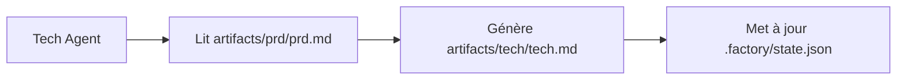

# Optimisation du contexte : Exécution multi-sessions

## Ce que vous pourrez faire après avoir terminé

- Utiliser la commande `factory continue` pour poursuivre le pipeline dans une nouvelle session
- Comprendre les avantages d'un contexte propre pour chaque étape
- Maîtriser les méthodes pour réduire considérablement la consommation de tokens
- Prendre en charge l'interruption et la reprise, avec possibilité de mettre en pause et de continuer à tout moment

## Votre difficulté actuelle

Lorsque vous exécutez le pipeline complet en 7 étapes dans un assistant IA (comme Claude Code), vous pouvez rencontrer ces problèmes :

- **Consommation de tokens croissante** : Au fur et à mesure que la conversation s'accumule, le contexte devient de plus en plus long, chaque étape devant charger le contenu de toutes les étapes précédentes
- **Coûts de plus en plus élevés** : Une longue conversation signifie plus de tokens en entrée, les frais augmentent en flèche
- **Réponses plus lentes** : Un contexte trop long peut entraîner une augmentation du temps de réponse
- **Difficulté de reprise** : Si une étape échoue, recommencer nécessite de recharger une grande quantité de contexte

::: tip Problème central
L'accumulation du contexte dans les longues conversations est une caractéristique inhérente des assistants IA, mais nous pouvons contourner ce problème grâce à l'« exécution multi-sessions ».
:::

## Quand utiliser cette approche

| Scénario | Utiliser multi-sessions | Raison |
| --- | --- | --- |
| Exécution complète du pipeline en 7 étapes | ✅ Fortement recommandé | Chaque token compte |
| Exécution de seulement 1-2 étapes | ⚠️ Optionnel | Contexte court, pas forcément nécessaire |
| Débogage d'une étape | ⚠️ Optionnel | Les tentatives fréquentes peuvent augmenter le coût de changement de session |
| Reprise après une longue interruption | ✅ Obligatoire | Éviter de charger un contexte obsolète |

## Concept central

Agent App Factory prend en charge l'**exécution multi-sessions**, dont l'idée centrale est :

**Après chaque étape, exécuter l'étape suivante dans une nouvelle session.**

Les avantages de cette approche :

1. **Contexte propre** : Chaque étape ne charge que les fichiers d'entrée nécessaires, sans dépendre de l'historique de conversation
2. **Économie de tokens** : Évite de transmettre répétitivement le contenu de toutes les étapes précédentes à l'IA
3. **Récupérabilité** : Possibilité d'interrompre à tout moment, puis de continuer avec une nouvelle session sans perdre la progression
4. **Compatibilité multiplateforme** : Fonctionne avec tous les assistants IA (Claude Code, OpenCode, Cursor, etc.)

### Stratégie d'isolation du contexte

Pour permettre l'exécution multi-sessions, Agent App Factory adopte une **stratégie d'isolation du contexte** :

::: info Qu'est-ce que l'isolation du contexte ?
L'isolation du contexte signifie que chaque Agent ne dépend que des fichiers d'entrée, pas de l'historique de conversation. Peu importe ce qui s'est passé avant, l'Agent ne lit les informations qu'à partir des fichiers d'entrée spécifiés.
:::

Lors de l'exécution de chaque Agent :

- ✅ **Lit uniquement** les fichiers `inputs` définis dans `pipeline.yaml`
- ❌ **N'utilise pas** les « souvenirs » de l'historique de conversation
- ❌ **Ne suppose pas** savoir ce qui s'est passé dans les étapes précédentes

Par exemple, lors de l'exécution du Tech Agent :



Le Tech Agent ne se soucie que de `artifacts/prd/prd.md`, il ne va pas se demander « quelle application l'utilisateur voulait créer avant », toutes les informations proviennent des fichiers d'entrée.

### Mécanisme de restauration d'état

Lorsque vous exécutez `factory continue`, le système va :

1. Lire `.factory/state.json` pour obtenir la progression actuelle
2. Lire `.factory/pipeline.yaml` pour déterminer l'étape suivante
3. **Charger uniquement les fichiers d'entrée nécessaires pour cette étape**
4. Lancer une nouvelle fenêtre d'assistant IA pour continuer l'exécution

Le fichier d'état (`.factory/state.json`) est le « centre de mémoire » de tout le système :

```json
{
  "version": 1,
  "status": "waiting_for_confirmation",
  "current_stage": "tech",
  "completed_stages": ["bootstrap", "prd"],
  "last_updated": "2026-01-29T12:00:00Z"
}
```

Après chaque étape terminée, l'état est mis à jour dans ce fichier. Lorsqu'une nouvelle session démarre, il suffit de lire ce fichier pour savoir où on en est.

## 🎒 Préparation avant de commencer

::: warning Conditions préalables
Avant de commencer ce tutoriel, assurez-vous de :

- [ ] Avoir terminé le [Démarrage rapide](../../start/getting-started/) et initialisé un projet Factory
- [ ] Avoir compris l'[Aperçu du pipeline en 7 étapes](../../start/pipeline-overview/)
- [ ] Avoir installé Claude Code (ou un autre assistant IA)

Si ce n'est pas encore fait, veuillez d'abord terminer ces cours préalables.
:::

## Suivez les étapes

Apprenons à utiliser la commande `factory continue` à travers un scénario pratique.

### Configuration du scénario

Supposons que vous exécutez un pipeline en 7 étapes, que vous avez déjà terminé les étapes `bootstrap` et `prd`, et que vous êtes en attente de confirmation à l'étape `ui`.

### Étape 1 : Choisir « Continuer dans une nouvelle session » au point de contrôle

Lorsqu'une étape est terminée, le planificateur Sisyphus affiche un tableau d'options :

```
✓ ui terminé !

Artefacts générés :
- artifacts/ui/ui.schema.yaml
- artifacts/ui/preview.web/index.html
- artifacts/ui/preview.web/styles.css
- artifacts/ui/preview.web/app.js

┌─────────────────────────────────────────────────────────────┐
│  📋 Veuillez choisir l'action suivante                       │
│  Entrez le numéro de l'option (1-5), puis appuyez sur Entrée │
└─────────────────────────────────────────────────────────────┘

┌──────┬──────────────────────────────────────────────────────┐
│ Option │ Description                                        │
├──────┼──────────────────────────────────────────────────────┤
│  1   │ Continuer l'étape suivante (même session)            │
│      │ Je vais continuer avec l'étape tech                  │
├──────┼──────────────────────────────────────────────────────┤
│  2   │ Nouvelle session ⭐ Recommandé, économise des tokens  │
│      │ Dans une nouvelle fenêtre de terminal : factory continue │
│      │ (Lance automatiquement une nouvelle fenêtre Claude Code) │
├──────┼──────────────────────────────────────────────────────┤
│  3   │ Réexécuter cette étape                               │
│      │ Réexécuter l'étape ui                                │
├──────┼──────────────────────────────────────────────────────┤
│  4   │ Modifier les artefacts puis réexécuter               │
│      │ Modifier artifacts/prd/prd.md puis réexécuter        │
├──────┼──────────────────────────────────────────────────────┤
│  5   │ Mettre en pause le pipeline                          │
│      │ Sauvegarder la progression actuelle, continuer plus tard │
└──────┴──────────────────────────────────────────────────────┘

💡 Astuce : Entrez un nombre entre 1 et 5, puis appuyez sur Entrée pour confirmer
```

**Ce que vous devriez voir** :
- L'option 2 est marquée « ⭐ Recommandé, économise des tokens »

Dans la session actuelle, nous pouvons choisir l'option 5 (Mettre en pause le pipeline), puis exécuter `factory continue` dans une nouvelle fenêtre de terminal.

**Pourquoi**
- L'option 1 est « Continuer l'étape suivante (même session) », cela continue dans la session actuelle, le contexte s'accumule
- L'option 2 est « Nouvelle session », cela exécute l'étape suivante avec un contexte propre, **économisant des tokens**
- L'option 5 est « Mettre en pause le pipeline », cela sauvegarde la progression actuelle, permettant de reprendre plus tard avec `factory continue`

### Étape 2 : Exécuter `factory continue` dans une nouvelle fenêtre de terminal

Ouvrez une nouvelle fenêtre de terminal (ou un nouvel onglet), accédez au répertoire de votre projet, puis exécutez :

```bash
factory continue
```

**Ce que vous devriez voir** :

```
Agent Factory - Continue in New Session

Pipeline Status:
────────────────────────────────────────
Project: my-awesome-app
Status: Waiting
Current Stage: tech
Completed: bootstrap, prd

Starting new Claude Code session...
✓ Nouvelle fenêtre Claude Code lancée
  (Please wait for the window to open)
```

**Ce qui s'est passé** :

1. La commande `factory continue` a lu `.factory/state.json` pour connaître l'état actuel
2. Les informations d'état du projet actuel ont été affichées
3. Une nouvelle fenêtre Claude Code a été lancée automatiquement avec l'instruction « veuillez continuer le pipeline »
4. La nouvelle fenêtre continuera automatiquement à partir de l'étape `tech`

### Étape 3 : Continuer l'exécution dans la nouvelle fenêtre

Après le lancement de la nouvelle fenêtre Claude Code, vous verrez une nouvelle conversation, mais l'état est restauré à partir du point de contrôle précédemment sauvegardé.

Dans la nouvelle session, l'Agent va :

1. Lire `.factory/state.json` pour obtenir l'étape actuelle
2. Lire `.factory/pipeline.yaml` pour déterminer les entrées et sorties de cette étape
3. **Charger uniquement les fichiers d'entrée nécessaires pour cette étape** (par exemple `artifacts/prd/prd.md`)
4. Exécuter la tâche de cette étape

**Points clés** :
- La nouvelle session n'a pas l'historique de conversation des étapes précédentes
- L'Agent ne lit les informations qu'à partir des fichiers d'entrée, sans dépendre de la « mémoire »
- C'est la manifestation de l'**isolation du contexte**

### Étape 4 : Vérifier l'isolation du contexte

Pour vérifier si l'isolation du contexte fonctionne, vous pouvez essayer de demander à l'Agent dans la nouvelle session :

« Savez-vous ce qui a été fait à l'étape bootstrap ? »

Si l'isolation du contexte fonctionne, l'Agent répondra quelque chose comme :

« Je dois d'abord consulter les fichiers pertinents pour comprendre le travail précédent. Laissez-moi lire... »

Puis il essaiera de lire `input/idea.md` ou d'autres fichiers pour obtenir les informations, plutôt que de « se souvenir » directement de l'historique de conversation.

**Point de contrôle ✅**
- La nouvelle session a démarré avec succès
- L'état correct du projet est affiché
- L'Agent ne dépend que des fichiers d'entrée, pas de l'historique de conversation

### Étape 5 : Continuer l'exécution des étapes restantes

Après chaque étape terminée, vous pouvez choisir :

- Continuer dans la session actuelle (option 1) - Adapté aux processus courts
- **Nouvelle session (option 2)** - **Recommandé, économise des tokens**
- Mettre en pause le pipeline (option 5) - Exécuter `factory continue` plus tard

Pour un pipeline complet en 7 étapes, il est recommandé d'utiliser « Nouvelle session » à chaque étape, ainsi :

```
bootstrap (session 1) → prd (session 2) → ui (session 3) → tech (session 4)
→ code (session 5) → validation (session 6) → preview (session 7)
```

Chaque session est propre, sans avoir besoin de charger le contenu de toutes les étapes précédentes.

## Attention aux pièges

### Piège 1 : Oublier d'exécuter `factory continue`

**Erreur courante** :
- Commencer directement l'étape suivante dans l'ancienne session
- Ou ouvrir directement Claude Code dans une nouvelle fenêtre sans exécuter `factory continue`

**Bonne pratique** :
- Toujours utiliser la commande `factory continue` pour démarrer une nouvelle session
- Cette commande lit automatiquement l'état et transmet les instructions correctes

### Piège 2 : Recharger les fichiers historiques dans la nouvelle session

**Erreur courante** :
- Demander manuellement à l'IA de lire les artefacts des étapes précédentes dans la nouvelle session
- Penser que l'IA devrait « savoir » ce qui s'est passé avant

**Bonne pratique** :
- Faire confiance au mécanisme d'isolation du contexte, l'Agent lira automatiquement les informations des fichiers d'entrée
- Ne fournir que les fichiers d'entrée nécessaires pour cette étape

### Piège 3 : Utiliser `factory continue` entre différents projets

**Erreur courante** :
- Exécuter `factory continue` dans le projet A, mais le répertoire actuel est le projet B

**Bonne pratique** :
- `factory continue` vérifie si le répertoire actuel est un projet Factory
- Sinon, il indique qu'il faut d'abord exécuter `factory init`

### Piège 4 : Modifier les artefacts sans utiliser `factory continue`

**Scénario** :
- Vous avez modifié manuellement un artefact après une étape (comme modifier le PRD)
- Vous voulez continuer avec l'étape suivante

**Bonne pratique** :
- Exécuter `factory run` (recommence à partir de l'étape spécifiée)
- Ou exécuter `factory continue` (continue à partir du point de contrôle actuel)
- Ne pas continuer directement dans l'ancienne session, car le contexte pourrait être incohérent

## Résumé de cette leçon

Cette leçon a couvert l'utilisation de la commande `factory continue` pour l'exécution multi-sessions :

### Points clés

1. **Exécution multi-sessions** : Après chaque étape, exécuter l'étape suivante dans une nouvelle session
2. **Isolation du contexte** : L'Agent ne dépend que des fichiers d'entrée, pas de l'historique de conversation
3. **Restauration d'état** : `.factory/state.json` enregistre la progression actuelle, les nouvelles sessions peuvent la restaurer
4. **Économie de tokens** : Évite de charger un contexte trop long, réduisant considérablement les coûts

### Référence rapide des commandes

| Commande | Fonction | Cas d'utilisation |
| --- | --- | --- |
| `factory continue` | Nouvelle session pour continuer le pipeline | Après chaque étape terminée |
| `factory run` | Exécuter le pipeline dans la session actuelle | Première exécution ou débogage |
| `factory status` | Voir l'état actuel du projet | Vérifier la progression |

### Meilleures pratiques

- ✅ Pour un pipeline complet en 7 étapes, utiliser `factory continue` à chaque étape
- ✅ Choisir « Nouvelle session » (option 2) aux points de contrôle
- ✅ Faire confiance au mécanisme d'isolation du contexte, ne pas charger manuellement les fichiers historiques
- ✅ Utiliser `factory status` pour vérifier la progression du projet

## Aperçu de la prochaine leçon

> Dans la prochaine leçon, nous apprendrons **[Permissions et mécanismes de sécurité](../security-permissions/)**.
>
> Vous apprendrez :
> - Comment la matrice des capacités empêche les Agents de dépasser leurs droits
> - Les mécanismes de gestion des dépassements et l'isolation des artefacts non fiables
> - Les points de contrôle de sécurité et le processus de vérification des permissions
> - Comment configurer le fichier de permissions de Claude Code

Cette leçon vous aidera à comprendre les mécanismes de sécurité d'Agent App Factory, garantissant que chaque Agent ne lit et n'écrit que dans les répertoires autorisés.

---

## Annexe : Référence du code source

<details>
<summary><strong>Cliquez pour développer l'emplacement du code source</strong></summary>

> Dernière mise à jour : 2026-01-29

| Fonction | Chemin du fichier | Ligne |
| --- | --- | --- |
| Commande factory continue | [`cli/commands/continue.js`](https://github.com/hyz1992/agent-app-factory/blob/main/cli/commands/continue.js) | 1-144 |
| Optimisation du contexte du planificateur | [`agents/orchestrator.checkpoint.md`](https://github.com/hyz1992/agent-app-factory/blob/main/agents/orchestrator.checkpoint.md) | 113-154 |
| Stratégie d'isolation du contexte | [`policies/context-isolation.md`](https://github.com/hyz1992/agent-app-factory/blob/main/policies/context-isolation.md) | 1-64 |

**Fonctions clés** :
- `launchClaudeCode(projectDir, nextStage, completedStages)` : Lance une nouvelle fenêtre Claude Code
- `commandExists(cmd)` : Vérifie si la commande est disponible
- `module.exports(projectDir)` : Fonction principale de la commande `factory continue`

**Constantes clés** :
- `state.json` : Chemin du fichier d'état (`.factory/state.json`)
- `pipeline.yaml` : Chemin du fichier de définition du pipeline (`.factory/pipeline.yaml`)
- `config.yaml` : Chemin du fichier de configuration du projet (`.factory/config.yaml`)

**Règles métier clés** :
- BR-6-1 : Chaque étape bénéficie d'un contexte propre
- BR-6-2 : Utiliser la commande `factory continue` pour continuer
- BR-6-3 : Charger uniquement les fichiers nécessaires pour l'étape actuelle

</details>
