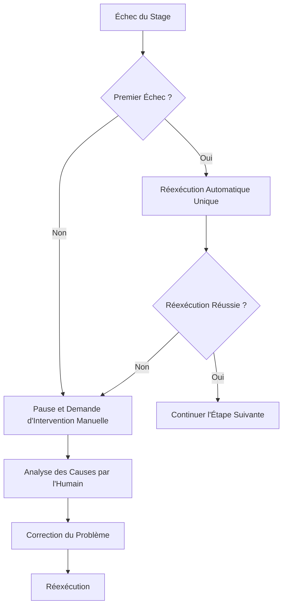
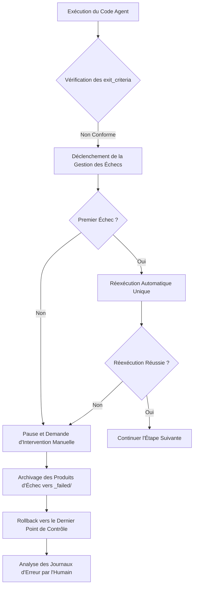
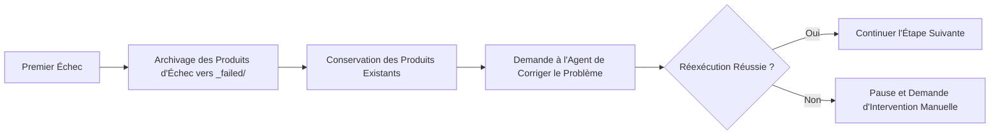
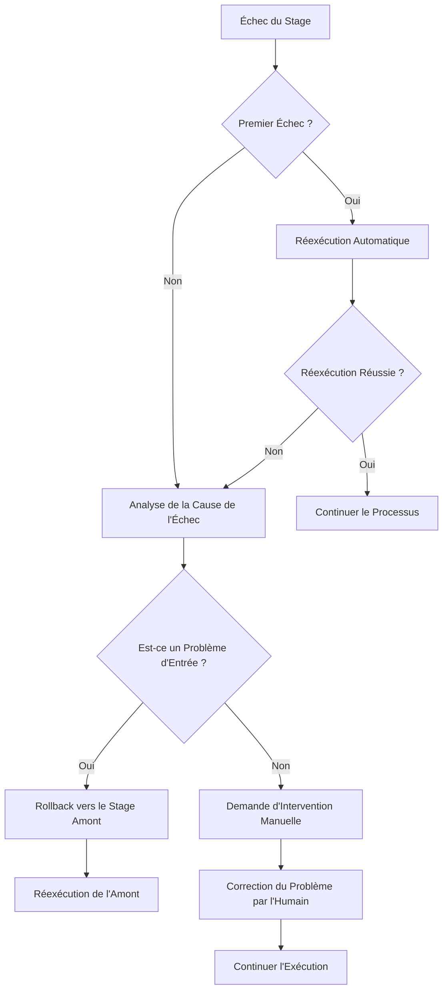

# Gestion des Échecs et Rollback : Tolérance aux Pannes et Récupération d'Erreurs Intelligentes

## Ce Que Vous Pourrez Faire Après Ce Cours

- **Identifier les Types d'Échec** : Déterminer rapidement les causes des échecs comme les sorties manquantes, le contenu non conforme ou les écritures non autorisées
- **Comprendre le Mécanisme de Réexécution** : Maîtriser la stratégie de réexécution automatique unique et les règles d'archivage des échecs
- **Exécuter les Opérations de Rollback** : Apprendre à revenir au dernier point de contrôle réussi pour restaurer un état stable
- **Traiter l'Intervention Manuelle** : Savoir quand une intervention manuelle est nécessaire, comment analyser les causes d'échec et les corriger
- **Interpréter les Journaux d'Erreurs** : Comprendre les rapports d'erreurs de `pipeline/error.log` pour localiser rapidement les problèmes

## Votre Situation Actuelle

Lors de l'exécution du pipeline, vos principales préoccupations sont :

- **Que faire en cas d'échec** : Une étape a signalé une erreur, faut-il réessayer ou recommencer depuis le début ?
- **La contamination des données** : Les produits d'échec affecteront-ils les étapes suivantes ? Seront-ils nettoyés ?
- **Comment faire un rollback** : Comment revenir à l'état précédent réussi ?
- **L'intervention manuelle** : Des échecs consécutifs nécessitent-ils mon intervention ? Comment consulter les journaux ?

Le mécanisme de gestion des échecs est conçu pour résoudre ces problèmes — il définit le processus complet d'identification des échecs, de réexécution automatique, d'archivage des produits d'échec, de rollback vers les points de contrôle et d'intervention manuelle.

## Quand Utiliser Cette Technique

Lorsque le pipeline rencontre les situations suivantes :

- **Échec d'étape** : L'Agent a échoué, les fichiers de sortie sont manquants ou non conformes aux attentes
- **Opération non autorisée** : L'Agent a écrit dans un répertoire non autorisé, déclenchant une vérification de sécurité
- **Échecs consécutifs** : La même étape échoue deux fois, nécessitant une analyse manuelle
- **Besoin de rollback** : Vous souhaitez revenir à un état précédent réussi pour recommencer
- **Analyse des journaux** : Vous devez consulter les rapports d'erreur détaillés et les informations de pile

## Idée Principale

La stratégie de gestion des échecs est exécutée uniformément par le planificateur Sisyphus, qui agit comme un **ingénieur de tolérance aux pannes**, traitant automatiquement les erreurs du pipeline ou demandant une intervention manuelle.

### Définition de l'Échec

Les situations suivantes sont considérées comme des échecs de Stage :

| Type d'Échec | Symptôme | Emplacement du Code |
| --- | --- | --- |
| **Sortie Manquante** | Le fichier de sortie spécifié dans `pipeline.yaml` n'existe pas ou le nom ne correspond pas | `failure.policy.md:9` |
| **Non-Conformité aux exit_criteria** | Le contenu de sortie ne satisfait pas les conditions de sortie dans `pipeline.yaml` | `failure.policy.md:10` |
| **Écriture Non Autorisée** | L'Agent a écrit du contenu dans un répertoire ou fichier non autorisé | `failure.policy.md:11` |
| **Autre Exception** | Erreur de script, impossible de lire l'entrée, etc., empêchant l'accomplissement de la tâche | `failure.policy.md:12` |

### Mécanisme de Réexécution



**Règles de Réexécution** (`failure.policy.md:16-18`) :

- Chaque Stage permet par défaut **une réexécution automatique unique**
- Lors de la réexécution, le planificateur demande à l'Agent de corriger le problème en conservant les produits existants, plutôt que de tout refaire
- Si la seconde tentative échoue également, le planificateur doit suspendre le pipeline et entrer dans le processus d'intervention manuelle

### Rollback et Archivage

**Archivage des Échecs** (`failure.policy.md:22-23`) :

```bash
# Déplacer les produits d'échec vers le répertoire _failed/
mv artifacts/<stage>/ artifacts/_failed/<stage-id>/attempt-1/
mv artifacts/<stage>/ artifacts/_failed/<stage-id>/attempt-2/
```

**Stratégie de Rollback** (`failure.policy.md:23`) :

- Le planificateur effectue un rollback vers le dernier point de contrôle réussi
- L'exécution reprend à partir de ce Stage
- Garantit la cohérence des produits en amont et en aval, évitant la contamination des données

### Intervention Manuelle

**Moment d'Intervention** (`failure.policy.md:27`) :

- Après deux échecs consécutifs du même Stage
- Lorsqu'une écriture non autorisée est détectée

**Processus d'Intervention** (`failure.policy.md:27-29`) :

1. Le planificateur suspend l'exécution et rapporte la cause de l'échec
2. L'humain vérifie si les entrées, la configuration ou les compétences présentent des problèmes
3. L'humain modifie les fichiers d'entrée, ajuste les compétences ou modifie les paramètres
4. Continue l'exécution des processus restants

::: warning Contrainte du Planificateur
Le planificateur ne doit pas sauter l'étape en échec ou modifier les sorties sans confirmation humaine.
:::

## Suivez-Moi

### Étape 1 : Comprendre le Processus de Gestion des Échecs

Lorsque vous exécutez le pipeline, si une étape échoue, le planificateur Sisyphus déclenche automatiquement le processus de gestion des échecs.

**Scénario Exemple** : Échec de l'étape Code



### Étape 2 : Consulter les Journaux d'Erreur

En cas d'échec, le planificateur enregistre les informations d'erreur détaillées dans `pipeline/error.log`.

**Format du Journal d'Erreur** (`failure.policy.md:166-200`) :

```bash
cat pipeline/error.log
```

**Ce Que Vous Devriez Voir** :

```log
============================================
RAPPORT D'ERREUR
============================================
Horodatage : 2026-01-29T10:30:00Z
Stage : code
Tentative : 2/2
Statut : ÉCHEC

Type d'Erreur : Erreur de Compilation TypeScript
Message d'Erreur : Impossible de trouver le module '@prisma/client'

Trace de Pile :
  at Object.<anonymous> (src/lib/prisma.ts:1:1)
  at Module._compile (node:internal/modules/cjs/loader:1198:14)

Exit Criteria Non Satisfaits :
  - [ ] Le backend peut démarrer sans erreurs majeures (ÉCHEC)
  - [x] Le client peut s'afficher et être accessible
  - [x] Aucune fonction d'authentification ou fonctionnalité non pertinente n'a été introduite

Produits d'Échec Déplacés Vers :
  artifacts/_failed/code/attempt-2/

Action Recommandée :
  1. Vérifier si package.json contient @prisma/client
  2. Exécuter npx prisma generate pour générer le client
  3. Réessayer l'étape Code

============================================
```

**Interprétation du Journal d'Erreur** :

| Champ | Description | Exemple |
| --- | --- | --- |
| **Timestamp** | Moment où l'échec s'est produit | 2026-01-29T10:30:00Z |
| **Stage** | L'étape qui a échoué | code |
| **Attempt** | Nombre de tentatives | 2/2 (deuxième échec) |
| **Status** | État actuel | ÉCHEC |
| **Error Type** | Type d'erreur | Erreur de Compilation TypeScript |
| **Error Message** | Description de l'erreur | Impossible de trouver le module '@prisma/client' |
| **Stack Trace** | Informations de pile | src/lib/prisma.ts:1:1 |
| **Exit Criteria Failed** | Conditions de sortie non satisfaites | Le backend peut démarrer sans erreurs majeures (ÉCHEC) |
| **Failed Artifacts Moved To** | Emplacement d'archivage des produits d'échec | artifacts/_failed/code/attempt-2/ |
| **Recommended Action** | Étapes de correction recommandées | 1. Vérifier package.json... |

### Étape 3 : Comprendre le Mécanisme de Réexécution

Lors du premier échec, Sisyphus déclenche automatiquement une réexécution.

**Processus de Réexécution** (`failure.policy.md:16-18`) :



**Caractéristiques Importantes** :

- **Correction Incrémentale** : Lors de la réexécution, le planificateur demande à l'Agent de corriger le problème sur la base des produits existants, plutôt que de tout refaire
- **Archivage des Échecs** : Les produits de chaque échec sont déplacés vers `artifacts/_failed/<stage-id>/attempt-N/`, facilitant l'analyse comparative
- **Maximum Une Fois** : Par défaut, seule une réexécution automatique est autorisée, évitant les boucles infinies

### Étape 4 : Consulter l'Archivage des Échecs

Lorsqu'une étape échoue, tous les produits d'échec sont archivés dans le répertoire `artifacts/_failed/`.

**Structure du Répertoire** :

```bash
artifacts/
├── _failed/
│   ├── code/
│   │   ├── attempt-1/
│   │   │   ├── backend/
│   │   │   └── client/
│   │   └── attempt-2/
│   │       ├── backend/
│   │       └── client/
│   ├── ui/
│   │   └── attempt-1/
│   └── prd/
│       └── attempt-1/
```

**Règles de Nommage du Répertoire d'Archivage** :

- `artifacts/_failed/<stage-id>/attempt-N/`
  - `<stage-id>` : Nom de l'étape ayant échoué (par exemple `code`, `ui`, `prd`)
  - `attempt-N` : Nombre de tentatives (1 indique le premier échec, 2 le deuxième échec)

**Pourquoi Archiver** :

- **Éviter la Contamination** : Les produits d'échec n'affectent pas les étapes suivantes
- **Faciliter l'Analyse** : Permet de comparer les différences entre différentes tentatives pour identifier la cause racine
- **Conservation des Preuves** : Conserve les produits d'échec pour le débogage ultérieur

### Étape 5 : Exécuter l'Opération de Rollback

Lorsque vous devez revenir à un état précédent, vous pouvez utiliser la fonction de rollback.

**Processus de Rollback** (`failure.policy.md:23`) :

```bash
# Rollback manuel vers le dernier point de contrôle
factory run <stage-id>

# Par exemple : rollback vers l'étape tech pour réexécution
factory run tech
```

**Règles de Rollback** :

- **Cible du Rollback** : Revenir au dernier point de contrôle réussi
- **Réinitialisation de l'État** : Vider les produits de l'étape actuelle et l'archivage des échecs
- **Réexécution** : Reprendre l'exécution à partir de l'étape cible

**Exemple de Rollback** :

Supposons que vous ayez échoué deux fois à l'étape Code et que vous souhaitiez revenir à l'étape Tech pour reprendre la conception de l'architecture :

```bash
# 1. Rollback vers l'étape tech
factory run tech

# 2. L'assistant AI réexécutera le Tech Agent
# 3. Régénérer artifacts/tech/ et artifacts/backend/prisma/
# 4. Puis continuer l'exécution de l'étape Code
```

### Étape 6 : Traiter l'Intervention Manuelle

Après deux échecs consécutifs, Sisyphus suspend le pipeline et demande une intervention manuelle.

**Arbre de Décision d'Intervention** (`failure.policy.md:204-236`) :



**Liste de Contrôle d'Intervention Manuelle** (`failure.policy.md:240-263`) :

#### Vérification de l'Environnement

- [ ] Node.js version >= 18
- [ ] npm version >= 9
- [ ] Espace disque suffisant
- [ ] Connexion réseau normale (téléchargement npm)

#### Vérification de l'État

- [ ] L'état `.factory/state.json` est correct
- [ ] Les produits du Stage amont sont complets
- [ ] Les produits d'échec sont archivés dans `_failed/`

#### Confirmation de la Correction

- [ ] La cause de l'échec est identifiée
- [ ] Le plan de correction est mis en œuvre
- [ ] La configuration associée est mise à jour

#### Reprise de l'Exécution

- [ ] Reprendre à partir du Stage ayant échoué
- [ ] Surveiller les journaux d'exécution
- [ ] Vérifier les produits de sortie

### Étape 7 : Traiter les Scénarios d'Échec Courants

Différentes étapes ont différents scénarios d'échec courants, voici les solutions de traitement.

#### 7.1 Échec de l'Étape Bootstrap

**Erreurs Courantes** (`failure.policy.md:35-48`) :

| Type d'Erreur | Symptôme | Cause | Solution |
| --- | --- | --- | --- |
| **Sortie Manquante** | `input/idea.md` n'existe pas | L'Agent n'a pas écrit correctement le fichier | Réessayer, vérifier le chemin d'écriture |
| **Contenu Incomplet** | idea.md manque de chapitres clés | Informations utilisateur insuffisantes | Suspendre, demander à l'utilisateur de compléter les informations |
| **Erreur de Format** | Non conforme à la structure du modèle | L'Agent n'a pas suivi le modèle | Réessayer, insister sur les exigences du modèle |

**Processus de Traitement** :

```bash
# 1. Vérifier si le répertoire input/ existe
ls -la input/

# 2. S'il n'existe pas, créer le répertoire
mkdir -p input/

# 3. Réessayer l'étape Bootstrap
factory run bootstrap
```

#### 7.2 Échec de l'Étape PRD

**Erreurs Courantes** (`failure.policy.md:50-65`) :

| Type d'Erreur | Symptôme | Cause | Solution |
| --- | --- | --- | --- |
| **Contient des Détails Techniques** | Le PRD contient des descriptions de stack technique | L'Agent a dépassé ses limites | Réessayer, insister sur les limites de responsabilité |
| **Trop de Fonctionnalités** | Must Have > 7 éléments | Expansion du périmètre | Réessayer, demander de réduire au MVP |
| **Description Utilisateur Floue** | "Tout le monde", "la plupart des utilisateurs" | Non spécifié | Réessayer, demander un profil utilisateur spécifique |
| **Non-Goals Manquants** | Non-Goals est vide | Limites non définies | Réessayer, demander de lister les non-goals |

**Processus de Traitement** :

```bash
# 1. Vérifier que le PRD ne contient pas de mots-clés techniques
grep -E "(React|API|base de données)" artifacts/prd/prd.md

# 2. Vérifier que le nombre de fonctionnalités Must Have ≤ 7
grep -A 100 "Must Have" artifacts/prd/prd.md | wc -l

# 3. Fournir des exigences de correction spécifiques lors de la réexécution
factory run prd
```

#### 7.3 Échec de l'Étape UI

**Erreurs Courantes** (`failure.policy.md:67-82`) :

| Type d'Erreur | Symptôme | Cause | Solution |
| --- | --- | --- | --- |
| **Dépassement du Nombre de Pages** | Nombre de pages > 8 | Expansion du périmètre | Réessayer, demander de réduire les pages |
| **Aperçu Non Ouvert** | Fichier HTML corrompu | Erreur de génération | Réessayer, vérifier la syntaxe HTML |
| **Utilisation du Style AI** | Police Inter + dégradé violet | Ne suit pas le guide esthétique | Réessayer, demander de choisir une esthétique distincte |
| **Schéma Invalide** | Échec d'analyse YAML | Erreur de syntaxe | Réessayer, valider la syntaxe YAML |

**Processus de Traitement** :

```bash
# 1. Compter le nombre de pages dans ui.schema.yaml
grep -c "page:" artifacts/ui/ui.schema.yaml

# 2. Essayer d'ouvrir l'aperçu dans le navigateur
open artifacts/ui/preview.web/index.html

# 3. Valider la syntaxe YAML
npx js-yaml artifacts/ui/ui.schema.yaml

# 4. Vérifier si des éléments de style AI interdits sont utilisés
grep -E "(Inter|violet|gradient)" artifacts/ui/ui.schema.yaml
```

#### 7.4 Échec de l'Étape Tech

**Erreurs Courantes** (`failure.policy.md:84-99`) :

| Type d'Erreur | Symptôme | Cause | Solution |
| --- | --- | --- | --- |
| **Erreur de Syntaxe Prisma** | schema.prisma invalide | Problème de syntaxe | Réessayer, exécuter prisma validate |
| **Conception Excessive** | Introduction de microservices/cache | Violation du principe MVP | Réessayer, demander de simplifier l'architecture |
| **Trop de Modèles de Données** | Nombre de tables > 10 | Expansion du périmètre | Réessayer, réduire les modèles de données |
| **Définitions API Manquantes** | tech.md sans liste de points de terminaison | Contenu incomplet | Réessayer, demander de compléter les API |

**Processus de Traitement** :

```bash
# 1. Exécuter la validation Prisma
cd artifacts/backend
npx prisma validate

# 2. Vérifier si tech.md contient les chapitres nécessaires
grep -E "(API|point de terminaison|route)" artifacts/tech/tech.md

# 3. Compter le nombre de modèles de données
grep -c "model " artifacts/backend/prisma/schema.prisma

# 4. Vérifier si des technologies complexes non nécessaires sont introduites
grep -E "(microservice|cache|file d'attente)" artifacts/tech/tech.md
```

#### 7.5 Échec de l'Étape Code

**Erreurs Courantes** (`failure.policy.md:101-131`) :

| Type d'Erreur | Symptôme | Cause | Solution |
| --- | --- | --- | --- |
| **Échec d'Installation des Dépendances** | Erreur npm install | Conflit de versions de paquets | Vérifier package.json, mettre à jour les versions |
| **Erreur TypeScript** | Échec de compilation tsc | Problèmes de types | Corriger les erreurs de types, réessayer |
| **Fichiers Nécessaires Manquants** | Structure de répertoire incomplète | Omission de génération | Réessayer, vérifier la liste des fichiers |
| **Échec des Tests** | Échec de npm test | Erreur de logique de code | Corriger les tests, réessayer |
| **API Ne Démarre Pas** | Échec d'écoute du port | Problème de configuration | Vérifier la configuration des variables d'environnement |

**Processus de Traitement** :

```bash
# 1. Exécuter la vérification des dépendances
cd artifacts/backend
npm install --dry-run

# 2. Exécuter la vérification des types
npx tsc --noEmit

# 3. Vérifier la structure du répertoire par rapport à la liste des fichiers
ls -la src/

# 4. Exécuter les tests
npm test

# 5. Si tout ce qui précède réussit, essayer de démarrer le service
npm run dev
```

**Corrections Courantes des Problèmes de Dépendances** (`failure.policy.md:120-131`) :

```bash
# Conflit de versions
rm -rf node_modules package-lock.json
npm install

# Incompatibilité de version Prisma
npm install @prisma/client@latest prisma@latest

# Problèmes de dépendances React Native
cd artifacts/client
npx expo install --fix
```

#### 7.6 Échec de l'Étape Validation

**Erreurs Courantes** (`failure.policy.md:133-147`) :

| Type d'Erreur | Symptôme | Cause | Solution |
| --- | --- | --- | --- |
| **Rapport de Validation Incomplet** | Chapitres manquants dans report.md | L'Agent n'a pas terminé | Réessayer |
| **Trop de Problèmes Graves** | Nombre d'erreurs > 10 | Qualité insuffisante de l'étape Code | Rollback vers l'étape Code |
| **Problèmes de Sécurité** | Clés codées en dur détectées | Violation de sécurité | Rollback, corriger les problèmes de sécurité |

**Processus de Traitement** :

```bash
# 1. Analyser report.md pour confirmer que tous les chapitres existent
grep -E "(## Résumé|## Backend|## Frontend|## Problèmes)" artifacts/validation/report.md

# 2. Compter le nombre de problèmes graves
grep -c "problème grave" artifacts/validation/report.md

# 3. Si problèmes graves > 10, suggérer un rollback vers l'étape Code
factory run code

# 4. Vérifier les résultats de l'analyse de sécurité
grep -E "(clé|mot de passe|token)" artifacts/validation/report.md
```

#### 7.7 Échec de l'Étape Preview

**Erreurs Courantes** (`failure.policy.md:149-162`) :

| Type d'Erreur | Symptôme | Cause | Solution |
| --- | --- | --- | --- |
| **README Incomplet** | Étapes d'installation manquantes | Omission de contenu | Réessayer, compléter les étapes |
| **Échec de Construction Docker** | Erreur Dockerfile | Problème de configuration | Corriger le Dockerfile |
| **Configuration de Déploiement Manquante** | Pas de docker-compose | Non généré | Réessayer, demander de générer la configuration |

**Processus de Traitement** :

```bash
# 1. Vérifier que README.md contient tous les chapitres nécessaires
grep -E "(## Démarrage Rapide|## Installation|## Exécution)" artifacts/preview/README.md

# 2. Essayer docker build pour valider le Dockerfile
cd artifacts/preview
docker build -t test-app .

# 3. Vérifier si les fichiers de configuration de déploiement existent
ls -la docker-compose.yml .github/workflows/
```

## Point de Contrôle ✅

Après avoir terminé ce cours, vous devriez :

- [ ] Comprendre les 4 types de gestion des échecs (sortie manquante, contenu non conforme, non autorisé, exception)
- [ ] Maîtriser le mécanisme de réexécution automatique unique
- [ ] Savoir que les produits d'échec sont archivés dans `artifacts/_failed/`
- [ ] Pouvoir interpréter le rapport d'erreur `pipeline/error.log`
- [ ] Comprendre le processus de rollback vers les points de contrôle
- [ ] Savoir quand une intervention manuelle est nécessaire
- [ ] Maîtriser les solutions de traitement des scénarios d'échec courants

## Alertes aux Pièges

### Problème 1 : Les Produits Sont Complètement Refaits Lors de la Réexécution

**Symptôme** : Lors de la seconde tentative, tous les produits sont régénérés au lieu d'être corrigés sur la base des produits existants.

**Cause** : L'Agent n'a pas suivi la règle de "corriger sur la base des produits existants".

**Solution** :

Lors de la réexécution, informez explicitement l'Agent :

```markdown
Veuillez corriger le problème sur la base des produits existants, ne refaites pas tout.
Conservez les parties déjà correctes, modifiez uniquement les parties non conformes aux exit_criteria.
```

### Problème 2 : Les Produits d'Échec Contaminent les Étapes Suivantes

**Symptôme** : Les produits d'échec ne sont pas archivés et affectent l'exécution des étapes suivantes.

**Cause** : L'étape d'archivage des produits d'échec n'a pas été exécutée.

**Solution** :

Archiver manuellement les produits d'échec :

```bash
# Déplacer les produits d'échec vers le répertoire _failed/
mv artifacts/<stage-id> artifacts/_failed/<stage-id>/attempt-1/

# Puis réexécuter cette étape
factory run <stage-id>
```

### Problème 3 : Incohérence des Produits Après Rollback

**Symptôme** : Après un rollback vers une étape amont, les produits sont incohérents avec ceux d'avant.

**Cause** : Lors du rollback, seule l'étape actuelle a été réinitialisée, sans vider les produits en aval dépendants.

**Solution** :

Processus de rollback complet :

```bash
# 1. Rollback vers l'étape cible
factory run <target-stage>

# 2. Vider tous les produits des étapes en aval
rm -rf artifacts/<downstream-stage-1>/
rm -rf artifacts/<downstream-stage-2>/

# 3. Réexécuter
factory run
```

### Problème 4 : Échec de la Reprise Après Intervention Manuelle

**Symptôme** : Après avoir corrigé le problème et continué l'exécution, cela échoue encore.

**Cause** : Le plan de correction est incomplet ou les modifications n'ont pas été sauvegardées.

**Solution** :

Liste de contrôle d'intervention manuelle :

```bash
# 1. Confirmer que la cause de l'échec est identifiée
cat pipeline/error.log

# 2. Confirmer que le plan de correction est mis en œuvre
# Vérifier les fichiers modifiés

# 3. Confirmer que la configuration associée est mise à jour
cat .factory/state.json

# 4. Réexécuter
factory run <failed-stage>
```

### Problème 5 : Journal d'Erreur Incomplet

**Symptôme** : `pipeline/error.log` manque d'informations clés.

**Cause** : Le planificateur n'a pas correctement enregistré le journal d'erreur.

**Solution** :

Vérifier si le fichier journal existe :

```bash
# S'il n'existe pas, créer manuellement
mkdir -p pipeline
cat > pipeline/error.log << 'EOF'
RAPPORT D'ERREUR
============================================
Horodatage : $(date -u +"%Y-%m-%dT%H:%M:%SZ")
Stage : <stage-id>
Tentative : 1/1
Statut : ÉCHEC

Type d'Erreur : Débogage Manuel
Message d'Erreur : Informations de débogage nécessaires

Trace de Pile :
  (ajouter la trace de pile si disponible)

Exit Criteria Non Satisfaits :
  - [ ] exit-criteria-1
  - [ ] exit-criteria-2

Produits d'Échec Déplacés Vers :
  artifacts/_failed/<stage-id>/attempt-1/

Action Recommandée :
  1. Décrire le problème
  2. Fournir les étapes de correction
  3. Réessayer l'étape

============================================
EOF
```

## Bonnes Pratiques

### 1. Échec Précoce

**Principe** : Découvrir les problèmes le plus tôt possible pour éviter de perdre du temps dans les étapes suivantes.

**Pratique** :

- Valider lors de l'étape Bootstrap si l'entrée utilisateur est complète
- Vérifier lors de l'étape PRD si des détails techniques sont inclus (violation des limites de responsabilité)
- Valider lors de l'étape UI si le nombre de pages est raisonnable

### 2. Journaux Détaillés

**Principe** : Enregistrer suffisamment d'informations contextuelles pour faciliter le débogage.

**Pratique** :

- Le journal d'erreur contient l'horodatage, le stage, le nombre de tentatives, le type d'erreur, les informations de pile
- Les étapes de correction recommandées spécifient les noms de fichiers et les numéros de ligne
- Les produits d'échec sont archivés pour faciliter l'analyse comparative

### 3. Opérations Atomiques

**Principe** : La sortie de chaque étape devrait être atomique pour faciliter le rollback.

**Pratique** :

- Générer tous les fichiers de produits en une seule fois, plutôt que d'écrire progressivement
- Si un échec survient en cours de route, ne pas conserver de produits incomplets
- Archiver les produits de l'ensemble de l'étape, plutôt que de fichiers partiels

### 4. Conservation des Preuves

**Principe** : Archiver les produits d'échec avant de réessayer pour faciliter l'analyse comparative.

**Pratique** :

- Chaque échec est archivé dans le sous-répertoire `attempt-N/`
- Conserver les produits de plusieurs tentatives pour comparer les différences
- Utiliser `git diff` pour comparer les différences entre différentes tentatives

### 5. Réexécution Progressive

**Principe** : Fournir des instructions plus spécifiques lors de la réexécution, plutôt que de simplement répéter.

**Pratique** :

```markdown
# Premier échec
Veuillez générer le document PRD.

# Seconde tentative (fournir des instructions spécifiques)
Veuillez corriger les problèmes suivants dans le PRD existant :
1. Supprimer tous les détails techniques (comme React, API, etc.)
2. Réduire le nombre de fonctionnalités Must Have de 10 à 7
3. Ajouter un profil utilisateur spécifique pour la cible
4. Compléter le chapitre Non-Goals et définir clairement les limites
```

## Résumé de Ce Cours

Le mécanisme de gestion des échecs est la garantie de tolérance aux pannes d'AI App Factory, assurant que le pipeline peut se récupérer automatiquement ou demander une intervention manuelle en cas d'erreur.

**Points Clés** :

1. **Définition de l'Échec** : Sortie manquante, contenu non conforme, écriture non autorisée, autre exception
2. **Mécanisme de Réexécution** : Chaque étape permet une réexécution automatique unique, après deux échecs, une intervention manuelle est demandée
3. **Archivage des Échecs** : Les produits d'échec sont déplacés vers `artifacts/_failed/<stage-id>/attempt-N/`
4. **Stratégie de Rollback** : Revenir au dernier point de contrôle réussi, garantir la cohérence des produits en amont et en aval
5. **Intervention Manuelle** : Après deux échecs consécutifs, analyser la cause, corriger le problème, réexécuter
6. **Journal d'Erreur** : Le rapport d'erreur détaillé contient l'horodatage, le stage, le type d'erreur, les informations de pile, les étapes de correction recommandées
7. **Scénarios Courants** : Chaque étape a des erreurs spécifiques courantes et des solutions de traitement

## Aperçu du Cours Suivant

> Dans le cours suivant, nous apprendrons **[Problèmes Courants et Dépannage](../../faq/troubleshooting/)**.
>
> Vous apprendrez :
> - Les problèmes courants de la phase d'initialisation
> - Le dépannage pendant l'exécution
> - Le traitement des problèmes liés au déploiement

---

## Annexe : Référence du Code Source

<details>
<summary><strong>Cliquez pour Développer et Voir l'Emplacement du Code Source</strong></summary>

> Date de Mise à Jour : 2026-01-29

| Fonctionnalité | Chemin du Fichier | Numéro de Ligne |
| --- | --- | --- |
| Définition de la Stratégie d'Échec | [`source/hyz1992/agent-app-factory/policies/failure.policy.md`](https://github.com/hyz1992/agent-app-factory/blob/main/policies/failure.policy.md) | 1-276 |
| Gestion des Échecs du Planificateur | [`source/hyz1992/agent-app-factory/agents/orchestrator.checkpoint.md`](https://github.com/hyz1992/agent-app-factory/blob/main/agents/orchestrator.checkpoint.md) | 38-46 |
| Matrice des Limites de Capacité | [`source/hyz1992/agent-app-factory/policies/capability.matrix.md`](https://github.com/hyz1992/agent-app-factory/blob/main/policies/capability.matrix.md) | 1-40 |

**Définition de l'Échec** (`failure.policy.md:5-13`) :
- Sortie Manquante : Le fichier de sortie spécifié dans `pipeline.yaml` n'existe pas ou le nom ne correspond pas
- Non-Conformité aux exit_criteria : Le contenu de sortie ne satisfait pas les `exit_criteria` de ce Stage dans `pipeline.yaml`
- Écriture Non Autorisée : L'Agent a écrit du contenu dans un répertoire ou fichier non autorisé
- Autre Exception : Erreur de script, impossible de lire l'entrée, etc., empêchant l'accomplissement de la tâche

**Mécanisme de Réexécution** (`failure.policy.md:16-18`) :
- Chaque Stage permet par défaut une réexécution automatique unique
- Le planificateur doit demander à l'Agent de corriger le problème en conservant les produits existants, plutôt que de tout refaire
- Si la seconde tentative échoue également, le planificateur doit suspendre le pipeline et entrer dans le processus d'intervention manuelle

**Rollback et Archivage** (`failure.policy.md:22-23`) :
- Les produits d'échec sont déplacés vers le répertoire `artifacts/_failed/<stage-id>/`
- Rollback vers le dernier point de contrôle réussi, reprise de l'exécution à partir de ce Stage

**Intervention Manuelle** (`failure.policy.md:27-29`) :
- Lorsque le même Stage échoue deux fois consécutivement, le planificateur doit suspendre l'exécution et rapporter la cause de l'échec
- Après l'intervention humaine, les fichiers d'entrée peuvent être modifiés, les compétences ajustées ou les paramètres modifiés, puis l'exécution des processus restants continue
- Le planificateur ne doit pas sauter l'étape en échec ou modifier les sorties sans confirmation humaine

**Format du Journal d'Erreur** (`failure.policy.md:166-200`) :
- Timestamp, Stage, Attempt, Status
- Error Type, Error Message, Stack Trace
- Exit Criteria Failed
- Failed Artifacts Moved To
- Recommended Action

**Scénarios d'Échec Courants** (`failure.policy.md:33-162`) :
- Étape Bootstrap : Sortie manquante, Contenu incomplet, Erreur de format
- Étape PRD : Contient des détails techniques, Trop de fonctionnalités, Description utilisateur floue, Non-goals manquants
- Étape UI : Dépassement du nombre de pages, Aperçu non ouvert, Utilisation du style AI, Schéma invalide
- Étape Tech : Erreur de syntaxe Prisma, Conception excessive, Trop de modèles de données, Définitions API manquantes
- Étape Code : Échec d'installation des dépendances, Erreur TypeScript, Fichiers nécessaires manquants, Échec des tests, API ne démarre pas
- Étape Validation : Rapport de validation incomplet, Trop de problèmes graves, Problèmes de sécurité
- Étape Preview : README incomplet, Échec de construction Docker, Configuration de déploiement manquante

**Processus de Gestion des Échecs du Planificateur** (`orchestrator.checkpoint.md:38-46`) :
- Lire `policies/failure.policy.md`, exécuter selon la stratégie
- Demander à l'Agent de corriger le problème en conservant les produits existants et de réessayer
- Les produits d'échec sont déplacés vers le répertoire `artifacts/_failed/<stage-id>/`
- Après deux échecs consécutifs, suspendre le pipeline, rapporter la cause de l'échec et attendre l'intervention humaine

**Traitement des Non-Autorisations** (`orchestrator.checkpoint.md:48-52`) :
- Vérifier si le chemin de sortie est limité aux répertoires autorisés
- Si une écriture non autorisée est détectée, déplacer ce produit vers `artifacts/_untrusted/<stage-id>/`
- Suspendre l'exécution et rapporter

**Arbre de Décision d'Intervention Manuelle** (`failure.policy.md:204-236`) :
- Premier échec → Réexécution automatique → Réexécution réussie ? → Continuer / Deuxième échec
- Deuxième échec → Analyse de la cause de l'échec → Est-ce un problème d'entrée ? → Rollback vers le Stage amont / Demande d'intervention manuelle

**Liste de Contrôle de Récupération d'Échec** (`failure.policy.md:240-263`) :
- Vérification de l'environnement : Version Node.js, Version npm, Espace disque, Connexion réseau
- Vérification de l'état : `.factory/state.json`, Produits du Stage amont, Archivage des produits d'échec
- Confirmation de la correction : Cause de l'échec, Plan de correction, Configuration associée
- Reprise de l'exécution : Reprendre à partir du Stage ayant échoué, Surveiller les journaux, Vérifier les produits

**Bonnes Pratiques** (`failure.policy.md:267-274`) :
- Échec Précoce : Découvrir les problèmes le plus tôt possible pour éviter de perdre du temps dans les étapes suivantes
- Journaux Détaillés : Enregistrer suffisamment d'informations contextuelles pour faciliter le débogage
- Opérations Atomiques : La sortie de chaque Stage devrait être atomique pour faciliter le rollback
- Conservation des Preuves : Archiver les produits d'échec avant de réessayer pour faciliter l'analyse comparative
- Réexécution Progressive : Fournir des instructions plus spécifiques lors de la réexécution, plutôt que de simplement répéter

</details>
