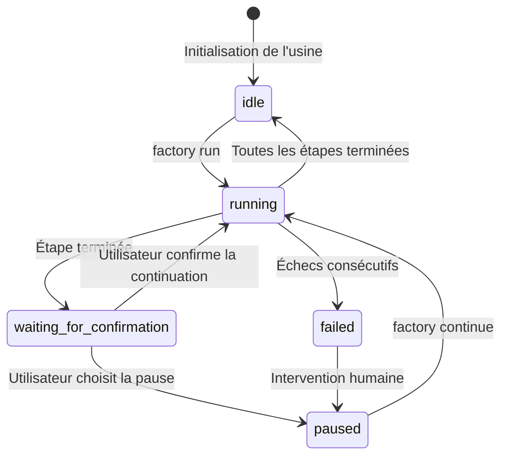
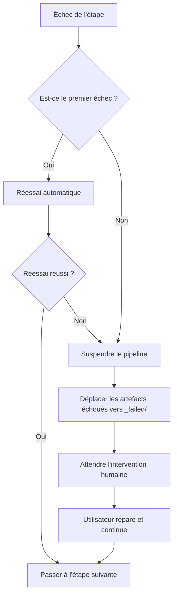

# Planificateur Sisyphus : Coordination du Pipeline et Gestion d'État

## Ce Que Vous Pourrez Faire

- Comprendre comment le planificateur coordonne l'exécution du pipeline en 7 étapes
- Comprendre le fonctionnement de la machine à états et les règles de transition d'état
- Maîtriser le mécanisme de vérification des permissions de la matrice de capacités
- Apprendre à gérer les scénarios d'échec (réessai, annulation, intervention humaine)
- Utiliser la commande `factory continue` pour optimiser la consommation de tokens

## Votre Situation Actuelle

Vous avez déjà exécuté plusieurs pipelines, mais vous pourriez ne pas bien comprendre ces questions :

- Que fait exactement Sisyphus ? Quelle est la différence avec les autres Agent ?
- Pourquoi les agents ne peuvent-ils lire et écrire que dans certains répertoires ? Que se passe-t-il en cas de dépassement de permissions ?
- Comment le planificateur gère-t-il les échecs ? Pourquoi y a-t-il parfois réessai automatique et parfois besoin d'intervention humaine ?
- Pourquoi la commande `factory continue` permet-elle d'économiser des tokens ? Quel est le mécanisme sous-jacent ?

Si vous êtes curieux à propos de ces questions, ce chapitre vous aidera à tout comprendre.

## Quand Utiliser Cette Méthode

Lorsque vous avez besoin de :

- **Déboguer des problèmes de pipeline** : Comprendre ce que le planificateur a fait à une étape donnée et pourquoi il a échoué
- **Optimiser la consommation de tokens** : Utiliser `factory continue` pour créer une nouvelle session à chaque étape
- **Étendre le pipeline** : Ajouter de nouveaux agents ou modifier la logique existante
- **Gérer les scénarios d'échec** : Comprendre pourquoi une étape a échoué et comment récupérer
- **Vérifier les problèmes de permissions** : Confirmer pourquoi un agent ne peut pas accéder à certains fichiers

## Idée Principale

Le planificateur Sisyphus est le "commandant" de l'ensemble de l'AI App Factory.

**Rappelez-vous cette analogie** :

- Les autres agents (bootstrap, prd, ui, tech, code, validation, preview) sont comme des ouvriers exécutant des tâches
- Sisyphus est le chef d'équipe responsable de coordonner les ouvriers, de vérifier la qualité du travail et de gérer les exceptions

**Ce qui rend Sisyphus unique** :

| Caractéristique | Sisyphus | Autres Agents |
| --- | --- | --- |
| **Responsabilité** | Coordination, vérification, gestion d'état | Génération d'artefacts spécifiques |
| **Sortie** | Met à jour state.json | Génère PRD, code, documentation, etc. |
| **Permissions** | Lecture/écriture de state.json | Lecture/écriture de répertoires artifacts/ spécifiques |
| **Contenu généré** | Ne génère pas de contenu métier | Génère des artefacts métier spécifiques |

**Principes clés** :

1. **Ordre strict** : Doit suivre la définition de pipeline.yaml, ne peut pas sauter ou exécuter en parallèle
2. **Exécution mono-étape** : Un seul agent peut être activé à la fois
3. **Séparation des responsabilités** : Sisyphus ne modifie pas les artefacts métier, il ne fait que la coordination et la vérification
4. **Gardien de la qualité** : Chaque étape doit être vérifiée pour s'assurer que les artefacts respectent exit_criteria

## Modèle de Machine à États

Sisyphus exécute l'ensemble du processus sous forme de machine à états. Comprendre la machine à états est la clé pour maîtriser le planificateur.

### 5 États



### Détail des États

| État | Description | Condition de déclenchement |
| --- | --- | --- |
| **idle** | En attente de démarrage | Initialisation du projet terminée ou pipeline entièrement terminé |
| **running** | En cours d'exécution d'une étape | Après `factory run` ou `factory continue` |
| **waiting_for_confirmation** | En attente de confirmation humaine | Après l'achèvement de l'étape actuelle, attend que l'utilisateur choisisse la suite |
| **paused** | Pause humaine | L'utilisateur choisit la pause ou pause après échecs consécutifs |
| **failed** | Échec non détecté | Échec consécutif de l'agent deux fois, ou écriture non autorisée |

::: info Fichier d'état
Tous les états sont sauvegardés dans le fichier `.factory/state.json`, Sisyphus a la permission exclusive de le mettre à jour.
:::

### Exemples de Transitions d'État

**Scénario 1 : Exécution normale**

```
idle → running (factory run)
   ↓
waiting_for_confirmation (bootstrap terminé)
   ↓
running (utilisateur choisit de continuer)
   ↓
waiting_for_confirmation (prd terminé)
   ↓
... (répéter jusqu'à ce que toutes les étapes soient terminées)
   ↓
idle
```

**Scénario 2 : Récupération après échec**

```
running → failed (code échoue deux fois consécutives)
   ↓
paused (intervention humaine pour corriger le code)
   ↓
running (factory continue réessaie code)
   ↓
waiting_for_confirmation
```

## Matrice des Capacités

### Pourquoi le Contrôle des Permissions est-il Nécessaire ?

Imaginez :

- Si l'agent PRD modifiait des fichiers générés par l'agent UI, quels problèmes cela causerait-il ?
- Si l'agent Tech lisait le code généré par l'agent Code, quelles conséquences cela aurait-il ?

**Réponse** : Confusion des responsabilités, artefacts impossibles à tracer, qualité impossible à garantir.

La matrice des capacités garantit la séparation des responsabilités en limitant les permissions de lecture et d'écriture de chaque agent.

### Matrice des Permissions

| Agent | Répertoires lisibles | Répertoires accessibles en écriture | Description |
| --- | --- | --- | --- |
| **bootstrap** | Aucun | `input/` | Crée ou modifie uniquement `idea.md` dans le répertoire `input/` |
| **prd** | `input/` | `artifacts/prd/` | Lit le fichier d'idée, génère le PRD |
| **ui** | `artifacts/prd/` | `artifacts/ui/` | Lit le PRD, génère le schéma UI et les prévisualisations |
| **tech** | `artifacts/prd/` | `artifacts/tech/`, `artifacts/backend/prisma/` | Lit le PRD, génère la conception technique et le modèle de données |
| **code** | `artifacts/ui/`, `artifacts/tech/`, `artifacts/backend/prisma/` | `artifacts/backend/`, `artifacts/client/` | Génère le code basé sur UI et la conception technique |
| **validation** | `artifacts/backend/`, `artifacts/client/` | `artifacts/validation/` | Vérifie la qualité du code, génère le rapport de validation |
| **preview** | `artifacts/backend/`, `artifacts/client/` | `artifacts/preview/` | Lit le code généré, écrit des instructions de démonstration |

### Flux de Vérification des Permissions

**Avant l'exécution** :

1. Sisyphus lit capability.matrix.md
2. Informe l'agent des répertoires de lecture et d'écriture autorisés
3. L'agent doit opérer dans la limite des permissions

**Après l'exécution** :

1. Sisyphus analyse les fichiers nouvellement créés ou modifiés
2. Vérifie s'ils sont dans la plage des répertoires autorisés
3. Si une écriture non autorisée est détectée, traite-la immédiatement

### Mécanisme de Traitement des Écritures Non Autorisées

Si un agent écrit dans un répertoire non autorisé :

1. **Isoler les artefacts** : Déplace les fichiers non autorisés vers `artifacts/_untrusted/<stage-id>/`
2. **Enregistrer l'échec** : Marque l'événement comme échoué
3. **Suspendre le pipeline** : Attend l'intervention humaine
4. **Fournir des suggestions de réparation** : Dit à l'utilisateur comment traiter les fichiers non fiables

**Exemple** :

```
⚠️  Unauthorized writes detected for stage "prd":
   - artifacts/ui/ui.schema.yaml

Files moved to quarantine: artifacts/_untrusted/prd

Please review these files before proceeding.
```

## Mécanisme de Points de Contrôle

Après chaque étape, Sisyphus fait une pause et attend la confirmation humaine. C'est le mécanisme des points de contrôle.

### Valeur des Points de Contrôle

- **Contrôle qualité** : Vérification humaine des artefacts de chaque étape
- **Contrôle flexible** : Peut mettre en pause, réessayer ou sauter à tout moment
- **Facilité de débogage** : Les problèmes peuvent être détectés tôt, évitant qu'ils ne s'accumulent plus tard

### Modèle de Sortie de Point de Contrôle

Après chaque étape, Sisyphus affiche les options selon le format suivant :

```
✓ prd terminé !

Artefacts générés :
- artifacts/prd/prd.md

┌─────────────────────────────────────────────────────────────┐
│  📋 Veuillez choisir l'action suivante                       │
│  Entrez le chiffre de l'option (1-5), puis appuyez sur Entrée │
└─────────────────────────────────────────────────────────────┘

┌──────┬──────────────────────────────────────────────────────┐
│ Option │ Description                                          │
├──────┼──────────────────────────────────────────────────────┤
│  1   │ Continuer à l'étape suivante (même session)           │
│      │ Je continuerai à exécuter l'étape ui                  │
├──────┼──────────────────────────────────────────────────────┤
│  2   │ Continuer dans une nouvelle session ⭐ Option recommandée, économise des tokens │
│      │ Exécutez dans une nouvelle fenêtre de terminal : factory continue │
│      │ (démarre automatiquement une nouvelle fenêtre Claude Code et continue le pipeline) │
├──────┼──────────────────────────────────────────────────────┤
│  3   │ Réexécuter cette étape                                │
│      │ Réexécuter l'étape prd                                │
├──────┼──────────────────────────────────────────────────────┤
│  4   │ Réexécuter après modification des artefacts           │
│      │ Réexécuter après modification de input/idea.md         │
├──────┼──────────────────────────────────────────────────────┤
│  5   │ Mettre en pause le pipeline                           │
│      │ Sauvegarder la progression actuelle, continuer plus tard │
└──────┴──────────────────────────────────────────────────────┘

💡 Astuce : Entrez un chiffre entre 1-5, puis appuyez sur Entrée pour confirmer votre choix
```

::: tip Meilleure Pratique
**L'option 2 (Continuer dans une nouvelle session) est la meilleure pratique**, voir la section suivante "Optimisation du contexte" pour les raisons.
:::

## Stratégie de Gestion des Échecs

Lorsqu'une étape échoue, Sisyphus la traite selon une stratégie prédéfinie.

### Définition de l'Échec

**Situations que Sisyphus considère comme un échec** :

- Fichiers de sortie manquants (les fichiers requis n'existent pas)
- Contenu de sortie qui ne respecte pas exit_criteria (par exemple PRD sans user stories)
- Écriture non autorisée par l'agent (écriture dans un répertoire non autorisé)
- Erreurs d'exécution consécutives de l'agent (erreurs de script, impossibilité de lire l'entrée)

### Flux de Gestion des Échecs



### Mécanisme de Réessai Automatique

- **Règle par défaut** : Chaque étape permet un réessai automatique une fois
- **Stratégie de réessai** : Corriger les problèmes sur la base des artefacts existants
- **Archivage des échecs** : Après l'échec du réessai, les artefacts sont déplacés vers `artifacts/_failed/<stage-id>/attempt-2/`

### Scénarios d'Intervention Humaine

**Situations nécessitant une intervention humaine** :

1. **Échecs consécutifs deux fois** : Échec persistant après réessai automatique
2. **Écriture non autorisée** : L'agent a écrit dans un répertoire non autorisé
3. **Erreur de script** : L'agent a levé une exception pendant l'exécution

**Flux d'intervention humaine** :

1. Sisyphus suspend le pipeline
2. Affiche la cause de l'échec et les messages d'erreur
3. Fournit des suggestions de réparation :
   - Modifier le fichier d'entrée
   - Ajuster la définition de l'agent
   - Mettre à jour le fichier de compétence
4. Après réparation par l'utilisateur, exécute `factory continue` pour continuer

## Optimisation du Contexte (Économie de Tokens)

### Description du Problème

Si vous exécutez 7 étapes consécutivement dans la même session, vous ferez face aux problèmes suivants :

- **Accumulation du contexte** : L'IA doit se souvenir de tout l'historique de la conversation
- **Gaspillage de tokens** : Lecture répétée des artefacts historiques
- **Augmentation des coûts** : Les sessions longues consomment plus de tokens

### Solution : Exécution Multi-Sessions

**Idée principale** : Chaque étape est exécutée dans une nouvelle session.

```
Session 1: bootstrap
  ├─ Génère input/idea.md
  ├─ Met à jour state.json
  └─ Termine la session

Session 2: prd
  ├─ Lit state.json (charge uniquement l'état actuel)
  ├─ Lit input/idea.md (lit uniquement le fichier d'entrée)
  ├─ Génère artifacts/prd/prd.md
  ├─ Met à jour state.json
  └─ Termine la session

Session 3: ui
  ├─ Lit state.json
  ├─ Lit artifacts/prd/prd.md
  ├─ Génère artifacts/ui/ui.schema.yaml
  ├─ Met à jour state.json
  └─ Termine la session
```

### Comment Utiliser

**Étape 1** : Après avoir terminé une étape dans la session actuelle, choisissez "Continuer dans une nouvelle session"

```
┌──────┬──────────────────────────────────────────────────────┐
│ Option │ Description                                          │
├──────┼──────────────────────────────────────────────────────┤
│  2   │ Continuer dans une nouvelle session ⭐ Option recommandée, économise des tokens │
│      │ Exécutez dans une nouvelle fenêtre de terminal : factory continue │
│      │ (démarre automatiquement une nouvelle fenêtre Claude Code et continue le pipeline) │
└──────┴──────────────────────────────────────────────────────┘
```

**Étape 2** : Ouvrez une nouvelle fenêtre de terminal et exécutez :

```bash
factory continue
```

Cette commande effectuera automatiquement :
1. Lire `.factory/state.json` pour obtenir la progression actuelle
2. Démarrer une nouvelle fenêtre Claude Code
3. Continuer à partir de la prochaine étape à exécuter

### Avantages de l'Isolation du Contexte

| Avantage | Description |
| --- | --- |
| **Économie de tokens** | Pas besoin de charger l'historique de la conversation et les artefacts |
| **Stabilité améliorée** | Évite l'explosion du contexte qui fait dévier l'IA de son objectif |
| **Facilité de débogage** | Chaque étape est indépendante, les problèmes sont plus faciles à localiser |
| **Reprise après interruption** | Peut reprendre après interruption à n'importe quel point de contrôle |

## Validation de l'Utilisation Obligatoire des Compétences

Certaines étapes exigent l'utilisation de compétences spécifiques pour garantir la qualité de la sortie. Sisyphus vérifie l'utilisation de ces compétences.

### Étape bootstrap

**Exigence obligatoire** : Doit utiliser la compétence `superpowers:brainstorm`

**Méthode de vérification** :

1. Vérifier si le message de sortie de l'agent indique explicitement que cette compétence a été utilisée
2. Si ce n'est pas mentionné, refuser d'accepter l'artefact
3. Demander de réexécuter, en soulignant que cette compétence doit être utilisée

**Message d'échec** :

```
❌ Détection de l'absence d'utilisation de la compétence superpowers:brainstorm
Veuillez utiliser cette compétence pour explorer en profondeur l'idée de l'utilisateur avant de générer idea.md
```

### Étape ui

**Exigence obligatoire** : Doit utiliser la compétence `ui-ux-pro-max`

**Méthode de vérification** :

1. Vérifier si le message de sortie de l'agent indique explicitement que cette compétence a été utilisée
2. Vérifier la configuration du système de conception dans `ui.schema.yaml`
3. Si la configuration du système de conception n'est pas recommandée de manière professionnelle, refuser d'accepter l'artefact

**Message d'échec** :

```
❌ Détection de l'absence d'utilisation de la compétence ui-ux-pro-max
Veuillez utiliser cette compétence pour générer un système de conception professionnel et des prototypes UI
```

### Gestion des Échecs Consécutifs

Si une étape échoue consécutivement deux fois en raison d'un échec de validation des compétences :

1. Suspendre le pipeline
2. Demander une intervention humaine
3. Vérifier la définition de l'agent et la configuration des compétences

## Exercice Pratique : Déboguer une Étape Échouée

Supposons que l'étape code a échoué, voyons comment déboguer.

### Étape 1 : Voir state.json

```bash
cat .factory/state.json
```

**Exemple de sortie** :

```json
{
  "version": "1.0",
  "status": "failed",
  "currentStage": "code",
  "completedStages": ["bootstrap", "prd", "ui", "tech"],
  "failedStages": ["code"],
  "stageHistory": [
    {
      "stageId": "code",
      "status": "failed",
      "startTime": "2026-01-29T10:00:00Z",
      "endTime": "2026-01-29T10:15:00Z",
      "attempts": 2,
      "error": "Exit criteria not met: Missing package.json"
    }
  ],
  "lastCheckpoint": "tech",
  "createdAt": "2026-01-29T09:00:00Z",
  "updatedAt": "2026-01-29T10:15:00Z"
}
```

**Informations clés** :

- `status: failed` - Pipeline échoué
- `currentStage: code` - Étape actuellement échouée
- `completedStages` - 4 étapes terminées
- `error: "Exit criteria not met: Missing package.json"` - Cause de l'échec

### Étape 2 : Vérifier les Artefacts Échoués

```bash
ls -la artifacts/_failed/code/attempt-2/
```

**Exemple de sortie** :

```
drwxr-xr-x  5 user  staff  160 Jan 29 10:15 .
drwxr-xr-x  3 user  staff   96 Jan 29 10:15 ..
-rw-r--r--  1 user  staff 2.1K Jan 29 10:15 server.ts
-rw-r--r--  1 user  staff 1.5K Jan 29 10:15 client.ts
```

**Problème découvert** : Le fichier `package.json` est manquant !

### Étape 3 : Voir exit_criteria

```bash
cat .factory/pipeline.yaml | grep -A 10 'code:'
```

**Exemple de sortie** :

```yaml
code:
  agent: agents/code.agent.md
  inputs:
    - artifacts/ui/ui.schema.yaml
    - artifacts/tech/tech.md
    - artifacts/backend/prisma/schema.prisma
  outputs:
    - artifacts/backend/package.json
    - artifacts/backend/server.ts
    - artifacts/client/package.json
    - artifacts/client/app.ts
  exit_criteria:
    - package.json existe
    - Contient les dépendances correctes
    - Le code passe la vérification des types
```

**Confirmer le problème** : Code Agent n'a pas généré `package.json`, violant exit_criteria.

### Étape 4 : Corriger le Problème

**Solution 1** : Modifier la définition de Code Agent

```bash
nano .factory/agents/code.agent.md
```

Dans la définition de l'agent, exiger explicitement la génération de `package.json` :

```markdown
## Fichiers à Générer Obligatoirement

Vous devez générer les fichiers suivants :
- artifacts/backend/package.json (contient les dépendances correctes)
- artifacts/backend/server.ts
- artifacts/client/package.json
- artifacts/client/app.ts
```

**Solution 2** : Modifier le fichier d'entrée

Si le problème se trouve à l'étape de conception Tech, vous pouvez modifier la conception technique :

```bash
nano artifacts/tech/tech.md
```

Ajoutez des descriptions explicites des dépendances.

### Étape 5 : Continuer le Pipeline

Après avoir corrigé le problème, réexécutez :

```bash
factory continue
```

Sisyphus fera :
1. Lire state.json (état est failed)
2. Continuer à partir de lastCheckpoint (tech)
3. Réexécuter l'étape code
4. Vérifier si les artefacts respectent exit_criteria

## Résumé de la Leçon

Le planificateur Sisyphus est le "commandant" de l'AI App Factory, responsable de :

- **Coordination du pipeline** : Exécuter les 7 étapes dans l'ordre
- **Gestion de l'état** : Maintenir state.json, suivre la progression
- **Vérification des permissions** : S'assurer que les agents lisent et écrivent uniquement dans les répertoires autorisés
- **Gestion des échecs** : Réessai automatique, archivage des artefacts échoués, attente d'intervention humaine
- **Gardien de la qualité** : Vérifier si les artefacts de chaque étape respectent exit_criteria

**Principes clés** :

1. Exécution stricte dans l'ordre, ne peut pas sauter ou exécuter en parallèle
2. Un seul agent peut être activé à la fois
3. Tous les artefacts doivent être écrits dans le répertoire artifacts/
4. Chaque étape doit être confirmée par un humain après son achèvement
5. Recommandé d'utiliser `factory continue` pour économiser des tokens

**Rappelez-vous de ce diagramme de flux** :

```
factory run → lire pipeline.yaml → exécuter l'étape → vérifier les artefacts → confirmation du point de contrôle
     ↑                                                                      │
     └──────────────────── factory continue (nouvelle session)←──────────────────────┘
```

## Aperçu de la Leçon Suivante

> La leçon suivante couvre **[Optimisation du Contexte : Exécution Multi-Sessions](../context-optimization/)**.
>
> Vous apprendrez :
> - Comment utiliser la commande `factory continue`
> - Pourquoi l'exécution multi-sessions économise des tokens
> - Comment tester le planificateur dans l'environnement de développement
> - Techniques courantes de débogage et analyse des logs

## Annexe : Référence du Code Source

<details>
<summary><strong>Cliquez pour voir l'emplacement du code source</strong></summary>

> Dernière mise à jour : 2026-01-29

| Fonctionnalité | Chemin du Fichier | Ligne |
| --- | --- | --- |
| Définition du planificateur | [`source/hyz1992/agent-app-factory/agents/orchestrator.checkpoint.md`](https://github.com/hyz1992/agent-app-factory/blob/main/agents/orchestrator.checkpoint.md) | Texte complet |
| Guide d'implémentation du planificateur | [`source/hyz1992/agent-app-factory/agents/orchestrator-implementation.md`](https://github.com/hyz1992/agent-app-factory/blob/main/agents/orchestrator-implementation.md) | Texte complet |
| Matrice des capacités | [`source/hyz1992/agent-app-factory/policies/capability.matrix.md`](https://github.com/hyz1992/agent-app-factory/blob/main/policies/capability.matrix.md) | Texte complet |
| Stratégie de gestion des échecs | [`source/hyz1992/agent-app-factory/policies/failure.policy.md`](https://github.com/hyz1992/agent-app-factory/blob/main/policies/failure.policy.md) | Texte complet |
| Définition du pipeline | [`source/hyz1992/agent-app-factory/pipeline.yaml`](https://github.com/hyz1992/agent-app-factory/blob/main/pipeline.yaml) | Texte complet |

**Fonctions clés** :

- `executeStage()` - Exécute une seule étape (lignes 117-189)
- `waitForCheckpointConfirmation()` - Attend la confirmation du point de contrôle (lignes 195-236)
- `handleStageFailure()` - Gère l'échec de l'étape (lignes 242-289)
- `checkUnauthorizedWrites()` - Vérifie les écritures non autorisées (lignes 295-315)
- `getPermissions()` - Obtient la matrice des permissions (lignes 429-467)

**Constantes clés** :

- Énumération des états : `idle`, `running`, `waiting_for_confirmation`, `paused`, `failed`
- Nombre maximal de réessais : 2 fois (ligne 269)
- Priorité de résolution des chemins : `.factory/` → Répertoire racine (lignes 31-33)

</details>
