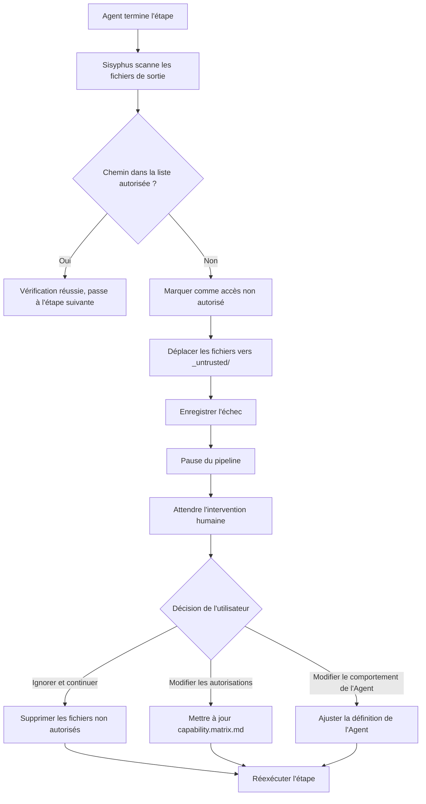

# Autorisations et mécanismes de sécurité : Matrice des capacités et protection contre les accès non autorisés

## Ce que vous saurez faire après ce cours

- Comprendre les principes de conception de la matrice des capacités et les mécanismes d'isolement des autorisations
- Savoir configurer les fichiers d'autorisations Claude Code, éviter d'utiliser `--dangerously-skip-permissions`
- Maîtriser le processus de gestion des accès non autorisés et les méthodes de récupération
- Comprendre le mécanisme de vérification obligatoire des compétences
- Pouvoir identifier et corriger les problèmes de sécurité liés aux autorisations

## Vos problèmes actuels

Vous avez peut-être rencontré ces situations :

- Vous ne savez pas pourquoi l'Agent ne peut pas accéder à certains fichiers
- Vous êtes toujours invité à fournir des autorisations lors de l'exécution de `factory run`, et vous avez utilisé `--dangerously-skip-permissions` pour les contourner
- Vous n'êtes pas clair sur les frontières d'autorisation entre les Agents et vous craignez que les accès non autorisés ne contaminent les données
- Après un accès non autorisé, vous ne savez pas comment le gérer et récupérer

Si ces problèmes vous dérangent, ce chapitre vous aidera à établir une compréhension complète des autorisations et de la sécurité.

## Quand utiliser cette méthode

Quand vous avez besoin de :

- **Configurer Claude Code** : Définir les fichiers d'autorisations corrects pour les projets Factory
- **Déboguer les problèmes d'autorisations** : Examiner pourquoi un Agent ne peut pas lire ou écrire des fichiers spécifiques
- **Gérer les exceptions d'accès non autorisé** : Récupérer un pipeline interrompu causé par des opérations non autorisées
- **Étendre un Agent** : Définir ses limites d'autorisation lors de l'ajout d'un nouvel Agent
- **Audit de sécurité** : Vérifier si la configuration des autorisations des projets existants est raisonnable

## Idée principale

Le mécanisme de sécurité d'AI App Factory repose sur la **Matrice des capacités** (Capability Boundary Matrix), garantissant que chaque Agent ne peut opérer que dans des répertoires autorisés.

**Gardez cette analogie en tête** :

- Les Agents sont comme des **ouvriers spécialisés** dans une usine
- La matrice des capacités est comme un **permis de travail**, spécifiant clairement quels ateliers chaque ouvrier peut entrer et quels équipements il peut utiliser
- Le planificateur Sisyphus est comme un **responsable de la sécurité**, vérifiant les permis lors de l'entrée et de la sortie des ateliers pour éviter tout accès non autorisé

**Mécanisme de protection à trois couches** :

| Couche | Responsabilité | Moment de vérification |
| --- | --- | --- |
| **Autorisations Claude Code** | Autorisations de lecture/écriture du système de fichiers | Au démarrage de l'assistant IA |
| **Matrice des capacités** | Autorisations d'accès aux répertoires des Agents | Avant et après l'exécution des étapes |
| **Vérification obligatoire des compétences** | Exigences d'utilisation des compétences pour des étapes spécifiques | Étapes bootstrap et ui |

## Explication détaillée de la matrice des capacités

### Pourquoi avons-nous besoin d'isolement des autorisations ?

Imaginez ce qui se passerait sans limites d'autorisation :

- **L'Agent PRD a modifié les fichiers UI** : La conception UI est perturbée, impossible à tracer
- **L'Agent Tech a lu les fichiers Code** : L'architecture technique est influencée par l'implémentation du code, s'écartant des principes MVP
- **L'Agent Code a modifié le PRD** : Le document des exigences est « contaminé » par la logique du code, confusion des responsabilités

**Réponse** : Frontières de responsabilités floues, artefacts non traçables, qualité non garantie.

La matrice des capacités garantit la séparation des responsabilités en limitant les autorisations de lecture/écriture de chaque Agent.

### Tableau de la matrice des autorisations

| Agent | Répertoires lisibles | Répertoires inscriptibles | Description |
| --- | --- | --- | --- |
| **bootstrap** | Aucun | `input/` | Créer ou modifier uniquement `idea.md` dans le répertoire `input/` |
| **prd** | `input/` | `artifacts/prd/` | Lire le fichier idée, générer le PRD ; interdit d'écrire dans d'autres répertoires |
| **ui** | `artifacts/prd/` | `artifacts/ui/` | Lire le PRD, générer le Schéma UI et l'aperçu |
| **tech** | `artifacts/prd/` | `artifacts/tech/`, `artifacts/backend/prisma/` | Lire le PRD, générer la conception technique et le modèle de données |
| **code** | `artifacts/ui/`, `artifacts/tech/`, `artifacts/backend/prisma/` | `artifacts/backend/`, `artifacts/client/` | Générer le code backend et client selon la conception UI et technique ; ne pas modifier les artefacts amont |
| **validation** | `artifacts/backend/`, `artifacts/client/` | `artifacts/validation/` | Valider la qualité du code, générer le rapport de validation ; lecture seule sans modifier le code |
| **preview** | `artifacts/backend/`, `artifacts/client/` | `artifacts/preview/` | Lire les services et clients générés, écrire les instructions de démonstration |

::: tip Principe clé
- **Dépendance unidirectionnelle** : Les Agents ne peuvent lire que les artefacts des étapes amont, pas les artefacts aval ou de même niveau
- **Indépendance des responsabilités** : Chaque Agent ne peut écrire que dans son propre répertoire de production
- **Interdiction d'accès non autorisé** : Les opérations de lecture/écriture non autorisées sont considérées comme des violations de sécurité
:::

### Flux de vérification des autorisations

Le planificateur Sisyphus effectue une vérification des autorisations avant et après l'exécution de chaque étape :

**Avant l'exécution (notification des autorisations)** :

```
1. Sisyphus lit capability.matrix.md
2. Transmet les répertoires lisibles et inscriptibles de l'Agent actuel à l'assistant IA
3. L'assistant IA doit respecter ces limites lors de l'exécution
```

**Après l'exécution (vérification de la sortie)** :

```
1. Sisyphus scanne les fichiers nouvellement créés ou modifiés
2. Vérifie si les chemins des fichiers sont dans la plage des répertoires autorisés de l'Agent
3. Si un accès non autorisé est détecté, traite-le immédiatement (voir mécanisme de gestion des accès non autorisés)
```

::: info Automatisation vs intervention manuelle
La vérification des autorisations est principalement effectuée automatiquement par le système d'autorisations de l'assistant IA (Claude Code) et la logique de vérification de Sisyphus. L'intervention manuelle n'est nécessaire que dans des situations anormales telles que les accès non autorisés.
:::

## Configuration des autorisations Claude Code

### Pourquoi --dangerously-skip-permissions n'est-il pas recommandé ?

Vous avez peut-être vu cette commande :

```bash
claude --dangerously-skip-permissions
```

**Problèmes de cette option** :

| Problème | Description | Risque |
| --- | --- | --- |
| **Contourne toutes les vérifications** | Claude Code ne vérifie plus aucune opération de fichier | L'IA peut supprimer ou modifier par erreur des fichiers système |
| **Faille de sécurité** | Les Agents peuvent lire et écrire dans n'importe quel répertoire | Les accès non autorisés ne peuvent pas être interceptés |
| **Impossible à tracer** | Pas de limites d'autorisation, problèmes difficiles à localiser | Débogage et maintenance difficiles |

### Génération automatique de la configuration des autorisations par Factory

Factory CLI génère automatiquement `.claude/settings.local.json` lors de l'initialisation du projet, configurant des autorisations précises :

**Moment de génération** : Lors de l'exécution de la commande `factory init`

**Contenu de la configuration** (emplacement du code source : `cli/utils/claude-settings.js:41-91`) :

```json
{
  "permissions": {
    "allow": [
      // ========== Autorisations d'opérations de fichiers ==========
      "Read(/path/to/project/**)",
      "Write(/path/to/project/**)",
      "Glob(/path/to/project/**)",
      "Edit(/path/to/project/*,**)",
      
      // ========== Autorisations d'opérations Git ==========
      "Bash(git add:*)",
      "Bash(git commit:*)",
      "Bash(git push:*)",
      // ... plus de commandes git
      
      // ========== Autorisations des outils de construction ==========
      "Bash(npm install:*)",
      "Bash(npm run:*)",
      "Bash(npx:*)",
      
      // ========== Autorisations TypeScript ==========
      "Bash(tsc:*)",
      "Bash(npx type-check:*)",
      
      // ========== Autorisations de base de données (Prisma) ==========
      "Bash(npx prisma validate:*)",
      "Bash(npx prisma generate:*)",
      "Bash(npx prisma migrate dev:*)",
      
      // ========== Autorisations Factory CLI ==========
      "Bash(factory init:*)",
      "Bash(factory run:*)",
      "Bash(factory continue:*)",
      
      // ========== Autorisations Docker ==========
      "Bash(docker compose:*)",
      "Bash(docker build:*)",
      
      // ========== Autorisations des compétences (Plugins) ==========
      "Skill(superpowers:brainstorming)",
      "Skill(superpowers:writing-plans)",
      "Skill(ui-ux-pro-max)",
      "Skill(*)",
      
      // ========== Autorisations des opérations Web ==========
      "WebFetch(domain:github.com)",
      "WebFetch(domain:npmjs.org)",
      
      // ========== Autorisations des outils génériques ==========
      "Bash(curl:*)",
      "Bash(grep:*)",
      "Bash(find:*)"
    ]
  },
  "features": {
    "autoSave": true,
    "telemetry": false
  }
}
```

**Caractéristiques de la configuration des autorisations** :

| Caractéristique | Description | Exemple |
| --- | --- | --- |
| **Restriction au niveau du projet** | Autorise uniquement la lecture/écriture du répertoire du projet actuel | `Read(/Users/xxx/my-app/**)` |
| **Contrôle précis au niveau des commandes** | Chaque commande a un modèle d'autorisation explicite | `Bash(npm install:*)` n'autorise pas `npm install --global` |
| **Support multiplateforme** | Adapte automatiquement les chemins Windows et Unix | Windows utilise `//d/**`, Unix utilise `/path/**` |
| **Liste blanche des compétences** | Liste explicitement les compétences autorisées | `Skill(superpowers:brainstorming)` |

**Vérifier si la configuration est effective** :

```bash
# Voir la configuration des autorisations générée
cat .claude/settings.local.json

# Vérifier l'existence du fichier
ls -la .claude/settings.local.json
```

::: warning Différences de plateforme
Les formats de chemins Windows et Unix/macOS sont différents :
- Windows : `//C/**` ou `//d/**` (lettre de lecteur)
- Unix/macOS : `/Users/username/project/**`

Factory détecte automatiquement la plateforme actuelle et génère le format de chemin correct.
:::

## Mécanisme de gestion des accès non autorisés

### Qu'est-ce qu'un accès non autorisé ?

**Définition** : Un Agent écrit dans un répertoire non autorisé dans sa liste d'autorisations.

**Scénarios typiques** :

| Agent | Répertoire autorisé en écriture | Répertoire d'écriture non autorisé | Problème |
| --- | --- | --- | --- |
| **prd** | `artifacts/prd/` | `artifacts/ui/` | L'Agent PRD a modifié par erreur les fichiers UI |
| **tech** | `artifacts/tech/` | `artifacts/prd/` | L'Agent Tech a modifié le document des exigences |
| **code** | `artifacts/backend/` | `artifacts/prd/` | L'Agent Code a modifié par erreur les artefacts amont |

### Flux de gestion des accès non autorisés

Lorsque Sisyphus détecte une écriture non autorisée :



### Isolement des artefacts non autorisés

Les fichiers non autorisés sont déplacés vers le répertoire `artifacts/_untrusted/<stage-id>/` :

**Exemple** : L'Agent PRD écrit non autorisé dans `artifacts/ui/`

```
artifacts/
├── prd/
│   └── prd.md
├── ui/
│   └── ui.schema.yaml  ← Devrait être ici, mais a été écrit par l'Agent PRD
└── _untrusted/
    └── prd/
        └── ui/
            └── ui.schema.yaml  ← Fichier non autorisé déplacé ici
```

**Message d'erreur** :

```
⚠️  Unauthorized writes detected for stage "prd":

Untrusted files:
  - artifacts/ui/ui.schema.yaml

Files moved to quarantine: artifacts/_untrusted/prd/artifacts/ui/ui.schema.yaml

Pipeline paused. Please review these files before proceeding.

Choose action:
  1. Delete untrusted files and retry
  2. Adjust permissions in capability.matrix.md
  3. Modify Agent behavior in .factory/agents/prd.agent.md
  4. Continue (accept untrusted files) - Not recommended
```

### Intervention manuelle

**Option 1 : Supprimer les fichiers non autorisés, réexécuter** (recommandé)

```bash
# Voir les fichiers non autorisés
ls -la artifacts/_untrusted/prd/

# Supprimer les fichiers non autorisés
rm -rf artifacts/_untrusted/prd/

# Réexécuter l'étape
factory continue
```

**Option 2 : Ajuster la matrice des autorisations**

Si l'accès non autorisé est raisonnable (par exemple, un Agent a vraiment besoin d'écrire dans un répertoire supplémentaire) :

```bash
# Éditer la matrice des autorisations
nano .factory/policies/capability.matrix.md

# Modifier les répertoires inscriptibles de l'Agent
# Par exemple : ajouter l'autorisation d'écriture `artifacts/ui/` à l'Agent prd

# Réexécuter
factory continue
```

**Option 3 : Modifier le comportement de l'Agent**

Si l'accès non autorisé est une erreur de l'Agent :

```bash
# Éditer la définition de l'Agent
nano .factory/agents/prd.agent.md

# Interdire explicitement l'écriture dans les répertoires non autorisés
# Ajouter l'instruction : "Interdire l'écriture dans artifacts/ui/ ou d'autres répertoires non autorisés"

# Réexécuter
factory continue
```

::: danger Avertissement
L'option 4 (accepter les fichiers non autorisés) est **fortement déconseillée** car :
- Elle viole le principe de conception de l'isolement des autorisations
- Elle entraîne une confusion des responsabilités, difficile à tracer
- Les étapes suivantes peuvent échouer en raison d'artefacts incorrects
:::

## Vérification obligatoire de l'utilisation des compétences

Certaines étapes exigent l'utilisation de compétences spécifiques pour garantir la qualité de la sortie. Sisyphus vérifie l'utilisation de ces compétences.

### Vérification de l'étape bootstrap

**Exigence obligatoire** : Doit utiliser la compétence `superpowers:brainstorm`

**Pourquoi ?**

- La compétence de brainstorming fournit un cadre de pensée structuré
- Garantit que l'idée du produit est explorée en profondeur, pas seulement décrite superficiellement
- Empêche l'Agent de sauter des étapes d'analyse clés

**Méthode de vérification** :

1. Vérifier si le message de sortie de l'Agent mentionne explicitement l'utilisation de cette compétence
2. Si elle n'est pas mentionnée, refuser d'accepter l'artefact
3. Demander de réexécuter, en soulignant clairement que cette compétence doit être utilisée

**Message d'échec** :

```
❌ Détecté non-utilisation de la compétence superpowers:brainstorm

L'Agent Bootstrap doit utiliser la compétence superpowers:brainstorm pour explorer en profondeur l'idée de l'utilisateur.

Veuillez réexécuter l'étape bootstrap et mentionner explicitement dans la sortie :
"J'ai utilisé la compétence superpowers:brainstorm pour analyser l'idée de l'utilisateur..."
```

**Exemple correct** :

```
J'ai utilisé la compétence superpowers:brainstorm pour analyser en profondeur l'idée de l'utilisateur.

Grâce à la compétence de brainstorming, j'ai identifié les points clés suivants :
- Problème central : [Description du problème]
- Utilisateurs cibles : [Profil utilisateur]
- Proposition de valeur : [Points de valeur]
- Hypothèses clés : [Liste des hypothèses]

Document d'idée généré : input/idea.md
```

### Vérification de l'étape ui

**Exigence obligatoire** : Doit utiliser la compétence `ui-ux-pro-max`

**Pourquoi ?**

- La compétence UI/UX Pro Max fournit un cadre professionnel de système de conception
- Évite le « style par défaut de l'IA » (police Inter, dégradé violet, etc.)
- Garantit la cohérence et la maintenabilité de la conception

**Méthode de vérification** :

1. Vérifier si le message de sortie de l'Agent mentionne explicitement l'utilisation de cette compétence
2. Vérifier si la configuration du système de conception dans `ui.schema.yaml` est professionnelle
3. Si la configuration du système de conception n'est pas recommandée, refuser d'accepter l'artefact

**Message d'échec** :

```
❌ Détecté non-utilisation de la compétence ui-ux-pro-max

L'Agent UI doit utiliser la compétence ui-ux-pro-max pour générer un système de conception professionnel et un prototype UI.

Veuillez réexécuter l'étape ui et mentionner explicitement dans la sortie :
"J'ai utilisé la compétence ui-ux-pro-max pour concevoir le système UI..."
```

**Exemple correct** :

```
J'ai utilisé la compétence ui-ux-pro-max pour concevoir le système UI et le prototype.

Grâce à la compétence ui-ux-pro-max, j'ai choisi :
- Direction de conception : [Style spécifique, ex : minimalisme / cyberpunk]
- Système de couleurs : [Palette de couleurs]
- Système de polices : [Choix des polices]
- Bibliothèque de composants : [Spécifications des composants]

Artefacts UI générés :
- artifacts/ui/ui.schema.yaml
- artifacts/ui/preview.web/index.html
```

### Gestion des échecs consécutifs

Si une étape échoue deux fois de suite en raison de la vérification des compétences :

1. Pause du pipeline
2. Demander l'intervention humaine
3. Vérifier les problèmes possibles :
   - L'assistant IA a-t-il installé la compétence (Plugin) correspondante
   - La définition de l'Agent exige-t-elle explicitement l'utilisation de cette compétence
   - Le chemin du fichier Skill est-il correct

## Exercice pratique : Gestion des exceptions d'accès non autorisé

Supposons que l'Agent PRD a écrit non autorisé dans le répertoire UI, examinons le processus complet de gestion.

### Étape 1 : Identifier l'accès non autorisé

Après l'achèvement de l'étape PRD, Sisyphus signale :

```
⚠️  Unauthorized writes detected for stage "prd":

Untrusted files:
  - artifacts/ui/ui.schema.yaml

Files moved to quarantine: artifacts/_untrusted/prd/artifacts/ui/ui.schema.yaml

Pipeline paused.
```

### Étape 2 : Voir les fichiers non autorisés

```bash
# Voir le contenu des fichiers non autorisés
cat artifacts/_untrusted/prd/artifacts/ui/ui.schema.yaml

# Exemple de sortie :
```
```yaml
# UI Schema généré par l'Agent PRD (artefact non autorisé)
pages:
  - name: Home
    components:
      - Hero
      - Features
```

### Étape 3 : Analyser la cause

**Causes possibles** :

| Cause | Description | Preuve |
| --- | --- | --- |
| **Erreur de l'Agent** | L'Agent PRD a généré par erreur des fichiers UI | Le contenu du fichier contient effectivement une structure UI |
| **Invite non claire** | La définition de l'Agent n'interdit pas l'écriture dans d'autres répertoires | Besoin de vérifier `.factory/agents/prd.agent.md` |
| **Erreur de configuration des autorisations** | Les autorisations d'écriture de l'Agent PRD sont trop étendues | Besoin de vérifier `capability.matrix.md` |

**Vérifier la définition de l'Agent** :

```bash
cat .factory/agents/prd.agent.md
```

**Vérifier la matrice des autorisations** :

```bash
cat .factory/policies/capability.matrix.md | grep -A 1 "prd"
```

**Sortie** :

```
| **prd** | `input/` | `artifacts/prd/` | Lire le fichier idée, générer le PRD ; interdit d'écrire dans d'autres répertoires |
```

La matrice des autorisations est correcte, le problème réside dans le comportement de l'Agent.

### Étape 4 : Corriger la définition de l'Agent

Éditer la définition de l'Agent, ajouter des instructions d'interdiction explicites :

```bash
nano .factory/agents/prd.agent.md
```

**Contenu à ajouter** :

```markdown
## Interdictions

- ❌ **Interdit d'écrire dans le répertoire `artifacts/ui/`** : La conception UI est gérée par l'Agent UI
- ❌ **Interdit d'écrire dans le répertoire `artifacts/tech/`** : L'architecture technique est gérée par l'Agent Tech
- ❌ **Interdit d'écrire dans `artifacts/backend/` ou `artifacts/client/`** : La génération de code est gérée par l'Agent Code
- ✅ **Uniquement écrire dans le répertoire `artifacts/prd/`** : Générer le document PRD
```

### Étape 5 : Supprimer les fichiers non autorisés, réexécuter

```bash
# Supprimer les fichiers non autorisés
rm -rf artifacts/_untrusted/prd/

# Réexécuter l'étape PRD
factory continue
```

### Étape 6 : Vérifier la correction

Vérifier si l'étape PRD a à nouveau un accès non autorisé :

```bash
# Voir les artefacts générés
ls -la artifacts/prd/

# Confirmer qu'aucun autre répertoire n'a été écrit
ls -la artifacts/_untrusted/prd/

# La sortie devrait être vide, indiquant qu'il n'y a pas de nouvel accès non autorisé
```

**Signe de succès** :

```
✓ prd terminé !

Artefacts générés :
- artifacts/prd/prd.md

... (options de point de contrôle)

Aucun avertissement d'accès non autorisé
```

## Meilleures pratiques de sécurité

### 1. Vérifier la configuration des autorisations lors de l'initialisation

```bash
# Vérifier immédiatement après factory init
cat .claude/settings.local.json

# Vérifier les éléments suivants :
# ✅ Le tableau permissions.allow existe
# ✅ Le chemin du projet est correct (Windows : //d/**, Unix : /path/**)
# ✅ Contient les autorisations de commandes nécessaires (npm, git, factory, docker, etc.)
# ✅ Contient les autorisations de compétences (superpowers, ui-ux-pro-max)
```

### 2. Réviser régulièrement la matrice des autorisations

```bash
# Vérifier la matrice des autorisations
cat .factory/policies/capability.matrix.md

# Confirmer :
# ✅ Les autorisations de lecture/écriture de chaque Agent sont raisonnables
# ✅ Pas d'autorisations excessives (par exemple, l'Agent Code ne devrait pas écrire dans le PRD)
# ✅ Le mécanisme de gestion des accès non autorisés est clair
```

### 3. Surveiller les événements d'accès non autorisé

```bash
# Voir s'il y a des fichiers non autorisés
ls -la artifacts/_untrusted/

# Si des fichiers non autorisés existent, analyser la cause :
# - Est-ce une erreur de l'Agent ?
# - Est-ce une configuration d'autorisations déraisonnable ?
# - Est-ce que la définition de l'Agent doit être ajustée ?
```

### 4. Utiliser le contrôle de version pour protéger les fichiers de configuration

```bash
# Ajouter les fichiers de configuration clés à Git
git add .claude/settings.local.json
git add .factory/policies/capability.matrix.md
git commit -m "chore: add security configuration files"
```

**Raisons** :

- Empêcher la suppression ou modification accidentelle de la configuration
- Prendre en charge la traçabilité des versions de la configuration des autorisations
- Maintenir des autorisations cohérentes lors de la collaboration en équipe

::: warning settings.local.json doit-il être soumis ?
Bien que le nom contienne `local`, le `.claude/settings.local.json` généré par Factory est une configuration d'autorisations au niveau du projet et devrait être soumis au contrôle de version. Tous les membres de l'équipe devraient utiliser la même configuration d'autorisations.
:::

### 5. Mettre régulièrement à jour la configuration des autorisations

Lorsque les situations suivantes se produisent, la configuration des autorisations doit être mise à jour :

| Condition de déclenchement | Configuration à mettre à jour |
| --- | --- |
| Ajout d'un nouvel Agent | Mettre à jour `capability.matrix.md` |
| Introduction de nouveaux outils de construction | Mettre à jour les autorisations Bash de `settings.local.json` |
| Ajout de nouvelles compétences (Plugins) | Mettre à jour les autorisations Skill de `settings.local.json` |
| Ajustement des responsabilités des Agents | Mettre à jour `capability.matrix.md` |

**Processus de mise à jour** :

```bash
# 1. Modifier les fichiers de configuration
nano .claude/settings.local.json
# ou
nano .factory/policies/capability.matrix.md

# 2. Soumettre les modifications
git add .claude/settings.local.json
git add .factory/policies/capability.matrix.md
git commit -m "security: update permissions for new Agent/Tool"

# 3. Réinitialiser les autorisations (facultatif)
# Si vous avez modifié capability.matrix.md, aucune opération supplémentaire n'est nécessaire, Sisyphus lira automatiquement
# Si vous avez modifié settings.local.json, il peut être nécessaire de redémarrer Claude Code
```

## Dépannage des problèmes de sécurité courants

### Problème 1 : L'Agent ne peut pas lire le fichier

**Symptômes** :

```
❌ Erreur : Impossible de lire le fichier : artifacts/prd/prd.md
```

**Étapes de dépannage** :

1. Vérifier si le fichier existe
   ```bash
   ls -la artifacts/prd/prd.md
   ```

2. Vérifier les autorisations de lecture de l'Agent
   ```bash
   cat .factory/policies/capability.matrix.md | grep -A 1 "prd"
   ```
   Confirmer que les répertoires lisibles de l'Agent incluent le répertoire où se trouve le fichier.

3. Vérifier la configuration des autorisations Claude Code
   ```bash
   cat .claude/settings.local.json | grep "Read"
   ```
   Confirmer que l'autorisation Read du répertoire du projet existe.

### Problème 2 : L'Agent ne peut pas écrire le fichier

**Symptômes** :

```
❌ Erreur : Impossible d'écrire le fichier : artifacts/prd/prd.md
```

**Étapes de dépannage** :

1. Vérifier les autorisations d'écriture de l'Agent
   ```bash
   cat .factory/policies/capability.matrix.md | grep -A 1 "prd"
   ```
   Confirmer que les répertoires inscriptibles de l'Agent incluent le répertoire cible.

2. Vérifier la configuration des autorisations Claude Code
   ```bash
   cat .claude/settings.local.json | grep "Write"
   ```
   Confirmer que l'autorisation Write du répertoire du projet existe.

3. Vérifier si le répertoire existe
   ```bash
   ls -la artifacts/prd/
   ```
   Si le répertoire n'existe pas, l'Agent le créera automatiquement, mais il aura besoin de l'autorisation Write.

### Problème 3 : Avertissements d'accès non autorisé fréquents

**Symptômes** :

Le même Agent affiche fréquemment des avertissements d'accès non autorisé.

**Étapes de dépannage** :

1. Analyser le modèle d'accès non autorisé
   ```bash
   ls -la artifacts/_untrusted/<stage-id>/
   ```
   Voir quels répertoires l'Agent écrit toujours.

2. Vérifier la définition de l'Agent
   ```bash
   cat .factory/agents/<stage>.agent.md
   ```
   Confirmer s'il y a des instructions d'interdiction explicites.

3. Envisager si les autorisations doivent être ajustées
   - Si l'accès non autorisé est raisonnable → Mettre à jour `capability.matrix.md`
   - Si l'accès non autorisé est une erreur → Modifier la définition de l'Agent

### Problème 4 : Échec de la vérification des compétences

**Symptômes** :

```
❌ Détecté non-utilisation de la compétence superpowers:brainstorm
```

**Étapes de dépannage** :

1. Confirmer que la compétence est installée
   - Vérifier si l'assistant IA a installé le Plugin correspondant
   - Claude Code : Vérifier les autorisations Skill de `settings.local.json`
   - OpenCode : Vérifier la liste des Plugins

2. Vérifier la définition de l'Agent
   ```bash
   cat .factory/agents/<stage>.agent.md
   ```
   Confirmer que l'Agent exige explicitement l'utilisation de cette compétence.

3. Vérifier le chemin du fichier Skill
   ```bash
   ls -la .factory/skills/<stage>/skill.md
   ```
   Confirmer que le fichier Skill existe et que le chemin est correct.

## Résumé du cours

Les mécanismes d'autorisations et de sécurité constituent le système de protection central d'AI App Factory, comprenant :

**Protection à trois couches** :

1. **Autorisations Claude Code** : Autorisations de lecture/écriture du système de fichiers, configurées par `settings.local.json`
2. **Matrice des capacités** : Autorisations d'accès aux répertoires des Agents, définies par `capability.matrix.md`
3. **Vérification obligatoire des compétences** : Exigences d'utilisation des compétences pour des étapes spécifiques, vérifiées par Sisyphus

**Principes clés** :

- Séparation des responsabilités : Chaque Agent ne peut lire et écrire que dans des répertoires autorisés
- Dépendance unidirectionnelle : Les Agents ne peuvent lire que les artefacts amont, pas les artefacts aval ou de même niveau
- Isolement des accès non autorisés : Les fichiers non autorisés sont automatiquement déplacés vers `_untrusted/`, en attente de traitement manuel
- Garantie des compétences : Les étapes Bootstrap et UI doivent utiliser des compétences spécifiées

**Points clés de la pratique** :

- Vérifier la configuration des autorisations lors de l'initialisation
- Réviser régulièrement la matrice des capacités pour garantir des autorisations raisonnables
- Surveiller les événements d'accès non autorisé, corriger rapidement le comportement des Agents
- Utiliser le contrôle de version pour protéger les fichiers de configuration
- En cas de problèmes, suivre le processus de dépannage pour localiser la cause

**Gardez ce processus en tête** :

```
factory init → Générer la configuration des autorisations → Exécuter le pipeline → Sisyphus vérifie les autorisations
       ↓                                                      │
       └── Accès non autorisé ? → Déplacer vers _untrusted/ → Intervention humaine → Corriger → Continuer ──┘
```

## Aperçu du prochain cours

> Dans le prochain cours, nous apprendrons **[Gestion des échecs et annulation](../failure-handling/)**.
>
> Vous apprendrez :
> - Mécanismes de détection des échecs (sortie manquante, contenu incohérent, accès non autorisé)
> - Stratégies de réessai automatique et processus d'archivage des échecs
> - Mécanismes d'annulation et processus d'intervention manuelle
> - Comment récupérer le pipeline après un échec

## Annexe : Référence du code source

<details>
<summary><strong>Cliquez pour afficher les emplacements du code source</strong></summary>

> Date de mise à jour : 2026-01-29

| Fonction | Chemin du fichier | Numéro de ligne |
| --- | --- | --- |
| Définition de la matrice des capacités | [`source/hyz1992/agent-app-factory/policies/capability.matrix.md`](https://github.com/hyz1992/agent-app-factory/blob/main/policies/capability.matrix.md) | Texte complet (lignes 1-23) |
| Génération des autorisations Claude Code | [`source/hyz1992/agent-app-factory/cli/utils/claude-settings.js`](https://github.com/hyz1992/agent-app-factory/blob/main/cli/utils/claude-settings.js) | Lignes 38-91 |
| Logique de vérification des autorisations | [`source/hyz1992/agent-app-factory/agents/orchestrator.checkpoint.md`](https://github.com/hyz1992/agent-app-factory/blob/main/agents/orchestrator.checkpoint.md) | Lignes 47-53 |
| Stratégie de gestion des accès non autorisés | [`source/hyz1992/agent-app-factory/agents/orchestrator.checkpoint.md`](https://github.com/hyz1992/agent-app-factory/blob/main/agents/orchestrator.checkpoint.md) | Lignes 19-21 |
| Vérification de la compétence Bootstrap | [`source/hyz1992/agent-app-factory/agents/orchestrator.checkpoint.md`](https://github.com/hyz1992/agent-app-factory/blob/main/agents/orchestrator.checkpoint.md) | Lignes 58-70 |
| Vérification de la compétence UI | [`source/hyz1992/agent-app-factory/agents/orchestrator.checkpoint.md`](https://github.com/hyz1992/agent-app-factory/blob/main/agents/orchestrator.checkpoint.md) | Lignes 72-84 |

**Fonctions clés** :

- `generatePermissions(projectDir)` - Générer la configuration des autorisations Claude Code (lignes 41-91)
- `generateClaudeSettings(projectDir)` - Générer et écrire `settings.local.json` (lignes 256-275)
- `getPathPatterns()` - Obtenir les modèles de chemin spécifiques à la plateforme (lignes 14-36)

**Constantes clés** :

- Répertoire d'isolement des accès non autorisés : `artifacts/_untrusted/<stage-id>/`
- Noms des compétences :
  - Bootstrap : `superpowers:brainstorm`
  - UI : `ui-ux-pro-max`
- Formats de chemin de plateforme :
  - Windows : `//{drive}/**`
  - Unix/macOS : `/path/to/project/**`

</details>
