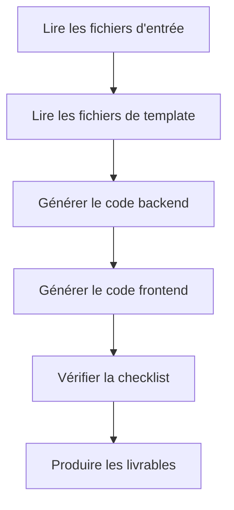

# Phase 5 : Code - Génération de Code Exécutable

## Ce Que Vous Pourrez Faire

- **Génération full-stack en un clic** : Générer automatiquement des applications frontend et backend exécutables à partir du UI Schema et de la conception Tech
- **Comprendre le flux de génération de code** : Maîtriser comment Code Agent transforme les documents de conception en code de production
- **Valider la qualité du code** : Apprendre à vérifier l'intégrité du code généré, la couverture de test et les standards de sécurité
- **Déboguer les problèmes courants** : Résoudre les problèmes d'installation de dépendances, de vérification de types et de connexion API

## Votre Situation Actuelle

Vous avez terminé la structuration de l'idée produit, la génération du PRD, la conception UI et l'architecture technique. Le plus difficile maintenant est :

- **Comment transformer la conception en code** : Le UI Schema et la conception Tech sont dans des documents, mais comment les implémenter ?
- **Le développement full-stack est trop complexe** : Le backend nécessite Express + Prisma, le frontend nécessite React Native, par où commencer ?
- **La qualité du code est difficile à garantir** : Comment s'assurer que le code généré a des tests, de la documentation et respecte les normes de sécurité ?
- **Pas assez de temps** : Écrire un MVP prend plusieurs jours, y a-t-il une méthode plus rapide ?

La phase Code est conçue pour résoudre ces problèmes — elle génère automatiquement du code full-stack de production basé sur les conceptions des phases précédentes.

## Quand Utiliser Cette Méthode

Lorsque vous avez besoin de :

- **Valider rapidement une idée** : Valider la faisabilité d'une idée produit avec du code, plutôt que d'investir directement dans le développement
- **Créer une structure d'application** : Fournir une base exécutable pour le développement ultérieur, plutôt que de partir de zéro
- **Unifier la stack technique** : S'assurer que le code frontend et backend suit une architecture et des normes unifiées
- **Économiser du temps de développement** : De la conception au code, compléter le framework MVP en quelques minutes

## Idée Principale

Code Agent est un **ingénieur full-stack**. Sa mission est de transformer les documents de conception des phases précédentes en code exécutable. Ses caractéristiques principales :

### Entrées et Sorties

| Type | Contenu |
|------|---------|
| **Entrée** | UI Schema (structure d'interface), Conception Tech (solution technique), Prisma Schema (modèle de données) |
| **Sortie** | `artifacts/backend/` (code backend), `artifacts/client/` (code frontend) |

### Stack Technique

| Partie | Stack Technique |
|--------|-----------------|
| **Backend** | Express + Prisma + TypeScript |
| **Frontend** | React Native Web + Expo + TypeScript |
| **Base de données** | SQLite (développement) / PostgreSQL (production) |

### Contraintes d'Exécution

::: warning Portée Stricte
Code Agent **implémente uniquement** les fonctionnalités confirmées dans le PRD et le UI Schema, **n'ajoute pas** :
- Systèmes d'authentification et d'autorisation
- Gestion d'état complexe (comme Redux)
- Fonctionnalités non essentielles
:::

## Suivez-Moi

### Étape 1 : Entrer dans la Phase Code

Supposons que vous avez terminé la phase Tech et que vous souhaitez maintenant générer le code.

```bash
# Si dans le pipeline, passer directement à la phase suivante
factory run code

# Ou redémarrer depuis une phase spécifique
factory run code
```

**Vous devriez voir** : La CLI affiche les informations de la phase Code, y compris les fichiers d'entrée et les sorties attendues.

### Étape 2 : L'Assistant AI Exécute Code Agent

L'assistant AI charge `agents/code.agent.md` et `skills/code/skill.md`, puis commence l'exécution.

Flux d'exécution de Code Agent :



**Ce Que Fera l'Assistant AI** :

1. **Lire les fichiers de template** (`skills/code/references/backend-template.md` et `frontend-template.md`)
   - Comprendre la structure du projet et l'organisation du code
   - Apprendre comment organiser les répertoires et les fichiers de configuration

2. **Analyser les fichiers d'entrée**
   - Comprendre la structure des pages et les composants depuis `ui.schema.yaml`
   - Comprendre l'architecture technique et la conception API depuis `tech.md`
   - Comprendre le modèle de données depuis `schema.prisma`

3. **Générer le code backend**
   - Créer la structure de projet Express + Prisma
   - Générer les routes API et les contrôleurs
   - Implémenter la validation des données et la gestion des erreurs
   - Ajouter les tests et la documentation

4. **Générer le code frontend**
   - Créer la structure de projet React Native + Expo
   - Générer les composants de page et les composants UI
   - Implémenter la gestion d'état des données et les appels API
   - Ajouter les tests et la configuration de navigation

5. **Vérifier la checklist**
   - Vérifier contre la checklist dans Code Skill
   - S'assurer que tous les éléments obligatoires sont terminés

6. **Produire les livrables**
   - Générer les répertoires `artifacts/backend/` et `artifacts/client/`

### Étape 3 : Valider le Code Généré

Une fois Code Agent terminé, une structure de répertoire de code complète sera générée.

**Structure du Répertoire Backend** :

```
backend/
├── package.json          # Dépendances et scripts
├── tsconfig.json         # Configuration TypeScript
├── .env.example          # Template de variables d'environnement
├── .gitignore            # Fichiers ignorés par Git
├── README.md             # Description du projet
├── GETTING_STARTED.md    # Guide de démarrage rapide
├── prisma/
│   ├── schema.prisma     # Modèle de données (copié depuis la phase Tech)
│   └── seed.ts           # Données de seed
└── src/
    ├── index.ts          # Point d'entrée de l'application
    ├── app.ts            # Configuration Express
    ├── config/           # Configuration des variables d'environnement
    ├── lib/              # Client Prisma
    ├── middleware/       # Gestion des erreurs, logs
    ├── routes/           # Routes API
    ├── controllers/      # Contrôleurs
    ├── services/         # Logique métier
    ├── validators/       # Validation des entrées (Zod)
    └── __tests__/        # Fichiers de test
```

**Structure du Répertoire Frontend** :

```
client/
├── package.json          # Dépendances et scripts
├── tsconfig.json         # Configuration TypeScript
├── app.json              # Configuration Expo
├── babel.config.js       # Configuration Babel
├── .env.example          # Template de variables d'environnement
├── .gitignore            # Fichiers ignorés par Git
├── README.md             # Description du projet
├── GETTING_STARTED.md    # Guide de démarrage rapide
├── App.tsx               # Point d'entrée de l'application
└── src/
    ├── config/           # Configuration des variables d'environnement
    ├── api/              # Client API
    ├── components/       # Composants UI
    ├── hooks/            # Hooks personnalisés
    ├── navigation/       # Configuration de navigation
    ├── screens/          # Composants de page
    ├── styles/           # Thème et styles
    └── types/            # Définitions de types
```

**Point de Contrôle ✅** : Confirmer que les fichiers suivants existent :

| Fichier | Backend | Frontend |
|---------|---------|----------|
| `package.json` | ✅ | ✅ |
| `tsconfig.json` | ✅ | ✅ |
| `.env.example` | ✅ | ✅ |
| `README.md` | ✅ | ✅ |
| `GETTING_STARTED.md` | ✅ | ✅ |
| Fichiers de test | ✅ | ✅ |
| Prisma Schema | ✅ | - |

### Étape 4 : Démarrer le Service Backend

Suivez les instructions de `backend/GETTING_STARTED.md` pour démarrer le service.

```bash
# Entrer dans le répertoire backend
cd artifacts/backend

# Installer les dépendances
npm install

# Configurer les variables d'environnement
cp .env.example .env

# Initialiser la base de données
npx prisma generate
npx prisma migrate dev
npm run db:seed

# Démarrer le serveur de développement
npm run dev
```

**Vous devriez voir** :

```
Server running on http://localhost:3000
Environment: development
Database connected
```

**Point de Contrôle ✅** : Accéder au point de terminaison de vérification de santé pour confirmer que le service fonctionne normalement.

```bash
curl http://localhost:3000/health
```

Devrait retourner :

```json
{
  "status": "ok",
  "timestamp": "2024-01-29T12:00:00.000Z"
}
```

### Étape 5 : Démarrer l'Application Frontend

Suivez les instructions de `client/GETTING_STARTED.md` pour démarrer l'application.

```bash
# Ouvrir un nouveau terminal et entrer dans le répertoire frontend
cd artifacts/client

# Installer les dépendances
npm install

# Configurer les variables d'environnement
cp .env.example .env

# Démarrer le serveur de développement
npm start
```

**Vous devriez voir** : Metro Bundler démarre et affiche les options d'exécution.

```
› Metro waiting on exp://192.168.x.x:19000
› Scan the QR code above with Expo Go (Android) or the Camera app (iOS)
› Press a │ open Android
› Press i │ open iOS simulator
› Press w │ open web

Logs for your project will appear below.
```

Sélectionnez la plateforme d'exécution :
- Appuyez sur `w` - Ouvrir dans le navigateur (le plus pratique pour les tests)

**Point de Contrôle ✅** : L'application peut s'ouvrir dans le navigateur et afficher l'interface frontend.

### Étape 6 : Tester l'Intégration Frontend-Backend

1. **Accéder à la documentation API** : http://localhost:3000/api-docs
   - Consulter la documentation Swagger UI
   - Confirmer que tous les points de terminaison sont définis

2. **Tester les fonctionnalités frontend** :
   - Créer de nouvelles données
   - Modifier des données
   - Supprimer des données
   - Rafraîchir la liste

3. **Vérifier les logs de la console** :
   - Le frontend a-t-il des erreurs d'appel API ?
   - Le backend a-t-il des logs de requête ?
   - Y a-t-il des exceptions non gérées ?

### Étape 7 : Confirmer les Points de Contrôle

Lorsque l'assistant AI confirme que la phase Code est terminée, vous verrez :

```
✅ Phase Code terminée

Fichiers générés :
- Backend : artifacts/backend/ (Express + Prisma + TypeScript)
- Frontend : artifacts/client/ (React Native + Expo + TypeScript)

Options de point de contrôle :
[1] Continuer - Passer à la phase Validation
[2] Réessayer - Régénérer le code
[3] Pause - Sauvegarder l'état actuel
```

Sélectionnez **Continuer** pour passer à la phase suivante.

## Points de Contrôle ✅

Après avoir terminé la phase Code, vous devriez :

- [ ] Le code backend peut démarrer normalement (`npm run dev`)
- [ ] L'application frontend peut s'ouvrir dans le navigateur
- [ ] Le point de terminaison de vérification de santé retourne normalement
- [ ] La documentation API est accessible (`/api-docs`)
- [ ] Le frontend peut appeler l'API backend
- [ ] Le frontend gère les états Loading et Error
- [ ] Les fichiers de test existent et peuvent s'exécuter (`npm test`)

## Pièges à Éviter

### Problème 1 : Échec de l'Installation des Dépendances

**Symptôme** : `npm install` retourne une erreur

**Solution** :

```bash
# Effacer le cache et réessayer
rm -rf node_modules package-lock.json
npm cache clean --force
npm install
```

### Problème 2 : Échec de la Migration Prisma

**Symptôme** : `npx prisma migrate dev` retourne une erreur

**Solution** :

```bash
# Réinitialiser la base de données
npx prisma migrate reset

# Ou supprimer manuellement le fichier de base de données
rm prisma/dev.db
npx prisma migrate dev
```

### Problème 3 : Le Frontend Ne Peut Pas Se Connecter au Backend

**Symptôme** : Le frontend affiche une erreur `Network Error` ou `ECONNREFUSED`

**Checklist** :

1. Confirmer que le backend est démarré : `curl http://localhost:3000/health`
2. Vérifier la configuration `.env` du frontend : `EXPO_PUBLIC_API_URL=http://localhost:3000/api`
3. Si vous testez sur un appareil réel, remplacez par l'IP du LAN (par exemple `http://192.168.1.100:3000/api`)

### Problème 4 : Échec des Tests

**Symptôme** : `npm test` retourne une erreur

**Solution** :

- Confirmer que les fichiers de test existent : `src/__tests__/`
- Vérifier si les dépendances de test sont installées : `npm install --save-dev vitest @testing-library/react-native`
- Consulter les messages d'erreur et corriger les problèmes dans le code

## Exigences Spéciales de Code Agent

Code Agent a certaines contraintes et exigences spéciales qui nécessitent une attention particulière :

### 1. Doit Lire les Fichiers de Template

Avant de générer le code, Code Agent **doit lire complètement** :
- `skills/code/references/backend-template.md`
- `skills/code/references/frontend-template.md`

Ces deux fichiers de template montrent la structure de projet prête pour la production et le code d'exemple.

### 2. Interdiction d'Ajouter l'Authentification et l'Autorisation

::: warning Limitation de Portée
Code Agent **est strictement interdit** d'ajouter :
- Fonctionnalités de connexion/enregistrement
- Authentification par Token
- Contrôle des permissions
- Gestion d'état complexe (comme Redux)
:::

Ces fonctionnalités seront ajoutées dans des itérations ultérieures, la phase MVP se concentre uniquement sur la logique métier principale.

### 3. Exigences de Qualité du Code

Le code généré doit satisfaire :

| Exigence | Description |
|----------|-------------|
| **TypeScript** | Mode strict, pas de type `any` |
| **Tests** | Vérification de santé, points de terminaison CRUD, tests de validation des entrées |
| **Documentation API** | Spécification Swagger/OpenAPI (`/api-docs`) |
| **Gestion des erreurs** | Middleware de gestion des erreurs unifié |
| **Logs** | Logs structurés (winston/pino) |
| **Sécurité** | Validation Zod, helmet, liste blanche CORS |
| **Documentation** | README et guide de démarrage rapide |

## Checklist de Génération de Code

Code Agent génère le code en vérifiant contre la checklist suivante.

### Éléments Obligatoires Backend

- [ ] Support des variables d'environnement (dotenv)
- [ ] Verrouillage des versions de dépendances (Prisma 5.x)
- [ ] Définitions de types (gestion des champs JSON)
- [ ] Dépendances principales : Express + Prisma + Zod + Helmet
- [ ] Points de terminaison API : vérification de santé + CRUD
- [ ] Format de réponse unifié
- [ ] Validation des entrées (Zod Schema)
- [ ] Middleware de gestion des erreurs
- [ ] Fichiers de test (vérification de santé + CRUD + validation)
- [ ] Documentation API Swagger
- [ ] Données de seed (`prisma/seed.ts`)

### Éléments Obligatoires Frontend

- [ ] Dépendances principales : React Native Web + Expo + React Navigation
- [ ] Stockage persistant (AsyncStorage)
- [ ] Configuration de navigation (React Navigation 6+)
- [ ] Zone sécurisée (SafeAreaView)
- [ ] Client API (Axios + intercepteurs)
- [ ] Hooks personnalisés (gestion des données)
- [ ] Composants UI de base (Button, Input, Card, Loading)
- [ ] Composants de page (au moins page d'accueil et page de détail)
- [ ] Gestion des états Loading et Error
- [ ] Pull-to-refresh (RefreshControl)
- [ ] Fichiers de test (rendu de page + composants + hooks)

## Tests et Assurance Qualité

Même dans la phase MVP, Code Agent génère du code de test de base.

### Exemple de Test Backend

```typescript
// src/__tests__/items.test.ts
import { describe, it, expect } from 'vitest';
import request from 'supertest';
import app from '../app';

describe('Items API', () => {
  it('should return health check', async () => {
    const res = await request(app).get('/health');
    expect(res.status).toBe(200);
  });

  it('should create a new item', async () => {
    const res = await request(app)
      .post('/api/items')
      .send({ title: 'Test Item', amount: 100 });

    expect(res.status).toBe(201);
    expect(res.body.data).toHaveProperty('id');
  });

  it('should reject invalid item', async () => {
    const res = await request(app)
      .post('/api/items')
      .send({ title: '' }); // Champ obligatoire manquant

    expect(res.status).toBe(400);
  });
});
```

### Exemple de Test Frontend

```typescript
// src/screens/__tests__/HomeScreen.test.tsx
import React from 'react';
import { render, screen } from '@testing-library/react-native';
import HomeScreen from '../HomeScreen';

describe('HomeScreen', () => {
  it('should render without crashing', () => {
    render(<HomeScreen />);
    expect(screen.getByText(/home/i)).toBeTruthy();
  });

  it('should show loading state initially', () => {
    render(<HomeScreen />);
    expect(screen.getByTestId('loading-indicator')).toBeTruthy();
  });
});
```

## Guide de Démarrage Rapide

Chaque projet généré inclut un `GETTING_STARTED.md` pour vous aider à exécuter le projet en 5 minutes.

### Démarrage Rapide Backend

```bash
# 1. Cloner le projet
cd artifacts/backend

# 2. Installer les dépendances
npm install

# 3. Configurer les variables d'environnement
cp .env.example .env

# 4. Initialiser la base de données
npx prisma generate
npx prisma migrate dev
npm run db:seed

# 5. Démarrer le service
npm run dev
```

### Démarrage Rapide Frontend

```bash
# 1. Cloner le projet
cd artifacts/client

# 2. Installer les dépendances
npm install

# 3. Configurer les variables d'environnement
cp .env.example .env

# 4. Démarrer l'application
npm start
```

**Note** : Assurez-vous que le backend est démarré, sinon le frontend ne pourra pas se connecter à l'API.

## Résumé de la Leçon

La phase Code est l'un des maillons clés du pipeline, elle transforme les conceptions des phases précédentes en code exécutable.

**Points Clés** :

1. **Entrées et Sorties** : Code Agent génère du code frontend et backend basé sur le UI Schema, la conception Tech et le Prisma Schema
2. **Stack Technique** : Le backend utilise Express + Prisma, le frontend utilise React Native Web + Expo
3. **Contrôle de Portée** : Implémenter uniquement les fonctionnalités du PRD et du UI Schema, ne pas ajouter d'authentification et d'autorisation
4. **Assurance Qualité** : Générer des tests, de la documentation API et des guides de démarrage rapide
5. **Critères de Validation** : Le backend peut démarrer, le frontend peut s'afficher, l'API peut être appelée

## Aperçu de la Leçon Suivante

> La leçon suivante couvre la **[Phase Validation](../stage-validation/)**.
>
> Vous apprendrez :
> - Comment valider la qualité du code généré
> - Installation des dépendances et vérification des types
> - Validation du Prisma Schema
> - Génération de rapports de validation

---

## Annexe : Référence du Code Source

<details>
<summary><strong>Cliquez pour voir l'emplacement du code source</strong></summary>

> Dernière mise à jour : 2026-01-29

| Fonctionnalité | Chemin du Fichier | Ligne |
|----------------|-------------------|-------|
| Définition Code Agent | [`agents/code.agent.md`](https://github.com/hyz1992/agent-app-factory/blob/main/agents/code.agent.md) | 1-82 |
| Code Skill | [`skills/code/skill.md`](https://github.com/hyz1992/agent-app-factory/blob/main/skills/code/skill.md) | 1-1488 |
| Template Backend | [`skills/code/references/backend-template.md`](https://github.com/hyz1992/agent-app-factory/blob/main/skills/code/references/backend-template.md) | 1-670 |
| Template Frontend | [`skills/code/references/frontend-template.md`](https://github.com/hyz1992/agent-app-factory/blob/main/skills/code/references/frontend-template.md) | 1-1231 |
| Définition du Pipeline | [`pipeline.yaml`](https://github.com/hyz1992/agent-app-factory/blob/main/pipeline.yaml) | 63-77 |

**Contraintes Clés** :
- Implémenter uniquement les fonctionnalités du PRD et du UI Schema (`code.agent.md:25`)
- Interdiction d'ajouter l'authentification, l'autorisation ou la gestion d'état complexe (`code.agent.md:28`)
- Doit lire complètement les fichiers de template (`code/skill.md:1476`)
- Toutes les opérations de base de données via la couche Service (`backend-template.md:665`)
- Toutes les entrées doivent être validées par Zod (`backend-template.md:666`)

**Checklist Clé** :
- Éléments obligatoires backend : variables d'environnement, verrouillage des dépendances, définitions de types (`code.agent.md:37-47`)
- Éléments obligatoires frontend : dépendances principales, chemins d'importation, fichiers de configuration (`code.agent.md:50-64`)
- Prévention des erreurs courantes (`code.agent.md:65-74`)

</details>
