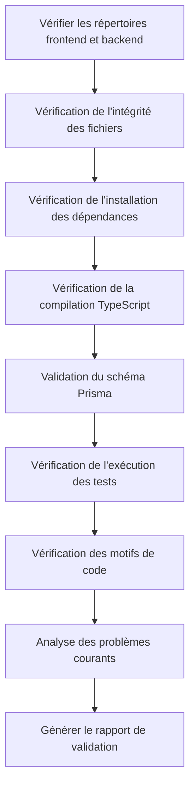

# Étape 6 : Validation - Vérifier la Qualité du Code

## Ce que vous pourrez faire après ce cours

- **Vérification automatique du code** : Vérifier en un clic les dépendances, les contrôles de types et les tests de base du code frontal et backend
- **Interprétation des rapports de validation** : Comprendre les rapports détaillés et la classification des problèmes générés par Validation Agent
- **Localisation rapide des problèmes** : Identifier et corriger les erreurs de code en fonction des positions et suggestions spécifiques dans le rapport
- **Garantir la qualité du code** : Vérifier que le code généré respecte les standards de production

## Votre problème actuel

Vous avez terminé l'étape Code et généré le code frontal et backend, mais le problème le plus frustrant est :

- **Le code peut-il fonctionner** : Les dépendances sont-elles correctement installées ? Les contrôles de types passent-ils ?
- **Prisma est-il correct** : La syntaxe du schéma est-elle valide ? Le client peut-il être généré ?
- **Les tests sont-ils fiables** : Y a-t-il des tests ? Passent-ils ?
- **Y a-t-il des pièges** : La configuration des variables d'environnement est-elle correcte ? Les chemins d'importation sont-ils corrects ?

Vérifier manuellement ces problèmes prend beaucoup de temps et il est facile d'en oublier. L'étape Validation est conçue pour résoudre ces problèmes - elle vérifie automatiquement la qualité du code et génère des rapports détaillés.

## Quand utiliser cette approche

Lorsque vous avez besoin de :

- **Vérifier rapidement le code** : Confirmer que le code généré respecte les standards de qualité de base
- **Découvrir des problèmes potentiels** : Identifier les problèmes de dépendances, de types, de tests, etc. avant le déploiement
- **Garantie de qualité du code** : S'assurer que le code frontal et backend passe les contrôles de base
- **Éviter les échecs de déploiement** : Identifier les problèmes à l'avance pour réduire les coûts de reprise

## Idée centrale

Validation Agent est un **contrôleur de qualité**, sa tâche est de vérifier si le code généré par Code Agent respecte les standards de qualité. Ses caractéristiques principales :

### Entrées et sorties

| Type | Contenu |
|------|---------|
| **Entrée** | `artifacts/backend/` (code backend), `artifacts/client/` (code frontend) |
| **Sortie** | `artifacts/validation/report.md` (rapport de validation) |

### Éléments de vérification

Validation Agent effectue 8 catégories de vérifications :

| Élément | Description |
|---------|-------------|
| **Intégrité des fichiers** | Confirmer que tous les fichiers requis existent |
| **Installation des dépendances** | Vérifier que les dépendances `package.json` peuvent être résolues |
| **Compilation TypeScript** | Vérifier que le code passe les contrôles de types |
| **Schéma Prisma** | Vérifier que la syntaxe du modèle de données est correcte |
| **Exécution des tests** | Confirmer que les tests existent et réussissent |
| **Normes de code** | Vérifier la configuration des scripts lint |
| **Motifs clés** | Scanner les motifs clés dans le code (gestion des erreurs, contrôle de santé, etc.) |
| **Problèmes courants** | Identifier les motifs d'erreur connus |

### Contraintes d'exécution

::: warning Mode lecture seule
Validation Agent **vérifie seulement, ne modifie pas** :
- Interdiction de modifier des fichiers de code
- Interdiction d'installer réellement des dépendances (utilisation de `--dry-run`)
- Interdiction d'exécuter des commandes avec effets secondaires
:::

## Suivez-moi

### Étape 1 : Entrer dans l'étape Validation

Supposons que vous ayez terminé l'étape Code et que vous commenciez maintenant à vérifier la qualité du code.

```bash
# Si vous êtes dans le pipeline, passez directement à l'étape suivante
factory run validation

# Ou recommencez à partir d'une étape spécifique
factory run validation
```

**Ce que vous devriez voir** : L'CLI affiche les informations de l'étape Validation, y compris les fichiers d'entrée et la sortie attendue.

### Étape 2 : L'assistant IA exécute Validation Agent

L'assistant IA chargera `agents/validation.agent.md`, puis commencera l'exécution.

Le processus d'exécution de Validation Agent :



**Ce que fera l'assistant IA** :

1. **Vérifier le répertoire backend**
   - Confirmer que `artifacts/backend/` existe
   - Vérifier les fichiers requis : `package.json`, `tsconfig.json`, `.env.example`, `prisma/schema.prisma`

2. **Vérifier le répertoire frontend**
   - Confirmer que `artifacts/client/` existe
   - Vérifier les fichiers requis : `package.json`, `tsconfig.json`, `app.json`, `App.tsx`

3. **Vérification de l'installation des dépendances**
   - Backend : `cd artifacts/backend && npm install --dry-run`
   - Frontend : `cd artifacts/client && npm install --dry-run`
   - Vérifier que les dépendances peuvent être résolues

4. **Vérification de la compilation TypeScript**
   - Backend : `cd artifacts/backend && npx tsc --noEmit`
   - Frontend : `cd artifacts/client && npx tsc --noEmit`
   - Vérifier que le code passe les contrôles de types

5. **Validation du schéma Prisma**
   - `cd artifacts/backend && npx prisma validate`
   - Vérifier que la syntaxe du modèle de données est correcte

6. **Vérification de l'exécution des tests**
   - Backend : `cd artifacts/backend && npm test`
   - Frontend : `cd artifacts/client && npm test`
   - Confirmer que les tests existent et réussissent

7. **Vérification des motifs de code**
   - Scanner les motifs clés : gestion des erreurs, contrôle de santé, SafeAreaView, etc.
   - Vérifier la configuration des dépendances : dotenv, React Native Web, etc.

8. **Analyse des problèmes courants**
   - SQLite utilise des définitions `type`
   - Les valeurs des variables d'environnement ont des guillemets
   - Chemins d'importation incorrects
   - Importations nécessaires manquantes

9. **Générer le rapport de validation**
   - Résumer tous les résultats de vérification
   - Lister les problèmes découverts
   - Fournir des suggestions de correction
   - Sauvegarder dans `artifacts/validation/report.md`

### Étape 3 : Consulter le rapport de validation

Une fois Validation Agent terminé, il générera un rapport de validation détaillé.

Ouvrez `artifacts/validation/report.md` :

```bash
cat artifacts/validation/report.md
```

**Ce que vous devriez voir** :

```markdown
# Rapport de Validation du Code

**Heure de génération** : 2026-01-29 12:00:00
**Résultat de la validation** : ✅ Réussi

## Résumé

- Validation backend : ✅
- Validation frontend : ✅
- Évaluation globale : La qualité du code respecte les standards MVP, vous pouvez passer à l'étape Preview

---

## Détails de la validation backend

### Intégrité des fichiers
| Fichier | Statut |
|---------|--------|
| package.json | ✅ |
| tsconfig.json | ✅ |
| .env.example | ✅ |
| prisma/schema.prisma | ✅ |
| src/index.ts | ✅ |
| src/app.ts | ✅ |

### Installation des dépendances
- Statut : ✅
- Détails : Toutes les dépendances peuvent être résolues

### Compilation TypeScript
- Statut : ✅
- Nombre d'erreurs : 0

### Validation Prisma
- Statut : ✅
- Détails : La syntaxe du schéma Prisma est correcte

### Exécution des tests
- Statut : ✅
- Nombre de tests : 12
- Tests réussis : 12
- Tests échoués : 0

### Vérification des motifs de code
| Élément | Statut |
|---------|--------|
| Middleware de gestion des erreurs | ✅ |
| Point de terminaison de contrôle de santé | ✅ |
| Utilisation des variables d'environnement | ✅ |
| Importation de Prisma Client | ✅ |
| Fichiers de tests existants | ✅ |
| Importation dotenv en première ligne | ✅ |

---

## Détails de la validation frontend

### Intégrité des fichiers
| Fichier | Statut |
|---------|--------|
| package.json | ✅ |
| tsconfig.json | ✅ |
| app.json | ✅ |
| App.tsx | ✅ |
| src/navigation/index.tsx | ✅ |

### Installation des dépendances
- Statut : ✅
- Détails : Toutes les dépendances peuvent être résolues

### Compilation TypeScript
- Statut : ✅
- Nombre d'erreurs : 0

### Exécution des tests
- Statut : ✅
- Nombre de tests : 8
- Tests réussis : 8
- Tests échoués : 0

### Vérification des motifs de code
| Élément | Statut |
|---------|--------|
| Utilisation de SafeAreaView | ✅ |
| Composant Loading | ✅ |
| Gestion des erreurs | ✅ |
| Encapsulation des appels API | ✅ |
| Dépendance React Native Web | ✅ |
| Dépendance async-storage | ✅ |

---

## Problèmes découverts

Aucun problème grave ou avertissement

---

## Suggestions de correction

Aucune correction nécessaire

---

## Conclusion

La qualité du code respecte les standards MVP, il est recommandé de passer à l'étape Preview.
```

### Étape 4 : Gérer les cas d'échec de validation

Si la validation échoue, le rapport énumérera les problèmes spécifiques et les suggestions de correction.

**Exemple : Rapport de validation partiellement réussi**

```markdown
**Résultat de la validation** : ⚠️ Partiellement réussi

## Problèmes découverts

### Problèmes graves (doivent être corrigés)

1. Erreur de compilation TypeScript
   - Position : src/controllers/items.ts:15
   - Erreur : La propriété 'title' n'existe pas sur le type 'any'
   - Suggestion : Ajouter une définition de type `const item: Item = req.body;`

2. Échec de validation du schéma Prisma
   - Position : prisma/schema.prisma:10
   - Erreur : Fournisseur de source de données invalide 'sqlite'
   - Suggestion : Changer `provider = "sqlite"` en `provider = "postgresql"` (environnement de production)

### Avertissements (correction suggérée)

1. Fichiers de tests manquants
   - Position : src/controllers/
   - Suggestion : Ajouter un fichier de test pour chaque contrôleur

2. Configuration des variables d'environnement incomplète
   - Position : .env.example
   - Suggestion : Ajouter un exemple `DATABASE_URL`

## Suggestions de correction

1. Corriger l'erreur TypeScript : Ajouter une définition de type dans `src/controllers/items.ts`
2. Mettre à jour le schéma Prisma : Modifier le fournisseur de source de données
3. Ajouter des fichiers de tests : Écrire des tests pour les contrôleurs
4. Améliorer les variables d'environnement : Compléter `.env.example`
```

**Étapes de correction** :

1. **Localiser le fichier problème**
   ```bash
   # Ouvrir le fichier problème
   vim artifacts/backend/src/controllers/items.ts
   ```

2. **Corriger le code**
   ```typescript
   // Ajouter une définition de type
   const item: Item = req.body;
   ```

3. **Mettre à jour le schéma Prisma**
   ```prisma
   datasource db {
     provider = "postgresql"  // Modifier en postgresql
     url      = env("DATABASE_URL")
   }
   ```

4. **Revérifier**
   ```bash
   # Réexécuter l'étape Validation
   factory run validation
   ```

### Étape 5 : Confirmer le point de contrôle

Lorsque l'assistant IA confirme que l'étape Validation est terminée, vous verrez :

```
✅ Étape Validation terminée

Fichiers générés :
- Rapport de validation : artifacts/validation/report.md

Résultat de la validation : ✅ Réussi / ⚠️ Partiellement réussi / ❌ Échoué

Options du point de contrôle :
[1] Continuer - Passer à l'étape Preview
[2] Réessayer - Revérifier le code
[3] Pause - Sauvegarder l'état actuel
```

- Si la validation réussit, choisissez **Continuer** pour passer à l'étape suivante
- S'il y a des problèmes, corrigez-les puis choisissez **Réessayer** pour revérifier
- Si vous avez besoin de temps pour corriger, choisissez **Pause** pour sauvegarder l'état actuel

## Point de contrôle ✅

Après avoir terminé l'étape Validation, vous devriez avoir :

- [ ] Tous les fichiers requis du backend et frontend existent
- [ ] Les dépendances peuvent être résolues (`npm install --dry-run`)
- [ ] La compilation TypeScript n'a pas d'erreurs (`npx tsc --noEmit`)
- [ ] La validation du schéma Prisma réussit (`npx prisma validate`)
- [ ] Les fichiers de tests existent et réussissent (`npm test`)
- [ ] Toutes les vérifications de motifs clés réussissent
- [ ] Le rapport de validation est généré (`artifacts/validation/report.md``

## Pièges courants

### Problème 1 : Échec de l'installation des dépendances

**Symptôme** : `npm install --dry-run` signale une erreur

**Solution** :

```bash
# Vérifier la syntaxe de package.json
cat artifacts/backend/package.json

# Problèmes courants :
# - Guillemets manquants
# - Nom de dépendance incorrect
# - Format de version incorrect

# Revérifier après correction
factory run validation
```

### Problème 2 : Erreurs de compilation TypeScript

**Symptôme** : `npx tsc --noEmit` signale une erreur

**Types d'erreurs courants** :

| Erreur | Cause | Solution |
|--------|-------|----------|
| `Property does not exist` | Type non défini | Ajouter une définition de type |
| `Module not found` | Chemin d'importation incorrect | Vérifier le chemin d'importation |
| `Implicit any` | Type any implicite | Activer le mode strict et ajouter un type |

### Problème 3 : Échec de validation du schéma Prisma

**Symptôme** : `npx prisma validate` signale une erreur

**Erreurs courantes** :

| Erreur | Cause | Solution |
|--------|-------|----------|
| `Invalid datasource provider` | Provider incorrect | Utiliser `postgresql` ou `sqlite` |
| `Error parsing` | Erreur de syntaxe | Vérifier la définition du modèle |
| `Relation error` | Erreur de définition de relation | Vérifier les champs `@relation` |

### Problème 4 : Échec des tests

**Symptôme** : `npm test` signale une erreur

**Solution** :

```bash
# Vérifier si les fichiers de tests existent
find artifacts/backend -name "*.test.ts"

# Vérifier si les dépendances de test sont installées
cat artifacts/backend/package.json | grep -A 5 "devDependencies"

# Si les dépendances de test manquent, installer manuellement
cd artifacts/backend
npm install --save-dev vitest @testing-library/react-native
```

### Problème 5 : Échec de la vérification des motifs clés

**Symptôme** : Le rapport indique que des motifs clés manquent

**Motifs manquants courants** :

| Motif | Position | Méthode de correction |
|-------|----------|-----------------------|
| Middleware de gestion des erreurs | `src/middleware/error.ts` | Ajouter un middleware de gestion des erreurs |
| Point de terminaison de contrôle de santé | `src/routes/health.ts` | Ajouter une route `/health` |
| Importation dotenv en première ligne | `src/index.ts:1` | Ajouter `import 'dotenv/config';` |
| SafeAreaView | `src/screens/Home.tsx` | Envelopper le contenu avec SafeAreaView |

## Exigences spéciales de Validation Agent

Validation Agent a certaines contraintes et exigences spéciales qui nécessitent une attention particulière :

### 1. Mode lecture seule

::: warning Interdiction de modifier le code
Validation Agent **interdit absolument** de modifier des fichiers de code, il exécute uniquement la vérification et la génération de rapports.
:::

### 2. Installation en dry-run

La vérification de l'installation des dépendances utilise le paramètre `--dry-run` et n'installe pas réellement les dépendances :

```bash
npm install --dry-run  # Vérifie seulement si les dépendances peuvent être résolues
```

### 3. Rapport complet

Validation Agent **doit** générer un rapport de validation complet, y compris :

| Section | Contenu |
|---------|---------|
| **Résumé** | Statut de validation backend/frontend et évaluation globale |
| **Détails backend** | Intégrité des fichiers, dépendances, compilation, Prisma, tests, vérification des motifs |
| **Détails frontend** | Intégrité des fichiers, dépendances, compilation, tests, vérification des motifs |
| **Problèmes découverts** | Liste des problèmes graves et avertissements |
| **Suggestions de correction** | Étapes de correction spécifiques pour les problèmes |
| **Conclusion** | Évaluation globale et suggestions pour les prochaines étapes |

### 4. Classification des problèmes

Validation Agent classifie les problèmes en trois niveaux :

| Niveau | Critère | Traitement |
|--------|---------|------------|
| **Problème grave** | Doit être corrigé pour réussir | Marqué comme "doit être corrigé" dans le rapport |
| **Avertissement** | Correction suggérée mais non fatale | Marqué comme "correction suggérée" dans le rapport |
| **Information** | Pour référence seulement | N'affecte pas le résultat de validation |

## Détermination du résultat de validation

Validation Agent détermine le statut de validation en fonction des résultats de vérification.

### Conditions de réussite (✅ Réussi)

- Tous les fichiers requis existent
- Aucune erreur d'installation des dépendances
- Aucune erreur de compilation TypeScript
- Validation du schéma Prisma réussie
- Tests de base existants et tous réussis
- Toutes les vérifications de motifs clés réussies

### Conditions de réussite partielle (⚠️ Partiellement réussi)

- Fichiers requis existants
- Aucune erreur d'installation des dépendances
- Avertissements de compilation TypeScript mais pas d'erreurs
- Tests existants mais certains échouent (< 30% de taux d'échec)
- Problèmes non critiques existants

### Conditions d'échec (❌ Échoué)

- Fichiers requis manquants
- Échec de l'installation des dépendances
- Erreurs de compilation TypeScript
- Échec de la validation du schéma Prisma
- Tests manquants ou échecs importants (≥ 30% de taux d'échec)

## Liste de contrôle de qualité du code

Validation Agent effectue la vérification en fonction de la liste de contrôle suivante.

### Éléments requis du backend

- [ ] `package.json` existe
- [ ] `tsconfig.json` existe
- [ ] `.env.example` existe
- [ ] `prisma/schema.prisma` existe
- [ ] `src/index.ts` existe
- [ ] `src/app.ts` existe
- [ ] `src/index.ts` importe dotenv en première ligne
- [ ] dotenv dans les dépendances
- [ ] Middleware de gestion des erreurs existe
- [ ] Point de terminaison de contrôle de santé existe (`/health`)
- [ ] Utilisation des variables d'environnement avec `process.env`
- [ ] Importation correcte de Prisma Client
- [ ] Au moins un fichier de tests existe
- [ ] package.json contient le script `test`

### Éléments requis du frontend

- [ ] `package.json` existe
- [ ] `tsconfig.json` existe
- [ ] `app.json` existe
- [ ] `App.tsx` existe
- [ ] `src/navigation/index.tsx` existe
- [ ] Utilisation de SafeAreaView existe
- [ ] Composant Loading existe
- [ ] Gestion des erreurs existe
- [ ] Appels API via une couche d'encapsulation
- [ ] Dépendance React Native Web incluse
- [ ] Dépendance async-storage incluse
- [ ] `app.json` ne fait pas référence à des fichiers d'images inexistants

## Analyse des problèmes courants

Validation Agent analysera les motifs de problèmes connus suivants :

| Élément | Méthode de détection | Suggestion de correction |
|---------|---------------------|--------------------------|
| SQLite utilise des définitions `type` | Vérifier si schema.prisma contient `type Xxx` | Supprimer les définitions `type` |
| Valeurs de variables d'environnement avec guillemets | Vérifier si .env contient `="xxx"` ou `='xxx'` | Supprimer les guillemets |
| Prisma version 7.x | Vérifier si la version prisma dans package.json est ^7 | Utiliser Prisma 5.x |
| Chemins d'importation incorrects | Vérifier si screens contient `from './ui/'` | Changer en `from '../components/ui/'` |
| Importation View manquante | Vérifier si le composant utilise View mais ne l'importe pas | Ajouter `import { View } from 'react-native'` |
| Chaînes non terminées | Vérifier si les fichiers .tsx ont des guillemets consécutifs | Ajouter les guillemets manquants |

## Exemple de rapport de validation

### Rapport de validation réussi

```markdown
# Rapport de Validation du Code

**Heure de génération** : 2026-01-29 12:00:00
**Résultat de la validation** : ✅ Réussi

## Résumé

- Validation backend : ✅
- Validation frontend : ✅
- Évaluation globale : La qualité du code respecte les standards MVP, vous pouvez passer à l'étape Preview

---

## Détails de la validation backend

### Intégrité des fichiers
| Fichier | Statut |
|---------|--------|
| package.json | ✅ |
| tsconfig.json | ✅ |
| .env.example | ✅ |
| prisma/schema.prisma | ✅ |
| src/index.ts | ✅ |
| src/app.ts | ✅ |

### Installation des dépendances
- Statut : ✅
- Détails : Toutes les dépendances peuvent être résolues

### Compilation TypeScript
- Statut : ✅
- Nombre d'erreurs : 0

### Validation Prisma
- Statut : ✅
- Détails : La syntaxe du schéma Prisma est correcte

### Exécution des tests
- Statut : ✅
- Nombre de tests : 12
- Tests réussis : 12
- Tests échoués : 0

### Vérification des motifs de code
| Élément | Statut |
|---------|--------|
| Middleware de gestion des erreurs | ✅ |
| Point de terminaison de contrôle de santé | ✅ |
| Utilisation des variables d'environnement | ✅ |
| Importation de Prisma Client | ✅ |
| Fichiers de tests existants | ✅ |
| Importation dotenv en première ligne | ✅ |

---

## Détails de la validation frontend

### Intégrité des fichiers
| Fichier | Statut |
|---------|--------|
| package.json | ✅ |
| tsconfig.json | ✅ |
| app.json | ✅ |
| App.tsx | ✅ |
| src/navigation/index.tsx | ✅ |

### Installation des dépendances
- Statut : ✅
- Détails : Toutes les dépendances peuvent être résolues

### Compilation TypeScript
- Statut : ✅
- Nombre d'erreurs : 0

### Exécution des tests
- Statut : ✅
- Nombre de tests : 8
- Tests réussis : 8
- Tests échoués : 0

### Vérification des motifs de code
| Élément | Statut |
|---------|--------|
| Utilisation de SafeAreaView | ✅ |
| Composant Loading | ✅ |
| Gestion des erreurs | ✅ |
| Encapsulation des appels API | ✅ |
| Dépendance React Native Web | ✅ |
| Dépendance async-storage | ✅ |

---

## Problèmes découverts

Aucun problème grave ou avertissement

---

## Suggestions de correction

Aucune correction nécessaire

---

## Conclusion

La qualité du code respecte les standards MVP, il est recommandé de passer à l'étape Preview.
```

### Rapport de validation échoué

```markdown
# Rapport de Validation du Code

**Heure de génération** : 2026-01-29 12:00:00
**Résultat de la validation** : ❌ Échoué

## Résumé

- Validation backend : ❌
- Validation frontend : ⚠️
- Évaluation globale : Le backend présente des problèmes graves qui doivent être corrigés avant de continuer

---

## Problèmes découverts

### Problèmes graves (doivent être corrigés)

1. Erreur de compilation TypeScript
   - Position : src/controllers/items.ts:15
   - Erreur : La propriété 'title' n'existe pas sur le type 'any'
   - Suggestion : Ajouter une définition de type `const item: Item = req.body;`

2. Échec de validation du schéma Prisma
   - Position : prisma/schema.prisma:10
   - Erreur : Fournisseur de source de données invalide 'sqlite'
   - Suggestion : Changer `provider = "sqlite"` en `provider = "postgresql"`

3. Fichiers requis manquants
   - Position : src/
   - Fichier : src/middleware/error.ts
   - Suggestion : Créer un middleware de gestion des erreurs

### Avertissements (correction suggérée)

1. Échec des tests frontend
   - Position : src/screens/__tests__/HomeScreen.test.tsx
   - Échec : 2/8 tests échoués
   - Suggestion : Corriger les cas de tests

2. Composant Loading manquant
   - Position : src/components/
   - Suggestion : Créer le composant Loading et l'utiliser correctement

---

## Suggestions de correction

1. Corriger l'erreur TypeScript : Ajouter une définition de type dans `src/controllers/items.ts`
2. Mettre à jour le schéma Prisma : Modifier le fournisseur de source de données en postgresql
3. Créer le middleware de gestion des erreurs : Ajouter `src/middleware/error.ts`
4. Corriger les tests frontend : Vérifier et corriger les cas de tests échoués
5. Créer le composant Loading : Ajouter `src/components/Loading.tsx`

---

## Conclusion

Le backend présente des problèmes graves qui doivent être corrigés avant de continuer. Suggestions :
1. Corriger les erreurs de compilation TypeScript
2. Mettre à jour le schéma Prisma
3. Ajouter les fichiers manquants
4. Réexécuter l'étape Validation
```

## Résumé de ce cours

L'étape Validation est le lien de garantie de qualité du pipeline, elle s'assure que le code généré respecte les standards de qualité de base.

**Points clés** :

1. **Processus de validation** : Validation Agent vérifie automatiquement l'intégrité des fichiers, les dépendances, la compilation, les tests, etc.
2. **Mode lecture seule** : Vérifie seulement, ne modifie pas, utilise `--dry-run` pour éviter les effets secondaires
3. **Classification des problèmes** : Classe les problèmes en trois niveaux : grave, avertissement, information
4. **Rapport détaillé** : Génère un rapport de validation avec des positions spécifiques et des suggestions de correction
5. **Détermination du résultat** : Détermine réussi/partiellement réussi/échoué en fonction des résultats de vérification

## Prochain cours

> Le prochain cours, nous apprenrons **[l'étape Preview](../stage-preview/)**.
>
> Vous apprendrez :
> - Comment générer de la documentation d'exécution
> - Guide de démarrage rapide
> - Configuration de déploiement (Docker, CI/CD)

---

## Annexe : Référence du code source

<details>
<summary><strong>Cliquer pour développer et voir les positions du code source</strong></summary>

> Dernière mise à jour : 2026-01-29

| Fonction | Chemin du fichier | Ligne |
|----------|------------------|-------|
| Définition de Validation Agent | [`agents/validation.agent.md`](https://github.com/hyz1992/agent-app-factory/blob/main/agents/validation.agent.md) | 1-320 |
| Définition du pipeline | [`pipeline.yaml`](https://github.com/hyz1992/agent-app-factory/blob/main/pipeline.yaml) | 79-96 |

**Contraintes clés** :
- Interdiction de modifier des fichiers de code (`validation.agent.md:293`)
- Interdiction d'installer réellement des dépendances, utiliser `--dry-run` (`validation.agent.md:294`)
- Doit générer un rapport de validation complet (`validation.agent.md:296`)
- Doit fournir des suggestions de correction spécifiques (`validation.agent.md:298`)

**Éléments de vérification** :
- Vérification de l'intégrité des fichiers (`validation.agent.md:24-42`)
- Vérification de l'installation des dépendances (`validation.agent.md:43-53`)
- Vérification de la compilation TypeScript (`validation.agent.md:55-65`)
- Validation du schéma Prisma (`validation.agent.md:67-73`)
- Vérification de l'exécution des tests (`validation.agent.md:75-85`)
- Vérification des normes de code (`validation.agent.md:87-97`)
- Vérification des motifs clés (`validation.agent.md:99-122`)
- Analyse des problèmes courants (`validation.agent.md:124-136`)

**Détermination du résultat de validation** :
- Conditions de réussite (`validation.agent.md:268-274`)
- Conditions de réussite partielle (`validation.agent.md:276-281`)
- Conditions d'échec (`validation.agent.md:283-288`)

**Processus d'exécution** :
- Étapes d'opération (`validation.agent.md:303-313`)
- Format de sortie (`validation.agent.md:139-262`)

</details>
