# Aperçu du Pipeline à 7 Étapes

## Ce que vous pourrez faire après ce cours

- Comprendre le processus complet du pipeline à 7 étapes et les responsabilités de chaque étape
- Connaître les entrées, sorties et conditions de sortie de chaque étape
- Comprendre comment le mécanisme de point de contrôle garantit la qualité
- Comprendre comment l'ordonnanceur Sisyphus coordonne l'exécution des Agents
- Maîtriser comment la matrice de permissions empêche les Agents de dépasser leurs droits
- Apprendre à utiliser "continuer dans nouvelle session" pour économiser des tokens

## Concept Fondamental

**Qu'est-ce qu'un pipeline ?**

Le pipeline de l'AI App Factory est une chaîne de production automatisée qui transforme progressivement vos idées de produit en une application fonctionnelle. Comme une chaîne de montage industrielle, les matières premières (idées de produit) passent par 7 processus (étapes), produisant finalement un produit fini (application complète).

Chaque processus est géré par un Agent spécialisé, chacun ayant son propre rôle sans interférer avec les autres :

| Étape | Agent | Responsabilité | Sortie |
| ----- | ----- | -------------- | ------ |
| Bootstrap | Bootstrap Agent | Explorer en profondeur l'idée de produit | `input/idea.md` |
| PRD | PRD Agent | Générer le document de spécifications produit | `artifacts/prd/prd.md` |
| UI | UI Agent | Concevoir l'interface et les prototypes | `artifacts/ui/ui.schema.yaml` + pages de prévisualisation |
| Tech | Tech Agent | Concevoir l'architecture technique | `artifacts/tech/tech.md` + Prisma Schema |
| Code | Code Agent | Générer du code fonctionnel | `artifacts/backend/` + `artifacts/client/` |
| Validation | Validation Agent | Valider la qualité du code | `artifacts/validation/report.md` |
| Preview | Preview Agent | Générer le guide de déploiement | `artifacts/preview/README.md` |

**Caractéristiques Clés**

1. **Mécanisme de points de contrôle** : Pause après chaque étape, attend votre confirmation avant de continuer
2. **Isolement des permissions** : Chaque Agent ne peut lire/écrire que dans ses répertoires autorisés, empêchant la pollution
3. **Retour en cas d'échec** : Si une étape échoue, elle est automatiquement réessayée ; en cas d'échecs successifs, retour au dernier point de contrôle réussi
4. **Optimisation du contexte** : Permet de continuer l'exécution dans une nouvelle session, économisant des tokens

## Aperçu Complet du Pipeline

```mermaid
graph LR
    A[Bootstrap<br/>Structurer l'idée de produit] -->|idea.md| B[PRD<br/>Générer le document de spécifications]
    B -->|prd.md| C[UI<br/>Concevoir l'interface et les prototypes]
    C -->|ui.schema.yaml| D[Tech<br/>Concevoir l'architecture technique]
    D -->|tech.md + schema.prisma| E[Code<br/>Générer du code fonctionnel]
    E -->|backend + client| F[Validation<br/>Valider la qualité du code]
    F -->|rapport de validation| G[Preview<br/>Générer le guide de déploiement]
    
    style A fill:#e0f2fe
    style B fill:#f0fdf4
    style C fill:#fef3c7
    style D fill:#ede9fe
    style E fill:#fce7f3
    style F fill:#dbeafe
    style G fill:#d1fae5
```



**Règles d'Exécution du Pipeline**

::: tip Règles d'Exécution

1. **Ordre strict** : Doit commencer par Bootstrap et s'exécuter séquentiellement jusqu'à Preview, aucun saut ou parallélisation n'est autorisé
2. **Activation d'un seul Agent** : Un seul Agent ne peut travailler à la fois
3. **Pas de retour en arrière** : Les artefacts confirmés ne peuvent pas être modifiés, l'étape doit être réexécutée

Note : Ce sont les règles d'exécution du pipeline, ce n'est pas égal au nombre d'options de point de contrôle. Après chaque étape, Sisyphus fournira 5 options de point de contrôle (voir section "Mécanisme de Points de Contrôle" ci-dessous).

:::

## Détails de Chaque Étape

### Étape 1 : Bootstrap - Structurer l'idée de produit

**Que fait-elle ?**

Transforme votre description de produit en langage naturel en un document structuré, explorant en profondeur le problème, les utilisateurs, la valeur et les hypothèses.

**Pourquoi est-ce important ?**

Une définition claire du produit est la base de tout le pipeline. Si cette étape n'est pas bien faite, toutes les étapes ultérieures dévieront de la direction.

**Entrées et Sorties**

| Type | Chemin | Description |
| ---- | ------ | ----------- |
| Entrée | Description en langage naturel de l'utilisateur | Par exemple : "Je veux créer une application de comptabilité" |
| Sortie | `input/idea.md` | Document d'idée de produit structurée |

**Conditions de Sortie**

- [ ] `idea.md` existe
- [ ] Décrit une idée de produit cohérente
- [ ] L'Agent a utilisé la compétence `superpowers:brainstorm` pour une exploration en profondeur

**Utilisation Obligatoire de Compétence**

::: warning Doit utiliser superpowers:brainstorm

L'étape Bootstrap doit utiliser la compétence `superpowers:brainstorm` pour une exploration en profondeur. Si l'Agent ne mentionne pas l'utilisation de cette compétence, l'artefact sera rejeté et une réexécution sera demandée.

:::

### Étape 2 : PRD - Générer le Document de Spécifications Produit

**Que fait-elle ?**

Transforme l'idée de produit structurée en un document de spécifications produit de niveau MVP, définissant clairement la portée fonctionnelle, les non-objectifs et les user stories.

**Pourquoi est-ce important ?**

Le PRD est le "contrat" pour la conception et le développement, clarifiant "ce qu'il faut faire" et "ce qu'il ne faut pas faire", empêchant le dérapage de la portée.

**Entrées et Sorties**

| Type | Chemin | Description |
| ---- | ------ | ----------- |
| Entrée | `input/idea.md` | Idée structurée de l'étape Bootstrap |
| Sortie | `artifacts/prd/prd.md` | Document de spécifications produit de niveau MVP |

**Conditions de Sortie**

- [ ] Le PRD inclut les utilisateurs cibles
- [ ] Le PRD définit la portée du MVP
- [ ] Le PRD liste les non-objectifs
- [ ] Le PRD ne contient aucun détail d'implémentation technique

**Note : Le PRD ne contient pas de détails techniques**

Le PRD doit décrire "ce dont les utilisateurs ont besoin", et non "comment l'implémenter". Les détails d'implémentation technique sont de la responsabilité des étapes Tech et Code.

### Étape 3 : UI - Concevoir l'Interface et les Prototypes

**Que fait-elle ?**

Conçoit la structure UI, le schéma de couleurs basé sur le PRD, et génère un prototype HTML prévisualisable dans le navigateur.

**Pourquoi est-ce important ?**

Le design visuel permet à l'équipe et aux premiers utilisateurs de comprendre intuitivement la forme du produit, réduisant les retouches de développement.

**Entrées et Sorties**

| Type | Chemin | Description |
| ---- | ------ | ----------- |
| Entrée | `artifacts/prd/prd.md` | Document PRD |
| Sortie | `artifacts/ui/ui.schema.yaml` | Définition de la structure UI |
| Sortie | `artifacts/ui/preview.web/index.html` | Prototype HTML prévisualisable |

**Conditions de Sortie**

- [ ] `ui.schema.yaml` existe
- [ ] Le nombre de pages ne dépasse pas 3
- [ ] Les pages de prévisualisation peuvent être ouvertes dans un navigateur
- [ ] L'Agent a utilisé la compétence `ui-ux-pro-max`

**Utilisation Obligatoire de Compétence**

::: warning Doit utiliser ui-ux-pro-max

L'étape UI doit utiliser la compétence `ui-ux-pro-max` pour générer un système de design professionnel. Cette compétence comprend 67 styles, 96 palettes de couleurs et 100 règles industrielles.

:::

### Étape 4 : Tech - Concevoir l'Architecture Technique

**Que fait-elle ?**

Conçoit l'architecture technique minimale viable et le modèle de données, choisit la stack technologique, définit les points de terminaison API.

**Pourquoi est-ce important ?**

L'architecture technique détermine la maintenabilité, l'extensibilité et les performances du code. La surconception peut rendre le développement difficile, tandis qu'une conception insuffisante ne peut pas supporter les exigences.

**Entrées et Sorties**

| Type | Chemin | Description |
| ---- | ------ | ----------- |
| Entrée | `artifacts/prd/prd.md` | Document PRD |
| Sortie | `artifacts/tech/tech.md` | Document d'architecture technique |
| Sortie | `artifacts/backend/prisma/schema.prisma` | Modèle de données Prisma |

**Conditions de Sortie**

- [ ] La stack technologique est clairement déclarée
- [ ] Le modèle de données est cohérent avec le PRD
- [ ] Aucune optimisation prématurée ou surconception

**Choix par défaut de la stack technologique**

- Backend : Node.js + Express + Prisma
- Base de données : SQLite (développement) / PostgreSQL (production)
- Frontend : React Native + Expo

### Étape 5 : Code - Générer du Code Fonctionnel

**Que fait-elle ?**

Génère le code frontend et backend complet, les tests, la configuration et la documentation basés sur le UI Schema, le design Tech et le Prisma Schema.

**Pourquoi est-ce important ?**

C'est l'étape clé "de l'idée à l'application", le code généré est fonctionnel et prêt pour la production.

**Entrées et Sorties**

| Type | Chemin | Description |
| ---- | ------ | ----------- |
| Entrée | `artifacts/ui/ui.schema.yaml` | Définition de la structure UI |
| Entrée | `artifacts/tech/tech.md` | Document d'architecture technique |
| Entrée | `artifacts/backend/prisma/schema.prisma` | Modèle de données |
| Sortie | `artifacts/backend/` | Code backend (Express + Prisma) |
| Sortie | `artifacts/client/` | Code frontend (React Native) |

**Conditions de Sortie**

- [ ] Le backend peut démarrer sans erreur majeure
- [ ] Le client peut être rendu et accessible
- [ ] Aucune authentification ou fonctionnalité non pertinente n'est introduite

**Contenu Généré**

L'Agent Code générera le contenu suivant :

**Backend** :
- Serveur Express + routes
- ORM Prisma + modèle de données
- Tests unitaires et tests d'intégration (Vitest)
- Documentation API (Swagger/OpenAPI)
- Données de seed (`prisma/seed.ts`)
- Configuration Docker
- Journalisation et surveillance

**Frontend** :
- Pages et composants React Native
- Routes React Navigation
- Tests unitaires (Jest + React Testing Library)
- Configuration de l'environnement

::: info Pourquoi ne pas générer de fonctionnalités d'authentification ?

L'AI App Factory se concentre sur le MVP, ne générant pas par défaut des fonctionnalités complexes comme l'authentification et l'autorisation. Ces fonctionnalités peuvent être ajoutées lors d'itérations ultérieures.

:::

### Étape 6 : Validation - Valider la Qualité du Code

**Que fait-elle ?**

Valide que le code généré peut correctement installer les dépendances, passer les vérifications de types, et respecter les normes de code.

**Pourquoi est-ce important ?**

Découvrir des problèmes avant d'exécuter le code, évitant de découvrir des erreurs après le déploiement, économisant du temps de débogage.

**Entrées et Sorties**

| Type | Chemin | Description |
| ---- | ------ | ----------- |
| Entrée | `artifacts/backend/` | Code backend |
| Entrée | `artifacts/client/` | Code frontend |
| Sortie | `artifacts/validation/report.md` | Rapport de validation |

**Conditions de Sortie**

- [ ] Le rapport de validation est généré
- [ ] Les dépendances backend peuvent être résolues normalement
- [ ] Les dépendances frontend peuvent être résolues normalement
- [ ] La compilation TypeScript n'a pas d'erreurs graves
- [ ] La validation du Prisma schema réussit

**Contenu de la Validation**

L'Agent Validation vérifiera :

1. **Résolution des dépendances** : Si `npm install` réussit
2. **Vérification de types** : Si `tsc --noEmit` passe
3. **Normes de code** : Si elles respectent `policies/code-standards.md`
4. **Prisma Schema** : Si `prisma validate` passe
5. **Taux de réussite des tests** : Si les tests existent et peuvent être exécutés

**Gestion des Échecs**

Si la validation échoue, l'Agent Validation générera un rapport d'erreur détaillé, indiquant les problèmes spécifiques et les suggestions de correction.

### Étape 7 : Preview - Générer le Guide de Déploiement

**Que fait-elle ?**

Consolide tous les artefacts, génère les instructions d'exécution complètes, la configuration de déploiement et la documentation du processus de démonstration.

**Pourquoi est-ce important ?**

C'est le dernier maillon du pipeline, vous permettant d'exécuter et de déployer rapidement l'application générée.

**Entrées et Sorties**

| Type | Chemin | Description |
| ---- | ------ | ----------- |
| Entrée | `artifacts/backend/` | Code backend |
| Entrée | `artifacts/client/` | Code frontend |
| Sortie | `artifacts/preview/README.md` | Instructions d'exécution complètes |
| Sortie | `artifacts/preview/GETTING_STARTED.md` | Guide de démarrage rapide |

**Conditions de Sortie**

- [ ] Le README inclut les étapes d'installation
- [ ] Le README inclut les commandes d'exécution
- [ ] Le README liste les adresses d'accès et le processus de démonstration

**Contenu Généré**

L'Agent Preview générera :

- Instructions d'exécution locale (Web, iOS, Android)
- Configuration de déploiement Docker (`docker-compose.yml`)
- Référence de configuration CI/CD (GitHub Actions)
- Référence de configuration Git Hooks (Husky)
- Guide de migration de base de données (SQLite → PostgreSQL)

## Mécanisme de Points de Contrôle

**Qu'est-ce qu'un point de contrôle ?**

Après chaque étape, le pipeline fait une pause et vous présente la liste des artefacts générés, vous permettant de confirmer s'ils répondent à vos attentes. Si non, vous pouvez choisir "réessayer" ou "modifier et réexécuter".

**Pourquoi avons-nous besoin de points de contrôle ?**

- **Empêcher l'accumulation d'erreurs** : Si les problèmes précoces ne sont pas résolus à l'étape actuelle, les étapes ultérieures amplifieront les erreurs
- **Garantir la qualité** : Chaque étape assure que la sortie répond aux attentes, évitant de générer du code inutilisable
- **Contrôle flexible** : Vous pouvez faire une pause, réessayer ou modifier les entrées à n'importe quel point de contrôle

**Options de Points de Contrôle**

Après chaque étape, l'ordonnanceur Sisyphus présentera les options suivantes :

```
┌──────┬──────────────────────────────────────────────────────┐
│ Option │ Description                                          │
├──────┼──────────────────────────────────────────────────────┤
│  1   │ Continuer à l'étape suivante (même session)           │
│      │ Je continuerai à exécuter l'étape [nom de l'étape suivante] │
├──────┼──────────────────────────────────────────────────────┤
│  2   │ Continuer dans nouvelle session ⭐ Option recommandée, économise des tokens │
│      │ Exécuter dans une nouvelle fenêtre de terminal : factory continue │
│      │ (démarre automatiquement une nouvelle fenêtre Claude Code et continue le pipeline) │
├──────┼──────────────────────────────────────────────────────┤
│  3   │ Réexécuter cette étape                                │
│      │ Réexécuter l'étape [nom de l'étape actuelle]          │
├──────┼──────────────────────────────────────────────────────┤
│  4   │ Modifier les artefacts et réexécuter                  │
│      │ Modifier [un fichier d'entrée] et réexécuter          │
├──────┼──────────────────────────────────────────────────────┤
│  5   │ Mettre en pause le pipeline                           │
│      │ Sauvegarder la progression actuelle, continuer plus tard │
└──────┴──────────────────────────────────────────────────────┘
```

**Pratique Recommandée**

::: tip Choisir "Continuer dans nouvelle session" pour économiser des tokens

Après chaque étape, il est recommandé de choisir "Continuer dans nouvelle session" (option 2) :

1. Exécuter `factory continue` dans une nouvelle fenêtre de terminal
2. La commande démarre automatiquement une nouvelle fenêtre Claude Code
3. Chaque étape bénéficie d'un contexte propre, évitant l'accumulation de tokens

:::

## Matrice des Permissions

**Pourquoi avons-nous besoin de l'isolement des permissions ?**

Si un Agent peut lire et écrire n'importe quel répertoire, cela pourrait entraîner :

- Bootstrap Agent modifie accidentellement un PRD déjà complété
- Code Agent supprime accidentellement le design UI
- Validation Agent modifie par erreur le code backend

**Matrice des Capacités**

L'ordonnanceur Sisyphus vérifiera les permissions de l'Agent avant et après l'exécution de chaque étape :

| Agent | Peut lire | Peut écrire |
| ----- | --------- | ----------- |
| bootstrap | Aucun | `input/` |
| prd | `input/` | `artifacts/prd/` |
| ui | `artifacts/prd/` | `artifacts/ui/` |
| tech | `artifacts/prd/` | `artifacts/tech/`, `artifacts/backend/prisma/` |
| code | `artifacts/ui/`, `artifacts/tech/`, `artifacts/backend/prisma/` | `artifacts/backend/`, `artifacts/client/` |
| validation | `artifacts/backend/`, `artifacts/client/` | `artifacts/validation/` |
| preview | `artifacts/backend/`, `artifacts/client/` | `artifacts/preview/` |

**Gestion des Dépassements de Permissions**

Si un Agent écrit dans un répertoire non autorisé, l'ordonnanceur Sisyphus déplacera le fichier vers `artifacts/_untrusted/<stage-id>/`, mettra en pause le pipeline et signalera.

::: warning Exemple de dépassement de permissions

Supposons que PRD Agent écrive dans `artifacts/ui/ui.schema.yaml` (ce n'est pas dans sa portée de permissions), l'ordonnanceur :

1. Déplacera le fichier vers `artifacts/_untrusted/prd/ui.schema.yaml`
2. Mettra en pause le pipeline
3. Signalera : détection d'écriture non autorisée, veuillez traiter manuellement

:::

## Gestion des Échecs

**Qu'est-ce qui est considéré comme un échec ?**

- Fichier de sortie manquant
- Le contenu de l'artefact ne répond pas aux `exit_criteria`
- L'Agent a écrit dans un répertoire non autorisé
- Erreur de script ou impossibilité de lire l'entrée

**Stratégie de Gestion par Défaut**

1. **Réessai automatique** : Chaque étape permet un réessai automatique une fois
2. **Archivage des échecs** : Les artefacts échoués sont déplacés vers `artifacts/_failed/<stage-id>/`
3. **Pause du pipeline** : Après deux échecs consécutifs, attend l'intervention humaine
4. **Mécanisme de retour** : Retour au dernier point de contrôle réussi pour réexécution

::: tip Traitement après intervention humaine

Si deux échecs consécutifs se produisent, vous pouvez :

1. Modifier les fichiers d'entrée (comme `input/idea.md`)
2. Ajuster les invites de l'Agent
3. Corriger les problèmes de permissions
4. Exécuter `factory run [stage]` pour recommencer à partir de cette étape

:::

## Gestion de l'État

**Fichier d'État**

Tout l'état du pipeline est sauvegardé dans `.factory/state.json`, y compris :

```json
{
  "version": 1,
  "status": "waiting_for_confirmation",
  "current_stage": "prd",
  "completed_stages": ["bootstrap"],
  "started_at": "2026-01-29T10:00:00Z",
  "last_updated": "2026-01-29T10:30:00Z"
}
```

**Machine d'États**

| État | Signification | Condition de Déclenchement |
| ---- | ------------- | -------------------------- |
| idle | Non démarré | Attend `factory run` |
| running | En cours d'exécution | Début de l'exécution d'une étape |
| waiting_for_confirmation | Attend la confirmation | Étape complétée |
| paused | Mis en pause | Utilisateur choisit de mettre en pause |
| failed | Échec nécessitant une intervention | Échecs consécutifs ou opération non autorisée |

Seul l'ordonnanceur Sisyphus a l'autorisation de mettre à jour l'état.

## Points à Surveiller

### Erreur Courante 1 : Étape Bootstrap sans utilisation de la compétence brainstorm

**Phénomène** : Sisyphus refuse d'accepter `input/idea.md`, signalant "détection de non utilisation de la compétence superpowers:brainstorm".

**Cause** : L'Agent Bootstrap n'a pas utilisé la compétence `superpowers:brainstorm` pour explorer en profondeur l'idée de produit.

**Solution** : Lors de la confirmation des artefacts, choisissez "réexécuter cette étape" et exigez explicitement que l'Agent utilise la compétence `superpowers:brainstorm`.

### Erreur Courante 2 : Étape UI avec design médiocre

**Phénomène** : Le design UI généré est banal, tous avec dégradé violet et police Inter.

**Cause** : L'Agent UI n'a pas utilisé la compétence `ui-ux-pro-max`.

**Solution** : Lors de la confirmation des artefacts, choisissez "réexécuter cette étape", exigez explicitement que l'Agent utilise la compétence `ui-ux-pro-max`, et spécifiez une direction esthétique distinctive (comme "cyberpunk", "minimalisme").

### Erreur Courante 3 : Étape Code génère des fonctionnalités d'authentification

**Phénomène** : Le code backend généré inclut des fonctionnalités complexes comme l'authentification JWT, la connexion utilisateur.

**Cause** : L'Agent Code dépasse la portée du MVP.

**Solution** : Modifiez le PRD, listez explicitement les "non-objectifs" (comme "pas de connexion utilisateur", "pas de collaboration multi-utilisateur"), puis réexécutez l'étape Code.

### Erreur Courante 4 : Consommation excessive de tokens

**Phénomène** : Lors de l'exécution du pipeline à un stade avancé, la consommation de tokens augmente brusquement, l'assistant AI devient lent à répondre.

**Cause** : Exécution de plusieurs étapes dans la même session, le contexte s'accumule continuellement.

**Solution** : **Choisissez toujours "Continuer dans nouvelle session"** (option 2), permettant à chaque étape de bénéficier d'un contexte propre.

## Résumé de Ce Cours

- Le pipeline comprend 7 étapes : Bootstrap → PRD → UI → Tech → Code → Validation → Preview
- Pause et confirmation après chaque étape, garantissant que la sortie répond aux attentes
- L'ordonnanceur Sisyphus coordonne l'exécution des Agents, gère l'état et les permissions
- La matrice des capacités empêche les Agents de dépasser leurs droits, garantissant la séparation des responsabilités
- Choisir "Continuer dans nouvelle session" permet d'économiser considérablement les tokens

## Prochain Cours Annoncé

> Le prochain cours, nous apprendrons **[Guide d'Intégration Claude Code](../../platforms/claude-code/)**.
>
> Vous apprendrez :
> - Comment configurer les permissions Claude Code
> - Comment exécuter le pipeline
> - Les meilleures pratiques Claude Code

---

## Annexe : Référence du Code Source

<details>
<summary><strong>Cliquer pour développer et voir les emplacements du code source</strong></summary>

> Dernière mise à jour : 2026-01-29

| Fonction | Chemin du fichier | Numéros de ligne |
| --- | --- | --- |
| Définition du pipeline | [`pipeline.yaml`](https://github.com/hyz1992/agent-app-factory/blob/main/pipeline.yaml) | 1-111 |
| Cœur de l'ordonnanceur | [`agents/orchestrator.checkpoint.md`](https://github.com/hyz1992/agent-app-factory/blob/main/agents/orchestrator.checkpoint.md) | 1-302 |
| README du projet | [`README.md`](https://github.com/hyz1992/agent-app-factory/blob/main/README.md) | 1-253 |

**Constantes Clés** :
- Mode de pipeline : `checkpoint` (mode de point de contrôle, pause et confirmation après chaque étape)

**Définitions d'Agents Clés** :
- **Bootstrap Agent** : Utilise la compétence `superpowers:brainstorm`, génère `input/idea.md`
- **PRD Agent** : Lit `input/idea.md`, génère `artifacts/prd/prd.md`
- **UI Agent** : Utilise la compétence `ui-ux-pro-max`, génère `artifacts/ui/ui.schema.yaml` et les pages de prévisualisation
- **Tech Agent** : Génère `artifacts/tech/tech.md` et `artifacts/backend/prisma/schema.prisma`
- **Code Agent** : Génère `artifacts/backend/` et `artifacts/client/` basés sur UI, Tech, Schema
- **Validation Agent** : Valide la qualité du code, génère `artifacts/validation/report.md`
- **Preview Agent** : Génère `artifacts/preview/README.md`

</details>
