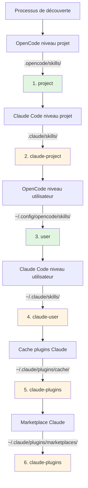

# Compatibilité avec les Skills Claude Code

## Ce que vous apprendrez

- Comprendre comment le plugin assure automatiquement la compatibilité avec le format des skills Claude Code
- Maîtriser le mécanisme de mapping d'outils pour faire fonctionner correctement les skills Claude dans OpenCode
- Connaître les règles complètes de priorité pour la découverte des skills
- Réutiliser les skills existants du marketplace Claude sans avoir à les réécrire

## Votre problème actuel

Vous avez déjà des skills Claude Code, ou vous souhaitez utiliser des skills du marketplace Claude, mais ces skills ont été écrits pour Claude Code. Les utiliser directement dans OpenCode pose des problèmes :

- Les appels d'outils dans les skills Claude (comme `TodoWrite`, `Task`) n'existent pas dans OpenCode
- Vous ne savez pas comment faire découvrir à OpenCode les skills des plugins Claude installés
- Vous craignez une incompatibilité de format et de devoir tout réécrire

## Idée centrale

Le plugin OpenCode Agent Skills utilise un **mécanisme de compatibilité à trois niveaux** pour vous permettre d'utiliser les skills Claude Code sans modification :

1. **Découverte automatique** - Analyse des skills depuis les répertoires standard de Claude Code (`.claude/skills/`, `~/.claude/plugins/`)
2. **Mapping d'outils** - Injection automatique d'un guide de mapping lors du chargement des skills, convertissant les noms d'outils Claude en noms OpenCode
3. **Support des formats** - Prise en charge simultanée des formats d'installation v1 et v2 des plugins Claude

::: info Concept clé
**Format des skills Claude Code** - Spécification définie par Anthropic utilisant un fichier `SKILL.md` pour décrire les skills, comprenant un frontmatter YAML (métadonnées) et du contenu Markdown (instructions).
:::

### Principe du mapping d'outils

Lorsque le plugin détecte qu'un skill chargé a été écrit pour Claude Code, il injecte automatiquement un guide de mapping :

| Outil Claude Code | Outil OpenCode | Règle de mapping |
| --- | --- | --- |
| `TodoWrite/TodoRead` | `todowrite/todoread` | Minuscules |
| `Task` (sous-agent) | `task` (avec paramètre subagent_type) | Utilisation de paramètre |
| `Skill` | `use_skill` | Remplacement du nom |
| `Read/Write/Edit/Bash/Glob/Grep/WebFetch` | `read/write/edit/bash/glob/grep/webfetch` | Minuscules |

**Méthode de mapping** : Le plugin injecte le guide de mapping en XML dans le contexte de session lors du chargement du skill, et l'IA appelle automatiquement les bons outils selon ce mapping.

::: tip Pourquoi le mapping est-il nécessaire ?
Claude Code et OpenCode utilisent des conventions de nommage différentes. Claude utilise le PascalCase (ex : `TodoWrite`), OpenCode utilise les minuscules (ex : `todowrite`). Le mapping d'outils indique à l'IA comment convertir les appels.
:::

### Priorité de découverte des skills

Le plugin découvre les skills dans l'ordre suivant, **le premier skill correspondant est utilisé** (pas de duplication pour les skills de même nom) :



**Règles de priorité** :
- Les skills niveau projet écrasent les skills niveau utilisateur (pour la personnalisation par projet)
- Les skills OpenCode ont priorité sur les skills Claude (pour éviter la confusion)
- Seule la première version découverte d'un skill de même nom est conservée

::: details Exemple : écrasement de skills de même nom
Supposons que vous ayez un skill nommé `git-helper` à deux emplacements :
- `.claude/skills/git-helper/SKILL.md` (version Claude)
- `.opencode/skills/git-helper/SKILL.md` (version OpenCode)

**Résultat** : La version OpenCode est utilisée (priorité plus élevée)
:::

## 🎒 Prérequis

- Plugin OpenCode Agent Skills installé et configuré
- Connaissance des concepts de base des skills (lecture recommandée : [Qu'est-ce qu'OpenCode Agent Skills ?](../../start/what-is-opencode-agent-skills/))
- (Optionnel) Plugins ou skills Claude Code déjà installés

## Suivez le guide

### Étape 1 : Vérifier que les skills Claude sont découverts

**Pourquoi**
Confirmer que le plugin peut correctement analyser vos répertoires de skills Claude Code.

Dans OpenCode, appelez l'outil :

```
get_available_skills()
```

**Ce que vous devriez voir** : La liste des skills retournée inclut les skills provenant de `.claude/skills/`, `~/.claude/skills/`, `~/.claude/plugins/`, avec le champ `source` de chaque skill indiquant sa provenance (ex : `claude-project`, `claude-user`, `claude-plugins`).

**Point de contrôle ✅** : Confirmez que la liste contient les skills Claude attendus.

### Étape 2 : Charger un skill Claude

**Pourquoi**
Vérifier que le mécanisme de mapping d'outils fonctionne correctement.

Appelez l'outil pour charger un skill Claude :

```
use_skill(skill="nom-de-votre-skill")
```

**Ce que vous devriez voir** : Un message de succès, comme `Skill "xxx" loaded.`.

**Point de contrôle ✅** : L'IA peut maintenant utiliser les instructions de ce skill.

### Étape 3 : Vérifier que le mapping d'outils fonctionne

**Pourquoi**
Confirmer que l'IA appelle correctement les outils OpenCode et non les outils Claude.

Demandez à l'IA une tâche nécessitant les outils du skill, par exemple :

```
Utilisez la fonctionnalité todo du skill pour créer une liste de tâches.
```

**Ce que vous devriez voir** : L'IA appelle correctement l'outil `todowrite` d'OpenCode, et non l'outil `TodoWrite` de Claude.

::: tip Comment vérifier que le mapping fonctionne ?
Consultez les logs d'appels d'outils de l'IA (si le mode debug est activé), vous verrez qu'elle appelle `todowrite` et non `TodoWrite`.
:::

**Point de contrôle ✅** : L'appel d'outil réussit, la tâche est accomplie.

## Pièges à éviter

### 1. Format de plugin incompatible

**Problème** : Les anciens plugins Claude utilisent le format v1, les nouveaux utilisent le format v2, ce qui empêche la découverte de certains skills.

**Cause** : Les structures de `installed_plugins.json` diffèrent entre v1 et v2.

**Solution** : Le plugin supporte les deux formats, aucune conversion manuelle n'est nécessaire. Si les skills ne sont toujours pas découverts, vérifiez que `~/.claude/plugins/installed_plugins.json` existe et est correctement formaté.

### 2. Le mapping d'outils ne fonctionne pas

**Problème** : L'IA appelle toujours les noms d'outils Claude, provoquant des erreurs.

**Cause** : Le contenu du skill peut contourner le guide de mapping, ou utiliser des appels d'outils codés en dur.

**Solution** :
- Confirmez que le skill est chargé avant utilisation, plutôt que d'appeler directement les outils
- Si le skill contient des exemples de code, modifiez manuellement les noms d'outils au format OpenCode

### 3. Conflit de noms de skills

**Problème** : Des skills de même nom existent à différents emplacements, et la mauvaise version est chargée.

**Cause** : Écrasement dû à la priorité de découverte des skills.

**Solution** :
- Vérifiez le champ `source` du skill pour confirmer sa provenance
- Utilisez le format namespace pour spécifier explicitement la source : `use_skill(skill="user:nom-skill")` ou `use_skill(skill="claude-plugins:nom-skill")`

::: details Syntaxe des namespaces
Le plugin supporte le format `namespace:nom-skill` :
- `project:nom-skill` - Skill OpenCode niveau projet
- `claude-project:nom-skill` - Skill Claude niveau projet
- `user:nom-skill` - Skill OpenCode niveau utilisateur
- `claude-user:nom-skill` - Skill Claude niveau utilisateur
- `claude-plugins:nom-skill` - Skill du marketplace Claude
:::

## Résumé

Le plugin OpenCode Agent Skills utilise un mécanisme de compatibilité à trois niveaux pour réutiliser les skills Claude Code de manière transparente :

- **Découverte automatique** - Analyse des skills depuis 6 emplacements, couvrant les niveaux projet, utilisateur et plugins
- **Mapping d'outils** - Conversion automatique des noms d'outils Claude en noms d'outils OpenCode
- **Support des formats** - Prise en charge simultanée des formats v1 et v2 des plugins Claude

Pas besoin de réécrire les skills, installez-les et utilisez-les directement, le plugin gère automatiquement les problèmes de compatibilité.

## Aperçu de la prochaine leçon

> Dans la prochaine leçon, nous apprendrons l'**[Intégration du workflow Superpowers](../superpowers-integration/)**.
>
> Vous apprendrez :
> - Comment activer le mode Superpowers
> - La détection et le chargement automatiques des skills Superpowers
> - Comment les workflows stricts améliorent l'efficacité du développement

---

## Annexe : Référence du code source

<details>
<summary><strong>Cliquez pour voir les emplacements du code source</strong></summary>

> Mis à jour : 2026-01-24

| Fonctionnalité | Chemin du fichier | Lignes |
| --- | --- | --- |
| Définition du mapping d'outils | [`src/claude.ts`](https://github.com/joshuadavidthomas/opencode-agent-skills/blob/main/src/claude.ts#L19-L25) | 19-25 |
| Définition des types v1/v2 | [`src/claude.ts`](https://github.com/joshuadavidthomas/opencode-agent-skills/blob/main/src/claude.ts#L35-L61) | 35-61 |
| Extraction des chemins d'installation | [`src/claude.ts`](https://github.com/joshuadavidthomas/opencode-agent-skills/blob/main/src/claude.ts#L68-L77) | 68-77 |
| Découverte des skills de plugins | [`src/claude.ts`](https://github.com/joshuadavidthomas/opencode-agent-skills/blob/main/src/claude.ts#L82-L105) | 82-105 |
| Découverte des skills marketplace | [`src/claude.ts`](https://github.com/joshuadavidthomas/opencode-agent-skills/blob/main/src/claude.ts#L115-L180) | 115-180 |
| Découverte des skills en cache | [`src/claude.ts`](https://github.com/joshuadavidthomas/opencode-agent-skills/blob/main/src/claude.ts#L193-L253) | 193-253 |
| Liste des priorités de découverte | [`src/skills.ts`](https://github.com/joshuadavidthomas/opencode-agent-skills/blob/main/src/skills.ts#L241-L254) | 241-254 |
| Logique de déduplication | [`src/skills.ts`](https://github.com/joshuadavidthomas/opencode-agent-skills/blob/main/src/skills.ts#L256-L260) | 256-260 |
| Import de toolTranslation | [`src/tools.ts`](https://github.com/joshuadavidthomas/opencode-agent-skills/blob/main/src/tools.ts#L15) | 15 |
| Injection du mapping d'outils | [`src/tools.ts`](https://github.com/joshuadavidthomas/opencode-agent-skills/blob/main/src/tools.ts#L238-L249) | 238-249 |

**Constantes clés** :
- `toolTranslation` : Chaîne XML du guide de mapping d'outils, injectée dans le contexte de session lors du chargement des skills. Définie dans `src/claude.ts:19-25`, importée dans `src/tools.ts:15`

**Fonctions clés** :
- `getPluginInstallPaths()` : Extrait les chemins d'installation des plugins depuis les formats v1/v2
- `discoverSkillsFromPluginDir()` : Analyse le sous-répertoire skills/ du répertoire de plugins
- `discoverMarketplaceSkills()` : Découvre les skills depuis `~/.claude/plugins/marketplaces/` (prioritaire)
- `discoverPluginCacheSkills()` : Découvre les skills depuis `~/.claude/plugins/cache/` (solution de repli)
- `findFile()` : Recherche récursive d'un fichier par nom (fonction utilitaire)

**Flux importants** :
1. À l'initialisation du plugin, `discoverAllSkills()` est appelé → parcourt les 6 chemins de découverte
2. Lors de la découverte des skills de plugins Claude, `discoverMarketplaceSkills()` ou `discoverPluginCacheSkills()` est appelé
3. Lors du chargement d'un skill, l'outil `use_skill` insère `toolTranslation` dans le contenu XML (ligne 244)

</details>
