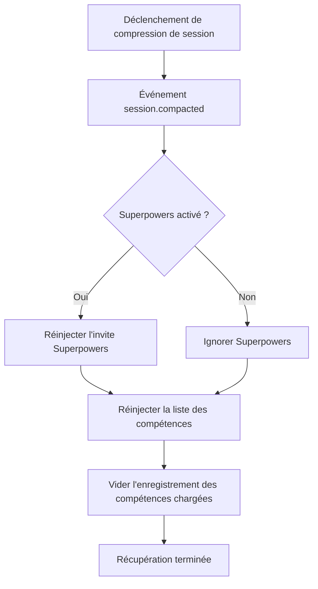

# Mécanisme de récupération après compression de contexte

## Ce que vous pourrez faire après ce cours

- Comprendre comment le plugin maintient les compétences disponibles après la compression de session
- Connaître le moment de déclenchement et le flux d'exécution de la récupération après compression
- Être capable de vérifier si la récupération après compression fonctionne correctement
- Comprendre le rôle des messages synthétiques dans le mécanisme de récupération

## Votre problème actuel

Dans les longues sessions, OpenCode effectue une **compression de contexte** (Context Compaction) pour économiser les tokens. Après compression, la session ne conserve que les messages récents, et l'historique précoce (y compris le contenu des compétences précédemment injectées) est supprimé.

Cela pose un problème : si le contenu des compétences est éliminé par la compression, l'IA ne sait plus quelles compétences sont disponibles et ne peut pas utiliser les compétences chargées.

## Quand utiliser cette solution

Le mécanisme de récupération après compression fonctionne **automatiquement**, sans nécessiter d'intervention manuelle. Cependant, en comprenant son fonctionnement, vous pouvez résoudre des problèmes dans les scénarios suivants :

- L'IA "oublie" soudainement les compétences lors de longues sessions
- Besoin de déboguer la disponibilité des compétences après compression
- Comprendre les stratégies de gestion de session du plugin

## Concept central

### Qu'est-ce que la compression de contexte ?

À mesure que les messages s'accumulent dans une session OpenCode, celle-ci devient de plus en plus longue. Lorsque l'utilisation des tokens approche la limite, le système effectue automatiquement une **compression de contexte** :

```
[Session initiale] → [Message 1] → [Message 2] → ... → [Message 50]
                          ↑ Point de compression : ne conserver que les 10 derniers messages
```

Après compression, les messages précoces (y compris le contenu injecté des compétences) sont supprimés, et l'IA ne voit que l'historique des messages récents.

### Fonctionnement du mécanisme de récupération après compression

Le plugin écoute l'événement `session.compacted`. Dès qu'une compression est détectée, il exécute immédiatement les opérations de récupération suivantes :



**Points clés** :
- La récupération est **automatique**, pas besoin de déclenchement manuel
- La liste des compétences récupérées contient **toutes les compétences découvertes** (pas seulement celles précédemment chargées)
- L'enregistrement des compétences chargées est vidé, permettant à l'IA de réévaluer quelles compétences sont nécessaires

### Rôle des messages synthétiques

Le plugin utilise le mécanisme d'**injection de messages synthétiques** (Synthetic Message Injection) pour injecter du contenu :

| Attribut | Valeur | Signification |
|--- | --- | ---|
| `noReply` | `true` | L'IA ne répondra pas au contenu injecté lui-même |
| `synthetic` | `true` | Marqué comme contenu généré par le système, ne compte pas comme entrée utilisateur, ne s'affiche pas dans l'interface |

Cela signifie que le contenu injecté lors de la récupération après compression :
- Est complètement transparent pour l'utilisateur (invisible)
- Ne consomme pas le quota de messages utilisateur
- Mais est lu et compris par l'IA

## 🎒 Préparation avant de commencer

Ce cours nécessite :
- Plugin OpenCode Agent Skills installé
- Compréhension des bases du chargement des compétences
- Une longue session pour tester l'effet de compression

::: tip
Aucune préparation supplémentaire n'est nécessaire, le mécanisme de récupération après compression est une fonctionnalité intégrée du plugin.
:::

## Suivez les étapes : Vérifier l'effet de récupération après compression

### Étape 1 : Démarrer une nouvelle session

**Pourquoi**
Vérifier que la liste des compétences est injectée normalement lors de l'initialisation de la session

Démarrez une nouvelle session et entrez n'importe quel message :

```
Bonjour
```

**Ce que vous devriez voir** : L'IA répond normalement, et en arrière-plan, la liste des compétences est automatiquement injectée (invisible pour l'utilisateur)

### Étape 2 : Charger une compétence

**Pourquoi**
S'assurer que le contenu de la compétence est injecté dans le contexte

Appelez l'outil `use_skill` :

```
Utilisez get_available_skills pour voir les compétences disponibles, puis utilisez use_skill pour charger l'une d'entre elles
```

**Ce que vous devriez voir** : L'IA liste les compétences disponibles, puis charge la compétence que vous avez choisie

### Étape 3 : Déclencher la compression de contexte

**Pourquoi**
Simuler un scénario de longue session, déclencher le mécanisme de compression d'OpenCode

Envoyez continuellement des messages pour simuler une longue conversation :

```
Message 1 : Contenu de test
Message 2 : Continuer les tests
...
(Répéter l'envoi de 20 à 30 messages)
```

**Ce que vous devriez voir** :
- À mesure que les messages augmentent, l'historique de session s'allonge
- Après avoir atteint une certaine longueur, OpenCode effectue automatiquement la compression
- Après compression, les messages précoces (y compris l'injection des compétences) sont supprimés

### Étape 4 : Vérifier l'effet de récupération

**Pourquoi**
Vérifier que la liste des compétences est réinjectée après compression

Après compression, demandez à l'IA d'utiliser une compétence à nouveau :

```
Aide-moi à utiliser la compétence git-helper pour créer une nouvelle branche (en supposant que vous ayez installé la compétence git-helper)
```

**Ce que vous devriez voir** :
- L'IA sait toujours quelles compétences sont disponibles (prouvant que la liste des compétences a été récupérée)
- L'IA peut charger et utiliser les compétences normalement (prouvant que les fonctionnalités des compétences ne sont pas affectées par la compression)

### Étape 5 : Vérifier l'injection de messages synthétiques

**Pourquoi**
Confirmer que le mécanisme de récupération utilise des messages synthétiques et n'interfère pas avec la conversation

Si le plugin le prend en charge, vous pouvez vérifier l'historique des messages de session (selon les fonctionnalités d'OpenCode) :

```
Utilisez les outils de débogage pour afficher l'historique des messages de session
```

**Ce que vous devriez voir** :
- Les messages de la liste des compétences récupérée sont marqués comme `synthetic: true`
- Ces messages ne s'affichent pas dans l'interface de conversation normale

## Point de contrôle ✅

Après avoir terminé les étapes ci-dessus, vous devriez pouvoir confirmer :

- [ ] L'IA peut toujours accéder à la liste des compétences lors de longues sessions
- [ ] La fonction de chargement des compétences fonctionne normalement après compression
- [ ] Le processus de récupération est complètement transparent pour l'utilisateur

## Avertissements sur les pièges

### Problème 1 : Après compression, l'IA dit "compétence introuvable"

**Causes possibles** :
- Le plugin n'écoute pas correctement l'événement `session.compacted`
- Le chemin du répertoire des compétences a changé

**Solution** :

1. **Vérifier si l'événement de compression est déclenché**
   - À travers les étapes 3 et 4 de "Suivez les étapes", confirmez que l'IA peut toujours accéder à la liste des compétences après compression
   - Si l'IA peut utiliser les compétences normalement, cela signifie que le mécanisme de récupération après compression fonctionne normalement

2. **Vérifier si le plugin est correctement chargé**
   - Redémarrez OpenCode
   - Après avoir démarré une nouvelle session, demandez à l'IA de lister les compétences disponibles (`get_available_skills`)
   - Si vous pouvez voir la liste des compétences, cela signifie que le plugin est correctement chargé

### Problème 2 : La liste des compétences récupérée est vide

**Causes possibles** :
- Aucune compétence dans le chemin de découverte des compétences
- Format de fichier de compétence incorrect

**Solution** :
```bash
# Requête manuelle des compétences disponibles
Utilisez get_available_skills pour voir la liste des compétences
```

Si la liste vide est renvoyée, vérifiez le répertoire des compétences et le format des fichiers.

### Problème 3 : État des compétences chargées perdu après compression

**Il s'agit d'un comportement attendu**, pas d'un bug. Le mécanisme de récupération vide l'enregistrement `loadedSkillsPerSession`, permettant à l'IA de réévaluer quelles compétences sont nécessaires.

**Solution** : L'IA décidera automatiquement s'il faut recharger les compétences en fonction du contexte, sans intervention manuelle.

## Résumé du cours

Le mécanisme de récupération après compression assure la disponibilité des compétences lors de longues sessions par les moyens suivants :

1. **Écouter l'événement de compression** : Détecter automatiquement l'événement `session.compacted`
2. **Réinjecter la liste des compétences** : Injecter toutes les compétences en utilisant la balise `<available-skills>`
3. **Récupération Superpowers optionnelle** : Si activé, récupérer également l'invite Superpowers
4. **Utiliser des messages synthétiques** : Le processus de récupération est transparent pour l'utilisateur et n'affecte pas la conversation
5. **Réinitialiser l'enregistrement des compétences chargées** : Vider l'ensemble des compétences chargées, permettant une réévaluation

Ce mécanisme assure que :
- Les compétences sont toujours disponibles lors de longues sessions
- Le processus de récupération est automatisé et imperceptible
- L'IA peut décider quelles compétences utiliser en fonction du contexte le plus récent

## Aperçu du prochain cours

> Dans le prochain cours, nous apprendrons **[Dépannage des problèmes courants](../../faq/troubleshooting/)**.
>
> Vous apprendrez :
> - Méthodes de gestion des erreurs et exceptions courantes
> - Techniques de dépannage liées à la récupération après compression
> - Solutions à d'autres problèmes d'utilisation

---

## Annexe : Référence du code source

<details>
<summary><strong>Cliquer pour afficher l'emplacement du code source</strong></summary>

> Date de mise à jour : 2026-01-24

| Fonction | Chemin du fichier | Lignes |
|--- | --- | ---|
| Écoute de l'événement de compression | [`src/plugin.ts`](https://github.com/joshuadavidthomas/opencode-agent-skills/blob/main/src/plugin.ts#L144-L157) | 144-157 |
| Initialisation du premier message | [`src/plugin.ts`](https://github.com/joshuadavidthomas/opencode-agent-skills/blob/main/src/plugin.ts#L70-L105) | 70-105 |
| Injection de la liste des compétences | [`src/skills.ts`](https://github.com/joshuadavidthomas/opencode-agent-skills/blob/main/src/skills.ts#L345-L370) | 345-370 |
| Injection de messages synthétiques | [`src/utils.ts`](https://github.com/joshuadavidthomas/opencode-agent-skills/blob/main/src/utils.ts#L147-L162) | 147-162 |
| Gestion de l'état de session | [`src/plugin.ts`](https://github.com/joshuadavidthomas/opencode-agent-skills/blob/main/src/plugin.ts#L25-L35) | 25-35 |

**Variables clés** :
- `setupCompleteSessions: Set<string>` : Enregistre les ID de sessions ayant terminé l'initialisation
- `loadedSkillsPerSession: Map<string, Set<string>>` : Enregistre les noms des compétences chargées pour chaque session

**Fonctions clés** :
- `injectSkillsList()` : Injecte la liste des compétences disponibles dans la session
- `injectSyntheticContent()` : Utilise des messages synthétiques pour injecter du contenu
- `getSessionContext()` : Obtient les informations de modèle et d'agent de la session

</details>
