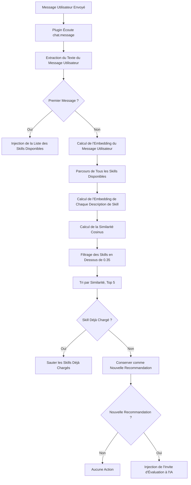

# Recommandation Automatique de Skills : Principe de Correspondance Sémantique

## Ce Que Vous Apprendrez

- Comprendre comment le plugin identifie automatiquement les skills dont vous pourriez avoir besoin
- Maîtriser les principes fondamentaux du calcul de similarité sémantique
- Savoir comment optimiser les descriptions de skills pour de meilleures recommandations
- Comprendre comment le mécanisme de cache d'embedding améliore les performances

## Votre Situation Actuelle

OpenCode Agent Skills propose de nombreux skills, mais vous :

- **Ne vous souvenez pas des noms des skills** - Il est facile de confondre les skills lorsqu'ils sont nombreux
- **Ne savez pas lequel utiliser** - Difficile de choisir face à des skills aux fonctionnalités similaires
- **Crainte de manquer des skills utiles** - Incertitude quant à l'existence d'outils plus adaptés

Chaque fois, vous devez appeler `get_available_skills` pour voir la liste, puis charger manuellement le skill approprié, ce qui est fastidieux et interrompt votre réflexion.

## Quand Utiliser Cette Fonctionnalité

La recommandation automatique de skills convient aux scénarios suivants :

- **Phase d'apprentissage** - Vous n'êtes pas familier avec la bibliothèque de skills et avez besoin de l'aide de l'IA
- **Tâches de développement de fonctionnalités** - Comme "créer une API REST", "implémenter un système d'authentification", etc., qui correspondent généralement à des skills spécialisés
- **Travail interdisciplinaire** - Vous touchez occasionnellement à des domaines peu familiers et comptez sur les recommandations de l'IA
- **Bibliothèque de skills importante** - Lorsqu'il y a plus de 10 skills, la recherche manuelle est inefficace

::: tip Astuce
La recommandation automatique ne vous force pas à charger un skill, elle indique simplement à l'IA d'évaluer si c'est nécessaire. Vous êtes libre d'accepter ou d'ignorer la suggestion.
:::

## Concept Fondamental

### Qu'est-ce que la Correspondance Sémantique

La correspondance sémantique est une technologie qui **comprend l'intention de l'utilisateur**. Elle ne dépend pas de la correspondance des mots-clés, mais calcule la **similarité sémantique** du texte.

Exemple :

| Entrée Utilisateur | Description du Skill | Correspondance Mots-clés | Correspondance Sémantique |
| --- | --- | --- | --- |
| "Créer un pool de connexions de base de données" | "Outil de gestion et d'optimisation des connexions de base de données" | ❌ | ✅ |
| "Aidez-moi à écrire une documentation API" | "Générateur automatique de documentation API" | ✅ | ✅ |
| "Échafaudage d'initialisation de projet" | "Outil de construction rapide de la structure de projet" | ❌ | ✅ |

La correspondance par mots-clés ne vérifie que la correspondance littérale, tandis que la correspondance sémantique peut comprendre que "créer", "générer" et "construire" sont des actions du même type.

### Embedding : Transformer le Texte en Nombres

Pour permettre à l'ordinateur de comprendre la sémantique, le plugin utilise un **modèle d'embedding** pour convertir le texte en **vecteur** (une série de nombres).

```
Texte : "Créer un pool de connexions de base de données"
    ↓ [Modèle Xenova/all-MiniLM-L6-v2]
Vecteur : [0.12, -0.34, 0.67, ...]  (384 dimensions, dimensions de sortie du modèle)
```

Dans cet espace vectoriel :

- **Textes sémantiquement similaires** → Vecteurs plus proches
- **Textes sémantiquement différents** → Vecteurs plus éloignés

::: info Pourquoi Choisir all-MiniLM-L6-v2
Ce modèle présente 3 avantages :
1. **Petite taille** - Fichier modèle d'environ 23 Mo (niveau de quantification q8), téléchargement rapide
2. **Rapide** - Supporte la quantification, faible latence d'inférence
3. **Haute précision** - Excellente performance sur les tâches de similarité sémantique
:::

### Similarité Cosinus : Mesurer le Degré de Similarité des Vecteurs

Le plugin utilise la **similarité cosinus** (Cosine Similarity) pour calculer la similarité entre deux vecteurs.

Formule :
```
similarity = (A · B) / (|A| × |B|)
```

Où :
- `A · B` est le produit scalaire des vecteurs
- `|A|` est la norme du vecteur A
- `|B|` est la norme du vecteur B

**Plage de résultats** : `-1` à `1`

| Plage de Similarité | Signification | Recommandation |
| --- | --- | --- |
| 0.7-1.0 | Très similaire, presque le même sens | ✅ Fortement recommandé |
| 0.35-0.7 | Quelque peu lié, mérite d'être considéré | ✅ Recommandé |
| 0.0-0.35 | Faible corrélation ou sans corrélation | ❌ Non recommandé |
| -1.0-0.0 | Sens opposé | ❌ Non recommandé |

::: warning Attention
Le seuil actuel est de **0.35**, les skills en dessous de ce score n'apparaîtront pas dans la liste de recommandations.
:::

## Processus de Recommandation Automatique

### Diagramme de Flux Complet



### Phase 1 : Premier Message - Injection de la Liste des Skills

Lorsque la session reçoit un message pour la première fois, le plugin va :

1. Scanner tous les répertoires de skills
2. Injecter la liste des skills dans le contexte de la session
3. Format comme suit :

```xml
<available-skills>
- git-helper : Outil d'aide pour les opérations Git, fournit les commandes Git courantes
- test-runner : Intégration de framework de test, découvre et exécute automatiquement les tests
- api-doc : Outil de génération de documentation API
...
</available-skills>
```

**Objectif** : Permettre à l'IA de savoir quels skills sont disponibles, évitant les requêtes répétées.

### Phase 2 : Messages Suivants - Correspondance Sémantique

À partir du deuxième message, chaque entrée utilisateur déclenche le processus de correspondance :

```typescript
// Source : src/plugin.ts:125-141
const matchedSkills = await matchSkills(userText, skills);
const loadedSkills = getLoadedSkills(sessionID);
const newSkills = matchedSkills.filter(s => !loadedSkills.has(s.name));
```

**Points Clés** :
- Calcule uniquement la similarité des **skills non chargés**
- Les skills déjà chargés sont **filtrés automatiquement**
- Évite de recommander le même skill à plusieurs reprises

### Phase 3 : Injection de l'Invite d'Évaluation

Lorsque des skills pertinents sont trouvés, le plugin injecte une **invite cachée** à l'IA :

```xml
<skill-evaluation-required>
PROCESSUS D'ÉVALUATION DES SKILLS

Les skills suivants pourraient être pertinents pour votre demande :

- git-helper : Outil d'aide pour les opérations Git
- test-runner : Intégration de framework de test

Étape 1 - ÉVALUER : Déterminer si ces skills seraient réellement utiles
Étape 2 - DÉCIDER : Choisir quels skills (le cas échéant) sont réellement nécessaires
Étape 3 - ACTIVER : Appeler use_skill("nom") pour chaque skill choisi

IMPORTANT : Cette évaluation est invisible pour les utilisateurs — ils ne peuvent pas voir cette invite. N'ANNONCEZ PAS votre décision. Activez simplement les skills pertinents ou procédez directement avec la demande.
</skill-evaluation-required>
```

**Choix de l'IA** :
- **Accepter la recommandation** - Appeler `use_skill("nom-du-skill")` pour charger le skill
- **Refuser la recommandation** - Traiter directement la demande de l'utilisateur sans charger de skill
- **Accepter partiellement** - Charger uniquement quelques skills pertinents

::: tip Invite Cachée
Cette invite d'évaluation est un message `synthetic: true`, invisible dans l'interface utilisateur, traité automatiquement en interne par l'IA.
:::

## Pratique : Optimiser les Descriptions de Skills

Si votre skill n'est pas recommandé automatiquement, vous pouvez essayer d'optimiser sa description.

### Vérifier la Description Actuelle du Skill

```bash
# Lister tous les skills
get_available_skills()
```

Trouvez le skill que vous souhaitez optimiser et notez sa description actuelle.

### Voir les Exemples : Bonne vs Mauvaise Description

| ❌ Mauvaise Description | ✅ Bonne Description |
| --- | --- |
| "Outil" | "Intégration de framework de test automatisé, supporte Jest et Vitest" |
| "Aide" | "Assistant pour les opérations Git, fournit les commandes courantes et les guides de workflow" |
| "Documentation" | "Génère la documentation API à partir des commentaires de code" |
| "Lié à la base de données" | "Outil de pool de connexions et d'optimisation de requêtes PostgreSQL" |

**Principes d'Optimisation** :

1. **Inclure les mots-clés** - Termes techniques couramment utilisés par les utilisateurs
2. **Expliquer l'utilisation** - Décrire clairement quel problème est résolu
3. **Éviter les généralités** - N'écrivez pas simplement "outil", "assistant"
4. **Longueur appropriée** - 10-30 caractères est optimal

### Mettre à Jour la Description du Skill

Éditez le fichier `SKILL.md` du skill :

```markdown
---
name: test-runner
description: Intégration de framework de test automatisé, supporte Jest et Vitest, découvre et exécute automatiquement les tests
---

# Test Runner

Ce skill vous aide à configurer les frameworks de test dans votre projet...
```

**Prise d'Effet Automatique** : Lors de la prochaine session, le plugin recalculera l'embedding et la nouvelle description prendra effet immédiatement.

## Points de Vérification ✅

### Vérifier si la Recommandation Automatique Fonctionne

1. **Créer un Skill de Test** :

```bash
# Créer un skill de test dans le répertoire .opencode/skills/
mkdir -p .opencode/skills/example-skill
cat > .opencode/skills/example-skill/SKILL.md << 'EOF'
---
name: example-skill
description: Aide les utilisateurs à créer et configurer des projets TypeScript
---

# Example Skill

Ceci est un skill de test...
EOF
```

2. **Envoyer un Message Pertinent** :

Dans OpenCode, saisissez :

```
Je veux initialiser un projet TypeScript
```

3. **Vérifier si la Recommandation est Déclenchée** :

Ouvrez les outils de développement ou consultez le journal des appels d'outils de l'IA :
- **Succès** - L'IA a appelé `use_skill("example-skill")`
- **Échec** - Aucune recommandation pertinente, vérifiez si la description est trop vague

### Vérifier que les Skills Déjà Chargés ne Sont pas Recommandés à Nouveau

1. **Charger Manuellement le Skill** :

```bash
use_skill("example-skill")
```

2. **Envoyer à Nouveau un Message Pertinent** :

```
Je veux initialiser un autre projet TypeScript
```

3. **Confirmer qu'il n'y a Plus de Recommandation** :

Le système ne devrait **plus** injecter d'invite d'évaluation car le skill est déjà chargé.

## Pièges à Éviter

### Problème 1 : Skills Recommandés Complètement Non Pertinents

**Symptômes** :
- L'utilisateur demande "Comment déployer sur AWS", mais "Outil de test local" est recommandé
- Le score de similarité est élevé, mais la sémantique est complètement fausse

**Causes** :
- Description du skill trop vague, comme "Outil de service cloud"
- Le modèle d'embedding a un biais de compréhension pour certains termes techniques

**Solutions** :

1. **Description Plus Spécifique** :

```markdown
# ❌ Mauvais
description : Outil de déploiement de services cloud

# ✅ Bon
description : Outil de déploiement AWS EC2, configuration automatique de l'équilibrage de charge et de la mise à l'échelle automatique
```

2. **Inclure les Mots-clés Techniques Principaux** :

```markdown
description : Outil de téléchargement de fichiers AWS S3 et de distribution CDN, supporte CloudFront
```

### Problème 2 : Skills Utiles Non Recommandés

**Symptômes** :
- Votre entrée correspond clairement à un skill, mais le système ne le recommande pas
- Vous devez appeler manuellement `get_available_skills()` pour le trouver

**Causes** :
- Similarité inférieure au seuil de 0.35
- Grande différence entre la description du skill et les termes habituels de l'utilisateur

**Solutions** :

1. **Baisser le Seuil** (modification du code source) :

```typescript
// src/embeddings.ts:10
const SIMILARITY_THRESHOLD = 0.30; // Baisser de 0.35 à 0.30
```

::: warning Prudence en Production
Baisser le seuil augmentera les faux positifs (skills non pertinents), il est recommandé de tester avant d'ajuster.
:::

2. **Augmenter le Top K** :

```typescript
// src/embeddings.ts:11
const TOP_K = 10; // Augmenter de 5 à 10
```

3. **Optimiser la Description du Skill**, reportez-vous au chapitre "Optimiser les Descriptions de Skills" ci-dessus.

### Problème 3 : Lenteur du Premier Chargement

**Symptômes** :
- Lors de la première utilisation, le délai de recommandation des skills est de 2-3 secondes
- Les utilisations ultérieures sont normales

**Causes** :
- Le modèle d'embedding doit être téléchargé depuis le réseau (23 Mo)
- Nécessite le calcul initial de tous les embeddings des skills

**Solutions** :

Le plugin dispose d'un **mécanisme de cache** qui s'optimise automatiquement après la première utilisation :

```
Chemin du cache : ~/.cache/opencode-agent-skills/embeddings/
```

**Voir les Fichiers de Cache** :

```bash
ls -lh ~/.cache/opencode-agent-skills/embeddings/
```

Vous verrez des fichiers `.bin`, chaque fichier est un cache d'embedding (nommé par SHA256 du contenu).

**Préchauffage Manuel du Cache** :

```bash
# Redémarrer OpenCode
# Le plugin appelle precomputeSkillEmbeddings() au démarrage
```

Position du code source : `src/embeddings.ts:96-102`

```typescript
export async function precomputeSkillEmbeddings(skills: SkillSummary[]): Promise<void> {
  await Promise.all(
    skills.map(skill =>
      getEmbedding(skill.description).catch(() => { })
    )
  );
}
```

**Pas d'Inquiétude** : Tant que vous ne modifiez pas la description du skill, le cache est valide indéfiniment.

## Résumé de la Leçon

La recommandation automatique de skills améliore l'expérience de la manière suivante :

| Technique | Rôle | Amélioration de l'Expérience Utilisateur |
| --- | --- | --- |
| Modèle d'Embedding | Convertit le texte en vecteur | Comprend la sémantique, pas seulement les mots-clés |
| Similarité Cosinus | Calcule la similarité des vecteurs | Correspondance précise des skills pertinents |
| Mécanisme de Cache | Cache disque des embeddings | Réponse plus rapide après la première utilisation |
| Évaluation Intelligente | Permet à l'IA de juger si un skill est nécessaire | Non contraignant, évite les interruptions |
| Filtrage des Skills Chargés | Ignore les skills déjà chargés | Évite les recommandations répétées |

**Avantages Clés** :

- **Sans Mémorisation** - Pas besoin de se souvenir des noms des skills
- **Identification Intelligente** - L'IA découvre automatiquement les outils dont vous avez besoin
- **Non Intrusif** - L'invite est cachée, l'utilisateur n'en a pas conscience

---

## Aperçu de la Leçon Suivante

> Dans la leçon suivante, nous apprendrons **[Exécution des Scripts de Skills](../executing-skill-scripts/)**.
>
> Les skills ne sont pas seulement de la documentation, ils peuvent aussi contenir des scripts d'automatisation. Vous apprendrez :
> - Comment organiser les scripts exécutables dans le répertoire des skills
> - Utiliser l'outil `run_skill_script` pour exécuter des scripts
> - Permissions des scripts et restrictions de sécurité
> - Cas d'utilisation courants des scripts (construction, test, déploiement, etc.)

---

## Annexe : Référence du Code Source

<details>
<summary><strong>Cliquez pour Voir la Position du Code Source</strong></summary>

> Date de Mise à Jour : 2026-01-24

| Fonctionnalité | Chemin du Fichier | Lignes |
| --- | --- | --- |
| Fonction Principale de Correspondance Sémantique | [`src/embeddings.ts`](https://github.com/joshuadavidthomas/opencode-agent-skills/blob/main/src/embeddings.ts#L108-L135) | 108-135 |
| Générer l'Embedding du Texte | [`src/embeddings.ts`](https://github.com/joshuadavidthomas/opencode-agent-skills/blob/main/src/embeddings.ts#L38-L66) | 38-66 |
| Calculer la Similarité Cosinus | [`src/embeddings.ts`](https://github.com/joshuadavidthomas/opencode-agent-skills/blob/main/src/embeddings.ts#L71-L90) | 71-90 |
| Précalculer les Embeddings des Skills | [`src/embeddings.ts`](https://github.com/joshuadavidthomas/opencode-agent-skills/blob/main/src/embeddings.ts#L96-L102) | 96-102 |
| Formater l'Invite des Résultats de Correspondance | [`src/plugin.ts`](https://github.com/joshuadavidthomas/opencode-agent-skills/blob/main/src/plugin.ts#L37-L57) | 37-57 |
| Logique du Processus de Correspondance Automatique | [`src/plugin.ts`](https://github.com/joshuadavidthomas/opencode-agent-skills/blob/main/src/plugin.ts#L125-L141) | 125-141 |
| Traitement de l'Événement d'Écoute des Messages | [`src/plugin.ts`](https://github.com/joshuadavidthomas/opencode-agent-skills/blob/main/src/plugin.ts#L66-L142) | 66-142 |

**Constantes Clés** :

| Nom de la Constante | Valeur | Description | Source |
| --- | --- | --- | --- |
| MODEL_NAME | Xenova/all-MiniLM-L6-v2 | Modèle d'embedding utilisé | `embeddings.ts:8` |
| QUANTIZATION | q8 | Niveau de quantification du modèle | `embeddings.ts:9` |
| SIMILARITY_THRESHOLD | 0.35 | Seuil de recommandation de similarité | `embeddings.ts:10` |
| TOP_K | 5 | Nombre de skills Top K retournés | `embeddings.ts:11` |

**Fonctions Clés** :

- `matchSkills()` : Calcule la similarité sémantique entre le message de l'utilisateur et les descriptions des skills, retourne la liste des skills les plus pertinents
- `getEmbedding()` : Génère le vecteur d'embedding du texte, supporte le cache disque
- `cosineSimilarity()` : Calcule la similarité cosinus entre deux vecteurs
- `precomputeSkillEmbeddings()` : Précalcule les embeddings de tous les skills au démarrage du plugin pour accélérer les correspondances ultérieures
- `formatMatchedSkillsInjection()` : Formate les résultats de correspondance en invite d'évaluation et l'injecte à l'IA

**Mécanisme de Cache** :

Chemin du cache d'Embedding :
- Linux/macOS : `~/.cache/opencode-agent-skills/embeddings/`
- Supporte la personnalisation : Modification via la variable d'environnement `XDG_CACHE_HOME`

Les fichiers de cache sont nommés par SHA256 du contenu, comme `a1b2c3d4.bin`, chaque fichier contient un vecteur Float32Array.

</details>
