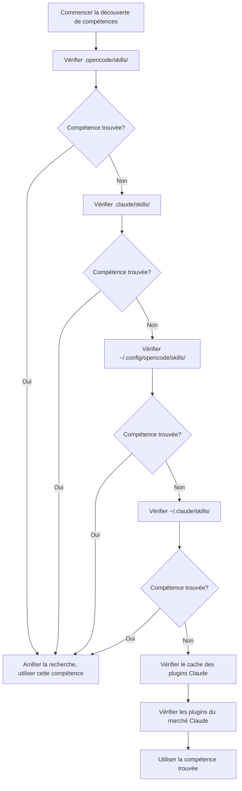

# Explication du Mécanisme de Découverte de Compétences

## Ce que Vous Pouvez Faire Après Ce Cours

- Comprendre à partir de quels emplacements l'extension découvre automatiquement les compétences
- Maîtriser les règles de priorité de la découverte de compétences
- Savoir comment permettre aux compétences de niveau projet de remplacer les compétences de niveau utilisateur
- Comprendre le mécanisme de compatibilité des compétences Claude Code

## Votre Problème Actuel

Vous avez créé des compétences, mais l'IA continue de dire « compétence introuvable ». Vous ne savez pas dans quels emplacements l'extension recherche les compétences, et vous ne savez pas ce qui se passe avec les compétences de même nom. Résultat : les compétences sont placées au mauvais endroit, ou elles sont remplacées par des compétences d'autres emplacements.

## Quand Utiliser Cette Méthode

- Lorsque vous avez besoin qu'une certaine compétence prenne effet dans le projet
- Lorsque vous voulez remplacer les compétences de niveau utilisateur ou celles fournies par l'extension
- Lors de la réutilisation de compétences Claude Code

## 🎒 Préparation Avant de Commencer

::: warning Connaissances Préalables
Veuillez d'abord terminer [Installation d'OpenCode Agent Skills](../../start/installation/).
:::

## Idée Principale

OpenCode Agent Skills découvre automatiquement les compétences à partir de plusieurs emplacements, en les recherchant selon l'ordre de priorité. **La première compétence trouvée prend effet, les compétences de même nom suivantes sont ignorées**. Cela vous permet de remplacer les compétences de niveau utilisateur dans le projet, réalisant ainsi une personnalisation.

### Aperçu des Chemins de Découverte



::: info Unicité du Nom de Compétence
Les compétences de même nom ne conservent que la première découverte, les suivantes sont ignorées. Cela signifie que `git-helper` de niveau projet remplacera `git-helper` de niveau utilisateur.
:::

## Suivez-moi

### Étape 1 : Vérifier la Logique de Découverte de Compétences

**Pourquoi**
Comprendre comment l'extension analyse les répertoires de compétences peut vous aider à localiser les problèmes.

Vérifiez la définition des chemins de découverte dans le code source :

```typescript
// src/skills.ts:241-246
const discoveryPaths: DiscoveryPath[] = [
  { path: path.join(directory, '.opencode', 'skills'), label: 'project', maxDepth: 3 },
  { path: path.join(directory, '.claude', 'skills'), label: 'claude-project', maxDepth: 1 },
  { path: path.join(homedir(), '.config', 'opencode', 'skills'), label: 'user', maxDepth: 3 },
  { path: path.join(homedir(), '.claude', 'skills'), label: 'claude-user', maxDepth: 1 }
];
```

**Ce que vous devriez voir** :
- 4 chemins de découverte locaux, chacun avec un `label` (identifiant de source) et un `maxDepth` (profondeur de récursivité maximale)
- Il y a également 2 chemins de plugins Claude (cache et plugins du marché), découverts via `discoverPluginCacheSkills()` et `discoverMarketplaceSkills()`
- `directory` est le répertoire racine du projet, `homedir()` est le répertoire principal de l'utilisateur

### Étape 2 : Comprendre le Mécanisme de Recherche Récursive

**Pourquoi**
Comprendre les limites de profondeur de récursivité peut vous aider à éviter de placer les compétences trop profondément, ce qui les rend introuvables.

La fonction de recherche récursive parcourt l'arborescence des répertoires, recherchant les fichiers `SKILL.md` :

```typescript
// src/skills.ts:182-207
async function recurse(dir: string, depth: number, relPath: string) {
  if (depth > maxDepth) return;  // Dépasser la limite de profondeur, arrêter la recherche

  const entries = await fs.readdir(dir, { withFileTypes: true });
  for (const entry of entries) {
    const fullPath = path.join(dir, entry.name);
    const stats = await fs.stat(fullPath);

    if (!stats.isDirectory()) continue;  // Ignorer les fichiers

    const newRelPath = relPath ? `${relPath}/${entry.name}` : entry.name;
    const found = await findFile(fullPath, newRelPath, 'SKILL.md');

    if (found) {
      results.push({ ...found, label });  // Compétence trouvée, ajouter aux résultats
    } else {
      await recurse(fullPath, depth + 1, newRelPath);  // Recherche récursive des sous-répertoires
    }
  }
}
```

**Ce que vous devriez voir** :
- La profondeur de chaque répertoire commence à 0, s'arrête lorsqu'elle dépasse `maxDepth`
- Renvoie si `SKILL.md` est trouvé, sinon continue la recherche des sous-répertoires

**Profondeurs de récursivité pour différents emplacements** :

| Emplacement                | Label           | Profondeur Maximale | Description                       |
|--- | --- | --- | ---|
| `.opencode/skills/` | project         | 3        | Supporte la structure de répertoires imbriqués           |
| `.claude/skills/`   | claude-project  | 1        | Scanne uniquement la première couche               |
| `~/.config/opencode/skills/` | user   | 3        | Supporte la structure de répertoires imbriqués           |
| `~/.claude/skills/` | claude-user     | 1        | Scanne uniquement la première couche               |

### Étape 3 : Comprendre les Règles de Déduplication

**Pourquoi**
Les compétences de même nom ne conservent qu'une seule, connaître cette règle peut éviter que les compétences soient remplacées.

La logique de déduplication se trouve dans la fonction `discoverAllSkills` :

```typescript
// src/skills.ts:255-262
const skillsByName = new Map<string, Skill>();
for (const { filePath, relativePath, label } of allResults) {
  const skill = await parseSkillFile(filePath, relativePath, label);
  if (!skill || skillsByName.has(skill.name)) continue;  // Ignorer les compétences de même nom existantes
  skillsByName.set(skill.name, skill);
}
```

**Ce que vous devriez voir** :
- Utilise `Map` pour stocker selon `skill.name`, garantissant l'unicité
- `skillsByName.has(skill.name)` vérifie si une compétence de même nom existe déjà
- Les compétences de même nom suivantes sont ignorées (`continue`)

**Exemple de Scénario** :

```
Structure du projet :
.opencode/skills/git-helper/SKILL.md  ← Première découverte, en vigueur
~/.config/opencode/skills/git-helper/SKILL.md  ← Même nom, ignoré
```

### Étape 4 : Analyser le Fichier SKILL.md

**Pourquoi**
Comprendre les règles d'analyse de SKILL.md peut vous aider à éviter les erreurs de format.

L'extension analyse le YAML frontmatter de SKILL.md :

```typescript
// src/skills.ts:132-152
const frontmatterMatch = content.match(/^---\n([\s\S]*?)\n---\n([\s\S]*)$/);
if (!frontmatterMatch?.[1] || !frontmatterMatch?.[2]) {
  return null;  // Erreur de format, ignorer
}

const frontmatterText = frontmatterMatch[1];
const skillContent = frontmatterMatch[2].trim();

let frontmatterObj: unknown;
try {
  frontmatterObj = parseYamlFrontmatter(frontmatterText);
} catch {
  return null;  // Échec de l'analyse YAML, ignorer
}

let frontmatter: SkillFrontmatter;
try {
  frontmatter = SkillFrontmatterSchema.parse(frontmatterObj);
} catch (error) {
  return null;  // Échec de la validation, ignorer
}
```

**Ce que vous devriez voir** :
- Le Frontmatter doit être entouré de `---`
- Le contenu YAML doit être conforme à la validation du Schéma Zod
- Les compétences dont l'analyse échoue sont ignorées (pas d'erreur, continue à découvrir d'autres compétences)

**Règles de Validation Frontmatter** :

```typescript
// src/skills.ts:106-114
const SkillFrontmatterSchema = z.object({
  name: z.string()
    .regex(/^[\p{Ll}\p{N}-]+$/u, { message: "Name must be lowercase alphanumeric with hyphens" })
    .min(1, { message: "Name cannot be empty" }),
  description: z.string()
    .min(1, { message: "Description cannot be empty" }),
  license: z.string().optional(),
  "allowed-tools": z.array(z.string()).optional(),
  metadata: z.record(z.string(), z.string()).optional()
});
```

**Spécifications de Nom** :
- Seuls les lettres minuscules, les chiffres et les traits d'union (`-`) sont autorisés
- Les espaces, les lettres majuscules et les tirets bas ne sont pas autorisés

| ❌ Noms de Compétence Incorrects  | ✅ Noms de Compétence Corrects |
|--- | ---|
| `MySkill`        | `my-skill`       |
| `git_helper`     | `git-helper`     |
| `Git Helper`     | `git-helper`     |

### Étape 5 : Découvrir les Scripts Exécutables

**Pourquoi**
Les compétences peuvent contenir des scripts d'automatisation, comprendre le mécanisme de découverte de scripts peut vous aider à configurer correctement.

L'extension analyse récursivement le répertoire de compétences, recherchant les fichiers exécutables :

```typescript
// src/skills.ts:61-93
const scripts: Script[] = [];
const skipDirs = new Set(['node_modules', '__pycache__', '.git', '.venv', 'venv', '.tox', '.nox']);

async function recurse(dir: string, depth: number, relPath: string) {
  if (depth > maxDepth) return;

  const entries = await fs.readdir(dir, { withFileTypes: true });
  for (const entry of entries) {
    if (entry.name.startsWith('.')) continue;  // Ignorer les répertoires cachés
    if (skipDirs.has(entry.name)) continue;    // Ignorer les répertoires de dépendances

    const fullPath = path.join(dir, entry.name);
    const stats = await fs.stat(fullPath);

    if (stats.isDirectory()) {
      await recurse(fullPath, depth + 1, newRelPath);
    } else if (stats.isFile()) {
      if (stats.mode & 0o111) {  // Vérifier le bit exécutable
        scripts.push({
          relativePath: newRelPath,
          absolutePath: fullPath
        });
      }
    }
  }
}
```

**Ce que vous devriez voir** :
- Analyse uniquement les fichiers avec le bit exécutable (`0o111`)
- Ignore automatiquement les répertoires cachés et les répertoires de dépendances courants
- Profondeur de récursivité maximale de 10 niveaux

**Règles de Découverte de Scripts** :

| Règle              | Description                                    |
|--- | ---|
| Vérification du bit exécutable      | Les fichiers doivent avoir les droits d'exécution (`chmod +x`)       |
| Ignorer les répertoires cachés      | Ne pas analyser les répertoires `.git`, `.venv`, etc.           |
| Ignorer les répertoires de dépendances      | Ne pas analyser `node_modules`, `__pycache__`, etc. |
| Profondeur maximale de 10 niveaux    | L'imbrication de plus de 10 niveaux ne sera pas analysée              |

### Étape 6 : Compatibilité avec les Plugins Claude Code

**Pourquoi**
Comprendre le mécanisme de compatibilité des plugins Claude Code peut vous aider à réutiliser les compétences existantes.

L'extension analyse le cache des plugins Claude Code et le répertoire d'installation du marché :

```typescript
// src/claude.ts:115-145
async function discoverMarketplaceSkills(): Promise<LabeledDiscoveryResult[]> {
  const claudeDir = path.join(homedir(), ".claude", "plugins");
  const installedPath = path.join(claudeDir, "installed_plugins.json");

  let installed: InstalledPlugins;
  try {
    const content = await fs.readFile(installedPath, "utf-8");
    installed = JSON.parse(content);
  } catch {
    return [];
  }

  const isV2 = installed.version === 2;

  for (const pluginKey of Object.keys(installed.plugins || {})) {
    const pluginData = installed.plugins[pluginKey];
    if (!pluginData) continue;

    if (isV2 || Array.isArray(pluginData)) {
      // v2 format: use installPath directly from each installation entry
      const installPaths = getPluginInstallPaths(pluginData);
      for (const installPath of installPaths) {
        const skills = await discoverSkillsFromPluginDir(installPath);
        results.push(...skills);
      }
    } else {
      // v1 format: use marketplace manifest to find skills
      // ...
    }
  }
}
```

**Ce que vous devriez voir** :
- Lit le fichier `installed_plugins.json` de Claude Code
- Supporte les deux formats de plugins v1 et v2
- Analyse les fichiers `SKILL.md` à partir des chemins d'installation des plugins

**Structure des Plugins Claude Code** :

Structure du répertoire de cache (cache des plugins) :

```
~/.claude/plugins/
├── cache/                    # Cache des plugins
│   ├── plugin-name/         # Structure v1
│   │   └── skills/
│   │       └── skill-name/SKILL.md
│   └── marketplace-name/    # Structure v2
│       └── plugin-name/
│           └── version/
│               └── skills/
│                   └── skill-name/SKILL.md
└── installed_plugins.json   # Liste des plugins installés
```

**Plugins du Marché (v2)** :
- Le chemin réel du plugin est lu à partir du champ `installPath` de `installed_plugins.json`
- Le chemin n'est pas fixe, il peut être n'importe où dans les portées `managed`, `user`, `project` ou `local`
- Chaque répertoire de plugin a un sous-répertoire `skills/` contenant les différentes compétences

## Point de Contrôle ✅

Vérifiez que vous avez maîtrisé le mécanisme de découverte de compétences :

- [ ] Connaissez l'ordre de priorité des 6 chemins de découverte de compétences
- [ ] Comprenez que les compétences de même nom ne conservent que la première découverte
- [ ] Connaissez les limites de profondeur de récursivité pour différents emplacements
- [ ] Comprenez les règles de validation de SKILL.md
- [ ] Savez comment permettre aux compétences de niveau projet de remplacer les compétences de niveau utilisateur

## Attention aux Pièges

### ❌ Compétences Placées au Mauvais Endroit

**Problème** : La compétence est placée dans `~/.config/opencode/skills/`, mais il y a une compétence de même nom dans le projet, ce qui entraîne son remplacement.

**Solution** : Placez les compétences spécifiques au projet dans `.opencode/skills/` pour assurer la priorité la plus élevée.

### ❌ Nom de Compétence Non Conforme aux Spécifications

**Problème** : Le champ `name` dans SKILL.md contient des lettres majuscules ou des espaces, ce qui entraîne un échec de l'analyse.

**Solution** : Assurez-vous que le nom de la compétence respecte la spécification `lowercase-alphanumeric-with-hyphens`, comme `git-helper`.

### ❌ Script Sans Droits d'Exécution

**Problème** : Le script de compétence ne peut pas être exécuté par l'outil `run_skill_script`.

**Solution** : Ajoutez les droits d'exécution au script :
```bash
chmod +x tools/build.sh
```

### ❌ Compétence Trop Profonde pour Être Trouvée

**Problème** : La compétence est placée dans `~/.config/opencode/skills/category/subcategory/skill/`, dépassant la limite de profondeur de récursivité.

**Solution** : Assurez-vous que la profondeur du répertoire de compétences ne dépasse pas la limite `maxDepth` de l'emplacement correspondant.

## Résumé du Cours

OpenCode Agent Skills découvre automatiquement les compétences à partir de plusieurs emplacements, en les recherchant selon l'ordre de priorité :

1. **Ordre de Priorité** (du plus haut au plus bas) : `.opencode/skills/` → `.claude/skills/` → `~/.config/opencode/skills/` → `~/.claude/skills/` → Cache des plugins Claude (`~/.claude/plugins/cache/`) → Plugins du marché Claude (chemin d'installation lu à partir de `installed_plugins.json`)

2. **Règle de Déduplication** : Les compétences de même nom ne conservent que la première découverte, les compétences de niveau projet remplacent les compétences de niveau utilisateur.

3. **Profondeur de Récursivité** : Les profondeurs de récursivité varient selon les emplacements, les compétences placées trop profondément peuvent ne pas être trouvées.

4. **Validation de Format** : Le frontmatter de SKILL.md doit être conforme à la validation du Schéma Zod, sinon il est ignoré.

5. **Découverte de Scripts** : Seuls les fichiers avec le bit exécutable seront reconnus comme des scripts.

## Aperçu du Cours Suivant

> Dans le cours suivant, nous apprendrons **[Recherche et Liste des Compétences Disponibles](../listing-available-skills/)**.
>
> Vous apprendrez :
> - Utiliser l'outil `get_available_skills` pour voir toutes les compétences disponibles
> - Comprendre l'utilisation des espaces de noms de compétences
> - Comment trouver des compétences avec une correspondance floue

---

## Annexe : Référence du Code Source

<details>
<summary><strong>Cliquez pour développer les emplacements du code source</strong></summary>

> Date de mise à jour : 2026-01-24

| Fonction           | Chemin du Fichier                                                                                      | Ligne    |
|--- | --- | ---|
| Définition des chemins de découverte   | [`src/skills.ts`](https://github.com/joshuadavidthomas/opencode-agent-skills/blob/main/src/skills.ts#L241-L246)     | 241-246 |
| Découverte de toutes les compétences   | [`src/skills.ts`](https://github.com/joshuadavidthomas/opencode-agent-skills/blob/main/src/skills.ts#L240-L263)     | 240-263 |
| Recherche récursive de compétences   | [`src/skills.ts`](https://github.com/joshuadavidthomas/opencode-agent-skills/blob/main/src/skills.ts#L176-L218)     | 176-218 |
| Énumération SkillLabel | [`src/skills.ts`](https://github.com/joshuadavidthomas/opencode-agent-skills/blob/main/src/skills.ts#L30)              | 30      |
| Logique de déduplication       | [`src/skills.ts`](https://github.com/joshuadavidthomas/opencode-agent-skills/blob/main/src/skills.ts#L255-L262)     | 255-262 |
| Analyse du Frontmatter | [`src/skills.ts`](https://github.com/joshuadavidthomas/opencode-agent-skills/blob/main/src/skills.ts#L122-L167)      | 122-167 |
| Validation du Schéma    | [`src/skills.ts`](https://github.com/joshuadavidthomas/opencode-agent-skills/blob/main/src/skills.ts#L105-L114)     | 105-114 |
| Découverte de scripts       | [`src/skills.ts`](https://github.com/joshuadavidthomas/opencode-agent-skills/blob/main/src/skills.ts#L59-L99)       | 59-99   |
| Découverte des plugins du marché Claude | [`src/claude.ts`](https://github.com/joshuadavidthomas/opencode-agent-skills/blob/main/src/claude.ts#L115-L180)     | 115-180 |
| Découverte des plugins du cache Claude | [`src/claude.ts`](https://github.com/joshuadavidthomas/opencode-agent-skills/blob/main/src/claude.ts#L193-L253)     | 193-253 |

**Constantes Clés** :
- `maxDepth` (différentes valeurs pour différents emplacements) : Limite de profondeur de récursivité

**Fonctions Clés** :
- `discoverAllSkills()`: Découvre les compétences à partir de tous les chemins
- `findSkillsRecursive()`: Recherche récursive des répertoires de compétences
- `parseSkillFile()`: Analyse le fichier SKILL.md
- `discoverMarketplaceSkills()`: Découvre les plugins du marché Claude
- `discoverPluginCacheSkills()`: Découvre les plugins du cache Claude

</details>
