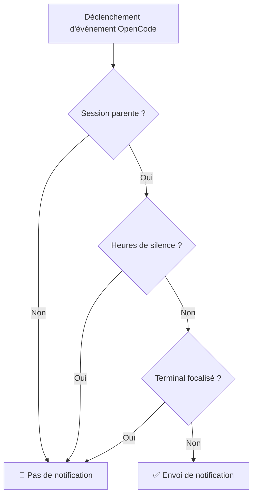

# Heures de Silence Expliquées : Évitez les interruptions pendant des périodes spécifiques

## Ce que vous pourrez faire après ce tutoriel

- Activer les heures de silence dans le fichier de configuration pour éviter d'être dérangé pendant le repos
- Comprendre le fonctionnement des heures de silence et la logique de calcul horaire
- Configurer des plages horaires traversant minuit (comme 22:00 - 08:00)
- Comprendre la relation de priorité entre les heures de silence et les autres mécanismes de filtrage intelligents

## Votre situation actuelle

Vous avez peut-être déjà vécu cette situation : vous avez confié une tâche à l'IA à 22h, puis vous êtes allé vous reposer. Résultat, à 2h du matin, l'IA a terminé la tâche et la notification "ding" vous a réveillé. Ou bien, pendant votre pause déjeuner, vous avez demandé à l'IA de traiter des fichiers, et à 12h05, la notification a sonné, interrompant votre repos.

::: info Qu'est-ce que les Heures de Silence
Les heures de silence sont une configuration de plage horaire pendant laquelle opencode-notify arrête d'envoyer toutes les notifications, évitant ainsi de recevoir des alertes aux moments où vous ne souhaitez pas être dérangé.
:::

## Quand utiliser cette fonctionnalité

- **Repos nocturne** : Configurez 22:00 - 08:00 pour éviter d'être dérangé pendant le sommeil
- **Pause déjeuner** : Configurez 12:00 - 13:00 pour éviter d'être dérangé pendant la pause de midi
- **Temps de travail concentré** : Configurez 09:00 - 12:00 pour éviter d'être interrompu par des notifications pendant les réunions
- **Week-end sans travail** : Configurez tout le week-end comme période de silence

Les heures de silence sont idéales pour protéger votre temps de repos ou de travail concentré, permettant à l'IA de terminer les tâches en arrière-plan pendant que vous vérifiez les résultats quand vous êtes prêt.

## Concept de base

Le fonctionnement des heures de silence est simple :

1. **Vérification horaire** : Avant chaque envoi de notification, le plugin vérifie si l'heure actuelle se trouve dans la plage de silence configurée
2. **Support des plages horaires** : Supporte toutes les plages horaires, y compris celles qui traversent minuit (comme 22:00 - 08:00)
3. **Priorité moyenne** : La vérification des heures de silence a une priorité inférieure à celle de la vérification de session parente, mais supérieure à la détection du focus du terminal. Si la session actuelle est une session enfant et que `notifyChildSessions` est défini sur false, la vérification des heures de silence est directement ignorée.

::: tip Heures de Silence vs Désactivation Temporaire
Les heures de silence sont une configuration horaire **régulière et répétitive**, comme tous les soirs de 22h à 8h du matin. Si vous souhaitez **désactiver temporairement** les notifications (par exemple, pour la prochaine heure), vous pouvez définir `"enabled": false` dans le fichier de configuration, ou supprimer le fichier de configuration pour revenir aux valeurs par défaut.
:::

## Suivez-moi

### Étape 1 : Ouvrir le fichier de configuration

Le fichier de configuration se trouve à : `~/.config/opencode/kdco-notify.json`

Si le fichier n'existe pas, vous pouvez le créer :

::: code-group

```bash [macOS/Linux]
vim ~/.config/opencode/kdco-notify.json
```

```powershell [Windows]
notepad $env:USERPROFILE\.config\opencode\kdco-notify.json
```

:::

Vous devriez voir le contenu du fichier de configuration (s'il existe), ou un fichier vide.

### Étape 2 : Ajouter la configuration des heures de silence

Ajoutez ou modifiez la section `quietHours` dans le fichier de configuration :

```json
{
  "quietHours": {
    "enabled": true,
    "start": "22:00",
    "end": "08:00"
  }
}
```

**Description des options de configuration** :

| Option | Type | Valeur par défaut | Description |
| --- | --- | --- | --- |
| `enabled` | boolean | `false` | Active ou désactive les heures de silence |
| `start` | string | `"22:00"` | Heure de début du silence, format `"HH:MM"` |
| `end` | string | `"08:00"` | Heure de fin du silence, format `"HH:MM"` |

### Étape 3 : Sauvegarder le fichier de configuration

Sauvegardez le fichier et quittez l'éditeur.

**Point de contrôle ✅** : Exécutez la commande suivante pour vérifier que le format du fichier de configuration est correct :

```bash
cat ~/.config/opencode/kdco-notify.json | jq .
```

Vous devriez voir le contenu JSON formaté sans message d'erreur.

::: tip jq n'est pas installé ?
Si la commande `jq` n'est pas disponible sur votre système, vous pouvez ignorer cette vérification, ou copier le contenu JSON dans un [validateur JSON](https://jsonlint.com/) dans votre navigateur.
:::

### Étape 4 : Redémarrer OpenCode

Après modification du fichier de configuration, vous devez redémarrer OpenCode pour que les changements prennent effet.

**Point de contrôle ✅** : Après le redémarrage, OpenCode rechargera automatiquement la configuration.

### Étape 5 : Tester les heures de silence

Pour vérifier que les heures de silence fonctionnent, vous pouvez :

1. Définir `start` et `end` sur des valeurs proches de l'heure actuelle (par exemple, s'il est 14:00, configurez 13:55 - 14:05)
2. Confier une tâche simple à l'IA
3. Attendre la fin de la tâche

Vous devriez constater que : **pendant les heures de silence, aucune notification n'est reçue**.

**Remarque** : Si l'heure actuelle n'est pas dans la plage de silence, ou si `enabled` est défini sur `false`, vous recevrez normalement les notifications.

### Étape 6 : Revenir à la configuration habituelle

Après les tests, remettez la configuration à vos plages horaires habituelles (par exemple 22:00 - 08:00) :

```json
{
  "quietHours": {
    "enabled": true,
    "start": "22:00",
    "end": "08:00"
  }
}
```

Sauvegardez le fichier de configuration et redémarrez OpenCode.

## Pièges à éviter

### Erreur courante 1 : Oublier d'activer les heures de silence

**Problème** : Vous avez configuré `start` et `end`, mais vous recevez toujours des notifications.

**Cause** : Le champ `enabled` est défini sur `false` ou n'est pas défini.

**Solution** : Assurez-vous que `enabled` est défini sur `true` :

```json
{
  "quietHours": {
    "enabled": true,
    "start": "22:00",
    "end": "08:00"
  }
}
```

### Erreur courante 2 : Format horaire incorrect

**Problème** : La configuration ne fonctionne pas, ou une erreur se produit au démarrage.

**Cause** : Le format horaire n'est pas `"HH:MM"`, ou vous utilisez le format 12 heures (AM/PM).

**Exemple incorrect** :
```json
{
  "start": "10 PM",  // ❌ Erreur : le format AM/PM n'est pas supporté
  "end": "8:00"      // ⚠️ Fonctionne, mais il est recommandé d'utiliser "08:00" pour la cohérence
}
```

**Exemple correct** :
```json
{
  "start": "22:00",  // ✅ Correct : format 24 heures, zéro initial recommandé
  "end": "08:00"     // ✅ Correct : format 24 heures, zéro initial recommandé
}
```

### Erreur courante 3 : Mauvaise compréhension des plages traversant minuit

**Problème** : Vous avez configuré 22:00 - 08:00, mais vous constatez que certaines périodes de la journée sont aussi en mode silence.

**Cause** : Vous pensez à tort que `start` doit être inférieur à `end`, ce qui entraîne une erreur de calcul de la plage horaire.

**Compréhension correcte** :
- 22:00 - 08:00 signifie : **de 22h à 8h du matin suivant**
- C'est une plage horaire traversant minuit, le plugin la reconnaît automatiquement
- Ce n'est pas 08:00 - 22:00 (avec cette configuration, toute la journée serait en mode silence)

::: tip Vérification des plages traversant minuit
Si vous souhaitez vérifier qu'une plage traversant minuit est correctement configurée, vous pouvez définir une courte période de test dans le fichier de configuration (par exemple 10 minutes), puis observer si vous ne recevez pas de notifications pendant la période attendue.
:::

### Erreur courante 4 : Ne pas redémarrer OpenCode

**Problème** : Après modification du fichier de configuration, les heures de silence fonctionnent toujours selon l'ancienne configuration.

**Cause** : Le fichier de configuration est chargé une seule fois au démarrage du plugin, il n'y a pas de surveillance en temps réel des changements de fichier.

**Solution** : Après chaque modification du fichier de configuration, vous devez redémarrer OpenCode pour que les changements prennent effet.

## Relation entre les heures de silence et les autres mécanismes de filtrage

Position des heures de silence dans le mécanisme de filtrage intelligent :



**Points clés** :

1. **Priorité moyenne des heures de silence** : La vérification de session parente a la priorité la plus élevée, suivie des heures de silence. Si la session actuelle est une session enfant et que `notifyChildSessions` est défini sur false, la vérification des heures de silence est directement ignorée. Mais une fois la vérification de session parente passée (c'est-à-dire que c'est une session parente ou que `notifyChildSessions` est true), la vérification des heures de silence continue, et quelle que soit la focalisation du terminal, aucune notification n'est envoyée pendant les heures de silence.
2. **Indépendant de la détection du focus du terminal** : Même si le terminal n'est pas focalisé, aucune notification n'est envoyée pendant les heures de silence
3. **Ordre d'exécution** : La vérification de session parente précède les heures de silence. Si la vérification de session parente réussit (c'est-à-dire que c'est une session parente ou que `notifyChildSessions` est true), la vérification des heures de silence continue.

::: warning Cas particulier : demandes d'autorisation et questions
Les demandes d'autorisation (`permission.updated`) et les questions (`tool.execute.before`) sont **aussi soumises aux contraintes des heures de silence** dans le code source. Cela signifie que pendant les heures de silence, même si l'IA est bloquée en attendant votre autorisation ou votre réponse, aucune notification ne sera envoyée.
:::

## Exemples de configuration courants

### Exemple 1 : Repos nocturne

Configurez la période de 22h à 8h du matin comme heures de silence :

```json
{
  "quietHours": {
    "enabled": true,
    "start": "22:00",
    "end": "08:00"
  }
}
```

### Exemple 2 : Pause déjeuner

Configurez la période de midi à 13h comme heures de silence :

```json
{
  "quietHours": {
    "enabled": true,
    "start": "12:00",
    "end": "13:00"
  }
}
```

### Exemple 3 : Temps de travail concentré

Configurez la période de 9h à midi comme heures de silence (par exemple pour ne pas être dérangé par des notifications pendant les réunions) :

```json
{
  "quietHours": {
    "enabled": true,
    "start": "09:00",
    "end": "12:00"
  }
}
```

### Exemple 4 : Configuration complète

Utilisez les heures de silence avec d'autres options de configuration :

```json
{
  "enabled": true,
  "notifyChildSessions": false,
  "suppressWhenFocused": true,
  "sounds": {
    "idle": "Glass",
    "error": "Basso",
    "permission": "Submarine"
  },
  "quietHours": {
    "enabled": true,
    "start": "22:00",
    "end": "08:00"
  },
  "terminal": "ghostty"
}
```

## Résumé de ce tutoriel

Les heures de silence sont une fonctionnalité importante d'opencode-notify, utilisée pour éviter d'être dérangé pendant des périodes spécifiques :

1. **Méthode de configuration** : Configurez la section `quietHours` dans `~/.config/opencode/kdco-notify.json`
2. **Format horaire** : Utilisez le format `"HH:MM"` en 24 heures, comme `"22:00"` et `"08:00"`
3. **Support des plages traversant minuit** : Supporte les plages horaires traversant minuit, comme `"22:00" - "08:00"` qui signifie de 22h à 8h du matin suivant
4. **Ordre d'exécution** : Vérification de session parente → Heures de silence → Détection du focus du terminal. Les heures de silence ne prennent effet qu'après le passage de la vérification de session parente
5. **Nécessité de redémarrer** : Après modification du fichier de configuration, vous devez redémarrer OpenCode pour que les changements prennent effet

En configurant judicieusement les heures de silence, vous pouvez laisser l'IA terminer les tâches en arrière-plan pendant votre repos ou votre travail concentré, et vérifier les résultats quand vous êtes prêt.

## Aperçu du prochain tutoriel

> Dans le prochain tutoriel, nous apprendrons **[le principe de détection du terminal](../terminal-detection/)**.
>
> Vous apprendrez :
> - Comment opencode-notify détecte automatiquement le terminal que vous utilisez
> - La liste des 37+ émulateurs de terminal supportés
> - La méthode pour spécifier manuellement le type de terminal
> - Le principe de mise en œuvre de la détection du focus sur macOS

---

## Annexe : Référence du code source

<details>
<summary><strong>Cliquez pour voir l'emplacement du code source</strong></summary>

> Dernière mise à jour : 2026-01-27

| Fonctionnalité | Chemin du fichier | Numéros de ligne |
| --- | --- | --- |
| Vérification des heures de silence | [`src/notify.ts`](https://github.com/kdcokenny/opencode-notify/blob/main/src/notify.ts#L181-L199) | 181-199 |
| Définition de l'interface de configuration | [`src/notify.ts`](https://github.com/kdcokenny/opencode-notify/blob/main/src/notify.ts#L30-L48) | 30-48 |
| Configuration par défaut | [`src/notify.ts`](https://github.com/kdcokenny/opencode-notify/blob/main/src/notify.ts#L56-L68) | 56-68 |
| Vérification du silence dans le traitement de fin de tâche | [`src/notify.ts`](https://github.com/kdcokenny/opencode-notify/blob/main/src/notify.ts#L262) | 262 |
| Vérification du silence dans le traitement des notifications d'erreur | [`src/notify.ts`](https://github.com/kdcokenny/opencode-notify/blob/main/src/notify.ts#L300) | 300 |
| Vérification du silence dans le traitement des demandes d'autorisation | [`src/notify.ts`](https://github.com/kdcokenny/opencode-notify/blob/main/src/notify.ts#L323) | 323 |
| Vérification du silence dans le traitement des questions | [`src/notify.ts`](https://github.com/kdcokenny/opencode-notify/blob/main/src/notify.ts#L341) | 341 |

**Constantes clés** :

- `DEFAULT_CONFIG.quietHours` : Configuration par défaut des heures de silence (lignes 63-67)
  - `enabled: false` : Les heures de silence sont désactivées par défaut
  - `start: "22:00"` : Heure de début par défaut du silence
  - `end: "08:00"` : Heure de fin par défaut du silence

**Fonctions clés** :

- `isQuietHours(config: NotifyConfig): boolean` : Vérifie si l'heure actuelle est dans la plage de silence (lignes 181-199)
  - Vérifie d'abord si `config.quietHours.enabled` est `true`
  - Convertit l'heure actuelle en minutes
  - Convertit les heures de début et de fin en minutes
  - Traite les plages horaires traversant minuit (`startMinutes > endMinutes`)
  - Retourne `true` si dans la plage de silence, `false` sinon

**Règles métier** :

- BR-1-3 : Aucune notification n'est envoyée pendant les heures de silence (`notify.ts:262`)
- BR-3-2 : Les heures de silence supportent les plages traversant minuit (comme 22:00-08:00) (`notify.ts:193-196`)
- BR-4-1 : Aucune notification n'est envoyée si l'heure actuelle est dans la plage de silence (`notify.ts:182-198`)
- BR-4-2 : Support des plages traversant minuit (comme 22:00-08:00) (`notify.ts:194-196`)

</details>
