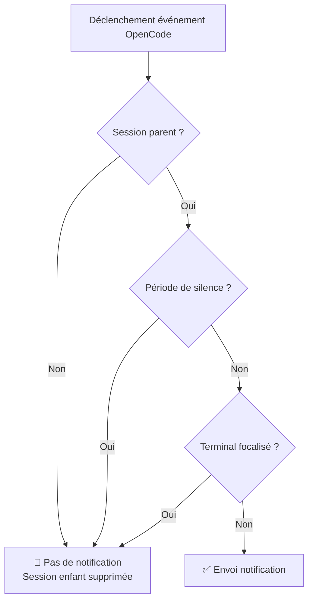
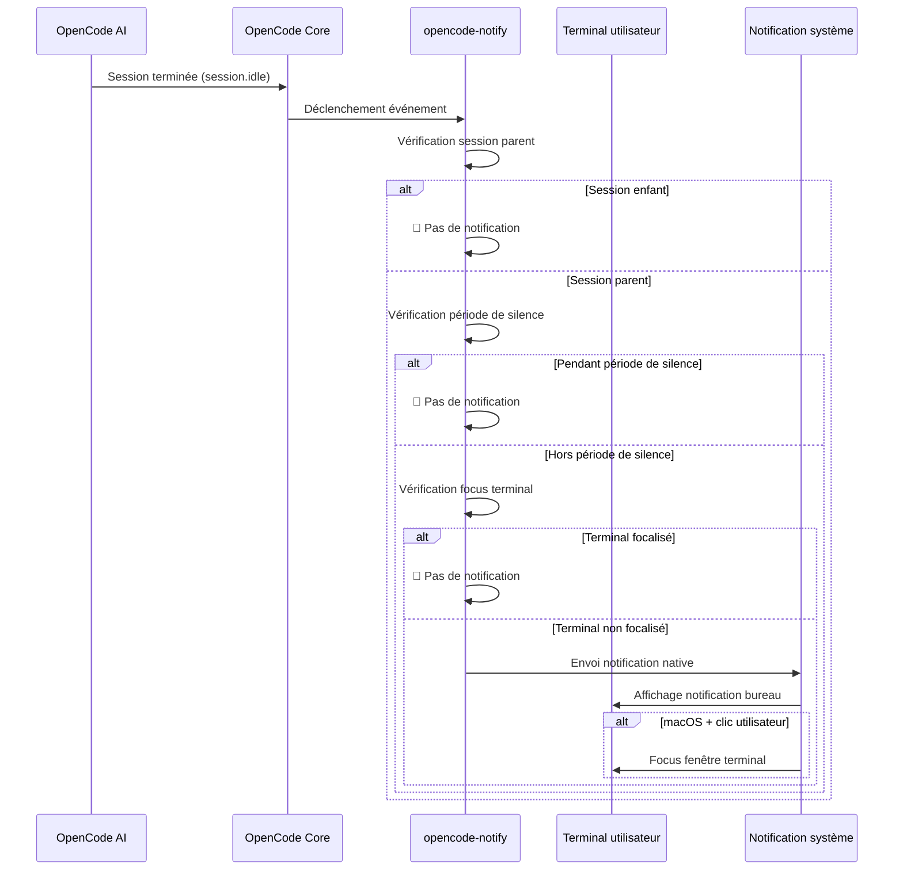

# Principe de fonctionnement : notifications, filtrage et mécanismes de déclenchement

## Ce que vous apprendrez

- Comprendre les quatre types de notifications d'opencode-notify et leurs moments de déclenchement
- Maîtriser le fonctionnement du mécanisme de filtrage intelligent (pourquoi vous ne recevez pas trop de notifications)
- Connaître le flux complet des notifications, du déclenchement à l'affichage
- Savoir comment ajuster le comportement des notifications via la configuration

## Concept fondamental

::: tip Philosophie de conception
opencode-notify suit un principe fondamental : **"Notifier l'utilisateur seulement quand c'est nécessaire, pas pour chaque petit événement"**.
:::

Le fonctionnement de ce plugin peut être décomposé en trois étapes clés :

1. **Écoute** - Attendre qu'un événement important se produise dans OpenCode
2. **Filtrage** - Décider si cet événement nécessite une notification
3. **Envoi** - Vous alerter via la notification native du système d'exploitation

Comprendre ce flux vous permet de savoir pourquoi le plugin peut vous informer en temps utile sans devenir une source de distraction constante.

## Les quatre types de notifications

opencode-notify écoute quatre types d'événements OpenCode, chacun ayant un scénario de déclenchement clair :

### 1. Notification de tâche terminée (session.idle)

**Moment de déclenchement** : Lorsque la session IA passe à l'état inactif (tâche terminée)

| Élément | Description |
| --- | --- |
| Titre de notification | Ready for review |
| Contenu de notification | Titre de la session (max. 50 caractères) |
| Son par défaut | Glass (macOS) |

**Pourquoi c'est important** : C'est la notification la plus courante, vous informant que l'IA a terminé sa tâche et que vous pouvez venir vérifier les résultats.

### 2. Notification d'erreur (session.error)

**Moment de déclenchement** : Lorsqu'une erreur se produit pendant l'exécution de la session IA

| Élément | Description |
| --- | --- |
| Titre de notification | Something went wrong |
| Contenu de notification | Résumé de l'erreur (max. 100 caractères) |
| Son par défaut | Basso (macOS) |

**Pourquoi c'est important** : Les erreurs nécessitent une intervention rapide, sinon les opérations suivantes risquent de ne pas fonctionner correctement.

### 3. Notification de demande d'autorisation (permission.updated)

**Moment de déclenchement** : Lorsque l'IA a besoin de votre autorisation pour effectuer une action (lecture de fichier, accès réseau, etc.)

| Élément | Description |
| --- | --- |
| Titre de notification | Waiting for you |
| Contenu de notification | OpenCode needs your input |
| Son par défaut | Submarine (macOS) |

**Pourquoi c'est important** : L'IA est bloquée et attend votre autorisation manuelle pour continuer. Sans traitement, la tâche restera bloquée.

### 4. Notification de question (tool.execute.before)

**Moment de déclenchement** : Lorsque l'IA utilise l'outil `question` pour vous poser une question

| Élément | Description |
| --- | --- |
| Titre de notification | Question for you |
| Contenu de notification | OpenCode needs your input |
| Son par défaut | Submarine (macOS) |

**Pourquoi c'est important** : L'IA a besoin de plus d'informations pour continuer, comme confirmer une décision ou clarifier un besoin.

::: info Priorité des quatre types de notifications
Les demandes d'autorisation et les questions ont la priorité la plus élevée, car l'IA est complètement bloquée dans ces situations ; les notifications d'erreur viennent ensuite, car la tâche a échoué ; les notifications de tâche terminée ont une priorité relativement plus faible, car vous pouvez vérifier quand cela vous convient.
:::

## Mécanisme de filtrage intelligent

C'est le point fort d'opencode-notify — grâce à un filtrage multi-couches, vous ne recevez que les notifications vraiment importantes.

### Vue d'ensemble des niveaux de filtrage



### Niveau 1 : Vérification de session parent

**Règle** : Par défaut, seules les sessions parent (sessions racine) sont notifiées, pas les sessions enfants.

**Principe** : Les tâches OpenCode peuvent être imbriquées. Par exemple, si vous demandez à l'IA d'"optimiser la base de code", elle peut se diviser en plusieurs sous-tâches :
- Session parent : "Optimiser toute la base de code"
- Session enfant 1 : "Optimiser le répertoire src/components"
- Session enfant 2 : "Optimiser le répertoire src/utils"

Si toutes les sessions enfants notifiaient, vous recevriez un flot de notifications. opencode-notify ne notifie qu'une seule fois, quand la session parent est terminée.

::: tip Quand activer les notifications de sessions enfants ?
Si vous surveillez plusieurs tâches simultanées d'un seul agent IA, vous pouvez activer les notifications de sessions enfants en configurant `notifyChildSessions: true` dans la configuration.
:::

**Exceptions spéciales** :
- **Notifications de demande d'autorisation** : Toujours notifiées, sans vérification de session parent (car les problèmes d'autorisation doivent être traités)
- **Notifications de question** : Toujours notifiées, sans vérification de session parent

### Niveau 2 : Vérification de période de silence

**Règle** : Pendant les périodes de silence configurées, aucune notification n'est envoyée.

**Principe** : Éviter d'être dérangé la nuit ou pendant les heures de repos. Exemple de configuration :

```json
{
  "quietHours": {
    "enabled": true,
    "start": "22:00",
    "end": "08:00"
  }
}
```

**Support du passage à minuit** : Les périodes de silence peuvent traverser minuit, par exemple `22:00 - 08:00` sera correctement interprété comme de 22h à 8h du matin suivant.

::: info Priorité de la vérification de période de silence
La période de silence a priorité sur toutes les autres vérifications. Même si le terminal n'est pas focalisé ou s'il s'agit d'une session parent, la notification sera supprimée pendant la période de silence.
:::

### Niveau 3 : Détection du focus terminal

**Règle** : Quand la fenêtre du terminal est la fenêtre active, aucune notification n'est envoyée.

**Principe** : Lorsque vous regardez le terminal, la tâche terminée par l'IA s'affiche directement à l'écran, sans notification supplémentaire nécessaire.

**Support par plateforme** :
- ✅ **macOS** : Support complet, détection de l'application au premier plan via `osascript`
- ❌ **Windows** : Non supporté
- ❌ **Linux** : Non supporté

**Mécanisme de détection** (macOS) :
1. Utilise la bibliothèque `detect-terminal` pour identifier votre terminal (supporte 37+ émulateurs de terminal)
2. Interroge macOS pour obtenir l'application au premier plan
3. Compare avec le nom du processus de votre terminal
4. Si correspondance, la notification est supprimée

**Exceptions spéciales** :
- **Notifications de question** : Pas de vérification de focus (supporte le workflow tmux)

::: tip Support du workflow tmux
Si vous utilisez plusieurs panneaux tmux, les notifications de question ne seront pas supprimées par la détection de focus, vous assurant de recevoir les rappels même lorsque vous travaillez dans d'autres panneaux.
:::

### Fonction spéciale macOS : Focus du terminal au clic sur notification

Sur macOS, les notifications ont une fonction supplémentaire : **cliquer sur une notification met automatiquement la fenêtre du terminal au premier plan**.

**Principe** :
1. Le plugin obtient le Bundle ID de votre terminal via `osascript` (ex: `com.ghostty.Ghostty`)
2. Lors de l'envoi de la notification, l'option `activate` est définie sur ce Bundle ID
3. Au clic sur la notification, le système focalise automatiquement l'application correspondante

**Terminaux supportés** : Ghostty, Kitty, iTerm2, WezTerm, Alacritty, macOS Terminal, Hyper, Warp, terminal intégré VS Code, etc.

::: info Détection automatique du terminal
Le plugin détecte automatiquement le terminal que vous utilisez, aucune configuration manuelle requise. Si la détection automatique échoue, vous pouvez spécifier manuellement le champ `terminal` dans le fichier de configuration.
:::

## Flux de déclenchement des notifications

### Diagramme complet du flux



### Priorité de traitement des événements

Lorsque plusieurs événements se déclenchent simultanément, le plugin traite selon la priorité suivante :

1. **Priorité maximale** : Demande d'autorisation (`permission.updated`) - L'IA est bloquée, doit être traitée
2. **Priorité élevée** : Notification d'erreur (`session.error`) - Tâche échouée, nécessite attention
3. **Priorité faible** : Tâche terminée (`session.idle`) - Peut être vérifiée plus tard
4. **Spécial** : Question (`tool.execute.before`) - Priorité déterminée selon les besoins réels

::: tip Traitement des notifications par lots
Si plusieurs tâches se terminent simultanément, le plugin n'envoie pas de notifications multiples, mais une seule (basée sur la vérification de session parent). Cela évite le bombardement de notifications.
:::

## Impact de la configuration

Via le fichier de configuration, vous pouvez ajuster chaque niveau du mécanisme de filtrage :

| Option de configuration | Niveau impacté | Valeur par défaut | Description |
| --- | --- | --- | ---|
| `notifyChildSessions` | Vérification session parent | `false` | Définir sur `true` pour activer les notifications de sessions enfants |
| `quietHours.enabled` | Vérification période de silence | `false` | Définir sur `true` pour activer la période de silence |
| `quietHours.start` | Vérification période de silence | `"22:00"` | Heure de début du silence |
| `quietHours.end` | Vérification période de silence | `"08:00"` | Heure de fin du silence |
| `terminal` | Détection terminal | Non défini | Spécifier manuellement le type de terminal (remplace la détection automatique) |

::: details Exemple de configuration

```json
{
  "enabled": true,
  "notifyChildSessions": false,
  "sounds": {
    "idle": "Glass",
    "error": "Basso",
    "permission": "Submarine"
  },
  "quietHours": {
    "enabled": true,
    "start": "22:00",
    "end": "08:00"
  },
  "terminal": "ghostty"
}
```

:::

## Résumé de la leçon

Le fonctionnement d'opencode-notify peut être résumé comme suit :

1. **Quatre types de notifications** : Tâche terminée, erreur, demande d'autorisation, question
2. **Trois couches de filtrage intelligent** : Vérification session parent → Vérification période de silence → Vérification focus terminal
3. **Différences de plateforme** : macOS supporte la détection de focus et le clic pour focaliser, Windows/Linux ne supporte que les notifications de base
4. **Configuration flexible** : Ajustement des niveaux de filtrage et comportements via fichier JSON

Cette conception assure à la fois la rapidité des notifications et une faible perturbation — vous êtes alerté uniquement quand c'est vraiment nécessaire, sans devenir un autre centre de notifications à consulter fréquemment.

## Aperçu de la prochaine leçon

> Dans la prochaine leçon, nous apprendrons les **[fonctionnalités spécifiques à macOS](../../platforms/macos/)**.
>
> Vous apprendrez :
> - Le mécanisme de détection de focus unique à macOS
> - Comment configurer la fonction de focus au clic sur notification
> - La liste complète des sons personnalisables
> - Les détails de l'intégration avec le système natif macOS

---

## Annexe : Référence du code source

<details>
<summary><strong>Cliquez pour voir l'emplacement du code source</strong></summary>

> Dernière mise à jour : 2026-01-27

| Fonctionnalité | Chemin du fichier | Lignes |
| --- | --- | ---|
| Point d'entrée principal du plugin | [`src/notify.ts`](https://github.com/kdcokenny/opencode-notify/blob/main/src/notify.ts#L357-L406) | 357-406 |
| Chargement de la configuration | [`src/notify.ts`](https://github.com/kdcokenny/opencode-notify/blob/main/src/notify.ts#L90-L114) | 90-114 |
| Configuration par défaut | [`src/notify.ts`](https://github.com/kdcokenny/opencode-notify/blob/main/src/notify.ts#L56-L68) | 56-68 |
| Détection du terminal | [`src/notify.ts`](https://github.com/kdcokenny/opencode-notify/blob/main/src/notify.ts#L145-L164) | 145-164 |
| Détection du focus terminal | [`src/notify.ts`](https://github.com/kdcokenny/opencode-notify/blob/main/src/notify.ts#L166-L175) | 166-175 |
| Vérification de la période de silence | [`src/notify.ts`](https://github.com/kdcokenny/opencode-notify/blob/main/src/notify.ts#L181-L199) | 181-199 |
| Détection de la session parent | [`src/notify.ts`](https://github.com/kdcokenny/opencode-notify/blob/main/src/notify.ts#L205-L214) | 205-214 |
| Traitement de la tâche terminée | [`src/notify.ts`](https://github.com/kdcokenny/opencode-notify/blob/main/src/notify.ts#L249-L284) | 249-284 |
| Traitement de la notification d'erreur | [`src/notify.ts`](https://github.com/kdcokenny/opencode-notify/blob/main/src/notify.ts#L286-L313) | 286-313 |
| Traitement de la demande d'autorisation | [`src/notify.ts`](https://github.com/kdcokenny/opencode-notify/blob/main/src/notify.ts#L315-L334) | 315-334 |
| Traitement de la question | [`src/notify.ts`](https://github.com/kdcokenny/opencode-notify/blob/main/src/notify.ts#L336-L351) | 336-351 |
| Envoi de la notification | [`src/notify.ts`](https://github.com/kdcokenny/opencode-notify/blob/main/src/notify.ts#L227-L243) | 227-243 |
| Détection de l'application au premier plan macOS | [`src/notify.ts`](https://github.com/kdcokenny/opencode-notify/blob/main/src/notify.ts#L139-L143) | 139-143 |
| Obtention du Bundle ID | [`src/notify.ts`](https://github.com/kdcokenny/opencode-notify/blob/main/src/notify.ts#L135-L137) | 135-137 |
| Mapping des noms de processus terminal | [`src/notify.ts`](https://github.com/kdcokenny/opencode-notify/blob/main/src/notify.ts#L71-L84) | 71-84 |

**Constantes clés** :

- `DEFAULT_CONFIG` : Configuration par défaut (lignes 56-68)
  - `notifyChildSessions: false` : Par défaut, pas de notification des sessions enfants
  - `sounds.idle: "Glass"` : Son de tâche terminée
  - `sounds.error: "Basso"` : Son d'erreur
  - `sounds.permission: "Submarine"` : Son de demande d'autorisation
  - `quietHours.start: "22:00"`, `quietHours.end: "08:00"` : Période de silence par défaut

- `TERMINAL_PROCESS_NAMES` : Mapping des noms de terminal vers les noms de processus macOS (lignes 71-84)

**Fonctions clés** :

- `loadConfig()` : Charge et fusionne la configuration fichier avec la configuration par défaut
- `detectTerminalInfo()` : Détecte les informations du terminal (nom, Bundle ID, nom de processus)
- `isTerminalFocused()` : Vérifie si le terminal est l'application au premier plan (macOS)
- `isQuietHours()` : Vérifie si l'heure actuelle est dans la période de silence
- `isParentSession()` : Vérifie si la session est une session parent
- `sendNotification()` : Envoie une notification native, supporte le focus au clic sur macOS
- `handleSessionIdle()` : Traite l'événement de tâche terminée
- `handleSessionError()` : Traite l'événement d'erreur
- `handlePermissionUpdated()` : Traite l'événement de demande d'autorisation
- `handleQuestionAsked()` : Traite l'événement de question

**Règles métier** :

- BR-1-1 : Par défaut, notification uniquement de la session parent, pas des sessions enfants (`notify.ts:256-259`)
- BR-1-2 : Suppression de la notification quand le terminal est focalisé (`notify.ts:265`)
- BR-1-3 : Pas de notification pendant la période de silence (`notify.ts:262`)
- BR-1-4 : Les demandes d'autorisation sont toujours notifiées, sans vérification de session parent (`notify.ts:319`)
- BR-1-5 : Les questions ne font pas l'objet de vérification de focus, supporte le workflow tmux (`notify.ts:340`)
- BR-1-6 : macOS supporte le focus du terminal au clic sur la notification (`notify.ts:238-240`)

</details>
