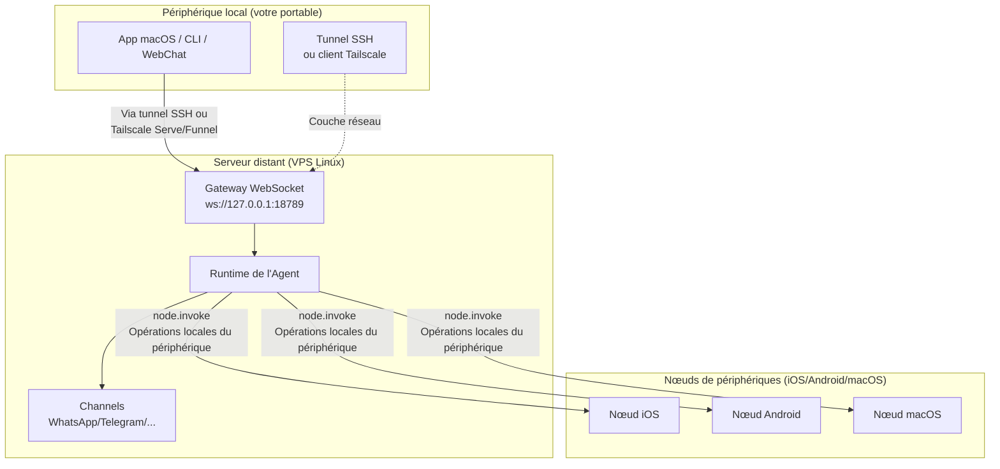

# Gateway distant : Accéder à Clawdbot via Tailscale et des tunnels SSH | Tutoriel Clawdbot

## Ce que vous pourrez faire après ce cours

Le **Gateway distant** vous permet de vous affranchir des limitations de périphérique en déployant votre assistant IA sur un serveur Linux toujours en ligne. Après avoir terminé ce cours, vous serez capable de :

- ✅ Exécuter le Gateway Clawdbot sur un serveur Linux ou un VPS
- ✅ Exposer de manière sécurisée le Gateway au réseau via Tailscale Serve/Funnel
- ✅ Utiliser des tunnels SSH pour vous connecter au Gateway distant depuis votre client
- ✅ Comprendre les différences d'architecture entre Gateway et Nœud (où exec s'exécute, où les opérations de périphérique s'exécutent)
- ✅ Configurer des stratégies d'accès distant sécurisées

## Votre problème actuel

Vous rencontrez peut-être ces problèmes :

- 🤔 "Mon portable se met souvent en veille, mais je veux que l'assistant IA reste toujours en ligne"
- 🤔 "Je veux exécuter le Gateway sur un VPS bon marché, mais je ne sais pas comment y accéder de manière sécurisée"
- 🤔 "Quelle est la différence entre Tailscale Serve et Funnel ? Lequel dois-je utiliser ?"
- 🤔 "Les tunnels SSH sont trop compliqués, y a-t-il une solution plus automatisée ?"

## Quand utiliser cette méthode

Le **Gateway distant** convient aux scénarios suivants :

| Scénario | Solution recommandée | Raison |
|--- | --- | ---|
| Le portable se met souvent en veille, nécessite un IA toujours disponible | **Tailscale Serve + VPS Linux** | Le VPS ne se met pas en veille, accès sécurisé via tailnet |
| Le Gateway s'exécute sur un ordinateur de bureau à domicile, contrôle à distance depuis un portable | **Tunnel SSH** ou **Tailscale Serve** | Sessions et configuration Gateway unifiées |
| Accès depuis l'internet public (test temporaire) | **Tailscale Funnel + Mot de passe** | Exposition rapide, mais nécessite une protection par mot de passe |
| Plusieurs périphériques partagent un assistant IA | **Gateway Always-on** | Gestion centralisée de toutes les sessions, configurations et historiques |

::: warning Scénarios non recommandés
Si vous n'avez qu'un seul périphérique et que vous le transportez souvent, vous **n'avez pas besoin** d'un Gateway distant. Exécutez simplement le Gateway localement.
:::

## 🎒 Préparation avant de commencer

Avant de commencer, assurez-vous de :

- [ ] Avoir terminé le cours **[Démarrer le Gateway](/fr/moltbot/moltbot/start/gateway-startup/)**
- [ ] Connaître les commandes SSH de base (optionnel, si vous utilisez des tunnels SSH)
- [ ] (Si vous utilisez Tailscale) Avoir installé le CLI Tailscale et s'être connecté
- [ ] Avoir préparé un serveur Linux distant ou un VPS (recommandé Ubuntu/Debian)

---

## Concept de base

### Architecture du Gateway distant

Le concept fondamental du Gateway distant est : **Le Gateway est le centre de contrôle, le client est le terminal**.



### Trois concepts clés

| Concept | Explication | Exemple |
|--- | --- | ---|
| **Hôte Gateway** | La machine exécutant le service Gateway, possède les sessions, l'authentification, les canaux et l'état | VPS Linux, ordinateur de bureau à domicile |
| **Client** | Outil connecté au Gateway (App macOS, CLI, WebChat) | Votre portable, votre téléphone |
| **Nœud de périphérique** | Périphérique externe connecté via le WebSocket Gateway, exécute des opérations locales du périphérique | Périphérique iOS, périphérique Android, mode nœud macOS |

### Où les commandes sont-elles exécutées ?

C'est le point de confusion le plus courant :

| Type d'opération | Où elle est exécutée | Raison |
|--- | --- | ---|
| Outil `exec` | **Hôte Gateway** | Les commandes Shell s'exécutent sur la machine Gateway |
| Outil `browser` | **Hôte Gateway** (ou serveur de contrôle de navigateur séparé) | Le navigateur se lance sur la machine Gateway |
| Opérations de nœud (`camera.snap`, `system.run`) | **Nœud de périphérique** | Nécessite l'accès aux ressources locales du périphérique |

**Pour retenir en une phrase** :
- Hôte Gateway → Exécute les commandes générales et exécute l'IA
- Nœud de périphérique → Exécute les opérations locales spécifiques au périphérique

---

## Suivez les étapes

### Étape 1 : Installer Clawdbot sur le serveur distant

**Pourquoi**
Les serveurs Linux sont mieux adaptés pour exécuter des services Gateway en ligne sur le long terme.

Exécutez sur le serveur distant :

```bash
# 1. Installer Node.js (≥22)
curl -fsSL https://deb.nodesource.com/setup_22.x | sudo -E bash -
sudo apt-get install -y nodejs

# 2. Installer Clawdbot
npm install -g @clawdbot/cli

# 3. Vérifier l'installation
clawdbot --version
```

**Ce que vous devriez voir** :
```
clawdbot CLI v<version>
```

### Étape 2 : Exécuter l'assistant d'intégration

**Pourquoi**
Configurer rapidement les paramètres de base via un assistant interactif.

```bash
clawdbot onboard
```

Suivez l'assistant pour :
- Choisir les canaux (par exemple Telegram)
- Configurer le modèle IA (par exemple OpenAI, Anthropic)
- Configurer l'authentification Gateway (Token ou Password)

::: tip Recommandation
Configurez `gateway.auth.mode: "password"` pour faciliter l'authentification par mot de passe lors de la connexion à distance :
```bash
export CLAWDBOT_GATEWAY_PASSWORD="your-secure-password"
```
:::

**Ce que vous devriez voir** :
```
✅ Gateway configured successfully
✅ Channels configured: telegram
✅ AI model configured: openai:gpt-4o-mini
```

### Étape 3 : Démarrer le démon Gateway

**Pourquoi**
Le Gateway doit s'exécuter continuellement en arrière-plan.

```bash
# Démarrer le Gateway (par défaut lié à loopback : 127.0.0.1:18789)
clawdbot gateway start
```

**Ce que vous devriez voir** :
```
🚀 Gateway starting...
📡 WebSocket: ws://127.0.0.1:18789
🔒 Auth mode: password
```

::: tip Utiliser systemd pour un démarrage automatique (Linux)
Créez le fichier de service `/etc/systemd/system/clawdbot.service` :

```ini
[Unit]
Description=Clawdbot Gateway
After=network.target

[Service]
Type=simple
User=your-user
ExecStart=/usr/bin/clawdbot gateway start
Restart=on-failure
RestartSec=5s
Environment="CLAWDBOT_GATEWAY_PASSWORD=your-secure-password"

[Install]
WantedBy=multi-user.target
```

Démarrez le service :
```bash
sudo systemctl enable clawdbot
sudo systemctl start clawdbot
sudo systemctl status clawdbot
```
:::

---

### Option A : Utiliser Tailscale Serve (recommandé)

#### Étape 4 : Installer et se connecter à Tailscale

**Pourquoi**
Tailscale Serve offre un accès HTTPS sécurisé sans adresse IP publique.

```bash
# Installer le CLI Tailscale
curl -fsSL https://tailscale.com/install.sh | sh

# Se connecter à Tailscale
sudo tailscale up
```

**Ce que vous devriez voir** :
```
To authenticate, visit:

    https://login.tailscale.com/a/xxxxx

----------------------------------------------------
Copy the URL and open it in your browser.
```

#### Étape 5 : Configurer Tailscale Serve

**Pourquoi**
Exposer le Gateway au tailnet via Tailscale Serve tout en maintenant le Gateway en loopback-only (le plus sécurisé).

Modifiez le fichier de configuration `~/.clawdbot/clawdbot.json` :

```json5
{
  "gateway": {
    "bind": "loopback",
    "tailscale": {
      "mode": "serve",
      "resetOnExit": true
    },
    "auth": {
      "mode": "password"
    }
  }
}
```

**Explication de la configuration** :
- `bind: "loopback"` : Le Gateway n'écoute que localement sur le bouclage (le plus sécurisé)
- `tailscale.mode: "serve"` : Expose au tailnet via Tailscale Serve
- `resetOnExit: true` : Annule la configuration Serve à la sortie

#### Étape 6 : Redémarrer le Gateway

**Pourquoi**
Appliquer la nouvelle configuration Tailscale.

```bash
# Si vous utilisez systemd
sudo systemctl restart clawdbot

# Ou redémarrer directement (si exécuté au premier plan)
clawdbot gateway restart
```

**Ce que vous devriez voir** :
```
🚀 Gateway starting...
📡 WebSocket: ws://127.0.0.1:18789
🌐 Tailscale Serve: https://your-tailnet-name.tailnet-name.ts.net/
🔒 Auth mode: password
```

#### Étape 7 : Se connecter depuis le client

**Pourquoi**
Vérifier que le Gateway distant est accessible.

Sur la machine cliente :

1. **Assurez-vous d'avoir rejoint le même tailnet Tailscale**
2. **Accédez à l'interface de contrôle** :
   ```
   https://<magicdns>/  # ou https://<tailnet-ip>:18789/
   ```
3. **Connectez-vous au WebSocket** :
   ```bash
   # Vérifier la connexion
   clawdbot health --url ws://<tailnet-ip>:18789 --password your-secure-password
   ```

**Ce que vous devriez voir** :
```
✅ Gateway is healthy
✅ Authenticated successfully
✅ Channels: telegram (connected)
```

---

### Option B : Utiliser un tunnel SSH (solution de repli générique)

#### Étape 4 : Configurer l'authentification par clé SSH

**Pourquoi**
L'authentification par clé SSH est plus sécurisée que le mot de passe et permet d'automatiser la connexion.

Générez une paire de clés sur la machine cliente :

```bash
# Générer une paire de clés (si vous n'en avez pas encore)
ssh-keygen -t rsa -b 4096 -f ~/.ssh/clawdbot_gateway
```

**Ce que vous devriez voir** :
```
Generating public/private rsa key pair.
Enter passphrase (empty for no passphrase): [Appuyez directement sur Entrée]
Enter same passphrase again: [Appuyez directement sur Entrée]
Your identification has been saved in ~/.ssh/clawdbot_gateway
Your public key has been saved in ~/.ssh/clawdbot_gateway.pub
```

#### Étape 5 : Copier la clé publique sur le serveur distant

**Pourquoi**
Permettre au serveur distant de faire confiance à la clé de votre client.

```bash
# Copier la clé publique sur le serveur distant
ssh-copy-id -i ~/.ssh/clawdbot_gateway.pub your-user@remote-server-ip
```

**Ce que vous devriez voir** :
```
Number of key(s) added: 1
Now try logging into the machine with:   "ssh 'your-user@remote-server-ip'"
```

#### Étape 6 : Créer la configuration SSH

**Pourquoi**
Simplifier la commande de connexion SSH pour faciliter l'utilisation ultérieure.

Modifiez `~/.ssh/config` sur la machine cliente :

```txt
Host clawdbot-remote
    HostName <remote-server-ip>
    User your-user
    IdentityFile ~/.ssh/clawdbot_gateway
    LocalForward 18789 127.0.0.1:18789
    ServerAliveInterval 60
    ServerAliveCountMax 3
```

**Explication de la configuration** :
- `LocalForward 18789 127.0.0.1:18789` : Transfère le port local 18789 vers le port distant 18789
- `ServerAliveInterval 60` : Envoie un heartbeat toutes les 60 secondes pour maintenir la connexion active

#### Étape 7 : Établir le tunnel SSH

**Pourquoi**
Créer un canal sécurisé entre le local et le Gateway distant.

```bash
# Démarrer le tunnel SSH (exécution en arrière-plan)
ssh -N -f clawdbot-remote
```

**Ce que vous devriez voir** :
(Aucune sortie, la commande s'exécute en arrière-plan)

#### Étape 8 : Vérifier la connexion

**Pourquoi**
Confirmer que le tunnel SSH et le Gateway fonctionnent tous les deux normalement.

```bash
# Vérifier que le port local est transféré avec succès
lsof -i :18789

# Tester la connexion au Gateway
clawdbot health --url ws://127.0.0.1:18789 --password your-secure-password
```

**Ce que vous devriez voir** :
```
COMMAND   PID   USER   FD   TYPE DEVICE SIZE/OFF NODE NAME
ssh      12345  user   4u  IPv4  0x1234      0t0  TCP *:18789 (LISTEN)

✅ Gateway is healthy
✅ Authenticated successfully
```

#### Étape 9 : Démarrage automatique du tunnel SSH (macOS)

**Pourquoi**
Démarrage automatique au démarrage, sans intervention manuelle.

Créez `~/Library/LaunchAgents/com.clawdbot.ssh-tunnel.plist` :

```xml
<?xml version="1.0" encoding="UTF-8"?>
<!DOCTYPE plist PUBLIC "-//Apple//DTD PLIST 1.0//EN" "http://www.apple.com/DTDs/PropertyList-1.0.dtd">
<plist version="1.0">
<dict>
    <key>Label</key>
    <string>com.clawdbot.ssh-tunnel</string>
    <key>ProgramArguments</key>
    <array>
        <string>/usr/bin/ssh</string>
        <string>-N</string>
        <string>-f</string>
        <string>clawdbot-remote</string>
    </array>
    <key>KeepAlive</key>
    <true/>
    <key>RunAtLoad</key>
    <true/>
</dict>
</plist>
```

Chargez le Launch Agent :

```bash
launchctl bootstrap gui/$UID ~/Library/LaunchAgents/com.clawdbot.ssh-tunnel.plist
```

**Ce que vous devriez voir** :
(Aucune sortie, le tunnel s'exécute automatiquement en arrière-plan)

::: tip Démarrage automatique Linux (service utilisateur systemd)
Créez `~/.config/systemd/user/clawdbot-ssh-tunnel.service` :

```ini
[Unit]
Description=Clawdbot SSH Tunnel
After=network.target

[Service]
Type=simple
ExecStart=/usr/bin/ssh -N clawdbot-remote
Restart=on-failure
RestartSec=5s

[Install]
WantedBy=default.target
```

Démarrez le service :
```bash
systemctl --user enable clawdbot-ssh-tunnel
systemctl --user start clawdbot-ssh-tunnel
```
:::

---

### Option C : Utiliser Tailscale Funnel (accès public, mot de passe requis)

::: danger Avertissement de sécurité
Tailscale Funnel expose le Gateway à l'internet public !
- **Doit** utiliser l'authentification par mot de passe (`gateway.auth.mode: "password"`)
- **Recommandé uniquement** pour les tests temporaires, non adapté à l'environnement de production
:::

#### Étape 4 : Configurer Funnel

**Pourquoi**
Fournir un accès HTTPS public via Tailscale Funnel.

Modifiez le fichier de configuration `~/.clawdbot/clawdbot.json` :

```json5
{
  "gateway": {
    "bind": "loopback",
    "tailscale": {
      "mode": "funnel",
      "resetOnExit": true
    },
    "auth": {
      "mode": "password",
      "password": "${CLAWDBOT_GATEWAY_PASSWORD}"
    }
  }
}
```

**Important** :
- `tailscale.mode: "funnel"` : Utilise Tailscale Funnel (accès public)
- `auth.mode: "password"` : Funnel exige un mot de passe (refuse de démarrer sinon)

#### Étape 5 : Redémarrer le Gateway

```bash
sudo systemctl restart clawdbot
```

**Ce que vous devriez voir** :
```
🚀 Gateway starting...
🌐 Tailscale Funnel: https://your-funnel-url.ts.net/
🔒 Auth mode: password
```

#### Étape 6 : Se connecter depuis l'internet public

```bash
clawdbot health --url wss://your-funnel-url.ts.net --password your-secure-password
```

---

## Point de vérification ✅

Après avoir terminé l'une des options ci-dessus, vérifiez les points suivants :

| Élément de vérification | Commande | Résultat attendu |
|--- | --- | ---|
| Le Gateway fonctionne-t-il | `clawdbot gateway status` | ✅ Running |
| Le WebSocket est-il accessible | `clawdbot health --url <url>` | ✅ Healthy |
| Les Channels sont-ils connectés | `clawdbot channels status` | ✅ connected |
| Les nœuds peuvent-ils être appariés | `clawdbot nodes list` | Affiche la liste des nœuds |

---

## Pièges courants

### Piège 1 : Le Gateway est lié à une adresse non-loopback

**Problème** :
```json5
{
  "gateway": {
    "bind": "lan"  // ❌ Dangereux !
  }
}
```

**Conséquences** :
- Le Gateway écoute sur l'IP publique du réseau local, tout le monde peut se connecter
- Si aucune authentification n'est configurée, **risque de sécurité grave**

**Solution correcte** :
```json5
{
  "gateway": {
    "bind": "loopback",  // ✅ Le plus sécurisé
    "tailscale": {
      "mode": "serve"  // ✅ Expose via Tailscale Serve
    }
  }
}
```

### Piège 2 : Tailscale Funnel sans mot de passe

**Problème** :
```json5
{
  "gateway": {
    "auth": {
      "mode": "token"  // ❌ Funnel ne l'autorise pas !
    },
    "tailscale": {
      "mode": "funnel"
    }
  }
}
```

**Conséquences** :
- Le Gateway refuse de démarrer (Funnel exige un mot de passe)

**Solution correcte** :
```json5
{
  "gateway": {
    "auth": {
      "mode": "password",  // ✅ Funnel doit utiliser un mot de passe
      "password": "${CLAWDBOT_GATEWAY_PASSWORD}"
    },
    "tailscale": {
      "mode": "funnel"
    }
  }
}
```

### Piège 3 : Conflit de port de tunnel SSH

**Problème** :
```
channel_setup_fwd: listen 127.0.0.1:18789: cannot listen to port: Address already in use
```

**Cause** : Le port local 18789 est déjà occupé

**Solution** :
```bash
# Rechercher le processus occupant le port
lsof -i :18789

# Terminer le processus en conflit
kill -9 <PID>

# Ou utiliser un autre port de transfert (doit modifier simultanément l'URL client)
ssh -N -L 18790:127.0.0.1:18789 clawdbot-remote
```

### Piège 4 : L'option Remote de l'App macOS via SSH ne fonctionne pas

**Problème** : L'App macOS affiche "Unable to connect to Gateway"

**Vérifications** :
1. Le tunnel SSH est-il en cours d'exécution :
   ```bash
   ps aux | grep "ssh -N clawdbot-remote" | grep -v grep
   ```
2. Le Token Gateway est-il défini :
   ```bash
   launchctl getenv CLAWDBOT_GATEWAY_TOKEN
   ```
3. Les paramètres de l'App sont-ils corrects :
   - Settings → General → "Clawdbot runs" → "On a remote machine over SSH"

**Solution** :
- Redémarrez le tunnel SSH
- Quittez et redémarrez l'App macOS

---

## Résumé du cours

### Points clés

- ✅ Le **Gateway distant** permet à l'assistant IA de rester toujours en ligne, les clients peuvent se connecter à tout moment
- ✅ **Tailscale Serve** est la solution la plus sécurisée (tailnet-only + HTTPS + loopback)
- ✅ Les **tunnels SSH** sont la solution de repli générique (pas besoin de Tailscale)
- ✅ **Tailscale Funnel** convient à l'accès public temporaire (mot de passe obligatoire)
- ✅ L'**hôte Gateway** exécute `exec` et les commandes générales, les **nœuds de périphériques** exécutent les opérations locales du périphérique

### Comparaison des configurations

| Option | Sécurité | Portée d'accès | Complexité de configuration | Scénario recommandé |
|--- | --- | --- | --- | ---|
| Tailscale Serve | ⭐⭐⭐⭐⭐ | Tailnet | Moyenne | **Recommandé** : Gateway Always-on |
| Tunnel SSH | ⭐⭐⭐⭐ | Accessible via connexion SSH | Faible | Repli générique, contrôle à distance de l'ordinateur de bureau |
| Tailscale Funnel | ⭐⭐ | Internet public | Faible | Tests temporaires, Demo |

### Liste de contrôle de sécurité

- [ ] Le Gateway est lié à `loopback`
- [ ] Tailscale Funnel utilise l'authentification par mot de passe
- [ ] La clé SSH est configurée (si vous utilisez des tunnels SSH)
- [ ] Le mot de passe est défini via une variable d'environnement (pas écrit dans le fichier de configuration)
- [ ] Exécutez régulièrement `clawdbot security audit`

---

## Aperçu du cours suivant

> Dans le prochain cours, nous allons apprendre **[Plateforme de compétences et ClawdHub](../skills-platform/)**.
>
> Vous apprendrez :
> - Le concept du système de compétences (Bundled/Managed/Workspace)
> - Comment installer des compétences tierces depuis ClawdHub
> - Comment créer et gérer des compétences personnalisées
> - Les mécanismes de permission et d'isolement des compétences

---

## Annexe : Référence du code source

<details>
<summary><strong>Cliquez pour développer et voir les emplacements du code source</strong></summary>

> Dernière mise à jour : 2026-01-27

| Fonction | Chemin du fichier | Ligne |
|--- | --- | ---|
| Schema de configuration Gateway distant | [`src/config/types.gateway.ts`](https://github.com/moltbot/moltbot/blob/main/src/config/types.gateway.ts) | 200-220 |
| Schema de configuration Gateway Tailscale | [`src/config/types.gateway.ts`](https://github.com/moltbot/moltbot/blob/main/src/config/types.gateway.ts) | 150-180 |
| Intégration Tailscale | [`src/infra/tailscale.ts`](https://github.com/moltbot/moltbot/blob/main/src/infra/tailscale.ts) | 1-100 |
| Documentation Gateway distant | [`docs/gateway/remote.md`](https://github.com/moltbot/moltbot/blob/main/docs/gateway/remote.md) | 1-123 |
| Documentation Tailscale | [`docs/gateway/tailscale.md`](https://github.com/moltbot/moltbot/blob/main/docs/gateway/tailscale.md) | 1-147 |
| Documentation accès distant App macOS | [`docs/gateway/remote-gateway-readme.md`](https://github.com/moltbot/moltbot/blob/main/docs/gateway/remote-gateway-readme.md) | 1-154 |
| Documentation sécurité | [`docs/gateway/security.md`](https://github.com/moltbot/moltbot/blob/main/docs/gateway/security.md) | 1-100 |

**Champs de configuration clés** :

- `gateway.bind` : Adresse de liaison Gateway (`loopback`/`lan`/`tailnet`/`auto`)
- `gateway.tailscale.mode` : Mode Tailscale (`off`/`serve`/`funnel`)
- `gateway.auth.mode` : Mode d'authentification (`token`/`password`)
- `gateway.auth.allowTailscale` : Autoriser les en-têtes d'identité Tailscale (`true`/`false`)
- `gateway.remote.url` : URL du Gateway distant (par défaut CLI)
- `gateway.remote.token` : Token du Gateway distant (authentification CLI)
- `gateway.tailscale.resetOnExit` : Annuler la configuration Serve/Funnel à la sortie (`true`/`false`)

**Règles métier clés** :

- Gateway est lié par défaut à loopback (`127.0.0.1`)【fait】
- Tailscale Serve fournit un accès HTTPS tailnet-only【fait】
- Tailscale Funnel exige l'authentification par mot de passe (`gateway.auth.mode: "password"`)【fait】
- `gateway.remote.token` est utilisé uniquement pour les appels CLI distants, n'active pas l'authentification locale【fait】
- `gateway.bind: "tailnet"` se lie directement à l'IP Tailnet (pas besoin de Serve/Funnel)【fait】

**Règles de sécurité** :

- Loopback + SSH/Tailscale Serve est la configuration par défaut la plus sécurisée【fait】
- Les configurations non-loopback (`lan`/`tailnet`/`custom`) doivent utiliser un jeton d'authentification ou un mot de passe【fait】
- Tailscale Serve peut s'authentifier via les en-têtes d'identité (`gateway.auth.allowTailscale: true`)【fait】
- Funnel n'injecte pas les en-têtes d'identité Tailscale【fait】

</details>
