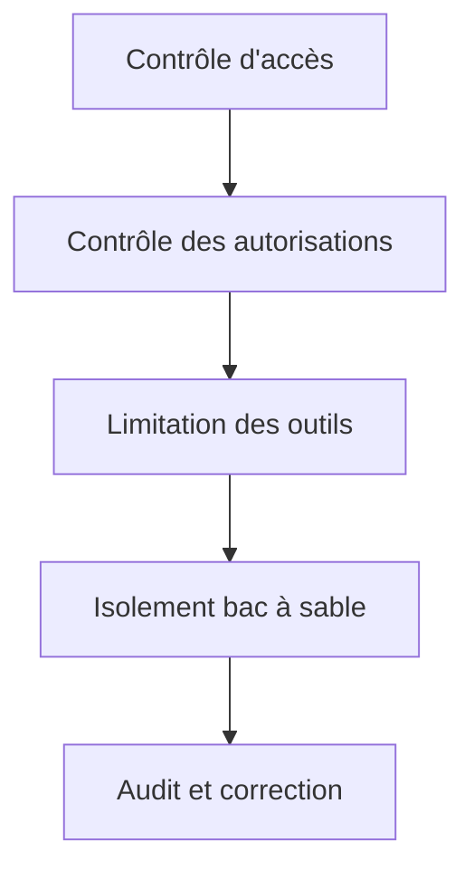

# Sécurité et isolation bac à sable : protéger votre assistant IA

## Ce que vous pourrez faire après ce cours

- Configurer des politiques de sécurité multicouches, du contrôle d'accès aux autorisations d'outils
- Utiliser l'isolement bac à sable pour limiter l'accès au système de fichiers et au réseau de votre assistant IA
- Exécuter des audits de sécurité, détecter et corriger les vulnérabilités courantes
- Ajuster le niveau de sécurité selon différents scénarios (personnel/famille/public)

## Votre problème actuel

Clawdbot rend votre assistant IA puissant, mais introduit de nouveaux défis de sécurité :

- **Accès Shell** : l'IA peut exécuter des commandes arbitraires, lire et écrire des fichiers
- **Accès réseau** : l'IA peut accéder à des URL et services arbitraires
- **Envoi de messages** : l'IA peut envoyer des messages à n'importe qui (si WhatsApp est configuré)
- **Contrôle à distance** : contrôler le navigateur local via les outils de navigateur
- **Exposition des données** : tout l'historique des conversations est stocké sur le disque

Sans protection appropriée, un modèle IA manipulé pourrait avoir des conséquences catastrophiques.

## Quand utiliser cette approche

- ✅ Vous avez besoin d'exécuter un assistant IA sur votre propre appareil et vous vous inquiétez des risques de sécurité
- ✅ Vous souhaitez exposer votre assistant IA à plusieurs utilisateurs (membres de la famille, équipe)
- ✅ Vous devez limiter l'accès de l'IA à des fichiers ou répertoires spécifiques
- ✅ Vous souhaitez isoler l'étendue d'accès pour différents utilisateurs/sessions
- ✅ Vous devez faire fonctionner l'assistant IA dans un environnement restreint (bac à sable)

::: info
**Concept important** : la sécurité est en couches, de "qui peut accéder" à "ce qu'il peut faire", et enfin "la sécurité du modèle".
:::

## 🎒 Préparatifs

### Vérifications préalables

- [x] A terminé le [démarrage rapide](../../start/getting-started/), comprend comment démarrer le Gateway
- [ ] A configuré au moins un modèle IA (Anthropic, OpenAI ou Ollama)
- [ ] Connaît votre scénario d'utilisation (personnel, partage familial, service public)
- [ ] Comprend les concepts de permissions de fichiers Linux (chmod)

### Outils recommandés

- Outil en ligne de commande : Terminal ou SSH
- Éditeur : votre éditeur de code préféré
- Docker : pour exécuter des conteneurs bac à sable (optionnel)

---

## Idée centrale

Le modèle de sécurité de Clawdbot repose sur une philosophie centrale : **contrôle d'accès en priorité, sécurité par limitation ensuite**.

### Couches de sécurité



1. **Contrôle d'accès** : détermine qui peut interagir avec votre assistant IA
2. **Contrôle des autorisations** : détermine quels outils votre assistant IA peut invoquer
3. **Isolement bac à sable** : détermine dans quel environnement les outils s'exécutent (hôte ou conteneur)
4. **Audit et correction** : vérification continue et correction de la configuration de sécurité

Cette conception en couches garantit que même si le modèle est manipulé, la portée de l'attaque est limitée aux frontières définies.

### Trois couches de protection du contrôle d'accès

Clawdbot offre trois couches de contrôle d'accès :

| Couche | Contenu protégé | Emplacement de configuration |
|--- | --- | ---|
| **Authentification Gateway** | Connexion WebSocket | `gateway.auth` |
| **Politique DM** | Messages privés | `channels.*.dmPolicy` |
| **Politique Group** | Messages de groupe | `channels.*.groupPolicy` / `channels.*.groups` |

Chaque couche peut être configurée indépendamment, formant une défense en profondeur.

---

## Audit de sécurité : détecter les risques

Clawdbot fournit des outils d'audit de sécurité intégrés pour détecter rapidement les vulnérabilités courantes.

### Exécuter l'audit

```bash
# Audit de base
clawdbot security audit

# Audit approfondi (inclut la détection de Gateway)
clawdbot security audit --deep

# Correction automatique des recommandations de sécurité
clawdbot security audit --fix
```

### Contenu de l'audit

L'outil d'audit vérifie les aspects suivants :

| Catégorie de vérification | Éléments spécifiques | Niveau de risque |
|--- | --- | ---|
| **Accès entrant** | Authentification Gateway, politique DM, politique Group | Critique / Avertissement |
| **Accès aux outils** | Liste autorisée exec élevé, allow/deny des outils | Critique / Avertissement |
| **Exposition réseau** | Mode de liaison Gateway, Tailscale Serve/Funnel | Critique / Info |
| **Contrôle du navigateur** | Authentification du navigateur distant, protocole URL | Critique / Avertissement |
| **Permissions de fichiers** | Permissions des fichiers de configuration, répertoire d'état | Critique / Avertissement |
| **Confiance des plugins** | Plugins non explicitement autorisés | Avertissement |

### Comprendre la sortie de l'audit

Le rapport d'audit est classé par niveau de gravité :

- **Critical (rouge)** : à corriger immédiatement, peut entraîner une exécution de code à distance ou une fuite de données
- **Warn (jaune)** : correction recommandée, réduit la frontière de sécurité
- **Info (bleu)** : information, pas de problème de sécurité

### Correction automatique

Lorsque vous utilisez le drapeau `--fix`, l'outil d'audit applique les corrections suivantes en toute sécurité :

- Remplacer `groupPolicy="open"` par `allowlist`
- Remplacer `logging.redactSensitive="off"` par `"tools"`
- Corriger les permissions de fichiers (fichiers de configuration 600, répertoires 700)

::: tip
**Meilleure pratique** : exécutez régulièrement l'audit, surtout après avoir modifié la configuration ou mis à jour le Gateway.
:::

---

## Contrôle d'accès : qui peut accéder à votre assistant IA

Le contrôle d'accès est la première ligne de défense, déterminant qui peut interagir avec votre assistant IA.

### Authentification Gateway

Par défaut, le Gateway nécessite une authentification pour accepter les connexions WebSocket.

#### Configurer le mode d'authentification

```json5
{
  "gateway": {
    "auth": {
      "mode": "token",  // ou "password"
      "token": "your-long-random-token-please-change-me"
    }
  }
}
```

**Modes d'authentification** :

| Mode | Usage | Scénario recommandé |
|--- | --- | ---|
| `token` | Jeton bearer partagé | La plupart des cas, recommandé |
| `password` | Authentification par mot de passe | Développement local, pratique pour tests rapides |
| Tailscale Identity | Tailscale Serve | Accès à distance via Tailscale |

::: warning
**Important** : si `gateway.bind` est défini sur non-loopback (comme `lan`, `tailnet`), vous devez configurer l'authentification, sinon les connexions seront refusées.
:::

### Politique DM : protection des messages privés

La politique DM contrôle si les utilisateurs inconnus peuvent interagir directement avec votre assistant IA.

| Politique | Comportement | Scénario recommandé |
|--- | --- | ---|
| `pairing` (défaut) | Expéditeur inconnu reçoit un code de couplage, aucun traitement avant couplage | Usage personnel, recommandé |
| `allowlist` | Expéditeur inconnu est refusé | Environnement de confiance multi-utilisateurs |
| `open` | Autorise tout le monde | Service public (nécessite `allowFrom` contenant `"*"`) |
| `disabled` | Ignore tous les messages privés | Utiliser uniquement les fonctionnalités de groupe |

#### Exemple de configuration

```json5
{
  "channels": {
    "whatsapp": {
      "dmPolicy": "pairing"
    },
    "telegram": {
      "dmPolicy": "allowlist",
      "allowFrom": ["user123", "user456"]
    }
  }
}
```

#### Gérer le couplage

```bash
# Voir les demandes de couplage en attente
clawdbot pairing list whatsapp

# Approuver le couplage
clawdbot pairing approve whatsapp <pairing code>
```

::: tip
**Meilleure pratique** : le mode `pairing` par défaut offre un bon équilibre entre expérience utilisateur et sécurité. N'utilisez `allowlist` ou `open` que si vous faites explicitement confiance à tous les utilisateurs.
:::

### Politique Group : contrôle des messages de groupe

La politique Group détermine comment votre assistant IA répond aux messages dans les groupes.

| Politique | Comportement | Emplacement de configuration |
|--- | --- | ---|
| `allowlist` | Accepte uniquement les groupes de la liste autorisée | `channels.whatsapp.groups` |
| `disabled` | Ignore tous les messages de groupe | `channels.telegram.groups` |
| `requireMention` | Répond uniquement lors d'une mention @ ou d'un déclencheur de commande | `channels.*.groups.*` |

#### Exemple de configuration

```json5
{
  "channels": {
    "whatsapp": {
      "groups": {
        "*": {
          "requireMention": true
        }
      }
    },
    "discord": {
      "guilds": {
        "your-guild-id": {
          "users": ["user1", "user2"]
        }
      }
    }
  }
}
```

::: tip
**Meilleure pratique** : activez `requireMention` dans les groupes publics pour éviter que votre assistant IA ne soit manipulé par des utilisateurs malveillants.
:::

### Isolement de session : éviter les fuites de contexte

Par défaut, tous les messages privés sont acheminés vers la même session principale. Lorsque plusieurs utilisateurs peuvent accéder à l'assistant IA, cela peut entraîner des fuites de contexte.

```json5
{
  "session": {
    "dmScope": "per-channel-peer"  // Créer une session distincte pour chaque canal-expéditeur
  }
}
```

---

## Contrôle des autorisations d'outils : limiter ce que l'IA peut faire

Le contrôle des autorisations d'outils est la deuxième ligne de défense, déterminant quels outils votre assistant IA peut invoquer.

### Listes Allow/Deny d'outils

Vous pouvez configurer globalement ou par Agent des listes blanches et noires d'outils.

```json5
{
  "agents": {
    "defaults": {
      "tools": {
        "allow": ["read", "write", "web_search"],
        "deny": ["exec", "browser", "web_fetch"]
      }
    },
    "list": [
      {
        "id": "read-only",
        "tools": {
          "allow": ["read"],
          "deny": ["write", "edit", "apply_patch", "exec", "browser"]
        }
      }
    ]
  }
}
```

### Catégories d'outils courants

| Catégorie d'outils | Outils spécifiques | Niveau de risque |
|--- | --- | ---|
| **Opérations de fichiers** | `read`, `write`, `edit`, `apply_patch` | Moyen |
| **Exécution Shell** | `exec`, `process` | Élevé |
| **Contrôle du navigateur** | `browser` | Élevé |
| **Accès réseau** | `web_search`, `web_fetch` | Moyen |
| **Visualisation Canvas** | `canvas` | Moyen |
| **Opérations de nœuds** | `nodes_invoke` | Élevé |
| **Tâches Cron** | `cron` | Moyen |
| **Envoi de messages** | `message`, `sessions_*` | Faible |

### Mode Elevated : échappatoire pour l'exécution sur l'hôte

Elevated exec est une échappatoire spéciale qui permet aux outils de s'exécuter sur l'hôte, en contournant le bac à sable.

```json5
{
  "tools": {
    "elevated": {
      "enabled": true,
      "allowFrom": {
        "whatsapp": ["your-trusted-user-id"]
      },
      "security": "allowlist",
      "ask": "on"  // Demander confirmation avant chaque exécution
    }
  }
}
```

::: danger
**Avertissement important** : Elevated exec contourne les limitations du bac à sable. Activez-le uniquement si vous faites entièrement confiance aux utilisateurs et scénarios autorisés.
:::

::: tip
**Meilleure pratique** : pour la plupart des scénarios, désactivez elevated exec et comptez sur l'isolement bac à sable et des listes blanches d'outils strictes.
:::

---

## Isolement bac à sable : exécuter dans un environnement restreint

L'isolement bac à sable fait fonctionner les outils dans des conteneurs Docker, limitant l'accès au système de fichiers et au réseau.

### Modes de bac à sable

| Mode | Comportement | Scénario recommandé |
|--- | --- | ---|
| `off` | Tous les outils s'exécutent sur l'hôte | Environnement personnel de confiance |
| `non-main` (recommandé) | Session principale sur l'hôte, autres sessions dans le bac à sable | Équilibre performance et sécurité |
| `all` | Toutes les sessions dans le bac à sable | Environnement multi-utilisateurs, service public |

```json5
{
  "agents": {
    "defaults": {
      "sandbox": {
        "mode": "non-main"
      }
    }
  }
}
```

### Accès à l'espace de travail

L'accès à l'espace de travail détermine quels répertoires de l'hôte le conteneur bac à sable peut voir.

| Niveau d'accès | Comportement | Scénario recommandé |
|--- | --- | ---|
| `none` (défaut) | Espace de travail bac à sable `~/.clawdbot/sandboxes` | Isolement maximum |
| `ro` | Espace de travail de l'agent monté en lecture seule sur `/agent` | Lire mais ne pas écrire de fichiers |
| `rw` | Espace de travail de l'agent monté en lecture/écriture sur `/workspace` | Agents nécessitant l'écriture de fichiers |

```json5
{
  "agents": {
    "defaults": {
      "sandbox": {
        "workspaceAccess": "none"
      }
    }
  }
}
```

### Portée du bac à sable

La portée du bac à sable détermine la granularité de l'isolement des conteneurs.

| Portée | Comportement | Nombre de conteneurs |
|--- | --- | ---|
| `session` (défaut) | Un conteneur par session | Plus de conteneurs, meilleur isolement |
| `agent` | Un conteneur par Agent | Équilibre isolement et ressources |
| `shared` | Toutes les sessions partagent un conteneur | Économise les ressources, isolement minimum |

### Configuration Docker

```json5
{
  "agents": {
    "defaults": {
      "sandbox": {
        "docker": {
          "image": "clawdbot-sandbox:bookworm-slim",
          "containerPrefix": "clawdbot-sbx-"
        }
      }
    }
}
```

### Montages personnalisés

Vous pouvez monter des répertoires supplémentaires de l'hôte dans le conteneur bac à sable.

```json5
{
  "agents": {
    "defaults": {
      "sandbox": {
        "docker": {
          "binds": [
            "/home/user/source:/source:ro",
            "/var/run/docker.sock:/var/run/docker.sock"
          ]
        }
      }
    }
  }
}
```

::: warning
**Conseil de sécurité** : les montages contournent l'isolement du système de fichiers du bac à sable. Les montages sensibles (comme docker.sock) doivent utiliser le mode `:ro` (lecture seule).
:::

### Navigateur bac à sablé

Le navigateur bac à sablé exécute l'instance Chrome dans un conteneur, isolant les opérations du navigateur.

```json5
{
  "agents": {
    "defaults": {
      "sandbox": {
        "browser": {
          "enabled": true,
          "autoStart": true,
          "autoStartTimeoutMs": 10000
        }
      }
    }
  }
}
```

::: tip
**Meilleure pratique** : le navigateur bac à sablé empêche l'assistant IA d'accéder aux sessions de connexion et données sensibles de votre navigateur quotidien.
:::

---

## Configuration de sécurité multi-Agent

Différents Agents peuvent avoir des configurations de sécurité différentes.

### Exemples de scénarios

#### Scénario 1 : Agent personnel (confiance totale)

```json5
{
  "agents": {
    "list": [
      {
        "id": "personal",
        "sandbox": { "mode": "off" },
        "tools": {
          "allow": ["*"],
          "deny": []
        }
      }
    ]
  }
}
```

#### Scénario 2 : Agent familial (lecture seule)

```json5
{
  "agents": {
    "list": [
      {
        "id": "family",
        "workspace": "~/clawd-family",
        "sandbox": {
          "mode": "all",
          "scope": "agent",
          "workspaceAccess": "ro"
        },
        "tools": {
          "allow": ["read"],
          "deny": ["write", "edit", "apply_patch", "exec", "browser"]
        }
      }
    ]
  }
}
```

#### Scénario 3 : Agent public (bac à sable + restrictions strictes)

```json5
{
  "agents": {
    "list": [
      {
        "id": "public",
        "workspace": "~/clawd-public",
        "sandbox": {
          "mode": "all",
          "scope": "agent",
          "workspaceAccess": "none"
        },
        "tools": {
          "allow": ["web_search", "sessions_list"],
          "deny": ["read", "write", "edit", "apply_patch", "exec", "browser", "web_fetch", "canvas", "nodes", "cron", "gateway", "image"]
        }
      }
    ]
  }
}
```

---

## Dockerisation : isolement complet du Gateway

En plus du bac à sable au niveau des outils, vous pouvez exécuter tout le Gateway dans un conteneur Docker.

### Avantages de la dockerisation complète

- Isolement complet du processus Gateway
- Évite d'installer des dépendances sur l'hôte
- Facilite le déploiement et la gestion
- Fournit une frontière de sécurité supplémentaire

::: tip
Quand utiliser la dockerisation vs bac à sable d'outils :
- **Bac à sable d'outils** : la plupart des scénarios, équilibre performance et sécurité
- **Dockerisation** : environnement de production, déploiement multi-tenant, isolement complet nécessaire
:::

### Référence d'installation Docker

Pour des instructions détaillées d'installation Docker, veuillez consulter : [Options de déploiement](../../appendix/deployment/).

---

## Pièges à éviter

### Erreurs courantes

#### ❌ Oublier de configurer l'authentification Gateway

**Configuration erronée** :
```json5
{
  "gateway": {
    "bind": "lan"  // Dangereux !
    "auth": {}
  }
}
```

**Conséquence** : quiconque peut se connecter à votre réseau local peut contrôler votre assistant IA.

**Configuration correcte** :
```json5
{
  "gateway": {
    "bind": "loopback",  // ou configurer une authentification forte
    "auth": {
      "mode": "token",
      "token": "your-secure-token"
    }
  }
}
```

#### ❌ Utiliser `dmPolicy: "open"` mais oublier `allowFrom`

**Configuration erronée** :
```json5
{
  "channels": {
    "whatsapp": {
      "dmPolicy": "open"  // Dangereux !
    }
  }
}
```

**Conséquence** : n'importe qui peut envoyer des messages à votre assistant IA.

**Configuration correcte** :
```json5
{
  "channels": {
    "whatsapp": {
      "dmPolicy": "open",
      "allowFrom": ["*"]  // Doit autoriser explicitement
    }
  }
}
```

#### ❌ Activer Elevated exec sans configurer allowFrom

**Configuration erronée** :
```json5
{
  "tools": {
    "elevated": {
      "enabled": true  // Dangereux !
    }
  }
}
```

**Conséquence** : tout utilisateur peut exécuter des commandes sur l'hôte.

**Configuration correcte** :
```json5
{
  "tools": {
    "elevated": {
      "enabled": true,
      "allowFrom": {
        "discord": ["your-user-id"]  // Limiter les utilisateurs autorisés
      },
      "security": "allowlist",
      "ask": "on"  // Exiger confirmation
    }
  }
}
```

#### ❌ Utiliser le mode lecture/écriture pour les montages sensibles

**Configuration erronée** :
```json5
{
  "agents": {
    "defaults": {
      "sandbox": {
        "docker": {
          "binds": [
            "/var/run/docker.sock:/var/run/docker.sock"  // Dangereux !
          ]
        }
      }
    }
  }
}
```

**Conséquence** : le bac à sable peut contrôler le démon Docker.

**Configuration correcte** :
```json5
{
  "agents": {
    "defaults": {
      "sandbox": {
        "docker": {
          "binds": [
            "/var/run/docker.sock:/var/run/docker.sock:ro"  // Lecture seule
          ]
        }
      }
    }
}
```

### Résumé des meilleures pratiques

| Pratique | Raison |
|--- | ---|
| Utiliser le mode `pairing` par défaut | Équilibre expérience utilisateur et sécurité |
| Utiliser `requireMention` pour les messages de groupe | Éviter d'être manipulé |
| Utiliser des listes blanches d'outils plutôt que des listes noires | Principe du moindre privilège |
| Activer le bac à sable mais définir `workspaceAccess: "none"` | Isolement de l'accès à l'espace de travail |
| Exécuter régulièrement l'audit de sécurité | Surveillance continue de la sécurité |
| Stocker les clés sensibles dans des variables d'environnement ou fichiers de configuration | Éviter les fuites dans le code |

---

## Résumé du cours

Ce cours a présenté le modèle de sécurité et les fonctionnalités d'isolement bac à sable de Clawdbot :

**Points clés** :

1. **Couches de sécurité** : contrôle d'accès → contrôle des autorisations → isolement bac à sable → audit et correction
2. **Contrôle d'accès** : authentification Gateway, politique DM, politique Group
3. **Autorisations d'outils** : listes allow/deny, mode Elevated
4. **Isolement bac à sable** : mode, portée, accès à l'espace de travail, configuration Docker
5. **Audit de sécurité** : `clawdbot security audit` détecte et corrige les problèmes

**Principe de sécurité avant tout** :
- Commencez par les privilèges minimums, ne les assouplissez que si nécessaire
- Utilisez l'isolement bac à sable pour limiter la portée des attaques
- Auditez et mettez à jour régulièrement la configuration
- Soyez prudent avec les fonctionnalités sensibles (comme Elevated exec)

---

## Aperçu du prochain cours

> Le prochain cours nous apprendrons le **[Gateway distant et Tailscale](../remote-gateway/)**.
>
> Vous apprendrez :
> > - Exposer le Gateway à votre Tailnet via Tailscale Serve
> > - Accès public via Tailscale Funnel (avec prudence)
> > - Configuration de tunnel SSH et proxy inverse
> > - Meilleures pratiques de sécurité pour l'accès distant

---

## Annexe : référence du code source

<details>
<summary><strong>Cliquer pour voir les emplacements du code source</strong></summary>

> Dernière mise à jour : 2026-01-27

| Fonctionnalité | Chemin du fichier | Lignes |
|--- | --- | ---|
| Audit de sécurité | [`src/security/audit.ts`](https://github.com/clawdbot/clawdbot/blob/main/src/security/audit.ts#L1-L910) | 1-910 |
| Correction de sécurité | [`src/security/fix.ts`](https://github.com/clawdbot/clawdbot/blob/main/src/security/fix.ts#L1-L385) | 1-385 |
| Vérification des permissions de fichiers | [`src/security/audit-fs.ts`](https://github.com/clawdbot/clawdbot/blob/main/src/security/audit-fs.ts) | Fichier entier |
| Schéma de configuration Gateway | [`src/config/zod-schema.core.ts`](https://github.com/clawdbot/clawdbot/blob/main/src/config/zod-schema.core.ts) | Fichier entier |
| Schéma des défauts Agent | [`src/config/zod-schema.agent-defaults.ts`](https://github.com/clawdbot/clawdbot/blob/main/src/config/zod-schema.agent-defaults.ts) | 1-172 |
| Schéma Bac à sable | [`src/config/zod-schema.agent-runtime.ts`](https://github.com/clawdbot/clawdbot/blob/main/src/config/zod-schema.agent-runtime.ts) | 82-511 |
| Gestion du bac à sable | [`src/agents/sandbox.ts`](https://github.com/clawdbot/clawdbot/blob/main/src/agents/sandbox.ts) | Fichier entier |
| Analyse de configuration bac à sable | [`src/agents/sandbox/config.js`](https://github.com/clawdbot/clawdbot/blob/main/src/agents/sandbox/config.js) | Fichier entier |
| Configuration Docker | [`src/agents/sandbox/docker.js`](https://github.com/clawdbot/clawdbot/blob/main/src/agents/sandbox/docker.js) | Fichier entier |
| Documentation sécurité | [`docs/gateway/security.md`](https://github.com/clawdbot/clawdbot/blob/main/docs/gateway/security.md) | Fichier entier |
| Documentation bac à sable | [`docs/gateway/sandboxing.md`](https://github.com/clawdbot/clawdbot/blob/main/docs/gateway/sandboxing.md) | Fichier entier |
| CLI Bac à sable | [`docs/cli/sandbox.md`](https://github.com/clawdbot/clawdbot/blob/main/docs/cli/sandbox.md) | Fichier entier |

**Champs de configuration clés** :

```typescript
// Configuration Bac à sable
sandbox: {
  mode: "off" | "non-main" | "all",  // Mode bac à sable
  workspaceAccess: "none" | "ro" | "rw",  // Accès à l'espace de travail
  scope: "session" | "agent" | "shared",  // Portée du bac à sable
  docker: {
    image: string,  // Image Docker
    binds: string[],  // Montages de l'hôte
    network: "bridge" | "none" | "custom"  // Mode réseau
  },
  browser: {
    enabled: boolean,  // Si le navigateur est bac à sablé
    autoStart: boolean,  // Démarrage automatique
  },
  prune: {
    idleHours: number,  // Suppression automatique après inactivité
    maxAgeDays: number,  // Jours maximum de conservation
  }
}

// Autorisations d'outils
tools: {
  allow: string[],  // Outils autorisés
  deny: string[],  // Outils refusés
  elevated: {
    enabled: boolean,  // Si l'exécution sur l'hôte est activée
    allowFrom: {  // Liste autorisée par canal
      [provider: string]: string[] | number[]
    },
    security: "deny" | "allowlist" | "full",  // Politique de sécurité
    ask: "off" | "on-miss" | "always",  // Politique de confirmation
  }
}

// Politique DM
dmPolicy: "pairing" | "allowlist" | "open" | "disabled"

// Politique Group
groupPolicy: "allowlist" | "open" | "disabled"
```

**Constantes clés** :

- `DEFAULT_SANDBOX_IMAGE`: `"clawdbot-sandbox:bookworm-slim"` - Image bac à sable par défaut
- `DEFAULT_SANDBOX_COMMON_IMAGE`: Image bac à sable commune par défaut

**Fonctions clés** :

- `runSecurityAudit()`: exécuter l'audit de sécurité
- `fixSecurityFootguns()`: appliquer les corrections de sécurité
- `resolveSandboxConfigForAgent()`: analyser la configuration bac à sable de l'Agent
- `buildSandboxCreateArgs()`: construire les arguments de création de conteneur bac à sable

</details>
